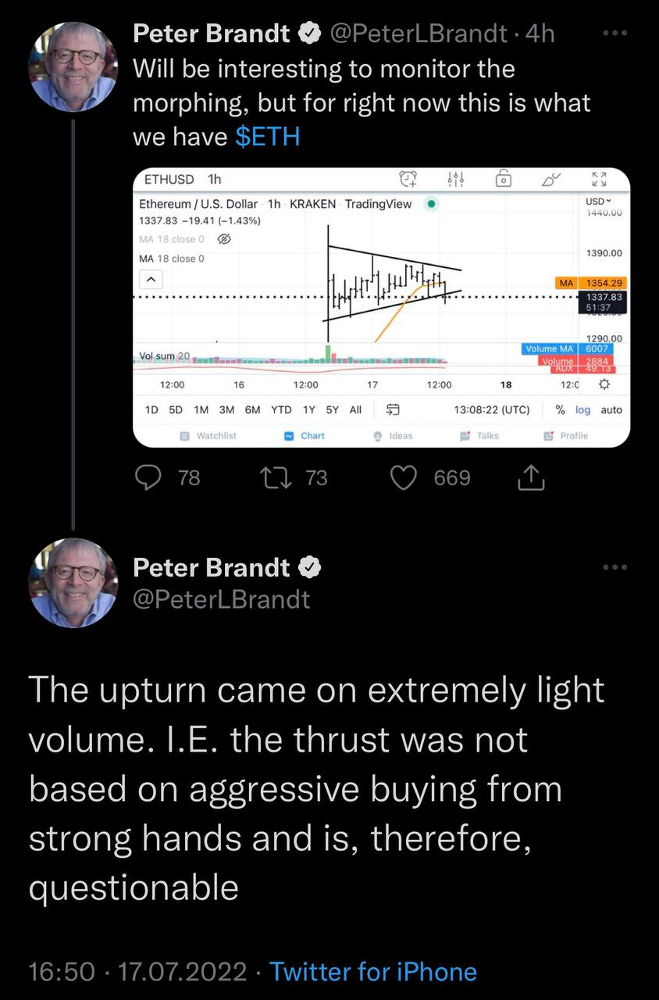
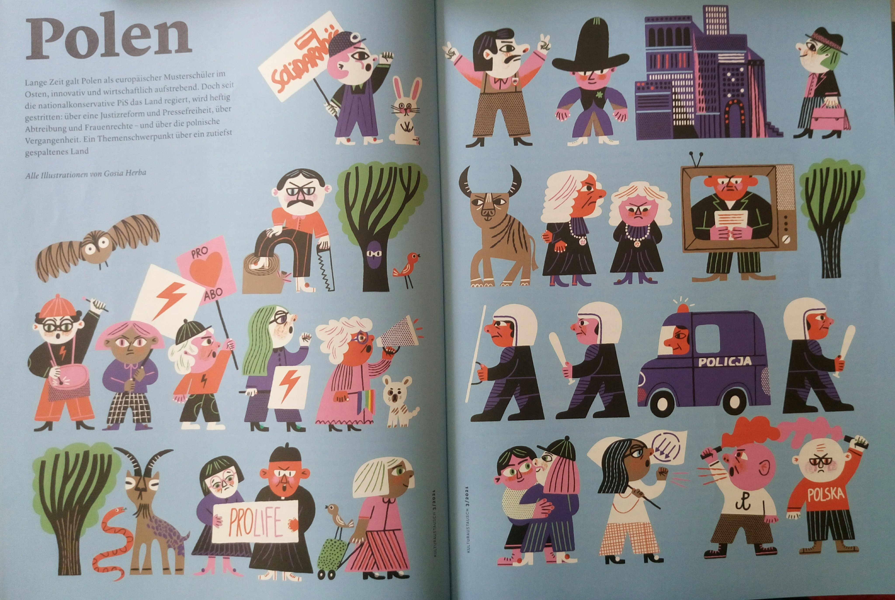
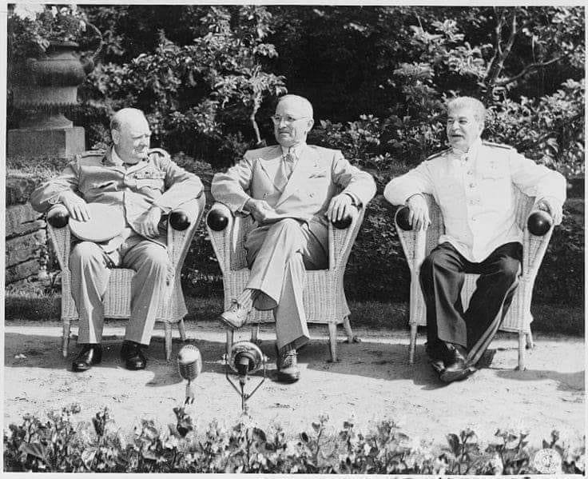
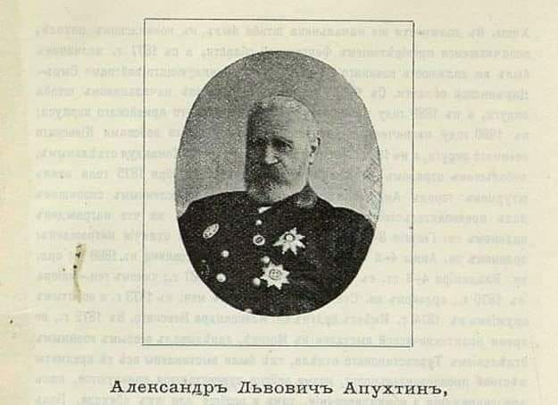

### 2023

<video width="640" height="480" controls>
<source src="./movies/july/investing.mp4" type="video/mp4">
Your browser does not support the video tag.
</video>

---

<video width="640" height="480" controls>
<source src="./movies/july/albert-pfizer.mp4" type="video/mp4">
Your browser does not support the video tag.
</video>

---

<video width="640" height="480" controls>
<source src="./movies/july/biden2.mp4" type="video/mp4">
Your browser does not support the video tag.
</video>

---

Integracja

  

### 2022

  

### 2021

Tak wygląda Polska dla redakcji "Zeitschrift für internationalen Kulturaustausch",  wydany przez Institut für Auslandsbeziehungen.

  

### 2020 - Wzrost cen w Polsce jest najwyższy od 19 lat

Inflacja bazowa, czyli taka po wyłączeniu najbardziej chwiejnych komponentów cen żywności i energii, w czerwcu 2020 r. wyniosła nad Wisłą 4,1 proc., wobec 3,8 proc. miesiąc wcześniej - podał Narodowy Bank Polski. To oznacza, że wzrost cen jest najwyższy od grudnia 2001 r.

NBP przedstawił najważniejsze dane na temat czerwcowej inflacji. W zeszłym miesiącu w relacji rok do roku inflacja po wyłączeniu cen żywności i energii (czyli inflacja bazowa wyniosła 4,1 proc., wobec 3,8 proc. miesiąc wcześniej). To oznacza, że wzrost cen nad Wisłą jest najszybszy od grudnia 2001 r. 

> „Inflacja jest tą formą podatku, którą można nałożyć bez ustawy.” Milton Friedman

### 2010

<video width="640" height="480" controls>
<source src="./movies/july/cykle.mp4" type="video/mp4">
Your browser does not support the video tag.
</video>

### 1945

W Poczdamie rozpoczęła się trwająca do 2 sierpnia 1945 roku konferencja pokojowa. 
Stronę polską reprezentowali tacy  przedstawiciele Tymczasowego Rządu Jedności Narodowej jak:Edward Osóbka Morawski, Bolesław Bierut i Michał Rola -Żymierski.
Władze polskie przedstawiły na tej konferencji memoriał, w krórym między innymi czytamy:

> Prawa historyczne Polski: Dzieje historyczne od X wieku wykazują, iż Polska mocno stała nad Odrą [...], a w pewnych okresach znacznie ją przekraczała. Dopiero od XIII wieku poczęła tracić swe zachodnie rubieże pod naciskiem germańskim. (...) Polska dąży do swych naturalnych granic, które stanowią: na południu Sudety i Karpaty, na północy wybrzeże Bałtyku, a na zachodzie Odra i Nysa. Obszar w ten sposób wyznaczony tworzy zwartą jednostkę geograficzną, związaną dorzeczami Wisły i Odry, skierowaną naturalnymi drogami ku Bałtykowi.

Na tej samej konferencji prezydent Stanów Zjednoczonych Harry Truman i brytyjski minister spraw zagranicznych Ernest Bevin zażądali od Stalina wycofania wojsk radzieckich z Polski.
Konferencja poczdamska ustaliła ukaranie zbrodniarzy hitlerowskich (tzw. proces norymberski ), przyjęła radziecki program w kwestiach wschodniej granicy Niemiec.

  

Na zdjęciu: Churchill, Truman i Stalin.
### 1917

https://en.wikipedia.org/wiki/House_of_Windsor

### 1879

Stanowisko kuratora Warszawskiego Okręgu Szkolnego objął Aleksander Apuchtin (zdjęcie). 
W ciągu ośmiu lat sprawowania władzy, człowiekowi temu udało się stworzyć system oświatowy zwany "Nocą apuchtinowską", oparty na bezwględnej rusyfikacji szkolnictwa w Królestwie Kongresowym. System ten w znacznej mierze polegał zmuszaniu polskich uczniów i nauczycieli na wzajemnym donoszeniu na siebie. 
Apuchtin odpowiadał również za wprowadzenie do nauczania książki do historii autorstwa Dmitrija Iłowajskiego, gloryfikującej rolę Imperium Rosyjskiego i usprawiedliwiającej rozbiory Polski. 
Bezwzględna polityka Apuchtina przynosiła skutek. Od 1885 roku w języku polskim wykładana była wyłącznie religia, a Królestwie Kongresowym szerzył się analfabetyzm, dodatkowo polska kultura była w odwrocie.
Dodajmy, że jednym z ulubionych powiedzeń Apuchtina były słowa: "Matka Polka zawodzić będzie nad kołyską dziecka rosyjską piosenką".

  

---

<a href="https://github.com/TomaszWaszczyk/historia.waszczyk.com/edit/master/src/content/july-17.md" target="_blank">Edytuj tę stronę dzieląc się własnymi notatkami!</a>
