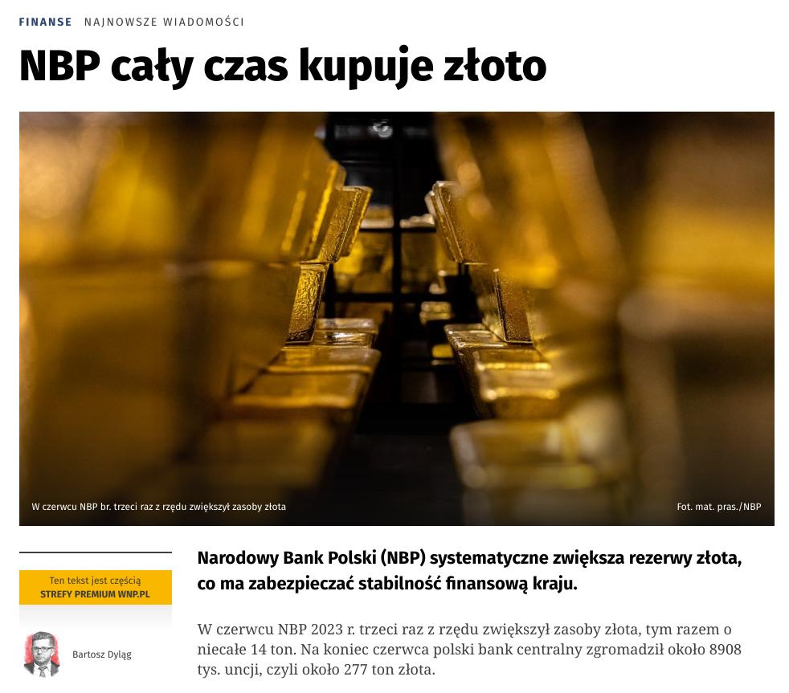
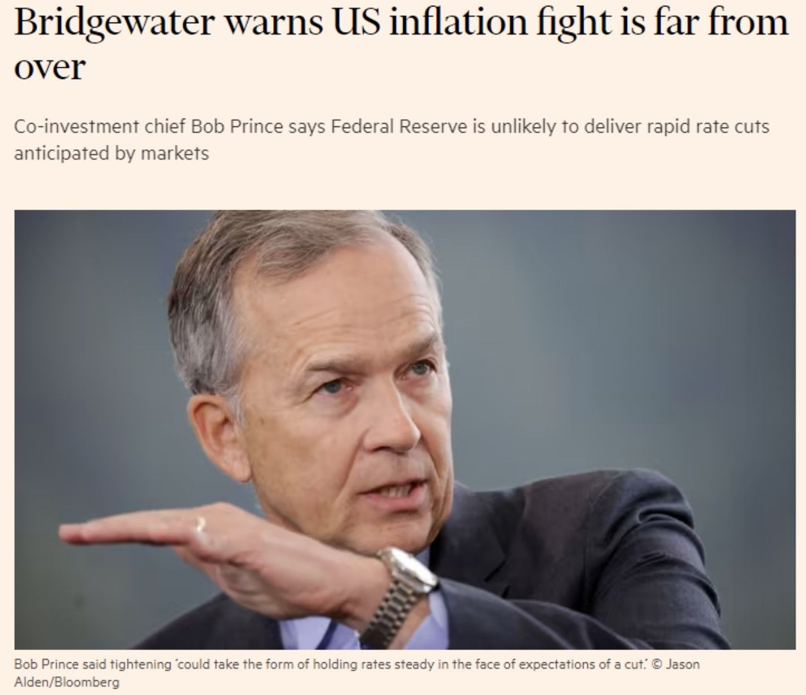
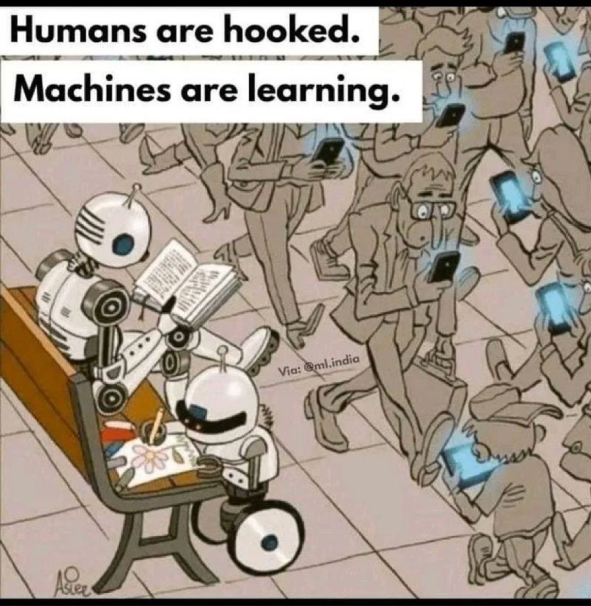

### 2023

> The dollar is dying. India and the UAE have signed an agreement allowing them to trade in Indian rupees instead of the US dollar.

  

Central banks buys gold (hedge to survive)

  

"stabilność finansową kraju" powinno być "funkcjonowanie banku centralnego na Wisłą". Banki centralne bez złota (i nie tylko) upadną więc muszą skupować złoty pieniądz (a nie kredytowy).

Przed nami szok monetarny, kiedy znaczna część społeczeństw zostanie (dosłownie mówiąc) bez śródków do życia. Przy pomocy sterowania podażą można by teoretycznie ustalić jaki procent przestanie mieć dostęp do pieniądza fiducjarnego, ale nie ma szans żebym to zrobił. Zakładam, że jest pewnym, że przed nami shit show taki, że o C19 będziemy marzyć - "lockdown climate" albo inne gówno. Dziel i rządź - bez Jaruzelskiego 2.0 chyba się nie obejdzie nad Wisłą.

Biorąc pod uwagę środki NBP i banku centralnego Ukrainy wydaje się (na siłę) rozwiązaniem połączenie obu tych instytucji, wtedy między innymi transakcjami repo powinny zachować płynność (i podległa ludność), ale i tak bez dekarbonizacji się to nie zepnie. Efektem ubocznym to likwidacja (sterowana) życia społecznego (oczywiście to proces globalny a nie lokalny). Jedynie lokalne potwierdzenie ;p

Właściwie to można by ten proces nazwać działaniami wojennymi (narzuconymi przez Bazylea) gdzie orężem jest zdolność kognitywna i płynność. Ma rację:

  

Największa fala utraty wartości zadrukowanego papieru jest zdecydowanie PRZED nami. Lud natomiast stracił zdolność do jakiegokolwiek/autonomicznego myślenia.

  

<video width="640" height="480" controls>
<source src="./movies/july/Putinflacja.mp4" type="video/mp4">
Your browser does not support the video tag.
</video>

---

> Kryzys nieruchomości w Niemczech? Ceny mieszkań tąpnęły o 13,1%!

---

> The Bank of England warned that some 4 million households will face a sharp increase in mortgage costs, with the average borrower paying almost £3,000 a year more.

---

### 1972

W Browarze Warszawskim rozpoczęto produkcję popularnego amerykańskiego napoju Coca -Cola.
Stało się to za sprawą umowy licencyjnej, którą z Amerykanami podpisał rząd Edwarda Gierka.
Chociaż napój powstawał już w Polsce to butelki sprowadzano początkowo z Holandii i Hiszpanii. Rosnące zapotrzebowanie sprawiło, że w roku 1976 Huta Szkła "Wołomin" rozpoczęła ich produkcję.
W roku 1982 Agnieszka Osiecka wymyśliła pierwsze polskie hasło reklamujące Coca-Colę "Coca -Cola to jest to!"

  

### 1941

W Warszawie Niemcy zorganizowali pierwszy uliczny pokaz filmu propagandowego. Akcja ta zakończyła się jednak kompletnym fiaskiem z przyczyn typowo manipulacyjnych.
Poniżej przedstawiam relację Józefa Dąbrowy -Sierzputowskiego, mieszkańca Warszawy:
"Megafony uliczne zachęcały warszawiaków do wzięcia udziału w tej imprezie. Wieczorem na kilku ekranach, zainstalowanych między innymi przed Dworcem Głównym, w parku Ujazdowskim i na Rynku Starego Miasta, dość licznie zgromadzonej publiczności zaprezentowano reportaż z walk na froncie wschodnim. Incydent, który definitywnie pokrzyżował plany Urzędu Propagandy, zdarzył się bodajże przed Dworcem Głównym. W momencie gdy na ekranie pojawiły się ochotnicze, pochodzące z różnych krajów legiony antybolszewickie, biorące udział w wojnie po stronie Niemców, spiker zwrócił się do widzów z pytaniem: „A gdzie Polacy?”. Z tłumu padła błyskawiczna odpowiedź: „W Oświęcimiu”
Grafika przedstawia plakat niemieckiego filmu propagandowego pt "Zwycięstwo, albo bolszewizm".

  

### 1870

https://en.wikipedia.org/wiki/Franco-Prussian_War

### 1848

Seneca Falls Declaration of Sentiments, signed in 1848.

In 1920, 100 years ago today, the 19th Amendment was ratified and women won the right to vote.

  

---

<a href="https://github.com/TomaszWaszczyk/historia.waszczyk.com/edit/master/src/content/july-19.md" target="_blank">Edytuj tę stronę dzieląc się własnymi notatkami!</a>
