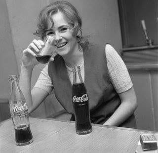
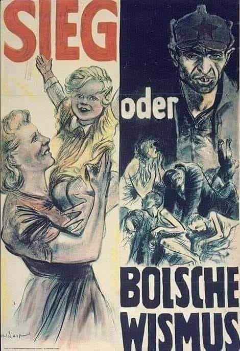

### 1972

W Browarze Warszawskim rozpoczęto produkcję popularnego amerykańskiego napoju Coca -Cola.
Stało się to za sprawą umowy licencyjnej, którą z Amerykanami podpisał rząd Edwarda Gierka.
Chociaż napój powstawał już w Polsce to butelki sprowadzano początkowo z Holandii i Hiszpanii. Rosnące zapotrzebowanie sprawiło, że w roku 1976 Huta Szkła "Wołomin" rozpoczęła ich produkcję.
W roku 1982 Agnieszka Osiecka wymyśliła pierwsze polskie hasło reklamujące Coca-Colę "Coca -Cola to jest to!"

  

### 1941

W Warszawie Niemcy zorganizowali pierwszy uliczny pokaz filmu propagandowego. Akcja ta zakończyła się jednak kompletnym fiaskiem z przyczyn typowo manipulacyjnych.
Poniżej przedstawiam relację Józefa Dąbrowy -Sierzputowskiego, mieszkańca Warszawy:
"Megafony uliczne zachęcały warszawiaków do wzięcia udziału w tej imprezie. Wieczorem na kilku ekranach, zainstalowanych między innymi przed Dworcem Głównym, w parku Ujazdowskim i na Rynku Starego Miasta, dość licznie zgromadzonej publiczności zaprezentowano reportaż z walk na froncie wschodnim. Incydent, który definitywnie pokrzyżował plany Urzędu Propagandy, zdarzył się bodajże przed Dworcem Głównym. W momencie gdy na ekranie pojawiły się ochotnicze, pochodzące z różnych krajów legiony antybolszewickie, biorące udział w wojnie po stronie Niemców, spiker zwrócił się do widzów z pytaniem: „A gdzie Polacy?”. Z tłumu padła błyskawiczna odpowiedź: „W Oświęcimiu”
Grafika przedstawia plakat niemieckiego filmu propagandowego pt "Zwycięstwo, albo bolszewizm".

  

### 1870

https://en.wikipedia.org/wiki/Franco-Prussian_War

### 1848

Seneca Falls Declaration of Sentiments, signed in 1848.

In 1920, 100 years ago today, the 19th Amendment was ratified and women won the right to vote.

  

---

<a href="https://github.com/TomaszWaszczyk/historia.waszczyk.com/edit/master/src/content/july-19.md" target="_blank">Edytuj tę stronę dzieląc się własnymi notatkami!</a>
