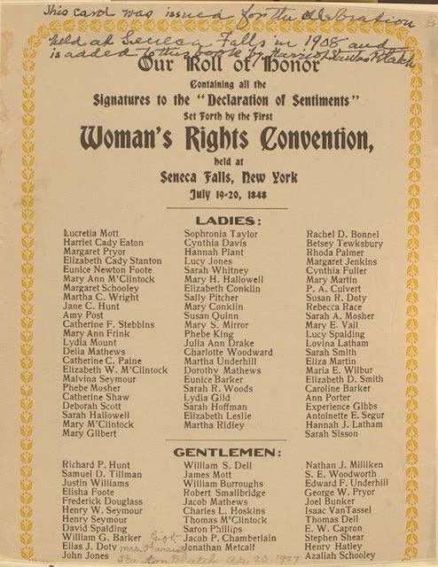

### 1870

https://en.wikipedia.org/wiki/Franco-Prussian_War

### 1848

Seneca Falls Declaration of Sentiments, signed in 1848.

In 1920, 100 years ago today, the 19th Amendment was ratified and women won the right to vote.

  

---

<a href="https://github.com/TomaszWaszczyk/historia.waszczyk.com/edit/master/src/content/july-19.md" target="_blank">Edytuj tę stronę dzieląc się własnymi notatkami!</a>
