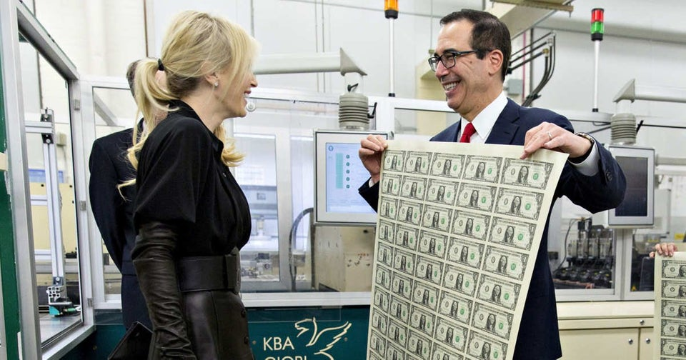
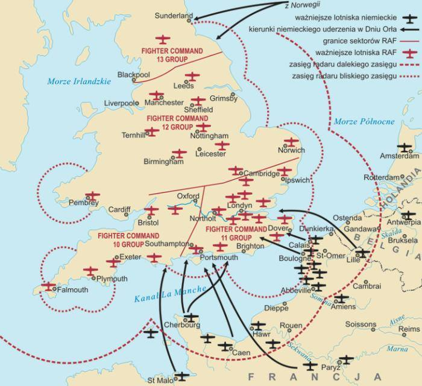
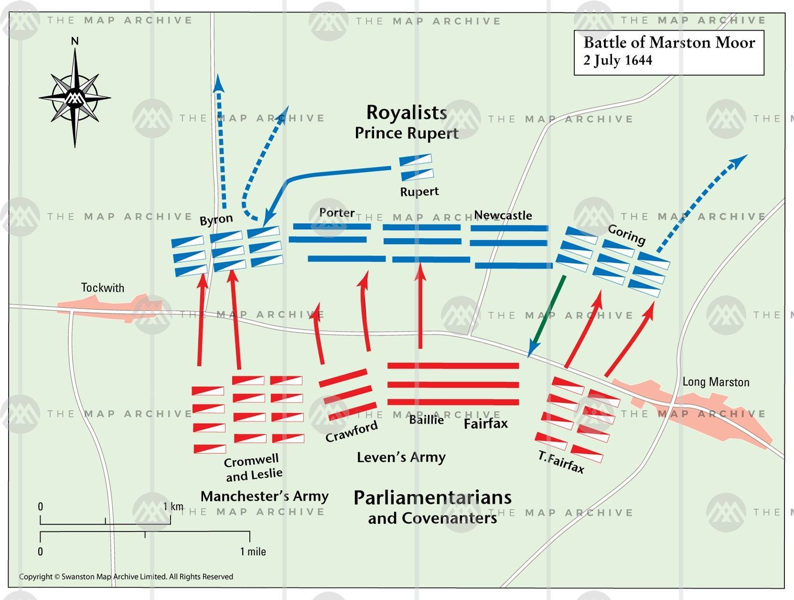

### 2023

Shortly: The FED is underwater and this is serious problem for every individual around the world!

Jerome Powell stated that the losses being incurred by the Federal Reserve are "just paper losses...it's just an accounting effect".

What? These are REAL losses, Mr Powell.

Since the Fed last raised interest rates it has been paying 5% to depositors whilst only earning around 2.8% on its portfolio of Treasury bonds and mortgage-backed securities. That means it is making REAL losses, not PAPER ones.

Here is the context from Mr Powell's testimony to the Senate Banking Committee a week ago after a question from Senator Scott:

Mr Scott:  "You have an 8 trillion balance sheet and beyond.  Every report I have read is that your bond portfolio, our bond portfolio, the Fed, is underwater as well. Can you talk to me about the losses that you’re experiencing at the Fed?".

Powell: "For many years we have been earning a spread. And we’ve been sending money to the Treasury. Way over a trillion dollars since QE started. And, so, now that rates have gone back up to five percent, that process has reversed. These are paper losses and they have absolutely no effect on our ability to conduct monetary policy or really on the economy it’s just an accounting effect.....The Treasury will have to borrow money that it doesn’t get,(or raise taxes). But it’s not going to raise interest rates…much."

  

<video width="640" height="480" controls>
<source src="./movies/july/powel.mp4" type="video/mp4">
Your browser does not support the video tag.
</video>

### 2022

  

### 2020

  

  

---

Likwidacja limitu długu publicznego? Młodzi ekonomiści są na "tak"

#### Grupa młodych ekonomistów proponuje likwidację konstytucyjnego limitu długu publicznego, który ich zdaniem ogranicza możliwości rozwojowe Polski – czytamy w czwartkowym wydaniu "Rzeczpospolitej"

Ekonomiści z think tanku Instrat w liście otwartym napisali, że odważna polityka gospodarcza jest możliwa. "Dziś istotną barierą rozwojową dla Polski jest ustanowiony w konstytucji arbitralny próg zadłużenia, który może uniemożliwić prowadzenie przez państwo polityki prorozwojowej, uwzględniającej wyzwania infrastrukturalnej luki inwestycyjnej, polityki mieszkaniowej czy transformacji energetycznej ku neutralności klimatycznej" – czytamy w liście, cytowanym przez gazetę.

"Rz" podała, że pod ich apelem o usunięcie z ustawy zasadniczej zapisu, który obliguje Polskę do utrzymywania długu publicznego poniżej 60 proc. PKB, podpisało się ponad 20 ekonomistów, głównie z młodego pokolenia.

Gazeta napisała, że w następstwie pandemii Covid-19 i wywołanej przez nią recesji dług publiczny Polski zbliży się do konstytucyjnego limitu. "Sygnatariusze listu oceniają, że w tej sytuacji w kolejnych latach przywiązanie do tego limitu może wymagać prowadzenia restrykcyjnej polityki fiskalnej, co może spotęgować widoczne już dzisiaj problemy społeczne, takie jak niedostępność mieszkań, niedofinansowanie służby zdrowia oraz upowszechnienie pozakodeksowych form zatrudnienia" - czytamy.

Dziennik wskazał, że autorzy listu zwracają też uwagę na to, co od początku pandemii budzi sporo emocji: konstytucyjny limit odnosi się do długu wedle krajowej definicji, którą rząd może swobodnie zmieniać. „Na skutek zastosowania rozmaitych sztuczek księgowych już dziś całkowita wartość długu publicznego może przekraczać limity zapisane w konstytucji" - dodają.

Według nich nie ma powodów, aby Polska przestrzegała unijnego limitu długu publicznego, który również wynosi 60 proc. PKB. "Te regulacje również są arbitralne i nie są dla Polski obowiązkowe. Ani traktat z Maastricht, ani tzw. sześciopak dotyczący zarządzania gospodarczego nie nakładają tych zobowiązań na kraje spoza strefy euro" – powiedział "Rz" Jan Zygmuntowski z think tanku Instrat.

Jego zdaniem, to że polski rząd może dziś pożyczać na rynkach rekordowo tanio, świadczy o tym, że także inwestorzy nie mają obaw o stabilność finansów publicznych Polski - napisała gazeta.

"Rz" przytacza także opinię dr Wojciecha Paczosa, ekonomisty z Uniwersytetu w Cardiff, który listu nie podpisał. "Problem z wiarygodnością może się jednak pojawić. Raz podniesiony limit długu może być podnoszony ponownie, aż straci moc" - powiedział gazecie. "Tłumaczy również, że w obecnym układzie politycznym dodatkowa przestrzeń fiskalna może nie być efektywnie wykorzystana" - napisała gazeta.

"Zamiast sztywnego limitu długu, który odbiera rządowi jakiekolwiek pole manewru, proponujemy choćby stworzenie na wzór 40 innych krajów rady fiskalnej, złożonej z przedstawicieli związków zawodowych i branżowych, organizacji pozarządowych i naukowców, która ustalałaby priorytety i opiniowała określone wydatki prezydentowi RP" – cytuje "Rz" Jana Zygmuntowskiego.

### 1966

Żuk

Do biedronki przyszedł żuk,
W okieneczko puk-puk-puk.
Panieneczka widzi żuka:
"Czego pan tu u mnie szuka?"
Skoczył żuk jak polny konik,
Z galanterią zdjął melonik
I powiada: "Wstań, biedronko,
Wyjdź, biedronko, przyjdź na słonko.
Wezmę ciebie aż na łączkę
I poproszę o twą rączkę"
Oburzyła się biedronka:
"Niech pan tutaj się nie błąka,
Niech pan zmiata i nie lata,
I zostawi lepiej mnie,
Bo ja jestem piegowata,
A pan - nie!"
Powiedziała, co wiedziała,
I czym prędzej odleciała,
Poleciała, a wieczorem
Ślub już brała - z muchomorem,
Bo od środka aż po brzegi
Miał wspaniałe, wielkie piegi.
Stąd nauka
Jest dla żuka:
Żuk na żonę żuka szuka.

2 lipca 1966 roku w Warszawie zmarł Jan Brzechwa (właściwie Jan Wiktor Lesman) - żydowski poeta, satyryk, a także tłumacz literatury rosyjskiej. Jako 22 latek wstąpił do 36 Pułku Piechoty Legii Akademickiej i jako ochotnik uczestniczył w latach 1920-1921 w wojnie polsko-bolszewickiej. Jan Brzechwa z zawodu był adwokatem oraz specjalistą w dziedzinie prawa autorskiego. Był twórcą popularnych liryczno-groteskowych utworów dla dzieci i młodzieży (Kaczka dziwaczka, Akademia Pana Kleksa). Artysta tworzył także wiersze i powieści wspomnieniowe (Gdy owoc dojrzewa). W latach 50. tworzył socrealistyczne wiersze propagandowe, gloryfikujące partię oraz socjalizm. W latach późniejszych zaprzestał angażowania się w sprawy politycznej. Jan Brzechwa został pochowany na Cmentarzu Wojskowym na Powązkach w Warszawie.

  

---

### 1947

W miejscowości Roswell w amerykańskim stanie Nowy Meksyk rzekomo rozbiło się UFO.

Zimna wojna, która rozpoczęła się wkrótce po pokonaniu Niemiec i Japonii, sprawiła, że wielu Amerykanów z niepokojem patrzyło w niebo, a dowództwo Sił Powietrznych USA nie lekceważyło żadnej informacji o obiektach pojawiających się w amerykańskiej strefie powietrznej. Każdy z nich mógł się okazać samolotem szpiegowskim albo jakąś tajną sowiecką bronią. Ale latem 1947 r. analitycy wojskowi stanęli przed trudnym zadaniem, bo doniesień o dziwnych obiektach na niebie przybywało z dnia na dzień.

Niepokojące sygnały:

24 czerwca w okolicach Mount Rainer w stanie Waszyngton Kenneth Arnold, który pilotował mały samolot, ujrzał dziewięć dysków lecących, jak ocenił, z prędkością ponad 1900 km/godz. Ze względu na ich niezwykłe akrobacje uznał, że to nowe zdalnie sterowane samoloty testowe lub obiekty nie z tej planety.

26 czerwca w rejonie Wielkiego Kanionu w Arizonie lekarz Leon Oetinger z Lexington i trzej inni świadkowie obserwowali srebrny obiekt kulisty poruszający się z dużą prędkością.

28 czerwca kapitan F. Dvyn lecący w okolicy Alamogordo w Nowym Meksyku dostrzegł ognistą kulę, za którą ciągnęła się płonąca błękitna smuga. Kula nagle rozpłynęła się w powietrzu.

Tylko w czerwcu i lipcu 1947 r. takich informacji odnotowano ponad 100, a najbardziej niepokojące mówiły o pojawieniu się dziwnych obiektów w okolicach baz wojskowych. Dlatego 10 lipca biuro Departamentu Wywiadu Sił Powietrznych w Pentagonie zwróciło się do jednostek wojskowych i FBI o pomoc w zbieraniu danych na temat pojazdów latających niewiadomego pochodzenia.

W poszukiwaniu UFO:

30 lipca porucznik George Garrett z Pentagonu po przeanalizowaniu 16 doniesień na ten temat sporządził raport, z którego wynikało, że wszyscy świadkowie - często osoby z wykształceniem technicznym - mówiły o zaobserwowaniu obiektów bardzo zaawansowanych pod względem lotniczym. Garrett uznał, że chodzi o nowe amerykańskie samoloty, ale kiedy FBI zwróciło się do lotnictwa z pytaniem, czy ma maszyny nowej generacji, odpowiedź brzmiała: nie.

30 grudnia 1947 r. uruchomiony został projekt "Sign", którego celem było sprawdzanie doniesień o niezidentyfikowanych obiektach latających (unidentified flying object - UFO). Podzielono je na cztery kategorie: dyski, obiekty w kształcie cygara, balonu i świetlistych kul. To właśnie wtedy nazwę UFO, która początkowo określała wszystkie pojazdy nieznanego pochodzenia, zaczęto kojarzyć ze statkami kosmicznymi obcych.

Według autorów raportu "Sign" na niebie pojawiały się obiekty, które nie były ani radzieckimi, ani amerykańskimi samolotami i mogły być pochodzenia pozaziemskiego. Ponieważ jednak raport nie zawierał żadnych dowodów na powyższe tezy, Pentagon go odrzucił. Po dwóch latach "Sign" zastąpił projekt "Grudge". W tym wypadku poszukiwania zakończyły się konkluzją, że prawie wszystkie obserwowane pojazdy to chmury lub inne naturalne zjawiska. Ale te badania także zamknięto ze względu na "lekceważące podejście do tematu".

W 1952 r. uruchomiony został projekt "Blue Book" do badania UFO i ich ewentualnego zagrożenia dla USA. Trwał do 1969 r., a z 12 618 informacji o niezidentyfikowanych obiektach latających (uznanych za gwiazdy, chmury lub zwykłe samoloty) aż 701 przypadków pozostało niewyjaśnionych.

W raporcie podsumowującym można przeczytać, że zaobserwowane niezidentyfikowane obiekty nie zagrażają bezpieczeństwu USA, nie ma dowodów na to, że swoim rozwojem technologicznym wykraczają poza dostępną na Ziemi wiedzę, a więc nie można mówić o pojazdach pozaziemskich cywilizacji.

A jednak ponad połowa Amerykanów sądzi, że Ziemię odwiedzają przybysze z innych planet, a rząd ukrywa prawdę. Przekonanie to jest szczególnie silne po wydarzeniach w Roswell w stanie Nowy Meksyk w roku 1947, gdzie według wielu świadków miał się rozbić statek kosmiczny.

Coś spadło z nieba:

Na szczątki rzekomego wraku trafił rolnik William "Mac" Brazel zatrudniony na ranczu Fosterów w pobliżu miasta Corona oddalonego od Roswell o 120 km. 3 lub 4 lipca 1947 r. (data ta różni się w zależności od źródeł), objeżdżając ranczo po burzy, która przeszła poprzedniej nocy, dostrzegł na polu wiele dziwnie wyglądających przedmiotów. Pokrywały one obszar o długości ok. 1000 i szerokości 600 m.

Brazel zabrał ich trochę do domu, żeby pokazać rodzinie i sąsiadom. Były wśród nich kawałki cienkiego metalu przypominającego mocną, matową folię, belka z niezwykle lekkiego i twardego materiału z fioletowymi hieroglifami podobnymi do figur geometrycznych, a także cienka nić podobna do żyłki wędkarskiej. Kiedy uniosło się ją do światła, promienie przechodziły z jednego końca na drugi.

Brazel skojarzył odkrycie z pobliską bazą sił powietrznych w Roswell i dlatego 6 lipca zawiadomił o znalezisku szeryfa w Chaves County, a ten zadzwonił do majora Jessego Marcela z 509. Dywizjonu Bombowego w Roswell.

- Kiedy zjawiliśmy się na miejscu, zdumiał nas ogrom zniszczeń - wspominał mjr Marcel. - To nie było coś, co uderzyło w podłoże lub eksplodowało na ziemi. To coś musiało wybuchnąć jeszcze w powietrzu, przemieszczając się prawdopodobnie z wielką prędkością. Stało się dla mnie oczywiste, że nie chodziło o balon pogodowy, samolot czy pocisk - twierdził Marcel, oficer wywiadu po szkole techniki radarowej.

Zebrawszy trochę szczątków, w drodze powrotnej do bazy Marcel wpadł do domu i choć była 1 w nocy, obudził żonę i syna, aby pokazać im znalezisko.

Jesse Marcel junior miał wtedy 11 lat, a to, co zapamiętał, opisał po latach w książce "Roswell. Prawdziwa historia". W pudle ojca były trzy rodzaje materiału: coś, co przypominało folię, połamane kawałki czarnobrązowego plastiku i cienkie listewki podobne do dwuteowników. Plastik wyglądał jak bakelit lub płyta gramofonowa, ale był znacznie lżejszy. Listewki okazały się tak twarde, że nie dawały się ani zgiąć, ani złamać, a przy tym niemal nie czuło się ich ciężaru w rękach. Znajdowały się na nich fioletowe napisy przypominające egipskie hieroglify, ale bez motywów zwierzęcych. Folia z kolei była bardzo mocna, nie można jej było przerwać ani spalić, a po zgnieceniu wracała do poprzedniego kształtu bez śladu zarysowań.

Wojsko potwierdza...

Następnego dnia żołnierze otoczyli ranczo Fosterów i dokładnie przeszukali teren. Jeszcze w trakcie poszukiwań, 8 lipca 1947 r., dowódca bazy lotnictwa w Roswell pułkownik William Blanchard zlecił porucznikowi Walterowi Hautowi, oficerowi prasowemu, przekazanie prasie następującego oświadczenia: "Liczne pogłoski dotyczące latającego dysku zostały potwierdzone, kiedy służby wywiadowcze 509. Dywizjonu Bombowego przy współpracy jednego z okolicznych farmerów i biura szeryfa w Chaves County weszły wczoraj w jego posiadanie. () Natychmiast podjęto odpowiednie działania i dysk został zabrany z farmy. Badano go w bazie wojskowej w Roswell, a następnie () przekazano do naczelnego dowództwa".

Do naczelnego dowództwa, czyli do Wright-Patterson Field w Dayton w Ohio, gdzie - jak podejrzewają ufolodzy - do dziś ukryte są szczątki rozbitego statku.

Wiadomość ta błyskawicznie obiegła świat i wywołała sensację.

...i zaprzecza

Przeczesywanie terenu trwało kilka dni, ale cokolwiek tam jeszcze znaleziono, prasa już się o tym nie dowiedziała. Generał Roger Ramey, dowódca bazy Fort Worth w Teksasie, ponoć na polecenie Waszyngtonu zablokował dalsze informacje. Poprzednie zaś zdementował, stwierdzając, że pierwsze doniesienia o znalezieniu szczątków dysku były nieprawdziwe i wynikały z atmosfery podniecenia w związku z pojawianiem się w ostatnich dniach wielu niezwykłych obiektów na niebie. A w okolicach Roswell - mówił gen. Ramey - spadł balon meteorologiczny typu Rawin i to jego szczątki odnalazł rolnik.

Na konferencji prasowej z udziałem swojego adiutanta, pułkownika DuBose'a, Ramey miał pokazać szczątki balonu znalezione rzekomo na ranczu Fosterów. Dziennikarze nie wydawali się przekonani, a "Washington Post" napisał wprost o tuszowaniu informacji. Próby rozmów ze świadkami spełzły jednak na niczym. Pułkownik Blanchard, który kazał opublikować notatkę prasową, wyjechał na urlop, major Jesse Marcel został sfotografowany ze szczątkami prawdziwego balonu meteorologicznego i nabrał wody w usta, a rolnik "Mac" Brazel przepraszał za swoją pomyłkę. Jego sąsiad twierdził, iż "Mac" spędził kilka dni w areszcie, a żołnierze zabrali z jego domu wszystkie szczątki, jakie zebrał z pola. Współwłaściciel stacji radiowej KGFL w Roswell nie wyemitował nagranego już wywiadu z Brazelem, bo - jak mówił - odebrał telefon z Waszyngtonu, że może za to stracić licencję.

Małe ciała z dużymi głowami:

Sprawa przycichła na 31 lat, aż w 1978 r. wrócił do niej dziennikarz i fizyk nuklearny Stanton Friedman. Przeprowadził wywiady ze świadkami tamtych wydarzeń i ich bliskimi, ale ustalenie, kiedy, gdzie i co naprawdę zdarzyło się latem 1947 r. w Nowym Meksyku, okazało się bardzo trudne. Zdaniem jednych na ranczu Fosterów znaleziono rozbity pojazd pozaziemski, a 1,5 km dalej - ciała obcych. Według innych w Roswell zebrano tylko części, które odpadły ze statku, a sam latający spodek wbił się w zbocze góry w okolicy Plains of San Agustin, ok. 400 km na zachód od Roswell. Tam też farmerzy mieli odkryć ciała czterech obcych, z których jeden jeszcze żył.

Wezwany na miejsce fotograf wojskowy miał powiedzieć Friedmanowi, że w namiocie na polu widział ciała obcych, których "głowy były nieproporcjonalnie duże w stosunku do małych korpusów". Major Jesse Marcel, jeden z pierwszych na miejscu wypadku, mówił, że żadnych ciał nie widział, ale przytaczał opowieść kapitana Oliviera Hendersona, który samolotem C-54 (lub B-29) transportował szczątki do bazy we Wright-Patterson. Ten miał twierdzić, że obcy byli niscy, mieli bardzo duże głowy, bladą skórę i skośne oczy.

Friedman usłyszał też od Marcela, że historia z balonem została zmyślona, a szczątki z pola Fosterów miały pochodzenie pozaziemskie, ponieważ metalu tego nie dało się zniszczyć. - Robiliśmy wszystko, by go złamać, nie mogliśmy go rozedrzeć ani przeciąć, uderzaliśmy w niego ośmiokilogramowym młotem, ale na kawałku metalu nie pojawiło się nawet jedno wklęśnięcie.

Marcel twierdził też, że kiedy przywiózł szczątki do generała Rameya i obaj na chwilę wyszli z pokoju, ktoś je podmienił na fragmenty balonu meteorologicznego, który pokazano dziennikarzom.

Dawny adiutant Rameya, pułkownik DuBose, także miał przyznać, że balon był mistyfikacją zorganizowaną na szybko, żeby "ugasić pożar".

Z kolei porucznik Haut przed śmiercią miał zeznać pod przysięgą, że widział i statek, i ciała, a w lipcu 1947 r. wydał tak szybko jednoznaczny komunikat dla prasy, bo miejscowi i tak wiedzieli, co się stało. Ujawnił też, że nieopodal pierwszego miejsca katastrofy żołnierze znaleźli drugie, gdzie było znacznie więcej szczątków.

Czy macie dziecięce trumny?

Ale najbardziej wpływała na wyobraźnię opowieść Glenna Dennisa z zakładu pogrzebowego w Roswell, który miał odebrać telefon z bazy wojskowej z pytaniem, czy są hermetycznie zamykane dziecięce trumny. Kolejny telefon z bazy dotyczył metod zabezpieczania ciał częściowo uszkodzonych po wypadku i tego, jakie chemikalia zastosować, aby nie zmienić składu tkanek i krwi.

Dennis sądził, że chodzi o wypadek lotniczy z udziałem VIP-ów, ale kiedy przyjechał do szpitala z rannym lotnikiem (był także kierowcą karetki pogotowia), zatrzymała go znajoma pielęgniarka Naomi Maria Self i poradziła, by się wynosił, jeśli nie chce mieć kłopotów. Następnego dnia miała mu powiedzieć, że uczestniczyła w sekcji istot o drobnych ciałach, szczupłych, długich rękach i dłoniach z czterema palcami, bez kciuka. Głowy miały duże, w miejscu nosa dwa otwory, usta wąskie, bez zębów i języka. Ich poparzone ciała wydzielały tak silną i nieprzyjemną woń, że lekarze przerwali sekcję. Kiedy Dennis próbował się z nią później kontaktować, usłyszał, że wyjechała do Anglii.

Balony i manekiny:

Odpowiadając na te doniesienia i petycje o ujawnienie akt sprawy, rząd USA przyznał w 1995 r., że w kwestii "incydentu z Roswell" nie mówił prawdy. Wśród szczątków znalezionych przez Brazela znajdowały się fragmenty tarczy radarowej i płótna balonowego, ale nie zwykłego balonu meteorologicznego, tylko urządzenia ze ściśle tajnego programu "Mogul". Chodziło w nim o śledzenie radzieckich prób jądrowych za pomocą balonów wyposażonych w mikrofony wychwytujące sygnały akustyczne.

Kiedy i to nie zadowoliło ufologów, władze lotnicze opublikowały kolejny raport z informacjami o innych projektach sił powietrznych, m.in. operacji "Pułap", tajnego programu z lat 50. służącego testowaniu spadochronów stratosferycznych z wykorzystaniem antropomorficznych manekinów. Manekiny - jak twierdził rząd - łatwo było wziąć za kosmitów, bo miały twarze pozbawione wyrazu i jednoczęściowe kombinezony.

Wspomniano także o programie "Excelsior", w ramach którego przeprowadzano próby z pierwszymi załogowymi balonami stratosferycznymi, badając wpływ skoków ze stratosfery na organizm człowieka. Piloci byli wynoszeni w gondolach na wysokość 30 km, a następnie opadali na testowanym spadochronie. W 1959 r. podczas takiego testu doszło do wypadku - gondola balonu przechyliła się i pilot uderzył o ziemię głową, która bardzo mu spuchła. Glenn Dennis odwoził go do szpitala. Może więc - jak sugerowano - wziął rannego lotnika-baloniarza za kosmitę?

Władze podważyły też istnienie pielęgniarki Naomi Marii Self, ponieważ kobiety o takim nazwisku nie było ani w spisie kadry szpitala w Roswell, ani w spisie mieszkańców miasteczka. Dennis przyznał wtedy, że ukrył jej tożsamość, co całkowicie podważyło jego wersję.

Po latach FBI i CIA przyznały też, że same rozpowszechniały plotki o UFO, żeby ukryć loty testowe samolotu szpiegowskiego U-2.

Tajne notatki:

Dzięki ustawie Freedom of Information Act zezwalającej na pełny lub częściowy dostęp do materiałów i informacji wcześniej niejawnych i kontrolowanych przez rząd USA ufolodzy wykryli dokumenty stwierdzające, że zaraz po "incydencie w Roswell" na polecenie prezydenta Harry'ego Trumana powstała tajna organizacja Majestic-12, która prowadziła dochodzenie w sprawie UFO i utajniała wszelkie pojawiające się na ten temat informacje. Potwierdzał to odnaleziony w archiwach list prezydenta Trumana. Kiedy jednak 6 grudnia 2010 r. FBI odtajniło archiwalne dokumenty dotyczące Majestic-12, miały one stempel "bogus", czyli "podrobione".

Ufolodzy wskazują jednak na inne odnalezione notatki, jak teleks wysłany do FBI w Cincinnati z biura Fort Worth 8 lipca 1947 r., w którym niejaki major Curtan z 8. Armii Powietrznej donosi o odnalezieniu w pobliżu Roswell latającego talerza o heksagonalnym kształcie, podwieszonego do balonu o średnicy 6 m. Zdaniem nadawcy teleksu obiekt przypominał balon stratosferyczny z reflektorem radarowym, ale rozmowa telefoniczna z bazą lotniczą w Roswell nie potwierdziła jego przypuszczeń.

Ciekawe jest też zdjęcie z 1947 r., na którym gen. Ramey trzyma telegram do góry nogami. Tekst jest niewyraźny, ale ufolodzy zapewniają, że zdołali go częściowo odczytać i jest w nim mowa o odnalezieniu nowego talerza i ofiar katastrofy. A skoro pada słowo "ofiary", to - jak podkreślają - nie może być mowy o katastrofie bezzałogowego balonu.

W odtajnionych w 2011 r. aktach FBI miała się też znaleźć notatka informatora sił powietrznych, że w Nowym Meksyku odkryto trzy rozbite latające talerze - okrągłe, z podniesioną częścią centralną i trzema ciałami w środku. Przypominały ludzi, ale były niskiego wzrostu, miały metaliczne kombinezony z materiału o bardzo mocnym splocie i były obandażowane, tak jak czasem ziemscy piloci testowi. W 2013 r. FBI oświadczyło, że ta notatka powielała plotkę i nigdy nie była sprawdzana przez Biuro.

Naukowcy po stronie UFO:

Stanton Friedman w książce "Katastrofa w Coronie" (Corona była bliżej farmy Fosterów niż Roswell) pyta, po co wielu prominentnych ludzi miałoby kłamać, że widziało latający talerz i ofiary wypadku, a tym samym narażać na szwank swoje dobre imię? Walter Haut, Jesse Marcel czy pułkownik William Blanchard byli żołnierzami elitarnego 509. Dywizjonu Bombowego, tego samego, którego lotnicy zrzucili bomby atomowe na Hiroszimę i Nagasaki. Stanowili starannie wyselekcjonowaną grupę ludzi, w której odpowiedzialność i trzeźwość ocen nie można wątpić - twierdzi Friedman.

Do wspierających teorię o katastrofie UFO w Roswell należał też pułkownik Philip Corso, podczas wojny w Korei oficer wywiadu, potem członek Narodowej Rady Bezpieczeństwa w administracji prezydenta Dwighta Eisenhowera i szef departamentu do badania obcych technologii przy Pentagonie. Corso napisał, jak został zaangażowany do badania szczątków statku kosmicznego, który rozbił się pod Roswell, i do czego doprowadziły odkrycia zaangażowanych w to naukowców. Jego zdaniem dzięki zbadaniu technologii pozaziemskich ludzkość dysponuje dziś laserami, światłowodami, noktowizorami czy włóknem kewlarowym. Corso utrzymywał też, że widział ciała obcych przechowywane w tajnej Strefie 51 na pustyni Nevada, i potwierdzał istnienie zespołu Majestic-12.

O naukowcach, którzy badali przejęte szczątki, wspominał już w latach 50. znany wówczas fizyk Robert Sarbacher zajmujący wysokie stanowisko w Departamencie Obrony. Mieli się tym zajmować m.in. Vannevar Bush, konstruktor analogowych maszyn liczących i twórca idei sieci komputerowych, John von Neumann, matematyk, odkrywca teorii gier, oraz Robert Oppenheimer, jeden z twórców bomby atomowej. Sarbacher słyszał też od kolegów w Pentagonie, że maszyny pozaziemskie skonstruowano z bardzo lekkich i twardych materiałów.

- Ktoś powiedział mi też, że ciała obcych przypominały budową owady i tylko dlatego mogły znieść przeciążenia wywołane przyspieszeniem podczas lotu. Nie rozumiem tylko - powtarzał w wywiadach udzielanych w latach 80. - dlaczego rząd opatrzył te badania klauzulą najwyższej wagi i nadal zaprzecza istnieniu pozaziemskich pojazdów.

Swoje trzy grosze do dyskusji dorzucił też słynny, cierpiący na stwardnienie zanikowe boczne fizyk Steven Hawking, który wierzy w istnienie przybyszy z kosmosu. Wprawdzie ich nie widział, ale przestrzega przed nimi, bo mogą się okazać bardziej podobni do bohatera "Obcego" niż do E.T. i spotkanie z nimi może nie wyjść ludzkości na dobre.

  

### 1941

Jednostka Einsatzgruppe zakończyła pierwszy pogrom ludności żydowskiej we Lwowie.
W rozporządzeniu wydanym przez Reinharda Heydricha 31 lipca 1939 roku czytamy:
"Zadaniem Specjalnych Oddziałów Operacyjnych Policji Bezpieczeństwa jest zwalczanie wszelkich elementów wrogich Rzeszy i antyniemieckich w kraju nieprzyjacielskim na tyłach walczących wojsk"

### 1940

II wojna światowa: Adolf Hitler wydał rozkaz opracowania planu uderzenia na Wyspy Brytyjskie (operacja „Lew Morski”).

Wielka Brytania w planach Hitlera zajmowała miejsce szczególne: w zamian za uznanie dominacji Rzeszy w Europie i na morzach dyktator dobrotliwie pozwoliłby Brytyjczykom zachować kolonie. Nie uśmiechało mu się marnowanie dużej liczby żołnierzy i sprzętu na zdobywanie Wyspy – przewidywane straty byłyby zbyt duże, a niebawem czekała go dużo poważniejsza rozprawa z Sowietami. Owe pozornie łagodne podejście Hitler tłumaczył też względami ideologicznymi. Anglicy mentalnie mieli jakoby przejawiać najlepsze cnoty narodu germańskiego. W połowie lipca Berlin śle więc noty dyplomatyczne utrzymane w pojednawczym jak na Trzecią Rzeszę tonie. Ale Londyn nie odpowiada – z Winstonem Churchillem na czele rządu Anglia będzie się bronić dalej. Trzeba ją zatem zniszczyć.

Nie da się zneutralizować Wielkiej Brytanii bez inwazji lądowej. Przygotowania do operacji „Seelöwe” (Lew morski) nabrały tempa po 16 lipca 1940 roku. Zaplanowany na połowę września 1940 roku desant miały przeprowadzać grupy armii niedawno podbijające Francję. Udane lądowanie miało się zakończyć zniszczeniem głównych sił brytyjskich i okupacją południowej Anglii oraz jej portów. Był jednak problem. Otóż silna brytyjska flota i lotnictwo posłałyby cały niemiecki desant na dno kanału La Manche. Liżąca rany po kampanii norweskiej Kriegsmarine ustępuje zaś liczebnie i jakościowo marynarce brytyjskiej. Należało więc najpierw zdobyć panowanie w powietrzu. Mająca wolne ręce Luftwaffe poradziłaby sobie potem z brytyjską flotą. Kluczowe było zniszczenie lotnictwa myśliwskiego. Pozbawione osłony brytyjskie bombowce nie będą już groźne.

Nie da się zneutralizować Wielkiej Brytanii bez inwazji lądowej. Przygotowania do operacji „Seelöwe” (Lew morski) nabrały tempa po 16 lipca 1940 roku. Zaplanowany na połowę września 1940 roku desant miały przeprowadzać grupy armii niedawno podbijające Francję. Udane lądowanie miało się zakończyć zniszczeniem głównych sił brytyjskich i okupacją południowej Anglii oraz jej portów. Był jednak problem. Otóż silna brytyjska flota i lotnictwo posłałyby cały niemiecki desant na dno kanału La Manche. Liżąca rany po kampanii norweskiej Kriegsmarine ustępuje zaś liczebnie i jakościowo marynarce brytyjskiej. Należało więc najpierw zdobyć panowanie w powietrzu. Mająca wolne ręce Luftwaffe poradziłaby sobie potem z brytyjską flotą. Kluczowe było zniszczenie lotnictwa myśliwskiego. Pozbawione osłony brytyjskie bombowce nie będą już groźne.

Anglicy doskonale zdawali sobie sprawę z własnej słabości. Najgorzej wyglądała sytuacja w siłach lądowych. Członkowie pospolitego ruszenia – Home Guard, z braku lepszych możliwości uzbrajani byli w halabardy czy muzealne karabiny. RAF (Królewskie Siły Powietrzne), choć znakomicie wyposażony, w walkach we Francji poniósł straty i ustępował liczebnie Luftwaffe. Najistotniejsze było zatem stosowanie zasady ekonomii sił, reagowania na powietrzne ataki ściśle wyliczoną liczbą maszyn w precyzyjnie określonym momencie. Niemcy za wszelką cenę chcieli dopaść brytyjskie myśliwce, te zaś, skupiając się na niemieckich bombowcach, miały za wszelką cenę unikać eskortujących myśliwców.

Anglicy pokładali ufność (i słusznie) w wynalazku, który zmienił wojnę – radarze. Do lipca 1940 r. łańcuch stacji radiolokacyjnych pokrył całe południowe i wschodnie wybrzeże Wyspy. Ważną rolę spełniały też gęsto rozstawione posterunki obserwacji wzrokowej i nasłuchu radiowego. Angielskie myśliwce walczyły u siebie, to wzmacniało morale pilotów. Nie obawiali się oni o paliwo. Zestrzeleni, o ile udało się uniknąć ran i szczęśliwie lądować ze spadochronem, jeszcze tego samego dnia trafiali do macierzystych jednostek i mogli walczyć dalej.

W tłumaczeniach nazw pododdziałów wojsk lotniczych Luftwaffe i RAF panuje mętlik. Podobnie brzmiącymi terminami w różnych krajach określano jednostki o różnej liczebności, składzie, podległości. Niemiecki Geschwader jest zatem tłumaczony jako skrzydło, pułk, dywizja lotnicza lub nawet dywizjon. Dlatego lepiej pozostać przy oryginalnej nazwie. W czasie walki najmniejszą niemiecką jednostką była para. Od 9 do 12 samolotów tworzyło podstawową jednostkę taktyczną – eskadrę (Staffel), te wiązały się w grupy (Gruppe) po 30 maszyn. Trzy grupy, czyli około 100 maszyn, tworzyło Geschwader. Większe, doraźne związki to korpusy (Fliegkorps) i floty powietrzne (Luftflotte).

Niemcy wystawili przeciw Wielkiej Brytanii trzy floty: Luftflotte 2 pod dowództwem Alberta Kesselringa, Luftflotte 3 Hugona Sperrle – obie stacjonujące w Belgii i Francji, oraz Luftflotte 5 Hansa-Jürgena Stumpffa operującą z Danii i Norwegii. Całością tych sił dowodził marszałek Herman Göring, sławny pilot myśliwski z pierwszej wojny światowej, wieloletni zausznik Hitlera, twórca potęgi niemieckich sił powietrznych.

Jednostki bombowe poprzedzano przedrostkiem „Kampf-”, myśliwskie „Jagd-”, szturmowe (np. sztukasów) „Sturzkampf-”. Istniała też kategoria niszczycieli („Zerstörer”) – ciężkich myśliwców dalekiego zasięgu BF-110, mogących również zrzucać bomby.

Niemcy mieli trzy modele bombowców. Do-17 miał najmniejszy udźwig (1000 kg bomb), ale dobrze spisywał się podczas bombardowania z małej wysokości. Szybki Ju-88 i najbardziej odporny He-111 mogły zabierać po ok. 2500 – 3000 kg bomb, jednak nawet one były bombowcami średniej kategorii, nienadającymi się do bombardowań strategicznych, gdzie liczy się zasięg i silna obrona pokładowa, a nie zdolności do bombardowania nurkowego, na punkcie którego planiści Luftwaffe mieli obsesję. Podstawowym myśliwcem był w tym czasie Messerschmitt BF-109, mogący spokojnie stawiać czoła najlepszej angielskiej maszynie Spitfire’owi.

RAF był w czasie bitwy o Anglię zorganizowany na zasadzie terytorialnej. Najmniejsze jednostki (flight) liczyły od czterech do sześciu maszyn. Wspólnie tworzyły podstawową jednostkę taktyczną – squadron (potocznie tłumaczony jako dywizjon), złożoną z 18 samolotów. Te podporządkowane były sektorom obronnym, które tworzyły razem grupę myśliwską. Grupa 10. broniła Kornwalii i Anglii południowo zachodniej, 12. Anglii środkowej, 13. północy kraju. Najbardziej narażona na ataki była grupa 11. odpowiedzialna za obronę południowego wschodu z Londynem. Całość podporządkowana była dowództwu myśliwskiemu – Fighter Command. Powierzono je marszałkowi lotnictwa Hugh Dowdingowi. Operacyjnie podlegała mu też sieć radarowa, tzw. Chain Home, Królewski Korpus Obserwacyjny i jednostki nasłuchu radiowego. System ten był bardzo przejrzysty, praktyczny i dostosowany do ściśle defensywnych celów. Rezydujący w bunkrze w Bentley Priory Dowding po otrzymaniu informacji o nadciągających samolotach Luftwaffe ogłaszał alarm dla właściwej grupy myśliwskiej. Jej dowódca podrywał do boju odpowiednią ilość squadronów danego sektora.

Trzon Fighter Command stanowiły samoloty Spitfire i Hurricane. Wolniejszy hurricane, będąc konstrukcją starszą, częściowo drewnianą, nie ustępował jednak swojemu koledze w zwrotności.

Obserwatorom dzisiejszych zmagań lotniczych może się wydawać dziwnym sposób, w jaki Luftwaffe planowało zmiażdżyć brytyjską obronę. Nie było nagłego, niespodziewanego uderzenia na centra dowodzenia, stacje radarowe i obronę przeciwlotniczą. Göring prowadził operację stopniowo, małym kosztem. Od 10 lipca nad kanałem La Manche i południowymi wybrzeżami Anglii pojawiało się codziennie kilkadziesiąt bombowców różnych typów. Stanowiły przynętę. Kilkaset metrów wyżej, w chmurach, czaiły się Bf-109 i Bf-110. Wykorzystując przewagę wysokości, atakowały brytyjskie myśliwce skuszone na łakomy kąsek. Trzeba wciągnąć w walki powietrzne jak najwięcej maszyn brytyjskich, koniecznie nad kanałem. Zestrzeleni piloci angielscy mają spadać do morza, co utrudni ich powrót za stery. Owo Freie Jagd (swobodne polowanie) przynosi Luftwaffe pewne sukcesy, choć Anglicy starają się unikać pułapek.

Rajdy 2. i 3. Floty Powietrznej mają też inne zadanie. Zniszczyć jak najwięcej statków płynących konwojami przez kanał, spowolnić dostawy zaopatrzenia do walczącej wyspy, osłabić wrogą marynarkę na wodzie, jak i w portach, tak by nie szkodziła rychłemu desantowi morskiemu. Do tych zadań używano nurkujących szturmowców Ju-87, skupionych głównie w IX Korpusie Powietrznym, idealnych w ataku na stosunkowo trudny, silnie broniony cel, jakim jest okręt wojenny.

Dobrze spisują się też Bf-110, zwłaszcza dowodzona przez kpt. Waltera Rubensdorffera, słynąca z precyzyjnych bombardowań Erprobungsgruppe 210. Licząca trzy eskadry jednostka pojawia się 16 lipca o godzinie 11.40 i 15.20 nad Dover. Bf-110 lecą nisko i z dużą prędkością, bombardują urządzenia portowe i stanowiska plot z lotu koszącego.

19 lipca ostrzał z ich działek 30-mm powoduje duże straty w angielskim konwoju płynącym do Dover. W obu przypadkach interweniujące squadrony brytyjskie widzą tylko oddalające się na pełnej prędkości nad morzem maszyny Rubensdorffera. Taktyka „wal i zwiewaj” sprawdziła się znakomicie. Pamiętajmy, iż Bf-110 ustępował w walce kołowej spitfire’om.

Przez cały lipiec Niemcom udaje się zniszczyć ponad 20 okrętów, w większości handlowych. Admiralicja brytyjska ogranicza żeglugę na kanale. Sytuację utrudnia fakt, iż Luftwaffe minuje wejścia do brytyjskich portów, najwięcej uwagi skupiając na ujściu Tamizy.

Okazuje się, iż Niemcy górują nad Brytyjczykami pod względem ratownictwa morskiego. Samoloty He-59 pojawiają się nad kanałem natychmiast po otrzymaniu wiadomości o zestrzeleniu niemieckiego pilota. Ten, wyposażony w kamizelkę, ponton i chemiczny znacznik wody może liczyć na szybkie wybawienie z kłopotów.

Pod koniec tego etapu walk Dowding słusznie stwierdza, iż nie ma co angażować się w walki z niemieckimi myśliwcami nad kanałem – to teren, gdzie brytyjska przewaga zasięgu kurczy się, trudno też odzyskać pilota. Aby jednak nie zostawiać konwojów całkowicie bez obrony, przenosi część dywizjonów na lotniska nadbrzeżne – tak by znajdowały się jeszcze szybciej w strefie walk. RAF mimo wielu wpadek nie dał się wciągnąć w masową zasadzkę nad kanałem.

Niezadowolony z wyników walk Göring nakazuje wzmożenie działań powietrznych przeciwko urządzeniom portowym, stacjom radarowym i lotniskom. Plany psuje pogoda – na początku sierpnia pochmurna, deszczowa. 8 sierpnia wraz z przejaśnieniem dochodzi do gwałtownej intensyfikacji walk. Konwój płynący tego dnia z ujścia Tamizy na zachód przez kilka godzin atakowany jest falami sztukasów w silnej osłonie Bf-109. Siedem statków tonie, a sześć jest uszkodzonych.

Niemieccy piloci zdają sobie sprawę, jak ważny jest dla RAF radarowy system ostrzegania. As Luftwaffe Adolf Galland wspomina: „W dziedzinie radiolokacji nieprzyjaciel miał nad nami dużą przewagę. Nasze samoloty były wykrywane już nad Pas de Calais. Każdy nasz ruch był niemal bezbłędnie odtwarzany na planszach w Fighter Command. Kiedy nawiązywaliśmy kontakt z przeciwnikiem, informacje, jakie otrzymywaliśmy na odprawie przed lotem, były już spóźnione o co najmniej 3 godziny”. Od 11 sierpnia 2. i 3. Flota Powietrzna koncentrują się więc na atakach na stacje radarowe. Jest to zadanie niezmiernie trudne. Ażurowa konstrukcja masztów chroni je przed odłamkami. Dla nurkującego Ju-87 stanowią one bardzo niewdzięczny, mały cel. Co więcej, szturmowce nurkują przy stosunkowo małej prędkości, stanowią idealny łup dla brytyjskich myśliwców. Straty wśród Ju-87 zaczynają być tak wielkie, że 18 sierpnia zostają wycofane z walk. Luftwaffe, koncentrując się na niszczeniu masztów, mniejszą uwagę zwraca na bardziej istotną infrastrukturę stacji. Wiele ze zbombardowanych instalacji podejmowało pracę już następnego dnia. Ofensywie niemieckiej zabrakło też rozpoznania. Göring nie wie, gdzie znajdują się punkty dowodzenia brytyjskich sektorów czy grup.

13 sierpnia przechodzi do historii jako Dzień Orła – apogeum wysiłku niemieckiego. Jednostce Erprobungsgruppe 210 udaje się na kilka godzin wyeliminować brytyjskie stacje radarowe na południe od Londynu. W wyłom wlatuje kilkadziesiąt bombowców. W dziele zniszczenia pomoże im przypadek. Otóż Göring w ostatniej chwili odwołuje atak, jednak rozkaz dociera tylko do części jednostek. Kampfgeschwader 2 zostaje przez to pozbawiony osłony myśliwskiej. Zniknięcie myśliwców z radarów, wcześniejsze zniszczenia powodują zamieszanie w brytyjskiej radiolokacji, co pozwala lotnikom niemieckim bez problemu wniknąć nad brytyjskie lotniska. 80 Do-17 ukrytych w chmurach dosłownie masakruje lotnisko Eastchurch. Potężne ataki kierowane są też na inne lotniska w południowej Anglii.

15 sierpnia bój jest jeszcze intensywniejszy. Luftwaffe podrywa 2100 samolotów, co stanowi rekord w całej kampanii. Na każdy bombowiec przypada kilka myśliwców eskorty, które nie zważając na straty, odpędzają atakujące hurricane’y i spitfire’y. Taka chmara Ju-88, He-111 i Do-17 musi przynieść zniszczenia. Od 8 do 23 sierpnia Anglicy tracą około 150 samolotów. Sami jednak, unikając zagłady własnych sił na lotniskach, zestrzeliwują 400 maszyn.

Niebo nad Anglią staje się areną chaosu, a starcia przypominają pojedynki rycerzy. Pilot RAF Peter Townsend tak opisuje walkę powietrzną: „Niemcy używali techniki przerażającej obie strony: gnać prosto na przeciwnika. My też stosowaliśmy takie szarże, od których włosy stają na głowie, w celu wyeliminowania bombowca prowadzącego formację – wtedy reszta samolotów nie wiedziała, za kim ma lecieć”. Uderzenia następują często z zaskoczenia, z przewagi wysokości i słońca. „Raptem przez nasz szyk przeleciał z dużą prędkością angielski myśliwiec. Mając na swojej drodze adiutanta Bode rąbnął w niego krótką serię i dał nura w bezpieczną dal”.

Anglicy polegają na zwrotności maszyn i znakomitej organizacji dowodzenia, Niemcy górują zaś taktyką walki powietrznej. Adolf Galland stwierdza: „Sami wprowadziliśmy luźny szyk bojowy. Takie ustawienie ułatwiało obserwację, zwalniało pilotów z ciągłego napięcia uwagi, dzięki czemu mogli skupić się na przeciwnikach, a nie na utrzymywaniu formacji, zmniejszało prawdopodobieństwo trafienia przez wroga”.

Słabość szyku angielskiego szybko dostrzegli piloci polscy: „Sposób ten polegał na lotach w zwartej formacji, trójka za trójką. Numer dwa ostatniej trójki ubezpieczać miał cały dywizjon od tyłu. Cała obserwacja pozostawiona była dowódcy i pilotowi ubezpieczającemu. Na rezultaty nie trzeba było długo czekać. Pilot ubezpieczający pozostawał w tyle i zanim ktoś z nas mógł interweniować, bywał zestrzeliwany przez wroga”. W czasie tych pojedynków sławę zdobywają jednostki niemieckie Jagdgeschwader 52 i 54, brytyjski squadron 32 i w dalszych etapach walk oczywiście jednostki polskie i czeskie.

Generalnie obie strony starają się przestrzegać w czasie walk niepisanych, rycerskich zasad. „Na wojnie usprawiedliwione jest zabicie pilota, który może na nowo podjąć walkę. Jednak niewielu z nas potrafiło się zdobyć na strzelanie z zimną krwią do bezbronnego człowieka”. Bywało jednak, że od tej reguły, w wyniku eskalacji i brutalizacji walk, narzucanej zresztą przez Trzecią Rzeszę, wyłamywano się. Niemieckie wodnosamoloty ratownicze są atakowane przez RAF, miały bowiem prowadzić również rozpoznanie wybrzeży. „Zgodnie z duchem wojny totalnej nie należy oszczędzać przeciwnika” – to słowa miłego skądinąd dżentelmena, pilota brytyjskiego.

Dowództwo niemieckie wciąż nie ma powodów do radości. Fighter Command zachowuje zdolność operacyjną, a termin inwazji zbliża się nieuchronnie. Göring nakazuje intensyfikację bombardowań. Oprócz lotnisk nadbrzeżnych i stacji radarowych atakowane będzie też zaplecze przemysłowe lotnictwa. Rejon bombardowań ulegnie poszerzeniu o cele w środku kraju. Wszystkie myśliwce z 2. Floty Powietrznej przesunięte zostają do 3. Floty, która ma zająć się rejonem Londynu i wykrwawiać w walkach powietrznych jak najwięcej myśliwców RAF. Na jeden niemiecki bombowiec przypada od teraz pięć myśliwców eskorty.

31 sierpnia, podczas bombardowania lotnisk w Hornchurch i Biggin Hill, 150 różnego typu bombowców osłaniane było przez 1300 Bf-109 i 110. Myśliwce Luftwaffe lecą w spiętrzonych formacjach, w różnej odległości, kryjąc się nawzajem. Połowa zestrzeleń dokonanych przez Fighter Command to właśnie myśliwce, co pośrednio dowodzi, jak trudno było hurricane’om i spitfire’om dobrać się do dornierów czy heinkli. Większość bombowców dociera nad cele. Straty w Fighter Command zaczynają rosnąć, przy czym od utraty maszyn bardziej dotkliwa jest strata pilotów.

Na początku września squadrony liczą połowę stanu osobowego, jako uzupełnienie trafiają do nich piloci niedoświadczeni, młodzi, po kilkudziesięciu raptem godzinach za sterami myśliwca. Piloci są skrajnie przemęczeni. Dowding wydziela więc część squadronów na odpoczynek, by służyły jednocześnie jako rezerwa, którą podrywa się w wypadku ostatecznego, pewnego zagrożenia bombowcami.

Sytuację Fighter Command ratuje ograniczony zasięg niemieckich myśliwców i słabość niemieckiej łączności. Oddajmy głos Gallandowi: „Od startu do przekroczenia brytyjskiego wybrzeża mijało mniej więcej 30 minut. Paliwa wystarczało na 80. Oznaczało to, iż nie więcej niż 20 minut pozostaje na wykonanie zadania. Zasięg ledwie starczał na południową Anglię”. Z niewiadomych przyczyn pilotom nie pozwolono montować dodatkowych zbiorników paliwa. Inni próbują polerować powierzchnię płatowca, co daje wzrost prędkości o około 5 km/h. Znowu Galland: „Podczas zbiórki nie wykorzystywano naprowadzania radiowego ani radarowego, przez większość czasu nie używaliśmy nawet łączności miedzy samolotami”.

W sierpniu Göring popełnia kolejny błąd. Zaprzestaje ataków na stacje radarowe przeciwnika, twierdząc, iż rychłe już zniszczenie Fighter Command nastąpi w powietrzu.

W tym czasie pozbawiona eskorty myśliwców 2. Flota bombarduje nocą fabryki w Anglii. Łuny pożarów oświetlają Liverpool, Birmingham, Sheffield, Manchester, Bristol. Osłabnie natomiast działalność 5. Floty, która z Norwegii i Danii miała najdalej. Jej bombowce nie mogły być eskortowane przez Bf-109. Gdy widmo zniszczenia zaczyna zaglądać Dowdingowi w oczy, Göring podejmuje kolejną fatalną decyzję.

Wśród wielu wyższych dowódców Luftwaffe panowała opinia, iż najlepszą metodą skłonienia Brytyjczyków do kapitulacji jest bombardowanie ich miast. Sterroryzowana ludność cywilna sama po kilku tygodniach powinna wymusić na władzach ustępstwa. W czasie bombardowań celów cywilnych upiecze się i drugą pieczeń – zmusi myśliwce RAF do jeszcze częstszych pojedynków.

Jest jeszcze inna przyczyna zmiany niemieckiej strategii. 24 sierpnia niemieckie bombowce dokonały omyłkowego, jak sądzi większość badaczy, bombardowania dzielnic mieszkalnych Londynu. W odwecie Churchill rozkazuje nalot na Berlin 25 sierpnia. Hitler jest wściekły. Göring, którego autorytet i pycha doznały teraz potężnego uszczerbku, jeszcze bardziej. Obaj żądają angielskiej krwi. 7 września setki samolotów, zamiast jak zwykle nad brytyjskie lotniska, kierują się na Londyn. Dowding nie mógł dostać lepszego prezentu. Będzie czas na naprawienie infrastruktury, uzupełnienie etatów. Innego zdania będą oczywiście mieszkańcy Londynu i innych wielkich miast, dla których piekło dopiero się zaczyna. Po południu nalot 300 bombowców wznieca pożary w dokach, gazowniach i węzłach kolejowych stolicy Anglii. W nocy ta niszczycielska działalność kontynuowana jest w West Endzie. Ginie ponad 300 mieszkańców, 1337 jest rannych. Podobny scenariusz będzie powtarzał się do końca września, przy czym najbardziej krwawe okazują się naloty nocne. RAF nie posiada wtedy dobrego myśliwca nocnego, artyleria plot jest zaś bezradna wobec ukrywających się w chmurach, często zmieniających pułap niemieckich maszyn.

Jeden z pilotów Ju-88 tak wspomina dzienny nalot na Londyn: „Hans daje mi znaki i wskazuje coś przed nami. Te słupy czarnego dymu w oddali, osiągające 5000 m. To musi być Londyn. Brytyjczycy są nieprzyjemnie dokładni w strzelaniu. Cała formacja zaczyna zdradzać niepokój. Ogromną uwagę muszę poświęcać sterom, żeby uniknąć kolizji z innymi. Nie do wiary, że wszystkie samoloty lecą dalej nietknięte. Ogień dział wskazuje, że w pobliżu nie ma myśliwców wroga. Ich boję się

jak ognia”. Piloci Luftwaffe są przeświadczeni o celowości własnych poczynań: „Obserwujemy eksplozje naszych bomb. Trudno sobie wyobrazić, że jakieś miasto i jego mieszkańcy mogliby dłużej znosić mękę ciągłego niszczenia”.

Do obrony Londynu startuje regularnie cała 11. Grupa Myśliwska oraz część squadronów z 12. Ugrupowaniom niemieckim trudno przebić się przez tak gęstą zaporę. Zdezorientowani piloci rzucają bomby, gdzie popadnie, jednak w gęsto zabudowanym Londynie i tak oznacza to duże straty w ludziach.

Naloty na brytyjskie miasta nie są w stanie zniszczyć morale ludności angielskiej. Co więcej, Fighter Command pod koniec września zaczyna łapać oddech. Jednak w połowie miesiąca stan załóg niemieckich jednostek zarówno myśliwskich, jak i bombowych waha się w granicach 50 proc. stanu sprzed kampanii. Brytyjskie lotnictwo bombowe prowadzi coraz częściej odwetowe naloty na francuskie i belgijskie porty, niszcząc stacjonujące tam barki desantowe. Nadchodząca jesień wykluczała desant na brytyjskie wybrzeże. 17 września Hitler odwołuje operację „Seelowe” na nieokreślony termin. Za tę decyzję

Anglia zapłaci życiem 23 tys. cywilów i 32 tys. tysiącami rannych.

Przez cały październik Luftwaffe będzie prowadziło mniej intensywne naloty nękające. Mają zmiękczyć i wyczerpać Brytyjczyków, aż do ogłoszenia nowego terminu inwazji. Rajdy prowadzą teraz myśliwce uzbrojone dodatkowo w bomby. Jest to rodzaj operacyjnego kompromisu. Bf-109 miały angażować w walkach jak najwięcej myśliwców brytyjskich, a jednocześnie powodować zniszczenia w infrastrukturze i przemyśle. Niewielki udźwig myśliwców nie starcza jednak do dokonania poważnych zniszczeń, Fighter Command z tygodnia na tydzień rośnie w siłę. Krwawe żniwo wśród ludności cywilnej będą zbierać dalej bombowce nadlatujące w małych grupach, głównie w nocy, bez eskorty myśliwskiej – jak choćby 15 października, kiedy ginie 500 londyńczyków.

12 października kampania jest już jednak dla Niemców przegrana. Maszyny są sukcesywnie wycofywane ku przeciwnikowi o wiele dla Rzeszy groźniejszemu – Sowietom. W listopadzie i grudniu intensywność nalotów jest już dużo słabsza. To pozwala brytyjskiemu dowództwu ogłosić zwycięstwo. Od 25 października swoje pięć minut będzie miało lotnictwo włoskie, pragnące pomścić naloty brytyjskie na Mediolan.

Kolejny raz w swojej historii Wielka Brytania odparła najazd. Pierwsza przegrana Rzeszy kosztowała ją 1733 samoloty. Obrońcy stracili ok. 1000 myśliwców, czyli więcej niż miał ich RAF w lipcu 1940 roku, gdy rozpoczynała się kampania. Dowodzi to, jak znakomicie pracował brytyjski przemysł lotniczy. Niemcy dotkliwie odczują straty, jakich doznali nad Wyspami, już za półtora roku, kiedy na froncie wschodnim będzie liczyła się każda maszyna.

Polscy lotnicy trafiali do Anglii tak jak żołnierze innych rodzajów sił zbrojnych: z Węgier i Rumunii przez Morze Śródziemne i Francję. Mieli za sobą kampanię wrześniową, wielu uczestniczyło w walkach na francuskim niebie. Nawet oni jednak musieli przejść dodatkowe szkolenie przystosowujące ich do brytyjskiej taktyki, dowodzenia i sprzętu. Obozem przejściowym stało się w lipcu 1940 lotnisko Eastchurch, potem Blackpoool. Stamtąd polscy lotnicy trafiali do treningowych jednostek operacyjnych (OTU), gdzie poznawali hurricane’y i spitfire’y. Dopiero potem, od połowy lipca, meldowali się w bojowych dywizjonach brytyjskich. Fighter Command początkowo bardzo niechętne odnosiło się do formowania polskich dywizjonów. Wytykano Polakom nieznajomość angielskiego i regulaminów, złe przyzwyczajenia. Dopiero 5 sierpnia wydano zgodę na stworzenie dwóch polskich dywizjonów myśliwskich i czterech bombowych, organizacyjnie i operacyjnie podlegających jednak RAF. Squadron (Dywizjon) 302 osiągnął gotowość bojową 15 sierpnia, a squadron 303 – 31 sierpnia.

Polską listę zwycięstw otworzył już 19 lipca por. Antoni Ostowicz z brytyjskiego squadronu 145 – nad Shoreham zestrzelił He-111. 31 lipca upolował zaś kilka Bf-109. Piloci Dywizjonu 303 odbyli chrzest bojowy nad Anglią 30 sierpnia. Tego dnia po południu niemieckie Bf-110 z 4. eskadry Zerstörergeschwader 76 (4/II/ZG76) startują z lotniska w Abbervile w celu osłony bombowców mających za zadanie bombardowanie lotnisk na północny zachód od Londynu. W tym samym czasie szkolny Dywizjon 303 wzbija się w powietrze z bazy w Northolt. Ćwiczenie polega na udawanym strzelaniu do brytyjskich blenheimów mających imitować niemieckie bombowce. Dywizjon wzbija się na 3000 metrów. Zamiast blenheimów dostrzega jednak przed sobą niemiecką osłonę bombowców, a wśród niej 4. eskadrę niszczycieli. W jednej chwili hurricane o numerach bocznych RF-V samowolnie oddala się od szyku. Na dużej prędkości zbliża się do Bf-110. Ten robi gwałtowny unik w dół. Hurricane szatkuje już jednak kadłub i jeden z silników. Dymiąca maszyna nie jest w stanie wyjść z korkociągu i uderza w ziemię. Samowolnym harcownikiem jest por. Ludwik Paszkiewicz. Jak widać, pierwsza akcja bojowa Dywizjonu 303 odbyła się w typowo polskim stylu.

Barwnie swą walkę opisał as polskiego lotnictwa Stanisław Skalski służący w brytyjskim squadronie 501: „Atakuję ostatni. W poziomej podziałce skrzydła heinkla stają się coraz większe. Jeszcze ostatnie błyskawiczne spojrzenie w lusterko. O rany! Z całej siły ściągam hurricana, aby uniknąć ognia Bf-109. Siedzi mi na ogonie. Z przerażeniem stwierdzam, że już niewiele mu brakuje, aby zamknąć śmiertelny krąg. Pozostaje schodzić w dół w ciasnych kołach. Hurricane jest zwrotniejszy – niżej muszę się wyrwać. I to mi się udaje. Już jestem w równej pozycji z Niemcem. I nagle jest! Celownik. Poprawka. Słup ognia. Wyrywam maszynę w górę, otwieram kabinę, krążąc nad palącymi się szczątkami”.

Polacy szybko zmodyfikowali ciasny i mało praktyczny brytyjski szyk, latali w luźniejszych formacjach, podlatując do niemieckich samolotów na pełnej prędkości, na odległości wydawałoby się grożące pewną kolizją. Ta brawurowa taktyka dawała paradoksalnie dużo lepsze rezultaty zarówno jeśli chodzi o zestrzelenia maszyn niemieckich, jak i uniknięcie strat własnych. Nic dziwnego, że połączenie znakomitych umiejętności, woli walki i wysokiej jakości sprzętu zaowocowało tym, że polskie squadrony szczyciły się największym współczynnikiem zestrzeleń wśród jednostek RAF. Wraz z pilotami walczącymi w squadronach brytyjskich zestrzelili blisko 200 maszyn, co stanowiło aż 12 proc. niemieckich strat.

  

### 1923

https://pl.wikipedia.org/wiki/Wis%C5%82awa_Szymborska

W 1953 roku Szymborska wraz z 52 innymi intelektualistami podpisała tzw. Rezolucję Literatów Polskich w Krakowie w sprawie procesu krakowskiego. Owy manifest miał zachęcić władze komunistyczne do przyśpieszenia wyroku na polskich ksieżach kurii krakowskiej, oskarżonych o proamerykańską działalność. Manifest spotkał się z ostą krytyką Kościoła oraz społeczeństwa polskiego. Poetce zarzucono „krew na piórze", uważano że w ten sposób przyczyniła się do zniewolenia naszego kraju.

Jednak to nie tylko sam manisfest wywołal lawinę krytyki pod adresem poetki. Związek z socrrelizmem wpłynął także na wczesną twórczość Szymborskiej. Przywiązanie do leninizmu czy stalinizmu znalazło swoje odbiecie w tomiku „Dlaczego żyjemy", gdzie znalazł się wiersz utożsamiajacy Lenina z „nowym człowieczeństwem Adamem". Sporo zamieszanie wywołał też wiersz napisany po śmierci Stalina, w którym Szymborska słowami „Pod sztandarem rewolucji wzmocnić warty, wzmocnić warty u wszystkich bram" wzywała do poglębienia stalinizmu, a w dalszej części utworu wyraziła swój żal z powodu śmierci dyktatora.

Owa „przygoda z komunizmem" długo prześladowała Szymborską. Niespełna rok po odebraniu Nobla, tj. w 1997 roku, poetka z uśmiechem na twarzy przyjęła z rąk władz samorządu krakowskiego tytuł Honorowej Obywatelki Krakowa. Jej zacietrzewieni krytycy wciąż wypominali noblistce  podpisanie haniebnej rezolucji. Zarzucano jej, że w ramach zadośćuczynienia mogła przekazać część swojego majątku na rzecz Kościoła krakowskiego i publicznie złożyć kwiaty na grobach poległych księży. W świetle braku takowej rehabilitacji, przeciwnicy Szymborskiej uważali przyjęcie honorowego obywatelstwa Krakowa za zachowanie nietaktowne, a wręcz haniebne.

## Jak Szymborska odnosiła się do swojej niewygodnej przeszłości?

Wisława Szymborska nie pozostawała obojętna na słowa krytyki pod jej adresem. Nigdy nie zaprzeczyła i nie wyparła sie swoich koneksji z komunizmem z lat pięćdziesiątych. Wielokrotnie przepraszała za błędy młodości. W jednym z wywiadów tak oto tłumaczyła sie z niewygodnej przeszłości: „ No, tak. To była młodość. Popełniłam wiele błędów w dobrej wierze, w zasadzie z naiwności i chęci zbawienia świata. Nie chcę zbawiać ludzkości. Ludzkość nie da się poprawić, tak czy inaczej. Zresztą sposób, w jaki wtedy chciałam zbawiać ludzkość, okazał się najfałszywszy na świecie" („Trochę ciszy dla poezji").

Pomimo wielokrotnych przeprosin, nie wszyscy wybaczyli poetce. Nawet dziś, gdy nie ma jej już wśród żywych, wokół jej osoby wciąż krąża kontrowersjotyczące lat młodości. Szymborska dobrze wiedziała, że ludziom sztuka wybaczania przychodzi niezwykle trudno. Napisała nawet wiersz pt. „Nienawiść" który intuicyjnie przybliża czytelnikom sytuację noblistki, której ciągle wypominano błędy młodości. 

"Spójrzcie, jak wciąż sprawna,

jak dobrze się trzyma w naszym stuleciu nienawiść.

Jak lekko bierze wysokie przeszkody.

Jakie to łatwe dla niej - skoczyć, dopaść.

Religia nie religia - byle przyklęknąć na starcie.

Ojczyzna nie ojczyzna - byle się zerwać do biegu".

Do końca życia Szymborska dźwigała brzemię błędów młodości. I z pewnością wiedziała, czym jest ludzka nienawiść. Przytoczony wiersz to swoiste wołanie do rodaków poetki, którym tak trudno wybaczyć grzechy Szymborskiej.

### 1920

Treść rozkazu generała Michaiła Tuchaczewskiego ( zdjęcie) z 2 lipca 1920 roku:
" Bohaterscy żołnierze Armii Czerwonej!
Nadszedł czas rozrachunku.
Armia Czerwonego Sztandaru oraz armia drapieżnego Białego Orła stanęły naprzeciw sobie przed bojem na śmierć i życie. Przez trupa Białej Polski prowadzi droga ku ogólnoświatowej pożodze. Na naszych bagnetach przyniesiemy szczęście i pokój masom pracującym.
Na zachód!"

  

### 1910

W Tarnopolu urodził się Alfred Longin Schütz – żydowski kompozytor, dyrygent, pianista, autor muzyki do pieśni „Czerwone maki na Monte Cassino”. W latach 1932-1936 związany był z Wesołą Lwowską Falą – był jej kierownikiem muzycznym. Po wojnie przebywał na terenie Brazylii, gdzie realizował się muzycznie. W 1961 roku osiadł w Monachium i rozpoczął współpracę z Radiem Wolna Europa. W ciągu trwające 25 lat pracy dla Radia Wolna Europa stworzył około 300 piosenek dla cotygodniowej audycji ,,Podwieczorek przy mikrofonie'' , a także skomponował utwory orkiestrowe (Mazurskie wesele, Taniec karpackich zbójników, Europejskie fanfary, Spotkanie królów na Wawelu). Opublikował swoje wspomnienia na łamach pism: „Dziennik Polski'' oraz ,,Dziennik Żołnierza” w Londynie oraz w olsztyńskim piśmie „Dziennik Pojezierza”. Zmarł 21 październik 1999 roku w Monachium. Spoczął na cmentarzu Ostfriedhof, przy ulicy St. Martin, kwatera 166a.

  

### 1644

Angielska wojna domowa: w bitwie pod Marston Moor wojska dowodzone przez Olivera Cromwella rozgromiły wojska zwolenników króla Anglii Karola I Stuarta.

Bitwa pod Marston Moor była największym bojem pierwszej wojny domowej angielskiej ( 1642 - 1647r.) toczonej przez króla Karola I Stuarta z parlamentem. Bitwa ta, choć przyniosła druzgocącą klęskę jednej ze stron, nie rozstrzygnęła jeszcze o biegu wojny. Zwycięscy, bowiem, jak to często bywa, nie podjęli pościgu i nie skorzystali z okoliczności. Batalia ta, stanowi jednak ciekawy przykład angielskiej sztuki walki oraz taktyki, która odbiega pod kilkoma względami od zasad, jakie na kontynencie wykształciła wojna trzydziestoletnia.

Angielska wojna domowa nie jest zbyt dobrze znana w naszym kraju. Zapewne niektórzy z nas pamiętają nieco wiekowy już film fabularny "Cromwell" produkcji angielskiej, który kilkakrotnie pokazywała telewizja publiczna. Dzieło to jednak nie powinno stanowić źródła jakiejkolwiek informacji historycznej. Jest, bowiem tak głupie i tendencyjne, że pod tym względem znacznie wyprzedza propagandowe filmy kina radzieckiego. Podobnie tendencyjny obraz tej wojny ukazywały nam podręczniki i dzieła historyczne PRL, a zwłaszcza radzieckie. Stronnictwo królewskie stawiano w roli feudalnej i co zabawniejsze katolickiej reakcji, natomiast siły parlamentu utożsamiano z rewolucyjną alką ciemiężonych mas ludowych. Ten czysto lewacki model jak najbardziej pasować musiał zapewne twórcą nieszczęsnego filmu, który powstawał w latach siedemdziesiątych, czyli w czasach, kiedy to na Zachodzie bardzo modnie było głosić idee towarzysza Lenina i Trockiego, zwłaszcza, że pod rządami Jej Królewskiej Mości było to całkowicie dozwolone. "O święta naiwności.." powiedziałby zapewne towarzysz Jan Hus i miałby rację, ale nie o głupocie ani hipokryzji niektórych ćwierć intelektualistów ma tu być mowa, ale o bitwie.

Przyczyn wojny domowej angielskiej było wiele i nie będziemy ich tu szczegółowo omawiać. Nie była ta jednak żadna rewolucja burżuazyjna. Przyczyną wojny nie były różnice klasowe, stanowe czy społeczne. Konflikt jaki doprowadził do wojny domowej w Anglii, pojawiał się w Anglii już od dawna i był spowodowany ustrojem politycznym tego kraju. Pierwsze oznaki pojawiły się jeszcze za rządów Jakuba I Stuarta. Parlament angielski a szczególnie Izba Gmin posiadał bowiem wiele prerogatyw jakie zyskał podczas panowania Tudorów.

Jakub I starał się zyskać przewagę nad parlamentem - głównie w celu wymuszania podatków - jednak był zbyt leniwym i zbyt niekonsekwentnym władcą by wyegzekwować choć odrobinę tej autokratycznej władzy jaką przypisywał sobie w słowach. Wetował ustawy parlamentu, rozwiązywał go lub nie zwoływał. Jakub I jednak dzięki pokojowej polityce zagranicznej był popularnym władcą i wojna z powodu zatargu z parlamentem była jeszcze daleka. Konflikt zaostrzył się za panowania Karola I.

Nowy król miał usposobienie chłodne i dość aroganckie. W dobie kryzysu ekonomicznego kraju żyjący w przepychu dwór szybko znalazł się w ogni krytyki zarówno parlamentu jak i społeczeństwa. Anglia prowadziła też wojnę z Hiszpanią ( 1625-1630 ) co wymagało sporych nakładów finansowych. Kiedy więc parlament odmówił opodatkowania, król go rozwiązał i zaciągnął pożyczkę oraz pobierał opłaty od ładunków lądowych i morskich na co również nie zdobył zwyczajowej zgody parlamentu. Najistotniejszą sprawą była jednak religia. Rosły w kraju obawy z powodu otaczania się przez króla zwolennikami tak zwanego Hight Church - odłamu anglikanizmu - zbliżonego nieco do katolicyzmu. Wrogom króla pozwalało to szerzyć pogłoski o planowanym przez monarchę powrocie do katolicyzmu. W 1640 r zwołano tak zwany Długi Parlament którego intencją było miedzy innymi uchwalenie podatków w zamian za naprawienie doznanych krzywd od Korony. Długi Parlament doprowadził do stracenia lorda Strafford królewskiego urzędnika który zyskał sobie szczególną niepopularność bezwzględną polityką fiskalną. Następnie kontynuowana ataki na króla - znosząc królewskie prawa w kwestii wyłączności na zwołanie parlamentu i znosząc możliwość rozwiązania go przez króla. Dodatkowo w Irlandii wybuchło powstanie katolików - co rozbudziło antykatolickie fobie. Normanie wysłano by tam armię ale obecnie parlament bał się ją powierzyć królowi. Rządano więc od Karola zrzeczenia się dowodzenia armią na rzecz parlamentu. Król odmówił. Parlament wydrukował Wielkie Napomnienie - dokument pod adresem monarchy mający go zastraszyć i sprowokować. Karol faktycznie dał się sprowokować i rozkazał aresztowanie 5 członków parlamentu pod zarzutem zdrady. Nie udało się to jednak i król pośpiesznie opuścił Londyn. Parlament spodziewając się powrotu monarchy z armią pośpiesznie uchwalił podatki, ustanowił rozporządzenie o utworzeniu milicji, czym jednoznacznie dał do zrozumienia że przejmuje kompetencje króla. Podjęto również działania zmierzające do odparcia ewentualnego ataku rojalistów.

Tak mniej więcej doszło do tej dziwnej wojny domowej. Podział zwolenników jednej czy drugiej strony nie przebiegał w zasadzie jednoznacznie. Król miał zwolenników na północy, południowym zachodzie i w Walii - parlament na południu i wschodzie.

Podczas wojny dochodziło raczej do potyczek niż jakiś większych batalii, przeważnie też nie miały one znaczenia. Do roku 1644 armia parlamentu była w znacznej mierze niedoświadczona i nie wyszkolona. Parlament jednak zyskał poparcie marynarki i kontrolował większość portów. Armia rojalistów była znacznie bardziej bitna i doświadczona - zwłaszcza odznaczała się w niej znakomite formacje jazdy utworzone i dowodzone przez księcia Ruperta zwane "kawalerami".

25 września parlamenty Anglii i Szkocji zawarły porozumienie w sprawie wspólnej obrony przywilejów. Do wojny przeciwko Karolowi I przystąpili zatem również jego rodacy Szkoci.

Wiosną 1644 wojska parlamentu uzyskały pewną przewagę na północy co zmusiło Karola do przerwania operacji na zachodzie i wysłania armii Ruperta na zagrożone tereny, gdzie miała za zadanie odblokowanie Yorku. Wkrótce do Yorku przebił się Rupert i nakłonił kierującego obroną markiza Nwecastle do wyjścia i z miasta i zaatakowania wroga. Armia parlamentu cofnęła się pod osłoną jazdy Cromwella i zajęła pozycję na zachód od Yorku w miejscowości Marstoon Moor.

Wojska parlamentu i połączone z nimi wojska szkockie liczyły 20. 000 piechoty i 7 000 jazdy oraz ok. 30 dział. Dowodził nimi Manchester i Fairfax, natomiast kawalerią parlamentu - Cromwell, szkocką ; Leslie.

Armia rojalistów była słabsza liczebnie i liczyła 11.000 piechoty, 7000 jazdy i 25 dział.

Szyk armii parlamentu był zwrócony frontem do północny wschód. Prawe skrzydło tworzyła rozmieszczona w dwóch liniach jazda Fairfaxa i szkocka piechota. W centrum znajdowała się piechota pod dowództwem Bally, na lewym skrzydle angielska piechota Crafforda i jazda Cromwella, uszykowana w dwóch liniach. W pierwszej 16 szwadronów kirasjerów angielskich zwanych Żelażnobocy, w drugiej 22 szwadrony jazdy szkockiej Lesliego. Najsilniejsze było lewe skrzydło.

Wojska królewskie ustawiły się następująco: prawe skrzydło tworzyła jazda Ruperta w liczbie 4000 jeźdźców. W centrum stanęła piechota, na lewym skrzydle 3000 jazdy Goringa który uszykował swą jazdę w dwie linie. Przed linią piechoty Rupert rozmieścił straceńców którzy stanęli nad niewielkim rowem jaki rozdzielał obie strony.

Po ustawieniu szyku przez długi czas żaden z przeciwników nie mógł się zdecydować na wykonanie jakiegokolwiek ruchu. Walkę prowadziła więc tylko artyleria obu stron bez większego rezultatu. Taka sytuacja przedłużała się do wieczora. Około godziny 19.00 Rupert nabrał przekonania że tego dnia bitwy już nie będzie i pozwolił ludziom udać się na kolację.

Na to czekał Cromwell który stwierdził że nadszedł najlepszy moment do ataku. Na czele swych 16 szwadronów ruszył przez rów i zaatakował jazdę Ruperta. Leslie ruszył również posuwając się za lewym skrzydłem Cromwella. Jazda Cromwella złamała pierwsze szyki jazdy Ruperta i wniosła zamieszanie w szeregi prawego skrzydła szyku bojowego rojalistów. Jednocześnie dragoni parlamentu ropoczęli walkę ogniową z linią straceńców pochowanych nad rowem. Rupert nie stracił jednak głowy i po rozbiciu pierwszych linii swojej jazdy udzerzył na Cromwella. Doszło do zażartej walki w której Cromwell został ranny kulą w kark i pod wpływem uderzenia utracił chwilowo wzrok. Wyprowadzono go z pola walki ale jego odejście załamało jego kawalerzystów i zaczęli się powoli cofać pod naporem jazdy królewskiej. W tym momencie Leslie poprowadził swe szwadrony do ataku obchodząc prawe skrzydło przeciwnika i wchodząc na jej tyły. Niespodziewany atak tych 1000 jeźdźców na małych lekkich konikach przesądziło o klęsce prawego skrzydła Ruperta który nie miał już żadnych odwodów żeby odeprzeć Szkotów. Pobita jazda kawalerów rzuciła się do ucieczki a Szkoci ścigali ją drogą do Yorku. Sam Rupert walcząc do końca nie mogąc już uciec, rzucił kapelusz i ukrył się w zagonie fasoli, tracąc przez to możliwość kontrolowania bitwy.

W centrum i na lewym skrzydle szyku bojowego armii parlamentu wytworzyła się jednak zgoła inna sytuacja. Uderzenie jazdy Cromwella stało się hasłem do ogólnego natarcia. Lewoskrzydłowa piechota Crawforda stosunkowo łatwo przeszła rów i korzystając z zamieszania na prawym skrzydle rojalistów w zażartej walce pokonała regimenty piesze Byrona i Bluecoats Ruperta. Crawfort ruszył potem na prawo i zaatakował odsłonięte z powodu rozbicia jazdy Ruperta, skrzydło piechoty. W ślad za piechotą Crawforda przez rów ruszyły kolejne odziały pod dowództwem Bally ego, lecz zostały zatrzymane ogniem pozostałej piechoty rojalistów. Piechota szkocka uległa zmieszaniu a dowodzący piechotą królewską Eythin ruszył do kontrataku, co zmusiło regimenty Fairfaxa do bezwładnego odwrotu. Sytuacja w centrum stała się tak dramatyczna że wszyscy dowódcy parlamentu znajdujący się na tym odcinku uznali że bitwa jest przegrana i rzucili się do ucieczki. W tym samym czasie pierwsza linia jazdy Goringa zaatakowała i pobiła szwadronny Fairfaxa. Jazda parlamentu uciekła rozbita z pola walki wnosząc zamieszanie w szeregi piechoty szkockiej. Czołowe szwadrony Goringa ścigały zajadle uciekające wojsko parlamentu. Reszta rzuciła się na rezerwowe regimenty piechoty szkockiej oraz na broniącą się jeszcze piechotę generała Baillie.

Około godziny 20.30 Cromwell powraca na pole walki po opatrzeniu rany i zawiadomiony o krytycznym przebiegu bitwy rzuca swoją jazdę do ataku przez wrzosowisko na drugą linię Goringa. Szybko rozbiwszy ją żelaznobocy zaatakowali powracającą z pościgu za jazdą Fairfaxa druga linię jazdy. Ta również została całkowicie rozbita. Pokonawszy całą kawalerię rojalistów, wojska parlamentu zaatakowały teraz osamotnioną piechotę Eythina., która atakowana z przodu przez piechote Bally ege a z tyłu przez jazdę angielską i szkocką walczyła dzielnie jeszcze jakiś czas po czym została rozproszona. Tylko doborowy pułk Whitecoats wycofał się w porządku do farmy White Styk gdzie po zażartej walce został niemal zupełnie wybity. Naczelny wódz armii parlamentu Manchester zabronił pościgu za uciekającym w panice przeciwnikiem, choć Cromwell nalegał na to. Była już jednak godzina 22 a klęska armii rojalistów i tak się dopełniła. Ich straty wyniosły 6000 zabitych i rannych oraz 1500 wziętych do niewoli. Armia parlamentu straciła zaś około 1500 ludzi. Zdobyto 20 dział i około 100 sztandarów.

W wyniku tego zwycięstwa cała północna część Anglii dostała się pod kontrolą parlamentu. Król stracił cała północną armię która przestała istnieć oraz sporą część terytorium Było to jednak w zasadzie jedynie taktyczne zwycięstwo. Przyczyniło się ono przede wszystkim do wywindowania osoby Cromwella na szczyty ale jednocześnie doprowadziło do rozłamu wśród sojuszników. Zwycięstwo to bowiem doprowadziło do sporów wodzów parlamentu o rolę i znaczenie ich osób w bitwie. Cromwell skrytykował większość dowódców oraz podważył rolę Szkotów w bitwie : "(...) trochę Szkotów na naszych tyłach" w związku z czym obrażeni odeszli do Szkocji. Pomimo odniesionego zwycięstwa Cromwell nabrał przekonania o konieczności zreformowania armii oraz sposobów prowadzenia wojny.

Kompania Marstoon Moor choć była ciężkim ciosem dla Karola nie miała większego wpływu na jego sytuację, która na południu Anglii układała się dość pomyślnie.

W bitwie tej obie strony walczyły w linearnym szyku bojowym którego oparciem była niezdolna do wykonywania manewrów piechota. W walce manewrowała głównie jazda, wśród której tu wyróżniła się zdyscyplinowaniem jazda Cromwella. Zainteresowanych bardziej szczegółowo tematem odsyłam do książeczki Jarosława Wojtczaka "Naseby" 1645

  

### 1464

Wojna trzynastoletnia: elbląski desant pod dowództwem Jana Skalskiego zniszczył stocznie pod Starym Miastem Królewcem, uniemożliwiając krzyżakom odbudowę floty aż do końca wojny.

Jan Skalski czeski dowódca zaciężnych jest postacią kontrowersyjną, gdyż oprócz wiernej służby królowi polskiemu, miał drugie oblicze związane z postępowaniem z mieszczanami braniewskimi, czy napadami na sojusznicze statki kupieckie. Potrafił aresztować np. krzyżackich posłów mimo wystawionego przez króla glejtu, ale był to raczej typowe postępowanie dla średniowiecznego dowódcy na odległym od władz centralnych terenie działań wojennych. Jednak Jan Skalski był na pewno najwybitniejszą postacią wśród dowódców związkowych i królewskich na Warmii podczas całej wojny trzynastoletniej, a jego nowatorskie działania wodno-lądowe pozwalają na nazwanie go czeskim Lwem Morskim stojącym na czele czeskiej piechoty morskiej (jakkolwiek brzmi to jak czeski dowcip).

  

### 1257

Margraf Johan I Askański podpisał dokument upoważniajacy Albrechta de Luge do założenia miasta Landisberch Nova (dziś Gorzów Wielkopolski).Miasto powstało nad Wartą na terenie Kasztelanii Santockiej.Od samego początku miasto to za sprawą dogodnego położenia było prężnym ośrodkiem handlowym.
Równie dynamicznie zaczynał się tu rozwijać również przemysł. Na przedmieściach zaczęły powstawać liczne fabryki i domy mieszkalne.
Gorzów zyskał nowe połączenia drogowe i kolejowe, rozwijała się żegluga parowa na Warcie. Ludzie stawali się coraz bogatsi, a ich otoczenie coraz piękniejsze. Prawdziwą ozdobą miasta były licznie zakładane parki, zieleńce i ogrody przy fabrykanckich willach.
Wiele z nich przetrwało do dnia dzisiejszego.
W czasie drugiej wojny światowej Gorzów w równym stopniu ucierpiał z rąk Niemców i Rosjan. Ci pierwsi wysadzili podczas wycofywania się dwa główne mosty,a ci drudzy doszczętnie spalili starówkę.
30 stycznia 1945 roku Landsberg stał się Gorzowem,chociaż jeszcze nie Wielkopolskim.Obecna nazwa obowiązuje od 19 maja 1946 roku.

---

<a href="https://github.com/TomaszWaszczyk/historia.waszczyk.com/edit/master/src/content/july-2.md" target="_blank">Edytuj tę stronę dzieląc się własnymi notatkami!</a>
