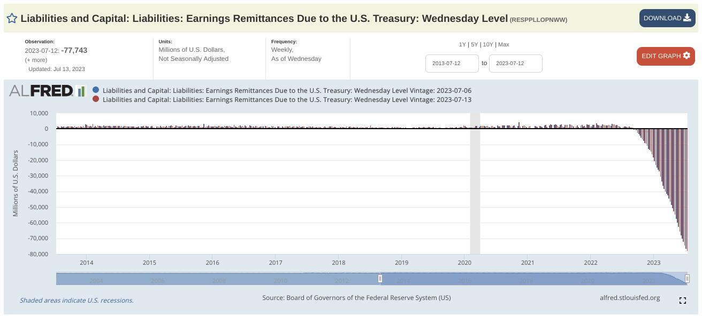
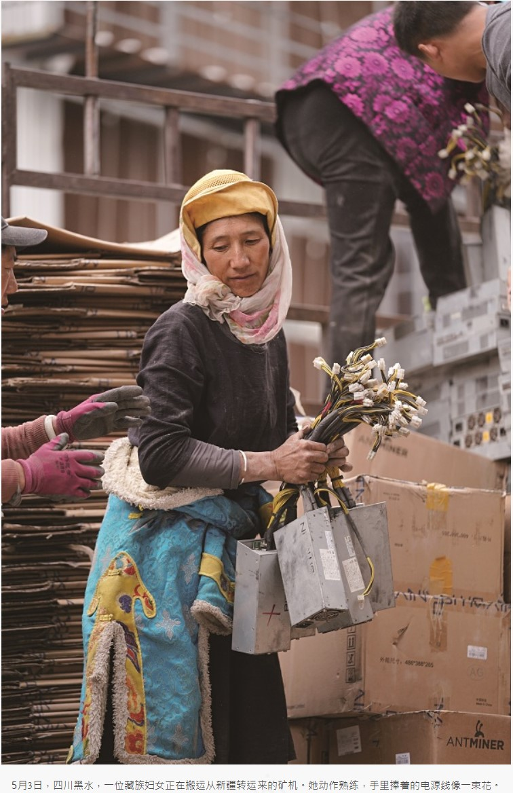
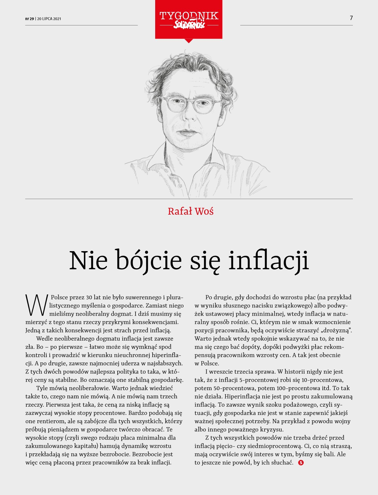
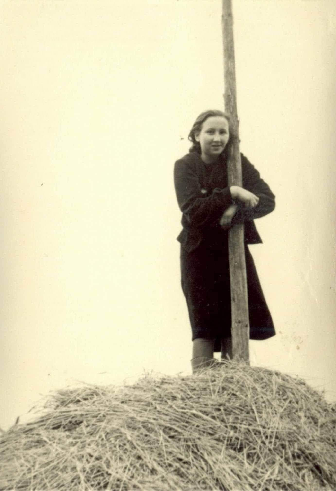
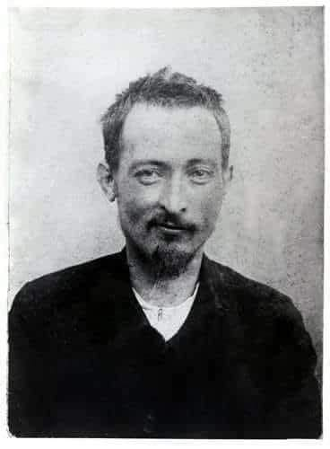

### 2023

  

https://www.bsi.bund.de/DE/Service-Navi/Presse/Alle-Meldungen-News/Meldungen/MST_Protokollierung_Detektion_230704.html

### 2021

Tibetan woman in Sichuan, China salvaging Bitcoin mining machines as the government bans their use for economic freedom—the cords forming a bouquet.

  

---

  

---

### 1944

https://pl.wikipedia.org/wiki/Manifest_PKWN

https://pl.wikipedia.org/wiki/Zamach_20_lipca

### 1946

W mieszkaniu przy ulicy Wróblewskiego 7 we Wrzeszczu funkcjonariusze Urzędu Bezpieczeństwa aresztowali Danutę Siedzikównę "Inka" (zdjęcie) sanitariuszkę V Brygady Wileńskiej majora Zygmunta Szendzielarza "Łupaszki", członkinię szwadronów; porucznika Jana Mazura "Piasta" i porucznika Mariana Plucińskiego "Mścisława". 
Osobą, która wydała "Inkę" była schwytana przez ubeków łączniczka V Brygady Wileńskiej Regina Żylińska- Mordas. 
Danuta Siedzikówna została osadzona w pawilonie V więzienia w Gdańsku jako więzień specjalny. 
„Ince” zarzucono członkostwo w nielegalnej organizacji, nielegalne posiadanie broni, udział w napadach na funkcjonariuszy Milicji Obywatelskiej i UB, a także podżeganie do ich zabicia. Ciekawostką jest fakt, że jeden z milicjantów zeznających przed sądem zeznał, że w czasie jednej z akcji "Inka" udziliła mu pierwszej pomocy.
3 sierpnia 1946 roku została skazana na śmierć przez Wojskowy Sąd Rejonowy kierowany przez majora Adama Gajewskiego.

  
### 1926

W Moskwie, podczas posiedzenia  Komitetu Centralnego Wszechzwiązkowej Komunistycznej Partii zmarł na zawał serca Feliks Dzierżyński pseudonim ,,Józef'' - działacz polski i rosyjski ruchu komunistycznego. W 1899 roku był współtwórcą i przywódcą Socjaldemokracji Królestwa Polskiego i Litwy (SDKPiL). W latach 1905-1907 kierował rewolucją w Królestwie Polskim. Od 1907 należał do SDPRR, a następnie RKP (b) i WKP (b). Współorganizował rewolucję październikową. W latach 1917/22 stanął na czele Ogólnorosyjskiej Nadzwyczajnej Komisji do Walk z Kontrrewolucją i Stabotażem (Czeka), od 1922 - GPU (Państwowy Zarząd Polityczny). Był rzecznikiem radykalnych działań, realizował politykę terroru wobec oponentów politycznych. W latach 1919-25 był komisarzem ludowym spraw wewnętrznych i komunikacji (1921-24), a następnie przewodniczącym Najwyższej Rady Gospodarki Narodowej ZSRR. Pochowano go pod murem kremlowskim. 20 lipca 1951 roku w Warszawie odsłonięto pomnik upamiętniający Feliksa Dzierżyńskiego. 16 października 1989 roku pomnik rozebrano.

  

---

<a href="https://github.com/TomaszWaszczyk/historia.waszczyk.com/edit/master/src/content/july-20.md" target="_blank">Edytuj tę stronę dzieląc się własnymi notatkami!</a>
