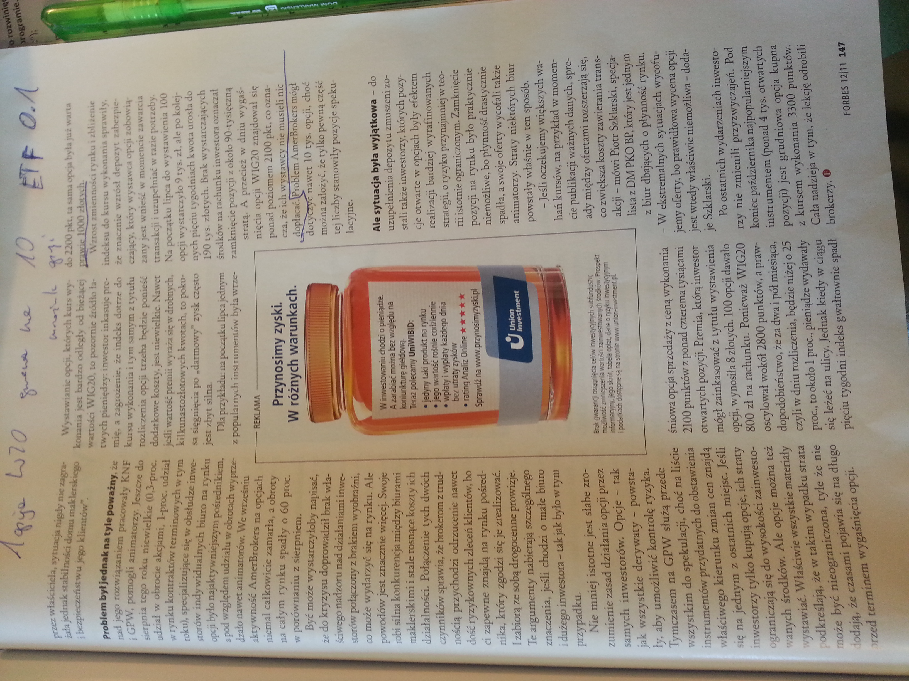
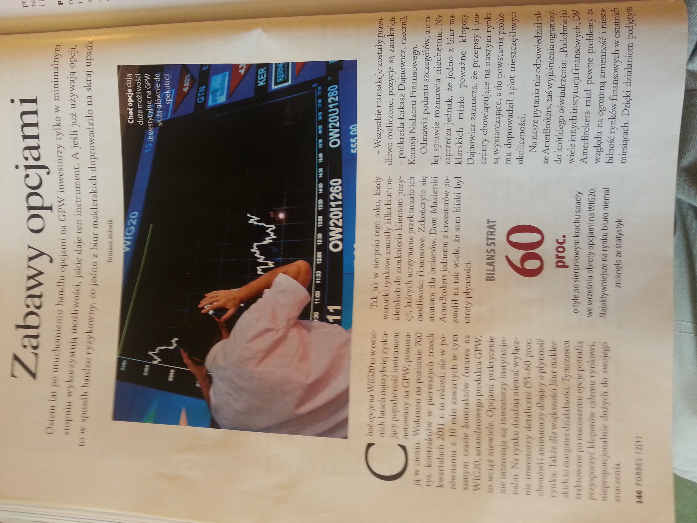
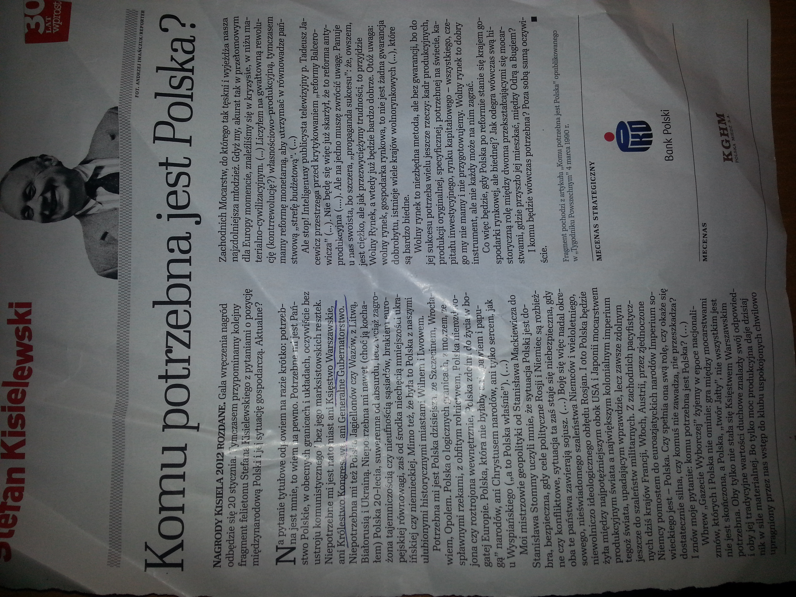
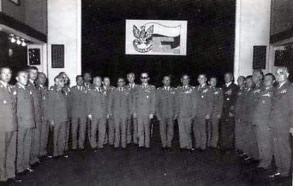
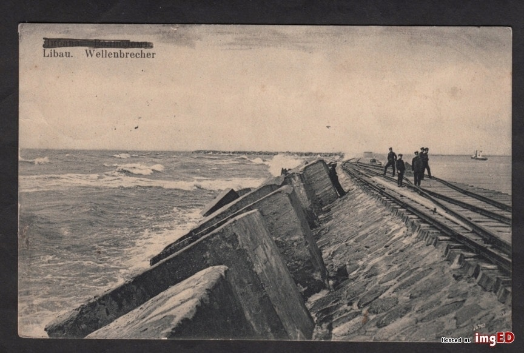
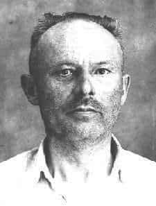

### 2021

> Tesla's European bank balance receives negative interest.  That's insane. - Elon Musk

### 2020

The World Is Drowning in Debt

According to the International Monetary Fund (IMF), global fiscal support in response to the crisis will be more than $9 trillion, approximately 12 percent of world GDP. This premature, clearly rushed, probably excessive, and often misguided chain of so-called stimulus plans will distort public finances in a way which we have not seen since World War II. The enormous increase in public spending and the fall in output will lead to a global government debt figure close to 105 percent of GDP.
This enormous action of central banks leads to an unprecedented disconnect between the real economy and the stock markets. The expansion of multiples has accelerated just as earnings estimates plummet.
By making sovereign bonds prohibitively expensive, two dangerous things happen: governments believe that low bond yields are due to their policies, and investors take much more risk than what they think they have in their portfolios.

### 2013

  

  

  

### 1983

W Warszawie, po prawie dwóch latach działalności uległa samorozwiązaniu kierowana przez generała Wojciecha Jaruzelskiego Wojskowa Rada Ocalenia Narodowego. Była ona organem administrującym Polską od 13 grudnia 1981 roku, czyli od początku stanu wojennego. Miała charakter pozakonstytucyjny, a także posiadała cechy junty wojskowej. W jej skład wchodzili:
gen. armii Wojciech Jaruzelski (I sekretarz KC PZPR , premier rządu PRL,
minister obrony narodowej )
admirał Ludwik Janczyszyn – dowódca Marynarki Wojennej
gen. broni Eugeniusz Molczyk – główny inspektor szkolenia, wiceminister obrony narodowej
gen. broni Zbigniew Nowak – główny inspektor techniki, wiceminister obrony narodowej
gen. broni Florian Siwicki – szef Sztabu Generalnego WP, wiceminister obrony narodowej
gen. broni Tadeusz Tuczapski – główny inspektor obrony terytorialnej, wiceminister obrony narodowej
gen. dyw. Józef Baryła – szef Głównego Zarządu Politycznego WP, wiceminister obrony narodowej
gen. dyw. Tadeusz Hupałowski – minister administracji, gospodarki terenowej i ochrony środowiska
gen. dyw. Czesław Kiszczak – minister spraw wewnętrznych
gen. dyw. Tadeusz Krepski – dowódca Wojsk Lotniczych
gen. dyw. Longin Łozowicki – dowódca Wojsk Obrony Powietrznej Kraju
gen. dyw. Włodzimierz Oliwa – dowódca Warszawskiego Okręgu Wojskowego
gen. dyw. Czesław Piotrowski – minister górnictwa i energetyki
gen. dyw. Henryk Rapacewicz – dowódca Śląskiego Okręgu Wojskowego
gen. dyw. Józef Użycki – dowódca
Pomorskiego Okręgu Wojskowego
gen. dyw. Zygmunt Zieliński – sekretarz WRON, szef Departamentu Kadr MON
gen. bryg. Michał Janiszewski – szef Urzędu Rady Ministrów
gen. bryg. Jerzy Jarosz – dowódca 1 Warszawskiej Dywizji Zmechanizowanej
płk Tadeusz Makarewicz
płk Kazimierz Garbacik
płk Roman Leś
ppłk Mirosław Hermaszewski (według własnej relacji wpisany na listę członków bez jego wiedzy i zgody )
ppłk Jerzy Włosiński – dowódca kompanii 1 Mazowiecka Brygada Warszawskiego Okręgu Wojskowego (późniejsze JW 4829) Góra Kalwaria.
W 2006 roku członkowie WRON zostali oskarżeni przez Główną Komisję Ścigania Zbrodni przeciwko Narodowi Polskiemu IPN o popełnienie zbrodni komunistycznej , polegającej na kierowaniu zorganizowanym związkiem przestępczym o charakterze zbrojnym. W dniu 12 stycznia 2012 roku warszawski Sąd Okręgowy zgodził się z aktem oskarżenia, że stan wojenny przygotowano i wprowadzono niezgodnie z ówczesną konstytucją, a dokonała tego „grupa przestępcza o charakterze zbrojnym”, złożona z ludzi na najwyższych stanowiskach. Według sądu związek ten tworzyli generałowie:
Wojciech Jaruzelski , Czesław Kiszczak, Florian Siwicki oraz Tadeusz Tuczapski . Spośród wymienionych osób wyrok skazujący (4 lata pozbawienia wolności, obniżony o połowę na mocy amnestii, w zawieszeniu na 5 lat) usłyszał jedynie
Czesław Kiszczak. Pozostałe postępowania zostały zawieszone (lub umorzone) ze względu na zły stan zdrowia lub śmierć oskarżonych.

  

### 1920

Datowane na 21 lipca 1920 roku Pismo Attaché Wojskowego przy Przedstawicielstwie Polskim w Rydze do Konsulatu Rzeczypospolitej Polskiej w Rydze z 21 lipca 1920 r. z prośbą o interwencję w przetransportowaniu polskich żołnierzy z portu w Libawie na Łotwie do Gdańska lub Pucka.
"Uprasza się o jak najszybsze odtransportowanie z Libawy do Gdańska lub Pucka 170 żołnierzy polskich z bronią i 137 koni kawaleryjskich z oddziału, który pod naporem bolszewików zmuszony był przejść 5 b.m na terytorium łotewskie.  
Koniecznym jest jak największy pośpiech wobec tego, że rozwój wypadków politycznych może skłonić rząd łotewski nawet do rozbrojenia oddziału i zabrania koni".
Grafika; widokówka z Lipawy, rok 1920.

  

### 1918

Pod Jarosławiem w Rosji zakończyło się trwające około dwa tygodnie powstanie antybolszewickie, którego organizatorem był pisarz oraz członek Partii Socjalistów Boris Sawinkow. Ostatnia batalia, która miała miejsce pod wspomnianym już Jarosławiem zakończyła się egzekucją około 350 osób, żołnierzy i cywilów. 
Chociaż fakt ten nie dotyczy w jakiś bezpośredni sposób naszej historii, to wspominam go ze względu na osobę chorążego Stefana Żbikowskiego (zdjęcie), który był dowódcą Rewolucyjnego Czerwonego Pułku Warszawskiego, którego żołnierze brali udział w tłumieniu antybolszewickiej rebelii, w której brali udział również Polacy. Doszło do bratobójczej walki, którą Żbikowski opisywał tymi słowami:
"Nasi żołnierze, po raz pierwszy słysząc mowę polską w obozie wroga, bez wahania częstują go kulą".
Egzekucji dokonano na antybolszewickich jeńcach, którzy poddali się w wyniku braku dostępu do wody. Wśród nich byli również Polacy. Wysoce prawdopodobne jest, że wśród rozstrzeliwujących, również.

  

### 1816

  

---

<a href="https://github.com/TomaszWaszczyk/historia.waszczyk.com/edit/master/src/content/july-21.md" target="_blank">Edytuj tę stronę dzieląc się własnymi notatkami!</a>
