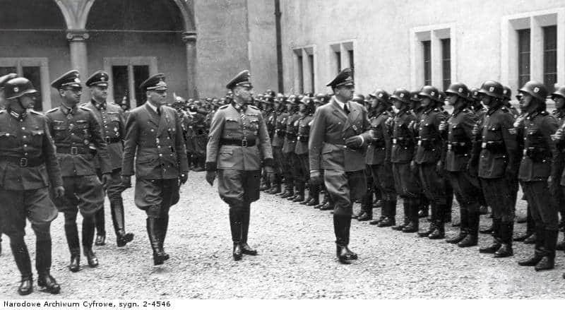

### 2020

Russian Lawmakers Finally Pass Country’s Major Crypto Bill

Russia passed a major bill today related to cryptocurrencies like Bitcoin (BTC).

The State Duma — Russia’s legislative body — has passed a bill titled “On Digital Financial Assets” in its final third reading, local news agency Regnum reports July 22.

After initiating the bill back in 2018, Russian authorities have finally agreed to provide a legal status to cryptocurrencies, preparing to adopt the first major part of legislation for the industry.

Following the latest Duma’s decision, the bill “On Digital Financial Assets,” or DFA, is expected to be officially adopted in Russia on Jan. 1, 2021. The bill provides a legal definition to digital assets and legitimizes cryptocurrency trading in Russia. However, the bill prohibits the use of cryptocurrencies like Bitcoin as a payment method.

---

>„(...) Krzyżackiego gadu nie ugłaszcze,
>Nikt ni gościną, ni prośbą ni dary.
>(...) On wiecznie głodny! Choć pożarł tak wiele,
>Na resztę naszą rozdziera gardziele” - Adam Mickiewicz

---

### 1983

Rada Państwa uchwałą z dnia 20 lipca zniosła trwający od 13 grudnia 1981 roku stan wojenny. Na mocy tej samej uchwały rozwiazano również Wojskową Radę Ocalenia Narodowego w skład której wchodziło 22 wysokich rangą oficerów Wojska Polskiego,a której przewodniczył generał Wojciech Jaruzelski.

  

### 1944

W Moskwie na antenie Radia Moskwa został ogłoszony Manifest Polskiego Komitetu Wyzwolenia Narodowego-dokument stworzony w Moskwie, który proklamować miał suwerenność Państwa Polskiego i jednocześnie obwieszczał przejęcie władzy w Polsce przez Krajową Radę Narodową.
Data ogłoszenia Manifestu w naszym kraju to tylko formalność, ponieważ już dwa dni wcześniej został on podpisany w Moskwie przez samego Józefa Stalina. W imieniu władz polskich zrobili to Edward Osóbka Morawski, Wanda Wasilewska i Andrzej Witos.
Manifest stwierdzał niepodzielność władzy KRN, zawierał deklarację powrotu do granic Polski, w których miały znaleźć się Pomorze i Śląsk, powoływał do życia Milicję Obywatelską, a jednocześnie delegalizował wszystkie polskie organizacje narodowe, określając je jednocześnie jako "faszystowskie".
Deklarowano przejęcie na cele reformy rolnej ziem niemieckich, zdrajców oraz obszarników. Ta ostatnia kategoria dotyczyła majątków powyżej 50 ha, a na ziemiach poniemieckich 100 ha. Ziemie obszarnicze miały być przejęte bez odszkodowań, lecz z zaopatrzeniem dla byłych właścicieli. Przejęta ziemia miała być rozdzielona za minimalna opłatą między małorolnych i średniorolnych chłopów oraz robotników rolnych i stanowić ich własność indywidualną.
Rząd Polski w Londynie uznał Manifest PKWN za nielegalny.

  

### 1941

Podczas posiedzenia rządu Generalnego Gubernatorstwa Hans Frank powiedział:
„Podczas rozmowy, którą miałem sposobność odbyć z Führerem w
Kancelarii Rzeszy Führer powiedział
mi między innymi, że Żydzi pierwsi opuszczą Generalną Gubernię. Już w najbliższych dniach wydam rozkaz wszczęcia przygotowań do ewakuacji warszawskiego getta. Musimy
dołożyć wszelkich starań, żeby jak najszybciej usunąć Żydów z GG. W myśl własnych słów Führera, bowiem GG nie będzie w przyszłości miejscem ich ostatecznej koncentracji, lecz
wyłącznie obozem przejściowym. Ze
zwycięskiego pochodu naszego wspaniałego Wermachtu na Wschód wynika dla nas – zaszczyconych wyróżnieniem Führera, którego
wolą jest, żebyśmy odtąd stanowili pomost między otwierającym się przed nami gigantycznym obszarem Wschodu a Rzeszą, zwartą siedzibą naszego narodu – wynika więc stąd dla nas zaszczytny obowiązek
poświęcenia całej uwagi tylko temu
kompleksowi zadań w obecnych czasach najwyższego bohaterstwa i imponujących osiągnięć żołnierzy niemieckich.”
Na zdjęciu od prawej maszerują:
gubernator Hans Frank , komendant policji
GG Herbert Becker oraz sekretarz stanu
Ernst Boepple.

  

---

### 1920

W czasie wojny polsko- bolszewickiej polski minister spraw zagranicznych Eustachy Sapieha (zdjęcie) wystosował do swojego bolszewickiego odpowiednika Gieorgija Cziczerina depeszę z propozycją natychmiastowego zawieszenia broni.
Nieformalną odpowiedzią na prośbę polskiego ministra były słowa głównodowodzącego sił zbrojnych Armii Czerwonej Siergieja Kamieniewa:
"Jak Polacy zgodzą się z nami negocjować, będzie to oznaczać, że nie mogą liczyć na poważną pomoc, a my możemy swobodnie atakować w głąb Polski"

  

### 1881

W miejscowości Maksymówka koło Stanisławowa urodził się gen. dyw. Bolesław Wieniawa - Długoszowski - herbu Wieniawa, syn Bolesława i Józefy ze Struszkiewiczów, dyplomata i wolnomularz; osobisty adiutant Józefa Piłsudskiego. Formalnie przez 1 dzień "następca prezydenta RP na wypadek opróżnienia się urzędu przed zawarciem pokoju"; wobec niemożności sprawowania urzędu prezydenta przez internowanego Ignacego Mościckiego był faktycznie pełniącym jego obowiązki (formalnie urząd prezydenta nadal był obsadzony). Jedna z najbarwniejszych postaci II RP. Poeta, lekarz wszech nauk medycznych, a także dziennikarz (redaktor naczelny "Dziennika Polskiego" w Detroit). Odznaczony Orderem Virtuti Militari V klasy, Krzyżem Komandorskim i Oficerskim Polonia Restituta, Krzyżem Niepodległości z Mieczami, czterokrotnie Krzyżem Walecznych, licznymi odznaczeniami zagranicznymi. Generał zginął śmiercią samobójczą 1 lipca 1942 r. w Nowym Jorku.

Więcej informacji można znaleźć na stronie Pułku Ochrony im. gen. dyw. Bolesława Wieniawy-Długoszowskiego:
http://www.pulkochrony.wp.mil.pl/pl/76.html

Foto: Komendant Piłsudski z osobistym adiutantem porucznikiem Bolesławem Wieniawą-Długoszowskim w mundurze 1 Pułku Ułanów I Brygady Legionów, 1916 r.

  

---

<a href="https://github.com/TomaszWaszczyk/historia.waszczyk.com/edit/master/src/content/july-22.md" target="_blank">Edytuj tę stronę dzieląc się własnymi notatkami!</a>
