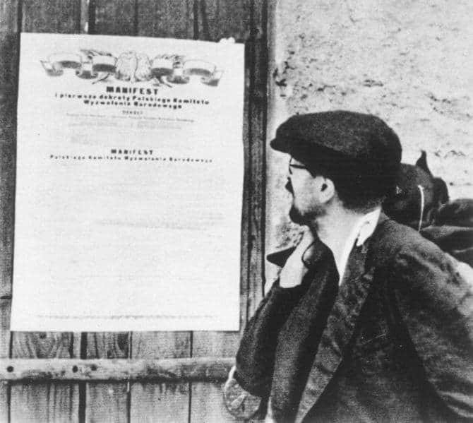

### 2021

<video width="640" height="480" controls>
<source src="./movies/july/biden.mp4" type="video/mp4">
Your browser does not support the video tag.
</video>

### 2020

Russian Lawmakers Finally Pass Country’s Major Crypto Bill

Russia passed a major bill today related to cryptocurrencies like Bitcoin (BTC).

The State Duma — Russia’s legislative body — has passed a bill titled “On Digital Financial Assets” in its final third reading, local news agency Regnum reports July 22.

After initiating the bill back in 2018, Russian authorities have finally agreed to provide a legal status to cryptocurrencies, preparing to adopt the first major part of legislation for the industry.

Following the latest Duma’s decision, the bill “On Digital Financial Assets,” or DFA, is expected to be officially adopted in Russia on Jan. 1, 2021. The bill provides a legal definition to digital assets and legitimizes cryptocurrency trading in Russia. However, the bill prohibits the use of cryptocurrencies like Bitcoin as a payment method.

---

>„(...) Krzyżackiego gadu nie ugłaszcze,
>Nikt ni gościną, ni prośbą ni dary.
>(...) On wiecznie głodny! Choć pożarł tak wiele,
>Na resztę naszą rozdziera gardziele” - Adam Mickiewicz

---

### 1983

Rada Państwa uchwałą z dnia 20 lipca zniosła trwający od 13 grudnia 1981 roku stan wojenny. Na mocy tej samej uchwały rozwiazano również Wojskową Radę Ocalenia Narodowego w skład której wchodziło 22 wysokich rangą oficerów Wojska Polskiego,a której przewodniczył generał Wojciech Jaruzelski.

  

### 1944

W Moskwie na antenie Radia Moskwa został ogłoszony Manifest Polskiego Komitetu Wyzwolenia Narodowego-dokument stworzony w Moskwie, który proklamować miał suwerenność Państwa Polskiego i jednocześnie obwieszczał przejęcie władzy w Polsce przez Krajową Radę Narodową.
Data ogłoszenia Manifestu w naszym kraju to tylko formalność, ponieważ już dwa dni wcześniej został on podpisany w Moskwie przez samego Józefa Stalina. W imieniu władz polskich zrobili to Edward Osóbka Morawski, Wanda Wasilewska i Andrzej Witos.
Manifest stwierdzał niepodzielność władzy KRN, zawierał deklarację powrotu do granic Polski, w których miały znaleźć się Pomorze i Śląsk, powoływał do życia Milicję Obywatelską, a jednocześnie delegalizował wszystkie polskie organizacje narodowe, określając je jednocześnie jako "faszystowskie".
Deklarowano przejęcie na cele reformy rolnej ziem niemieckich, zdrajców oraz obszarników. Ta ostatnia kategoria dotyczyła majątków powyżej 50 ha, a na ziemiach poniemieckich 100 ha. Ziemie obszarnicze miały być przejęte bez odszkodowań, lecz z zaopatrzeniem dla byłych właścicieli. Przejęta ziemia miała być rozdzielona za minimalna opłatą między małorolnych i średniorolnych chłopów oraz robotników rolnych i stanowić ich własność indywidualną.
Rząd Polski w Londynie uznał Manifest PKWN za nielegalny.

  

### 1942

W uzupełnieniu do poprzedniego postu o Dywizjonie 301 postanowiłem też dodać wspomnienia dwóch pilotów tej jednostki- podporucznika pilota Antoniego Majcherczyka (zdjęcie ) i starszego sierżanta Wiktora Jabłońskiego. Opisane wydarzenia miały miejsce 22 lipca 1942 roku.
"W sierpniu 1942 roku nie powróciły z lotu bojowego na Duisburg dwie załogi z dywizjonu 301 Ziemi Pomorskiej, a mianowicie: załogi porucznika Cezarego Lewickiego i podporucznika Ludomira Bocka. Żal i przygnębienie ogarnęło wszystkich na stacji, bo pomyślcie sobie: takie wspaniałe załogi, w sumie jedenastu ludzi, i to jakich! Przecież był to ich trzydziesty któryś lot bojowy! Nasuwało się pytanie, kto poleci szukać zaginionych, bo choć szansę niewielkie, ale były podobno jakieś "fixy" na morzu, a więc zaniedbać ich nie wolno. Ponadto obowiązuje przecież przyjaźń i braterstwo broni. W końcu zadecydowano, że polecą dwie maszyny: "Moniek" na "F"-ce i porucznik Antoni Majcherczyk na swojej starej wysłużonej "H" - for Harry.
Z tym ostatnim - nawigator porucznik Szymanowski, radiotelegrafista Wiktor Jabłoński i starzy doświadczeni strzelcy: plutonowy Michał Nowak i starszy sierżant Andrzej Rudel. Dobra załoga, można być pewnym, że każdy sumiennie wykona swoje zadanie i nikt nie "nawali".
Tuż po dziewiątej rano wystartowali. Obie maszyny jakiś czas leciały razem, ale po przekroczeniu wybrzeża rozeszły się, by przeszukiwać wyznaczone im prostokąty morza. Lecieli na wysokości 300 metrów przy ładnej, słonecznej, prawie bezchmurnej pogodzie. "No - przemknęło pilotowi przez myśl - żeby nas tylko Niemcy nie przyuważyli". Nikt nie odzywał się, bo i cóż tu mówić, gdy każdy patrzy pilnie w morze, czy gdzieś nie dojrzy małej żółtej plamki. Kilkakrotnie przemierzyli swój prostokąt z zachodu na wschód i z powrotem... Mieli za sobą już więcej jak pół sektora. Niestety bez rezultatu. Antek włączył automatycznego pilota, ale "kolega-automat" coś nie bardzo trzymał kurs, więc go wkrótce wyłączył. Ni stąd, ni zowąd zadźwięczał mu w uszach marsz żałobny Szopena. "Idiota jestem - pomyślał sobie - przecież czarnego kota dzisiaj nie widziałem". Była to reminiscencja dawnej kraksy na motorze, bo wówczas, tuż przed wypadkiem, ogromny czarny kot przebiegł mu drogę.
Czasy i kursy zgadzały się, nawigator dobrze prowadził. Spotkali się z "F"-ką, która szukała w sąsiednim sektorze. Znów "fixy" - wszystko było w porządku, choć silny wiatr zachodni znosił maszynę ku brzegom Holandii. Przeszukali już cały swój rejon. Zadanie, choć bez rezultatu, było wykonane, ale nie mieli serca wracać tak wcześnie bez żadnego wyniku. Krótka narada z nawigatorem: polecą jeszcze po przekątnej, potem wzdłuż prostokąta, znów po przeciwległej przekątnej - i wtedy dopiero kurs do domu. Polecieli na to ostatnie, już nadprogramowe, szukanie. Była 11.58. Nagle Wiktor krzyknął: "Myśliwce z prawej!". Wszyscy drgnęli i spojrzeli w tym kierunku.
Rzeczywiście z prawej strony, z przodu, zbliżały się dwie sylwetki myśliwców. "Niemcy czy nasi?" - przemknęło pilotowi przez głowę. Bez chwili zwłoki położył maszynę w zakręt, poddusił i ostrą piką zszedł tuż nad samą wodę. Byli to jednak Niemcy.
- Kurs dwieście siedemdziesiąt stopni i do domu - podał nawigator.
- Okay - odrzekł krótko pilot, wrzepił pełny gaz i ustawił żyro, aby zgrać je z busolą.
Słyszał, jak Andrzej woła: "Atakują z lewej, atakują z prawej", i zależnie od tych ostrzeżeń robił błyskawiczne uniki, dzięki czemu maszyna wychodziła Niemcom z linii ognia. Lewa ręka mu drżała, nie wiedział co z nią zrobić, za co złapać. Bezwiednie przestawił dźwignię mieszanki z bogatej na ubogą i odwrotnie, nie zdając sobie sprawy z bezsensu tej czynności. Nagle poczuł serię. Maszyną szarpnęło. Strzelcy ciągle strzelali, a w przerwach sygnalizowali położenie i ruchy Niemców. Stosownie do tego pilot robił uniki. Wił się jak wąż, kręcił jak piskorz. Nie patrzył na przyrządy. Silniki grały jak smoki, było mu wszystko jedno, jakie są obroty, ciśnienie ładowania, jakie temperatury. Zobojętniał na wszystko. Myślał tylko o jednym, byleby prędzej, byleby bliżej Anglii. Walka trwała, jak przystało na zgraną załogę, która już niejedną ciężką chwilę zwycięsko przetrzymała - niedawno przecież Rudel zestrzelił do morza jednego Junkersa. Nie poddawali się zdenerwowaniu, mówili mało, ograniczając się do rzeczy istotnych, związanych z walką. Zresztą od pracy silników i od strzelaniny huczało wszystkim w uszach, toteż ginęły w interkomie poszczególne skąpe słowa.
- Antek, co jest? Mam tylko jednego Niemca przed sobą, gdzie jest drugi? - zawołał nagle tylny strzelec.
- Atakuje z lewej, z przodu - odpowiada przedni. - Antek, uważaj na niego. Zrób ostry wiraż w lewo!
- O, cholerny świat, amunicja mi się skończyła, a i szelmy postrzeliły mnie. Ale to nic, przechodzę do bocznych karabinów! - woła z tyłu Rudel.
- I ja jestem ranny - odzywa się zmienionym głosem nawigator. - Trzymajcie się, chłopaki, a ty, Michał grzej do tych drani i trzymaj ich z daleka.
- Już ja ich przytrzymam, choć i mnie się oberwało - powiada z przedniej wieżyczki Nowak.
Niemcy atakują bez przerwy, przedni strzelec odpowiada krótkimi seriami. Teraz wróg zmienia taktykę: obydwa samoloty wyprzedzają Wellingtona i zatoczywszy półkole podchodzą do ataku od przodu. Walą z piorunującą prędkością wprost na nadlatującą w ich stronę maszynę. Dopiero teraz pilot widzi dokładnie smukłe sylwetki Focke-Wulfów. Nowak strzela do prawego, więc pilot kładzie maszynę w lewy zakręt, a jednocześnie zalewa go fala gorąca. Serce bije jak młotem, instynktownie schyla głowę, jak gdyby to mogło coś pomóc. Focke-Wulfy przemknęły górą. Poczuł tylko, że coś się sypie, jakieś strzępy czy odłamki przelatują tuż obok jego głowy. I znów atak z tyłu. W interkomie krzyk Andrzeja: "Atakują! Atakują z lewej! Uciekaj!" Słychać serię z karabinu pokładowego. To Andrzej strzela, strzela mimo ran. Przeszedł z tylnej wieżyczki do bocznych kaemów i walczy dalej.
Nagle bombowiec przepada, uderza kadłubem i prawym silnikiem o wodę. Z trudem wychodzi jeszcze w powietrze, lecz prawy silnik staje i ciągnie za sobą warkocz białego dymu. Łopaty śmigła wygięły się ku przodowi. W mózgu pilota tylko jedna myśl: za wszelką cenę dolecieć do Anglii, choćby na jednym silniku. Maszyna jednak ciągle skręca w lewo, nie słucha sterów, wali się, a strzelcy wciąż jeszcze prowadzą ogień. Pilot woła: "Przygotować się do wodowania!" Jakimś cudem jeszcze dwukrotnie wyprowadza samolot, który leci jak błędny. Zbliża. się nieunikniony koniec. Pilot zdaje sobie z tego sprawę. Ogarnia go bezwład, wzrok zasnuwa się mgłą, nic nie słyszy, nic nie czuje. Podświadomie chce oddać ster od siebie, niech się prędzej stanie, co się ma stać. Jeszcze jeden rzut oka w głąb maszyny, by choć wzrokiem pożegnać towarzyszy walki. W drzwiach, tuż za stanowiskiem drugiego pilota, stoi Wiktor. Zacięte usta i oczy wlepione w przestrzeń świadczą, że i on wie, iż nadchodzi koniec. Jakiś dziwny spokój spływa na pilota, wie, że zginą razem. Maszyna już zupełnie nie słucha sterów, powierzchnia wody zbliża się jak na zwolnionym filmie, silny trzask i film się urywa.
Chłód i smak słonej wody w ustach ocuciły pilota. Pływał na powierzchni morza tuż koło lewego silnika. A więc siła uderzenia o wodę wyrzuciła go z kabiny. "Chłopcy! - krzyknął. - Chłopcy, wyłazić!". Cisza.
Samolot zatonął w ciągu kilku sekund. Ale oto w wirze i pianie, jaka przy tym powstała, ukazała się dinghy, ostatnia deska ratunku. Poczciwy dętak oswobodził się samoczynnie. O kilka metrów od dinghy pływa coś ciemnego. To Wiktor. Gdy się zobaczyli, poczuli nowe siły. Rozglądają się.
Może jeszcze ktoś zdołał się uratować. Niestety, nie dostrzegli nikogo. Zrzucili szelki spadochronów, ściągnęli hełmy i buty, szybko napełnili powietrzem kamizelki ratunkowe i zaczęli płynąć ku dinghy. Nagle ryk motoru. To Focke-Wulf. Pikuje wprost na dinghy, by krótką serią zniszczyć tę ostatnią dla nich deskę ratunku. Przeszedł jednak tuż nad nią nie strzelając. Jego pilot stwierdził widocznie, że ponton jest pusty, a więc wszyscy z bombowca zginęli.
Dopłynęli wreszcie do dinghy i z przerażeniem spostrzegli, że jest odwrócona do góry dnem. Zmęczeni, na rozkołysanym morzu, nie mieli szans na jej przekręcenie. Wiedzieli o tym, ale musieli próbować. Tak jak przewidywali, ich wysiłki były daremne. Próbowali wczołgać się na nią, ale i to się nie udało. Zmęczeni, trzymali się sznurów, przyczepionych do powłoki, i odpoczywali. Wreszcie nadludzkim wprost wysiłkiem, łącząc spryt z siłą, Wiktor wdrapał się na dinghy i pomógł wleźć towarzyszowi. Przywiązali się sznurami do zwiotczałej powłoki i leżeli w wypełniającej ją wodzie. Położenie było beznadziejne. Mokro i chłodno, a na dobitkę morze zaczynało coraz bardziej kołysać. Wkoło pływały jakieś resztki ich samolotu. Poduszka, kawałki pokrycia kadłuba, ale też i jakaś paczka starannie zapakowana. Z ciekawości wyłowili ją i rozwinęli. Była to paczka dla rozbitków, wchodząca w skład wyposażenia ratunkowego samolotu! Wewnątrz znaleźli kilkanaście małych puszek ze słodką wodą, pastylki przeciw morskiej chorobie i składaną chorągiewkę. Takie zbiegi okoliczności zdarzają się dość często w powieściach lub w kinie, a jednak czasem, choć bardzo rzadko, także i w życiu.
- Powiadam ci, że jeszcze wyjdziemy cało z tej katastrofy. I wrócimy do Polski, do naszych! Do żony i syna. Niedawno skończył trzy lata.
- A ja do moich staruszków. Oni wkrótce będą mieli razem sto lat.
- To się już chyba ożenisz?
- Być może.
Na tę intencję wypili trochę wody, rozkoszując się jej smakiem niby najlepszym winem. Żuli pastylki i czekali bożego zmiłowania. A było ono bliskie, bo niezbyt wysoko przelatywał właśnie Wellington. Może to koledzy szukający biednego Cezarego. Machali bezradnie chorągiewką, bo rakiety były niestety pod spodem. Jednak załoga Wellingtona nie widziała ich, choć samolot przeszedł tak blisko. Opanowało ich przygnębienie i rezygnacja. A tu i wiatr się wzmógł i fala rosła coraz bardziej, a na dobitek zaczęła ich męczyć morska choroba. Ale wkrótce miało ich spotkać jeszcze większe nieszczęście. Z dinghy uchodziło powietrze. Mieli wprawdzie pompkę, lecz zawór był pod wodą.
- Teraz to już, bracie, koniec. Fala nas zmyje i nie wrócimy do naszych.
Z dinghy robił się stopniowo sflaczały worek i w pewnym momencie zgięła się prawie wpół.
- Słuchaj, teraz ją odwrócimy. Teraz albo nigdy!
- To już lepiej teraz. Odpocznijmy, nabierzmy sił, a ona niech jeszcze bardziej zmięknie. Potem zaryzykujemy. Bóg nam dopomoże.
Obmyślili szczegółowo swój bardzo ryzykowny plan, zapakowali z powrotem zapasy do paczki i włożyli ją do wody obok dinghy. Stanęli na jednym końcu pontonu, podnieśli jego drugi kraniec możliwie jak najwyżej, westchnęli do Matki Boskiej o pomoc i ... skoczyli jednocześnie w wodę. Dinghy rzeczywiście się przewróciła, ale przydusiła Wiktora, który był zbyt krótko przywiązany. Antek usiłował mu pomóc, ale bez skutku. Należało za wszelką cenę wyprostować dinghy. W końcu udało się. Po chwili obaj zupełnie wyczerpani siedzieli w łódce. Byli zadowoleni. Znów zaświtała iskierka nadziei. Wylewali na zmianę wodę i pompowali powietrze. Męczyło ich to, ale i rozgrzewało, zwłaszcza że wiatr dął coraz silniej i zaczynał padać deszcz... Ku nieopisanej radości znaleźli na dnie doskonale zabezpieczone od wody rakiety i rakietnicę. Oczekiwali teraz na zbawczy samolot.
- Powiedzże wreszcie, człecze, jakżeś ty się wygramolił z maszyny - zwrócił się pilot do radiotelegrafisty.
- Jak drugi raz trzepnęło o wodę, to już wiedziałem, że zbliża się koniec. Tyś się obejrzał, popatrzył na mnie, i to mnie trochę uspokoiło. I nagle coś mnie odrzuciło w tył. Usłyszałem szum, coś niesamowitego się działo. Jakiś półmrok, no i woda. Już pod wodą przeszedłem do twojego stanowiska, wlazłem na siedzenie i próbowałem otworzyć górne drzwi. Ale nie puściły. Zacząłem się denerwować. Wodę miałem już powyżej kolan i czułem, że tylko spokojem wygram. Przyparłem się do drzwi, no i puściły. Ale teraz woda zwaliła mi się na łeb. Nabrałem powietrza i skoczyłem. Jeszcze mnie coś trochę po nogach trzepnęło, ale wykonałem kilka silnych ruchów rękoma i znalazłem się na powierzchni morza. A jak cię zobaczyłem, to mi kamień spadł z serca. Nie wiesz nawet, jak bardzo się ucieszyłem, że się uratowałeś. Żeby chłopcy nie byli ranni, to też pewnie by wyleźli... Pamiętasz, Andrzej brał udział z nami w pełnej trzydziestce lotów bojowych! A pamiętasz, jak opowiadał po zestrzeleniu Ju-88, że takiej wysokiej fontanny ani on, ani Luftwaffe nie oglądali przedtem. A kiedy gratulowano mu zwycięstwa, to skromnie mówił, że to nie jego zasługa, tylko karabinów maszynowych. Złoty człowiek był, szkoda, że tacy giną. On już jest teraz szczęśliwy, swoją nagrodę odebrał...
I teraz dopiero, gdy siedzieli już trochę wygodniej, choć bardzo osłabieni i niezbyt bezpieczni, żal za utraconymi kolegami chwycił ich za serca i rozpłakali się jak dzieci... Przyleciało kilka mew. Czyżby to był dowód zbliżania się do brzegu? Zwątpienie wkradło się w ich serca, dygotali z zimna i morska choroba męczyła ich okrutnie. Naraz jakiś dźwięk! Czy to wiatr tak wyje? Nie, to przecież huk silników samolotu! Nad horyzontem ukazały się dwa Hudsony. Rozbitkowie strzelają jedną rakietę, drugą, trzecią i czwartą... Widzą nas, widzą! Hudsony zatoczyły małą rundę i zrzuciły dymną świecę. I znowu runda i świeca... Załoga jednego samolotu zasygnalizowała lampą Aldisa: "As soon as possible". To miało im dodać otuchy, bo morze huczało, fale zalewały dinghy i deszcz rozpadał się na dobre. Oni już prawie całkiem bezsilni walczyli jeszcze z żywiołem... Po sześciu godzinach pobytu na morzu zawarczał wreszcie kuter motorowy z Air Sea Rescue. Po chwili przebrani w suche ubrania siedzieli w zacisznej kabinie. Pili przepisowy rum i gnali ku Anglii. Wrócimy, bracie, do Polski i do swoich!
- Aleście mieli, boys, kupę szczęścia - stwierdził z podziwem angielski marynarz.
- You see - odpowiedział polski lotnik. - My już mamy wprawę, już nieraz brykaliśmy grabarzowi spod łopaty.
W dywizjonie, choć już i dawniej byli bardzo lubiani, teraz otaczano ich szczególną sympatią. Każdemu, kto na nich spojrzał, oczy się śmiały i twarz jaśniała. Powszechną tę radość mąciło jednak wspomnienie towarzyszy z ich załogi, którzy walczyli bohatersko do ostatniej chwili, a ich męstwo przyczyniło się niewątpliwie do uratowania obydwu rozbitków. Niechaj dobry Bóg przyjmie ich do Swej Świętej Chwały! Walcząc do ostatka polegli na polu chwały: strzelec plutonowy Jan Michał Nowak, strzelec starszy sierżant Andrzej Rudel i nawigator porucznik Władysław Szymanowski. Ich bezprzykładnemu męstwu zawdzięczając ocalenie, niniejsze wspomnienia poświęcają uratowani.

  

### 1941

Podczas posiedzenia rządu Generalnego Gubernatorstwa Hans Frank powiedział:
„Podczas rozmowy, którą miałem sposobność odbyć z Führerem w
Kancelarii Rzeszy Führer powiedział
mi między innymi, że Żydzi pierwsi opuszczą Generalną Gubernię. Już w najbliższych dniach wydam rozkaz wszczęcia przygotowań do ewakuacji warszawskiego getta. Musimy
dołożyć wszelkich starań, żeby jak najszybciej usunąć Żydów z GG. W myśl własnych słów Führera, bowiem GG nie będzie w przyszłości miejscem ich ostatecznej koncentracji, lecz
wyłącznie obozem przejściowym. Ze
zwycięskiego pochodu naszego wspaniałego Wermachtu na Wschód wynika dla nas – zaszczyconych wyróżnieniem Führera, którego
wolą jest, żebyśmy odtąd stanowili pomost między otwierającym się przed nami gigantycznym obszarem Wschodu a Rzeszą, zwartą siedzibą naszego narodu – wynika więc stąd dla nas zaszczytny obowiązek
poświęcenia całej uwagi tylko temu
kompleksowi zadań w obecnych czasach najwyższego bohaterstwa i imponujących osiągnięć żołnierzy niemieckich.”
Na zdjęciu od prawej maszerują:
gubernator Hans Frank , komendant policji
GG Herbert Becker oraz sekretarz stanu
Ernst Boepple.

  

---

### 1920

W czasie wojny polsko- bolszewickiej polski minister spraw zagranicznych Eustachy Sapieha (zdjęcie) wystosował do swojego bolszewickiego odpowiednika Gieorgija Cziczerina depeszę z propozycją natychmiastowego zawieszenia broni.
Nieformalną odpowiedzią na prośbę polskiego ministra były słowa głównodowodzącego sił zbrojnych Armii Czerwonej Siergieja Kamieniewa:
"Jak Polacy zgodzą się z nami negocjować, będzie to oznaczać, że nie mogą liczyć na poważną pomoc, a my możemy swobodnie atakować w głąb Polski"

  

### 1881

W miejscowości Maksymówka koło Stanisławowa urodził się gen. dyw. Bolesław Wieniawa - Długoszowski - herbu Wieniawa, syn Bolesława i Józefy ze Struszkiewiczów, dyplomata i wolnomularz; osobisty adiutant Józefa Piłsudskiego. Formalnie przez 1 dzień "następca prezydenta RP na wypadek opróżnienia się urzędu przed zawarciem pokoju"; wobec niemożności sprawowania urzędu prezydenta przez internowanego Ignacego Mościckiego był faktycznie pełniącym jego obowiązki (formalnie urząd prezydenta nadal był obsadzony). Jedna z najbarwniejszych postaci II RP. Poeta, lekarz wszech nauk medycznych, a także dziennikarz (redaktor naczelny "Dziennika Polskiego" w Detroit). Odznaczony Orderem Virtuti Militari V klasy, Krzyżem Komandorskim i Oficerskim Polonia Restituta, Krzyżem Niepodległości z Mieczami, czterokrotnie Krzyżem Walecznych, licznymi odznaczeniami zagranicznymi. Generał zginął śmiercią samobójczą 1 lipca 1942 r. w Nowym Jorku.

Więcej informacji można znaleźć na stronie Pułku Ochrony im. gen. dyw. Bolesława Wieniawy-Długoszowskiego:
http://www.pulkochrony.wp.mil.pl/pl/76.html

Foto: Komendant Piłsudski z osobistym adiutantem porucznikiem Bolesławem Wieniawą-Długoszowskim w mundurze 1 Pułku Ułanów I Brygady Legionów, 1916 r.

  

### 1878

> Poznaj siebie, zanim zechcesz dzieci poznać. – Zdaj sobie sprawę z tego, do czego sam jesteś zdolny, zanim dzieciom poczniesz wykreślać zakres ich praw i obowiązków – Ze wszystkich sam jesteś dzieckiem, które musisz poznać, wychować i wykształcić przede wszystkim. - Janusz Korczak

22 lipca 1878 lub 1879 roku w rodzinie Józefa i Cecylii Goldszmit w Warszawie urodził się Janusz Korczak (właściwie Henryk Goldszmit) - wybitny pedagog, pediatra, pisarz, dyplomowany lekarz, działacz społeczny i charytatywny. Janusz Korczak był współtwórcą i pierwszym dyrektorem Domu Sierot w Warszawie (1911-42) i sierocińca Nasz Dom, w których wprowadził system wychowania łączący zasadę kierowania dziećmi z zasadą ich samodzielności. Janusz Korczak należał do obrońców praw dzieci. Był popularyzatorem problematyki pedagogicznej. Pisał utwory dla dzieci (,,Król Maciuś Pierwszy''), powieści społeczne, prace pedagogiczne (Jak kochać dziecko) . Przebywając na terenie getta warszawskiego prowadził ,,Pamiętnik''. Od początku okupacji hitlerowskiej Janusz Korczak usilnie zabiegał o pomoc, dary, wsparcie dla dzieci. Odrzucał każdą ofertę ratowania własnego życia, ponieważ nie wyobrażał sobie, aby mógł opuścić swoje sieroty. 5 lub 6 sierpnia 1942 roku zginą razem ze swoimi podopiecznymi (ok. 200 żydowskich dzieci), asystentami i swoją oddaną współpracownicą Stefanią Wilczyńską w obozie zagłady w Treblince. Świadkiem przemarszu Janusza Korczaka i dzieci na Umschlagplatz był, m.in. Emanuel Ringelblum, który wspominał: ,,To nie był marsz do wagonów, to był zorganizowany milczący protest przeciwko morderstwu! (...) Dzieci szły czwórkami. Na przedzie Korczak; patrzył prosto przed siebie i po obu stronach trzymał za rękę dziecko''. Symboliczny kamień upamiętniający Janusza Korczaka i dzieci znajduje się na terenie byłego niemieckiego obozu zagłady w Treblince.

Zachęcam do przeczytania szczegółowej biografii Janusza Korczaka:
http://2012korczak.pl/zarys

---

Ruszyło w Warszawie pierwsze pogotowie ratunkowe. Powołane ono zostało z inicjatywy hrabiego Konstantego Przeździeckiego i doktora Józefa Zawadzkiego. Wzorowane było ono na modelu austriackim,a konkretnie wiedeńskim,którego natychmiastowe powstanie wymusił pożar Opery Wiedeńskiej.Warszawskie pogotowie ratunkowe swój chrzest bojowy przeszło już w dwa tygodnie później,kiedy to podczas wizyty cara Mikołaja drugiego zorganizowało 20 polowych punktów sanitarnych.
Pogotowie to niemal od
założenia prowadziło służbę całodobową, bezpłatnej pomocy ofiarom wypadków udzielali wyłącznie lekarze z odpowiednią praktyką. Po 3 latach działalności Pogotowie
było już instytucją dobrze zakorzenioną i rozpoznawalną w mieście. Roczna liczba wezwań wynosiła ok. 8 tys., Pogotowie
Ratunkowe zatrudniało 16 lekarzy i 9
sanitariuszy, dysponowało taborem 11 koni i 4 powozów.

  

---

<a href="https://github.com/TomaszWaszczyk/historia.waszczyk.com/edit/master/src/content/july-22.md" target="_blank">Edytuj tę stronę dzieląc się własnymi notatkami!</a>
