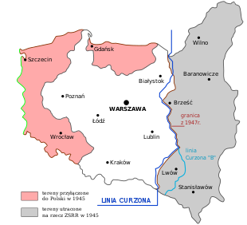
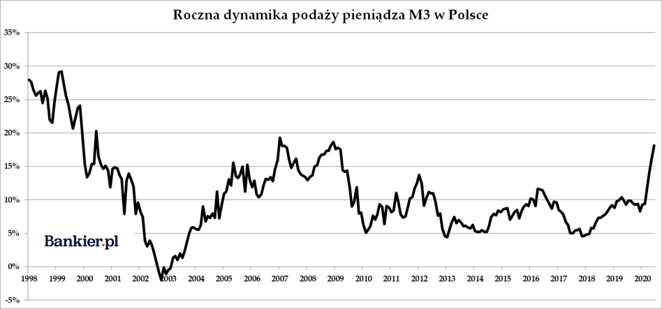
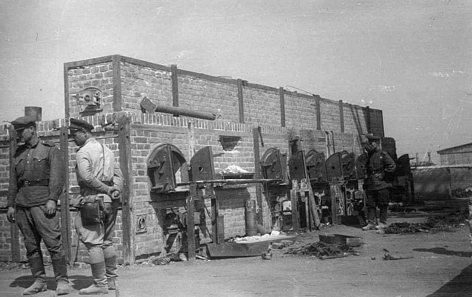
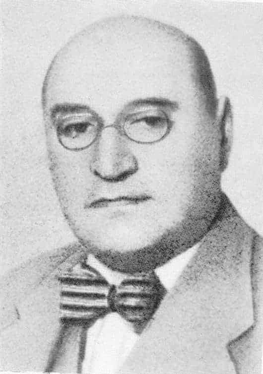
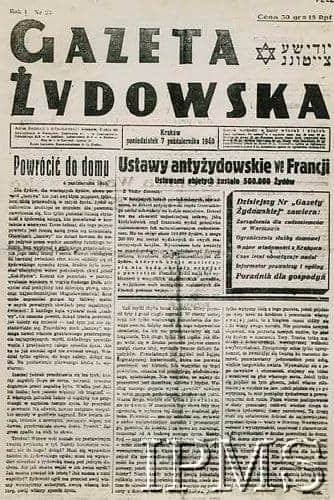
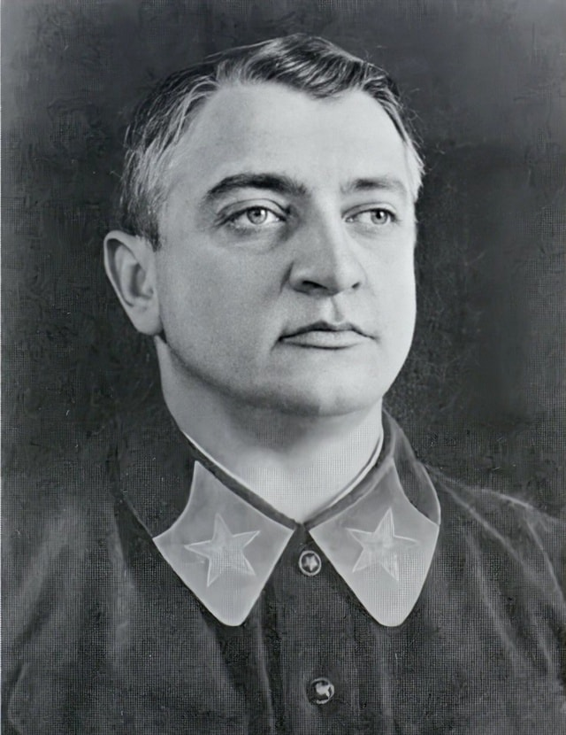
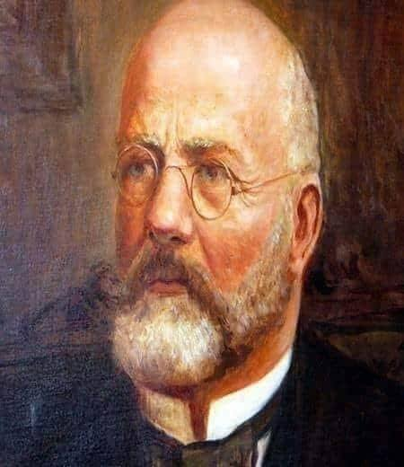

### 2023

W wieku 40 lat zmarł nagle Anton Czerepiennikow cyfrowy guru Rosji! Jako wstępną przyczyną śmierci podano zatrzymanie akcji serca.

  

---

> Putin says the western part of Poland was a gift from Stalin to them, and that Russia will remind Poland of that.

  

> Niemcy poprą Polskę, swojego sojusznika z NATO, jeśli Warszawa stanie w obliczu potencjalnego ataku Grupy Wagnera z sąsiedniej Białorusi. Poinformował o tym minister obrony Niemiec Boris Pistorius w piątek na konferencji prasowej w Pradze.

### 2020

Od marca mamy do czynienia z gwałtownym przyspieszeniem inflacji monetarnej w Polsce. Podaż pieniądza rośnie w tempie niewidzianym od jesieni 2008 roku, czemu towarzyszą praktycznie zerowe stopy procentowe banku centralnego.

Takiego tempa kreacji pieniądza nie widzieliśmy od kryzysu finansowego sprzed przeszło dekady. Tylko w czerwcu monetarny agregat M3 powiększył się o 28,3 mld zł. Od początku roku w systemie przybyło aż 180,6 mld złotych!

  

Roczna dynamika podaży pieniądza M3 w czerwcu przyspieszyła do 18,1% wobec 16% w maju i 9,4% w lutym. Po raz ostatni tak szybki przyrost tego agregatu odnotowano w grudniu 2008 roku.

W skład M3 wchodzi nie tylko fizyczna gotówka w obiegu, ale przede wszystkim pieniądze ulokowane na rachunkach bankowych gospodarstw domowych, przedsiębiorstw, samorządów czy funduszy zabezpieczenia społecznego.

### 2018

> ☠️ “Linux is a cancer that attaches itself in an intellectual property sense to everything it touches” ☠️

These were the words that came out from Steve Ballmer's mouth in 2001 when he was the CEO of Microsoft.

The comment was only one part of Microsoft’s anti open source campaign that began with Bill Gates’ 1976 letter, Open Letter to Hobbyists, which took aim at piracy in the hobbyist community.

Bill Gates as well as his successor Ballmer, remained stubborn critics of open source throughout their span as CEOs of the company. However, during Ballmer’s time, the open-source movement became too big for Microsoft to ignore, pushing the tech giant to experiment with it.

In 2004, Microsoft released Windows Installer XML, which was the first software to be made available by Microsoft under a public licence. Four years later, Microsoft co-founded the Open Web Foundation along with other tech giants such as Google, Meta (Facebook back then), and IBM among others. During the same year, Microsoft officially joined the Apache Software Foundation.

In 2009, it began contributing to the Linux community for the first time. By 2011, Microsoft established itself as the fifth-largest contributor to the Linux kernel, contributing nearly 4% of the changes made.

However, over the past decade, Microsoft has truly changed its tune on the open source community.

The biggest shift in Microsoft’s stance towards open source was observed in 2014, after Satya Nadella stepped in as the CEO of the company. Speaking at an event in San Francisco in 2014, Nadella displayed a slide that read ‘Microsoft loves Linux’. The message was that Microsoft no longer saw Linux as a competitor but as an ally.

In 2018 Microsoft bought GitHub - the largest open source code sharing and collaboration platform, for $7.5B. It was under Nadella that Microsoft became one of the largest contributors to opensource projects in the world.

Today, Microsoft has the highest number of employees contributing to open source projects on GitHub compared to any other company globally. Microsoft recently celebrated ‘Azure Open Source Day’.

The learning of this story can be summarized in the following quote by George Bernard Shaw:

"Those who cannot change their minds cannot change anything"

A fun personal story about Linux: I went to the same Finnish-Swedish middle school in Helsinki as Linus Torvalds, the creator and lead developer of the Linux kernel. Probably the alumni that has had the biggest impact on the modern world, little did any teacher talk about this at our school.

<video width="640" height="480" controls>
<source src="./movies/july/ballmer.mp4" type="video/mp4">
Your browser does not support the video tag.
</video>

<video width="640" height="480" controls>
<source src="./movies/july/developers.mp4" type="video/mp4">
Your browser does not support the video tag.
</video>

### 1944

W nocy z 22 na 23 lipca 1944 roku Armia Czerwona wyparła Niemców z obozu Konzentrationslager Lublin (potoczna nazwa ,,Majdanek'') Armia Czerwona oswobodziła grupę więźniów radzieckich znajdujących się na polu II, chłopów ze spacyfikowanych wsi Lubelszczyzny przebywających na polu I oraz pracowników Baudienstu przebywających na polu numer V.

Konzentrationslager Lublin (Majdanek) był niemieckim obozem koncentracyjnym powstałym z polecenia Reichsfuhrera SS Heinricha Himmlera. Obóz zbudowano na terenie okupowanej przez hitlerowców Polski. Na terenie obozu umieszczono więźniów z blisko 30 państw. Najliczniejszą grupą więźniów byli Polacy, polscy Żydzi, a także obywatele Związku Radzieckiego i Żydzi z Czechosłowacji. Obóz funkcjonował w latach 1941/44. Ze 150 tysięcy więźniów, którzy przeszli przez Majdanek, wg najnowszych ustaleń życie straciło blisko 80 tysięcy osób, w tym około 60 tysięcy Żydów. Aby zatrzeć ślady Niemcy palili ciała pomordowanych w krematorium lub stosach spaleniskowych. Tuż po wyzwoleniu na terenie Majdanka funkcjonariusze NKWD założyli obóz dla aresztowanych członków polskiego Państwa Podziemnego. W barakach byłego obozu przez pewien czas przetrzymywano również niemieckich żołnierzy, którzy dostali się do niewoli sowieckiej.

  

Foto: Żołnierze radzieccy w oswobodzonym Majdanku, sierpień 1944.

### 1942

Adam Czerniaków - prezes warszawskiego Judenratu popełnił samobójstwo, zażywając cyjanek potasu w swoim gabinecie znajdującym się na I piętrze gmachu Gminy Żydowskiej przy ul. Grzybowskiej 26/28. Dzień wcześniej odmówił spełnienia niemieckich żądań i podpisania obwieszczenia o przymusowym wysiedleniu Żydów z warszawskiego getta, które było niczym innym jak wywózką na śmierć do obozu zagłady w Treblince. W notatce dla Zarządu Gminy, sporządzonej przed odebraniem sobie życia, Adam Czerniaków napisał: ''Byli u mnie Worthoff i towarzysze [członkowie niemieckiego sztabu przesiedlenia] i zażądali przygotowania na jutro transportu dzieci. To dopełnia mój kielich goryczy, przecież nie mogę wydawać na śmierć bezbronne dzieci. Postanowiłem odejść. Nie traktujcie tego jako akt tchórzostwa względnie ucieczkę. Jestem bezsilny, serce mi pęka z żalu i litości, dłużej znieść tego nie mogę. Mój czyn wykaże wszystkim prawdę i może naprowadzi na właściwą drogę działania. Zdaję sobie sprawę, że zostawiam Wam ciężkie dziedzictwo''.
Marek Edelman w taki oto sposób ocenił działalność i postawę prezesa warszawskiego Judenratu: ''Czerniaków cieszył się w getcie wielkim autorytetem. Był to człowiek uczciwy, nie ciągnący żadnych korzyści ze swego stanowiska. Niemcy systematycznie znęcali się nad nim i ubliżali mu. Nawet bili. Wobec nich zawsze zachowywał godność. Wierzył w instytucje, przed wojną był senatorem Rzeczypospolitej. Miał mentalność mieszczańską. Był przeciwny działalności podziemnej[...] Uważał, że takie działania nie służą sprawie przetrwania ludności w getcie. Ale nie podzielał opinii Chaima Rumkowskiego [...], według którego należało spełniać wszelkie życzenia Niemców, jeśli tylko mogło to ocalić bodaj część ludności. Dla Czerniakowa istniała granica, której nigdy nie przekroczył. Dowodem – jego samobójstwo. Nie powiedział jednak głośno mieszkańcom getta, dlaczego to robi. Nie powiedział, jaki koniec zgotowali Niemcy Żydom. Odbierając sobie życie w ten sposób, Czerniaków przekształcił rozkaz wytępienia całej ludności żydowskiej w swoją sprawę prywatną''.

  

### 1940

Ukazał się pierwszy numer Gazety Żydowskiej- jednego z dwóch legalnie wydawanych w Generalnej Guberni czasopism. Pismo to ukazujące się do 28 sierpnia 1942 roku i ukazujące się dwa razy w tygodniu było narzędziem niemieckiej propagandy i władzy.
Gazeta ta zawierała również bardzo wiele ogłoszeń, będących bogatym źródłem wiedzy o gettowej rzeczywistości: ogłoszenia
o zmianie adresu świadczyły o kurczeniu się granic getta, notki o napadach na sklepy spożywcze o desperacji głodujących mieszkańców. „Gazeta Żydowska” była polskojęzyczna, chociaż miała drugi, jidyszowy tytuł, „Idisze Cajtung”.

  

### 1920

Podczas wojny polsko-bolszewickiej dowódca Frontu Zachodniego generał Michaił Tuchaczewski wydał swoim wojskom rozkaz wkroczenia do 12 sierpnia tereny polskie położone za linią Curzona. W tym samym rozkazie bolszewicki generał nakazał swoim żołnierzom osiągnięcie linii Wisły i zdobycie warszawskiej Pragi.
Tego samego dnia inny dowódca Frontu Południowego generał Aleksandr Jegorow nakazał podległym sobie armiom rozpoczęcie ofensywy w kierunku Lwowa, co miało umożliwić dalszy marsz bolszewików na południe Europy.

  

### 1842

W Przemyślu urodził się Henryk Jordan - profesor położnictwa i ginekologii, społecznik, pionier wychowania fizycznego, twórca ogrodów gier i zabaw dla dzieci zwanych Ogrodami jordanowskimi, a ponad to poseł w Sejmie Galicyjskim, prezes Towarzystwa Lekarskiego Krakowskiego, przewodniczący Towarzystwa Ginekologicznego, dziekan Wydziału Lekarskiego UJ, członek honorowy Towarzystwa Lekarskiego Warszawskiego i Lubelskiego, twórca Towarzystwa Opieki Zdrowia. Zmarł 18 maja 1907 w Krakowie.

Ciekawostka: W 1906 roku profesor Henryk Jordan zrewolucjonizował obyczaje na Wydziale Lekarskim Uniwersytetu Jagiellońskiego promując pierwszą kobietę na doktora medycyny.

  

### 1792

Stanisław August Poniatowski dołącza do targowicz a patrioci wyjeżdżają z Polski:

- Tadeusz Kościuszko
- Józef Poniatowski
- Hugo Kołątaj

Ostatni król Polski Stanisław August Poniatowski przystąpił do konfederacji targowickiej. Nie spodobało się to 200 oficerom armii polskiej, którzy w geście protestu podali się do dymisji.

---

<a href="https://github.com/TomaszWaszczyk/historia.waszczyk.com/edit/master/src/content/july-23.md" target="_blank">Edytuj tę stronę dzieląc się własnymi notatkami!</a>
