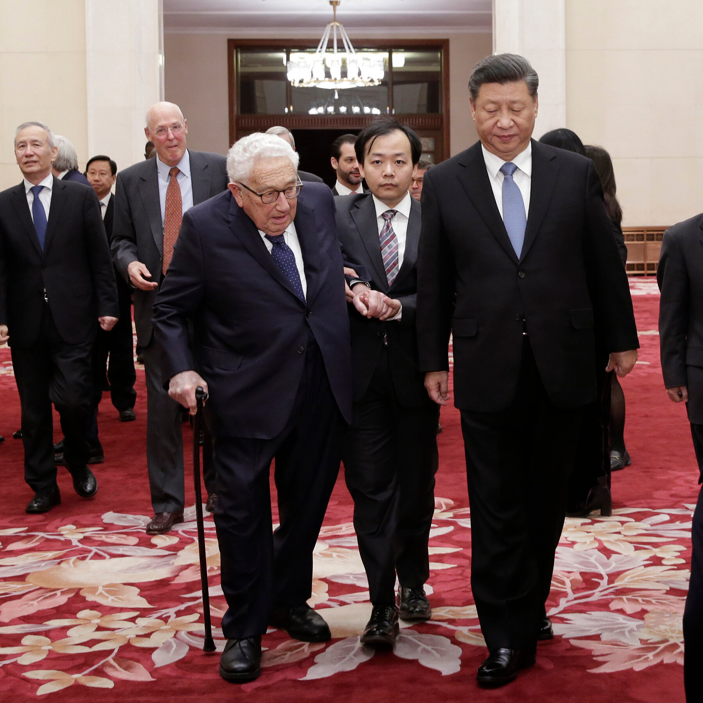
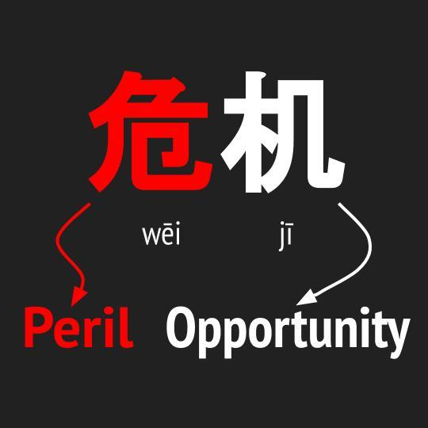
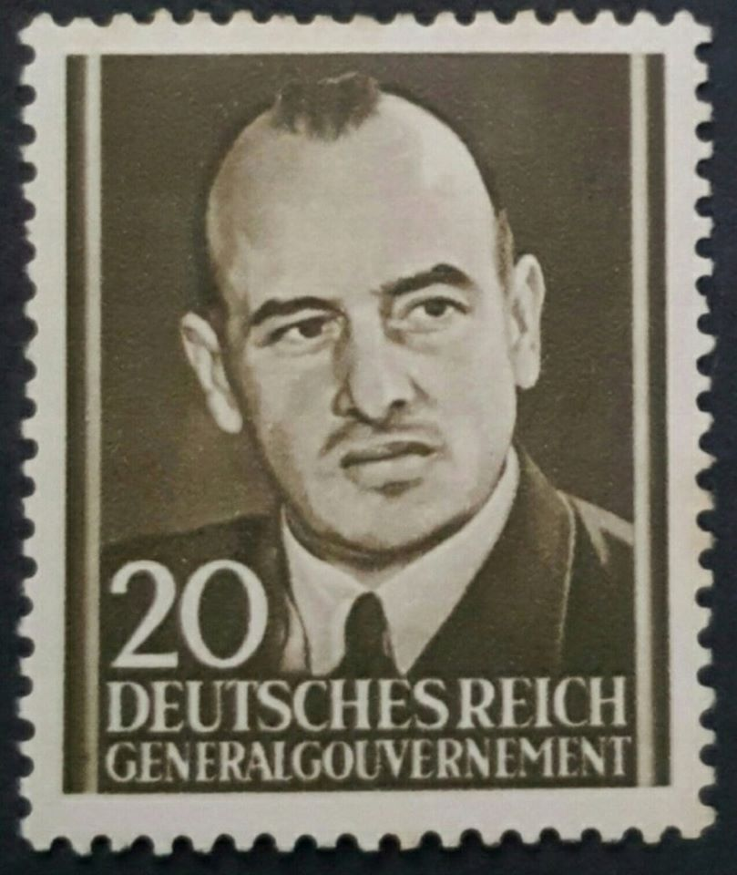
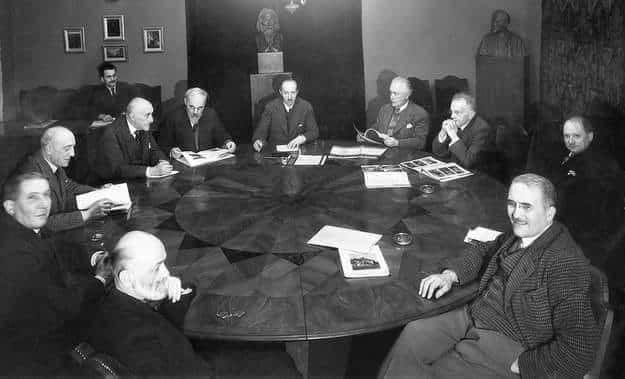
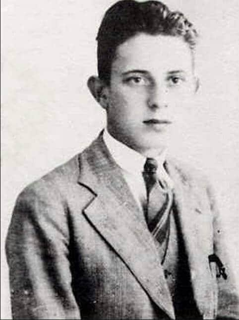

### 2023

100-year-old Henny Kissinger went to China. Kissinger and Xi discussed behind closed doors, **something that will affect us all.**

  

**The biggest threat to the world is not China, but $31.4 trillion US debt. US bonds price will crash inevitably and nuke many countries' economies. Hundreds of millions of jobs and trillions of dollars in pensions will disappear.**

When Xi Jinping started his 1st term, he was advised that the Chinese economy couldn't withstand the US bonds crash. China's deleveraging campaign was launched in 2013. 

It sent the two largest real estate developers to bankruptcy in 2021. By popping its own financial and real estate bubbles, in a controlled manner, the Chinese government defused an economic time bomb.

But Western experts say Xi is driving China into the brink of collapse, right? China has spent the past decade **insulating itself from the inevitable US bonds crash**. It won't be as enthusiastic about saving the US as in 2008. **The US economy is near its end. The only exit is war.**

Kissinger travelled to Beijing to discuss the possibility of war. Kissinger's trip to Beijing has only one purpose – to discuss how to **minimize damage when (not if) a war breaks out between China and the US.**

I hate being so doom and gloom. But here is a Chinese phrase – 危机 Whenever danger lurks, opportunity awaits..

  

---

> Economists have learned higher levels of technology or of industrial or agricultural arts derive from long histories of the "feed-back" of earned assets into components of the economy forming capacity for production at comparatively higher levels of technology, science, or arts

  

---

### 2020

  

Chińczycy polecieli na Marsa. Ruszyła misja Tianwen-1

Chiny rozpoczęły w czwartek swoją misję na Marsa. Na pokładzie rakiety znalazły się trzy urządzenia: sonda i lądownik z łazikiem, który będzie szukał śladów życia.

Misja Tianwen-1, czyli „poszukiwanie niebiańskiej prawdy”, rozpoczęła się w czwartek udanym wystrzeleniem rakiety Chang Zheng 5 („Długi marsz”) z wyspy Hajnan na Morzu Południowochińskim . To już drugi w tym tygodniu lot na Marsa. Wcześniej, w poniedziałek, swoją misję rozpoczęły Zjednoczone Emiraty Arabskie. Z kolei w przyszłym tygodniu Stany Zjednoczone wysyłają Perseverance, najbardziej zaawansowany łazik marsjański w historii, z Przylądka Canaveral na Florydzie.

---

Dom Maklerski Trigon szacuje, że zyski banków w całym 2020 r. spadną o połowę, a Związek Banków Polskich straszy, że aż o 85%. Ale te prognozy były publikowane jeszcze przed ogłoszeniem wyników banków, obejmujących cały czas lockdownu (czyli okres od marca do czerwca). Czy realne wyniki banków za ten okres coś zmieniają?

Pewne wskazówki dały wyniki finansowe Banku Millennium, szóstego co do wielkości banku w Polsce, mającego 2,7 mln klientów. I zarazem pierwszego, który podał wyniki za drugi kwartał. Czy najgorsze już za bankami i ich klientami, czy też jedni i drudzy dopiero wchodzą w kryzysową rzeczywistość?

---

Druga fala kryzysu. Emilewicz: przygotowujemy się na to, żeby przywrócić reżimy
- Przygotowujemy się na drugą falę epidemii jesienią, ale absolutnie nie dyskutujemy o ponownym lockdownie - zapewnia wicepremier i minister rozwoju Jadwiga Emilewicz.

---

### 1991

W Miami Beach na Florydzie zmarł Isaac Bashevis Singer (1904-91), pochodzący z Leoncina żydowski pisarz, prozaik, publicysta, krytyk literacki. W 1978 roku otrzymał literacką Nagrodę Nobla za "pełną uczucia sztukę prozatorską, która wyrastając z polsko-żydowskich tradycji kulturowych, porusza jednocześnie odwieczne problemy". Isaac Bashevis Singer tworzył w języku jidysz. Był autorem znanych powieści:
Szatan w Goraju, Rodzina Muszkatów, Sztukmistrz z Lublina, Dwór, Spuścizna i Szosa; a także tomów opowiadań Gimpel Głupek i inne opowiadania, Spinoza z ulicy Rynkowej, Spinoza z ulicy Targowej. Jego twórczość oscylowała w konwencji naturalistycznej, neoromantycznej, która często była zabarwiona groteską, fantastyką, czy wręcz surrealizmem. Wiele wątków czerpał z folkloru i mistyki żydowskiej, w tym z kabały. Przez ostatnie 35 lat życia był wegetarianinem. Swój wegetarianizm motywował względami etycznymi. W opowiadaniu Listy do Pisarza napisał: ,,Dla zwierząt wszyscy ludzie to naziści, a ich życie to wieczna Treblinka''.

### 1940

W Krakowie gubernator generalny Hans Frank (grafika) podpisał "Rozporządzenie o definicji pojęcia "Żyd" "

"Żydem jest ten, którego co najmniej trzej dziadkowie są pod względem rasowym pochodzenia czysto żydowskiego. Za Żyda uważa się tego, którego dwaj dziadkowie są pod względem rasowym pochodzenia czysto żydowskiego, o ile w dniu 1 września 1939 roku należał do żydowskiej gminy wyznaniowej lub po tym terminie zostaje do niej przyjęty, o ile w chwili wejścia w życie rozporządzenia niniejszego był w związku małżeńskim z Żydem lub po tym terminie w związek taki wchodzi, o ile pochodzi z pozamałżeńskiego obcowania z Żydem i urodzi się po dniu 31 maja 1941 roku".

  

### 1920

Wywiad przewodniczącego delegacji węgierskiej na konferencję pokojową w Paryżu Ivána Praznovszkyego udzielony gazecie „Liberté” 24 lipca 1920 roku.

Węgierska oferta marszu przeciwko Czerwonym.Zgodnie z relacją Pana Prasnowskyego

Zważywszy, że Węgry są w tej chwili jedynym prawdziwym bastionem przeciwko inwazji bolszewickiej, pan Teleki, premier Węgier, właśnie zaproponował oficjalnie Entencie pomoc zbrojną przeciwko postępowi czerwonych wojsk.
Rozmawialiśmy o tym z miłym i uprzejmym Panem Prasnowskym, ministrem węgierskim w Paryżu.
– Pan Prasnowsky powiedział, że nie zna jeszcze oficjalnego stanowiska swojego rządu w tej delikatnej kwestii i nie wie, czy rozmowy zostały już podjęte i na jakim są etapie. W każdym razie, oferta Węgier jest realna i ważne jest, aby dobrze zrozumieć motywy, jakimi kieruje się mój rząd. Jestem pewien, że pan Teleki nie tyle kieruje się interesem Węgier, który jest ważny, zważywszy na okoliczności, co niebezpieczeństwem, zagrażającym całej Europie. Jeżeli nieuzbrojone Węgry staną naprzeciw bolszewikom, reperkusje w Europie Zachodniej będą ogromne, a konsekwencjekatastrofalne. Dlatego Ententa musi zrozumieć, gdzie leżą jej prawdziwe interesy i dać państwu węgierskiemu skuteczne i ciągłe wsparcie moralne i materialne.
– Jakimi siłami dysponują Państwo w razie potrzeby?
– Obecnie, po wprowadzeniu w życie klauzuli wiążącego nas traktatu, dysponujemy niewielką armią liczącą 30 tys. żołnierzy, wystarczającą do pełnienia funkcji policji krajowej. Ale jeżeli Ententa nas poprze i wyjdziemy naprzeciw czerwonej zarazie, dojdzie do pospolitego ruszenia. Wszyscy się uzbroją i dysponować będziemy
wojskiem liczącym setki tysięcy żołnierzy, nie jestem w stanie powiedzieć dokładnie.
– Czy nie boi się Pan, Panie Ministrze, że uzbrojone Węgry wzbudzą podejrzenia?
– To właściwie przeszkoda moralna. Ale Ententa ma skuteczne środki kontro-
li. W Budapeszcie jest więcej misji wojskowych, które oferują wszelkie wymagane gwarancje. Co więcej, to jasne, że Węgry nie są w nastroju wojennym. Również u nas, nikt nie życzy sobie wojny. Nasz nieszczęśliwy kraj chce się bronić przeciwko bolszewikom. Ich interesy stoją obecnie w sprzeczności z interesami Europy i całej cywilizacji. Niech Ententa to zrozumie!
– Czego oczekują Węgry w zamian za tę pomoc?
– To delikatna kwestia. Jednocześnie, pragnę Pana zapewnić, że Węgry zostały całkowicie rozczłonkowane. Rozdarto ten kraj, który cieszył się jednością narodową, gospodarczą i techniczną, podczas gdy Austria była mozaiką.
To trudna do rozwiązania sytuacja. Węgry znalazły się w biedzie. Należy przekonać opinię publiczną. Proszę pomyśleć, że wokoło Budapesztu żyją w wagonach dziesiątki tysięcy uchodźców zbiegłych z ościennych państw, profesorów, adwokatów i ich rodziny, bez pieniędzy, bez żywności, bez odzieży. To cała niedola w tym horrorze.
List przewodni, podpisany przez Pana Milleranda, dołączony do dokumentu
traktatu, dał nam możliwość zmiany niektórych szczególnie trudnych warunków i otrzymania pomocy. Zróbmy to! [...]

---

W Belwederze odbyła się uroczystość zaprzysiężenia Rządu Obrony Narodowej.
Był to gabinet koalicyjny powołany do życia przez Józefa Piłdudskiego. Na jego czele stanął znany i szanowany działacz ludowy Wincenty Witos.
W skład Rządu Obrony Narodowej wchodziły takie partie jak: Polskie Stronnictwo Ludowe "Piast", Polska Partia Socjalistyczna, Związek Ludowo Narodowy, Polskie Stronnictwo Ludowe "Wyzwolenie", Stronnictwo Prawicy Narodowej, Narodowa Partia Robotnicza, Polskie Stronnictwo Chrześcijańskiej Demokracji, Zjednoczenie Mieszczańskie i Narodowe Zjednoczenie Ludowe.
Tak oto sam Witos wspominał to wydarzenie: "Jednego dnia, który nie był ani świątecznym, ani jarmarcznym, a przez to na zgromadzenia nieodpowiednim, zostałem w domu celem orki pod łubin i wywiezienia trochę nawozu w pole. Około godziny trzeciej po południu zwrócił mi uwagę parobek zaznaczając, że jakieś auto zajechało na podwórze domu, zapewne więc do mnie. Roboty nie przerywałem wiedząc, że jak kto ma do mnie interes, to mnie na pewno znajdzie. Nie omyliłem się, gdyż za parę minut przybył na pole oficer, z miną ogromnie poważną, a upewniwszy się, że ma ze mną do czynienia, oświadczył bardzo uroczyście, że przyjeżdża od Naczelnika Państwa, Piłsudskiego i ma jego rozkaz, żeby mnie natychmiast przywiózł do Warszawy".

  

### 1909

W Olszanie urodził się Jerzy Różycki - jeden z najwybitniejszych matematyków i kryptologów mających wpływ na szybsze zakończenie II wojny światowej. W 1927 roku rozpoczął studia matematyczne na Uniwersytecie Poznańskim. Podczas studiów należał do Korporacji Akademickiej Chrobria. W 1929 roku uczęszczał na kursy kryptologii, które zorganizowane zostały na polecenia Sztabu Głównego Wojsk w Instytucie Matematyki Uniwersytetu Poznańskiego. Różycki wyróżnił się talentem i został zaproszony do zespołu kryptologów pracujących w filii Biura Szyfrów Sztabu Głównego w Poznaniu. Od 1932 roku pracował w Biurze Szyfrów Sztabu Głównego Wojska Polskiego w Warszawie. Jerzy Różycki był twórcą metody zegara, która pozwalała określić, który z trzech szyfrujących wirników Enigmy był danego dnia w pozycji N. W styczniu 1933 roku razem z Marianem Rejewskim oraz Henrykiem Zygalskim złamał kod niemieckiej maszyny szyfrującej Enigma. Od stycznia 1933 roku Polacy byli jedynymi, którzy odczytywali niemalże wszystkie zakodowane niemieckie depesze. W 1937 roku Jerzy Różycki uzyskał tytuł magistra geografii na Uniwersytecie Poznańskim. Razem z Marianem Rejewskim i Henrykiem Zygalskim skonstruował kilka replik maszyny szyfrującej Enigma. W sierpniu 1939 roku skonstruowane repliki oddano w ręce Anglików i Francuzów. We wrześniu 1939 roku Jerzy Różycki ewakuował się razem z Biurem Szyfrów do Rumunii, a później do Francji, gdzie wraz z kolegami rozpoczął pracę nad rozszyfrowywaniem Enigmy oraz łamaniem niemieckich i włoskich szyfrów telegraficznych. Zginął 9 stycznia 1942 w tajemniczych okolicznościach w katastrofie statku Lamoricière w rejonie Balearów. Jerzy Różycki wraz z zespołem został pośmiertnie uhonorowany Krzyżem Wielkim Orderu Odrodzenia Polski - "w uznaniu wybitnych zasług dla Rzeczypospolitej Polskiej".

  

---

<a href="https://github.com/TomaszWaszczyk/historia.waszczyk.com/edit/master/src/content/july-24.md" target="_blank">Edytuj tę stronę dzieląc się własnymi notatkami!</a>
