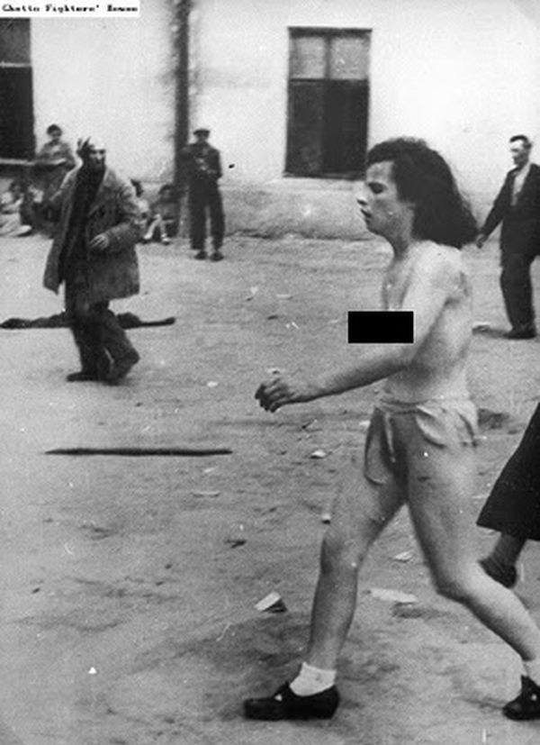

### 1968

https://pl.wikipedia.org/wiki/Humanae_vitae

### 1941

Pogromy lwowskie w 1941 to dwa pogromy ludności żydowskiej Lwowa, jakie miały miejsce latem 1941 r., po ataku Niemiec na ZSRR i rozpoczęciu okupacji miasta przez III Rzeszę.

Zachęceni przez siły niemieckie, ukraińscy nacjonaliści zamordowali około 4000 Żydów. Pojmanych mężczyzn zmuszano do wynoszenia zwłok ofiar zamordowanych w więzieniach i pochówku zamordowanych, wielu bito na śmierć lub zastrzelono. Specjalna ekipa filmowa Wehrmachtu filmowała pogrom, filmy były pokazywane później w oficjalnej kronice filmowej Ministerstwa Propagandy Rzeszy

Drugi pogrom we Lwowie 25-27 lipca 1941 był zaplanowaną akcją niemieckich władz okupacyjnych. Dużą rolę odegrała propaganda OUN-B, która podsycała antysemickie nastroje. Zwana kolokwialnie przez ludność Lwowa dniami Petlury (od Symona Petlury) była zorganizowaną akcją niemieckich władz okupacyjnych z ich przyzwoleniem na bicie, grabież i mordowanie Żydów przez przygotowane w tym celu grupy Ukraińców. Część Żydów, przedstawicieli inteligencji, została zamordowana na podstawie przygotowanych list proskrypcyjnych. Zamordowano od 1500 do 2000 ludzi.
Na początku listopada 1941 roku Niemcy utworzyli getto w północnej części Lwowa. W marcu 1942 roku Niemcy rozpoczęli deportację Żydów z getta do obozu zagłady w Bełżcu.
Tysiące Żydów wywieziono na roboty przymusowe do pobliskiego obozu

  

### 1926

https://en.wikipedia.org/wiki/Tad_Szulc

### 1894

https://pl.wikipedia.org/wiki/Gavrilo_Princip

### 25 lipca

https://pl.wikipedia.org/wiki/Ob%C5%82awa_augustowska

---

<a href="https://github.com/TomaszWaszczyk/historia.waszczyk.com/edit/master/src/content/july-25.md" target="_blank">Edytuj tę stronę dzieląc się własnymi notatkami!</a>
