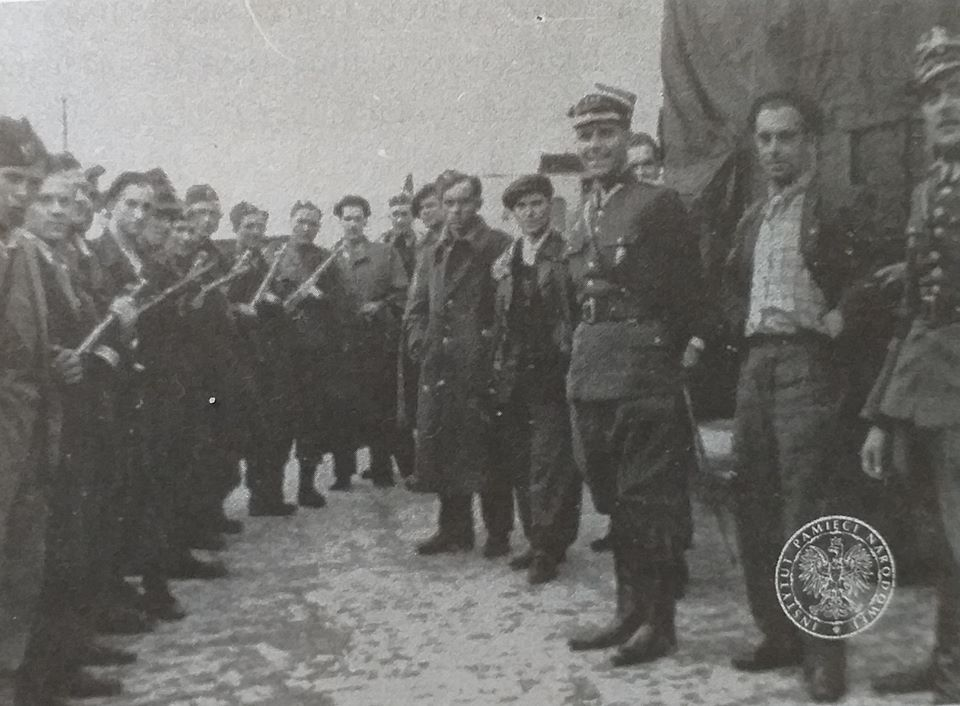
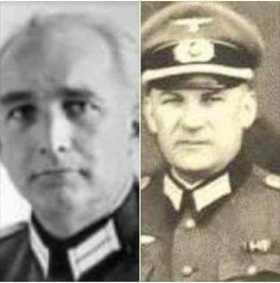
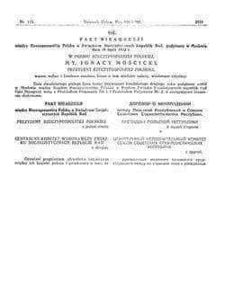
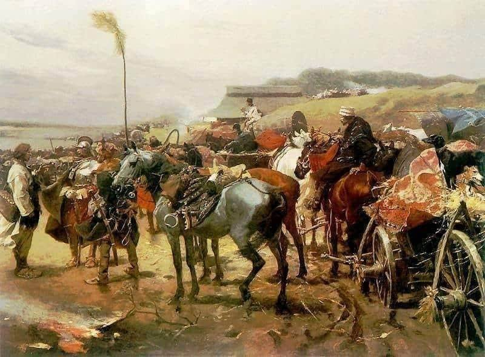

### 1968

https://pl.wikipedia.org/wiki/Humanae_vitae

### 1949

Fragment wspomnień jednego z tajnych współpracowników Urzędu Bezpieczeństwa Publicznego:

"Idąc do UB, nie spodziewałem się uznania kolegów z lasu. Ale obiecano mi, (...), że nie będę musiał walczyć z dawnymi kolegami z lasu. Mam czyste sumienie. Żaden z moich przyjaciół nie ucierpiał przeze mnie. (...) Pod żadnym ze skazanych nie znajdzie pan mojego nazwiska. Ci ludzie szli na szubienicę bez mojej pomocy.
(...) Rozmowa była grzeczna. Propozycja złożona kulturalnie. Po prostu zwykła rozmowa dwóch dżentelmenów. Wędrujący dał oficerskie słowo, że nie będę musiał pracować przeciwko dawnym kolegom. (...) Nie bito mnie, do niczego nie zmuszano. Otrzymałem propozycję. Dobrowolnie ją przyjąłem. Wciągało mnie ryzyko. Ciągnęła przygoda. Marzyło mi się interesujące życie".

Na zdjęciu funkcjonariusze UB po udanej akcji likwidacji oddziału "Wiarusy" ("Znicz") 25 lipca 1949 roku, osiedle Surówki koło Rabki. Po lewej stronie komunistyczna grupa odgrywająca partyzantów.

  

### 1942

Historia dwóch niemieckich oficerów, która pokazuje, że człowiekiem można być zawsze.
Pułkownik Wehrmachtu doktor prawa Albert Battel i major Max Liedtke to bohaterowie tej opowieści.
Pierwszy z nich urodził się na obecnych terenach Dolnego Śląska, drugi w obecnym województwie warmińsko-mazurskim. Ich życiowe drogi spłotły się w Przemyślu.
Przypomnijmy, że miasto to zostało zajęte przez Niemców 24 czerwca 1941 roku, ale już około rok wcześniej w jego lewobrzeżnej dzielnicy Zasanie utworzono getto żydowskie, które następnie powiększono o kolejne dzielnice.
Jednak 3 lipca 1942 roku, sprawujący w Przemyślu władzę komendant miasta Bernard Giesselmann wydał rozporządzenie, na mocy którego dzielnica żydowska miała zostać w znacznym stopniu ograniczona. Realizacja tego pomysłu została szybko wprowadzona w życie, ponieważ już 22 lipca 1942 roku do Przemyśla przybył pełnomocnik dowódcy SS i policji w Krakowie Hauptsturmführer Martin Falenz, który w porozumieniu z władzami miasta ustalił główne zamierzenia akcji "Reinhard", której celem było wysiedlenie ludności żydowskiej z przemyskiego getta. Do realizacji tych planów przystąpiono już 26 lipca 1942 roku.
To wtedy właśnie rozpoczyna się historia Battela i Liedtke. Ten drugi był komendantem przemyskiego garnizonu Wehrmachtu, którego planujący wysiedlenia nie poinformowali o swoich zamiarach, a także bezpośrednim przełożonym Battela.
W sobotę 25 lipca dzielnica żydowska została zamknięta i odcięta od reszty miasta kordonem 307. batalionu policji kapitana Schallera.
Nie zdający sobie z niczego sprawy Battel niezwłocznie zawiadomił o zaistniałej sytuacji Liedtkego, który postanowił interweniować u szefa przemyskiego gestapo SS- untersturmführera Adolfa Benthinema, prosząc go o wstrzymanie działań deportacyjnych członków żydowskich służ pracowniczych. Interwencja okazała się bezcelowa. W zaistniałej sytuacji Liedtke i Battel zdający sobie sprawę, że deportacja Żydów jest równoznaczna z wyrokiem śmierci w obozowych komorach gazowych podjęli własne działania. Liedtke wydał rozkaz zamknięcia mostu na Sanie i nieprzepuszczania SS- manów pod groźbą użycia broni. 
Dosyć kuriozalna i napięta w mieście sytuacja doprowadziła do nieporozumień na szczycie niemieckich władz Przemyśla, co zaowocowało kompromisem, na mocy którego z deportacji wyłączono robotników żydowskich do lat 35 pracujących dla Wehrmachtu. W zamian za to Liedtke miał odwołać blokadę mostu na Sanie. Jednak już w godzinach popołudniowych Niemcy organizujący wywózkę z getta zerwali to porozumienie bez porozumienia z Liedtkem. Zmusiło go to do wydania kolejnego rozkazu, tym razem Battelowi, którego zadaniem miało być wyprowadzenie z getta 4 000 żydowskich robotników pracujących dla Wehrmachtu. Oczywiście nie obyło się bez problemów, ponieważ dowodzący jednostką policyjną porucznik Kiesel zaczął stawiać opór. Zmusiło to Battela do użycia plutonu Wermachtu i wdarcia się siłą na teren getta, skąd na ciężarówkach udało mu się wywieźć 100 robotników oraz ich rodziny, a także udzielić im schronienia w budynku komendantury miasta. Części z nich udało się zbiec z getta i ocalić życie. Natomiast dla reszty Żydów znajdujących się w getcie los nie był już tak łaskawy. Opór Wehrmachtu został ostatecznie złamany i 27 lipca, z jednodniowym opóźnieniem, odszedł pierwszy transport – z 3850 Żydami – do obozu zagłady w Bełżcu. Getto było zresztą sukcesywnie i systematycznie likwidowane aż do września 1943 roku, kiedy to wywieziono do obozu w Oświęcimiu około czterech tysięcy pozostałych przy życiu Żydów.
Po zajściach w Przemyślu władze SS wszczęły śledztwo w sprawie niepokornych podwładnych.
Major Liedtke 30 września 1942 roku, w dwa miesiące po pamiętnych zajściach, został odwołany z funkcji komendanta miasta Przemyśla i translokowany karnie na front wschodni, do 1. Armii Pancernej walczącej na Kaukazie. W początku 1945 roku ewakuowano go na Bornholm, jednak tuż po zakończeniu II wojny światowej przerzucono z powrotem do Związku Radzieckiego, gdzie był sądzony za domniemane zbrodnie wojenne. Zmarł w obozie pracy przymusowej w Workucie 13 stycznia 1955 roku13 . Battel natomiast został objęty dozorem naczelnego dowódcy polowego z Krakowa, generała majora von Hobertha. W 1944 roku odwołany ze służby ze względu na kłopoty z sercem, powrócił do Wrocławia, gdzie desygnowany do Volkssturmu, dostał się do radzieckiej niewoli. Po zwolnieniu osiedlił się w Niemczech Zachodnich. Zaraz po zakończeniu wojny, w 1946 roku, wszczęto przeciwko niemu procedurę denazyfikacyjną, po której zakończeniu uznano go za sympatyka nazizmu i zakazano wykonywać zawód adwokata. Zmarł w 1952 roku w Hattersheimie niedaleko Frankfurtu nad Menem.
Obaj opisani tu niemieccy oficerowie znaleźli się na liście Instytutu Yad- Vashem pośród 601 innych Niemców upamiętnionych tytułem Sprawiedliwy Wśród Narodów Świata.

  

### 1941

Pogromy lwowskie w 1941 to dwa pogromy ludności żydowskiej Lwowa, jakie miały miejsce latem 1941 r., po ataku Niemiec na ZSRR i rozpoczęciu okupacji miasta przez III Rzeszę.

Zachęceni przez siły niemieckie, ukraińscy nacjonaliści zamordowali około 4000 Żydów. Pojmanych mężczyzn zmuszano do wynoszenia zwłok ofiar zamordowanych w więzieniach i pochówku zamordowanych, wielu bito na śmierć lub zastrzelono. Specjalna ekipa filmowa Wehrmachtu filmowała pogrom, filmy były pokazywane później w oficjalnej kronice filmowej Ministerstwa Propagandy Rzeszy

Drugi pogrom we Lwowie 25-27 lipca 1941 był zaplanowaną akcją niemieckich władz okupacyjnych. Dużą rolę odegrała propaganda OUN-B, która podsycała antysemickie nastroje. Zwana kolokwialnie przez ludność Lwowa dniami Petlury (od Symona Petlury) była zorganizowaną akcją niemieckich władz okupacyjnych z ich przyzwoleniem na bicie, grabież i mordowanie Żydów przez przygotowane w tym celu grupy Ukraińców. Część Żydów, przedstawicieli inteligencji, została zamordowana na podstawie przygotowanych list proskrypcyjnych. Zamordowano od 1500 do 2000 ludzi.
Na początku listopada 1941 roku Niemcy utworzyli getto w północnej części Lwowa. W marcu 1942 roku Niemcy rozpoczęli deportację Żydów z getta do obozu zagłady w Bełżcu.
Tysiące Żydów wywieziono na roboty przymusowe do pobliskiego obozu

  

### 1932

W Moskwie Polska i Związek Radziecki podpisały Pakt o Nieagresji. Układ ten zawarto na 3 lata, ale zapisano w nim klauzulę, która mówiła, że po tym czasie przedłuży się on automatycznie o następne 2 lata pod warunkiem, że że żadna ze stron go nie zerwie sama. W roku 1934 oba państwa podpisały kolejną klauzulę przedłużającą pakt na kolejne 11 lat.
Nie trzeba chyba dodawać, że umowa ta straciła ważność 23 sierpnia 1939 roku, kiedy to doszło do podpisania niemiecko- radzieckiego układu Ribentropp- Mołotow skierowanego przeciwko Polsce.

  

### 1926

https://en.wikipedia.org/wiki/Tad_Szulc

### 1894

https://pl.wikipedia.org/wiki/Gavrilo_Princip

### 25 lipca

https://pl.wikipedia.org/wiki/Ob%C5%82awa_augustowska

### 1655

Podczas rozpoczynającego się potopu szwedzkiego skapitulowała pod naporem wojsk króla Karola Gustawa polska załoga broniąca Ujścia. Obrona tego miasta będąca częscią tak zwanego" pospolitego ruszenia " miała za zadanie powstrzymanie dalszego marszu Szwedów na południe Polski. Broniący się przez pięć dni Polacy zmuszeni zostali do opuszczenia swoich pozycji.
25 lipca podpisany został akt kapitulacji dający jednocześnie królowi szwedzkiemu pełnię władzy nad województwem poznańskim i kaliskim.

  

---

<a href="https://github.com/TomaszWaszczyk/historia.waszczyk.com/edit/master/src/content/july-25.md" target="_blank">Edytuj tę stronę dzieląc się własnymi notatkami!</a>
