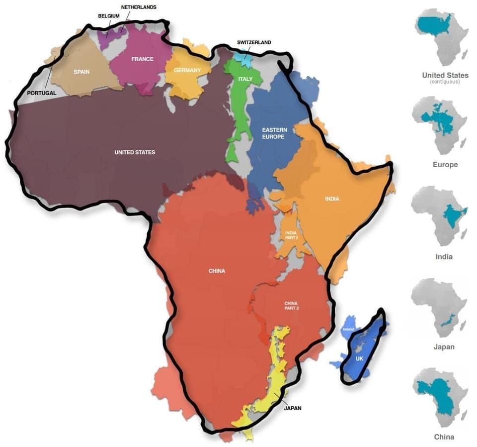

### 2023

Tencent został większościowym udziałowcem w Techland

---

Adwokaci, audytorzy i doradcy podatkowi nie mają wątpliwości. Ostrzegają, że to, co szykuje rząd, jest bardzo niebezpieczną ustawą. Jej uchwalenie oznacza, że ujawnione zostaną poufne informacje o dużych firmach, które przedsiębiorcy przekazują biegłym rewidentom. Chodzi m.in.o dane o marżach, warunkach kontraktów, planach rozwoju itd. Polska kolejny raz naruszy też unijne przepisy i narazi się Komisji Europejskiej.
Trzy samorządy zawodowe krytykują projekt, który powstał w ministerstwie kierowanym przez Janusza Cieszyńskiego
Krajowa Rada Biegłych Rewidentów, Naczelna Rada Adwokacka i Krajowa Rada Doradców Podatkowych zarzucają naruszenie tajemnic: państwowej, handlowej, przedsiębiorstwa, bankowej, adwokackiej i wielu innych
Problem nie dotyczy jednak samych audytorów, ale firm, które przekazują im swoje wrażliwe dane. Dziś każda firma audytorska dostaje dane od przedsiębiorstw, które bada. Następnie przechowuje je i zabezpiecza dostęp do nich. Ochrona tych danych musi być na najwyższym poziomie, bo mówimy o najbardziej chronionych informacjach. Za ich ujawnienie firmie audytorskiej grozi odpowiedzialność cywilna i karna. Rząd chce, aby te dane były gromadzone w jednym miejscu. Katastrofę nietrudno sobie wyobrazić. Chodzi również o dane firm kluczowych z punktu widzenia bezpieczeństwa państwa.
Projekt budowy centralnej e-bazy akt badań to rozwiązanie, które tworzy systemowe ryzyko dla polskiej gospodarki — komentuje dla Business Insidera Kamil Jesionowski, prezes Krajowej Rady Biegłych Rewidentów.
Organizacje audytorów, adwokatów i doradców podatkowych, a także Rada Przedsiębiorczości mówią jednym głosem: to jest bardzo niebezpieczna zmiana. I apelują do rządu i Sejmu o wycofanie się z tego pomysłu.

---

Shanghai: ~55C

---

<br><br>

---

```
**US banking system faces $78 billion exodus as brics nations seek dollar alternatives.**

❌ The upcoming #BRICS summit in South Africa will n̳o̳t̳ discuss the creation of a common BRICS currency. However, Brazil, 🇷🇺 Russia, 🇮🇳 India, 🇨🇳 China, and 🇿🇦 South Africa remain committed to reducing their reliance on the U.S. #dollar by promoting trade and settlements in local currencies.

💱 The idea of a common currency was previously advocated by some BRICS leaders seeking to challenge the dominance of the dollar in the global financial system.

💸 Despite the push for a common currency, 🇮🇳 India's foreign minister emphasized that currencies will remain a national issue for the foreseeable future, and South Africa's central bank governor pointed out the need for significant financial and macroeconomic integration to make a common currency viable.
🔗 https://www.reuters.com/world/brics-currency-not-august-summit-agenda-south-african-official-2023-07-20/

🇺🇸 In other news, the U.S. banking system is experiencing a significant deposit flight, with $78 billion leaving American bank accounts in just one week. Major banks are facing pressure to compete with higher-yielding money market accounts and must adapt to demands for higher interest rates to prevent further deposit flight.
https://fred.stlouisfed.org/release/tables?rid=22&eid=822916#

🏦 JPMorgan Chase CEO Jamie Dimon issued a warning to shareholders about the banking sector's challenges in maintaining profitability amid limited pricing power.
🔗 https://www.wsj.com/articles/big-banks-earnings-had-some-bad-news-for-smaller-banks-dff7fa2

🏘 Furthermore, the commercial real estate sector in the U.S. is bracing for potential fallout due to the rise of remote and hybrid work environments. Many American banks are considered overexposed to commercial real estate loans based on regulatory guidelines, posing potential risks to the banking industry.
🔗 https://dailyhodl.com/2023/07/21/78000000000-exits-us-banking-system-in-one-week-as-jpmorgan-ceo-issues-alert-on-deposit-flight/

```

---

> Ukraińcy założyli w Polsce 29,4 tys. działalności gospodarczych. Nowe dane PIE

Konkurencja gospodarki Polski w dół.

---

### 2020

<br><br>

### 2010

Mianem Bazylei lub Porozumienia Bazylejskiego określa się zespół regulacji dotyczących wymogów kapitałowych i zarządzania ryzykiem w banku działających transgranicznie. Obecnie obowiązuje Bazylei II, natomiast została opracowana jej nowsza wersja nazywana Bazyleą III. Okres implementacji trzeciej Bazylei jest stosunkowo długi. Wprowadzanie jej wszystkich postanowień ma zakończyć się w styczniu 2019 roku.

Bazylea III została ogłoszona 26 lipca 2010 r., a jej główne założenia mają być dyskutowane na najbliższym szczycie G–20, który odbędzie się w listopadzie w Seulu.

Bazylea III wprowadza instytucję dodatkowego buforu kapitałowego (ang. Capital conservation buffer), którego rolą będzie absorpcja strat przez banki w okresie kryzysów i napięć ekonomicznych. Dla banków, których współczynniki wypłacalności (współczynnik McDohana) będą zbliżone do wymaganego minimum, przewiduje się dalsze ograniczenia możliwości korzystania z przychodów banku i tym samym, zwiększenie wymogów co do samego buforu. Wskaźnik buforu ma wynosić 2,5%. Z tym, że ten pułap ma w założeniu zostać osiągnięty przez banki w styczniu 2019 roku, a datą wyjścia jest styczeń 2016 roku ze wskaźnikiem buforu na poziomie 0.625%.  Drugim buforem proponowanym przez twórców Bazylei III jest w bufor kapitałowy antycykliczny (ang. Countercyclical capital buffer). Jego wskaźniki wahają się na poziomie 0-2,5 %. Implementacja tego buforu zależeć będzie od warunków ekonomicznych i bankowych w danym państwie. A wyznaczenie wskaźnika ma pozostać w gestii krajowych regulatorów. Banki, których współczynnik wypłacalności będzie zbliżony do poziomu 2,5% będą miały obowiązek stworzenia i utrzymywania takiego buforu, a ponadto będą musiały liczyć się z dodatkowymi ograniczeniami. Te ograniczenia mają przede wszystkim dotyczyć wypłaty dywidend, transakcji typu buy back akcji banku oraz przyznawania wszelkiego rodzaju bonusów.

Dodatkowo, banki uznane za kluczowe muszą liczyć się ze zwiększeniem wymogów kapitałowych. Co prawda, nie ogłoszono jeszcze, jakie banki i instytucje finansowe obejmować będzie termin systematically important banks, ale trzeba będzie wziąć pod uwagę zwiększenie rezerw celowych. W założeniu autorów trzeciej Bazylei bowiem, strategiczne banki powinny z zasady legitymować się większą niż przeciętna absorpcją strat.

Zmiany dotyczą też regulacji kapitałowych. I tak współczynnik wypłacalności w drugiej Bazylei oscylował na poziomie 4% (w stosunku do funduszy podstawowych), a podstawowym minimum było 2%. Proponowane założenia podwyższają te pułapy odpowiednio do 6% i 4,5%. Przy czym osiągnięcie 4,5% ma nastąpić dopiero w styczniu 2015 roku.

Bazylea trzy wprowadza tzw. współczynnik lewarowania (ang. Leverage ratio). Jego rolą będzie ograniczanie zbytniego lewarowania czyli sensu largo udzielania finansowania przy małym udziale kapitału początkowego.

Autorzy trzeciej Bazylei podkreślają znaczenie twardego kapitału akcyjnego (tzw. equity) dla funduszy własnych banku. Oparcie kapitału banku na equity pozwoli skorzystać z equity do odpisywania strat. Tym samym, z equity wyłączone zostają m.in. goodwill czy udziały mniejszościowe. Wzmocnienie roli equity ma służyć też właściwej gospodarce rachunkowej banku i zaprzestaniu praktyk kreatywnego księgowania z wykorzystaniem transakcji opartych na długu.
» Czy Bazylea jest potrzebna bankom?

Na pierwszy rzut oka rozwiązania proponowane w ramach trzeciej Bazylei wydają się być wynikiem troski specjalistów bankowych o dobrą kondycję rynku bankowego. Z założenia Bazylea III ma służyć wzmocnieniu stabilności banków i zwiększenia gwarancji bezpieczeństwa środków. Wskazuje się na konieczność ograniczenia ekspozycji derywatowych, w szczególności instrumentów typu OTC (ang. Over the counter) pozwalających na większą swobodę umowną. Intencje są może i szlachetne, ale nie brak jest krytyków takich rozwiązań.

Bazylea III proponuje odgórne i jednakowe dla wszystkich wskaźniki jako gwarant bezpiecznej bankowości globalnej. Jednak, kwestią wysoce dyskusyjną pozostaje adekwatność rozwiązań bazylejskich do narodowych systemów bankowych. Nie można bowiem zapominać, iż każdy kraj rządzi się swoimi prawami w odniesieniu do banków i próby narzucania wspólnego mianownika dla wszystkich może okazać się trudne do realizacji. Ponadto, o ile państwa członkowie BNKB zastosują się do zaleceń, o tyle pozostałe państwa mogą uznać zalecenia za bardzo ingerujące w ich wewnętrzne regulacje bankowe. Stany Zjednoczone jak na razie nie wydały oświadczenia w sprawie implementacji Bazylei III na swój grunt. Francja uzależniła implementacje Bazylei III od decyzji USA. Czy zatem obecny, nerwowy klimat wokół zaleceń BKNB sprzyja wprowadzeniu zasad na grunt prawa krajowego? Jeśli przyjmiemy, iż pełna implementacja postanowień Bazylei III nastąpi w 2019 r., jest dużo czasu na przeprowadzenie postulowanych zmian. Jednak, lata 2015- 2019 r. mogą być końcem obecnego kryzysu finansowego i banki jak i regulatorzy mogą uznać proponowane dzisiaj zalecania za zbyt ostrożnościowe i co za tym idzie, nie przystające do rzeczywistości.  Krytycy Bazylei III wskazują również na możliwość przerzucenia przez banki ryzykownych operacji z wykorzystaniem instrumentów pochodnych na banki w innych regulacjach prawnych (nierespektujących zaleceń bazylejskich).  W takich wypadkach, wszelkie odgórne wymogi nie mają racji bytu, a i bank matka lokujący ryzykowną część portfolio w spółkę córkę pozostaje poza zasięgami Bazylei.

Kolejna kontrowersyjna kwestia to kwestia dotycząca rozporządzania dochodem banku. Jak wspomniano powyżej, normy Bazylei III mogą znacznie ograniczyć wypłaty dywidend. Celem takiej polityki ma być oczywiście zwiększenie wypłacalności banków, ale nie można lekceważyć długoterminowych skutków takich planów. Ograniczenia co do dywidendy uderzają przede wszystkim w akcjonariuszy banku. Pomijając fakt, że banki uważane są za instytucje zaufania publicznego, są to zwykłe spółki, które mają zarabiać. Podobnie rzecz ma się z wypłatami premii czy bonusów. Zaleca się ograniczenia wypłacania premii. Jednak brak jest doprecyzowania czy ograniczenie to ma obejmować pracowników banku czy może jedynie kadrę zarządzającą lub aparat kierowniczy. Zresztą, problem wynagrodzeń w sektorze finansowym został już poruszony w europejskich Raporcie de Larosiere’a. Raport zwraca uwagę na nadmierny poziom wynagrodzeń w sektorze finansowym. Raport zaleca, aby wysokość premii wypłacanych przez instytucje finansowe była adekwatna do faktycznych osiągnięć danej osoby, ale także aby uwzględniała wieloletni horyzont czasowy. Takie rozwiązania mają wzmacniać skuteczne zarządzanie ryzykiem. Jednakże nasuwa się pytanie- czy odgórne zalecenia mogą tak dalece ingerować w gospodarkę płacową banków? Trudno to sobie wyobrazić. Co prawda, ograniczenia trzeciej Bazylei mają dotyczyć jedynie tych banków, których wypłacalność jest na poziomie zbliżonym do wymaganego minimum, jednak w praktyce może to się okazać niekorzystne dla banków z kadrowego punktu widzenia.

Pytań w stosunku do nowej Bazylei jest wiele. Wiele jest też zarzutów i kontrowersji. Przykłady Bazylei I i II pokazały, że jest potrzeba odgórnej ujednoliconej regulacji bankowej. Sama idea przyświecająca twórcom Bazylei III też jest szlachetna – ma chronić i banki i klientów, a przez to gospodarkę światową. Jednak, wykorzystanie tej idei w praktyce może okazać się złudne. Czasu do implementacji zostało jeszcze sporo.

### 1991

https://pl.wikipedia.org/wiki/Podatek_dochodowy_od_os%C3%B3b_fizycznych

### 1948

<video width="640" height="480" controls>
<source src="./movies/july/luksus-prl.mp4" type="video/mp4">
Your browser does not support the video tag.
</video>

https://en.wikipedia.org/wiki/Executive_order

---

<a href="https://github.com/TomaszWaszczyk/historia.waszczyk.com/edit/master/src/content/july-26.md" target="_blank">Edytuj tę stronę dzieląc się własnymi notatkami!<a>
