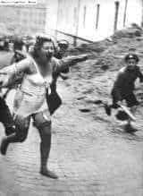
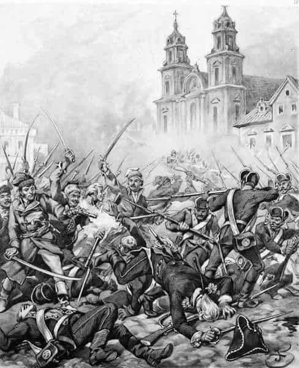

### 2022

  

### 2020

Okładka The Economist nawiązująca do kolejnych pakietów pomocowych w USA i innych częściach świata. W UE negocjowano o 750 mld euro pakietu na odbudowę, a w USA Trump wspomina już o kolejnym pakiecie pomocowym, a jego doradcy ekonomiczni chcą naciskać na obniżenie podatku od wynagrodzeń i wdrożenie innych środków, które skłoniłyby pracodawców do podtrzymania zatrudnienia. Jakie to przyniesie skutki dla świata i rynków finansowych? Pewnie sensowne wnioski wyciągniemy za kilka lat :)

Pozwoliłem sobie kilka zdań wstępniaka przetłumaczyć żeby zachęcić do lektury takich mediów:

"Nasza okładka w tym tygodniu dotyczy głębokich zmian zachodzących w ekonomii w wyniku pandemii COVID-19. Podobnie jak w latach 70., kiedy keynesizm ustąpił miejsca monetaryzmowi Miltona Friedmana, i w latach 90., kiedy banki centralne uzyskały niezależność, tak dzisiaj koronawirus wyznacza nowy paradygmat. Charakteryzuje się on pożyczkami rządowymi, drukowaniem pieniędzy i interwencjami na rynkach kapitałowych - wszystko to jest wspierane przez niską inflację. Każda epoka ekonomii staje przed nowym wyzwaniem. Po latach trzydziestych zadaniem było zapobieganie depresjom. W latach siedemdziesiątych i wczesnych osiemdziesiątych Świętym Graalem miała być kwestia zakończenia stagflacji. Dziś decydenci muszą stworzyć ramy, które umożliwią zarządzanie cyklem koniunkturalnym i zwalczanie kryzysów finansowych bez upolitycznionego przejmowania gospodarki."

---

GOLD (XAU/USD) Hit All Time High Today at the moment USD 1,932 per ounce

---

  

### 1947

"Od maja ubiegłego roku pracuję jako rębacz na kopalni „Jadwiga” w Zabrzu. W lutym br. wykonałem normę 240%, wyrąbując 72,5 m chodnika. W kwietniu wykonałem normę 293%, wyrąbując 85 m chodnika. W maju dałem 270%, wyrąbując 78 m chodnika."

Tymi słowami 27 lipca 1947 roku zawartymi w liście otwartym do górników wzywał do współzawodnictwa pracy i przekraczania norm rębacz kopalni Jadwiga Wincenty Pstrowski (zdjęcie).
Ogłoszony przez komunistyczną polską propagandę pierwszym przodownikiem pracy ufał, że w ten sposób przyczyni się do szybszej odbudowy zniszczonego wojną kraju.

  

### 1941

We Lwowie zakończyły się "Dni Petlury" czyli pogrom około 2000 Żydów inspirowany przez Niemców, a wykonany rękoma ukraińskich szowinistów z milicji ukraińskiej i OUN-B.
Nazwa "Dni Petlury"pochodzi od zamordowanego w 1926 roku przez żydowskiego agenta  OGPU byłego prezydenta Ukrainy Semena Petlury.

  

### 1918

Z inicjatywy księdza Idziego Radziszewskiego powołano Katolicki Uniwersytet Lubelski.

Po tym, jak bolszewicy zlikwidowali petersburską Akademię Duchowną, gdzie kształcili się między innymi polscy duchowni, ksiądz Idzi Radziszewski zaczął kwestować u tamtejszej Polonii i zabiegał o powołanie kolejnej uczelni.

Głównymi fundatorami tej instytucji byli przemysłowiec Karol Jaroszyński i inżynier Franciszek Skąpski. Na miejsce placówki wybrano Lublin.

Polscy biskupi przychylili się do pomysłu i 27 lipca 1918 roku, w trakcie zjazdu duchowieństwa Królestwa Polskiego w Warszawie z udziałem nuncjusza apostolskiego Achillesa Ratti, powołano do życia uczelnię, która początkowo nosiła nazwę Uniwersytetu Lubelskiego

Celem nowo utworzonej instytucji, której pierwszym rektorem został ksiądz Radziszewski, było prowadzenie badań naukowych w duchu harmonii między nauką i wiarą, kształcenie kadry inteligencji katolickiej oraz podnoszenie narodu na wyższy poziom życia religijnego i intelektualnego. Dewizą uczelni stało się hasło "Deo et Patriae" - "Bogu i Ojczyźnie".

Jesienią 1918 roku Uniwersytet rozpoczął działalność, a inauguracja miała miejsce 8 grudnia. Początkowo Uniwersytet Lubelski korzystał z budynków seminarium duchownego. Obejmował wtedy cztery wydziały: Teologiczny (otwarty w 1918), Prawa Kanonicznego, Prawa i Nauk Społeczno-Ekonomicznych oraz Nauk Humanistycznych.

### 1794

Podczas insurekcji kościuszkowskiej wojska pruskie wykorzystując całkowite zaskoczenie Polaków zdobyły ich pozycje na Woli. Pomógł im w tym polski jeniec, który zdradził polskie plany. Siłą dwóch batalionów wojska pruskie wspierane przez huzarów uderzyły na oddziały generała Józefa Zajączka broniące reduty wolskiej. Polacy, prowadząc szarżę próbowali bezskutecznie odzyskać utracone pozycje. Pokonali ich wspierający Prusaków Ukraińcy z I Ukraińskiej Brygady Kawalerii Narodowej.

  

---

<a href="https://github.com/TomaszWaszczyk/historia.waszczyk.com/edit/master/src/content/july-27.md" target="_blank">Edytuj tę stronę dzieląc się własnymi notatkami!</a>
