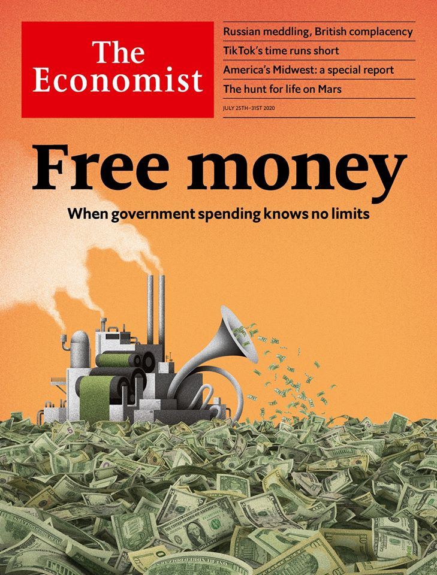
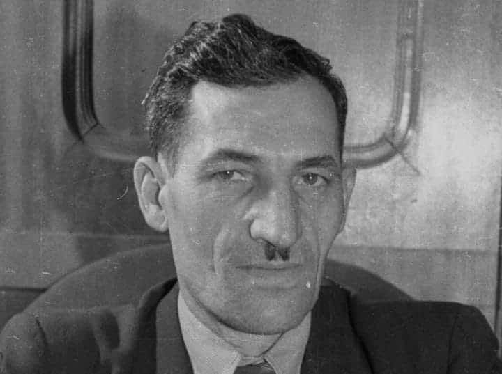

### 2020

Okładka The Economist nawiązująca do kolejnych pakietów pomocowych w USA i innych częściach świata. W UE negocjowano o 750 mld euro pakietu na odbudowę, a w USA Trump wspomina już o kolejnym pakiecie pomocowym, a jego doradcy ekonomiczni chcą naciskać na obniżenie podatku od wynagrodzeń i wdrożenie innych środków, które skłoniłyby pracodawców do podtrzymania zatrudnienia. Jakie to przyniesie skutki dla świata i rynków finansowych? Pewnie sensowne wnioski wyciągniemy za kilka lat :)

Pozwoliłem sobie kilka zdań wstępniaka przetłumaczyć żeby zachęcić do lektury takich mediów:

"Nasza okładka w tym tygodniu dotyczy głębokich zmian zachodzących w ekonomii w wyniku pandemii COVID-19. Podobnie jak w latach 70., kiedy keynesizm ustąpił miejsca monetaryzmowi Miltona Friedmana, i w latach 90., kiedy banki centralne uzyskały niezależność, tak dzisiaj koronawirus wyznacza nowy paradygmat. Charakteryzuje się on pożyczkami rządowymi, drukowaniem pieniędzy i interwencjami na rynkach kapitałowych - wszystko to jest wspierane przez niską inflację. Każda epoka ekonomii staje przed nowym wyzwaniem. Po latach trzydziestych zadaniem było zapobieganie depresjom. W latach siedemdziesiątych i wczesnych osiemdziesiątych Świętym Graalem miała być kwestia zakończenia stagflacji. Dziś decydenci muszą stworzyć ramy, które umożliwią zarządzanie cyklem koniunkturalnym i zwalczanie kryzysów finansowych bez upolitycznionego przejmowania gospodarki."

---

GOLD (XAU/USD) Hit All Time High Today at the moment USD 1,932 per ounce

---

  

### 1947

"Od maja ubiegłego roku pracuję jako rębacz na kopalni „Jadwiga” w Zabrzu. W lutym br. wykonałem normę 240%, wyrąbując 72,5 m chodnika. W kwietniu wykonałem normę 293%, wyrąbując 85 m chodnika. W maju dałem 270%, wyrąbując 78 m chodnika."

Tymi słowami 27 lipca 1947 roku zawartymi w liście otwartym do górników wzywał do współzawodnictwa pracy i przekraczania norm rębacz kopalni Jadwiga Wincenty Pstrowski (zdjęcie).
Ogłoszony przez komunistyczną polską propagandę pierwszym przodownikiem pracy ufał, że w ten sposób przyczyni się do szybszej odbudowy zniszczonego wojną kraju.

  

---

<a href="https://github.com/TomaszWaszczyk/historia.waszczyk.com/edit/master/src/content/july-27.md" target="_blank">Edytuj tę stronę dzieląc się własnymi notatkami!</a>
