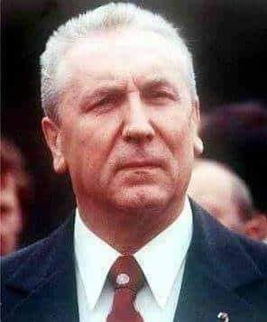
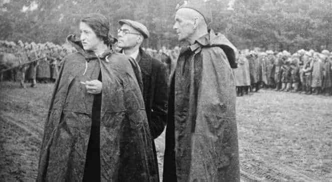
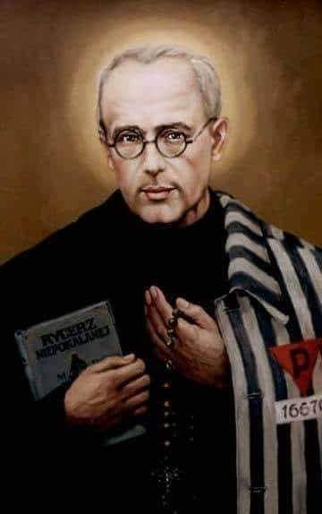
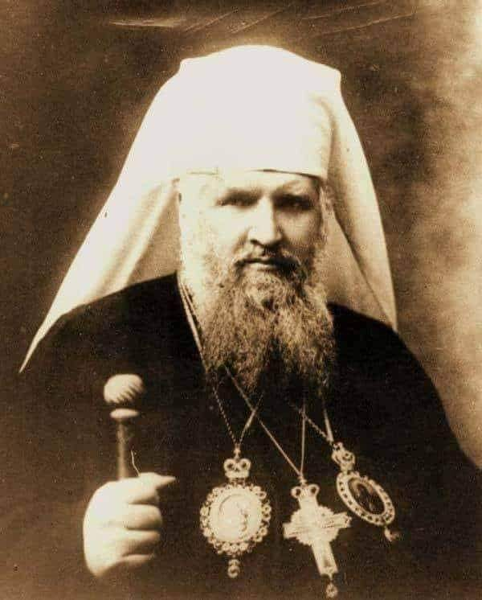

### 2021

Wytłumaczenie inflacji w 2021. Insane.

<video width="640" height="480" controls>
<source src="./movies/july/transitorydefinition.mp4" type="video/mp4">
Your browser does not support the video tag.
</video>

---

> Morawiecki: Inflację należy zestawiać ze wzrostem wynagrodzeń

Inflacja jest kwestią, którą należy odnosić do wzrostu wynagrodzeń; kiedy wynagrodzenia rosną dwa razy szybciej niż inflacja, oznacza to, że za zarabianą kwotę możemy kupić dwa razy więcej - powiedział w piątek podczas konferencji prasowej premier Mateusz Morawiecki.

---

### 2020

The German state TV praises Bitcoin? If you don't speak German, BTC seems to act as a safe haven. Feel free to start your research with the facts:

Borderless - Gold ✅ vs. Bitcoin ✅

Decentralized - Gold ✅ vs. Bitcoin ✅

Capped Supply - Gold ✅ vs. Bitcoin ✅

Easy Verifiable - Gold ✅ vs. Bitcoin ✅

Easy Value Transfer - Gold ❌ vs. Bitcoin ✅

No Censorship - Gold ❌ vs. Bitcoin ✅

Weightless - Gold ❌ vs. Bitcoin ✅

Counterfeiting Safety - Gold ❌ vs. Bitcoin ✅

Easily Divisible - Gold ❌ vs. Bitcoin ✅

Low Transfer/Storage Cost - Gold ❌ vs. Bitcoin ✅

Low Vola - Gold ✅ vs. Bitcoin ❌

6000 yrs of proven history - Gold ✅ vs. Bitcoin ❌

Hits:  

Gold: ⚽ ⚽ ⚽ ⚽ ⚽ ⚽

Bitcoin: ⚽ ⚽ ⚽ ⚽ ⚽ ⚽ ⚽ ⚽ ⚽ ⚽

### 2001

W Cieszynie zmarł Edward Gierek (zdjęcie).
Urodził się 6 stycznia 1913 roku w Porąbce. Gdy miał 12 lat wyemigrował z rodziną do Francji,gdzie podjął pracę w kopalni soli potasowej. W wieku 17 lat wstąpił do partii komunistycznej.W 1934 roku wrócił do Polski,by odbyć służbę wojskową po czym wyjechał do Belgii. Tam również działał w partii komunistycznej i nauczył się mówić płynnie po francusku.W czasie okupacji działał w belgijskim ruchu oporu. W 1948 roku wrocił do Polski i wstąpił do Polskiej Zjednoczonej Partii Robotniczej. W 1957 roku został I sekretarzem Komitetu Wojewódzkiego PZPR w Katowicach. W 1970 roku zastąpił na stanowisku I sekretarza Komitetu Centralnego PZPR skompromitowanego na skutek wypadków grudniowych Władysława Gomułkę. Właśnie okres lat 70 tych jest czasem jego najszerszej działalności,a jednocześnie jest też okresem budzącym do dziś ogromne kontrowersje. Powstawały w tym czasie wielkie zakłady przemysłowe takie jak Huta Katowice,na masową skalę rozbudowywano miasta. Wizerunek dobrego gospodarza skutecznie zapewniała mu doskonale rozbudowana propaganda.
Edward Gierek, pierwszy przywódca
socjalistycznej Polski wychowany na
„burżuazyjnym” zachodzie, starał się – w miarę swoich możliwości – przybliżać kraj do wzorców zachodnich, nie rezygnując jednak z
pryncypiów socjalizmu. 
W porównaniu z "szarym okresem rządów Władysława Gomułki czasy Edwarda Gierka wyróżniają się raczej pozytywnie, choć druga połowa lat 70.
zakończyła się gospodarczym kryzysem w wielu dziedzinach i doprowadziła w rezultacie
do upadku PRL.
Nie da się ukryć, że Gierek w jakiś sposób otworzył komunistyczną Polskę na świat. Ekipa Gierka próbowała też naprawy stosunków z Watykanem. Okres rządów Gierka ma też wiele minusów,chociażby niezbyt udany podział administracyjny na 49 województw, aresztowania opozycji czy braki towarów na rynku.
Na skutek rozpoczynających się w 1980 roku kolejnych protestów robotniczych i pozakulisowych rozgrywek Gierek został odsunięty od władzy na rzecz Stanisława Kani.
W stanie wojennym na polecenie generała Jaruzelskiego został zatrzymany przez funkcjonariuszy BOR-u i milicjantów w swoim domu w Katowicach i internowany w ośrodku
w Głębokiem koło Koszalina, gdzie został przetransportowany śmigłowcem. Zwolniony z internowania w grudniu 1982 roku otoczony został stałą obserwacją . Specjalna komisja partyjna PZPR oskarżyła go o przywłaszczenie
domu i działki w Katowicach.
3 sierpnia 2001 roku Gierek został pochowany na katolickim cmentarzu w Sosnowcu Środuli. W pogrzebie uczestniczyli między innymi Edward Babiuch,Mieczysław Rakowski i Zbigniew Messner. Z tych wymienionych tu osób żyje jeszcze tylko Edward Babiuch.

  

### 1958

Ad Apostolorum Principis

### 1944

Moskiewska radiostacja "Kościuszko" wystosowała do mieszkańców Warszawy apel Związku Patriotów Polskich o rozpoczęcie powstania przeciwko Niemcom. Oto jego treść:
" "Wezwanie do Warszawy. Walczcie przeciwko Niemcom. Warszawa bez wątpienia słyszy już huk armat w bitwie, która już wkrótce przyniesie jej wyzwolenie dla Warszawy, która nigdy się nie poddała i ciągle nie ustaje w walce, godzina czynu wybiła. Nie wolno zapomnieć, że w potopie zagłady hitlerowskiej przepadnie wszystko, co nie będzie ocalone czynem, że bezpośrednio czynną walką na ulicach Warszawy, po domach, fabrykach, magazynach, nie tylko przyśpieszymy chwilę ostatecznego wyzwolenia, lecz ocalimy także majątek narodowy i życie naszych braci".

  

Na zdjęciu: Główni działacze Związku Patriotów Polskich: Wanda Wasilewska, Alfred Lampe i gen. Zygmunt Berling.

### 1941

Kierownik obozu KL Auschwitz, Fritzsch (pod nieobecność Hoessa) w odwecie za ucieczkę więźnia Zygmunta Pilawskiego (nr 14156), skazał na śmierć głodową 10 zakładników z bloku 14. Podczas selekcji  z szeregu wystąpił  polski ksiądz, O. Maksymilian Rajmund Kolbe (nr 16670) zgłaszając się na śmierć  w zamian za skazanego współwięźnia Franciszka Gajowniczka (nr 5659), który miał żonę i dzieci.  Fritzsch wyraził zgodę, aby zajął jego miejsce. Skazańców zaprowadzono do bunkra śmierci bloku 11. Ojciec Kolbe zmarł (w wigilię Wniebowzięcia Najśw. Maryi Panny) 14 sierpnia 1941 dobity zastrzykiem z fenolu. Jego ciało spalono w krematorium. 25 października 1944 Franciszek Gajowniczek został przeniesiony do obozu koncentracyjnego KL Sachsenhausen, gdzie doczekał się wyzwolenia przez wojsko amerykańskie.

  

### 1865

W Przyłbicach urodził się Roman Maria Aleksander hrabia Szeptycki -  arcybiskup metropolita lwowski i halicki obrządku greckokatolickiego, duchowy przywódca idei budowy niepodległej Ukrainy. 
Jest to postać bardzo trudna do jednoznacznego scharakteryzowania. 
Arcybiskup Szeptycki jest przez niektórych nazywany ,,ukraińskim Schindlerem'', ponieważ ocalił osobiście albo przez swoich współpracowników ok.  150 Żydów. W czasie likwidowania obozu na Janowskiej we Lwowie. udało się zbiec i dostać do pałacu arcybiskupa Szeptyckiego Dawidowi Kahane , który w latach 1945-49 sprawował obowiązki naczelnego rabina Wojska Polskiego. W swojej wypowiedzi z 1987 roku, Kahane  powiedział, że arcybiskup był człowiekiem wielkiej klasy: ,,Jak zachowali się Ukraińcy, nie trzeba mówić, o tym wie cały świat. Ale Szeptycki dał rozkaz swoim żeńskim klasztorom, aby ratowały żydowskie dzieci. Przełożoną tych klasztorów była osoba bardzo energiczna, religijna i wykształcona. Uratowała sześćdziesiąt lub więcej dzieci.'' (cyt za: E. Kurek, Dzieci żydowskie w klasztorach, str. 243.) 
Trzynaście razy odbywały się narady nad przyznaniem biskupowi Szeptyckiemu medalu ,,Sprawiedliwy wśród Narodów Świata'' jednak członkowie komisji nigdy nie mogli dojść do porozumienia w tej kwestii. Medalu ,,Sprawiedliwy wśród Narodów Świata'' nie przyznano. W 1958 i 1962, podejmowano starania o  beatyfikację, ale Watykan odrzucał wnioski. Obecnie toczy się kolejny proces zmierzający do beatyfikacji biskupa Szeptyckiego. Zagorzałym przeciwnikiem beatyfikacji biskupa Szeptyckiego jest ksiądz Tadeusz Isakowicz-Zaleski. Według księdza Tadeusza Isakowicza-Zaleskiego biskup Szeptycki: Oddelegował [..] księży SS-Galizien i udzielał pełnego poparcia tej organizacji, która na całym świecie uważana jest za zbrodniczą. Należy się w takim razie zastanowić nad tym, co ci księża robili, gdy żołnierze z tej jednostki mordowali całe polskie wsie, napadali na klasztory czy na kościoły rzymskokatolickie. Obecność tych księży nie tylko nie spowodowała pohamowania esesmanów od mordów, ale, moim zdaniem, również się do nich przyczyniła. Co więcej, zachowały się zdjęcia, na których widać odprawiane msze święte dla esesmanów. Po środku stoi krzyż, a z jednej i z drugiej strony znajdują się swastyki. Na to wszystko zgodę wydawał metropolita Andrzej Szeptycki. Gdyby nie jego poparcie, czy przymykanie oczu, to do takich rzeczy by nie dochodziło.''
''Andrzej Szeptycki wywodził się z rodziny wyrosłej na polsko-ukraińskim pograniczu, której przedstawiciele dokonywali różnych wyborów religijnych i politycznych. Jego brat był legionistą i generałem Wojska Polskiego; bratanek – oficer rezerwy i kleryk rzymskokatolicki – zginął w Katyniu. 
Roman Maria Aleksander hr. Szeptycki – tak brzmiało jego świeckie imię – wybrał tożsamość ukraińską i kapłaństwo. Mianowany przez papieża w 1900 r. metropolitą galicyjsko-lwowskim obrządku greckokatolickiego, wcześnie zaangażował się w działalność polityczną i w budowanie ukraińskiej tożsamości narodowej. W czasach C.K. monarchii był m.in. wicemarszałkiem galicyjskiego Sejmu Krajowego. Podczas I wojny światowej więziony przez Rosjan, gdy w 1918 r. wybuchły walki polsko-ukraińskie, był duchowym przywódcą idei budowy niepodległej Ukrainy. 
W 1939 r. pakt sowiecko-niemiecki sprawił, że metropolita zaczął odgrywać coraz większą rolę – i coraz częściej musiał dokonywać pragmatycznych wyborów ściśle już politycznych. Najpierw, jeszcze w sierpniu 1939 r., potępił narodowy socjalizm. Potem, po zajęciu Lwowa przez ZSRR, zalecał duchownym lojalność wobec władz sowieckich (acz przewidując, że może paść ofiarą NKWD, potajemnie wyświęcił następcę, biskupa Josyfa Slipyja). 
Po wybuchu wojny między III Rzeszą a ZSRR Szeptycki postawił – jak wielu Ukraińców – na Hitlera, wierząc, że umożliwi powstanie niepodległej Ukrainy. Po zajęciu Lwowa przez Niemców wydał odezwę witającą Wehrmacht, a w lipcu 1941 r. w imieniu swoim i narodu ukraińskiego skierował do Hitlera deklarację woli uczestniczenia w budowaniu „nowego porządku w Europie”. Jednak, mimo nacisków otoczenia, nie wydał apelu do młodzieży ukraińskiej, aby wstępowała do powstającej od 1943 r. ukraińskiej dywizji Waffen-SS. Podobnie nie popierał UPA, ale też nie potępiał jej działań. Potępiał za to w listach pasterskich wszelkie morderstwa i morderców. 
Zarazem zorganizował sieć pomocy Żydom, dzięki której uratowano co najmniej kilkaset osób (w swoim pałacu ukrywał dwóch rabinów). Występował też w ich obronie w liście do Himmlera (w lutym 1942 r.), a także do władz okupacyjnych – jak wiadomo, bezskutecznie. 
Szeptycki zmarł w listopadzie 1944 r.''

  

---

<a href="https://github.com/TomaszWaszczyk/historia.waszczyk.com/edit/master/src/content/july-29.md" target="_blank">Edytuj tę stronę dzieląc się własnymi notatkami!</a>