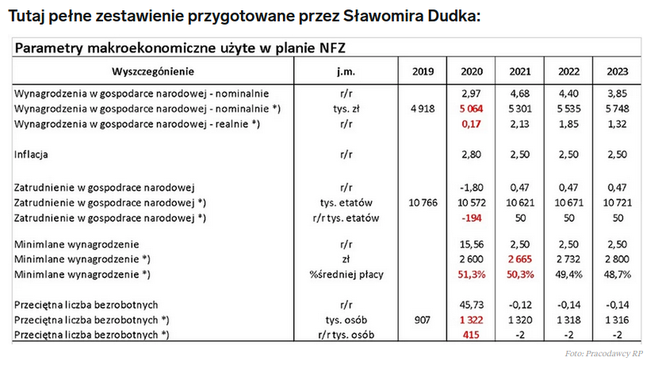
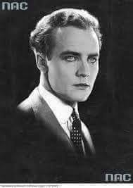

### 2020

  

---

  

---

### Zadłużona Łódź wyprzedaje na potęgę miejskie nieruchomości

Wśród tych wystawionych na sprzedaż są zabytki i tereny zielone. Decyzje zapadają na sesjach, które odbywają się online. Mieszkańcom i społecznikom trudno jest więc pytać o konkretne inwestycje. Tylko w tym roku sprzedano kilkadziesiąt nieruchomości, a to dopiero połowa roku.
Łódź jest piękna, zabytkowa ale bardzo zadłużona. W czasie koronakryzysu miasto znalazło się w trudnej sytuacji. Radni związani z Hanną Zdanowską mówią wprost, że sprzedaż miejskich działek ma podreperować budżet miasta. 

Według Marcina Gołaszewskiego, przewodniczącego Rady Miejskiej w Łodzi, ubytek w budżecie może sięgnąć w tym roku, w optymistycznym wariancie, nawet 250 milionów złotych

- Musimy szukać możliwości załatania dziury która powstała – stwierdza polityk KO.

Radosław Marzec, przewodniczący klubu PiS w Radzie Miejskiej w Łodzi, twierdzi, że te sprzedaże są nieprzemyślane i jest to desperacka próba znalezienia pieniędzy.

- Doliczyłem się prawie pięćdziesięciu nieruchomości, które są wystawiane na sprzedaż. Niekoniecznie te sprzedaże są dobrze przygotowane. Bo jak możemy pozbywać się działek, które nie mają miejscowego planu zagospodarowania przestrzennego? – pyta przewodniczący klubu.

Podobne zdanie ma społeczniczka, Urszula Miziołek-Janiak. Według niej sprzedaży nieruchomości nie można tłumaczyć pandemią.

- Władze miasta doskonale zdają sobie sprawę z tego, że nie są w stanie na podstawie obecnych przepisów i bez planów miejscowych skutecznie ochronić istniejących na tych terenach zabytków, czy też zieleni – mówi społeczniczka.

O wystawieniu na sprzedaż około pięćdziesięciu nieruchomości zdecydowano na sesjach zdalnych. Na każdej z nich znalazło się co najmniej kilka punktów poświęconych tej sprawie. Formalnie to zgodne z prawem, ale zdarzało się dotąd sporadycznie.

- O tym czy styl sprzedaży majątku miejskiego nam odpowiada warto zapytać samych łodzian. Czy mają wiedzę o tym, że majątek, którego są właścicielami jest wyprzedawany? – pyta dr Janusz Wdzięczak.

Tempo sprzedaży miejskich działek jest zawrotne. Na najbliższej sesji radni zdecydują o wystawieniu do przetargów kolejnych kilkunastu nieruchomości.

---

### 1989

https://pl.wikipedia.org/wiki/Wasz_prezydent,_nasz_premier

Poniżej fragment artykułu pt " Wasz prezydent nasz premier" autorstwa Adama Michnika opublikowanego w Gazecie Wyborczej 3 lipca 1989 roku.
Pozostawiam ten tekst do Państwa oceny.
"W najbliższym czasie przesądzony zostanie kształt układu politycznego w Polsce. Dotychczas największe emocje wzbudzała osoba kandydata do urzędu prezydenta. To źle, że w takiej sytuacji górę bierze pamięć i retoryka. Spróbujmy przyjrzeć się sytuacji spokojnie i odpowiedzieć: jaki układ polityczna jest Polsce potrzebny na najbliższe miesiące i lata? (…)Potrzebny jest układ nowy, możliwy do zaaprobowania przez wszystkie główne siły polityczne. Nowy, ale gwarantujący kontynuację. Takim układem może być porozumienie, na mocy którego prezydentem zostanie wybrany kandydat z PZPR, a teka premiera i misja sformowania rządu powierzona kandydatowi "Solidarności".”

  

---

Miało miejsce ostatnie użycie oddziałów ZOMO.
Ten okryty złą sławą oddział milicji, stworzony po wybuchu "Poznańskiego Czerwca" interweniował po tym jak podano do wiadomości, że kandydatem na pierwszego prezydenta po upadku komunizmu jest Wojciech Jaruzelski. Wywołało to demonstrację oburzonego tłumu.
ZOMO zostały ostatecznie rozwiązane 7 września 1989 roku.

  

---

### 1951

W Warszawie zmarł Tadeusz Borowski - poeta, prozaik, publicysta. W czasie okupacji hitlerowskiej studiował w podziemiu polonistykę na Uniwersytecie Warszawskim, był jednym z najlepszych studentów. W 1943 roku został więźniem Pawiaka, z Pawiaka przewieziono go do niemieckiego obozu koncentracyjnego KL Auschwitz-Birkenau. W 1944 roku został przewieziony do obozu Natzweiler-Dautmergen, a następnie do Dachau. Doczekał wyzwolenia przez armię amerykańską. Został przeniesiony do obozu dla dipisów. W 1946 roku powrócił do Polski Ludowej. W swych zbiorach opowiadań ,,Byliśmy w Oświęcimiu'', ,,Pożegnanie z Marią'', ,,Kamienny świat'' przedstawił rozpad wartości humanistycznych oraz deprawację człowieka w hitlerowskim systemie zagłady. W 1948 roku został członkiem PPR. Pełnił obowiązki rzecznika realizmu socjalistycznego, a także pracował dla wywiadu wojskowego. 26 czerwca 1951 roku został ojcem. Okoliczności śmierci poety nie są do końca znane. W zatruciu gazem i środkami farmakologicznymi dopatrywano się motywy samobójczego. Poeta został pochowany w Warszawie, na Cmentarzu Wojskowym na Powązkach. Pośmiertnie odznaczony został Krzyżem Komandorskim Orderu Odrodzenia Polski. Miał 29 lat.

  

---

### 1948

Funkcjonariusze Urzędu Bezpieczeństwa aresztowali Aleksandra Krzyżanowskiego (zdjęcie) pułkownika Wojska Polskiego, komendanta Okręgu Wileńskiego Armii Krajowej. Komuniści oskarżyli go współpracę z Niemcami i wydawanie rozkazów likwidowania oddziałów partyzantki sowieckiej na Wileńszczyźnie.
Pomimo tortur w czasie trwania śledztwa Krzyżanowski nie przyznawał się do zarzucanych mu czynów.

  

### 1943

Heinrich Himmler (zdjęcie), w jednym z tajnych pism zawarł plany przeprowadzenia drugiej fazy wysiedlenia Zamojszczyzny i Lubelszczyzny. Planował całkowite skolonializowanie w ciągu niespełna 6 miesięcy powiatu zamojskiego, poszerzonego o skolonializowane tereny powiatu hrubieszowkiego, biłgorajskiego i tomaszowskiego oraz ogłoszenie wiosną 1944 roku Lublina, jako miasta niemieckiego z niemieckim nadburmistrzem i niemiecką policją państwową.

  

### 1941

Niemcy aresztowali profesorów trzech lwowskich uczelni: Uniwersytetu Jana Kazimierza, Politechniki Lwowskiej i Akademii Medycyny Weterynaryjnej. Do aresztowania doskonale przydały się w tym przypadku listy proskrypcyjne będące dziełem byłych studentów tych uczelni związanych później z ukraińskimi organizacjami narodowymi.
Dzień później aresztowanych profesorów przewieziono na Wzgórze Wuleckie (zdjęcie) które stało się miejscem ich kaźni.

  

### 1940

Inspektor niemieckich obozów koncentracyjnych Richard Glücks [Foto] wydał odezwę do komendantów obozów koncentracyjnych przypominającą, że: "więzień zwolniony z obozu koncentracyjnego nie może stać się obiektem dyskusji w społeczeństwie. Jak wiadomo z jednego obozu koncentracyjnego zwolniono kilku więźniów, którzy już podczas przesiadania się na stacji kolejowej, wskutek wielkiego osłabienia musieli być przekazani opiece społecznej i przez dłuższy czas poddani leczeniu szpitalnemu. Dokonywanie takich zwolnień przynosi szkodę opinii obozów koncentracyjnych i w przyszłości komendanci obozów powinni takim przypadkom przeszkodzić."

  

---

W swoim mieszkaniu na Starym Mieście w Warszawie aresztowany został przez Gestapo Tadeusz Tański (zdjęcie) konstruktor samochodowy, inżynier mechanik, wynalazca.
Wśród wielu konstrukcji jego pomysłu były między innymi takie projekty jak samochód pancerny, Ford FT-B , oparty na podwoziu Ford T i zbudowany w serii 16 sztuk, które brały udział w wojnie polsko-bolszewickiej czy pierwszy całkowicie polski samochód osobowy CWS T-1.
Powodem aresztowania Tańskiego była prowadzona przez niego, od czasu upadku wojny obronnej, działalność konspiracyjna. Został wywieziony do KL Auschwitz, gdzie 23 marca 23 marca 1941 roku został zabity za odmowę współpracy z Niemcami.

  

---

### 1896

W Innsbrucku urodził się Igo Sym (właściwie Julian Sym) - aktor. W czasie I wojny światowej walczył głównie na froncie włoskim w szeregach armii austro-węgierskiej zdobywając wówczas stopień porucznika. W 1925 r. trudnił się jako urzędnik. Jako aktor zadebiutował rolą Tadeusza Wyzewicza w filmie pt. "Wampiry" i od tego występu często pojawiał się w filmach polskich. Grał w warszawskich teatrzykach rewiowych. Był obdarzony niezwykłą sprawnością fizyczną i wyjątkową urodą. W czasie okupacji niemieckiej jako reichsdeutsch został mianowany dyrektorem tzw. Theater der Stadt Warschau i dostał koncesję na T. Komedia i kino Helgoland (Polonia). Organizował werbunek polskich aktorów do antypolskiego filmu ,,Powrót do ojczyzny''. Był konfidentem Gestapo, m.in. pomógł zorganizować zasadzkę, w której zaaresztowano ukrywającą się Hankę Ordonównę, jego przedwojenną koleżankę z teatru i ekranową partnerkę. Wyrokiem polskiego sądu podziemnego został uznany za niemieckiego szpiega i skazany na karę śmierci. Wyrok wykonano 7 marca 1941 roku. Igo został zastrzelony w swoim mieszkaniu przy ulicy Mazowieckiej 10. W wyniku odwetu, podjętego przez władze niemieckie po jego śmierci stracono w Palmirach dwudziestu jeden mężczyzn, aresztowano i zesłano do Auschwitz m. in. L. Schillera i S. Jaracza, rozesłano listy gończe za Dobiesławem Damięckim i Ireną Górską.

  

### 1862

W Warszawie polski działacz lewicowy Ludwik Jaroszyński (zdjęcie) dokonał nieudanego zamachu na przebywającego z wizytą w stolicy brata cara Aleksandra II Wielkiego Księcia Konstantego Nikołajewicza Romanowa. Jaroszyński strzelił do wychodzącego z teatru po przedstawieniu księcia, lekko go raniąc. Była to jego druga próba dokonania zamachu na wielkiego księcia.
Dzień wcześniej oczekiwał wraz z innym
zamachowcem, Edwardem Rodowiczem, na przyjazd Konstantego na Dworcu
Petersburskim, zamachowcy nie zdecydowali się jednak na strzał ze względu na obecność towarzyszącej Konstantemu żony, w. ks. Aleksandry, będącej w ostatnim miesiącu ciąży. Schwytany na miejscu zamachu i osadzony w X Pawilonie Cytadeli Warszawskiej. Przekazany przez komisję śledczą sądowi wojskowemu, który 14 VIII 1862 roku skazał go na karę śmierci. Po zatwierdzeniu wyroku 19 VIII przez w. ks. Konstantego został powieszony publicznie roku 21 VIII 1862 na stokach Cytadeli Warszawskiej.

  

---

<a href="https://github.com/TomaszWaszczyk/historia.waszczyk.com/edit/master/src/content/july-3.md" target="_blank">Edytuj tę stronę dzieląc się własnymi notatkami!</a>
