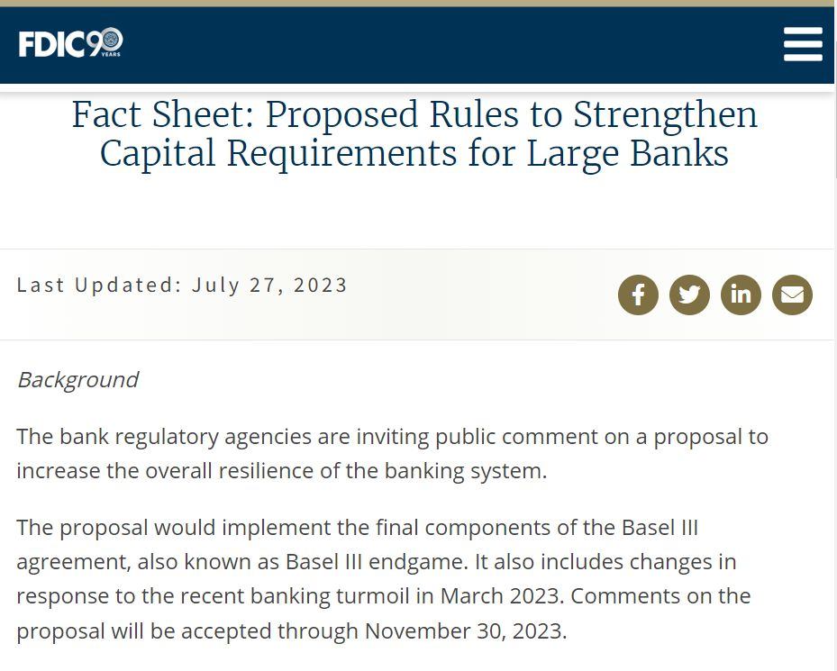
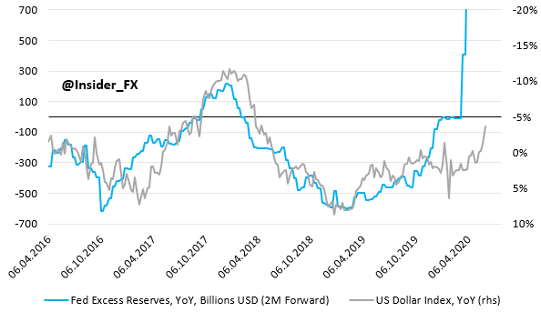
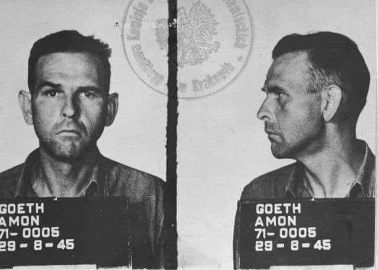
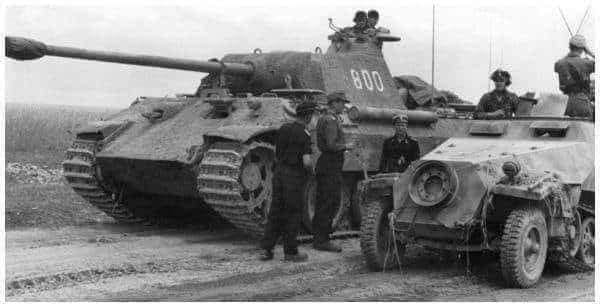
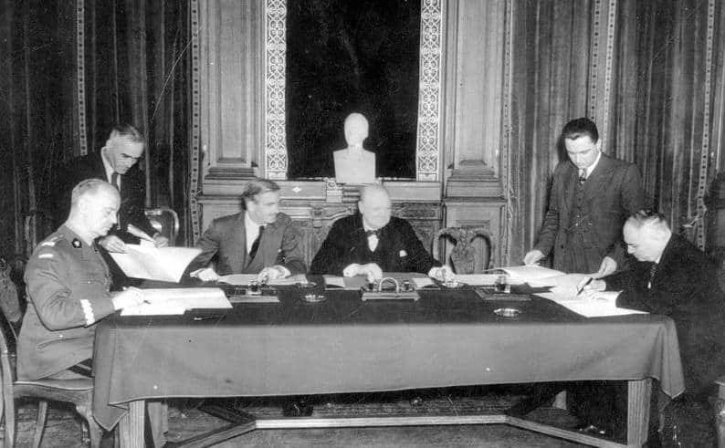
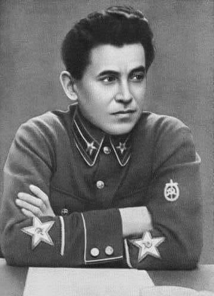
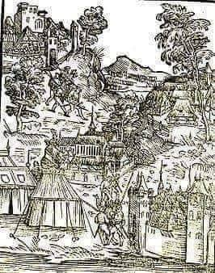

### 2023

"Additionally, following the banking turmoil in March 2023, the proposal seeks to further strengthen the banking system by applying a consistent set of capital requirements across large banks.

In particular, the proposal would require banks with total assets of $100 billion or more to:

• Include unrealized gains and losses from certain securities in their capital ratios;

• Comply with the supplementary leverage ratio requirement; and

• Comply with the countercyclical capital buffer, if activated.

The improvements in risk sensitivity and consistency introduced by the proposal are estimated to result in an aggregate 16 percent increase in common equity tier 1 capital requirements for affected bank holding companies, with the increase principally affecting the largest and most complex banks.

The effects would vary for each bank based on its activities and risk profile. Most banks currently would have enough capital today to meet the proposed requirements."

  

Source: Federal Deposit Insurance Corporation (FDIC), Fact Sheet: Proposed Rules to Strengthen Capital Requirements for Large Banks, July 27, 2023

---

### 2021

To co: inflacja 5% w PL jest najwyższa od 10y, w DE podobnie 3,8% jest od wczoraj najwyższym odczytem od dekady, ale również w USA mamy rekord cen od lat 13 na poziomie 5,4%.

Nie do końca jest to chyba efekt tych zerowych stóp procentowych.. W USA zerowe stopy mamy od dekady, w DE zaś mieliśmy nawet ujemne i inflacji jakoś nie było. Pojawiła się nagle i "zaskoczyła" ekonomistów, kiedy rządy ratując istniejący świat dały do ręki firmom i ludności po 10% PKB, czyli poluzowały politykę fiskalną, co wbrew pozorom jest zgodne z teorią, np. nowoczesną monetarystyczną.

Możemy podnosić te stopy w Polsce, tylko co wtedy - zatrzymamy ceny CO2 w UE, stali w Chinach, frachtu na Pacyfiku, albo ropy na Bliskim Wschodzie? Wcześniej może jednak zdławimy odbicie gospodarcze, przywrócimy bezrobocie do 15%, wystudzimy płace, popyt i produkcję, czyli PKB i zamienimy kryzys frankowy na kryzys wiborowy? Fajnie podwyżki wyglądają na papierze, stawki depozytów wzrosną, inflacja może znowu spadnie i będą wyprzedaże samochodów na koniec roku, tylko kosztem zarżnięcia gospodarki, o czym mało kto pamięta po latach bezinflacyjnego wzrostu. Kiedy wchodziłem na rynek pracy bezrobocie wśród młodych wynosiło 40%, kiedy praca była jak wygrana w Lotto, a cała Polska powiatowa jeździła na szparagi, albo klepała dzielne biedę w gminie. Idea szybkiego wzrostu gospodarczego i pełnego zatrudnienia ma swoją cenę, a jest nią koszt pieniądza. Kiedy jednak wynagrodzenia rosną 2x szybciej od cen, luka popytowa wciąż jest ujemna i od lata spadała nam wrażliwość dynamiki cen na zmiany krajowej koniunktury to nie jestem w stanie wyobrazić sobie niczego dobrego po podwyżce stóp. Cena i podaż kredytu od dawna zależy od scoringu, a nie od RPP przecież...

### 2020

Coraz więcej sygnałów świadczących o początku dłuższego trendu spadkowego na USD. Na wykresie akurat poziom "excess reserves" i ich zmiana w ujęciu rocznym, niemniej mówimy również o konwergencji stóp procentowych US-EMU, wielkiej stymulacji fiskalnej w Europie czy też, pierwszy raz od dłuższego czasu, lepszej perspektywie wzrostu PKB na starym kontynencie niż w USA. Na dodatek, EURUSD jest mocno przewartościowany z punktu widzenia parytetu siły nabywcze.

  

---

Produkt Krajowy Brutto Niemiec w II kwartale 2020 r. spadł o 10,1 proc. kdk, po uwzględnieniu czynników sezonowych - poinformował w komunikacie Federalny Urząd Statystyczny w Wiesbaden w I wyliczeniu.

### 1946

Amon Goeth, były komendant KL Płaszów został przewieziony na proces do Polski razem z Rudolfem Hoessem, byłym komendantem KL Auschwitz. Na dworcu głównym w Krakowie czekał na nich tłum rozwścieczonych ludzi. Przy czym to nie Rudolfa Hoessa rozpoznali zgromadzeni ludzie, lecz Amona Goetha zwanego ,,rzeźnikiem z Płaszowa''. Rudolf Hoess wspominał tamten dzień w swoim pamiętniku: ,,30 lipca przybyłem wraz z siedmioma innymi Niemcami do Krakowa. Na dworcu musieliśmy przez dłuższą chwilę czekać na samochód. W tym czasie zgromadziło się koło nas sporo ludzi, którzy nam złośliwie urągali. Götha zaraz poznano. Gdyby samochód nie nadjechał zaraz, obrzucono by nas kamieniami.''
Foto:  Hauptsturmführer-SS Amon Leopold Göth (ur. 11. 12.1908 r.), członek NSDAP od 1930 r. i SS od 1932 r., był od lutego 1943 r. do września 1944 r. komendantem obozu pracy przymusowej w Płaszowie pod Krakowem, przekształconego w 1944 r. na obóz koncentracyjny. Göth przeprowadził w 1943 r. ostateczną likwidację gett w Krakowie i w Tarnowie.Wyrokiem Najwyższego Trybunału Narodowego z dnia 5. 9. 1946 r. został skazany na karę śmierci i stracony.

  

### 1944

Rozpoczęła się bitwa pancerna pod Wołominem, jedna z największych bitew czołgowych w historii drugiej wojny światowej i prawdopodobnie trzecia , co do wielkości po bitwach pod Kurskiem i Falaise.Szacuje się, że wzięło w niej udział łącznie 1000 czołgów z czego około 500 zostało całkowicie zniszczonych.W batalii tej wzięły udział jednostki 3 Korpusu Pancernego,8 Gwardyjskiego Korpusu Pancernego i 16 Korpusu Pancernego 2 Armii Radzieckiej idącej od strony Lublina i Dęblina.Po przeciwnej stronie stanęły:1 Spadochronowo-Pancerna Dywizja "Herman Goering", 5 Dywizja Pancerna SS "Wiking",3 Dywizja Pancerna SS "Totenkopf"oraz 4 i19 Dywizje Pancerne. Bitwa zakończyła się po tygodniu sromotną klęską Rosjan.
Straty sowieckie były duże, jednak nie na tyle, aby zatrzymać ofensywę 1 Frontu Białoruskiego.
2 sierpnia Stalin wydał rozkaz zatrzymania ofensywy pod Warszawą. Decyzja ta była reakcją na wybuch powstania w Warszawie.

  

### 1941

W Londynie podpisano układ Sikorski-Majski przywracający stosunki dyplomatyczne RP z ZSRR. Otwierał on drogę do utworzenia w Sowietach polskiej armii. Przypomnijmy, że stosunki dyplomatyczne między obu państwami zostały zerwane 17 września 1939 r. po agresji ZSRR na Polskę. Obecny układ podpisany przez premiera RP na uchodźstwie gen. Władysława Sikorskiego i ambasadora ZSRR w Londynie Iwana Majskiego uznawał traktaty radziecko-niemieckie z 1939 r. za nieważne, przewidywał wspólną walkę z III Rzeszą, a w dodatkowym protokole władze sowieckie zagwarantowały „amnestię” dla obywateli polskich: więźniów politycznych i zesłańców przebywających w obozach Gułagu. Mieli oni trafić do utworzonej z ZSRR armii polskiej pod polskim dowództwem.

  

### 1937

W Moskwie szef NKWD Nikołaj Jeżow (zdjęcie) wydał rozkaz numer 0O447, na mocy którego od sierpnia 1937 roku do września 1938 roku radzieckie sądy wydały zaocznie ponad 700 tysięcy wyroków śmierci na "wrogów ludu". W ramach tej masowej eksterminacji wyroki takie wydano na ponad 111 tysięcy Polaków zamieszkujących na terenach ówczesnego Związku Radzieckiego, a także terenach wchodzących kiedyś w skład Rzeczypospolitej Obojga Narodów.

  

### 1514

Padła twierdza Smoleńsk. Wojska moskiewskie księcia Wasyla III zdobyły bronioną przez Polaków od maja tego samego roku twierdzę. Obroną dowodził wojewoda smoleński Jerzy Sołłohub. Wyczerpani obrońcy ulegli namowie kniazia Bohdana Glińskiego, który stwierdził, że najlepszym wyjściem byłoby poddanie się. 30 lipca mieszczanie smoleńscy złożyli, więc przysięgę poddańczą na rzecz Wasyla III, który już następnego dnia triumfalnie wjechał do miasta.

  

---

<a href="https://github.com/TomaszWaszczyk/historia.waszczyk.com/edit/master/src/content/july-30.md" target="_blank">Edytuj tę stronę dzieląc się własnymi notatkami!</a>
