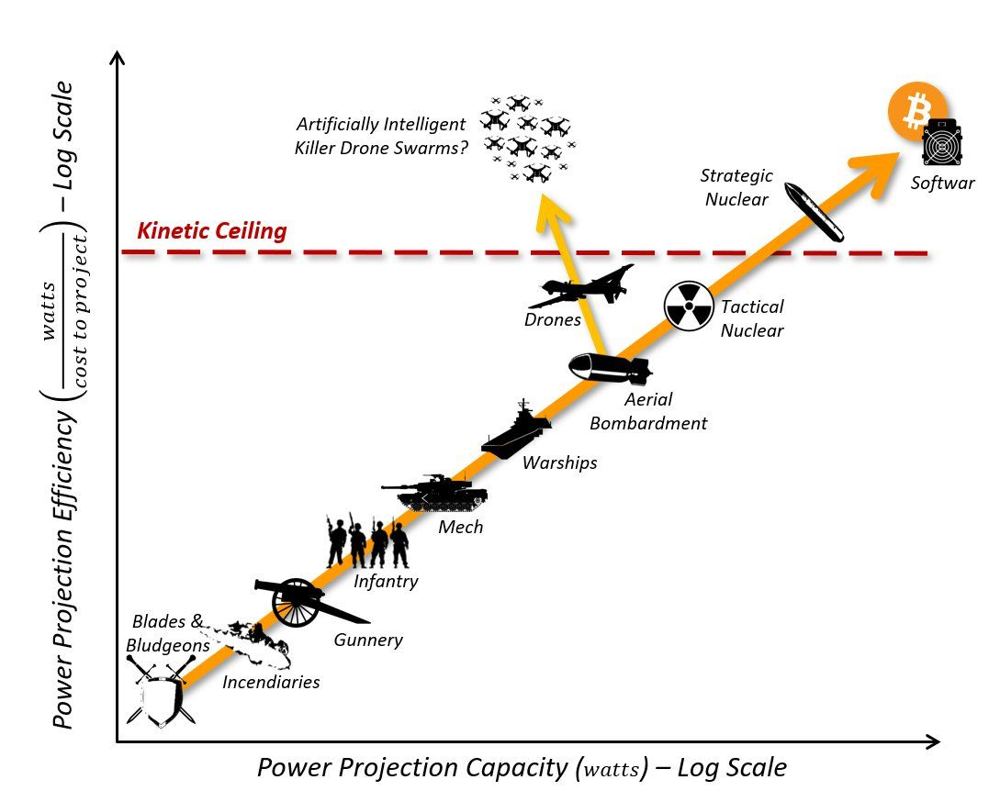
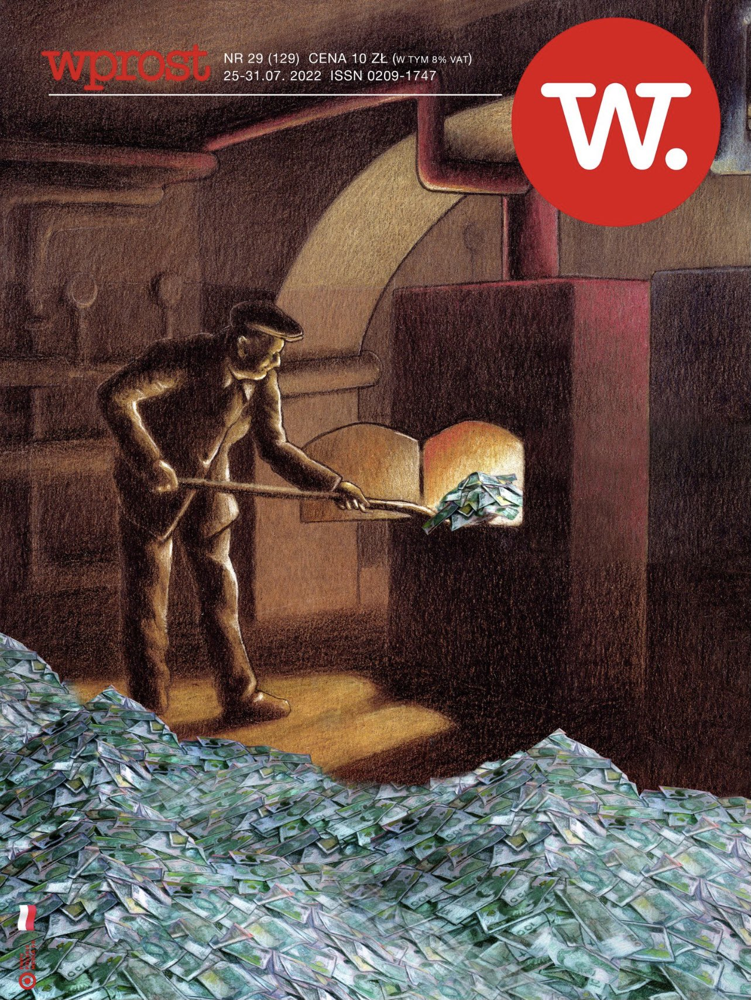
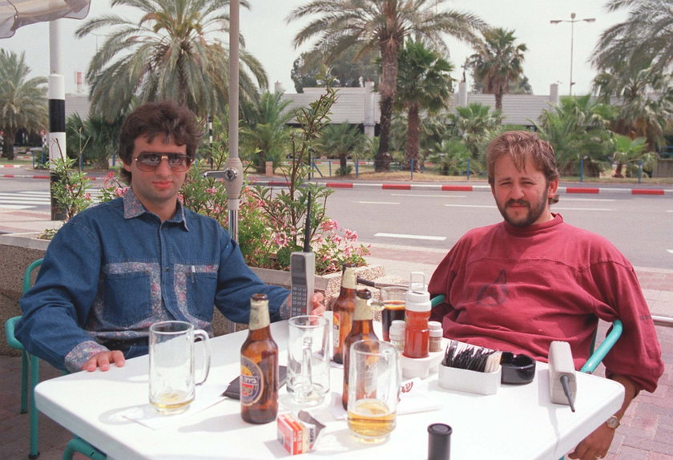
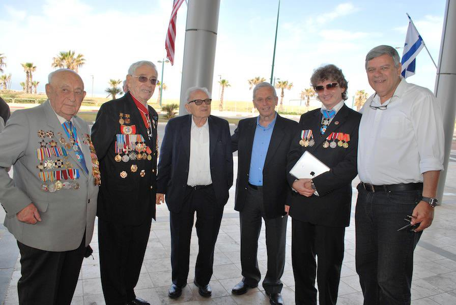
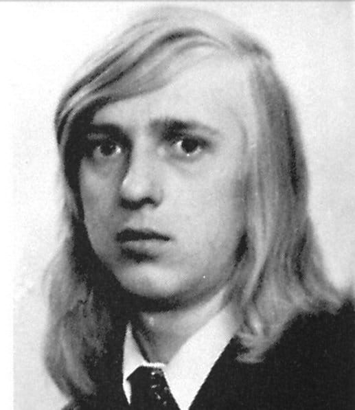
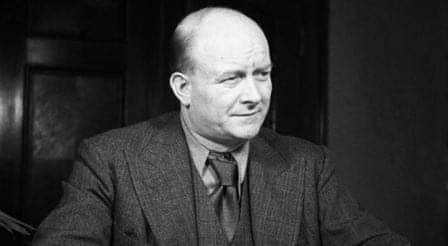
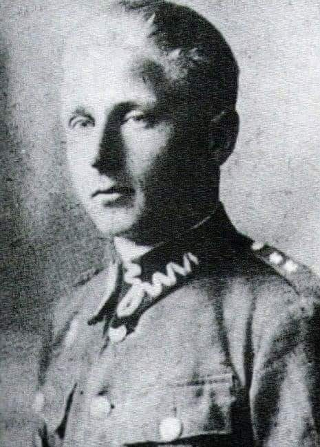
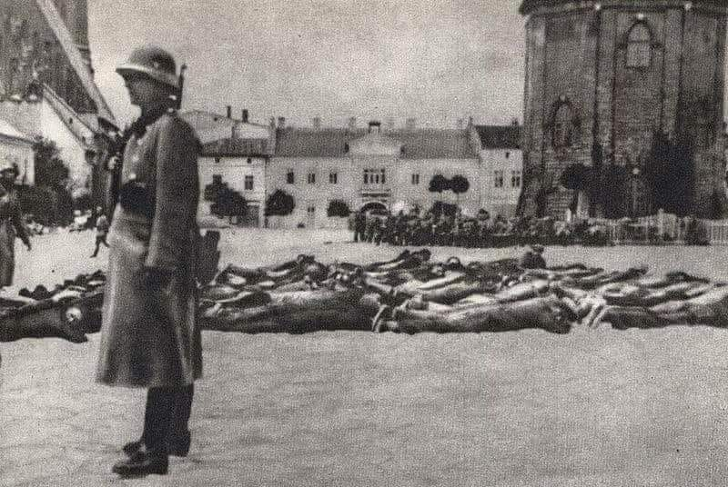
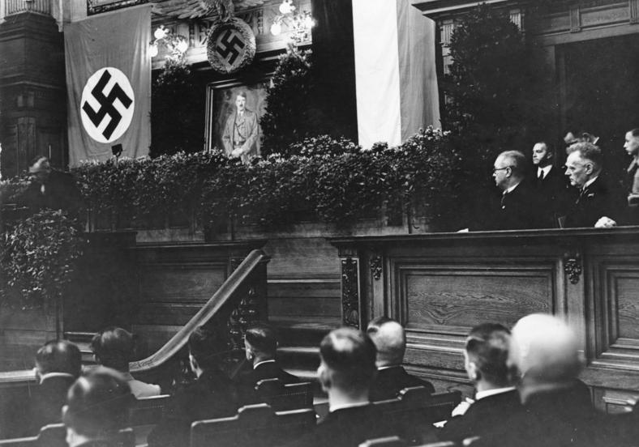
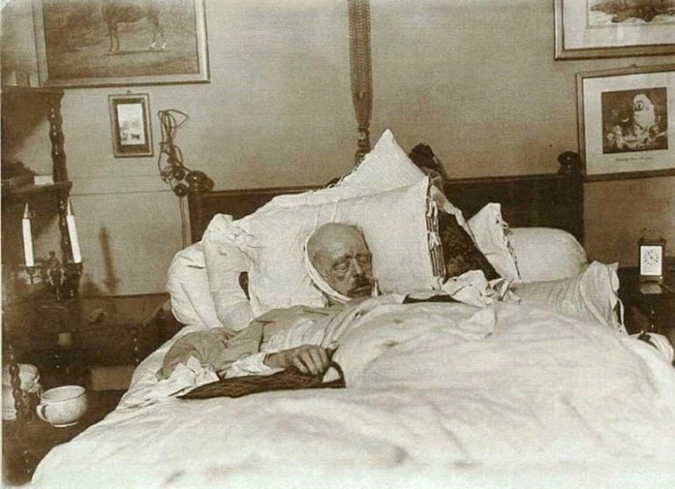

### 2023
<!-- Izrael (~40C w cieniu). -->

> Weltschmerz

  

> Weltschmerz

---

<video width="640" height="480" controls>
<source src="./movies/july/israel.mp4" type="video/mp4">
Your browser does not support the video tag.
</video>

Wojskowski odchodzą z wojska oraz odmawiają wykonania rozkazów.

---

  

The end state of warfare is Bitcoin b/c it is the most powerful and efficient power projection technology ever invented. It's also non-lethal, since it's electric.

By digitizing our monetary property and then defending it electronically rather than kinetically, we have eliminated the need to kill each other to secure our monetary property, and possibly solved a strategic nuclear kinetic stalemate.

---

> 14 lat więzienia dla specjalisty cyberbezpieczeństwa za zdradę w Rosji

  

Współzałożyciel firmy cyberbezpieczeństwa Group-IB, Ilja Saczkow został skazany na 14 lat więzienia za zdradę w Rosji. Według rosyjskich władz miał przekazywać tajne informacje zagranicznym szpiegom.

---

Eksperymenty, ale powoli do przodu:

> China's social credit score experiment gains momentum. Now, if a person with a low rating calls you, your phone emits a siren instead of the usual ringtone. Then there is a voice reminder that a conversation with this subscriber will lead to a decrease in your score.

<video width="640" height="480" controls>
<source src="./movies/july/beginnings.mp4" type="video/mp4">
Your browser does not support the video tag.
</video>

---

<a href="./documents/july/AntarcticFOIA.pdf" target="_blank">AntarcticFOIA</a>

<a href="./documents/july/pi-90-antarctic.pdf" target="_blank">pi-90-antarctic</a>

<a href="./documents/july/zn_poznan_54_druk.pdf" target="_blank">zn_poznan_54</a>

---

### 2022

  

### 2021

> The standard technique of privatization: defund, make sure things don't work, people get angry, you hand it over to private capital. - Noam Chomsky

### 1991

Właściciele spółki Art-B, Bogusław Bagsik i Andrzej Gąsiorowski, uciekli do Izraela.

  

Andrzej Gąsiorowski w Izraelu:

  

### 1987

https://en.wikipedia.org/wiki/Spycatcher

### 1977

W wodach Zalewu Solińskiego odnaleziono ciało Stanisława Pietraszko (zdjęcie) krakowskiego studenta Wydziału Fizyki Uniwersytetu Jagiellońskiego, świadka w sprawie śmierci Stanisława Pyjasa. 
Pietraszko był bliskim kolegą Pyjasa, osobą która najprawdopodobniej widziała go ostatniego żywego. Według ustaleń historyków i śledczych miał on widzieć swojego kolegę na krótko przed jego śmiercią w towarzystwie nieznanego mężczyzny. W tej sprawie zgłosił się nawet dobrowolnie na komendę w celu złożenia zeznań, a nawet dokładnego przedstawienia rysopisu mężczyzny towarzyszącemu Pyjasowi. Jakiś czas później utonął w niejasnych okolicznościach w Zalewie Solińskim podczas wakacji, które spędzał z niedawno poznaną dziewczyną. 
Śmierć Stanisława Pietraszko budzi spore wątpliwości ze względu na fakt, iż według osób, które dobrze go znały cierpiał on na wodowstręt.

  

### 1972

Agent FBI w samych gaciach dostarcza okup do porwanego samolotu DC8 linii Delta relacji Miami-Detroit.

Porywaczem okazał się niejaki George Wright który zatrzymany został przez FBI w 2011 roku.

  

### 1944

Gen. „Bór” Komorowski wydał rozkaz rozpoczęcia powstania w Warszawie

Po analizie sytuacji związanej z nadejściem Armii Czerwonej, generał „Bór”, za zgodą Delegata Rządu RP na Kraj, wicepremiera Jana Stanisława Jankowskiego „Sobola”, wydaje rozkaz komendantowi Okręgu Warszawskiego AK pułkownikowi Antoniemu Chruścielowi „Monterowi” rozpoczęcia powstania w Warszawie 1 sierpnia o godz. 17.00.

1649 roku w czasie powstania Chmielnickiego pod Łojowem (obecnie Białoruś) liczące 5 tysięcy żołnierzy wojska litewskie hetmana polnego Janusza Radziwiłła pokonały 17 tysięczną armię kozacką Stanisława Krzeczkowskiego.

---

Premier Stanisław Mikołajczyk podczas rozmowy z sowieckim ministrem spraw zagranicznych Wiaczesławem Mołotowem stwierdził:
"Pomimo braku stosunków polsko-sowieckich Rząd Polski, kierując walką z Niemcami w Kraju, pracowował nad konkretnymi planami wojskowego współdziałania pomiędzy Armią Krajową, a wojskami sowieckimi, w decydującej fazie działań wojennych na ziemiach polskich. Związane z tym nasze projekty zostały przedstawione Brytyjczykom i Amerykanom z prośbą o zaznajomienie się z nimi strony sowieckiej. Faktyczne współdziałanie trwa jednak już znacznie dłużej, zgodnie z instrukcjami Rządu Polskiego dla Armii Krajowej".

  

---

### 1943

Podczas żniw w kolonii  Przebraże powiat Łuck nastąpił atak około 3500 Ukraińców, w tym 2,5 tys. uzbrojonych w broń  palną oraz około 1 tysiąca uzbrojonych w dzidy, siekiery, drągi, noże. Komendant Henryk Cybulski rzucił do boju wszystkie siły samoobrony (3 kompanie). Do walki byli gotowi nawet cywile uzbrojeni w broń białą. Front walk rozciągnął się na kilka kilometrów. Walki trwały do wieczora. Z bitwy zwycięsko wyszli Polacy - pocisk wystrzelony z 45-mm działka trafił w skład ukraińskiej amunicji, to zmusiło Ukraińców do odwrotu. 

  

Foto: Henryk Cybulski, porucznik AK, komendant samoobrony Przebraża.

### 1940

W Olkuszu miała miejsce tzw "Krwawa środa"-akcja przeprowadzona przez Niemców w odwecie za zabicie jednego niemieckiego żandarma.Wszystkich mężczyzn z Olkusza spędzono na rynek główny i poddawano ich torturom w tym wielogodzinnym leżeniu w upale.
Tak wspominał ten dzień jeden z mieszkańców Olkusza:
" Leżeliśmy twarzą do ziemi. Ręce
założone z tyłu. Twarz musiała być
podparta nosem o ziemię. Jeśli któryś z
mężczyzn kładł na ziemi policzki – Niemiec kopnięciem w głowę lub wprost w twarz przywracał go do porządku. Przyprowadzono partię Żydów. Poczęto znęcać się nad nimi w tak okrutny sposób, że pióro najzdolniejszegopisarza nie byłoby w stanie odtworzyć tych bestialskich zbrodni"

  

### 1934

W Berlinie odbyło się pierwsze posiedzenie Trybunału Ludowego (Volksgerichtshof).

  

### 1932

Wörgl was the site of the "Miracle of Wörgl" during the Great Depression. It was started on July 31, 1932, with the issuing of "Certified Compensation Bills", a form of local currency commonly known as Stamp Scrip, or Freigeld. This was an application of the monetary theories of the economist Silvio Gesell by the town's then-mayor, Michael Unterguggenberger

The experiment resulted in a growth in employment and meant that local government projects such as new houses, a reservoir, a ski jump and a bridge could all be completed, seeming to defy the depression in the rest of the country. Inflation and deflation are also reputed to have been non-existent for the duration of the experiment.

Despite attracting great interest at the time, including from French Premier Edouard Daladier and the economist Irving Fisher,[3] the "experiment" was terminated by Austria's central bank Oesterreichische Nationalbank on September 1, 1933.

In 2006 milestones were placed, beginning from the railroad station through the downtown, to show this history.

### 1898

Tak odszedł "Żelazny Kanclerz"...

Ostatnie miesiące, jak i sama śmierć Bismarcka były z goła odmienne niż jego wcześniejsza egzystencja oraz kariera. Człowiek, który już za życia stał się legendą, był autorytetem i wzorem do naśladowania współczesnym sobie politykom, ostatnie lata swego życia spędził w izolacji. Można by wręcz rzec, że umarł w samotności.
W 1890 roku został „wypchnięty” z polityki, przez Cesarza Wilhelma II, czego nie wybaczył mu aż do samej śmierci.

Od momentu, kiedy został zdymisjonowany, wycofał się z życia publicznego i zamieszkał w posiadłości w Fredrichsruh. Jednak aktywnie komentował wydarzenia polityczne oraz spisał swoje wspomnienia w trzytomowej książce „Gedanken und Erinnerungen”. Ostatni tom miał zostać wydany dopiero po śmierci cesarza Wilhelma II, ponieważ zawierał przemyślenia odnośnie okoliczności dymisji Bismarcka jak i jego ocenę panującego władcy. Wydawca zdecydował się jednak opublikować ten ostatni tom już w 1921 roku uważając, że skoro cesarz abdykował, książka już mu nie zaszkodzi.
Swoje frustracje Bismarck topił w jedzeniu i piciu, które nadużywał właściwie przez całe życie. Uskarżał się również na wiele dolegliwości, jak na przykład chroniczne bóle żołądka, które łagodził opium. Kiedy jednak w listopadzie 1894 roku, zmarła jego ukochana żona, były kanclerz wycofał się zupełnie z życia publicznego oraz odciął od wszelkich kontaktów społecznych. Zaczął coraz bardziej popadać w złe nawyki. W książce Lothara Machtana „Bismarcks Tod und Deutschlands Tränen” można przeczytać notatki jego lekarza z grudnia 1894:
„Od kawy nieco się zdystansował, za to więcej spożywa alkoholu. Niedawno na przykład, kiedy wstał o 11 i poczuł rwanie, spożył 3 jaja z koniakiem, później szampana i szklankę grogu. Wszystko to przed śniadaniem, które odbyło się o 12 i składało z 10 różnych rzeczy”.

Śmierć towarzyszki życia ostatecznie podłamała Otto von Bismarcka, który jak pisał w jednym ze swoich listów, gdy przebywał w Berlinie a ona zaś w posiadłości w Warcinie, że jest najdroższym co posiada i wciąż podkreśla, że jego życie niema sensu bez ukochanej żony. Tak więc pogrążony w smutku i popadający w rozpad psychiczny jak i fizyczny, pierwszy kanclerz Niemiec, podąża nieubłaganie w kierunku swojego końca. Już w 1897 roku, lekarz stwierdził u 82 letniego Bismarcka, początki zgorzeli starczej. Jest to miejscowe, bolesne, obumieranie tkanek ze względy na niewystarczające ukrwienie. Najprawdopodobniej była to martwica wywołana cukrzycą. Jednak nawet ta diagnoza nie wpłynęła na zmianę jego trybu życia.
Kiedy w ogólnej opinii publicznej opowiadano sobie o „niezniszczalnym kanclerzu”, tak naprawdę stan jego zdrowia pogarszał się w zastraszającym tempie. Nawet Cesarz nie był świadomy Jak bardzo niedomaga Bismarck, tym bardziej, że prasa układała go w trumnie już od 1890 roku. W czerwcu 1898 jego stan nie pozostawiał już żadnych złudzeń, jedna z największych osobistości XIX wieku powoli odchodziła w przeszłość. Świadomym tego faktu byli jednak tylko najbliżsi, którzy bacznie czuwali na tym, by ta informacja nie opuściła ich kręgu. Nie udało się to jednak do końca. Dwóch fotografów, Max Priester i Willy Wilcke przekupili leśniczego na posiadłości w Friedrichsruh, niejakiego Louisa Spörcke. Ten zaś informował ich o stanie zdrowia swojego pracodawcy. Tych dwóch „biznesmenów”, planowało zarobić pieniądze na tych informacjach. Chcieli upublicznić, po śmierci tego prominentnego człowieka, szczegóły jak i sam przebieg jego śmierci. Chcieli zostać bogaci i sławni, przynajmniej na jakiś czas udało im się zdobyć chociaż sławę.
Eberhard Kolb w swoim opracowaniu „Bismarck” opisał ostatnie chwile tytułowego bohatera swojej książki. 30 lipca 1898 Bismarck nie był w stanie już ani wstać, ani jeść. Według jego syna Herberta, o 18 przyszedł lekarz, Rudolf Chrysander i podał pacjentowi jajko wymieszane z koniakiem. Kiedy szepnął swojemu podopiecznemu czym go poi, ten odsunął łyżkę i sięgając po szklankę zawołał:
„Naprzód!”.
Były to ostatnie słowa jakie słyszano z ust tego wielkiego polityka. Późnym wieczorem umierający otworzył swoje lewe oko. Według jego syna, nie było mętne ani nieobecne, patrzyło jednak gdzieś w dal. O 22:57, po dłuższej przerwie, Bismarck wydał swój ostatni oddech.

2 sierpnia w gazecie codziennej ukazało się ogłoszenie następującej treści:
„Dla Jedynej istniejącej fotografii martwego Bismarcka na łożu śmierci, zdjęcie godzinę po śmierci, oryginalna fotografia, Poszukiwany kupiec ewentualnie wydawca”.
Ów anons okazał się jak najbardziej prawdziwy. Otóż leśniczy otworzył okno w pokoju, gdzie leżał denat, przez które do pomieszczenia wśliznęli się dwaj fotografowie. Obraz był nader kompromitujący i niepasujący do mitu idealnego męża stanu. Martwe ciało leżało w „wirze” poduszek i kołdry. Głowa przepasana brudną opaską związaną pod szyją, która najprawdopodobniej przykrywała rany i obumarłą tkankę. W ręku ogromna, kolorowa chusteczka a tuż obok łóżka nocnik. W twarzy zmarłego nie było krzty jego dawnej świetności ani autorytetu, którym promieniował za życia. Po prostu jeden z wielu złamanych i schorowanych starców.
Taki obrót sytuacji był niedopuszczalny dla rodziny von Bismarck. Oczywiście niezwłocznie podjęto odpowiednie kroki. Bardzo szybko ustalono tożsamość niedoszłych sprzedawców, już 4 sierpnia skonfiskowano negatywy i to jeszcze przed sądowym nakazem. Następnego dnia przeszukano mieszkania sprawców i odebrano im wszystkie odbitki. Jednak to nie wystarczyło rodzinie zmarłego, która postawiła sobie za cel zniszczyć tak bezczelnych śmiałków. Po długich procesach, między innymi za ciężkie naruszenie miru domowego, skazano oskarżonych na karę pozbawienia wolności. Fotografia zaś przeszła na własność rodziny i została zamknięta na cztery spusty. Priester poszedł za kratki na 5 miesięcy a Wilke na 8. Jednak nie to było najgorsze, do końca życia musieli się borykać ze społeczną stygmatyzacją. To co miało im przynieść pieniądze i sławę, doprowadziło do ogólnego odtrącenia i pogardy. Max Priester nie wytrzymał takiej presji i zmarł w wieku 45 lat w jednym ze szpitali psychiatrycznych.
Jeśli chodzi o tą feralną fotografię, to ujrzała ona światło dzienne dopiero w 1952 roku na łamach „Frankfurter Illustrierte“, wydanie 40 z tytułem „Ujmujący obraz majestatu śmierci”.

*Na fotografii Martwy Otto von Bismarck w swoim łóżku 31 lipca 1898 roku.

Źródło: [Blog Okruchy Historii](https://okruchyhistorii.blogspot.com/)

Wiadomość do Autora [Bloga Okruchy Historii](https://okruchyhistorii.blogspot.com/): Przepraszam za skopiowanie jednego z Pańskich artykułów bez pozwolenia.

Przepraszam i jednocześnie gratuluję pasji i Bloga.

;-)

  

---

<a href="https://github.com/TomaszWaszczyk/historia.waszczyk.com/edit/master/src/content/july-31.md" target="_blank">Edytuj tę stronę dzieląc się własnymi notatkami!</a>
