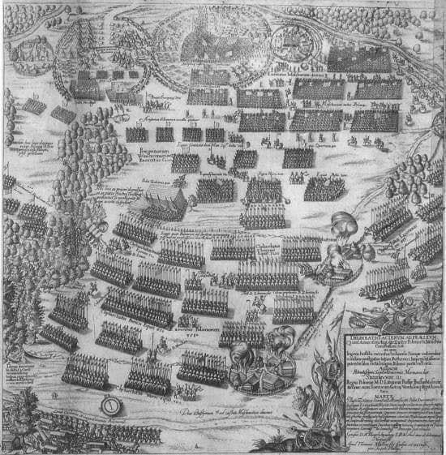

### 2022

> Wiceminister finansów Artur Soboń nie wyklucza wprowadzenia ewentualnego podatku od nadmiarowych zysków banków. - Jeśli będziemy widzieli sytuację, w której będzie to skuteczne narzędzie - na reakcję w sytuacji, w której pozycja poszczególnych podmiotów gospodarczych jest nadużywana, aby uzyskiwać nadmiarowe zyski kosztem swoich klientów - wtedy możemy reagować - wyjaśnił.

---

Holenderscy rolnicy stanęli murem w obronie zaledwie KILKUDZIESIĘCIU gospodarstw. Wiedzą, że później będą następne.

Solidarność, o jakiej Polacy zapomnieli.

  

---

  

  

  

  

### 2021

  

### 1996

$370 million for an integer overflow. The June 4, 1996 Ariane 5 bug: 64 bit float relating to the horizontal velocity of the rocket was converted to a 16 bit signed integer

### 1994

<a href="./documents/july/dziennikurzedowy.pdf" target="_blank">Dziennik Urzędowy</a>

### 1975

W Hamburgu zakończył się trwający ponad rok proces przeciwko Ludwigowi Hahnowi (zdjęcie) oficerowi SS, zbrodniarzowi niemieckiemu, komendantowi Sicherheitsdienst (Służby Bezpieczeństwa Reichsführera SS) na Dystrykt Krakowski i Warszawski.
Hahn odpowiedzialny był za masowe eksterminacje inteligencji krakowskiej, represje wobec ludności stołecznej oraz organizowanie akcji deportacyjnych żydowskiej społeczności Warszawy do obozu zagłady w Treblince.
Sąd w Hamburgu uznał go winnego zarzucanych mu czynów, skazując go na karę dożywotniego więzienia. Hanh spędził w celi 8 lat. Wyszedł na wolność z powodu choroby nowotworowej. Zmarł 10 listopada 1986 roku w wieku 78 lat.

  

### 1943

Miała miejsce katastrofa lotnicza w Gibraltarze, w której życie stracił generał Władysław Sikorski - premier RP i Naczelny Wódz Polskich Sił Zbrojnych.
Samolot Liberator II AL523 należący do 511 dywizjonu brytyjskich Królewskich Sił Powietrznych, którym Naczelny Wódz wracał z inspekcji Armii Polskiej na Wschodzie, runął do morza o godzinie 23.06, równo 16 sekund po starcie. W wyniku katastrofy śmierć ponieśli również towarzyszący mu obywatele RP: Zofia Leśniewska, gen. bryg. Tadeusz Klimecki, płk. dypl. Andrzej Marecki, por. mar. Józef Ponikiewski, Adam Kułakowski oraz Jan Gralewski. Z życiem uszedł jedynie pilot samolotu Eduard Prchal. Jako przyczynę katastrofy przyjęto zablokowanie sterów wysokości samolotu, do którego doszło z przyczyn niemożliwych do ustalenia. Nie wszystkie ciała ofiar zostały odnalezione. Nie jest również znana dokładna liczba osób, które przebywały na pokładzie w chwili tragedii. Ciało generała Sikorskiego zostało wydobyte z morza i przewiezione do Wielkiej Brytanii na pokładzie polskiego niszczyciela ORP „Orkan”. Generał Władysław Sikorski został pochowany na cmentarzu polskich lotników w Newark pod Nottingham. 17 września 1993 r. jego ciało spoczęło w krypcie św. Leonarda na Wawelu. W listopadzie 2008 roku, w ramach śledztwa IPN ekshumowano ciało generała Władysława Sikorskiego. Według badań generał zginął w wyniku obrażeń wielonarządowych, typowych dla ofiar katastrof komunikacyjnych. Do dziś katastrofa w wyniku której życie stracił Naczelny Wódz wywołuje wielkie emocje. Wiele osób uważa, że Naczelny Wódz padł ofiarą zamachu.

  

### 1946

https://en.wikipedia.org/wiki/Kielce_pogrom

W Kielcach miał miejsce pogrom ludności żydowskiej tego miasta.
Główną przyczyną tego wydarzenia była pogłoska o rzekomym uwięzieniu przez Żydów, zaginionego trzy dni wcześniej 8-letniego polskiego chłopca Henryka Błaszczyka, na którym miano dokonać próby rytualnego mordu. Ojciec chłopca, miejscowy szewc, już wieczorem około godziny 23 zawiadomił milicję o przedłużającej się nieobecności syna. Ten jednak wrócił do domu dwa dni później, opowiadając o rzekomym przetrzymywaniu go przez Żydów, co wzbudziło u ojca chęć udania się na posterunek milicji w celu złożenia zeznań. Obaj opowiedzieli tam historię porwania Henryka. Według zeznań syna i ojca, nieznajomy mężczyzna dał chłopcu na ulicy paczkę i poprosił o odniesienie jej do jakiegoś domu. Za tę przysługę miał mu zaoferować 20 zł. Drogę miał Henrykowi wskazywać ten mężczyzna. Po dojściu na miejsce miano zabrać Henrykowi paczkę i zamknąć go w piwnicy, gdzie miało być już kilkoro innych dzieci. Według zeznań Błaszczyków w drodze na komisariat mały Henryk miał wskazać budynek przy ulicy Planty 7 jako na miejsce swojego uwięzienia, jak również rozpoznać mężczyznę, który go uwięził. Budynek ten znajdował się w odległości 200 metrów od komisariatu. Mieścił się w nim m.in. tzw. Komitet Żydowski, znajdowali tam też schronienie przypadkowi Żydzi, w tym będący w Kielcach przejazde. Zeznania Błaszczyków miały później okazać się nieprawdziwe – w rzeczywistości chłopiec, nie informując rodziców, pojechał do oddalonej o 20 km od Kielc wsi, w której rodzina mieszkała w czasie wojny. Historia o porwaniu przez Żydów została wymyślona najprawdopodobniej przez samego chłopca w celu uniknięcia kary.
Na reakcję milicji nie trzeba było długo czekać. Skierowany przez starszego sierżanta patrol udał się na ulicę Planty, gdzie zaaresztował wskazanego przez chłopca mężczyznę o nazwisku Kalman Singer. Inny patrol udał się na miejsce rzekomego przetrzymywania Henryka. Podejrzenie budzi zachowanie milicjantów, którzy idąc przez miasto, sami opowiadali napotkanym przechodniom o tym, co się wydarzyło. Co więcej, w budynku, w którym chłopiec miał być więziony nie było żadnych piwnic. Po pewnym czasie na miejscu pojawił się patrol funkcjonariuszy UB, wysłany przez mjra Władysława Spychaj-Sobczyńskiego , dowódcę kieleckiego UB.
Począwszy od pierwszego pojawienia się milicjantów, przed budynkiem przy ul. Planty 7 zaczął zbierać się wrogo nastawiony tłum przypadkowych osób. Zaniepokojeni Żydzi (doktor Seweryn Kahane, przewodniczący Komitetu Żydowskiego oraz jego zastępca Chil Alpert) telefonicznie starali się o odwołanie milicji oraz ochronę, dzwoniąc do komendanta wojewódzkiego UB , mjra Władysława Spychaj-Sobczyńskiego (byłego członka KPP), a nawet do NKWD , które odmówiło interwencji.
Pierwsze starcia rozpoczęły się około godziny 10.00, kiedy to przed budynkiem na ulicy Planty 7 (zdjęcie) zgromadził się rozwścieczony tłum oraz oddziały Ludowego Wojska Polskiego i Korpusu Bezpieczeństwa Wewnętrznego , które obstawiły budynek, nie rozpraszając jednak zgromadzonego tłumu. Żołnierze i oddziały porządkowe nie zrobiły niczego, aby zażegnać groźną sytuację. Conajmniej dziwne jest też to, że żołnierze ostrzeliwali okna budynku oraz oddawali strzały do znajdujących się w nim osób. W trakcie strzelaniny zabito kilkanaście osób. Następnie, żołnierze żołnierze i przedstawiciele innych formacji mundurowych wyciągali Żydów znajdujących się w kolejnych pomieszczeniach budynku i wyprowadzali na zewnątrz. Zgromadzony przed budynkiem tłum cywilów i żołnierzy bił te osoby i rzucał w nie kamieniami. Kilka do kilkunastu osób (mężczyzn i kobiet) zostało wówczas zastrzelonych lub zabitych bagnetami i tępymi narzędziami. Miejscowa komendantura UB nie zrobiła niczego, by powstrzymać rozlew krwi. Około godziny 12.00 na miejsce wydarzeń przybył nowy oddział wojska, wysłany przez
pułkownika Stanisława Kupszę. Jego dowódca – major Konieczny rozkazał oddać salwę w powietrze. Ta pierwsza podczas zamieszek zdecydowana akcja wojska pozwoliła na opanowanie sytuacji i przywrócenie porządku. Wystawiono ochronę wokół budynku, a milicjanci zaczęli wywozić zabitych i rannych do szpitala miejskiego. Około godziny 12.30 z Kieleckich Zakładów Metalowych (d. Huta „Ludwików”) pod dom na ul. Planty 7 wyruszyło kilkuset robotników uzbrojonych w metalowe rury, kije i kamienie. Po przybyciu na miejsce robotnicy przerwali słaby kordon żołnierzy, zaatakowali pozostałych w domu Żydów rozpoczynając pogrom na nowo. W tym czasie akty przemocy wymierzone w ludność żydowską zdarzały się na terenie całego miasta. Pod domem na ul. Planty i w jego okolicach zabitych zostało ponad dwadzieścia osób. Kilku mieszkańców Kielc narodowości polskiej zostało pobitych, gdyż wzięto ich za Żydów . Zginęło też trzech Polaków, którzy prawdopodobnie wystąpili w obronie napadniętych Żydów.
Około godziny 14.00 służby mundurowe zaczęły reagować na rozprzestrzeniającą się przemoc. Komendant UB – mjr Władysław Spychaj-Sobczyński, zebrał na komendzie zamieszkałe w różnych częściach miasta rodziny żydowskie i zapewnił im ochronę. Wystawiono straż wokół szpitali, do których przewożono ofiary pogromu, gdyż wokół nich również zaczęli gromadzić się agresywni ludzie] . Po oddaniu kilku salw wojsku udało się około godziny 14.00 odepchnąć tłum od budynku na ulicy Planty 7. Przed wieczorem do miasta wkroczyły dodatkowe oddziały wojska, pojawiły się wozy pancerne. Wprowadzono godzinę policyjną. Jeszcze tego samego dnia aresztowano ponad stu uczestników pogromu, w tym 34 żołnierzy i oficerów LWP oraz 6 funkcjonariuszy KBW. Około godz. 18.00 pogrom się zakończył.
Śmierć poniosło 40 osób (3 Polaków i 37 Żydów), a 35 osób odniosło rany.
Pogrom kielecki skutecznie, w celach propagandowych wykorzystały władze komunistyczne, które oskarżyły o inspirowanie do niego działaczy podziemia antykomunistycznego. Przypyszczać jednak należy, że w rzeczywistości było dokładnie odwrotnie, na co wskazuje wiele niejasności w tej sprawie oraz dziwne działania wojska i milicji.
Pogrom kielecki wzburzył opinię publiczną w Polsce i za granicą, wzmógł emigrację Żydów z Polski i innych krajów europejskich, i przyczynił się do rozpowszechnienia w świecie stereotypu Polaka- antysemity.

### 1920

W czasie wojny polsko-bolszewickiej na terenach dzisiejszej Białorusi rozpoczęła się wielka ofensywa wojsk rosyjskich dowodzonych przez generała Michaiła Tuchaczewskiego. Radziecki Front Zachodni przypuscił atak od strony rzek Auta i Berezyna. Rosjanie uderzyli na pozycje bronione przez 1 Armię generała Gustawa Zygadłowicza.
Na polskie oddziały uderzyły 3 armie
bolszewickie. Polacy nie dali rady
powstrzymać nieprzyjaciela. Polskie
dowództwo, nie dysponując na tym odcinku
frontu odwodami, zarządziło odwrót.

  

### 1662

W Królewcu wybuchło powstanie przeciwko elektorowi brandenburskiemu i księciu pruskiemu Fryderykowi Wilhelmowi Hohenzollernowi (grafika).
Przywódcą tego buntu był Hieronim Roth-przywódca opozycji mieszczańskiej, która opowiadała się za zjednoczeniem Prus i Polski.

  

### 1610

Miała miejsce bitwa pod Kłuszynem.
Wojska hetmana polnego koronnego Stefana Żółkiewskiego rozbiły oddziały armii carsko-szwedzkiej Dymitra Iwanowicza Szujskiego oraz Jacoba Pontussona de la Gardie.Szwedom i Rosjanom nie pomogła nawet pięciokrotna przewaga liczebna. Zaledwie 7 tysięczna armia polska obrała skuteczną taktykę,która polegała na kilkunastokrotnych atakach Huzarii na pozycje wroga. Wojska Rzeczypospolitej straciły
około 300 żołnierzy, a Moskale i Szwedzi
blisko 8 tys. Było to jedno z największych
zwycięstw husarii w XVII wieku, które
otworzyło drogę na Moskwę.

  

---

<a href="https://github.com/TomaszWaszczyk/historia.waszczyk.com/edit/master/src/content/july-4.md" target="_blank">Edytuj tę stronę dzieląc się własnymi notatkami!</a>
