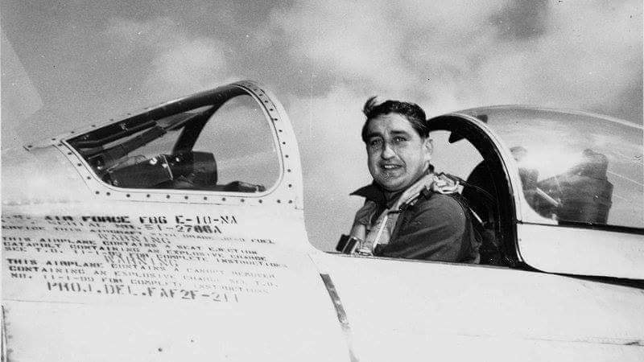
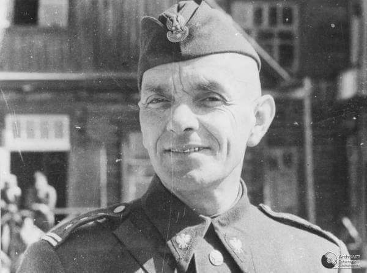
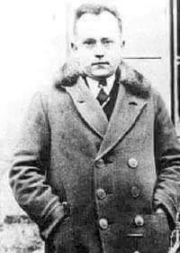

### 1951

Na terenie Korei Północnej Franciszek Gabryszewski wyśrubował swój rekord uzyskując zestrzelenie 29 samolotu. Franciszek Gabryszewski był amerykańskim oficerem pochodzenia polskiego, trzecim na liście asów USAF. Kawalerem Krzyża Walecznych. Służył na Hawajach. W czasie II wojny światowej w latach 1942/43 latał bojowo z polskimi pilotami w Dywizjonie 315 wykonując 20 lotów bojowych. Później otrzymał awans na dowódcę 61 Dywizjonu Myśliwskiego. W 1951 roku został skierowany do Korei. Był tam zastępcą dowódcy 4 Skrzydła Myśliwskiego, a później dowódcą 51 Skrzydła Myśliwskiego. W 1967 roku przeszedł w stan spoczynku. Łącznie osiągnął 34,5 zestrzeleń pewnych i 3 prawdopodobne. Dwa razy odwiedzał Polskę – w 1992 i 1999 r. Zmarł 31 stycznia 2002 roku w szpitalu w Nowym Jorku.

  

### 1945

https://pl.wikipedia.org/wiki/Polski_Korpus_Przysposobienia_i_Rozmieszczenia

### 1944

Na terenie Évreux we Francji as myśliwski Franciszek Gabryszewski (znany bardziej jako Francis Gabreski) zestrzelił swój rekordowy 28 niemiecki samolot.

---

Dowódca 1 Armii Wojska Polskiego w ZSRR generał dywizji Zygmunt Berling (zdjęcie) wydał rozkaz nr 00130 na mocy którego w Berdyczowie i Żytomierzu sformowano 6 Dywizję Piechoty oraz 1 Korpus Pancerny. W skład Dywizji wchodziły :

- 16 Pułk Piechoty – Boguń koło Żytomierza
- 17 Pułk Piechoty – Boguń
- 18 Pułk Piechoty – Boguń
- 23 Pułk Artylerii – Sadki koło Żytomierza
- Samodzielny Szkolny batalion piechoty –
Bondary koło Żytomierza
- 5 Samodzielny dywizjon artylerii
samochodowej – Sadki
- 6 Samodzielna kompania zwiadowcza –
Baraszówka
- 13 Samodzielny batalion saperów –
Dawidówka koło Żytomierza
- 15 Samodzielna kompania łączności –
Baraszówka
- 6 Samodzielna kompania obrony chemicznej
– Baraszówka
- 8 Samodzielna kompania transportu
samochodowego – Baraszówka
- 7 Piekarnia Polowa – Baraszówka
- 6 Samodzielny batalion sanitarny –
Januszewice koło Żytomierza
- 6 Ambulans Weterynaryjny – Baraszówka
- pluton Dowództwa Artylerii – Żytomierz
- Polowe Warsztaty Mundurowe – Żytomierz
- 3045 Stacja Poczty Polowej – Żytomierz
- 1867 Kasa Banku Polowego – Żytomierz
- Oddział Informacji Dywizji – Żytomierz
Miasta podane przy nazwach to miejsca formowania się tych oddziałów.

  

---

### 1943

Rosyjski komisarz ludowy Siergiej Sawczenko wystosował raport do Nikity Chruszczowa, w którym określił cele Organizacji Ukraińskich Nacjonalistów oraz stwierdzał, że jest to organizacja "wykorzystująca kształtowaną przez wieki nienawiść do Polaków".
Według autora Ukraińcy od samego początku wojny byli tylko narzędziem w rękach Niemców wykorzystanym do walki z Polakami.
Dalej w raporcie czytamy:
" ,,Polacy … szczególnie we Lwowie prowadzą wobec Niemców pokojową politykę, dają się poznać jako przykładni, lojalni obywatele, nie wysuwają żadnych roszczeń i nie zgłaszają żadnych pretensji. Polacy są narodem, w którego rękach są ukraińskie nieruchomości, przedsiębiorstwa państwowe, instytucje finansowe".
Dokument tem jest o tyle interesujący, że przedstawia rosyjski punkt widzenia na stosunki polsko-ukraińskie.

### 1927

Powstało we Wrocławiu Towarzystwo Podróży Kosmicznych. Było to stowarzyszenie zrzeszajace miłośników techniki rakietowej, a jego założycielem i pierwszym prezesem był Johannes Winkler (zdjęcie). Towarzystwo zajmowało się nie tylko techniką rakietową, ale także propagowaniem idei lotów kosmicznych.
W wyniku nieporozumień w rozmowach z armią niemiecką, która w zamian za badania nad uzbrojeniem rakietowym obiecała wsparcie finansowe Towarzystwo Podróży Kosmicznych upadło w 1933 roku.

  

---

<a href="https://github.com/TomaszWaszczyk/historia.waszczyk.com/edit/master/src/content/july-5.md" target="_blank">Edytuj tę stronę dzieląc się własnymi notatkami!</a>
