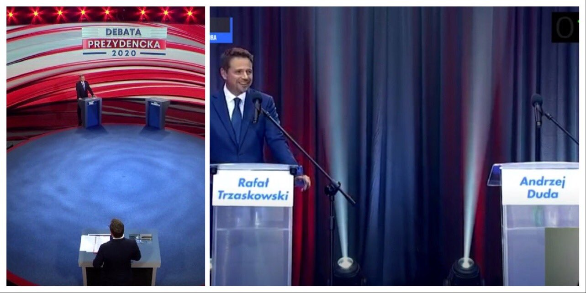

### 2022

Months After Shilling $3,000 ETH, Cramer Says Crypto Has “No Real Value”

“Crypto really does seem to be imploding. When it goes from $3 trillion to $1 trillion, why should it stop at $1 trillion? There’s no real value there,” Jim Cramer said on CNBC’s Squawk Box Tuesday.

Key Takeaways

    The cryptocurrency space has "no real value" and could suffer from further losses, Jim Cramer suggested on CNBC's Squawk Box Tuesday.
    The former hedge fund manager pointed to the recent wave of crypto firms suffering from liquidity issues as he slammed the space.
    Cramer's comments come months after he said that investors could "easily" secure returns of 35 to 40% from investing in Ethereum. He also previously announced that he had bought into the asset.

  

Answered "nooooooooooooooooooo"

  

### 2020

  

---

Permanent layoffs surging faster than 2008 Great Financial Crisis

- 1.6 million permanent layoffs in 4 months
- 2008-2009 it took 11 months

  

---

Wlaśnie pod wiele mówiącym tytułem "The Deficit Myth: Modern Monetary Theory and How to Build a Better Economy" ukazala sie prawdziwa biblia wyznawcow MMT, autorstwa dr Stephanie Kelton.

Swoja droga byloby interesujace wiedziec do ilu ekonomicznych autorytetow zwrocilo sie o promocyjny wpis na "skrzydelku" wydawnictwo John Murray, wydawca ksiazki w Wlk. Brytanii.

Bo wsrod 8 zachwyconych glosow ("eye-opening"; "game-changing"; "must-read"; a nawet wprawiajace w lekkie zazenowanie: "The Deficit Myth is simply the most important book I've ever read") NIE MA ANI JEDNEGO PIERWSZOLIGOWEGO EKONOMISTY AKADEMICKIEGO.

Jak na biblie i ksiazke zmieniajaca wszystko co wiemy o polityce fiskalnej, zadluzeniu, a nawet szerzej - o wspolczesnej ekonomii, ten brak zachwyconych pierwszoligowcow jest w swej wymowie druzgocacy.

A nie ma ich tam pewnie dlatego, ze wiekszosc z nich juz dawno rozprawila sie z prawdziwymi mitami gloszonymi przez dr. Kelton. Ich opinie o MMT nie pasowaly wiec na "skrzydelka".

Oczywiscie, zeby wyrobic sobie wlasne zdanie na temat MMT ksiazke Stephanie Kelton trzeba koniecznie przeczytac. Tym bardziej, ze ideologia MMT zaczyna sie intensywnie przesaczac i do polskiej polityki. W nadwislanskiej wersji MMT dlug nie jest problemem. Problemem sa limity tego dlugu.

---

  

---

### 2015

Meczet wahabicki na Ochocie otwarty.

### 1920

Rada Obrony Państwa powołała do życia Generalny Inspektorat Armii Ochotniczej, na którego czele stanął generał Józef Haller (zdjęcie).
Utworzenie tej instytucji spowodowane było coraz trudniejszą sytuacją militarną Polski, a konkretnie rosnącym zagrożeniem ze strony Rosji.
Działania Hallera jako generalnego inspektora były bardzo skuteczne, ponieważ już 22 lipca 1920 roku wydał on rozkaz o utworzeniu Dywizji Ochotniczej. Stworzyć miał ją z czego, gdyż zaledwie do 30 września 1920 roku na apel o wstąpienie w szeregi nowo powstającej armii odpowiedziało aż 105 tysięcy ochotników.

  

---

<a href="https://github.com/TomaszWaszczyk/historia.waszczyk.com/edit/master/src/content/july-6.md" target="_blank">Edytuj tę stronę dzieląc się własnymi notatkami!</a>
