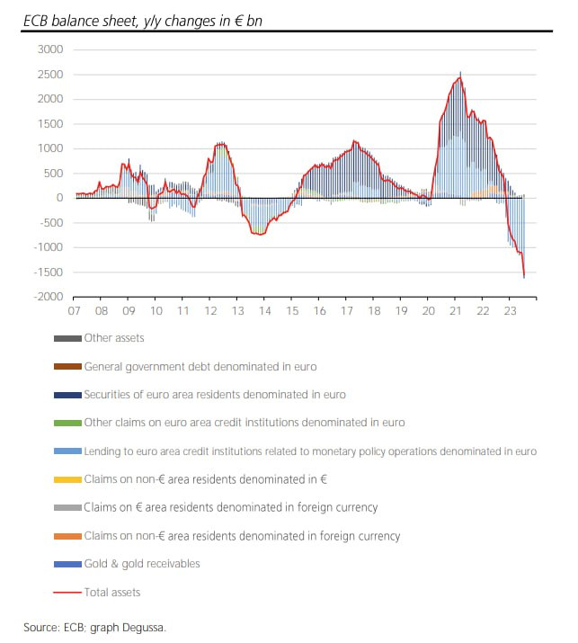
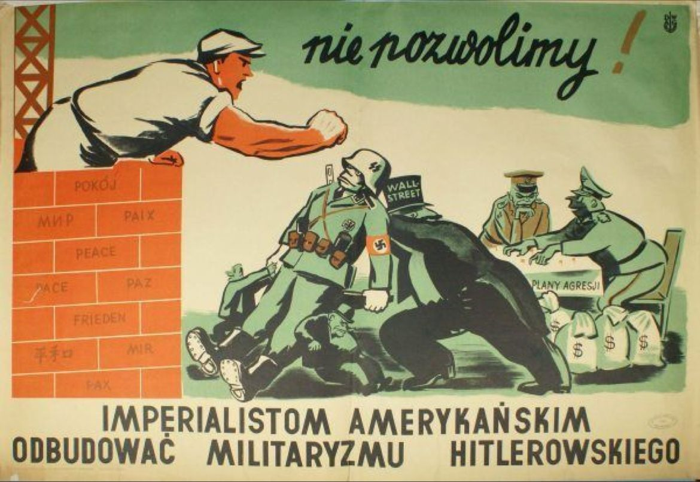
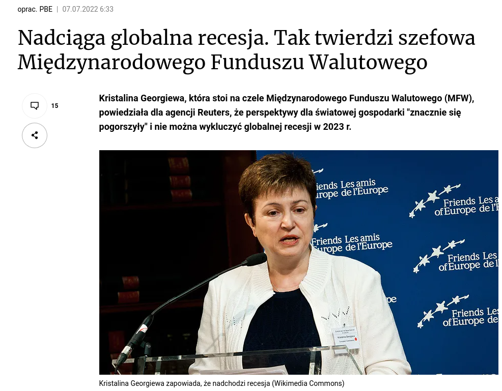
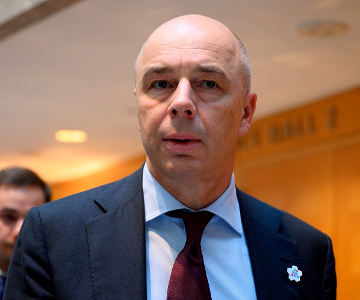
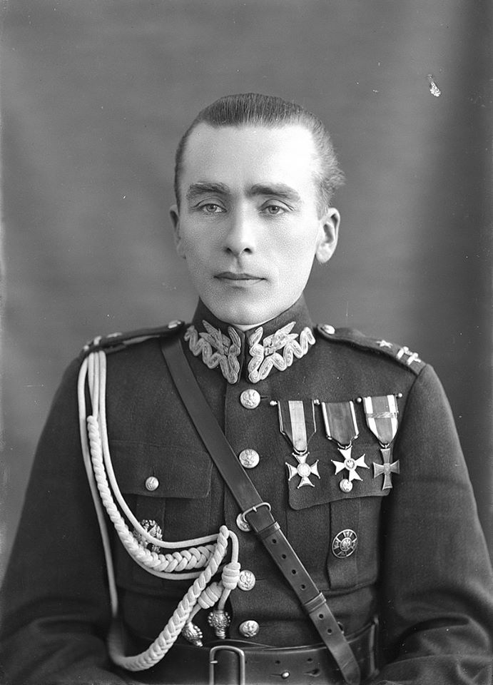
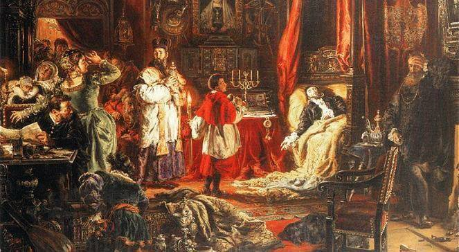

### 2023

ECB balance sheet down 1,548.6 €bn y/y on 30/6/23. ECB lending to banks fell 1,508.9 €bn y/y, the ECB bond portfolio declined just 78.2 €bn y/y.

  

ECB is technically bankrupt, out of money. FED is out of positive balance sheet, too. West world is bankrupt and mediocre managers do not see it - others will profit it, heavily. IF (this is actually significant IF) nothing will change within maximum ~1year something extraordinary MUST happen. Around 30% (roughly calculated) of labour force will LOOSE jobs WITHOUT ANY chance for joining the labor force. In front of us is: monetary shock that happen one time per ~100years.

I completely lack any imagination for any other scenario. Unemployment will skyrocket WITHOUT any chance for joining the labor force (no supply money). Purchasing power of money MUST decrease, a lot. Country like Poland.. after exchanging money flowing from US.. in USD.. (that is why USDPLN is today ~4.0, not ~5.5 - Gierek 2.0) will skyrocket x2 at the beginning, then turkish lira scenario.

Some next bullshit (but bigger one) will happen. ;/

  

---

### 2022

> Dziś słyszymy, że chcą nas pokonać, no cóż mogę powiedzieć, niech spróbują. Tak naprawdę jeszcze niczego nie zaczęliśmy - Putin

---

United Nations:

> Hungry people are the most productive people, especially where there is a need for manual labour.

  

### 2021

  

Russia will eliminate the dollar from its National Wellbeing Fund, shifting to euros, yuan, and gold, Finance Minister Anton Siluanov said, as the Kremlin seeks to reduce exposure to U.S. assets amid threats of sanctions.

The transfer, which affects about $119 billion in liquid assets, will take place within the central bank’s huge reserves. As a result, its market impact — if there is one — could be hard to trace. The Bank of Russia has steadily reduced holdings of dollars in the last several years as sanctions pressures from the U.S. and European Union have grown.

“We can make this change rather quickly, within a month,” Siluanov told reporters at the St. Petersburg International Economic Forum.

The dollar pared gains and the ruble hit the day’s highs on the news Thursday.

“The central bank can make these changes to the Wellbeing Fund without resorting to market operations,” said Sofya Donets, economist at Renaissance Capital in Moscow. “This in some sense a technical thing.”

Putin’s Bid to Ditch Dollar Picks Up as Exports Move to Euro

Jordan Rochester, currency strategist at Nomura International PLC, said, “This is a transfer of euros from the central bank to the wealth fund, we’ll then see the central bank the holder of the USDs and it’s up to them to manage it. No initial market impact.”

Eventually, the central bank may sell those holdings but it’s not clear how quickly they will do so, he said. There could be market impact if the central bank sells its remaining holdings of U.S. treasuries, he added.

The wealth fund currently holds 35% of its liquid assets in dollars, worth about $41.5 billion, with the same amount in euros and the rest spread across yuan, gold, yen and pounds.

After the change, the fund’s assets will be held 40% in euros, 30% in yuan, 20% in gold, and 5% each in yen and pounds, Siluanov said.

The wealth fund holds savings from Russia’s oil revenues above a cutoff price and is used to help offset shortfalls when the market falls below that level. Together with illiquid assets, its total value is $185.9 billion. With the economy recovering faster than expected, the budget deficit will be 1% of gross domestic product this year, Siluanov said, narrower than the 2.4% initially planned.

The central bank reports the currency distribution of its reserves with a six-month lag, declining to provide information on its current holdings.

### 2020

Rząd poinformował, że w czerwcu dochody budżetowe były o 3% większe niż rok temu. To jednak głównie zasługa wpłaty NBP do budżetu, która w tym roku wyniosła prawie 8 mld zł, a w ubiegłym roku okrągłe zero. Czyli dochody podatkowe w czerwcu były 6-7% niższe niż przed rokiem

---

W przyszłości firmy edukacyjne będą:

1) Określać gdzie jest ich student.
2) Określać, jaki jest ich student.
3) Określać, co umie ich student.
4) Określać, gdzie idzie ich student.
5) Dobierać materiały i formę nauki prowadzące z 1) do 4) bazując na 2) i 3)

Gdy 4) nie będzie znane, to pomogą eksplorować różne zagadnienia, aby odnaleźć cel, kierunek, pasję (lub wszystko powyższe).

Wierzę, że powstanie też otwarta baza, z której będą korzystać wszystkie firmy edukacyjne i szkoły.

---

### 1944

Rozpoczęła się w Wilnie operacja „Ostra Brama". Kilkudniowe zmagania żołnierzy Armii Krajowej prowadzone wspólnie z Armią Czerwoną doprowadziły do oswobodzenia miasta, w czym polscy żołnierze mieli znaczący udział.

Okręgi Wileński i Nowogródzki AK wystawiły do walki ok. 10 tys. żołnierzy, wyłącznie piechoty i kawalerii. Całością operacji dowodził „Gen. Wilk", ppłk Aleksander Krzyżanowski. Niemcy wprowadzili do walki, oprócz piechoty i artylerii w sile ok. 17 tys. żołnierzy, także broń pancerną i siły lotnicze.

Do 13 lipca Polacy i Rosjanie oswobodzili miasto z rąk Niemców. "To uderzenie Armii Czerwonej było decydujące" - powiedział PAP historyk z Uniwersytetu Jagiellońskiego prof. Tomasz Gąsowski.

Rozkaz o operacji "Ostra Brama" podpisał 26 czerwca ppłk Aleksander Krzyżanowski. Dokument określał kierunki natarcia poszczególnych zgrupowań AK na niemieckie linie obronne. Polacy mieli zaatakować Wilno zanim dotrze tam Armia Czerwona.

Krzysztof Tarka w biografii „Jeden z wyklętych. Generał Aleksander Krzyżanowski +Wilk+" wskazuje, że Krzyżanowski apelował do mieszkańców Wileńszczyzny - Polaków i Białorusinów o zjednoczenie w walce z okupantem. Nie zwracał się do Litwinów, których, tak jak Niemców, polskie podziemie na Wileńszczyźnie uznawało za okupantów; część Litwinów kolaborowała z Niemcami.

„Polityczna i militarna sytuacja chwili obecnej jest więcej niż poważna i w najbliższej przyszłości na tych północno-wschodnich ziemiach Rzeczypospolitej Polskiej będziemy przeżywać więcej niż poważne chwile dziejowe (...). Wzywam przeto społeczeństwo polskie i białoruskie tych ziem do skupienia wszystkich swych sił do ostatecznej rozgrywki. Musimy wejść do niej zjednoczeni i tym samym silni (...). (...) dopóty nie zaprzestaniemy walki, aż ostatni żołdak Hitlera nie opuści granic Rzeczypospolitej" - czytamy w "Jednym z wyklętych".

Autor biografii pisze też, że wschodniemu sąsiadowi Krzyżanowski przekazał, "iż Polska nie była i nie jest w stanie wojny ze Związkiem Radzieckim", zaś „naród polski i jego rząd w Londynie stanowczo tylko odrzuca wszelkie pretensje rządu sowieckiego do wschodnich ziem Rzeczypospolitej".

13 lipca żołnierze AK o świcie wywiesili na Górze Zamkowej biało-czerwoną flagę, jednak po kilku godzinach żołnierze sowieccy zastąpili ją czerwonym sztandarem. „O świcie 13 lipca na Górze Zamkowej załopotał dumnie biało-czerwony sztandar. Był wyraźnie widoczny z każdego miejsca okaleczonego miasta. Zatknęli go pchor. Jerzy Jensch i kpr. Artur Rychter (...). Wieża Giedymina górowała nad miastem. Biało-czerwona w najwyższym punkcie Wilna musiała rozwścieczyć Niemców. Od strony placu Łukiskiego, gdzie jeszcze bronili się artylerzyści i esesmani, padła salwa granatów z ciężkich moździerzy. Wkrótce rejon Góry Zamkowej został obłożony ogniem artyleryjskim. Na szczęście pchor. Jensch zdążył ze swoimi ludźmi zbiec w dół i przyłączyć się do żołnierzy sowieckich, którzy atakowali Niemców w widłach Wilii i Wilenki". (Leszek Kania „Wilno 1944")

Wraz z upływem dnia siły niemieckie kurczyły się. Najcięższe walki trwały w okolicach Góry Bouffałowej, w Ogrodzie Botanicznym i w rejonie więzienia na Łukiszkach. "Na placu Łukiskim nieprzyjaciel zgromadził ocalałe baterie. Niemcy postanowili drogo sprzedać swoją skórę. Odcięci wstęgą rzeki od Zakrętu i Zwierzyńca nie mogli zabrać się z grupą gen. Stahela. Walczyli do wyczerpania amunicji, zadając atakującym straty jeszcze po kilka godzin. Do wieczora Rosjanie i Polacy wielkim kosztem zdobyli ostatnie reduty na Łukiszkach". (Leszek Kania „Wilno 1944")

Gdy 13 lipca walka o Wilno dobiegła końca, Polacy w mieście (ponad połowa mieszkańców Wilna mówiła po polsku) przeżyli krótką, ale radosną chwilę wolności: „Polskość miasta bije w oczy. Pełno naszych żołnierzy - z entuzjazmem meldował ppłk Szydłowski (...). Szpitale przepełnione, wszystkie w rękach polskich. W fabrykach i warsztatach tworzą się komitety i zarządy polskie. Władze administracyjne ujawnią się w najbliższym czasie. Litwinów nie ma". (Zbigniew Sebastian Siemaszko „Wileńsko-nowogródzkie telegramy").

Według Kani straty poszczególnych stron trudne są do oszacowania. Podaje jednak, że Rosjanie, w ciągu kilku dni, stracili ok. 5 tys. żołnierzy, Niemcy - ok. 3-4 tys., a Polacy co najmniej 550 żołnierzy.

Bitwa o Wilno miała istotne znaczenie dla Polaków, Rosjan i Niemców. Polacy chcieli odzyskać jedno z najważniejszych miast dawnej Rzeczpospolitej; Rosjanie chcieli utrzymać zagarnięte miasto - w 1939 roku przekazali je Litwie, ale już rok później Litwa, wraz Łotwą i Estonią, weszła w skład ZSRR; dla Niemców Wileńszczyzna była ważnym ośrodkiem miejskim, leżącym w pobliżu Prus Wschodnich.

Jak podkreślił prof. Tomasz Gąsowski, walki AK o Wilno były kolejną fazą realizacji planu „Burza". Miał on na celu wyzwolenie Polski własnymi siłami, tj. zmobilizowanymi oddziałami Armii Krajowej przy taktycznym współdziałaniu z Armią Czerwoną, oraz zainstalowanie tam legalnych polskich władz. „Metodą faktów dokonanych próbowano odwrócić ustalenia konferencji Wielkiej Trójki w Teheranie (listopad 1943) o przekazaniu ziem wschodnich II Rzeczpospolitej Związkowi Sowieckiemu. Chodziło także o zaprzeczenie sowieckiej propagandzie głoszącej, iż Polacy nie walczą z Niemcami. Z kolei dla ZSSR było to wypełnianie ustaleń teherańskich, sankcjonujących agresję z 17 września 1939 roku" - wyjaśnił profesor.

Historycy oceniają, że w starciach na Wileńszczyźnie Armia Krajowa dała dowód swojej obecności i determinacji, jednak z militarnego punktu widzenia operacja "Ostra Brama" okazała się działaniem nie w pełni udanym. Operacja "Ostra Brama" rozpadła się na kilka, nieskoordynowanych w czasie, odrębnych działań. Oddziały AK nie były militarnie tak silne jak regularne oddziały armii niemieckiej i sowieckiej - i dlatego starcie pomiędzy tymi dwiema rozstrzygnęło o ostatecznym rezultacie walki.

Dzień po wyzwoleniu miasta Sowieci zgodzili się na utworzenie z oddziałów AK Okręgów Wileńskiego i Nowogródzkiego samodzielnej jednostki. Miała ona, pod dowództwem polskim, wchodzić w skład 3. Frontu Białoruskiego. Armia Czerwona obiecała też Polakom zapewnić uzbrojenie, wyposażenie i wyżywienie.

Wkrótce sztab 3. Frontu Białoruskiego zaprosił ppłk. Krzyżanowskiego na odprawę w Boguszach. Tam też strony miały uzgodnić szczegóły utworzenia z oddziałów AK nowej jednostki. Po przybyciu na miejsce "Wilk" został jednak aresztowany i uwięziony. Wkrótce podobnie postąpiono z innymi żołnierzami i oficerami AK - część z nich trafiła do więzień, a część na Syberię.

„Zachowanie Sowietów było niewątpliwym podstępem. W ciągu kilkudniowych walk nawiązany został bowiem kontakt sugerujący możliwość jakiejś koegzystencji oddziałów Armii Krajowej i Armii Czerwonej po zwycięskim zakończeniu walk o Wilno. Jednak w ówczesnej sytuacji politycznej były to złudzenia, którymi strona polska karmiła się, nie chcąc z góry kapitulować bez podjęcia walki. Natomiast Sowieci +szli po swoje+" - powiedział PAP Gąsowski.

---

### 1941

W Warszawie Gestapo aresztowało Janusza Albrechta (grafika) dyplomowanego pułkownika służby stałej kawalerii i szefa sztabu Komendy Głównej Związku Walki Zbrojnej.
Albrecht padł ofiarą denuncjacji przez rotmistrza Przemysława Deżakowskiego.
Torturowano go przez kilka dni, po czym ten załamał się i złożył obszerne zeznania dotyczące struktur i organizacji i zadań ZWZ. Został zwolniony z więzienia 27 sierpnia 1941 roku. Niemcy zlecili mu misję zaproponowania Stefanowi Roweckiemu tajnego porozumienia między nimi, a zarządem ZWZ. Oczywiście nigdy do tego nie doszło, a Albrecht, któremu dano do zrozumienia, że jego misja nie ma sensu popełnił samobójstwo 6 września 1941roku.

  

### 1928

Rodzi się ojciec propagandy PRL: https://pl.wikipedia.org/wiki/Maciej_Szczepa%C5%84ski

### 1920

https://pl.wikipedia.org/wiki/Front_P%C3%B3%C5%82nocny_(1920)

### 1572

W Knyszynie zmarł bezpotomnie król Polski i wielki książę litewski Zygmunt II August, co oznaczało wymarcie linii męskiej polskiej gałęzi dynastii Jagiellonów.

Dotąd Jagiellonowie uchodzą w powszechnej opinii za najwspanialszą dynastię w dziejach polskich. Opinia ta wydaje się zasłużona. Po pogromie Zakonu Krzyżackiego w 1410 r. i elekcji Jagiellonów na trony czeski i węgierski „system jagielloński był największą potęgą polityczną na wschód od Rzeszy niemieckiej”, a królowie polscy prowadzili „politykę wielkomocarstwową” – pisał Henryk Łowmiański w obszernej „Polityce Jagiellonów”. Władztwo Jagiellonów rozciągało się na ok. 2 mln km kw. (obecna Polska to ok. 312 tys. km kw.) i to w czasach, gdy wokół wyrastały nowe potęgi i konkurenci: austriaccy Habsburgowie, tureccy Osmanowie i moskiewscy Rurykowicze.

Do czasu Jagiellonowie dominowali, co związane też było z rozrodzeniem się dynastii. Żona Kazimierza IV Jagiellona Elżbieta Rakuszanka, pomimo kalectwa, urodziła 13 dzieci, zyskując zaszczytne miano Matki Królów. Uważano to za potwierdzenie łaski Bożej i tym chętniej obsadzano Jagiellonami trony. Zadziwia nas przy tym, że Kazimierz, prowadząc aktywną i skuteczną politykę „od morza do morza”, był „nieuczony w piśmie, ale mądry i rozsądny”, jak dowodził kronikarz Bernt Stegmann. Gorzej powiodło się synom Kazimierza: ani Jan Olbracht, ani Aleksander nie pozostawili potomstwa, obaj zmarli wskutek zarażenia się krętkiem bladym.

Dynastyczną nadzieją pozostał piąty syn, ponad 40-letni Zygmunt – wbrew etykietce „niewojennego pana”.
Opinia Ludwika Kolankowskiego, że za Zygmunta wielkie zdobycze i pozycja Jagiellonów „padły ofiarą zabójczego kwietyzmu, bezwładu, nieudolności i nieumiejętności skoordynowania potężnych sił i ich użycia” – wydaje się niesprawiedliwa. Król wykazywał wręcz cechy „wojennego pana”: usiłował bronić schedy po Jagiellonach, walcząc z Moskwą i z własnym siostrzeńcem, wielkim mistrzem Zakonu Krzyżackiego Albrechtem Hohenzollernem, a wobec Turcji prowadził konsekwentną politykę utrzymywania pokojowych stosunków. Natomiast słabością okazało się oddawanie atutów politycznych Habsburgom w imię zgodnej republiki chrześcijańskiej.

Zygmunt dochował się tylko jednego syna, Zygmunta Augusta. Zawisł nad nim cień królowej Bony Sforzy: kontrowersyjnej Włoszki, która usiłowała wzmocnić władzę królewską. Jednakże tworząc własną domenę i państwo w państwie, Bona posuwała się do łamania prawa, na co szlachta nie chciała się zgodzić. Mimo to Iron Lady importowana z Italii zdołała przeprowadzić elekcję i koronację vivente rege, za życia króla, niespełna 10-letniego Zygmunta Augusta. Następnym krokiem Bony i Zygmunta Starego było oddanie synowi w 1544 r. w zarząd Litwy, na której Zygmunt August mógł przyuczać się do trudnej sztuki rządzenia.

„W roku 1472 żyło siedmiu Jagiellonów, w wiek potem nie było już żadnego”, zauważył gorzko Józef Szujski. Wymierali szybko. Brat Zygmunta, król węgierski i czeski Władysław II Dobzse Jagiellon, zmarł w 1516 r., pozostawiając także jedynego syna Ludwika. Ale i on w wieku 20 lat zginął podczas odwrotu spod Mohacza, po przegranej bitwie z Turkami w 1526 r.

Władztwo Jagiellonów skurczyło się, choć Bona usiłowała zachować wpływy na resztkach Węgier, wydając w 1539 r. swą córkę Izabelę za Jana Zapolyę, konkurenta Ferdynanda Habsburga do korony św. Stefana.

Matka usiłowała podporządkować sobie Zygmunta Augusta, zbyt długo przetrzymując go w kobiecym fraucymerze i podsyłając mu dojrzałe kobiety, byle odciągnąć od wojaczki i polityki.

Młody król nie był jednak zniewieściałym dojutrkiem, jak to widziała szlachta i usiłowała postrzegać część historiografii. Pomimo zagrożenia życia walczył na turniejach i na jednym z nich życie stracił jego przeciwnik Ilia Ostrogski. Wielką pasją młodego króla były polowania, na których bywało równie niebezpiecznie.

Jednym z pierwszych posunięć Augusta o znaczeniu politycznym było uwolnienie się od tyranii Bony, której się obawiał. Tajny ślub z Barbarą Radziwiłłówną, zawarty latem 1547 r. (po śmierci żony Elżbiety Habsburżanki), wywołał furię Bony, która oskarżała syna, że tym „niegodnym małżeństwem” przyczynił się do śmierci ojca, a jej męża, 1 kwietnia 1548 r. Kolejna śmierć – Barbary 7 grudnia 1550 r. – wcale nie zbliżyła syna do matki i Bona w końcu wyjechała z Polski w lutym 1556 r., uwożąc „sumy neapolitańskie”. August usiłował je odzyskać, nie do końca skutecznie.

Król umiał prowadzić własną politykę, choć do rządzenia marnie go przyuczono. Anna Sucheni-Grabowska: August to był „homo politicus do szpiku kości, ale zarazem człowiek, »któremu nic co ludzkie nie było obce«”. Usiłując nie dopuścić do sojuszu moskiewsko-habsburskiego, w 1553 r. poślubił siostrę swej pierwszej żony, Katarzynę Habsburżankę. Podobnie jak Elżbieta i ona okazała się epileptyczką i na dodatek usiłowała wtrącać się do polityki. Odsunął ją od siebie i zaczął starać się – bezskutecznie – o rozwód, przekonany, że związek z inną kobietą zaowocuje spłodzeniem następcy tronu.

Sprawa rozwodu powiązana była z kwestią reformacji. Król mógł przecież posunąć się do zerwania z Rzymem, jak to uczynił Henryk VIII, tym bardziej że duchowieństwo polskie bliskie było zwołania synodu narodowego. Mimo to król nie zerwał z Rzymem. Na ten temat wylano sporo atramentu: od pochwał tolerancji królewskiej przez Józefa Szujskiego do potępień Michała Bobrzyńskiego, który dowodził, że król nie umiał wyzyskać przeciwieństw religijnych i „nie poszedł z Rzymem, tak samo jak nie poszedł z narodowym kościołem”.

Obecne badania wskazują, że wypada się raczej zgodzić z opinią, że król się „w Pana Jezusowe plewiło wdać nie chciał”, dzięki czemu – jak pisał autor „Poloneutychii” Andrzej Lubieniecki – „Pan Jezus bez rozlania krwie i ostrości miecza uprzątnął tak wiele sekt w Polszcze i na Litwie”. Królewska polityka tolerancji, skrzyżowana dziwnie z jego zainteresowaniami astrologią i magią, wielce przy tym przychylna dla Żydów, zaowocowała pokojem religijnym. I to w czasach, gdy Europa spływała krwią wskutek waśni wyznaniowych.

Zygmunt August miał też ogromne wyczucie polityczne podczas rozstawania się z systemem senatorsko-ministerialnym. Przez pierwsze 10 lat rządów był niechętny szlachcie i jej ruchowi egzekucji praw, co kojarzyło mu się z rokoszami. Badaczki tych spraw Anna Sucheni-Grabowska i Irena Kaniewska sądzą, że te 10 lat zostało przez króla zmarnowane, gdy usiłował rządzić, podobnie jak jego ojciec, przy pomocy senatu. Jednakże w obliczu groźby wojny o Inflanty z Moskwą, krzyków wojska zaciężnego o uposażenie, król pojął, że domaganie się egzekucji praw przez szlachtę nie jest działaniem osłabiającym państwo, lecz na odwrót: jest warunkiem usprawnienia struktur państwa i wzrostu jego obronności oraz potęgi. Lepiej było mieć szlachtę za sobą niż przeciw, nawet kosztem osłabienia władzy senatu i króla na rzecz izby poselskiej. Oznaczało to akceptację demokracji szlacheckiej, systemu politycznego nieistniejącego w innych krajach Europy, może poza Republiką Wenecką.

Na sejmach piotrkowskich 1562 i 1563/1564 r. obóz egzekucyjny wygrał walkę o zastawione i wydzierżawione dobra królewskie. W rok później, pomimo sprzeciwu senatorów, uchwalono reformę podatkową wzmacniającą obronność państwa. Z „senatorskiego króla”, za jakiego uchodził Zygmunt I, jego syn stał się „królem szlacheckim” i swoistym gwarantem demokracji, pomimo że pod koniec życia drogi króla i ruchu egzekucyjnego znów się rozeszły.

Zygmunt August był zdecydowanie niechętny wojnom. Ale zagrożenia ze strony Moskwy Iwana IV Groźnego, Szwecji, a nawet Danii, wymuszały na nim akcje zbrojne. Gdy w Inflantach zaczął słabnąć Zakon Kawalerów Mieczowych, król zorientował się, jak ważny jest Bałtyk i handel Dźwiną dla umocnienia pozycji Rzeczpospolitej. Zygmunt August najpierw szukał rozwiązań dyplomatycznych; wprawdzie w 1557 r. wyprawił się na Inflanty, ale zatrzymał armię w Pozwolu na granicy. Jego działania były jedynie manifestacją siły i początkiem gry politycznej najwyższej próby. Przerażony mistrz Wilhelm Fürstenberg ukorzył się przed Zygmuntem i podpisał sojusz antymoskiewski. Król wiedział, że wywoła to atak Moskwy – i tak też się stało. Wtedy, zgodnie z opracowanym scenariuszem, na prośbę Zakonu „król przyjął Inflanty pod swoją opiekę i przyrzekł obronę”, jak napisał Stanisław Cynarski. „Polityka wobec Inflant okazała się trafna”.

Dalsze wypadki również szły wedle planów króla. Po sekularyzacji Zakonu przez księcia Gottharda Kettlera Inflanty, poza północną Estonią, Semigalią i Kurlandią, zostały włączone w 1563 r. do Polski. Niemieckie rody Tyzenhausenów, Manteufflów, Rómmlów, Platerów, Reytanów, Denhofów polonizowały się szybko. Doceniając kwestię dominium maris Baltici, czyli panowania na Bałtyku, August stworzył też flotę kaperską, liczącą 30 okrętów. Niestety, zostały one zniszczone przez Szwedów.

Zarzucano Augustowi unikanie wojen. Z tego powodu wynikły, wedle niektórych historyków, zaniedbania polityki wschodniej. Iwan IV parł uporczywie przez Inflanty nad morze i w 1563 r. Litwa utraciła Połock nad Dźwiną, ważną twierdzę bronioną przez wojewodę Stanisława Dowojnę. Iwan IV zdołał zgromadzić wówczas ogromną 60-tysięczną armię i potężną artylerię. Zygmunt August traktował jednak wojny jako ostateczność i rodzaj straszaka. Wprawdzie forsował program zbrojeń, zakładając ludwisarnie i arsenały oraz kupując broń na Zachodzie, ale wojnę zostawiał hetmanom. Istotnie, 26 stycznia 1564 r. pod Czaśnikami Mikołaj Rudy Radziwiłł rozbił zupełnie armię Piotra Szujskiego, który zginął na polu bitwy.

W trzy lata później król zebrał 50-tysięczną armię i 100 dział oblężniczych w Radoszkowicach. I znów okazało się to jedynie manifestacją siły. Wielu historyków ma o to do króla pretensje, gdyż wskutek krwawych rządów carskiej opriczniny bojarzy Bielscy, Worotyńscy, Kurbscy czy Stariccy usiłowali zbiec na Litwę, szukać wsparcia króla. Ten jednak ograniczył się do dywersji, to jest podrzucania listów w cerkwiach skierowanych przeciw carowi, których celem było przeciągnięcie na polską stronę najznaczniejszych bojarów.

Jak wskazywał Andrzej Lubieniecki w „Poloneutychii”, oprycznicy Iwana IV odkryli spisek i ściętą głowę Iwaszki Kozłowa, agenta litewskiego, gosudar kazał przesłać staroście orszańskiemu Filonowi Kmicie. Anonimowy Wenecjanin wspomina, że Iwan IV oznajmił, iż szykuje dół dla polskiego króla na Kremlu.

Były to czcze przechwałki, gdyż pozycja Iwana IV tak osłabła, że wystarczyłoby uderzenie polsko-litewskie, aby go obalić. Zygmunt August, pomimo sprzyjających okoliczności, nie chciał jednak iść na Moskwę. Takich skrupułów nie mieli Tatarzy, którzy w 1571 r. spalili Moskwę i wyniszczyli ziemie wokół carskiej stolicy. Ale nawet wtedy król polski nie przyjął propozycji chana, by wspólnie uderzyć na Moskwę. Wcześniej, w 1569 r., August nie zgodził się także na współdziałanie z Turcją i nie przepuścił przez Kresy wojsk sułtana idących na Astrachań. Turcy ponieśli klęskę, osłabieni długim przemarszem.

Czym tłumaczyć niewykorzystywanie okazji przez króla? Jak się wydaje, powód tkwił w jego dość powikłanej psychice. Podobnie jak ojciec wyznawał zasadę: „myśl długo, działaj szybko”, co sprawiło, że Zygmunta Augusta nazywano dojutrkiem. Wpływ na jego postępowanie miała też widoczna depresja po śmierci Barbary. Zapewne miała też znaczenie niechęć Zygmunta Augusta do rozlewu krwi chrześcijańskiej i wiązania się z islamem w wyprawie na Moskwę.

Kiedy jednak król na coś się zdecydował, potrafił być konsekwentny. Doprowadził do wielkiego dzieła unii lubelskiej 1569 r. 26 czerwca przyszło mu przemawiać sześć godzin, w dwa dni później – dziewięć, aby przekonać Litwinów, którzy drenowali skarb koronny na obronę własnych granic przed Moskwą, a przed unią realną się wzbraniali.

Mówcą August był znakomitym: „wymowy był takiej, że strudna kto miał z nim w polszczyźnie zrównać, do tego języków kilka umiał” – czytamy w kronice Bielskich. Argumenty króla przeważyły w końcu przy utworzeniu „jednej nierozdzielnej na wieki, nieróżnej Rzeczypospolitej”.

Umierał w wieku 52 lat, przekonany, że jeszcze długo pożyje, gdyż pochodzi z długowiecznej rodziny. Do końca był przytomny. Jego śmierć obrosła czarną legendą, gdyż kilka przekazów wskazuje na rabunek mienia królewskiego po jego śmierci. Dworzanin Kacper Irzykowicz pisał w liście z 18 lipca 1572 r., że przy królu znaleziono tylko 10 003 złote, „bo jedno kochankowie, pierzynki uwiązując z okna pobrali, drugie się kurwom rozdało, jako się już Giżanka zna, że ma 10 000 w zachowaniu czerwonych złotych przy sobie”. Świętosław Orzelski w swych księgach wspomniał o znalezieniu przy królu 75 tys. zł, a nuncjusz papieski Vincenzo Portico, jak i wielu dworzan, oskarżał Mniszchów, rających mu nałożnice i czarnoksiężników, o przywłaszczenie kosztowności królewskich.

Zygmunt August do końca czepiał się myśli, że spłodzi potomka. Na wieść, że jego kochanica Barbara Giżanka urodziła w 1571 r. córkę, uszlachcił Giżankę, dał pałac i spore sumy, gotując ją chyba do roli morganatycznej żony. Mikołaj Mniszech tłumaczył potem na sejmie, że król nakazał mu dać Giżance 13 tys. dukatów; drugiej nałożnicy króla, Annie Zajączowskiej – 4 tys., a siostrze Annie tylko tysiąc dukatów i stąd te pustki w skarbie.

Jak pisał Stanisław Cynarski, ostatni Jagiellon „nosił w sobie znamiona wielkości”. Był konsekwentnym dyplomatą, który uzyskał dla Polski zachowanie względnego pokoju na granicach i godził się na niezbędne reformy. W wielu przypadkach jednak zatrzymywały się one w pół drogi, zgodnie z niechęcią ostatniego Jagiellona do stawiania spraw na ostrzu noża czy miecza. Był też Zygmunt August bardziej miłośnikiem sztuki niż wojen, o czym świadczą zgromadzone arrasy, biblioteka, precjoza i inne dzieła oraz rozkwit kultury.

Nic jednak nie zostało przez Augusta politycznie stracone. Kronikarska opinia Orzelskiego, że śmierć ostatniego Jagiellona „zamknęła wiek świetny”, nie wydaje się trafna. Na miejsce „ludzkiego pana”, jak postrzegano Augusta, przyszedł przecież w 1575 r. „żelazny król niemalowany” Stefan Batory, który wymusił siłą to, co Zygmunt August usiłował wymusić manifestacją siły na Wschodzie i w Inflantach.

  

---

<a href="https://github.com/TomaszWaszczyk/historia.waszczyk.com/edit/master/src/content/july-7.md" target="_blank">Edytuj tę stronę dzieląc się własnymi notatkami!</a>
