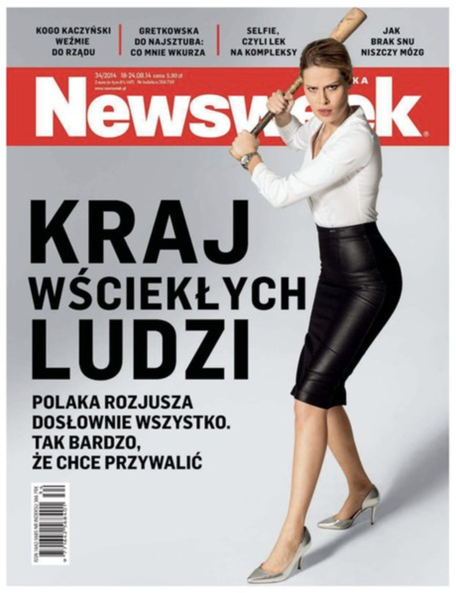
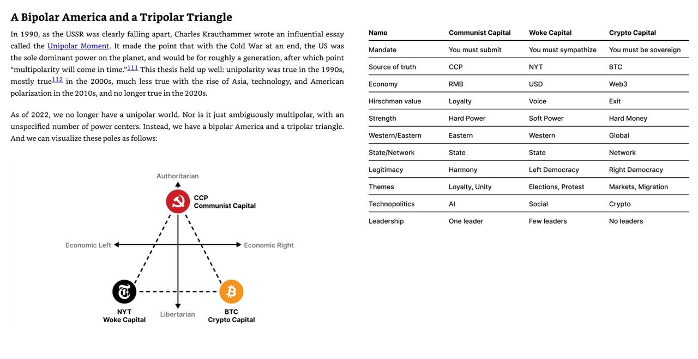
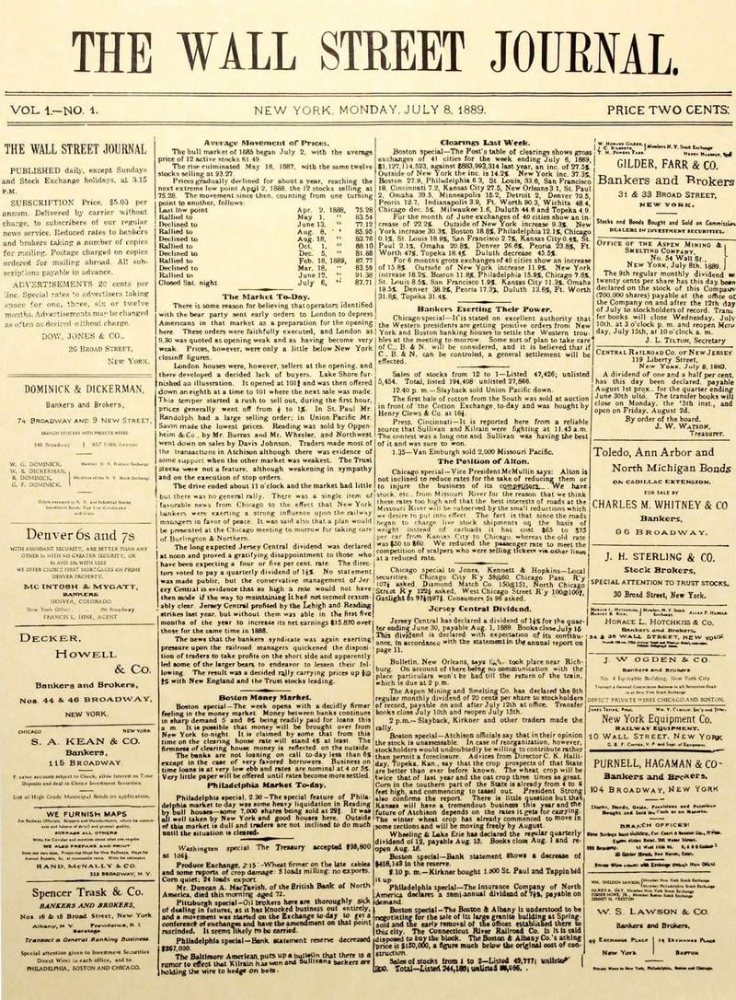

### 2022

W ciągu dnia granicę z Białorusią będzie monitorować 2000 kamer. Ich producentem i dostawcą podsystemu IT do obsługi jest chińska firma Hikvision, znana z dostarczania rozwiązań do inwigilacji Ujgurów. Kamery zakazane są w 🇺🇸 i być może wkrótce w UK.

---

  

---

  

  

---

### 2021

> European Central Bank policy makers have agreed to raise their inflation goal to 2% and allow room to overshoot it when needed.

---

Oficjalnie: KONIEC PRYWATNOŚCI. Unia Europejska zatwierdza masową inwigilację

Parlament Europejski zatwierdził tymczasowe rozporządzenie, które kończy z prywatnością. Służby będą miały dostęp do wszystkich prywatnych korespondencji cyfrowych – od e-maili po komunikatory internetowe.
Oficjalnie UE wprowadza takie prawo, by skuteczniej chronić przed wykorzystywaniem seksualnym dzieci.
Przepisy oficjalnie obowiązywać będą przez maksymalnie trzy lata. Mogą też obowiązywać krócej, jeżeli w międzyczasie Rada i Parlament osiągną porozumienie w sprawie nowych stałych przepisów o walce ze znęcaniem się nad dziećmi w internecie.
Parlament Europejski poparł te rozwiązania 537 głosami za (m.in. wszyscy z PiS), 133 przeciw i 24 wstrzymującymi się. Rozporządzenie musi zostać zatwierdzone przez Radę, a następnie będzie opublikowane w Dzienniku Urzędowym Unii Europejskiej. Wejdzie w życie trzeciego dnia po publikacji.

Totalitaryści robią to pod płaszczykiem szlachetnej idei walki z dziecięcą pornografią. Zamiast jednak zintensyfikować działania uderzające w faktycznych przestępców, wprowadzać służby w kręgi związane z pedofilami i dziecięcą pornografią, zreformować sądy, by przyspieszyć procesy i surowo karać dewiantów, nie stosować taryfy ulgowej dla wysoko postawionych szych, UE przyznaje sobie możliwość kontrolowania wszystkich prywatnych wiadomości.
Weryfikowane mają być także treści w teorii chronione szyfrowaniem end-to-end. Twórcy programów będą musieli stworzyć specjalne „luki”, by służby miały dostęp do wiadomości.
Oczywiście nikt nie powinien mieć wątpliwości, że uprawnienia te zostaną wykorzystane nie tylko do ścigania pedofilii. 
Nowe rozporządzenie uderza w fundament pierwotnych wartości europejskich, jak wolność słowa czy ochrona prywatności.

---

### 2020

  

---

> Presalariat

Zdaniem Hussona intensywna dyskusja na temat nieuchronnej automatyzacji gospodarki to przygotowanie pola do ostatecznego uderzenia w tzw. salariat. Czyli ciągle obowiązujący (choć osłabiony) model pracy opierający się na stałej umowie i realnie istniejącym prawie pracy albo związkach zawodowych. Tymczasem zwolennicy UBI domagają się wejścia w epokę cyfrowego postsalariatu. Mówią, że tak musi wyglądać nasza przyszłość i że nie ma innego wyjścia.

__W praktyce nie będzie to jednak oznaczało postępu, lecz regres. To znaczy powrót do XIX-wiecznych relacji pracy. Czyli do czasów presalariatu. W XXI w. zwanego gospodarką fuszki superelastycznego modelu 24-godzinnej gotowości do podjęcia pracy.__ – Postępowym zwolennikom wystarczającego lub godziwego dochodu w wysokości 1 tys. euro grozi, że posłużą za pożytecznych idiotów przy instalowaniu powszechnego dochodu w faktycznej wysokości 400 euro. Do którego trzeba sobie będzie nieustannie dorabiać, by zachować godność – przestrzega Husson.

---

Last time gold hit 1800, rates were 4x as high as today, gold was nearly 3x SPX and 6x NASDAQ & weekly RSI on #XAUUSD was 86% vs 66% today. So if u think gold is "too expensive" think again.. did i mention the state of US deficits & brainpower at the WH then & now?

---

Covid-19 przyspieszył śmierć wolnego rynku jako motoru gospodarki- pisze Steen Jakobsen, Główny Ekonomista i CIO Saxo Banku w prognozie Saxo Banku na III kwartał 2020 r.

„Ludzie rodzą się z różnymi możliwościami. / Jeżeli są wolni, nie są równi. / A jeżeli są równi, nie są wolni”— Aleksander Sołżenicyn

Kiedy skończą się bodźce fiskalne, skutki dla rynków (i zatrudnienia) będą wyjątkowo negatywne.
W efekcie bezpośrednich i pośrednich kredytów, pakietów ratunkowych i dotacji, w wielu krajach poziom wydatków publicznych przekroczy 50% PKB. Interesy rządu znajdą posłuch w sektorze przedsiębiorstw, zostaną też wdrożone nowe regulacje mające na celu „ratowanie gospodarki i miejsc pracy” za pomocą pieniędzy podatników.
Nasza reakcja na kryzys wiąże się z jeszcze większym zagrożeniem niż wirus.
W efekcie gospodarczego szowinizmu i kapitalizmu państwowego istotnie ucierpi wzrost, zatrudnienie, tkanka społeczna i rynki. Takie podejście do walki z kryzysem związanym z Covid-19 to prosta droga do przyjęcia ograniczonej, prowincjonalnej, nostalgicznej narracji samowystarczalność poszczególnych krajów – to droga bez odwrotu.

---

<a href="./documents/july/great-reset-collapse-biggest-bubble.pdf" target="_blank">Debt reset</a>

---

### 1889

Giełda potrzebuje mediów. Wiedzieli o tym dobrze Charles Dow, Edward Jones i Charles Bergstresser zmieniając #TegoDnia 8 lipca 1889 r. skromny popołudniowy biuletyn w profesjonalną gazetę. Tak powstał The Wall Street Journal.

Początki najbardziej wpływowego na światową gospodarkę tytułu były raczej skromne. Dystrybucja jego poprzednika, Customers' Afternoon Letter, odbywała się metodą manualną. Inwestorom na Wall Street po prostu sprzedawano czterostronicową ulotkę w budynku amerykańskiej giełdy. Profesjonalne medium rozpoczęto budować wraz z uruchomieniem WSJ, wtedy też ruszył serwis informacyjny zapewniany za pomocą telegrafu. To na jej łamach po raz pierwszy opublikowano jeden z największych indeksów akcji spółek - Dow Jones Industrial Average w 1896 r.

Dziś gazeta wychodzi sześć razy w tygodniu, nakład utrzymuje się na poziomie ok 2,8 mln egzemplarzy wydania papierowego i 3 mln 200 tys. elektronicznych subskrypcji. W ciągu 126 lat jej dziennikarze trzydzieści sześć razy zdobywali Nagrodę Pulitzera, m.in. wnikliwe analizy zagrożeń związanych z szybkością rozwoju chińskiej gospodarki. Za stworzenie niezależnego, odważnego tytułu odpowiada Clarence W. Barron, który kupił WSJ w 1903 r. i aż do swej śmierci w 1928 r. odpowiadał za jego profesjonalizm.

Obecnie The Wall Street Journal wydawany jest przez Dow Jones & Company należącą do grupy News Corp Ruperta Murdocha.

  

### 1824

W Rożnowie urodził się Włodzimierz Bonawentura Krzyżanowski - generał polski i amerykański, a także polityk. Kształcił się w gimnazjum imienia św. Marii Magdaleny w Poznaniu.
Wziął czynny udział w antypruskim powstaniu w 1846 roku. Po klęsce wyemigrował z Polski by uniknąć aresztowania za działalność polityczną. Od 1847 roku przebywał w USA, gdzie nauczył się języka oraz trudnił się ciężkimi pracami fizycznymi. Po pewnym czasie zdobył kwalifikacje geodety i posadę planisty przy rozbudowie linii kolejowych w Wirginii. Założył rodzinę. Był generałem armii Północy w czasie wojny secesyjnej. Zorganizował 58 Pułk Strzelców Nowojorskich (Legion Polski). Był członkiem Komitetu Centralnego, który wspierał Powstańców Styczniowych. W 1872 roku został agentem Departamentu Skarbu odpowiedzialnym za ściganie przemytników i kontrolę pracy funkcjonariuszy komór celnych w rejonie Nowego Orleanu. Rok później został mianowany specjalnym agentem 15. Obszaru Celnego. W 1874 roku zwolniono go ze służby bez podania powodu. W 1878 roku w Waszyngtonie został dyrektorem w Departamencie Skarbu. Pod koniec życia wrócił do Nowego Jorku, gdzie spisał swoje wojenne wspomnienia.
Zmarł w 1887 roku w Nowym Jorku. Został pochowany na cmentarzu Greenwood w Brooklynie. 50 lat później jego szczątki zostały przetransportowane z wojskowymi honorami na Narodowy Cmentarz w Arlington.

  

### 1659

W czasie wojny polsko-moskiewskiej miała miejsce bitwa pod Konotopem zwana też bitwą sosnowską. Liczaca 40 tysięcy żołnierzy armia polsko-tatarsko-kozacka pod wodzą hetmana kozackiego Iwana Wyhowskiego rozbiła 55 tysięczne wojska carskie dowodzone przez Alieksieja Trubeckiego.Do pokonania Rosjan wykorzystano ich nieuwagę. Trubecki na wieść o nadciągających Polakach,Tatarach i Kozakach zdecydował się przerwać oblężenie miasta i przerzucić swoje wojska za rzekę Sosnówkę (stąd druga nazwa) ,aby móc tam rozprawić się z wrogiem.
Hetman kozacki wykorzystał sposobność i uderzył na most. Kozacy, wraz z Polakami, po zdobyciu przeprawy zniszczyli most, odcinając znaczne siły moskiewskie. W tym samym czasie Tatarzy wiązali resztę sił wroga. Odcięte wojska carskie zostały rozbite. Reszta armii moskiewskiej, nie mogąc przyjść z pomocą, wycofała się.

  

### 1331

Krzyżacy i Czesi ustalili plan wspólnego zbrojnego najazdu na Polskę. Porozumienie, które krzyżaccy posłowie zawarli z czeskim królem Janem Luksemburskim zakładało zaatakowanie Wielkopolski jeszcze we wrześniu tego samego roku. Nic z tych planów jednak nie wyszło, ponieważ Czesi spóźnili się na umówione z Krzyżakami pod Kaliszem spotkanie, a dodatkowo w drodze powrotnej zostali pobici przez wojska króla Wladyslawa Łokietka.

---

<a href="https://github.com/TomaszWaszczyk/historia.waszczyk.com/edit/master/src/content/july-8.md" target="_blank">Edytuj tę stronę dzieląc się własnymi notatkami!</a>
