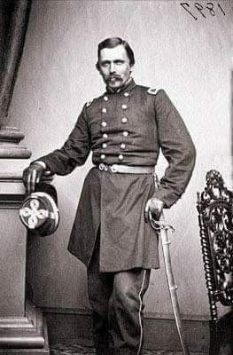
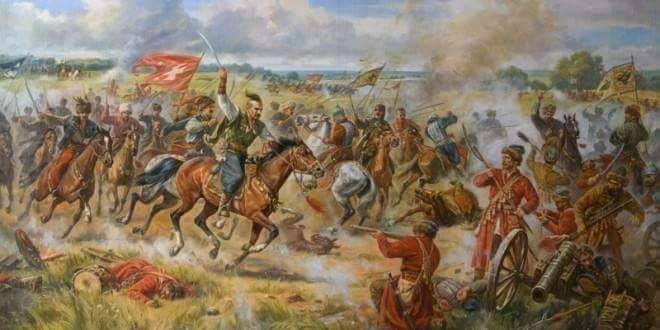

### 2020

  

---

> Presalariat

Zdaniem Hussona intensywna dyskusja na temat nieuchronnej automatyzacji gospodarki to przygotowanie pola do ostatecznego uderzenia w tzw. salariat. Czyli ciągle obowiązujący (choć osłabiony) model pracy opierający się na stałej umowie i realnie istniejącym prawie pracy albo związkach zawodowych. Tymczasem zwolennicy UBI domagają się wejścia w epokę cyfrowego postsalariatu. Mówią, że tak musi wyglądać nasza przyszłość i że nie ma innego wyjścia.

__W praktyce nie będzie to jednak oznaczało postępu, lecz regres. To znaczy powrót do XIX-wiecznych relacji pracy. Czyli do czasów presalariatu. W XXI w. zwanego gospodarką fuszki superelastycznego modelu 24-godzinnej gotowości do podjęcia pracy.__ – Postępowym zwolennikom wystarczającego lub godziwego dochodu w wysokości 1 tys. euro grozi, że posłużą za pożytecznych idiotów przy instalowaniu powszechnego dochodu w faktycznej wysokości 400 euro. Do którego trzeba sobie będzie nieustannie dorabiać, by zachować godność – przestrzega Husson.

---

Last time gold hit 1800, rates were 4x as high as today, gold was nearly 3x SPX and 6x NASDAQ & weekly RSI on #XAUUSD was 86% vs 66% today. So if u think gold is "too expensive" think again.. did i mention the state of US deficits & brainpower at the WH then & now?

---

Covid-19 przyspieszył śmierć wolnego rynku jako motoru gospodarki- pisze Steen Jakobsen, Główny Ekonomista i CIO Saxo Banku w prognozie Saxo Banku na III kwartał 2020 r.

„Ludzie rodzą się z różnymi możliwościami. / Jeżeli są wolni, nie są równi. / A jeżeli są równi, nie są wolni”— Aleksander Sołżenicyn

Kiedy skończą się bodźce fiskalne, skutki dla rynków (i zatrudnienia) będą wyjątkowo negatywne.
W efekcie bezpośrednich i pośrednich kredytów, pakietów ratunkowych i dotacji, w wielu krajach poziom wydatków publicznych przekroczy 50% PKB. Interesy rządu znajdą posłuch w sektorze przedsiębiorstw, zostaną też wdrożone nowe regulacje mające na celu „ratowanie gospodarki i miejsc pracy” za pomocą pieniędzy podatników.
Nasza reakcja na kryzys wiąże się z jeszcze większym zagrożeniem niż wirus.
W efekcie gospodarczego szowinizmu i kapitalizmu państwowego istotnie ucierpi wzrost, zatrudnienie, tkanka społeczna i rynki. Takie podejście do walki z kryzysem związanym z Covid-19 to prosta droga do przyjęcia ograniczonej, prowincjonalnej, nostalgicznej narracji samowystarczalność poszczególnych krajów – to droga bez odwrotu.

---

<a href="./documents/july/great-reset-collapse-biggest-bubble.pdf" target="_blank">Debt reset</a>

---

### 1824

W Rożnowie urodził się Włodzimierz Bonawentura Krzyżanowski - generał polski i amerykański, a także polityk. Kształcił się w gimnazjum imienia św. Marii Magdaleny w Poznaniu.
Wziął czynny udział w antypruskim powstaniu w 1846 roku. Po klęsce wyemigrował z Polski by uniknąć aresztowania za działalność polityczną. Od 1847 roku przebywał w USA, gdzie nauczył się języka oraz trudnił się ciężkimi pracami fizycznymi. Po pewnym czasie zdobył kwalifikacje geodety i posadę planisty przy rozbudowie linii kolejowych w Wirginii. Założył rodzinę. Był generałem armii Północy w czasie wojny secesyjnej. Zorganizował 58 Pułk Strzelców Nowojorskich (Legion Polski). Był członkiem Komitetu Centralnego, który wspierał Powstańców Styczniowych. W 1872 roku został agentem Departamentu Skarbu odpowiedzialnym za ściganie przemytników i kontrolę pracy funkcjonariuszy komór celnych w rejonie Nowego Orleanu. Rok później został mianowany specjalnym agentem 15. Obszaru Celnego. W 1874 roku zwolniono go ze służby bez podania powodu. W 1878 roku w Waszyngtonie został dyrektorem w Departamencie Skarbu. Pod koniec życia wrócił do Nowego Jorku, gdzie spisał swoje wojenne wspomnienia.
Zmarł w 1887 roku w Nowym Jorku. Został pochowany na cmentarzu Greenwood w Brooklynie. 50 lat później jego szczątki zostały przetransportowane z wojskowymi honorami na Narodowy Cmentarz w Arlington.

  

### 1659

W czasie wojny polsko-moskiewskiej miała miejsce bitwa pod Konotopem zwana też bitwą sosnowską. Liczaca 40 tysięcy żołnierzy armia polsko-tatarsko-kozacka pod wodzą hetmana kozackiego Iwana Wyhowskiego rozbiła 55 tysięczne wojska carskie dowodzone przez Alieksieja Trubeckiego.Do pokonania Rosjan wykorzystano ich nieuwagę. Trubecki na wieść o nadciągających Polakach,Tatarach i Kozakach zdecydował się przerwać oblężenie miasta i przerzucić swoje wojska za rzekę Sosnówkę (stąd druga nazwa) ,aby móc tam rozprawić się z wrogiem.
Hetman kozacki wykorzystał sposobność i uderzył na most. Kozacy, wraz z Polakami, po zdobyciu przeprawy zniszczyli most, odcinając znaczne siły moskiewskie. W tym samym czasie Tatarzy wiązali resztę sił wroga. Odcięte wojska carskie zostały rozbite. Reszta armii moskiewskiej, nie mogąc przyjść z pomocą, wycofała się.

  

### 1331

Krzyżacy i Czesi ustalili plan wspólnego zbrojnego najazdu na Polskę. Porozumienie, które krzyżaccy posłowie zawarli z czeskim królem Janem Luksemburskim zakładało zaatakowanie Wielkopolski jeszcze we wrześniu tego samego roku. Nic z tych planów jednak nie wyszło, ponieważ Czesi spóźnili się na umówione z Krzyżakami pod Kaliszem spotkanie, a dodatkowo w drodze powrotnej zostali pobici przez wojska króla Wladyslawa Łokietka.

---

<a href="https://github.com/TomaszWaszczyk/historia.waszczyk.com/edit/master/src/content/july-8.md" target="_blank">Edytuj tę stronę dzieląc się własnymi notatkami!</a>
