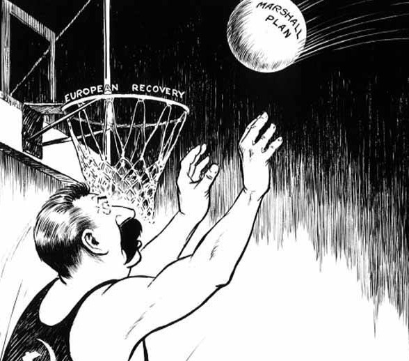
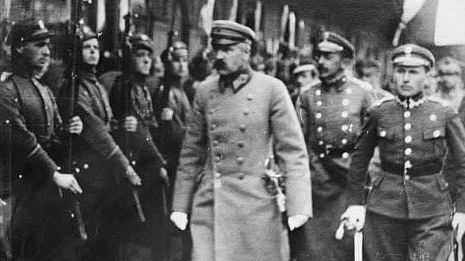

### 2021

<video width="640" height="480" controls>
  <source src="./movies/july/elitapolska.mp4" type="video/mp4">
Your browser does not support the video tag.
</video>

### 2020

Komunikat brzmi tak:

> "NBP wspiera walkę z kryzysem. W tym celu m.in. skupuje obligacje z rynku. Już uruchomił 100 mld zł, a z wyliczeń ekonomistów Pekao wynika, że może wydać kolejne 33-50 mld zł. Skala działania jest porównywalna z tym, co robi Europejski Bank Centralny".

A prawda jest taka, że NBP nie tylko nie pomaga gospodarce, lecz ją pogrąża, osłabia polską walutę, a zwłaszcza osłabia podatników, którym kradnie siłę nabywczą. "Uruchomił" znaczy się dodał długu, czyli paliwa inflacji opodatkowując Polaków, żeby im przy pomocy tych podatków pomagać. Rośnie dług, słabnie pieniądz, ratuje się upadające firmy a pogrąża takie, które muszą tę karuzelę absurdu finansować.

### 1947

  

Polska pod naciskiem ZSRS odrzuciła propozycję udziału w Planie Marshalla

Plan Marshalla, czyli program odbudowy gospodarczej Europy po II wojnie światowej, ogłoszony został w czerwcu 1947 roku przez szefa Departamentu Stanu Stanów Zjednoczonych, gen. G.C. Marshalla (stąd nazwa). Podczas jego realizacji w latach 1948-1952 Stany Zjednoczone udzieliły krajom europejskim kredytów (często umarzanych) w wysokości ok. 17 mld dolarów.

Niestety w powojennej Polsce odbudowa gospodarcza postępowała w cieniu komunizmu. Polska tak, jak inne kraje Europy Wschodniej naciskane przez Stalina, odrzuciła amerykański plan Marshalla. Decyzja ta definitywnie odcięła więzi z Europą, za której rozwojem gospodarczym PRL nie mogła nadążyć.

Największymi odbiorcami pomocy oferowanej w ramach planu były: Wielka Brytania (ok. 28%), Francja (ok. 21%), Włochy (ok. 11%) i Niemcy Zachodnie (ok. 10%). W 1949 r. kiedy RFN wchodziła w epokę „cudu gospodarczego”, Polska stanęła u progu kolejnych zbrojeń i rozbudowy przemysłu ciężkiego.

### 1917

Miał miejsce tzw "kryzys przysięgowy".
Chodziło o to, że Józef Piłsudski zabronił polskim legionistom składania przysięgi na wierność cesarzowi Niemiec i Austro-Węgier.W geście protestu Piłsudski wystąpił także z Rady Stanu,która przyjęła treść tej przysięgi. Większość wojsk polskich dostosowała się do apelu Piłsudskiego. Żołnierze ci zostali. później internowani przez Niemców obozach w Beniaminowie i Szczypiornie. Jedynie oddziały II Brygady dowodzonej przez gen. Józefa Hallera, która była słabo związana z Józefem Piłsudskim, złożyły wymaganą przez Austriaków i Niemców przysięgę.
Kryzys przysięgowy, w obliczu wybuchu w Rosji rewolucji, wykorzystał komendant legionów do zerwania współracy z Państwami Centralnymi.

  

> Pierwszą przysięgę składano 4 września 1914 roku - była w niej mowa o wierności Austrii, w 1917 roku chciano, dodać do przysięgo nie tylko wierność Austrii, ale i wierność Niemcom wciskając tam z nimi braterstwo i poddaństwo cesarzowi Wilhelmowi II. Inny świat, inne relacje. Gdyby w 1914 roku Piłsudski nie kombinował z Legionami to nasza siła militarna w 1918 roku byłaby jednak dużo niższa, a tak mieliśmy już doświadczone, ostrzelane w boju kadry.

---

<a href="https://github.com/TomaszWaszczyk/historia.waszczyk.com/edit/master/src/content/july-9.md" target="_blank">Edytuj tę stronę dzieląc się własnymi notatkami!</a>
