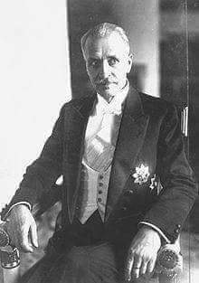
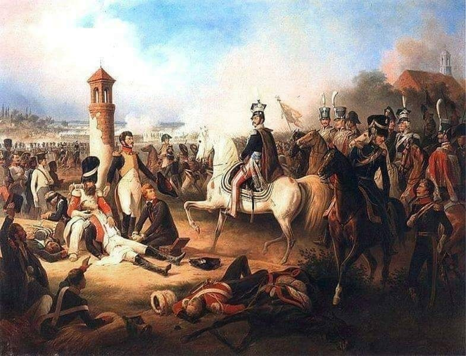
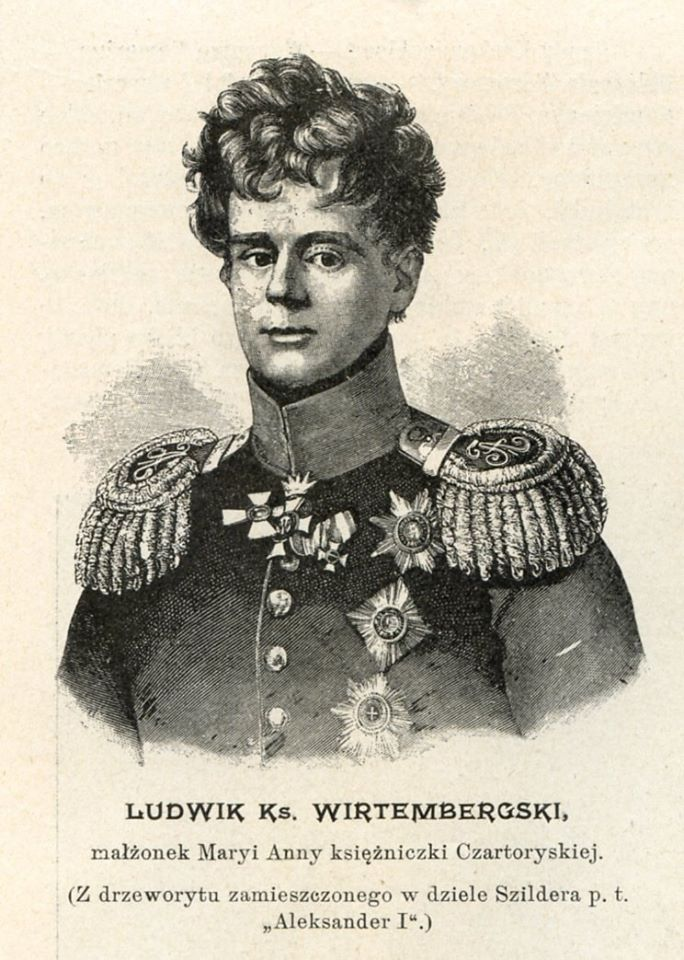
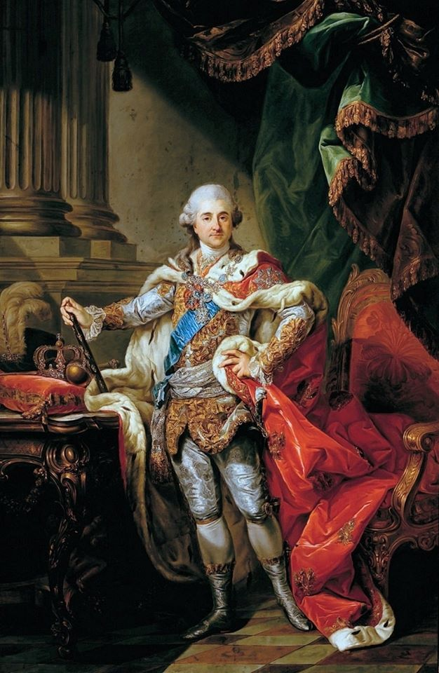
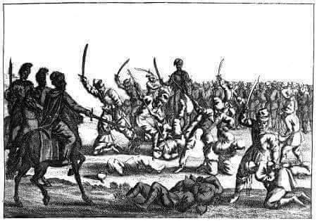
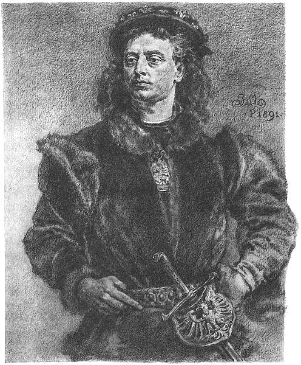

### 2020

June has been the BEST month for Bitcoin. Out of its 9 years, 2018 and 2013 were the only years when Bitcoin fell in June.

### 2009

"Pamiętacie wielką pandemię z lat 2009/2010? Nie pamiętacie? Ciekawe, bo trwała 14 miesięcy, pochłonęła 285 tysięcy ofiar śmiertelnych a WHO ogłosiła wtedy szósty, najwyższy stopień zagrożenia. Nikt jednak nie zamykał szkół, uniwersytetów ani firm, chociaż chorowali głównie młodzi ludzie.
Pandemia tzw. świńskiej grypy została ogłoszona przez WHO w czerwcu 2009 roku. Odpowiadał za nią wirus AH1N1, który łączył w sobie geny aż czterech różnych wirusów grypy - dwóch odmian świńskiej, jednej ptasiej i jednej ludzkiej. Do mutacji doszło w Meksyku, u jakiegoś człowieka, który zaraził się wszystkimi czterema odmianami naraz. W jego komórkach doszło do wymiany materiału genetycznego między wirusami i w ten sposób powstał superwirus AH1N1.
Wyizolowano go w kwietniu 2009 roku w laboratorium w Kalifornii i WHO od razu ogłosiła alarm, a dwa miesiące później - stan pandemii. Spodziewano się zachorowań na skalę "hiszpanki", ponieważ AH1N1 był mutacją tak niespotykaną, że nie istniały przeciwciała, które mogły by go powstrzymać. Szybko jednak okazało się, że chorują głównie dzieci, młodzież i ludzie do 50 roku życia (identycznie jak w drugiej fali "hiszpanki"). Wyjaśnieniem tej zagadki było stężenie przeciwciał przeciwko innym wirusom grypy w krwi osób starszych. W jakiś sposób łączyły one siły, by zwalczać nowego wroga. Po prostu im więcej ktoś miał za sobą infekcji grypowych, tym bardziej był odporny.
Najciekawsze były jednak rekomendacje WHO i reakcje krajów dotkniętych pandemią. Uznano bowiem, że wirus rozprzestrzenia się tak szybko, że... nie ma sensu liczyć pojedynczych przypadków. Rejestrowano więc jedynie masowe zachorowania i zgony. Nie zostały zamknięte granice i szkoły, nie wprowadzono ograniczeń w poruszaniu się, a gospodarka funkcjonowała normalnie, chociaż chorowali głównie ludzie młodzi czyli uczący się lub pracujący.
Szczepionka na AH1N1 pojawiła się pół roku po ogłoszeniu pandemii, czyli w grudniu 2009 roku. Kupiło ją wiele krajów (Polska akurat nie) za ogromne sumy, rzędu 0,5 mld dolarów lub więcej. Zdążono zaszczepić od 4 do 10% populacji (w Polsce 0%) gdy pandemia wygasła. Nie stało się to w wyniku szczepionek, a w sposób, który natura zna od milionów lat - populacja wytworzyła odporność. WHO odwołała alarm w sierpniu 2010 roku, czyli po 14 miesiącach.
A teraz najciekawsze. Gdy wirus przestał zarażać, na WHO posypały się gromy ze strony rządów za... przesadną reakcję i panikarstwo z ogłaszaniem stanu pandemii. Nic dziwnego - wydano miliardy dolarów na szczepionkę, której 90-96% dawek trzeba było zutylizować.
Koronawirus w przeciwieństwie do AH1N1 atakuje głównie ludzi starszych, którzy mogą się łatwiej odizolować bez niszczenia podstaw swojej egzystencji, ponieważ mają stałe źródło dochodu - emerytury. Tymczasem rządy zdecydowały się wysłać na przymusowe bezrobocie miliony młodych ludzi. Co takiego zmieniło się w głowach rządzących przez ostatnie 10 lat? I co takiego zmieniło się w naszych głowach?" Andrzej Fedorowicz

### 1926

"Wiadomość o wyborze Piłsudskiego na prezydenta zastała mnie w Warszawie i
cieszyłem się z tego wespół z innymi piłsudczykami. Jednak tego samego dnia, około północy, gdy udałem się na spoczynek, otrzymałem nagle z niemałym przerażeniem wiadomość telefoniczną od premiera Bartla, że
Piłsudski wyboru nie przyjął, a mnie zaproponował jako swego kandydata.
Nocy tej oczu nie zmrużyłem, zestawiając swój bilans życiowy.
Czułem, że zakreślona konstytucją
marcową rola prezydenta nie zdoła mi dać żadnego zadowolenia. Uważałem się przy tym za najmniej powołanego do zajmowania stanowiska związanego głównie z reprezentacją. Ja, którego życie całe było pełne wydarzeń i niezwykle czynne, który od blisko 30 lat z wielką energią i dużym powodzeniem oddawałem się pracy naukowo twórczej, miałem nagle z tym wszystkim zerwać.
Nazajutrz rano, po koszmarnej nocy, opanowałem się już xupełnie; byłem przygotowany na wszystko, a przyjęcie wyboru w tych warunkach uważałem za
obowiązek wobec narodu. Wiedziałem, że nie tylko nie będę przeszkadzał w pracy Piłsudskiemu, ale przeciwnie, będę
się starał być mu możliwie pomocnym".
Tak o rezygnacji Józefa Piłsudskiego z funkcji prezydenta Rzeczpospolitej Polskiej oraz o swojej kandydaturze mówił Ignacy Mościcki, który 1 czerwca 1926 roku przejął obowiązki głowy państwa.

  

### 1809

Okupujące do tego czasu Warszawę wojska austriackie pod dowództwem feldmarszałka lejtenanta Ludwiga von Mondeta wobec zdecydowanej ofensywy nacierających od strony Łomży oddziałów generała dywizji Józefa Zajączka ,a także idących od strony Wielkopolski oddziałów generała Jana Henryka Dąbrowskiego zmuszone zostały do ewakuowania się ze stolicy.Jeszcze tego samego dnia informację o tym fakcie potwierdził major Feeder podając tę wiadomość dowódcy załogi przedmieścia praskiego majorowi Józefowi Hornowskiemu.
Dzień później Polacy wkroczyli do Warszawy.

  

### 1792

W czasie wojny polsko -rosyjskiej zdymisjonowany został wódz armii litewskiej generał lejtnant książę Ludwik Wirtemberski. Był zdrajcą, który pod pozorem ciężkiej choroby zaniedbywał przygotowania do walki. Sprawa wyszła na jaw, gdy w okolicach Łomży w polskie ręce dostała się jego koresponencja z Prusakami, w której pisał, że symulujea on sam nie będzie stawiał oporu uderzającej na Rzeczpospolitą armii rosyjskiej. Próbując się zrehabilitować ozdrowiały książę ruszył od razu do swoich obowiązków względem korpusu litewskiego, jednak 1 czerwca 1792 r. został zdymisjonowany. Na wieść o jego zdradzie Maria Czartoryska przysłała mu list rozwodowy.

  

### 1765

Król Stanisław August Poniatowski powołał pierwszą na terenie Rzeczpospolitej Obojga Narodów komisję dobrego porządku. Była to Komisja Dobrego Porządku dla Starej i Nowej Warszawy. Do kompetencji tego organu, w skład którego wchodziło od 6 do 14 członków, najczęściej przedstawicieli szlachty należał nadzór nad finansami miejskimi, kontrola działalności cechów rzemieślniczych i gildii kupieckich. Ponadto decydowała ona o planowaniu przestrzennym ich zabudowy, numerowaniu domów, brukowaniu ulic, budowie kanałów.
Trzy lata później Sejm zdecydował o utworzeniu komisji dobrego porządku we wszystkich miastach królewskich Korony Królestwa Polskiego i Wielkiego Księstwa Litewskiego.

  

### 1652

Pod Batohem miała miejsce jedna z najtragiczniejszych bitew w historii polskiego oręża.
15 tysięczna armia polska dowodzona przez hetmana polnego Marcina Kalinowskiego przegrała z armią kozacko-tatarską Bohdana Chmielnickiego.
Po starciu Bohdan Chmielnicki wymordował wszystkich wziętych do niewoli jeńców.
Zabito 3,5 tysiąca jeńców wywodzących się głównie z polskiej inteligencji. Wśród
zgładzonych polskich żołnierzy byli m.in. syn hetmana Samuel Kalinowski, generał artylerii
Zygmunt Przyjemski oraz brat przyszłego króla
Polski rotmistrz Marek Sobieski.
Łącznie pod Batohem zginęło 8,5 tysiąca Polaków.

  

### 1496

Król Polski Jan I Olbracht wydał Statut Piotrkowski-dokument nadający szlachcie rozliczne przywileje. Stanowił on między innymi, że mieszczanie nie mogli obejmować urzędów i nabywać posiadłości gruntowych tak zwanym prawem ziemskim. Statut pozwalał szlachcie na wywożenie i sprowadzanie towarów bez cła, ustanawiał wolność spławu, a chłopom zabraniał opuszczania wsi, co w praktyce wyglądał tak, że wieś w ciągu roku mógł opuścić tylko jeden przedstawiciel rodziny chłopskiej, który chciał zmienić zawód i osiedlić się w mieście. Ponadto statut ten nadawał wojewodom prawo decydowania o cenach wyrobów rzemieślniczych.
Politycznym celem nadania szlachcie tych praw była próba zjednania sobie jej przez króla.

  

---

<a href="https://github.com/TomaszWaszczyk/historia.waszczyk.com/edit/master/src/content/june-1.md" target="_blank">Edytuj tę stronę dzieląc się własnymi notatkami!</a>
