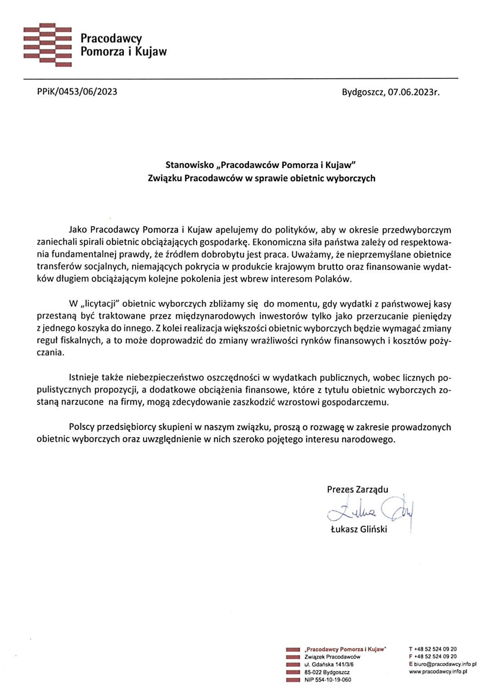
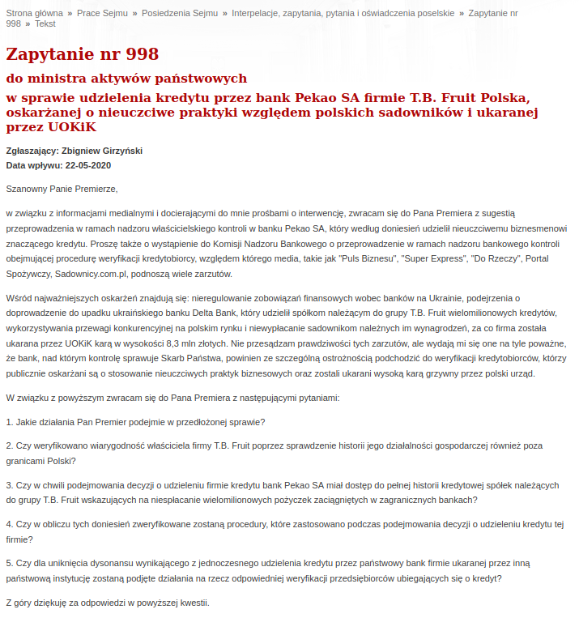
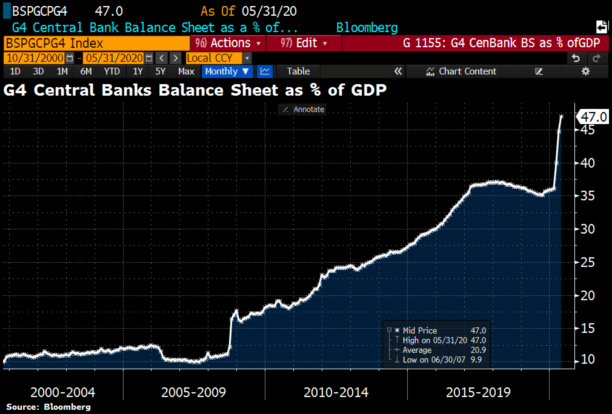
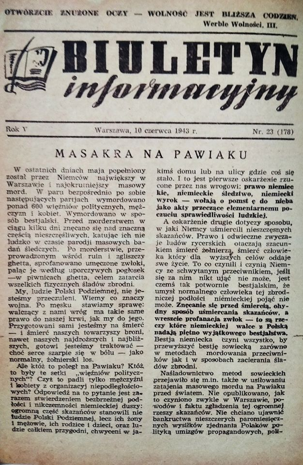
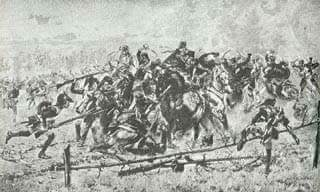

### 2023

Rząd chce zmienić deficyt na 2023

👉 Mieliśmy w tym roku zadłużyć się na 68 mld zł

👉 Po zmianie deficyt wyniesie 92 mld zł (6100zł na każdego pracującego obywatela nowego długu w 2023 - cały deficyt 92 mld zł)

  

### 2022

> “I fear Bitcoin is often used for illicit finance” - Treasury Secretary Janet Yellen

  

<video width="640" height="480" controls>
<source src="./movies/june/glapinskieurocent.mp4" type="video/mp4">
Your browser does not support the video tag.
</video>

### 2021

  

### 2020

"Bez uszczerbku dla obrony strategicznych celów". Talaga o możliwym wycofaniu z Niemiec części żołnierzy USA.

Niemiecka minister obrony Annegret Kramp-Karrenbauer oraz rzecznik rządu RFN Steffen Seibert odmówili zajęcia oficjalnego stanowiska w sprawie doniesień o wycofaniu amerykańskich wojsk z Niemiec. Stwierdzili zgodnie, że na razie są to jedynie prasowe spekulacje, natomiast Waszyngton żadnych oficjalnych informacji w tej sprawie nie przekazał.

- Warto zastanowić się, czy nie jest to przypadkiem (…) wypuszczenie specjalnie informacji, żeby osiągnąć jakieś cele polityczne, np. przymusić Niemcy do większych wydatków zbrojeniowych, większej spolegliwości odnośnie amerykańskiej polityki na świecie lub jeszcze paru innych ruchów, które byłyby korzystne dla administracji amerykańskiej - zauważa Andrzej Talaga.

---

<video width="640" height="480" controls>
<source src="./movies/june/jaroslawkredchorynawirus.mp4" type="video/mp4">
Your browser does not support the video tag.
</video>

---

  

---

  

<!--    -->

<!-- ### 2014 -->
<!-- Paulina Marnik Marnikowska w dniu ok. 10 czerwca 2014 powiedziała Paulinie żebym podwiózł Paulinę swoim samochodem oraz "jak to dobrze mieć faceta z samochodem"
 
Ludzie to zawistne kurwy, dopierdolić im trzeba ! ! ! Swoim Sukcesem ! ! ! -->

### 2018

  

### 1942

Pierwsza masowa ucieczka w historii obozu w Birkenau.

10 czerwca 1942 roku, ok. 50 polskich więźniów z karnej kompanii, pracujących przy budowie rowu melioracyjnego w Birkenau, wszczęło bunt. Więźniowie rzucili się do ucieczki. Tylko 9 udało się zbiec. W ramach zemsty esesmani zastrzelili dwudziestu polskich więźniów z karnej kompanii, a ponad trzystu zagazowali w komorze gazowej.

Foto: Obóz Birkenau.

  

### 1943

Artykuł "Masakra na Pawiaku", zamieszczony w 23 numerze Biuletynu Informacyjnego 10 czerwca 1943 roku.

  

### 1861

https://pl.wikipedia.org/wiki/Andrzej_Kazimierz_Potocki

### 1807

Rozrgrała się jedna z największych bitew napoleońskich- bitwa pod Lidzbarkiem Warmiński znana też jako bitwa pod Heilsbergiem .
56 tysięczna armia francuska pod wodzą Napoleona Bonaparte stanęła przeciwko 90 tysięcznej armii rosyjskiej generała Benningsena.
Bitwa ta była drugą w kolejności,w której wojskami francuskimi dowodził osobiście sam Napoleon. Francuzi atakowali reduty i szańce bronione przez sprzymierzone wojska rosyjskie i pruskie.
Bitwa pozostała nierozstrzygnięta, obie
strony poniosły ciężkie straty. Przyczyniła się jednak do zwycięstwa cesarza pod Frydlandem, które zmusiło cara Aleksandra I do podpisania traktatu pokojowego w Tylży.
Ciekawostką jest fakt, że na jednym z okolicznych pól miejscowi miłośnicy historii znaleźli w tym roku szczątki jednego z poległych w tej bitwie dragonów francuskich.

  

---

<a href="https://github.com/TomaszWaszczyk/historia.waszczyk.com/edit/master/src/content/june-10.md" target="_blank">Edytuj tę stronę dzieląc się własnymi notatkami!</a>
