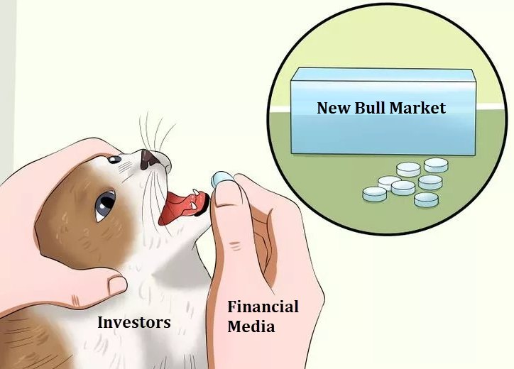
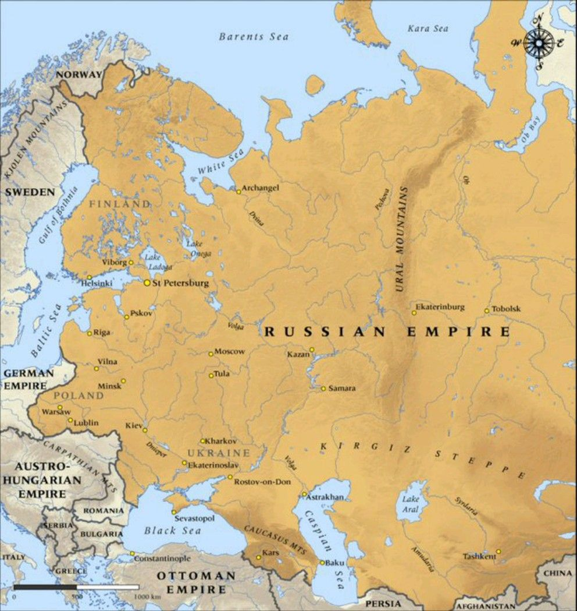
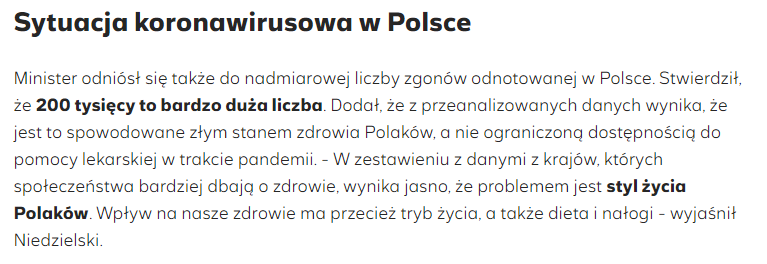
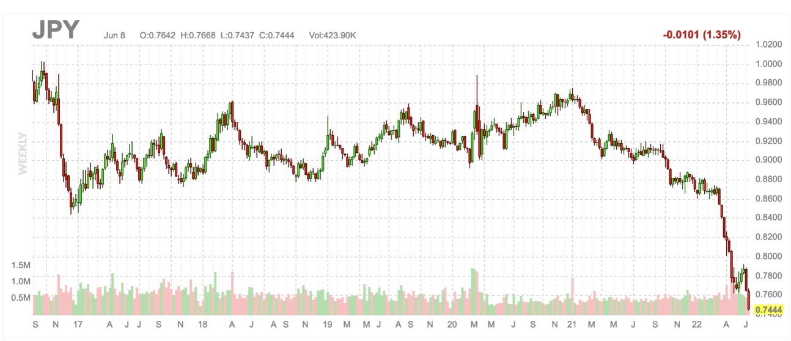

### 2023

~20000 euro kary za jednego, nieprzyjętego do Polski imigranta ekonomicznego 😳

45 euro wsparcia za jednego, przyjętego do Polski uchodźcę wojennego z Ukrainy 😥

Aktualna kondycja odpowiedzialnych za zarządzanie Unią Europejską w pigułce🤦‍♂️

<video width="640" height="480" controls>
<source src="./movies/june/tvn.mp4" type="video/mp4">
Your browser does not support the video tag.
</video>

<video width="640" height="480" controls>
<source src="./movies/june/tylko_matka_pewna_jest.mp4" type="video/mp4">
Your browser does not support the video tag.
</video>

---

  

  

  

---

### 2022

  

  

  

Oszustwo szkoleniowe:

  

Russia:

  

  

  

  

  

---

Olaf Scholz Arrives In Serbia To Coach Aleksandar Vučić On How To Be Pro-Russia ‘In A More Subtle And Sophisticated Way’

  

Hiszpania jednak nie przekaże Ukrainie Leopardów. Efekt telefonu z Berlina. Niemcy robią, co mogą, żeby uratować wizję Euro-Azji od Lizbony do Władywostoku, co czyni ich zagrożeniem dla wschodniej flanki NATO.

---

<video width="640" height="480" controls>
<source src="./movies/june/suskilikwidacja.mp4" type="video/mp4">
Your browser does not support the video tag.
</video>

---

### 2021

> Niemal 400 tys. zł – taki kredyt hipoteczny mogą wziąć dwie osoby, które otrzymują jedynie minimalne wynagrodzenie

  

### 2020

Współcześni totalitaryści różnią się od tych, których pamiętamy z XX wieku. Nie należą do jednej partii, nie głoszą oficjalnie jednej ideologii, nie noszą mundurów i nie mają wodza. Totalitaryzm w XXI wieku z zewnątrz wygląda zupełnie inaczej, forma jest inna, przyjemniejsza dla oka i nie budząca złych skojarzeń, ale treść - czyli kontrola życia jednostki przez państwo jest całkowicie przerażająca. Rozumiem, że słowo "totalitaryzm" jest mocne, ale niestety jest ono zupełnie adekwatne do tego co proponuje nam państwo w 2020 roku. Spójrzmy na najprostszą definicję totalitaryzmu. Jest to ustrój w którym państwo w pełni kontroluje społeczeństwo i stara się nadzorować wszystkie aspekty życia publicznego i prywatnego na tyle, na ile jest to możliwe.

A teraz zobaczmy jak wygląda nasze życia i jak będzie wyglądać w niedalekiej przyszłości.

Państwo od wielu już lat domaga się informacji o naszych dochodach. Mamy obowiązek regularnie składać deklarację podatkowe, musimy nawet informować urzędników o pożyczkach czy darowiznach w ramach najbliższej rodziny. Przekazujesz pieniądze żonie (w przypadku rozdzielności), dziecku, rodzeństwu czy rodzicom? Musisz zgłosić to urzędnikom, którzy są bardzo zainteresowani tym, ile pieniędzy mąż przekazuje żonie, albo matka córce. Na szczęście do tej pory ludzie dawali radę ukryć część swoich poczynań dzięki gotówce. Nie bez powodu możliwość używania gotówki jest solą w oku XXI wiecznych totalitarystów.

Jeżeli zlikwidowana zostanie gotówka, państwo będzie dokładnie wiedziało ile każdy człowiek ma pieniędzy oraz co z nimi robi. Będzie też mogło odciąć go od jego pieniędzy, pod byle pretekstem. Już dzisiaj Zbigniew Ziobro wyszedł z postulatem prewencyjnego konfiskowania majątku. W przypadku likwidacji gotówki, taki manewr będzie jeszcze prostszy. W konsekwencji, państwo przejmie całkowitą kontrolę nad naszym majątkiem. Oczywiście nikt nie powie, że celem jest kontrola wszystkich przez państwo. Celem będzie uszczelnianie systemu podatkowego oraz walka z praniem pieniędzy, co ładnie zgra się z zapowiadanym przez coraz większą liczbę ekonomistów wysokim i progresywnym opodatkowaniem dochodów i majątku. W końcu z czegoś trzeba będzie sfinansować rosnącą po kryzysie rolę państwa.
Finansowy aspekt naszego życia będzie niedługo pod całkowitą kontrolą państwa.

Ograniczana jest też cały czas wolność słowa. Media społecznościowe już teraz wprowadziły cenzurę. Mamy listę zakazanych słów, sformułowań czy tematów. Największe wyszukiwarki wycinają niektóre strony i nie pokazują ich w wynikach wyszukiwania. Ostatnio nawet Allegro zabroniło sprzedaży książki Rafała Ziemkiewicza, ponieważ według jakiejś promującej totalitaryzm organizacji, jest ona antysemicka. To samo Allegro nie widzi z kolei problemu ze sprzedażą "Mein Kampf" Hitlera. Wolność słowa formalnie jeszcze istnieje, ale żeby z niej korzystać, trzeba się bardzo pilnować, aby jakiemuś zakompleksionemu przedstawicielowi którejś wrażliwej mniejszości nie powiedzieć kilku słów prawdy.

Kilka tygodni temu przez Sejm przeszła ustawa nakazująca kierowcom ciężarówek zainstalowanie śledzącej ich aplikacji. Oczywiście rząd nie mówi, że chodzi o inwigilację a o ułatwienie w poborze opłat za przejazd. Ale za jakiś czas ktoś na pewno pomyśli, że taka aplikacja przydałaby się pozostałym kierowcom. Po co stać na bramkach na autostradzie jak można mieć aplikację z GPS? Potem ktoś inny zauważy, że można przecież zrezygnować z fotoradarów, skoro policja jest w stanie ustalać prędkość samochodów poprzez dane z aplikacji. Celem oczywiście nie będzie inwigilacja tylko bezpieczeństwo. Przypadkiem tylko rząd będzie wiedział kto, kiedy i gdzie jechał swoim samochodem.
W niektórych państwach na ulicach już pojawiają się kamery rozpoznające twarze przechodniów. Celem oczywiście jest bezpieczeństwo, a nie śledzenie każdego przez policję. Skutkiem ubocznym będzie tylko to, że każdy będzie śledzony.

Od dawna mówiłem, że współczesna technologia może być wykorzystana do totalnej inwigilacji, znanej wcześniej tylko z opowiadań fantastycznych. Ale stało się to już naszą rzeczywistością. Tu się robi Orwell z Nowym Wspaniałym Światem w jednym. Połączenie państwa totalitarnego z nowoczesną technologią, obserwowane już w Chinach, staje się powoli obecne również w Polsce. Nasza władza od kilku tygodni co chwilę próbuje nam wcisnąć śledzącą rządową aplikację ProteGo Safe, która ma jej posiadaczom dawać najróżniejsze przywileje w zamian za zgodę na inwigilację.

Tak będą gotowali tę żabę. Zawsze będą uzasadniali to względami bezpieczeństwa, sprawiedliwości społecznej, praworządności czy troską o zdrowie dzieci. Niepomni ostrzeżeń Benjamina Franklina ludzie dla pozorów tymczasowego bezpieczeństwa oddadzą swoją podstawową wolność.

Totalitaryzm nie będzie wprowadzany przez złowieszczo wyglądających szaleńców, nie powstanie nigdy "ustawa o masowej inwigilacji i zniewoleniu". Totalitaryzm przyjdzie po cichu. Będą go popierać naukowcy, ludzie kultury i celebryci. Będzie przyjęty przez społeczeństwo w warunkach totalnego zobojętnienia i niezainteresowania, a czasem niecierpliwego oczekiwania. Większość nawet nie zwróci na sprawę żadnej uwagi. Nie będzie to nawet element publicznej debaty. To się po prostu stanie, a tak naprawdę to już się po prostu dzieje.

---

  

---

### 1985

Agent polskiego wywiadu Marian Zacharski oraz trzech innych szpiegów wschodnioeuropejskich zostało wymienionych na 25 osób więzionych w krajach bloku wschodniego. Wymiany dokonano za pośrednictwem mecenasa Wolfganga Vogla na Moście Glienicke w Berlinie.

Most Glienicke na rzece Hawela łączy Poczdam z Berlinem, a do obalenia muru berlińskiego - stolicę NRD z Berlinem Zachodnim. Można by powiedzieć, most jak most, nie jego wina, że w 1939 r. wybuchła wojna, że w 1945 r. do Berlina wkroczyli Rosjanie, że miasto podzielono na strefy okupacyjne, wreszcie - że pod skrzydłami Związku Radzieckiego powstała Niemiecka Republika Demokratyczna. A jednak jest wyjątkowy. Bo nie o każdym moście zdobywcy Oscara kręcą filmy i nie na każdym moście trzy razy wymieniano szpiegów w czasach zimnej wojny.

Po raz pierwszy do wymiany doszło 10 lutego 1962 r. Stany Zjednoczone przekazały Rosjanom pułkownika Rudolfa Abla w zamian za pilota Francisa Gary’ego Powersa, aresztowanego po zestrzeleniu w 1960 r. nad Związkiem Radzieckim samolotu szpiegowskiego U-2. I na kolejne 23 lata zapanował spokój - aż do 11 czerwca 1985 r. Tego dnia Amerykanie odstawili na most Glienicke Polaka Mariana Zacharskiego oraz Alfreda Zehego, Alice Michelson i Penyu Kostadinowa - w zamian „odbierając” 23 agentów. Po raz ostatni most stał się świadkiem wojny nerwów rok później, 11 lutego 1986 r.: do Berlina Zachodniego przeszło trzech agentów oraz obrońca praw człowieka i więzień polityczny Natan Szaranski, do Berlina Wschodniego - Karl Koecher z czterema towarzyszami.

4 grudnia 1981 r., w poniedziałek po wprowadzeniu stanu wojennego w Polsce, za oceanem zapadł wyrok skazujący na dożywocie polskiego szpiega Mariana Zacharskiego. W więzieniu przesiedział 1444 dni. W tym czasie trwały negocjacje, które ostatecznie zakończyły się wymianą, a w które bardzo mocno zaangażowali się towarzysze ze Stasi - razem z Zacharskim do domu miało wrócić trzech agentów tajnej enerdowskiej policji. W zamian Amerykanie chcieli 25 ludzi skazanych za szpiegowanie dla CIA. W tej grupie byli: Leszek Chróst, Norbert Adamaschek, Jacek Jurzak, Bogdan Walewski i najsławniejszy z tej grupy Jerzy Pawłowski - szermierz i pięciokrotny medalista olimpijski. Kim byli? Co wiadomo o tej piątce?

O Leszku Chróście całkiem sporo, Instytut Pamięci Narodowej dysponuje nie tylko zdjęciami jego skrzynek kontaktowych, ale nawet filmem z zatrzymania. Działacz młodzieżowy, a później członek partii został zwerbowany do pracy na rzecz kontrwywiadu jako pracownik Centrali Handlu Zagranicznego „Metal-export” w 1960 r. - w hotelu MDM. I to mimo że przepisy zakazywały werbowania do szpiegowskiej roboty członków partii.

Krótko po werbunku wyjechał do pracy do Tajlandii. Tam najpewniej był typowany przez CIA do przewerbowania - i tak rzeczywiście się stało. W 1964 r. podczas trzeciego spotkania z pracownikami CIA w mieszkaniu jednego z nich, przedstawiającego się jako Mike. Chróst własnoręcznie podpisał zobowiązanie do współpracy (napisane na maszynie i po angielsku), a jego oficer prowadzący powiedział mu, że będzie dostawał 200 dolarów co miesiąc na amerykańskie konto bankowe.

Chrósta przeszkolono ze szpiegowskiej roboty. Łączność z CIA miał utrzymywać poprzez osobiste kontakty, martwe skrzynki, korespondencję - tajnopisem, dostał też odbiornik radiowy do odbioru zakodowanych audycji. Amerykanie jednak nie przewidzieli, że Chróst - który przyjął pseudonim Sikorski - wystraszy się i zerwie współpracę - w 1969 r. polski sąd skazał na karę śmierci Jerzego Strawę, również pracownika Metalexportu. Oczywiście za szpiegostwo.

CIA o Chrósta upomniała się w 1976 r. w Finlandii, bo tam do pracy skierowała go warszawska centrala. Oficer przedstawiający się jako Henry kusił Polaka, mówiąc mu, że na jego koncie w Stanach Zjednoczonych jest już 10 tys. dolarów, suma na owe czasy w Polsce astronomiczna. Miano mu też podnieść „pensję” - do 350 dolarów miesięcznie. Warunek był jeden: przed powrotem do szpiegowskiej roboty Chróst musiał przejść badanie wariografem. Czy nie zdradził. Nie zdradził, ale nowe raporty i szyfrowane informacje podpisywał jako Jan Ski.

Wpadł najprawdopodobniej przez nieostrożność sekretarki amerykańskiej ambasady w Warszawie i pracownika wywiadu. Listy do Chrósta adresowała ta sama osoba, tym samym atramentem i na tym samym papierze kopertowym. Ani Chróst, ani Amerykanie najwyraźniej nie wzięli pod uwagę tego, że korespondencja byłego już pracownika podatnej na wpływy różnych wywiadów Centrali Handlu Zagranicznego może zostać skontrolowana przez biuro „W” Ministerstwa Spraw Wewnętrznych. Po otwarciu jednego z listów do Chrósta okazało się, że to tajnopis zaczynający się słowami:

Drogi przyjacielu, nasze serdeczne pozdrowienia dla Pana. Mamy nadzieję, że u pana i w rodzinie jest w porządku. Umieściliśmy dla pana paczkę na obiekcie »Syrenka«

- jak się okazało, był to kamień przypominający cegłę (w liście podano i jego współrzędne, i wymiary), znajdujący się przy pomniku warszawskiej Syrenki.

Aresztowano go w drodze do pracy 29 czerwca 1979 r. - tuż przed wpół do ósmej rano. Chróst przyznał się praktycznie od razu, twierdząc, że do współpracy z CIA zmuszono go szantażem. Amerykanie mieli pokazać jego zdjęcia z prostytutką, zrobione w Bangkoku. Po rocznym śledztwie wojskowy sąd w Warszawie skazał go na 25 lat więzienia. Na wolność czekał pięć lat.

Jacek Jurzak i Norbert Adamaschek poznali się na studiach, ale początkowo wydawało się, że po obronie dyplomów ich drogi się rozeszły. Urodzony w 1944 r. Adamaschek, jak wielu Ślązaków, wybrał emigrację i wyjechał w 1976 r. do Niemiec zachodnich, gdzie zaczął pracować dla CIA. Tak się złożyło, że Jurzak, który w Polsce robił błyskotliwą karierę konstruktora i kierowcy rajdowego, został zwerbowany przez I Departament MSW. W 1980 r. odwiedził Stany Zjednoczone, na miesiąc przed wybuchem sierpniowych strajków. Któregoś dnia - decyzją centrali w Langley - stary kolega przypomniał sobie o przyjacielu ze studiów. Adamaschek dotarł do Jurzaka i zaproponował mu współpracę z Agencją. Miał informować o transporcie, obronie i sytuacji społeczno-ekonomicznej w Polsce. Jurzak, który specjalne szkolenie CIA przeszedł w austriackim Salzburgu, nie miał pojęcia, że wyrażając zgodę, tak naprawdę wydaje na siebie wyrok - źle zabezpieczony, właściwie nieochraniany przez nowych szefów, miał być żywą zasłoną dymną dla kogoś znacznie cenniejszego.

O skazaniu dwóch agentów 30 maja 1984 r. doniosła agencja UPI w depeszy z Warszawy, powołującej się na relację Polskiej Agencji Prasowej. Dwóch kolegów ze studiów skazano na 15 i 12 lat więzienia. Proces odbył się za zamkniętymi drzwiami, ale Telewizja Polska pokazała oskarżonych podczas odczytywania im sentencji wyroku. Tę samą datę noszą informacja Departamentu II MSW dotycząca cech korespondencji kierowanej z ośrodków CIA do agentów wywiadu działających na terenie Polski oraz Departamentu II MSW - dotycząca cech korespondencji z zawartością tajnopisów kierowanej przez agenturę CIA w Polsce na skrzynki korespondencyjne za granicą. Dzisiaj są w posiadaniu Instytutu Pamięci Narodowej.

Jako kolejny szedł mostem Glienicke na zachodnią stronę rzeki Haweli Bogdan Walewski, zwerbowany przez CIA w 1962 r., ale współpracujący z obcymi służbami wywiadowczymi od 1959 r. Walewski został zwerbowany w Wietnamie przez Kanadyjczyka, pułkownika Satie, a ten przekazał go CIA. „Bob”, bo tak podpisywał swoje raporty Walewski, po przeszkoleniu przekazywał Agencji między innymi informacje dotyczące polskiego personelu dyplomatycznego. Tylko w latach 1964-1972 dostał od CIA 16 tys. dolarów.

Zbigniew Siemiątkowski w swojej książce „Wywiad a władza. Wywiad cywilny w systemie sprawowania władzy politycznej PRL” napisał, że po upadku Sajgonu 30 kwietnia 1975 r. do amerykańskiej ambasady weszła specjalna grupa oficerów polskiego kontrwywiadu. Agenci, którymi dowodził pułkownik Twerd, wśród zniszczonych dokumentów znaleźli dowody na współpracę z CIA kilku polskich dyplomatów. Wśród nich mieli być między innymi Walewski i Chróst.

Walewskiego aresztowano 18 marca 1981 r., a wytropiono go - identycznie jak w przypadku Chrósta - przez korespondencję, która okazała się tajnopisem z wykazem zadań do realizacji. W czasie śledztwa przesłuchano 14 osób, wśród nich Marikę Wilhelmi, węgierską tłumaczkę, żonę sławnego aktora Romana Wilhel-miego i zarazem bliską przyjaciółkę oskarżonego o szpiegostwo byłego pracownika Stałego Przedstawicielstwa PRL przy ONZ w Nowym Jorku, II sekretarza sekcji Rekrutacji Departamentu Kadr w Sekretariacie ONZ, zastępcy dyrektora Polskiego Instytutu Spraw Międzynarodowych, który do Warszawy wrócił w 1980 r. - z ambasady w Moskwie...

Z trzytomowej pracy „Studia nad wywiadem i kontrwywiadem Polski XX wieku”, z tekstu dr. Pawła Skubisza ze szczecińskiego oddziału IPN, można się dowiedzieć, że martwe skrzynki kontaktowe, w których Walewski umieszczał informacje dla agenta CIA, znajdowały się w Warszawie między innymi przy ul. Górnośląskiej 24, pod rynną budynku przy ul. Książęcej 21, obok sklepu spożywczego przy ul. Naruszewicza. Czasem jednak trafiały do samochodów ambasady amerykańskiej zaparkowanych przy ul. Chocimskiej 35 i Mokotowskiej 3...

Bogdana Walewskiego w lutym 1982 r., a więc w początkach stanu wojennego i po ogłoszeniu przez Stany Zjednoczone sankcji gospodarczych wobec Polski, skazano na 25 lat więzienia. Dwa lata później Rada Państwa ułaskawiła go, by w czerwcu 1985 r. mógł się znaleźć w grupie agentów wymienionych na Mariana Zacharskiego.

I wreszcie creme de la creme tego towarzystwa - Jerzy Pawłowski, który w 1974 r. został zwycięzcą konkursu na sportowca 30-lecia Polski Ludowej, któremu Międzynarodowa Federacja Szermiercza nadała tytuł szablisty wszech czasów, a który 8 kwietnia 1976 r. został skazany za szpiegostwo.

Zdradzał Polskę, sprzedając za nędzne, judaszowe srebrniki jej tajemnice. (...) Karierowicz, bezkrytyczny wielbiciel zachodu, samolub, dorobkiewicz, (...) dla którego dobrem najwyższym są pieniądze

- po takiej charakterystyce na łamach „Żołnierza Ludu” nie można było mieć wątpliwości, że od dnia odebrania tytułu sportowca roku do zyskania miana zdrajcy minęła cała epoka. W pracy tajnych służb PRL. Pawłowski marzył o karierze sportowca - to był sposób na ciekawe życie i wyjazdy zagraniczne, czego nie krył po latach we wspomnieniach. Młodym szermierzem tajne służby zainteresowały się w 1950 r. i szantażem właściwie zmusiły do współpracy - gdyby się nie zgodził, jego ojciec, żołnierz Armii Krajowej, trafiłby do więzienia. W 1950 r., w szczycie stalinowskich represji, byłoby to niemalże równoznaczne z wyrokiem śmierci. Pawłowski przybrał pseudonim Papuga i już na pierwszym zagranicznym wyjeździe - do Belgii w 1951 r. - miał zbierać donosy na kolegów.

Zdolnego szablistę pod swoje skrzydła wzięła wojskowa Legia - w 1952 r. został zawodowym wojskowym, dzięki czemu mógł dostawać pensję. 19 sierpnia 1955 r. tajny współpracownik podpisał zobowiązanie do współpracy z wywiadem wojskowym pod pseudonimem Szczery. I pisał raporty, w których - jak wynika z książki Ireneusza Pawlika „Jerzy Pawłowski, szpieg w masce” - załatwiał prywatne porachunki z ludźmi, których nie lubił lub którzy, w jego ocenie, w jakiś sposób mu szkodzili.

Miał nie tylko szpiegować, ale też być łącznikiem polskiej agentury na Zachodzie, szybko jednak się okazało, że większy z niego bon vivant niż James Bond. Był nieodpowiedzialny, nie zachowywał żadnych zasad ostrożności, nic więc dziwnego, że ktoś w końcu napisał do Warszawy raport - nie zlecać Pawłowskiemu żadnych zadań agenturalnych. Do skandalu jednak doszło w 1962 r., kiedy na egzaminach wstępnych na Wydział Prawa Uniwersytetu Warszawskiego szermierz wymusił od sąsiada zgodę na ściąganie, mówiąc mu, że jest... oficerem wywiadu i wykonuje tajne zadanie. Nie było wyjścia, WSW zawiesiła współpracę z mistrzem Pawłowskim, który na olimpiadzie w Melbourne w 1956 r. zdobył srebro, a rok później złoto na mistrzostwach świata.

Dwa lata po skandalu na egzaminie do Pawłowskiego zgłosili się Amerykanie. Był luty 1964 r., w Nowym Jorku polski mistrz walczył na turnieju Martini Rossi. I tam niejaki Ryszard Kowalski zaproponował mu spotkanie w kawiarni hotelu St. Moritz. Przy kawie powiedział wprost, że jest z CIA i zaproponował współpracę z Agencją. Pawłowski nie odpowiedział jednoznacznie, ale do kolejnego spotkania doszło w maju w Padwie. Też na turnieju. Wtedy klamka zapadła.

Dlaczego został amerykańskim szpiegiem? Podobno nienawidził Rosjan i w jednym z wywiadów udzielonych na Zachodzie powiedział: „Najlepiej walczy mi się z Ruskimi, bo historycznie my, Polacy, zawsze ich lejemy”. Nie miał dostępu do żadnych tajnych czy ważnych dokumentów. Ale jako wielka sława miał wstęp na wszelkie możliwe salony PRL. Znał notabli, ich żony, kochanki, słabości. Ta wiedza mogła się okazać wyjątkowo przydatna.

Wpadł nie dlatego, że wytropiły go polskie służby. Wpadł, bo zdradził agent CIA, który sprzedał KGB informacje o polskim szpiegu. W 1976 r. polski sąd skazał Jerzego Pawłowskiego na 25 lat więzienia, degradację do stopnia szeregowca i konfiskatę majątku - bez szans na powodzenie, bo sławny szablista przepisał go wcześniej na żonę. Jego zdrada musiała być szczególnie bolesna dla wojska, które w ocenie generałów dało Pawłowskiemu wszystko. Prócz talentu, rzecz jasna.

W 1984 r. został ułaskawiony - by mógł wziąć udział w wymianie. Na wolność musiał jednak poczekać do 11 czerwca 1985 r. Tego dnia, po przyjeździe z więzienia w Barczewie, razem z czterema innymi szpiegami wszedł na pokład rządowego jaka-40, by polecieć do Berlina wschodniego, a kilka godzin później znaleźć się w grupie idącej mostem Glienicke na zachodni brzeg rzeki Haweli. W przeciwnym kierunku zmierzał Marian Zacharski, który najwyraźniej wart był pięciu ludzi. W ostatecznym rachunku okazało się jednak, że czterech. Jerzy Pawłowski już na moście zawrócił - mimo wszystko postanowił pozostać w Polsce.

  

### 1965

W Warszawie, w wieku 70 lat zmarł Michał Antoni Dadlez (zdjęcie) wybitny nauczyciel, profesor polonistyki, historyk sztuki, poeta, żołnierz Legionów Piłsudskiego, korespondent wojenny w czasie wojny polsko-bolszewickiej, uczestnik Powstania Warszawskiego oraz organizator tajnych kompletów.
Pochodził z Rawy Ruskiej, był absolwentem Uniwersytetu Warszawskiego, w czasie I wojny światowej przebywał przez trzy lata w rosyjskiej niewoli. W Powstaniu Warszawskim stracił 19-letnią córkę Jadwigę, łączniczkę batalionu "Kiliński".

  

### 1944

Polski okręt wojenny ORP "Orzeł"został oficajalnie uznany za stracony.
23 maja 1940 roku jednostka ta wyruszyła w swój ostatni rejs, jakim miał być patrol bojowy. "Orzeł" miał powrócić do bazy w Rosyth 8 czerwca 1940 roku, co nigdy nie nastąpiło.
13 czerwca 1944 roku Kierownictwo Marynarki Wojennej wydało w związku z tą sprawą komunikat następującej treści:
"Marynarze. Nową ponieśliśmy stratę – w walce z nieprzyjacielem zginął O.R.P. „ORZEŁ” wraz z całą załogą. Dowódca i załoga zapisali jedną z najchlubniejszych kart w historii Polski i legenda o ich czynach przetrwa wieki. Pokolenia przyszłej Polski na tej legendzie wychowywać się będą. Ona scementuje więzy nierozerwalne Narodu z morzem. Dziś O.R.P „Orzeł” jest symbolem wielkości Narodu Polskiego, który mając takich Synów jak Jego Załoga – zginąć nie może. Cześć pamięci bohaterów".
Okręt do dziś nie został odnaleziony.

  

### 1942

Generał Władysław Sikorski wygłosił dramatyczny apel do Anglików na falach BBC. Przedstawił niemieckie plany totalnej eksterminacji Żydów i wzywał sprzymierzonych do zadeklarowania, że mordercy zostaną ukarani. Jego przemówienie rozesłane zostało jako nota dyplomatyczna do
wszystkich rządów sprzymierzonych. Podobny apel uchwalony został przez Polską Radę Narodową w Londynie. Noty dyplomatyczne poświęcone losom ludności żydowskiej wysyłał dwukrotnie do rządów sprzymierzonych ambasador Edward Raczyński. Prezydent Rzeczypospolitej Władysław Raczkiewicz wystosował apel do papieża Piusa XII.
Przedkładał, że w walce ze złem nie może być kompromisów. Przypominał papieżowi, że w Polsce w imię nakazów Ewangelii katolicy ratują Żydów przed śmiercią narażając własne życie. I apelował do papieża, by Stolica
Apostolska przerwała milczenie narzucone terrorem społeczeństwu w okupowanym kraju.

  

---

Fragment artykułu "Cudzymi rękoma" opublikowanego 11 czerwca 1942 roku w Konspiracyjnym "Biuletynie Informacyjnym"

"Komuniści pragną, aby niepodległościowe organizacje polskie przez przedwczesną akcją zbrojną same poszły pod nóż wroga, żeby ręce niemieckie wytępiły kwiat polskich elementów patriotycznych, żeby PPR miał ułatwioną robotę w chwili dla niego odpowiedniej. A że polskie organizacje niepodległościowe przejrzały tę grę i na nią iść zamiaru nie mają . Stąd gromy na Polskę Podziemną, która nie dała się otumanić patriotycznym frazesom PPR".

  

### 1940

W Paryżu Generał dywizji Władysław Sikorski (na zdjęciu) podpisał polsko- brytyjską umowę według ustaleń której w Wielkiej Brytanii miały powstać polskie siły lotnicze wchodzące w skład Royal Airforce.
Umowa ta zobowiązywała polskich lotników służących w Wielkiej Brytanii do składania dwóch przysięg .
Polscy lotnicy mieli nosić brytyjskie mundury z polskim orłem na czapce oraz napisem Poland na górnej części rękawów!
Na samolotach mogły się pojawić polskie oznaczenia lotnicze (pomniejszona szachownica obok kokardy RAF), aczkolwiek na lotniskach mogła być wywieszana polska flaga lotnicza (poniżej flagi RAF).

  

### 1937

Zamordowano https://pl.wikipedia.org/wiki/Michai%C5%82_Tuchaczewski

### 1675

Został podpisany traktat w Jaworowie.
Był to tajny traktat zawarty między królem Polski Janem III Sobieskim, królem Francji Ludwikiem XIV.
Został on skierowany przeciwko Leopoldowi I Habsburgowi i jego sojusznikowi elektorowi brandemburskiemu Fryderykowi Wilhelmowi. W traktacie tym Sobieski w zamian za subsydia francuskie zobowiązywał się, zaraz po zakończeniu wojny z Turcją, do uderzenia na elektora brandenburskiego. Miało to uniemożliwić armii elektorskiej ruszenie z pomocą cesarzowi. Wysokość subsydiów ustalono na 200 tysięcy talarów rocznie.

Król Jan III Sobieski i ambasador Francji podpisali w Jaworowie tajny traktat dotyczący przystąpienia Rzeczypospolitej do wojny przeciwko Brandenburgii.

Rozejm żórawiński ucieszył Francję, natomiast wywołał irytację na dworach papieskim i cesarskim. Dał jednak Polsce, obok pokoju stambulskiego, kilka lat wytchnienia od wojen, które toczyła niemal nieustannie od trzydziestu lat.

Pod wpływem Francji, zainteresowanej szczególnie osłabieniem cesarstwa i jego sojuszników, Jan III Sobieski zawarł 11 czerwca 1675 roku w Jaworowie tajny (ze względu na spodziewane działania prohabsburskiej opozycji w Rzeczypospolitej) układ z ambasadorem Ludwika XIV, w którym zobowiązał się do podjęcia akcji zmierzającej do odebrania elektorowi brandenburskiemu, Fryderykowi Wilhelmowi, Prus Książęcych.

Francja zapewniała pomoc dyplomatyczną, w tym skłonienie swej sojuszniczki Szwecji do podjęcia działań zbrojnych przeciwko Brandenburgii, jak i finansową, w postaci corocznego subsydium w wysokości 200 tys. talarów (600 tys. zł) w trakcie trwania wojny oraz 200 tys. zł jednorazowego zasiłku po podpisaniu pokoju z Turcją, tradycyjną sojuszniczką Francji. Przeorientowanie dotychczasowej polityki Rzeczypospolitej mogło przynieść jej znaczne umocnienie pozycji nad Bałtykiem poprzez likwidację brandenburskiej enklawy w Prusach Książęcych.

Odkrycie tych planów doprowadziło jednak do zacieśnienia więzów między Austrią i Brandenburgią (na razie nie grożącego poważniejszymi konsekwencjami) oraz do traktatu między Austrią i Moskwą (22 października 1675), mającego na celu m.in. utrzymanie w Polsce dotychczasowego systemu ustrojowego, wygodnego dla państw ościennych.

W związku z zacieśnieniem sojuszu polsko - francuskiego król musiał ścierać się na kolejnych sejmach z opozycją, opłacaną przez elektora, z hetmanem wielkim litewskim, Michałem Pacem i kanclerzem koronnym, Janem Leszczyńskim na czele. W celu storpedowania polityki bałtyckiej króla już w 1677 roku wymogła ona na sejmie (14 stycznia - 27 kwietnia) ograniczenie kontyngentu wojska koronnego do 8, a litewskiego do 5 tys. etatów, zmusiła także dwór do odnowienia traktatów pokojowych z cesarzem i elektorem brandenburskim i wysłania do Moskwy poselstwa na rokowania pokojowe.

Szum propagandowy wywołała również, wspierana skrycie przez Sobieskiego, sprawa werbunku w Polsce ochotników do pomocy antyhabsburskiemu powstaniu węgierskiemu Imre Thökölyego.

Nie zrażony brakiem poparcia swej polityki bałtyckiej Jan III Sobieski rozlokował w głównych miastach Prus Królewskich, Gniewie, Pucku i Malborku, ok. 6 tys. żołnierzy, opłacanych z prywatnej szkatuły (wspomaganej dotacjami francuskimi), a jego emisariusze działali również w Inflantach. Przebywający od czerwca 1677 roku na Pomorzu król zawarł w Gdańsku tajny układ z wysłannikiem króla szwedzkiego, Karola XI, przewidujący uderzenie na Prusy Książęce z Inflant 10-tysięcznego korpusu szwedzkiego, a z Prus Królewskich 6-tysięcznego wojsk królewskich.

Po ewentualnej wygranej kampanii, finansowanej głównie przez króla Jana III (a faktycznie przez Francję), Prusy Książęce miały powrócić do Rzeczypospolitej jako dziedziczne lenno rodziny Sobieskich. Dobrze zapowiadająca się akcja została zniweczona na skutek znacznego wyczerpania militarnego Szwedów, którzy nie byli w stanie sforsować zapory na drodze z Inflant do Prus Książęcych, stworzonej przez oddziały litewskie, kierowane przez hetmana wielkiego litewskiego, Michała Paca, współpracującego od wiosny 1678 roku z Brandenburgią i Danią.

Fiasko planów umocnienia wpływów Rzeczypospolitej w rejonie Bałtyku spowodowało, iż Sobieski, żywo zainteresowany pozyskaniem do nich potężnego Gdańska, zrezygnował z podporządkowania władzy królewskiej buntujących się mieszczan, przywracając w lutym 1678 roku dawne przywileje tego miasta.

  

### 1577

Podczas wojny Rzeczypospolitej z Gdańskiem, liczące około 18 tysięcy żołnierzy wojska króla Stefana Batorgo rozpoczęły trwające 6 miesięcy oblężenie miasta.
Zbuntowane przeciwko królowi mieszczaństwo gdańskie stawiło jednak stanowczy opór. W dodatku w tym samym czasie Batory prowadził również ofensywę moskiewską.
Armia królewska nie była zdolna stawić czoła nowoczesnym systemom fortyfikacyjnym, nie posiadała również wystarczającej liczby armat i żołnierzy niezbędnych do skutecznego przeprowadzenia działań oblężniczych. Klęską dla Batorego zakończyła się także próba zdobycia Twierdzy Wisłoujście, broniącej wstępu do gdańskiego portu. Wojska polskie ponosiły również porażki w wyniku kontrataków mieszczan.
Wobec braku zdecydownej przewagi którejkolwiek ze stron, 12 grudnia 1577 roku układ, na mocy którego Batory w ramach kontrybucji wojennej otrzymał 200 tysięcy złotych, a Gdańskowi pozwolił na autonomię i niezależność.

  

---

<a href="https://github.com/TomaszWaszczyk/historia.waszczyk.com/edit/master/src/content/june-11.md" target="_blank">Edytuj tę stronę dzieląc się własnymi notatkami!</a>
