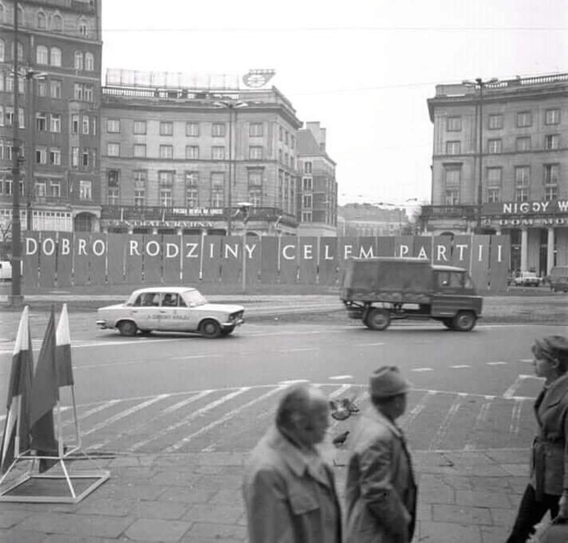

### 2020

  

---

Produkcja w gliwickiej fabryce Opla - na jedną zmianę
PAP, 12-06-2020
Po wznowieniu w tym tygodniu produkcji samochodów, gliwicka fabryka Opla pracuje na jedną zmianę, zamiast dwóch, jak przed rozpoczętym w drugiej połowie marca przestojem. Przedłużony został program dobrowolnych odejść, a część załogi będzie czasowo pracować we francuskiej fabryce Grupy PSA.
To, że produkcja ruszyła tylko na jednej zmianie, wynika przede wszystkim z załamania na rynku sprzedaży nowych samochodów.

---

Central Banks Added Nearly 32 Tons Of Gold To Reserves In April, Led By Turkey

  

---

Goldman raises 12-month gold forecast by 11% to $2,000 an ounce

---

Protesters in Lebanon have set fire to the central bank in Tripoli in a show of anger with the country’s deepening economic crises and stagnant political orthodoxy.

Joyce Karam of United Arab Emirates-based media outlet TheNational reported June 11 that the Lebanese pound (LBP) is trading for more than 5,000 per $1 in spite of the country’s official peg of 1,507 per dollar— a 20% depreciation since April, and over 230% since the peg was respected in January.

However, recent reports also indicate that an increasing number of protestors are embracing Bitcoin (BTC) as a means of bypassing Lebanon’s failing monetary system.

---

### 1999

Poniższy tekst to fragment homilii papieża Jana Pawła II, wygłoszonej w Sandomierzu 12 czerwca 1999 roku.

"Ze czcią pozdrawiam prastary Sandomierz tak bardzo mi bliski. Ogarniam sercem inne miasta i ośrodki przemysłowe, zwłaszcza Stalową Wolę - miasto symbol wielkiej wiary ludzi pracy, którzy z godną podziwu ofiarnością i odwagą wznosili swoją świątynię, pomimo trudności i gróźb ze strony ówczesnych władz komunistycznych. Miałem radość poświęcić ten kościół. Ileż to razy nawiedzałem ziemię sandomierską, jakże często dane mi było spotykać się z historią waszego miasta i uczyć się tu dziejów narodowej kultury. Utaiła się bowiem w tym mieście jakaś przedziwna siła, której źródło tkwi w chrześcijańskiej tradycji. Jest bowiem Sandomierz wielką księgą wiary naszych przodków. Zapisali w niej wiele stronic święci i błogosławieni. Wspominam przede wszystkim Patrona tego miasta - błogosławionego Wincentego Kadłubka, który był prepozytem katedry sandomierskiej i biskupem krakowskim, a potem ubogim mnichem zakonu cystersów. Jako pierwszy Polak opisał dzieje narodu w «Kronice Polskiej». Użyźniła tę ziemię w trzynastym wieku krew błogosławionych Męczenników Sandomierskich, duchownych i świeckich, którzy w wielkiej liczbie zginęli za wiarę z rąk Tatarów, a wraz z nimi błogosławiony Sadok i 48 dominikanów z klasztoru przy romańskim kościele świętego Jakuba. W świątyniach Sandomierza głosili Ewangelię: święty Jacek, błogosławiony Czesław, święty Andrzej Bobola. Dominikanie szerzyli tu gorliwie kult Matki Bożej; jezuici w swoim kolegium-Gostomianum kształcili i wychowywali młodzież; duchacy przy kościele Świętego Ducha prowadzili szpital dla chorych, przytułek dla biednych i ochronki dla dzieci. Miasto to pamięta Jana Długosza i świętą Królową Jadwigę, której sześćsetlecie śmierci w tym roku obchodzimy".

  

### 1987

> "Każdy z Was, młodzi Przyjaciele, znajduje też w życiu jakieś swoje Westerplatte, jakiś wymiar zadań, które trzeba podjąć i wypełnić, jakąś słuszną sprawę, o którą nie można nie walczyć, jakiś obowiązek, powinność, od której nie można się uchylić, nie można zdezerterować. Wreszcie, jakiś porządek prawd i wartości, które trzeba utrzymać i obronić, tak jak to Westerplatte. Utrzymać i obronić, w sobie i wokół siebie, obronić dla siebie i dla innych".

Ta myśl, będąca głębokim symbolem wskazuje na potrzebę odkrycia tego, CO jest tym Westerplatte dla każdego z nas. Następny krok to zajęcie zdecydowanej postawy obrony tego bezcennego przyczółka, obrony ze wszystkich sił.
Każdy ma swoje Westerplatte, i Ty, i ja. Warto więc zapytać samego siebie: Czy już wiesz co jest Twoim Westerplatte, którego masz bronić? Jaka wartość w Twoim życiu zasługuje na to najbardziej? Czy ją znalazłeś i postawiłeś w hierarchii na naczelnym miejscu? Czy wiesz, że to zobowiązuje? Czy postanawiasz być jej wierny i niewzruszenie stawać w jej obronie? Czy i jak będzie to wyglądać w Twoim życiu? Jak będziesz żył z tą najświętszą wartością, z tym Bożym wezwaniem, Twoim powołaniem, które przyjąłeś? Jak będziesz realizował to, do czego Bóg Cię wzywa? Czy jesteś człowiekiem wsłuchanym w Jego głos? Czy chcesz usłyszeć i posłuchać, czyli być posłusznym?

### 1980

Hasła niezmienne

  

### 1944

Podczas narady w Komendzie Głównej Armii Krajowej generał Tadeusz Bór Komorowski (na zdjęciu) wydał rozkaz,w którym zobowiązał nowo mianowanego generała Aleksandra Krzyżanowskiego do zdobycia Wilna przed Armią Czerwoną.
Rozkaz ten miał być wykonany w ramach akcji "Burza".
Celem akcji było m.in. uświadomienie
władzom sowieckim, że na wyzwolonych z okupacji niemieckiej terenach Polski w
granicach sprzed 1939 r. gospodarzami
są Polacy, uznający władzę Rządu
Emigracyjnego, który był jedynym
legalnym kontynuatorem struktur władzy
państwa polskiego sprzed 1939 r.

  

### 1943

Ukazał się pierwszy numer czasopisma "Żołnierz Wolności"- gazety Ludowego Wojska Polskiego założonej z inicjatywy polskich komunistów zrzeszonych w Związku Patriotów Polskich. Na początku pismo to było organem propagandowym 1 Dywizji Piechoty imienia Tadeusza Kościuszki. Co ciekawe w gazecie tej ukazywały się również dodatki religijne, których autorem był kapelan dywizji ksiądz major Wilhelm Kubsz.
Od 1945 roku gazeta zmieniła nazwę na "Polska Zbrojna". Pod tym tytułem ukazywała się aż do 1991 roku.

  

### 1809

W czasie wojny obronnej Księstwa Warszawskiego miała miejsce bitwa pod Gorzycami ( obecnie województwo podkarpackie).
Była to bitwa między Wojskiem Polskim pod dowództwem księcia Józefa Poniatowskiego,a VII korpusem austriackim aryksięcia Ferdynanda D'este.
Polskie wojska podczas przeprawy zostały zaskoczone przez nieprzyjaciela. Poniatowski zdecydował o zaprzestaniu przeprawy i przyjęciu bitwy w widłach Wisły i Sanu. Mimo trzykrotnej przewagi wojskom austriackim nie udało się zwyciężyć. Ostatecznie bitwa nie
została rozstrzygnięta, jednak ze
strategicznego punkty widzenia wygrali ją Polacy. Dzielna postawa żołnierzy
Poniatowskiego opóźniła oblężenie
Sandomierza, który przez to mógł zostać
wzmocniony.

  

### 1611

Wojska polskie pod dowództwem hetmana Stanisława Żółkiewskiego ruszyły do ostatecznego szturmu na Twierdzę Smoleńsk.
Siły polskie liczyły 8400 żołnierzy jazdy, 4000 żołnierzy piechoty i 30 armat. Do stanu tego należy doliczyć jeszcze 500 Kozaków zaporoskich oraz 4200 kolejnych żołnierzy polskich i litewskich, którzy dołączyli w decydującej fazie szturmu. Smoleńska broniło 20 000 żołnierzy rosyjskich Michała Szeina, 500 Szwedów oraz 40 000 mieszkańców.
Obrona miasta skapitulowała już następnego dnia.
Po 20 miesiącach i 11 dniach oblężenia Smoleńsk, utracony w 1514 roku powrócił do Wielkiego Księstwa Litewskiego.

  

---

<a href="https://github.com/TomaszWaszczyk/historia.waszczyk.com/edit/master/src/content/june-12.md" target="_blank">Edytuj tę stronę dzieląc się własnymi notatkami!</a>
