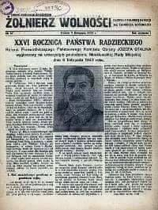

### 2020

  

### 1999

Poniższy tekst to fragment homilii papieża Jana Pawła II, wygłoszonej w Sandomierzu 12 czerwca 1999 roku.

"Ze czcią pozdrawiam prastary Sandomierz tak bardzo mi bliski. Ogarniam sercem inne miasta i ośrodki przemysłowe, zwłaszcza Stalową Wolę - miasto symbol wielkiej wiary ludzi pracy, którzy z godną podziwu ofiarnością i odwagą wznosili swoją świątynię, pomimo trudności i gróźb ze strony ówczesnych władz komunistycznych. Miałem radość poświęcić ten kościół. Ileż to razy nawiedzałem ziemię sandomierską, jakże często dane mi było spotykać się z historią waszego miasta i uczyć się tu dziejów narodowej kultury. Utaiła się bowiem w tym mieście jakaś przedziwna siła, której źródło tkwi w chrześcijańskiej tradycji. Jest bowiem Sandomierz wielką księgą wiary naszych przodków. Zapisali w niej wiele stronic święci i błogosławieni. Wspominam przede wszystkim Patrona tego miasta - błogosławionego Wincentego Kadłubka, który był prepozytem katedry sandomierskiej i biskupem krakowskim, a potem ubogim mnichem zakonu cystersów. Jako pierwszy Polak opisał dzieje narodu w «Kronice Polskiej». Użyźniła tę ziemię w trzynastym wieku krew błogosławionych Męczenników Sandomierskich, duchownych i świeckich, którzy w wielkiej liczbie zginęli za wiarę z rąk Tatarów, a wraz z nimi błogosławiony Sadok i 48 dominikanów z klasztoru przy romańskim kościele świętego Jakuba. W świątyniach Sandomierza głosili Ewangelię: święty Jacek, błogosławiony Czesław, święty Andrzej Bobola. Dominikanie szerzyli tu gorliwie kult Matki Bożej; jezuici w swoim kolegium-Gostomianum kształcili i wychowywali młodzież; duchacy przy kościele Świętego Ducha prowadzili szpital dla chorych, przytułek dla biednych i ochronki dla dzieci. Miasto to pamięta Jana Długosza i świętą Królową Jadwigę, której sześćsetlecie śmierci w tym roku obchodzimy".

  

### 1980

Hasła niezmienne

  

### 1944

Podczas narady w Komendzie Głównej Armii Krajowej generał Tadeusz Bór Komorowski (na zdjęciu) wydał rozkaz,w którym zobowiązał nowo mianowanego generała Aleksandra Krzyżanowskiego do zdobycia Wilna przed Armią Czerwoną.
Rozkaz ten miał być wykonany w ramach akcji "Burza".
Celem akcji było m.in. uświadomienie
władzom sowieckim, że na wyzwolonych z okupacji niemieckiej terenach Polski w
granicach sprzed 1939 r. gospodarzami
są Polacy, uznający władzę Rządu
Emigracyjnego, który był jedynym
legalnym kontynuatorem struktur władzy
państwa polskiego sprzed 1939 r.

  

### 1943

Ukazał się pierwszy numer czasopisma "Żołnierz Wolności"- gazety Ludowego Wojska Polskiego założonej z inicjatywy polskich komunistów zrzeszonych w Związku Patriotów Polskich. Na początku pismo to było organem propagandowym 1 Dywizji Piechoty imienia Tadeusza Kościuszki. Co ciekawe w gazecie tej ukazywały się również dodatki religijne, których autorem był kapelan dywizji ksiądz major Wilhelm Kubsz.
Od 1945 roku gazeta zmieniła nazwę na "Polska Zbrojna". Pod tym tytułem ukazywała się aż do 1991 roku.

  

### 1809

W czasie wojny obronnej Księstwa Warszawskiego miała miejsce bitwa pod Gorzycami ( obecnie województwo podkarpackie).
Była to bitwa między Wojskiem Polskim pod dowództwem księcia Józefa Poniatowskiego,a VII korpusem austriackim aryksięcia Ferdynanda D'este.
Polskie wojska podczas przeprawy zostały zaskoczone przez nieprzyjaciela. Poniatowski zdecydował o zaprzestaniu przeprawy i przyjęciu bitwy w widłach Wisły i Sanu. Mimo trzykrotnej przewagi wojskom austriackim nie udało się zwyciężyć. Ostatecznie bitwa nie
została rozstrzygnięta, jednak ze
strategicznego punkty widzenia wygrali ją Polacy. Dzielna postawa żołnierzy
Poniatowskiego opóźniła oblężenie
Sandomierza, który przez to mógł zostać
wzmocniony.

  

### 1611

Wojska polskie pod dowództwem hetmana Stanisława Żółkiewskiego ruszyły do ostatecznego szturmu na Twierdzę Smoleńsk.
Siły polskie liczyły 8400 żołnierzy jazdy, 4000 żołnierzy piechoty i 30 armat. Do stanu tego należy doliczyć jeszcze 500 Kozaków zaporoskich oraz 4200 kolejnych żołnierzy polskich i litewskich, którzy dołączyli w decydującej fazie szturmu. Smoleńska broniło 20 000 żołnierzy rosyjskich Michała Szeina, 500 Szwedów oraz 40 000 mieszkańców.
Obrona miasta skapitulowała już następnego dnia.
Po 20 miesiącach i 11 dniach oblężenia Smoleńsk, utracony w 1514 roku powrócił do Wielkiego Księstwa Litewskiego.

  

---

<a href="https://github.com/TomaszWaszczyk/historia.waszczyk.com/edit/master/src/content/june-12.md" target="_blank">Edytuj tę stronę dzieląc się własnymi notatkami!</a>
