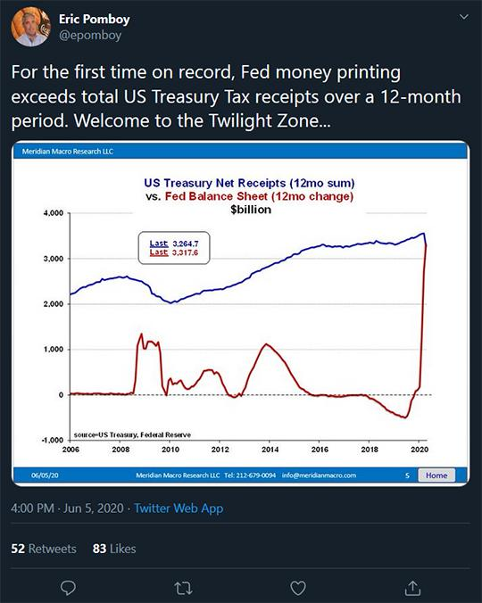
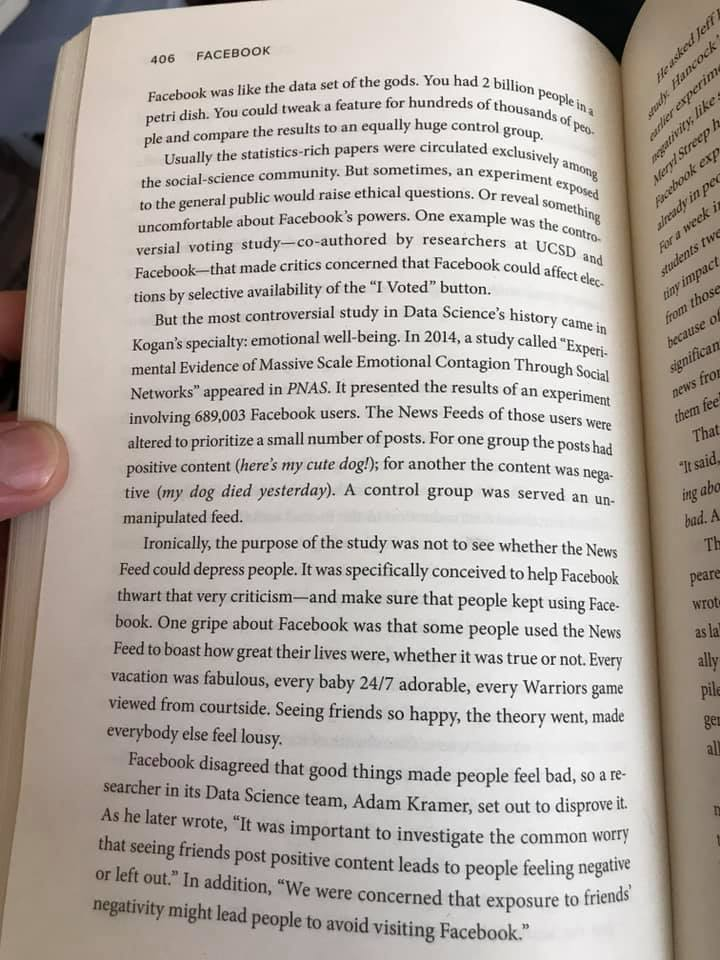
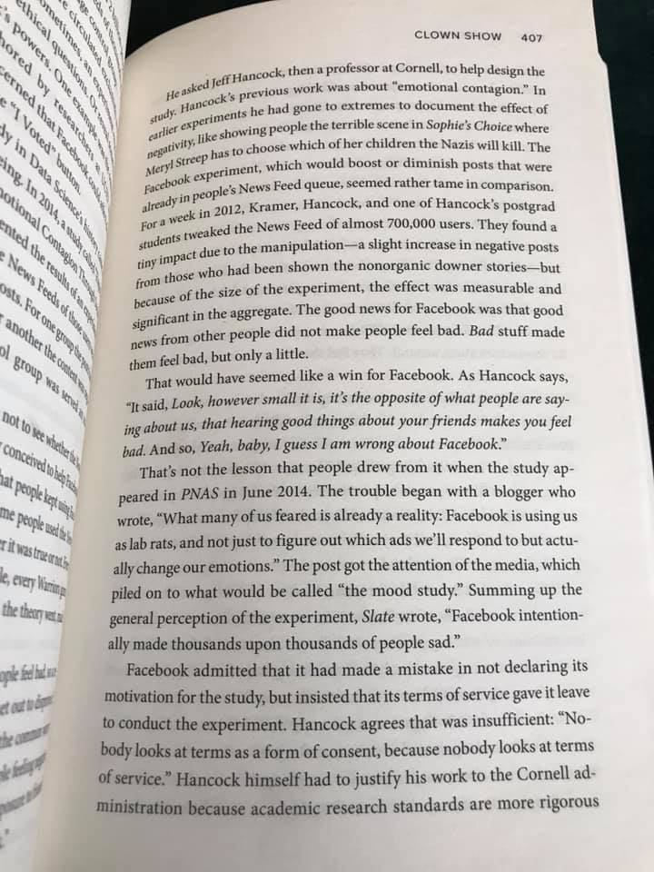
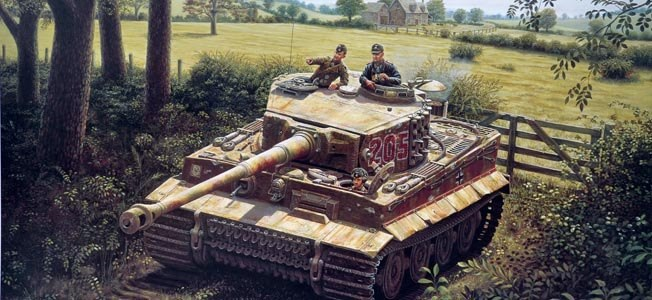
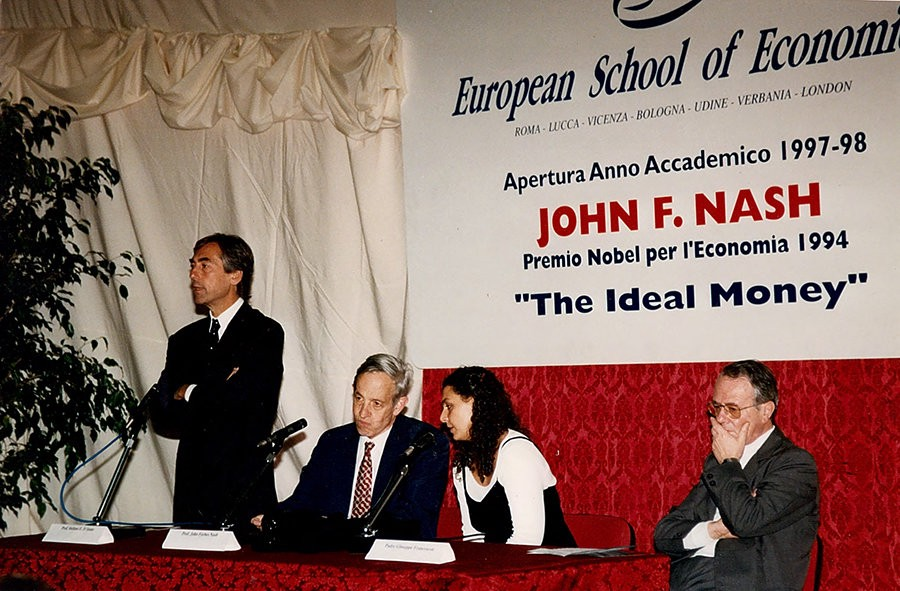

### 2020

"Nikt na świecie w ciągu ostatnich 40 lat nie zaszkodził komunizmowi tak, jak ten Polak. Narażając się na wielkie niebezpieczeństwo ,Kukliński konsekwentnie dostarczał niezwykle cenne,wysoce tajne informacje na temat Armii Sowieckiej, planów operacyjnych i zamierzeń Związku Sowieckiego,przez co przyczynił się w bezprecedensowy sposób do utrzymania pokoju. Ci, którzy znają Kuklińskiego osobiście,widzą w nim człowieka wielkiego charakteru, odwagi, polskiego patriotę i bohatera".
Tak szef CIA Wiliam Casey pisał o Kuklińskim w raporcie wystosowanym do Ronalda Reagana.
Dziś przypada 90 rocznica urodzin Ryszarda Kuklińskiego.

  

---

"By the end of the year, the Fed’s balance sheet is expected to comprise about 40% of the U.S. economy, according to an article at Time. Compare that with 6% in 2007. The Twilight Zone, indeed…"

  

---

Rząd Francji przeciwny sprowadzeniu przez koncern PSA pracowników z Polski
PAP, 13-06-2020
Rząd francuski zaapelował w piątek do koncernu motoryzacyjnego PSA o wycofanie się z zamiaru sprowadzenia kilkuset pracowników z fabryki produkującej Opla Astrę w Gliwicach. Mają oni wzmocnić załogę w fabryce Sevelnord Hordain (północny wschód Francji).
"W obecnej sytuacji firmy powinny czynić wszystko aby chronić zatrudnienie we Francji" - francuskie ministerstwo pracy.
Wcześniej decyzję zarządu PSA skrytykowały francuskie związki zawodowe nazywając sprowadzanych pracowników „nomadami branży motoryzacyjnej”.
Grupa PSA (Peugeot Société Anonyme, wcześniej PSA Peugeot Citroën) to francuski koncern motoryzacyjny, producent samochodów osobowych, dostawczych i jednośladów. Jest właścicielem marek Peugeot, Citroën, DS, Opel i Vauxhall.

---

  

---

Facebook. The Inside Story by S. Levy.

  

  

### 1992

Pełną gotowość bojową osiągnęła założona 13 lipca 1990 roku jednostka GROM, czyli Grupa Reagowania Operacyjno - Manewrowego im.Cichociemnych Spadochroniarzy Armii Krajowej.
Przy tworzeniu tej jednostki wzorowano się na najlepszych tego typu jednostkach funkcjonujących w Wielkiej Brytanii i USA.
Twórcą i jej pierwszym dowódcą
jednostki został ppłk Sławomir Petelicki. JW "Grom” przygotowana jest do prowadzenia różnorodnych operacji specjalnych: działań ratunkowych, akcji bezpośrednich, działań antyterrorystycznych oraz kontrterrorystycznych.

  

### 1982

W kolejną miesięcznicę wprowadzenia w Polsce stanu wojennego doszło we Wrocławiu oraz Nowej Hucie i Gdańsku do gwałtownych starć z milicją.
Tak ten dzień wspomina działacz Solidarności Walczącej Jarosław Hyk:
" Na ul. Legnickiej była masa ludzi, nieprzebrana rzeka. Zobaczył mnie jeden z esbeków, który mnie wcześniej zamknął, i po prostu kazał zomowcowi strzelić w moją stronę z tuby z gazem. Widziałem, że strzela, a pocisk uderza w krawężnik. Oberwałem rykoszetem
w nogę – ból, jakby mi ktoś ją uciął. Szarańcza na nas biegła, a ja nie dałem rady się ruszyć. Poczułem tylko, że ktoś mnie wziął pod pachy i zaciągnął do pobliskiego wieżowca. Wpadliśmy do windy i wjechaliśmy na 10 piętro – tam było pomieszczenie,
w którym udzielano pomocy. Zaraz podeszły do mnie jakieś kobiety w fartuchach, zapewne pielęgniarki, poobkładały lodem, dały tabletkę przeciwbólową i po jakimś czasie doszedłem do siebie. (…) Później zszedłem na dół i znów ruszyłem w kierunku pl. Czerwonego. Tam padł strzał. Z daleka widziałem, jak kogoś niosą – Kazimierza Michalczyka. Nie dużo brakowało, a zlinczowaliby tego gnoja, co strzelał, ale jakimś cudem udało mu się uciec."

  

### 1944

Front zachodni: pod Villers-Bocage w Dolnej Normandii pojedynczy czołg Tiger dowodzony przez Michaela Wittmanna zniszczył w ciągu 20 minut 21 pojazdów (czołgów, transporterów opancerzonych i ciężarówek) należących do brytyjskiego 4. Pułku Pancernego County of London Yeomanry.

12 czerwca 1944r słynna brytyjska 7 Dywizja Pancerna , od czasu swoich afrykańskich bojów nazywana “Szczury Pustyni”, ruszyła na południe by przechodząc przez lukę w niemieckiej obronie zająć francuskie miasteczko o dźwięcznej nazwie Villers- Bocage leżące nieopodal Caen. Następnego dnia w godzinach porannych wchodzący w jej skład 4 pancerny pułk County of London Yeomanry przejechał przez miasteczko i zatrzymał się na jego obrzeżu . Postanowiono wypić poranną cap of tee. Filiżankę herbaty pitą w całym Zjednoczonym Królestwie bez względu na czas i okoliczności. Cała 7 DP przywieziona do Europy po okresie walk w Afryce, znana była ze swojego specyficznie nonszalanckiego zachowania i znacznego braku dyscypliny. Zatrzymując się na postój nieopodal stanowisk armii niemieckiej, 4pp CLY nie tylko nie rozpoznał jej położenia, ale nie zastosował żadnych taktycznych zabezpieczeń chroniących go przed atakiem z zaskoczenia.

W tym czasie na wzgórzu 213 nad drogą, którą podążał 4pp CLY odpoczywała część 2 kompanii (z SS Pz. Abt. 101) 101 batalionu czołgów dowodzonej przez SS-Obersturmführera Michaela Wittmanna łącznie 3 Tygrysy i Pantera. Wittman niezwłocznie wykorzystał przewagę swojego stanowiska i zaatakował odpoczywających Anglików. Jak zwykle zrobił to indywidualnie. Pierwszy atak trwał kilka minut. Wittman zniszczył w nim 6 średnich czołgów ,3 lekkie i 12 transporterów opancerzonych. W tym czasie z całej kolumny 4pp CLY odpowiedział mu ogniem czołg majora Arthura Carra dcy pułku i czołg adiutanta regimentu kapitana Pata Daysa. Obie maszyny typu Cromwell , zostały zaraz przez Wittmanna zniszczone. Po 2 godzinach , uzupełnieniu amunicji i wezwaniu pomocy pozostałych Tygrysów Wittman ponowił atak. W drugim ataku zniszczył 4 ciężkie czołgi, 12 średnich i 14 transporterów.Pod koniec ataku czołg Wittmana został trafiony z działa ppanc ,stracił gąsienicę i załoga czołgu musiała salwować się ucieczką , przeciw niemieckim czołgom wystąpili spieszeni pancerniacy z rozbitego 4pp CLY używając do walki groźnych Piatów kal. 57mm, którymi zniszczyli oba towarzyszące Wittmanowi Tygrysy. Po bitwie Michael Wittman otrzymał do swojego Krzyża Rycerskiego ( nr. 71)z Liśćmi dębu –Miecze, kolejny stopień odznaczenia.

W raporcie w którym wystąpiono dla niego o awans na stopień SS- Hauptsturmführera podano, że na swoim koncie posiada obecnie ziszczone:138 czołgów i 136 transporterów opancerzonych. Był to niewątpliwie najlepszy rezultat II wojny światowej.

  

### 1934

Z trzydniową oficjalną wizytą przybył do Polski minister propagandy III Rzeszy Joseph Goebbels.
17 czerwca 1934 roku w swoim dzienniku zapisał: „Przejazd przez Warszawę. Dzielnica żydowska. Smród i pełno brudu. Wschodni Żydzi. Tacy oni są. Rozmowa z Beckiem o wymianie kulturalnej. On jest przyjazny i przebiegły. Jak wszyscy Polacy. Obiecuje wszystko i nic. Także tej sztuki musimy się nauczyć. Pod tym względem Polacy nas wyprzedzają. I nie wolno nam robić sobie żadnych złudzeń (…). Następnie do Piłsudkiego. Francuzi chcieli to udaremnić. Ale to się nie udało. Marszałek jest faktycznie chory. Ale rozmawia ze mną prawie godzinę. Bardzo jowialny i szarmancki. Na wpół Azjata. Schorowany. Stary rewolucjonista. Jeszcze starszy niż Hindenburg. Ale jasność (umysłu) żołnierza. Armia jest generalnie dobra. Piłsudski trzyma Polskę w swych rękach. Wielki człowiek i fanatyczny Polak. Nienawiść do ludzi i wielkiego miasta. Despota jak sądzę. Podczas rozmowy sypie anegdotami. Na jego życzenie zostaliśmy razem sfotografowani”
Foto: Poseł nadzwyczajny i minister pełnomocny Niemiec w Polsce Hans Adolf von Moltke (z lewej) wita ministra propagandy Niemiec Josepha Goebbelsa na mokotowskim lotnisku.

  

### 1942

Między godziną 15.00 a 17.00 z komanda pracującego poza obozem, przy wycinaniu wikliny nad Sołą, uciekło 3 Polaków. Byli to więźniowie: Marian Mykala (nr 1363), Zygmunt Piotrowski (nr 15303) oraz Franciszek Sykosz (nr 15402).

W telegramie komendant KL Auschwitz Höss napisał, że więźniowie obezwładnili pilnującego ich esesmana, wydarli mu broń i zabili go.

W odwet za zabicie esesmana kilkunastu mieszkańców Oświęcimia zostało aresztowanych i rozstrzelanych w KL Auschwitz.

  

Foto: Za grafikę obrazującą wybrałam okładkę książki pt. Strzały pod krematorium, z biblioteki Żółtego Tygrysa.

### 1941

Władze okupacyjne Warszawy wprowadziły na całym terenie Generalnej Guberni obowiązek posiadania kenkart czyli niemieckich dowodów osobistych wydawanych wszystkim jej mieszkańcom, którzy ukończyli 15 rok życia, a nie byli Niemcami.
Władze postanowiły rozpocząć akcję
wydawania kenkart prawdopodobnie ze
względu na szerokie rozpowszechnienie się fałszywych polskich dowodów osobistych. Do końca roku 1942 nie udało się opatrzyć wszystkich w nowe dokumenty i akcję przedłużono do 1 kwietnia 1943 roku. Ostatnie obowiązkowe kenkarty wydano w roku 1943.

  

### 1940

Powróciła z Norwegii walcząca tam Samodzielna Brygada Strzelców Podhalańskich. Polacy przypłynęli do portu w Brescie we Francji. Wysłano ich tam tylko w samych mundurach bez taboru, ciężkiego sprzętu, karabinów i amunicji, po czym już wkrótce wysłano ich do walki w obronie reduty bretońskiej pod Rennes. Po kilku dniach nierównej walki z Niemcami Brygada poddała się. Zaraz po tym została rozwiązana, a część jej żołnierzy przedostała się do Wielkiej Brytanii.

  

### 1934

Z trzydniową oficjalną wizytą przybył do Polski minister propagandy III Rzeszy Joseph Goebbels.

17 czerwca 1934 roku w swoim dzienniku zapisał: „Przejazd przez Warszawę. Dzielnica żydowska. Smród i pełno brudu. Wschodni Żydzi. Tacy oni są. Rozmowa z Beckiem o wymianie kulturalnej. On jest przyjazny i przebiegły. Jak wszyscy Polacy. Obiecuje wszystko i nic. Także tej sztuki musimy się nauczyć. Pod tym względem Polacy nas wyprzedzają. I nie wolno nam robić sobie żadnych złudzeń (…). Następnie do Piłsudkiego. Francuzi chcieli to udaremnić. Ale to się nie udało. Marszałek jest faktycznie chory. Ale rozmawia ze mną prawie godzinę. Bardzo jowialny i szarmancki. Na wpół Azjata. Schorowany. Stary rewolucjonista. Jeszcze starszy niż Hindenburg. Ale jasność (umysłu) żołnierza. Armia jest generalnie dobra. Piłsudski trzyma Polskę w swych rękach. Wielki człowiek i fanatyczny Polak. Nienawiść do ludzi i wielkiego miasta. Despota jak sądzę. Podczas rozmowy sypie anegdotami. Na jego życzenie zostaliśmy razem sfotografowani”

Foto: Poseł nadzwyczajny i minister pełnomocny Niemiec w Polsce Hans Adolf von Moltke (z lewej) wita ministra propagandy Niemiec Josepha Goebbelsa na mokotowskim lotnisku.

  

Luty 1938: Monachium, minister propagandy III Rzeszy, Joseph Goebbels, wizytuje „wystawę sztuki zdegenerowanej”. Kilkaset zgromadzonych eksponatów reprezentuje nie tylko większość nowoczesnych nurtów artystycznych (m.in. kubizm, dadaizm i fowizm), ale nawet postimpresjonizm przełomu wieków. Szczególną uwagę naziści poświęcają malarzom pochodzenia żydowskiego, szydząc z twórczości Chagalla, Kandinsky’ego czy Paula Klee. Ekspozycji towarzyszą pokazy „czystej rasowo, niemieckiej sztuki”, ale paradoksalnie to właśnie „bolszewickie wynaturzenia” cieszą się dużo większym zainteresowaniem (miliony zwiedzających w całych Niemczech). Z polecenia Goebbelsa tysiące dzieł sztuki z całej Rzeszy trafia na czarną listę – zostaną spalone, zniszczone, w najlepszym przypadku sprzedane za granicę. Z okazji korzysta Hermann Göring, pozyskując za bezcen obrazy van Gogha i Cézanne’a do swojej prywatnej kolekcji. Zdjęcie: Bundesarchiv/domena publiczna

  

### 1928

> John Nash, a Nobel Prize economist who made significant contributions to game theory such as the Nash Equilibrium and Bargaining Problem, believed that although Keynesian economic policies were, in theory, intended to be for solely noble objectives and general welfare of the people, in practice these policies simply gave governments the ability to literally print money, collecting seigniorage by way of inflation of the money supply. Nash often likened Keynesians to **Bolshevik Communists**, as he saw that both groups gave credence to the notions of a centrally managed system and a lack of transparency surrounding decisions, especially with regards to the nation-state’s currency issuance.

Nash’s Ideal Money proposal, in a nutshell, is an idea that although we cannot design a perfectly stable money, a money that approaches ‘stable’ would also approach a limit that would be comparable to an optimally chosen basket of commodity prices. While an ICPI would be a step on the path towards Nash’s vision of an Ideal Money, pegging a currency to the ICPI is not a solution, as it could fluctuate with major technological breakthroughs, and the subsequent readjustment could also be prone to political pressures.

Currently, global reserve currencies face the Triffin Dilemma, resulting in a conflict of interest between short-term domestic and long-term international objectives, such as a desire to increase inflation to spur economic growth, versus keeping a strong domestic currency with stability of purchasing power. Nash believed that money would be stronger if it were put on a stage of competition where it must compete to survive, and improve itself. Nowadays, however, currencies don’t really compete in a typical way like that which results in better products over time, but rather, they compete in a race to devalue. For Nash, rather than focusing on the utility of money for everyday transactions, of paramount importance was for the global economy to arrive at the same incorruptible value standard.

Bitcoin is seen by some as the catalyst for the evolution of global monetary systems toward something that would resemble in stability to an optimally chosen basket of commodity prices. Some believe that Nash’s writings from 1960’s may have even predicted the emergence of something like Bitcoin. Nash wrote: “Here I am thinking of a politically neutral form of a technological utility. To be quite respectable, in a Gresham-advised sense, money needs only to be as good as other material commodities that might be hoarded.”

https://en.wikipedia.org/wiki/John_Forbes_Nash_Jr.

  

### 1872

W Rudnikach koło Mościsk urodził się Jan Szczepanik (na zdjęciu) - wynalazca zwany "polskim Edisonem" lub "galicyjskim geniuszem".
Był samoukiem,co nie sprawiło mu problemu przy stworzeniu ponad 50 różnego rodzaju wynalazków technicznych.
Szczepanik wprowadził nowe metody w
dziedzinie fotowłókiennictwa (nanoszenia obrazu na materiał). Zachowało się wiele prac wykonanych przez niego tą metodą i jak się patrzy na prezydenta Mościckiego czy marszałka Piłsudskiego to nie mamy wątpliwości, że to jest ich podobizna. To była w tamtych czasach absolutna sensacja.
Sława Szczepanika niosła się aż za ocean. Słynny amerykański pisarz Mark Twain był zafascynowany polskim wynalazcą i jego dokonaniami do tego stopnia,że wspomniał o nim w dwóch napisanych przez siebie artykułach,a także chciał kupić prawa do patentu maszyny tkackiej skonstruowanej przez Szczepanika.
Polak był też prekursorem kinematografii.
W 1897 roku opatentował telektroskop,
protoplastę dzisiejszej telewizji. Było to
urządzenie do przesyłania na odległość
ruchomego obrazu kolorowego wraz z
dźwiękiem za pośrednictwem elektryczności.
Amerykański historyk telewizji Albert
Abramson w swojej książce pt. "Elektronic Motion Pictures. A history of the Television Camera" wymienił nazwisko Polaka na czołowym miejscu wśród XIX-wiecznych wynalazców telewizji. Informacja o telektroskopie wzbudziła sporą sensację w ówczesnej prasie, ale projekt z przyczyn technicznych i finansowych nie został
zrealizowany.
Jan Szczepanik zmarł 18 kwietnia 1926 roku w Tarnowie.

  

---

<a href="https://github.com/TomaszWaszczyk/historia.waszczyk.com/edit/master/src/content/june-13.md" target="_blank">Edytuj tę stronę dzieląc się własnymi notatkami!</a>
