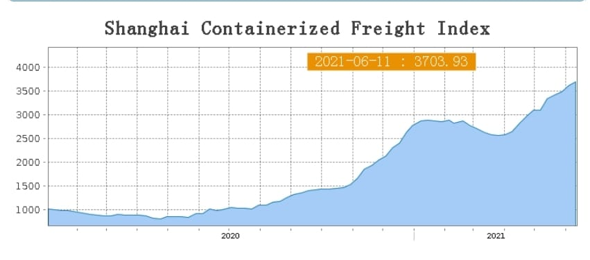
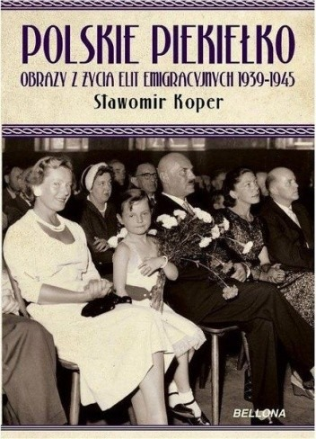

### 2021

Transport

ATH na kontenerowym indexie frachtowym w Azji:

* https://en.sse.net.cn/indices/scfinew.jsp
[polecam przeanalizować inne indexy ze strony, wybór po lewej]
EU index, dla masowych ładunków:
* https://tradingeconomics.com/commodity/baltic
Kongestia w rejonie Shenzen: Yantian, Hong Kong, Shekou:
* https://www.reuters.com/world/china/congestion-south-china-ports-worsens-anti-covid-19-measures-2021-06-11
Uwaga: gdzieś pisali o gorszej sytuacji niż podczas zablokowania Suezu. Jakiś kolega, kilka dni temu, dał już to info. Pozdrawiam. Dodam, że to nr 1 rejon na świecie jeśli chodzi o składowanie, import/eksport puszek.
US LAX: dalej, miesiąc w miesiąc, na rekordzie:
* https://gcaptain.com/port-of-los-angeles-processes-record-10-million-teus-for-new-western-hemisphere-record
Obserwacyjnie:
W chwili obecnej jestem na stoczni w północnych Chinach, Cosco Shipyards z Cosco Shipping Holding. Dygresyjnie: mam dość, w lipcu kolejny raz porozsyłam swoje cv'ki do Waszych firm 😉
https://sg.finance.yahoo.com/quote/601919.ss/
[zobaczcie jaki tam jest kosmos od roku]
Cosco ma swoje stocznie w całych Chinach, we wszystkich głownych miastach portowych. Stocznia to nie budynek, a miejsce w porcie gdzie prowadzone są remonty + tzw. suchy dok, gdzie wpływa się statkiem, ustawia na keel blockach, zamyka furtę od doku i wypompowuje wodę aby przeprowadzić remonty na podwodnej części kadłuba. Na 'mojej' stoczni jest w tej chwili 9 statków jednocześnie naprawianych. Każdy statek musi iść na taką stocznię co 5/7 lat. 
Rozmawiałem z vice prezydentem naszego oddziału Cosco Shipyards (gruby boss):
* zamówień na remonty ponad ich możliwości, nie mają miejsc na takie zapotrzebowanie,
* nie mają problemów ze stalą, ALE to ważne: napomknął że chińskie stocznie mają priorytet od rządu. To już nam wiele mówi, prawda? Skoro coś się priorytyzuje to problem jest.
* Największe trudności mają z siłą roboczą (!), co zresztą ja też widzę. Nie ma prostego człowieka do fizycznej roboty... więc nawet ja trochę sobie pospawałem...
* Naprawiają największe złomy kontenerowe jakie istnieją, takie jest zapotrzebowanie w tym segmencie. Zresztą stawka za wynajem statku kontenerowego skoczyła o 100% w ostatnich dwóch latach. 15k do 30k USD / dzień, pi drzwi, w zależności od wielkości. 
To tyle na dziś, nic wielkiego, ale może komuś się przyda. Martwi mnie ten fracht... i ta bańka, bo to balon bańkowy straszny. Te ceny są kosmiczne i sztucznie, grubo napompowane, bo statków, kontenerów, linii żeglugowych jest więcej niż przed wirusem, obostrzeń mniej na świecie, porty otwarte - zdolne do pracy... Nikt nie chce odpuścić, na każdym pretekście podwyższają, czują gruby pieniądz, wielkie firmy mogą na te ceny sobie pozwolić, a mikro przedsiębiorstwa? 
"chodźmy stąd bo będzie na nas"

  

### 2020

The pandemic has converted it to the joys of deficit spending. This may not last Europe

Editor’s note: Some of our covid-19 coverage is free for readers of The Economist Today, our daily newsletter. For more stories and our pandemic tracker, see our coronavirus hub

EVERY THURSDAY at 5pm three dozen of Germany’s most prominent economists brush their hair, clear their throats and Zoom into the finance ministry for 90 minutes of debate on whatever is on its officials’ minds. The sessions, which emerged from an informal discussion about the covid-19 crisis in March, have inspired several policy measures. (Olaf Scholz, the finance minister and vice-chancellor, is sometimes in the chair.) They also show how far Germany has moved from its caricature as a deficit-obsessed tightwad.

On June 3rd the coalition announced a stimulus package worth at least €130bn ($148bn). This follows a €123bn supplementary budget passed in March. Fresh borrowing could reach 6% of GDP this year. Meanwhile, Germany has agreed with France that the EU should issue €500bn in common debt to fund investments in member states hard hit by covid-19. Outsiders who have long despaired of German rigidity find themselves in the strange position of being surprised on the upside.

In 2008 German politicians warned of “crass Keynesianism”, before grudgingly passing a stimulus. This time the response has been quicker, bigger and better designed. Benefit rises and cuts to value-added tax aim to boost consumption, and €50bn has been set aside for investment, much of it green-tinged. Politicians have ignored (as they did not in 2009) the lobbying of Germany’s mighty auto industry for subsidies for people to buy cars, other than the electric sort. In 2010-12 the euro zone, at Germany’s behest, inscribed austerity into bail-outs and even national constitutions, like Germany’s (currently suspended) “debt brake”, which limits borrowing. Now Germany is signing up for big, multi-year transfers. Strikingly, this triumph of discretionary pump-priming over rule-following is fine with voters: 73% back “taking on large amounts of debt”. What happened?

The catalyst, of course, is the virus. Germany faces a deep recession: manufacturing and exports are in a hole, and 7.3m workers are on Kurzarbeitergeld (furlough pay), compared with 1.5m at the peak in 2009. At the European level it is easier to mobilise support for countries struck by a pandemic than for (perceived) overspenders. And the revival in support for the government, which six months ago seemed to have run out of steam, creates space to act.

  

---

  

---

### Return of inflation

Deutsche Bank Macro Strategist Oliver Harvey predicts that the combination of unprecedented government stimulus packages, retreating globalisation, the increase in bargaining power of certain sectors of the labour market as well as the need to reduce large debt burdens will bring about the return of inflation.

In his Konzept article, The case for inflation (page 18) he makes the point that while European government attempts to keep household incomes stable with job retention schemes , although they “have the best of intentions”, will simply result in “more money chasing after significantly fewer goods and services”. To put it bluntly, he adds, “The government is handing out US$100 bills when there is nowhere open to spend them”.

The Economist (18 April) concurs: “Worries about soaring prices start with the observation that virus-fighting measures choke off production. Crudely put, inflation is the result of too much money chasing too few goods. At present the amount of goods and services available for purchase is tumbling. Many service industries are shut down. The virus is playing havoc with the supply of some products.”2

The other problem is that a number of industries will be less profitable once some form of ongoing social distancing regulation limits the capacity at which they are allowed to operate. Examples are restaurants and airlines – which given the low-margin nature of their business models – means they rely respectively on high volumes of table bookings and flight turnarounds to be profitable – therefore the prices charged by such entities still in business would most probably rise. “If you assume 80% of restaurants cannot supply at, say, 60% capacity, do you think the price of a restaurant meal will go up or down?” asked Harvey on a recent Podzept podcast.3

As for all those precautionary savings, households’ spending and saving behaviour is – as every economist knows, says Harvey – “about expectations”. He predicts “as soon as households perceive the price of everyday goods and services starting to rise, their rainy day funds will quickly be raided to buy them.”

Another indicator that inflation is on its way back is, he adds, deglobalisation. The effects of globalisation on suppressing inflation were:

    Cross-border immigration and the offshoring of production increased the global labour supply, putting downward pressure on workers’ wages, particularly among the lower-skilled
    Enhanced competition in the manufacturing sector led to a decline in the cost of many consumer products.

The perception that high inflation is just around the corner is out there – a Deutsche Bank Data Innovation group (dbDIG) survey found that a majority of the Bank’s clients expect the pandemic to be ultimately inflationary. However, the drop in aggregate demand, says Torsten Sløk, Chief Economist, Deutsche Bank Securities, suggests that “we will not see inflation anytime soon”.

While this might be a comfort for some investors, what is the prospect of deflation, Japan-style?

---

"Czechy: Parlament wpisuje prawa właścicieli broni do konstytucji Niższa izba parlamentu Czech uchwaliła w środę nowelizację konstytucji, uwzględniającą prawa właścicieli broni palnej do obrony, mimo że UE po terrorystycznych atakach uzbrojonych islamistów ma na celu ograniczenie dostępu do broni."

Broń służy do obrony. Posiadanie broni palnej nie jest zabronione przez katechizm. Jeśli głównym motywem jest ochrona życia własnego lub osób drugich, to wówczas osoba ta nie zaciąga winy moralnej z powodu śmierci napastnika.

W Polsce żyjemy w innym świecie. O prawie do posiadania broni i używania jej w celu samoobrony opowiada się tylko jedna partia polityczna. Cała reszta była i jest przeciwna. Jarosław Kaczyński na XV Zjeździe Klubów "Gazety Polskiej" o dostępie do broni palnej powiedział, że jest przeciwny: "Obawiam się, że w Polsce w broń zaopatrzyłyby się przede wszystkim te środowiska, które by bardzo, ale to bardzo zaszkodziły tej pozostałej części społeczeństwa".

Dobrze, że mamy południowych sąsiadów, którzy wyłamują się z takiego sposobu myślenia. Nie musimy już powoływać się tylko na Szwajcarów.

---

Minister finansów: Deficyt nie jest dziś najważniejszy

- Będę ministrem, który w styczniu miał zbilansowany budżet, a w grudniu być może największy deficyt. Ale też patrząc z drugiej strony, jesteśmy jedynym krajem w UE, który w tym roku będzie mieć spadek PKB mniejszy niż 5 proc. i na pewno - mimo wszystko - jeden z najniższych długów. Od samego początku podkreślaliśmy - lepiej ratować gospodarkę teraz i wydawać pieniądze, niż za rok płakać, że nie mamy ani gospodarki, ani pieniędzy - podkreśla w rozmowie z Interią Tadeusz Kościński, minister finansów.

  

### 1987

Czyż nie są "światłem i solą ziemi" ci
wierzący, którzy we wszystkich
dziedzinach życia, zwłaszcza w
środowisku pracy starają się
wprowadzać w czyn zasady Ewangelii,
sprawiedliwości, solidarności? Waszym
zadaniem, drodzy neoprezbiterzy, będzie
współpraca ze świeckimi w poczuciu
odpowiedzialności za Kościół, za
chrześcijański kształt polskiego życia.
Trzeba świeckich darzyć zaufaniem.
Maja oni, jak uczy Sobór Watykański II,
swoje miejsce i zadanie w wykonywaniu
potrójnej misji Chrystusa w Kościele.
Jest w nich wielki potencjał dobrej woli,
kompetencji i gotowości służenia."
Słowa te wypowiedział papież Jan Paweł drugi w czasie swojej 3 pielgrzymki do Polski,która rozpoczęła się 8 czerwca 1987 roku.
Papież odwiedził wtedy Warszawę, Lublin,Tarnów, Kraków, Gdynię, Gdańsk, Częstochowę i Łódź.
Wizyta papieska, której hasłem przewodnim było "Do końca ich umiłował" zakończyła się 14 czerwca 1987 roku. Podczas uroczystości pożegnalnej na warszawskim Okęciu Karol Wojtyła odbył rozmowę w cztery oczy z generałem Wojciechem Jaruzelskim.

  

---

  

---

### 1946

Przetransportowano specjalnym samolotem z Warszawy do Poznania byłego gauleitera Kraju Warty Arthura Greisera (na zdjęciu). Z poznańskiego lotniska został on przewieziony prosto do więzienia przy ulicy Młyńskiej. Tam wkrótce przedstawiono mu akt oskarżenia,którego objętość wynosiła 60 stron maszynopisu.

  

### 1945

Sławomir Koper - Polskie piekiełko. Obrazy z życia elit emigracyjnych 1939-1945.

Książka Sławomira Kopra to pozycja poruszająca tematy pomijane w dotychczasowych publikacjach. Sprawy wstydliwe, rzucające cień na polską emigrację po klęsce wrześniowej: spory polityczne, rozgrywki personalne, bezwzględną walkę o władzę. Eliminację z życia publicznego ludzi związanych z sanacją, chorobliwe rozliczenia z przeszłością, obozy internowania dla niewygodnych oficerów i polityków. Ambicje i brak zdecydowania generała Sikorskiego, żenujące obsesje jego podwładnych, konflikty wstrząsające polskim światem w Paryżu, Londynie i Nowym Jorku. INFOrmacje zaskakujące, czasami wręcz nieprawdopodobne i bardzo odległe od stereotypowego postrzegania polskiej emigracji tego okresu. Ale autor znalazł też inne tematy. Nieprawdopodobne losy pięknej Krystyny Skarbek (ulubionej agentki Churchilla), obrazy z życia polskich bohaterów „Bitwy o Anglię”, rozpad przyjaźni skamandrytów, tajemniczą postać Józefa Rettingera, kobiety w życiu generała Andersa czy zadziwiające przypadki byłego premiera Felicjana Sławoja Składkowskiego. I dziwną grę hitlerowskiej Abwehry patronującej wyjazdowi z okupowanego kraju rodziny Sikorskiego i żony generała Sosnkowskiego. I to zapewne bez wiedzy samych zainteresowanych.

  

### 1940

ZSRR wystosował ultimatum do rządu litewskiego, domagając się jego ustąpienia i zgody na wejście Armii Czerwonej na teren Litwy.

Zagadnienie nie jest jednak całkowicie jednoznaczne i przyznać wypada, że strona rosyjska może zręcznie wykorzystywać pewne fakty historyczne. Z jednej strony obraz stanu rzeczy jest oczywisty – w czerwcu 1940 roku w wyniku ultimatum, pod groźbą agresji wojskowej Litwa została okupowana. Jednak z drugiej – dotychczasowe organy władzy na Litwie nie zostały zlikwidowane przez Rosjan, tylko odpowiednio przekształcone (o czym dalej). Warto także zaznaczyć, że Litwinom nie udało się stworzyć sprawnie działających władz emigracyjnych. Trwająca miesiąc próba powołania własnego rządu po agresji hitlerowskiej na ZSRR zakończyła się ostatecznie fiaskiem (z powodu negatywnego stanowiska Niemiec). Ergo, jedynymi organami państwowymi Litwy były władze Republiki Litewskiej, od czerwca 1940 roku znajdujące się pod kontrolą radziecką, a wkrótce później przekształcone we władze Litewskiej Socjalistycznej Republiki Radzieckiej. Pojawia się wreszcie paradoksalne na pozór pytanie – ile może trwać okupacja? Nikt oczywiście nie jest w stanie określić jednoznacznych ram czasowych i Litwini niewątpliwie mają rację, uważając, że okupacja krótkotrwała niczym zasadniczo – z prawnego punktu widzenia – nie różni się od wieloletniej. Można jednak postawić pytanie, czy jeżeli okres okupacji państw bałtyckich przekracza dwukrotnie okres ich międzywojennej niepodległości, to ta dysproporcja czasowa nie uzasadnia czasem tezy, że nastąpiło faktyczne przekształcenie okupacji w przynależność do ZSRR. Trzeba przy tym pamiętać, że Litwini, restytuując swoją państwowość w 1990 roku, wykorzystywali jednak organy państwowe o niezaprzeczalnie radzieckiej proweniencji (np. Radę Najwyższą). Kolejne zagadnienie ściśle wiąże się z poprzednim i dotyczy problemu, czy „wstąpienie” Litwy do ZSRR w roku 1940 miało charakter dobrowolny i zgodny z prawem międzynarodowym i prawem litewskim. Dla osoby dysponującej chociażby elementarną wiedzą historyczną zastosowanie cudzysłowu przy słowie „wstąpienie” jest sprawą oczywistą, a odpowiedź na postawione pytanie – jednoznaczna. Pamiętać jednak należy, że Stalin uczynił dużo, by nadać operacji przyłączenia republik bałtyckich do ZSRR pozory legalności. Charakterystyczna jest dla takiego postępowania wypowiedź pełnomocnika Stalina w Estonii Andrieja Żdanowa, skierowana do lokalnych komunistów: „Mogliście z łatwością, przy naszej pomocy, złamać kark waszej burżuazji […] chcemy uniknąć konfliktów międzynarodowych […] Rewolucja z czerwonymi sztandarami na barykadach nie wchodzi w rachubę […] nie jest ona wcale potrzebna […]”. Jak widać z powyższego, ponad „rewolucyjność” zmian Stalin ewidentnie postawił ich pozorną legalność. Starano się zatem zachować – co do zasady, bo wyjątki się zdarzały – pozór zgodności kolejnych kroków z dotychczas istniejącym prawem państw bałtyckich. Wywołane to było najprawdopodobniej właśnie chęcią uniknięcia nadmiernych reperkusji międzynarodowych. Na przykład po ucieczce prezydenta Antanasa Smetony do Niemiec w czerwcu 1940 roku, jego obowiązki przejął, formalnie zgodnie z art. 72 konstytucji litewskiej z 1938 roku, premier Antanas Merkys. Nieco później (z inspiracji radzieckiej) powołano „rząd ludowy” pod kierownictwem Justasa Paleckisa. Ponieważ Merkys złożył dymisję, Paleckis objął także obowiązki prezydenta.

Warto w tym miejscu przypomnieć o zasadniczych różnicach między agresją Związku Radzieckiego na Polskę w 1939 roku i – późniejszą – na państwa bałtyckie. W przypadku polskim mieliśmy do czynienia ze zbrojnym uderzeniem ZSRR, które mogło zostać nawet określone mianem wojny, zaś celem agresora było natychmiastowe zniszczenie dotychczasowych instytucji administracyjnych. Przypadek państw bałtyckich był odmienny. Zmiany były stopniowo wymuszane przez stronę radziecką. Społeczeństwa tych krajów zaskakiwano kolejnymi (rzecz jasna – coraz gorszymi) rozwiązaniami, w międzyczasie tworząc fałszywe przekonanie, że etap poprzedni stanowi już finał radzieckich zamiarów. Postępowanie takie doskonale ilustruje powiedzenie Mátyása Rákosiego – „technika krojenia salami”. W operacji włączenia republik bałtyckich do ZSRR zaangażowano zatem dosyć konsekwentnie istniejące struktury państwowe, nasycając je stopniowo odpowiednimi kadrami lub zmuszając „dawne” kadry do współpracy. Postępowanie to dotyczyło nawet prezydentów Łotwy i Estonii, który pozostali w pierwszym okresie na stanowiskach, ale zmuszeni zostali do wykonywania zaleceń okupantów.
Stosowano przy tym umiejętnie grę pozorów. Na przykład tzw. rządy ludowe w krajach bałtyckich, powstałe w czerwcu 1940 roku, w dużej mierze składały się z osób niekojarzonych z komunizmem, niekiedy z przedstawicieli dotychczasowego establishmentu. Nadal pełniły swoje funkcje ówczesne kadry administracyjne. Można mówić wręcz o – mniej lub bardziej dobrowolnym – współudziale funkcjonującej wtedy administracji w sowietyzacji republik bałtyckich. W żadnym z krajów bałtyckich nie zlikwidowano lokalnych sił zbrojnych, lecz ewolucyjnie przekształcano je w „armie ludowe”, a później w terytorialne korpusy Armii Czerwonej. Dla oceny sytuacji istotny jest także fakt, że zainstalowanie baz radzieckich, a potem całkowita okupacja Litwy nie napotkały oporu. Natomiast „odzyskanie” Wilna jesienią 1939 roku spotkało z licznymi objawami wdzięczności wobec ZSRR. „Naród litewski przyjął decyzję entuzjastycznie. 11 i 12 października odbywały się manifestacje […]”. Tłumy okazywały ogromną radość z powodu przekazania Wilna. W gazetach odzyskanie Wilna określano mianem triumfu. Drugi etap agresji radzieckiej przypadł na czerwiec 1940 roku. Również wówczas władze litewskie nie zdecydowały się podjąć walki. Pytanie, czy elity litewskie w tak dramatycznej sytuacji stanęły na wysokości zadania, pozostaje otwarte, przy czym pamiętać należy, że nader łatwo z dzisiejszej perspektywy przybierać ton Katona. Podczas dramatycznego posiedzenia rządu litewskiego w nocy z 14 na 15 czerwca, kiedy zapadały decyzje o odpowiedzi na radzieckie ultimatum, prezydent Smetona proponował stawienie oporu. Nie został jednak poparty przez większość członków rządu, w tym nawet przez wojskowych. Ostatecznie Litwa została zajęta całkowicie bez oporu, a nawet przy nadmiernym serwilizmie litewskich władz wojskowych – przede wszystkim dowódcy armii gen. Vincasa Vitkauskasa. Oficer ten podpisał np. odpowiednie porozumienie z przedstawicielem wojsk radzieckich o rejonach stacjonowania wkraczającej armii.

Strona rosyjska może tendencyjnie interpretować fakt przeprowadzenia na Litwie w lipcu 1940 roku wyborów do „sejmu ludowego”. Zgodnie z radziecką wersją historii wybory te były wolne i sejm dobrowolnie zgłosił później akces Litwy do ZSRR. Teza ta oczywiście nie znajdzie potwierdzenia u jakiegokolwiek obiektywnego historyka, co nie oznacza, że Rosja nie będzie się nią posługiwać w walce politycznej. Rosjanie w dyskusji prawno-historycznej mogą podnosić także fakt przyjaznych relacji litewsko-radzieckich z okresu dwudziestolecia międzywojennego, które jeden z najwyższych urzędników państwowych niepodległej Litwy określił wiele mówiącym terminem „tradycyjnej przyjaźni”. Zatem, w rosyjskiej argumentacji historycznej, „zamiana” litewskiej państwowości w radziecką może stać się potwierdzeniem mocnych, proradzieckich sympatii na Litwie. Niewykluczone przy tym, że i druga (litewska) strona sporu mogłaby się do tego faktu odwoływać – wskazując na niesprowokowany charakter agresji radzieckiej w 1940 roku. Nad zagadnieniem tym warto na chwilę się zatrzymać. Na pierwszy rzut oka historia relacji litewsko-radzieckich w okresie międzywojennym nie wydaje się bowiem odmienna – mówiąc ogólnie – od ówczesnych stosunków polsko-radzieckich, łotewsko-radzieckich czy wreszcie estońsko-radzieckich. Niepodległa Litwa rodziła się na przełomie lat 1918/1919 w walce z radziecką agresją. Później, utrzymując poprawne stosunki z ZSRR (określone traktatem pokojowym z 1920 roku i traktatem o nieagresji z 1926 roku), nie związała się ze Związkiem Radzieckim formalnym sojuszem. Nie jest to jednak pełny obraz wydarzeń. Jest prawdą, że pierwsze walki Litwini toczyli z Armią Czerwoną. Wkrótce jednak na skutek działań wojsk polskich, które oddzieliły Litwinów i Rosjan, wojska litewskie i radzieckie utraciły kontakt bojowy. W obliczu klęsk polskich, 12 lipca 1920 roku zawarto litewsko-radziecki traktat pokojowy. Ze strony radzieckiej traktat był typowym wybiegiem taktycznym. Litwie „przyznano” rozległe terytorium, obejmujące rzecz jasna Wilno, ale wybiegające także daleko na wschód i południe w porównaniu do obecnych granic Litwy. Rosja Radziecka zabezpieczyła sobie tym samym litewski odcinek frontu i pozyskała sojusznika de facto w zmaganiach z Polakami. Jednocześnie przewidywano, że Litwa po klęsce Polski i tak zostanie włączona do Kraju Rad. Litwini przy tym, dosyć naiwnie, widzieli w Rosji Radzieckiej sojusznika w konflikcie z Polską, siłę, która dopomoże im opanować i utrzymać Wilno. Nie chcieli przyjąć do wiadomości, że klęska Polski w zmaganiach z Armią Czerwoną byłaby jednocześnie końcem niepodległości wszystkich państw bałtyckich. Ostatecznie konflikt polsko-litewski o Wileńszczyznę rozstrzygnął „bunt” wojsk gen. Lucjana Żeligowskiego, a później decyzja Sejmu Wileńskiego o wcieleniu Litwy Środkowej do Polski. W sensie prawno-międzynarodowym o przynależności tych ziem do Polski zadecydowała konferencja ambasadorów Wielkiej Brytanii, Francji, Włoch i Japonii z 15 marca 1923 roku. Litwa natomiast konsekwentnie odmawiała uznania rzeczywistego stanu rzeczy, a z wrogości do Polski uczyniono motyw przewodni litewskiej polityki zagranicznej i wewnętrznej, w tym ostatnim przypadku czyniąc z niej element kanonu wychowania patriotycznego.

Politykę zagraniczną Litwy, determinowaną sprawą Wilna, można uznać za opartą na zasadzie: „każdy wróg Polski jest przyjacielem Litwy”. Z tego założenia wynikały relatywnie dobre stosunki litewsko-niemieckie i litewsko-radzieckie. Sprawy upraszczać nadmiernie nie można – do zawarcia formalnego sojuszu z ZSRR nie doszło, a politycy litewscy nie przejawiali jakiejkolwiek fascynacji radzieckim systemem ustrojowym. Dobre stosunki z ZSRR były jednak dosyć stałym celem litewskiej polityki zagranicznej. Właściwie każda kolejna ekipa rządząca na Litwie zakładała, że „Warszawa pozostanie w złych stosunkach z Berlinem i Moskwą, a rządy niemiecki i sowiecki w ich antypolskiej polityce udzielać będą Litwie wsparcia i osłony […]”. Tym samym Litwa była jedynym z krajów bałtyckich, który utrzymywał dobre relacje z ZSRR. W walce z wizją Litwy jako ofiary radzieckiego imperializmu niezwykle ważkim argumentem strony rosyjskiej mogą być nabytki terytorialne, które Litwa zyskała po 1939 roku. Zagadnienie to pojawiło się zresztą relatywnie wcześnie, już podczas wizyty Gorbaczowa w ogarniętej gorączką niepodległościową Litwie (11 stycznia 1990 roku). Mało znany jest w Polsce fakt, że Litwa, jako jedyna republika bałtycka, „skorzystała” terytorialnie w okresie przynależności do ZSRR. Warto przypomnieć, że w dniu rozpoczęcia II wojny świato wej do Litwy nie należała ani Wileńszczyzna, ani (już) okręg Kłajpedy (Mała Litwa). Wilno wraz z okolicami Litwa otrzymała od okupującego te ziemie ZSRR, na podstawie umowy „o bazach” z 10 października 1939 roku. Ponadto, drobne skrawki Wileńszczyzny Litwa uzyskała już po swoim włączeniu w skład ZSRR (okolice Druskiennik, Dziewieniszek, Hoduciszek i Święcian). Kłajpeda wraz z okręgiem została przyłączona powtórnie do Litwy po roku 1945. Zagadnienie litewskich nabytków terytorialnych stanowi cenny argument w rękach rosyjskich. Przede wszystkim przypominany jest, niezbyt chętnie pamiętany na Litwie fakt, że kraj ten w pierwotnej wersji paktu Ribbentrop-Mołotow był zarówno jego ofiarą i sui generis beneficjentem. O ile kwestia ziem uzyskanych przez Litwę w 1939 roku raczej nie jest szczególnie atrakcyjna propagandowo dla Moskwy – gdyż umowę w tej sprawie zawarło jeszcze formalnie niepodległe państwo litewskie, to inaczej wygląda kwestia późniejszych nabytków (z lat 1940 i 1945). Argumentacja rosyjska może być prosta – jeżeli Litwę traktować jako państwo okupowane, a nie podmiot federacji radzieckiej, który z niej wystąpił, to powstaje problem korzyści terytorialnych uzyskanych w okresie przynależności do związku. Okupowane zostało przecież państwo, do którego ani Kłajpeda, ani Druskienniki nie należały. W najlepszym wypadku można oczekiwać propozycji uwzględnienia wartości „ziem odzyskanych” (i zapewne kosztów, które ZSRR musiał ponieść dla ich wyzwolenia) w rozliczeniu roszczeń litewskich. W najgorszym wariancie rozwoju wydarzeń, Rosja (ewentualnie Białoruś) mogłaby przejść do polityki zgłaszania roszczeń terytorialnych. Pozycja negocjacyjna Litwy jest w tym przypadku złożona, determinowana bowiem przez trudne do rozwiązania zagadnienie – jak odwołując się stale do zasadniczego w dyskursie historycznym, prawnym i politycznym pojęcia okupacji, obronić nabytki terytorialne uzyskane z rąk okupanta. Jak się wydaje, podstawowe argumenty litewskie w tym zakresie mogą być dwa. Uznanie – w przypadku Wileńszczyzny – że wschodnią granicę Litwy wyznaczał radziecko-litewski traktat pokojowy z 12 lipca 1920 roku, a w latach 1939–1940 doszło jedynie do zwrotu litewskiego terytorium, „bezprawnie okupowanego” przez Polskę. Odnośnie do Kłajpedy strona litewska może dowodzić, że jej cesja na rzecz Niemiec w 1939 roku nastąpiła w warunkach zagrożenia użyciem siły i powinna być analogicznie traktowana, jak inne „pokojowe” aneksje Hitlera z tego okresu czasu. Problemem jest wreszcie sama kwestia zupełnie dowolnie ustalanej wysokości odszkodowań i potencjalnej kompensacji korzyści uzyskanych przez Litwę w czasach radzieckich (inwestycji gospodarczych, nabytków terytorialnych itp.). Warto przypomnieć, że w przeszłości pojawiały się diametralnie różne kwoty wysokości odszkodowań. W okresie ostatniego ćwierćwiecza litewskie roszczenia były już określane np. na kwoty 146 mld dolarów, 462 mld dolarów czy 23 mld euro. Druga strona nie pozostawała dłużna – już 2 marca 1990 roku Gorbaczow stwierdził, że Litwa winna jest ZSRR 20 mld rubli w złocie (33 mld dolarów) za inwestycje radzieckie na jej obszarze. Podsumowując powyższe spostrzeżenia należy uznać, że w litewsko-rosyjskiej dyskusji historycznej i prawnej racje moralne są niewątpliwie po stronie litewskiej. Nie ulega wątpliwości, że operacja wojskowo-polityczna ZSRR w stosunku do Litwy w latach 1939–1940, choć nie wiązała się z istotnym litewskim oporem zbrojnym, musi być oceniana tak samo, jak np. agresja (w tym „pokojowa”) Niemiec hitlerowskich w stosunku do innych państw. Nie oznacza to jednak, że w ewentualnym sporze historycznym i prawnym strona rosyjska jest całkowicie pozbawiona możliwości argumentacji. Umożliwiają ją pozory zachowania legalizmu w roku 1940 i teza o „państwowym” charakterze LSRR tudzież jej prawnej przynależności do Związku Radzieckiego. Twarde rosyjskie stanowisko w dyskusji historyczno-prawnej z Litwą wpisuje się doskonale w dzisiejszą ogólną politykę historyczną euroazjatyckiego mocarstwa. Rosja Putina konsekwentnie podtrzymuje radziecką narrację o udziale ZSRR w II wojnie światowej. Wykorzystywaną konsekwentnie także w walce z dzisiejszym „banderowsko-faszystowskim” rządem Ukrainy. W myśl tej koncepcji jakiekolwiek zło, które uczynił Litwie ZSRR, nie ma znaczenia wobec historycznej roli kraju-wyzwoliciela. Koresponduje to z umiejętnym odwoływaniem się Putina do radzieckiej symboliki i podtrzymywaniem przez jego ekipę mocarstwowej wizji Rosji (nawet jeżeli dziś obraz Rosji jako supermocarstwa jest założeniem nieco kontrfaktycznym). Taki kierunek polityki, jak widzimy ostatnio, jest całkowicie zgodny z przekonaniem olbrzymiej większości społeczeństwa rosyjskiego.

  

---

Rozpoczyna się to, co rozumiemy pod nazwą Auschwitz. Ten dzień pokazuje, co to znaczy, gdy rasistowskie uprzedzenia przechodzą w państwowe działania. Zostało to przez Niemców wyrządzone w Auschwitz Polakom, Żydom, Sinti i Romom – mówił podczas berlińskich uroczystości wiceprezydent Międzynarodowego Komitetu Oświęcimskiego Christoph Heubner.

Dokładnie 80 lat temu do założonego przez Niemców na terenie okupowanej Polski obozu koncentracyjnego Auschwitz przybył pierwszy transport więźniów. Było to 728 głównie młodych Polaków, przywiezionych do Auschwitz z niemieckich więzień w Tarnowie, dokąd trafili po wybuchu wojny w wyniku łapanek czy aresztowań.

Początek historii Auschwitz

W rozmowie z Deutsche Welle Heubner przyznał, że w Niemczech brakuje wiedzy o złożoności dziejów Auschwitz i o tym, że historia tego miejsca zaczyna się od polskich więźniów. – Dlatego było dla nas ważne, aby ta uroczystość odbyła się także w Berlinie. Bo z tej nienawiści wobec Polaków, z tej rasistowskiej pogardy wobec polskiego narodu rozwinęło się to, czego kontynuacją było masowe morderstwo europejskich Żydów oraz Sinti i Romów – mówił.

Podczas uroczystości przy pomniku na Steinplatz w Berlinie Heubner przypominał, że ocaleni z Auschwitz, którzy przybywali do obozu w późniejszych transportach, często wspominali więźniów pierwszego transportu z wdzięcznością i szacunkiem.

– Pomagali oni wielu innym, nieznanym więźniom, zarówno żydowskim jak i nie, w tym Sinti i Romom. Bo dobrze znali warunki panujące w obozie i sposób myślenia esesmanów, gdyż sami doświadczyli tego na własnej skórze – mówił. 

  

---

### 1807

IV koalicja antyfrancuska: Napoleon Bonaparte odniósł zwycięstwo nad generałem rosyjskim Levinem Benningsenem w bitwie pod Frydlandem.

Bitwa pod Frydlandem – bitwa, która została stoczona 14 czerwca 1807 roku niedaleko Frydlandu, obecnie Prawdinsk, około 43 km na południowy wschód od Królewca.

Była to jedna z najważniejszych bitew wojen napoleońskich, która bezpośrednio doprowadziła do zakończenia wojny z IV Koalicją. Została stoczona pomiędzy siłami Imperium Francji a Imperium Rosji. Po prawie 23 godzinach walki francuskie oddziały dowodzone przez Napoleona zdołały odnieść decydujące zwycięstwo nad armią rosyjską generała Bennigsena. Pod koniec bitwy wojska francuskie miały całkowitą kontrolę nad polem bitwy, a rosyjska armia uciekała chaotycznie przez rzekę Łynę, w której wielu jej żołnierzy utonęło. W wyniku tej klęski cesarz Aleksander I został zmuszony do podpisania pokoju.

Bitwa pod Frydlandem ma szczególne miejsce w polskiej historii, mimo że jest stosunkowo mało znanym epizodem wojen napoleońskich. Jednym ze skutków tej bitwy było bowiem utworzenie Księstwa Warszawskiego.

Pod Frydlandem gen. Dąbrowski ponownie ranny w tę samą nogę co pod Tczewem. 6 marca 1808 został odznaczony Krzyżem Komandorskim Orderu Virtuti Militari.  Pijany jak Polak (franc. dawniej saoul comme un Polonais, obecnie soul comme un Polonais lub ivre comme un Polonais) – popularne powiedzenie francuskie. Oznacza kogoś, kto mimo spożycia większej ilości alkoholu zachowuje sprawność fizyczną i trzeźwe myślenie, czyli człowieka z tzw. "mocną głową", ewentualnie kogoś, kto charakteryzuje się nadprzeciętną odwagą i brawurą. Po bitwie pod Frydlandem 1807 zarządzono odpoczynek. Nastąpiło rozluźnienie dyscypliny. Pijaństwo trwało podobno trzy dni. Niespodziewanie Rosjanie rozpoczęli kontratak. Okazało się, że jedynie oddziały polskie były w stanie brać udział w walce. Udało im się powstrzymać nieprzyjaciela i osłonić resztę niezdolnej na razie do boju armii. Napoleon miał w rozkazie dziennym następnego dnia napisać: Jeżeli już macie pić, to pijcie jak Polacy. W bitwie pod Frydlandem brali udział żołnierze dowodzeni przez Jana Henryka Dąbrowskiego.

  

---

<a href="https://github.com/TomaszWaszczyk/historia.waszczyk.com/edit/master/src/content/june-14.md" target="_blank">Edytuj tę stronę dzieląc się własnymi notatkami!</a>
