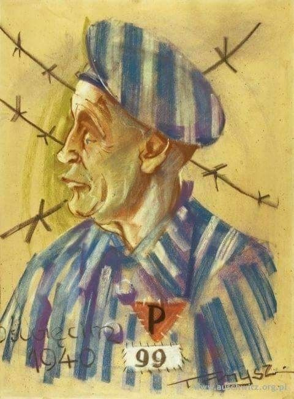
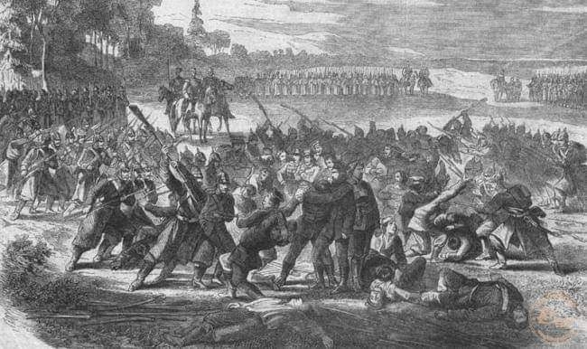
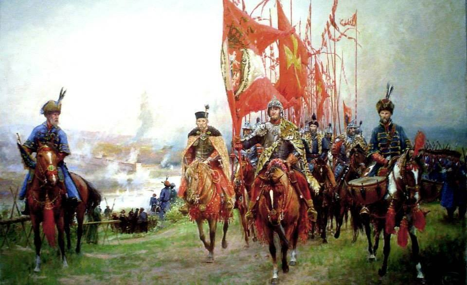

### 2020

Stany Zjednoczone są obecnie głęboko podzielone światopoglądowo i nie chodzi tu o tradycyjny podział na Demokratów i Republikanów. Coraz większe poparcie zdobywa ideologia, która nie ma jeszcze swojej nazwy, natomiast jej wyznawcy określają sami siebie słowem „progressives” czyli „postępowcami”. Jeśli w Polsce komuś termin ten się kojarzy z czasami komuny, która zapewniała wieczny postęp, to nie jest to skojarzenie całkiem mylne, choć nie można też do końca nazwać jej komunizmem. Na pewno mówimy tu o ideologii lewicowej, mocno zakorzenionej w marksizmie i filozofii postmodernizmu (które to połączenie samo w sobie jest pewnym paradoksem).

---

Niemal równo 18 lat temu, w czerwcu 2002 roku, grupa audytorów zaczęła rutynową kontrolę w spółce WorldCom, ówczesnego giganta z branży telekomunikacyjnej, który wtedy obsługiwał niemal 50% całego przepływu danych w Internecie! 😲

Przekręt WorldCom może być już dziś trochę zapomniany, ale kreatywna księgowość, która za nim stała, dalej jest popularna. Warto wiedzieć, jak rozwijała się jedna z największych afer z lat 2000, żeby szybciej wyłapać podobne naciąganie rzeczywistości w przyszłości u innych.🧐

---

Kilka dni temu obalono pomnik E.Colstona, bo handlował niewolnikami. Zagrożony był też pomnik R. Badena-Powella, za rasistowskie poglądy. Jeśli mamy iść dalej tym tropem, to dobrymi kandydatami są pierwsi prezydenci USA. 10 z 12 posiadało niewolników, niektórzy setki. Pomników do obalenia też setki i zmiany nazw - stanów, miast, ulic, fortów, mostów, szkół, parków, palenie banknotów $1,2,50. Idąc jeszcze dalej, oczyma wyobraźni widzę, jak za kilkaset lat nasi potomkowie wymazują z pamięci bohaterów naszych czasów, np. za to że jedli mięso, albo nie segregowali śmieci.

https://en.wikipedia.org/wiki/List_of_presidents_of_the_United_States_who_owned_slaves

---

<video width="640" height="480" controls>
  <source src="./movies/june/NickLandsResponsetoTechSecessionism.mp4" type="video/mp4">
Your browser does not support the video tag.
</video>

### 1993

https://pl.wikipedia.org/wiki/Instrukcja_UOP_nr_0015/92

### 1940

Pierwsi polscy więźniowie osadzeni w dniu poprzednim w KL Auschwitz zostali poddani tzw. kwarantannie. Miała ona na celu sterroryzowanie ich oraz doprowadzanie do psychicznego i fizycznego załamania. Codziennie po apelu porannym wypędzano ich na cały dzień na podwórze. Tam w tumanach kurzy na komendę esesmanów i kapów musieli ćwiczyć "padnij", "powstań", "skacz żabkę", "czołgaj się" itp. Nazywano to "sportem". W przerwach między ćwiczeniami uczono więźniów niemieckich piosenek marszowych, form meldowani i odmeldowania się, sposobu nakładania i zdejmowania czapek na komendę. Towarzyszyło temu bestialskie bicie i maltretowanie więźniów przez esesmanów oraz niemieckich kapów.

Źródło: Kalendarium Muzeum Auschwitz
Rysunek: praca więźnia KL Auschwitz Tadeusza Myszkowskiego. Jest to karykatura przedstawiająca oznaczonego w obozie numerem 99 Jana Kowalskiego. Obaj więźniowie pochodzili z Zakopanego i byli ze sobą spokrewnieni. Kowalski, zwany w obozie „Dziadkiem”, został aresztowany za wystawianie w lokalu Empire w Zakopanem w 1939 r. karykatur politycznych autorstwa m.in. Myszkowskiego przedstawiających Hitlera i Mussoliniego.
Właśnie za wykonywanie karykatur Tadeusz Myszkowski został aresztowany i osadzony w obozie Auschwitz. Był on jednym z więźniów przywiezionych do obozu pierwszym transportem polskich więźniów politycznych 14 czerwca 1940 r. Otrzymał numer 593. Źródłem rysunku jest strona internetowa Muzeum Auschwitz.

  

### 1863

W czasie powstania styczniowego miała miejsce bitwa pod Lututowem. Nie było to niestety zwycięskie dla powstańców starcie z wojskami rosyjskimi.
Oddział 120 kosynierów dowodzony przez pułkownika Antoniego Korotyńskiego został doszczętnie rozbity przez mające ogromną przewagę połączone kolumny wojsk rosyjskich pułkownika Tarasenkowa i pułkownika Wsiewołoda Pomierancowa.
Poległych w walce i wymordowanych
pochowano na miejscowym cmentarzu w mogile (w lewo od gł. wejścia), która
zachowała się tylko w stanie szczątkowym.
Na miejscu bitwy (pomiędzy wsią Piaski a Lututowem)po zachodniej stronie szosy, na skraju lasu "Koziołek" w 1993 r. ustawiono dwa duże krzyże i głazy (na wsch. i zach. sktraju pola bitwy). Obok jednego z krzyży,
przy samotnej sośnie z kapliczką, na
granitowym głazie, wyryto wizerunek Orła powstańczego ze słowami modlitwy: Boże, zbaw Polskę. Poniżej zamocowano napisy wykonane w metalu: 15 VI 1863 r. w lesie
Koziołek miała miejsce bitwa kosynierów pod wodzą płk. A. Korotyńskiego z wojskami
rosyjskimi. Po drugiej stronie pola bitwy trzy głazy, a na największym z nich Orzeł powstańczy z napisem w otoku: Ojczyznę wolną racz nam wrócić Panie. Poniżej: Miejsce zaciętej bitwy 120 kosynierów pod wodzą płk.
Antoniego Korotyńskiego z wojskami
rosyjskimi dnia 15 VI 1863 r. Zabito i
wymordowano 64 powstańców, 46 ciężko raniono, 3 wzięto do niewoli. Cześć ich pamięci.

  

### 1611

II wojna polsko-rosyjska: wojska polskie zdobyły po oblężeniu Smoleńsk.

13 czerwca 1611 r., po ponad półtorarocznym oblężeniu przez wojska króla Zygmunta III, Smoleńsk został zdobyty. Po niemal 100 latach rosyjskiego panowania miasto wróciło do Wielkiego Księstwa Litewskiego, a tym samym do Rzeczpospolitej Obojga Narodów.

Król Zygmunt III Waza, już w sierpniu 1608 roku zdecydował się na wojnę z Moskwą z zamiarem zdobycia korony carów, by następnie po połączeniu sił Rosji i Rzeczypospolitej odzyskać władzę nad swoim dziedzictwem – Szwecją. Drugim celem wojny miało być szerzenie religii katolickiej w obu zdobytych krajach (papież Paweł V ogłosił nawet odpust i jubileusz na intencję królewskiego zwycięstwa).

Wojnie sprzeciwiała się szlachta w większości podejrzewająca króla, nie bez racji, o chęć wykorzystania sił Rzeczypospolitej do swych prywatnych celów. W partii przeciwników był początkowo także wybitny wódz, hetman wielki koronny Stanisław Żółkiewski, uważający, że dopóki trwa wojna ze Szwecją nie można angażować państwa w kolejny konflikt.

Z kolei Moskwa już pod koniec 1608 roku zaczęła prowadzić pertraktacje mające na celu sprzymierzenie się ze Szwecją. Ostatecznie car Wasyl Szujski zawarł układ sojuszniczy ze Szwedami w lutym 1609 roku, co dla Zygmunta III stało się znakomitym pretekstem do rozpoczęcia oficjalnej wojny. Na skutek zawartego układu wojska szwedzkie zasiliły wojska moskiewskie.

Niewielkie jak na takie przedsięwzięcie wojska Rzeczypospolitej pod wodzą hetmana Stanisława Żółkiewskiego stanęły jesienią 1609 r. pod murami Smoleńska. Szeregi wojsk polsko-litewskich początkowo liczyły 8500 konnych (w tym 4342 husarzy), ok. 4700 piechoty i 5000 Kozaków. Wojska polsko-litewskie nie dysponowały jednak odpowiednią liczbą dział mając zaledwie 30 lekkich armat i nie były przygotowane do długotrwałego oblężenie miasta-twierdzy. Król miał bowiem nadzieję, że w związku z głębokim kryzysem państwa rosyjskiego Smoleńsk podda się bez uporczywej walki.

Smoleńsk był miastem o strategicznym znaczeniu. Położony między dorzeczami Dźwiny i Dniepru stanowił dla Rzeczpospolitej „klucz do Moskwy”. Za potężnymi, zbudowanymi za Godunowa murami Smoleńska, liczącymi nawet 19 metrów wysokości i grubymi na sześć, bronił się dowodzony przez Michała Szeina rosyjski garnizon liczący blisko 20 000 żołnierzy i mieszczan oraz 170 armat. Twierdza była dobrze zaopatrzona posiadając duże zapasy prochu, materiałów wojennych i żywności.

Polskie natarcia załamywały się jedno po drugim. Oblężenie się przedłużało, a wojska Rzeczpospolitej na skutek ciężkich warunków oblężenia topniały. Sukcesywnie napływały jednak posiłki. Do wysadzania murów sprowadzono nawet minerów z Francji i Szkocji. Ale i im nie udało się dokonać wyłomów w potężnych murach. W 1610 r. sprowadzono z Wilna i Polskich Inflant ciężkie działa oblężnicze.

W tym czasie wojska Rzeczypospolitej pod dowództwem hetmana Stanisława Żółkiewskiego odniosły świetne zwycięstwo, rozbijając armię Dymitra Szujskiego pod Kłuszynem (4 lipca 1610 roku) i zajmując Moskwę.

Do ostatecznego szturmu Smoleńska doszło z 12 na 13 czerwca 1611 r. Mina podłożona przez kawalera maltańskiego Bartłomieja Nowodworskiego w kanale odprowadzającym z twierdzy nieczystości, dokonała potężnego wyłomu w murach. Pozwoliło to na atak wojsk Rzeczypospolitej i w konsekwencji opanowanie całego miasta. Najdłużej broniła się położona przy Dnieprze wysoka na 31 metrów baszta Frołowska. Jej załoga poddała się wieczorem 13 czerwca.

Po 20 miesiącach i 11 dniach oblężenia utracony przed 97 laty (w 1514 roku) Smoleńsk wrócił do Wielkiego Księstwa Litewskiego.

Na specjalnym medalu wydanym w okazji zdobycia Smoleńska wybito łacińskie słowa, które w tłumaczeniu na polski brzmią: „Zwyciężone, wolność odzyskuję”

  

Podsumowując: Imperialna polityka Rzeczypospolitej za 2 pierwszych Wazów, to były działania kolosa na glinianych nogach. Nie rozwiązano żadnych problemów wewnętrznych: podatki, większa stała armia, Kozacy. Doszły nowe problemy: konflikt ze Szwecją, unia brzeska. I wystarczył jeden skrzywdzony Kozak by ten kolos runął z wielkim hukiem (1648-55). Więc ekscytowanie się zajęciem Kremla czy Smoleńska bez szerszego spojrzenia, bez widzenia że za Smoleńsk zapłaciliśmy Królewcem, przypomina mi ekscytowanie się wyczynami czołgu Rudy 102.
Niestety, z władców elekcyjnych tylko Sobieski miał wizję polityki zagranicznej zgodnej z polską racją stanu (niedoszły podbój Prus elektorskich). Tylko że w ówczesnych realiach ustrojowych nie miał szans na ich realizację. Liberum veto, oligarchia magnacka i pieniądze elektora o to zadbały

### 1215

https://pl.wikipedia.org/wiki/Magna_Charta_Libertatum

---

<a href="https://github.com/TomaszWaszczyk/historia.waszczyk.com/edit/master/src/content/june-15.md" target="_blank">Edytuj tę stronę dzieląc się własnymi notatkami!</a>
