### 2020

Potwierdził się wstępny odczyt GUS, zgodnie z którym ceny w maju wzrosły o 2,9 proc. w porównaniu z majem ubiegłego roku. Jednak to już trzeci miesiąc z rzędu, gdy podwyżki cen wyhamowują. Z kolei porównując ceny miesiąc do miesiąca, w maju pozostały one na praktycznie takim samym poziomie jak w kwietniu - spadek jest minimalny i wynosi 0,2 proc.

Przypomnijmy, że w tym roku inflacja była najwyższa w lutym, gdy wyniosła 4,7 proc. W marcu spadła, ale zaledwie o 0,1 pkt proc. Z kolei przed miesiącem zaliczyła zjazd z 4,6 do 3,4 proc. W maju natomiast spadła o kolejne 0,5 pkt proc. do poziomu 2,9 proc.

Inflacja ciągle przekracza docelową wartość NBP, czyli 2,5 proc., ale mieści się w dopuszczalnym przedziale 1,5-3,5 proc.

  

---

  

---

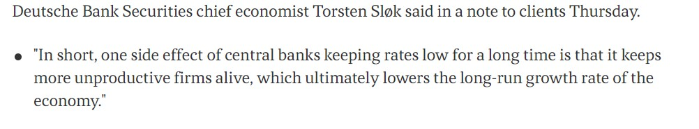  

---

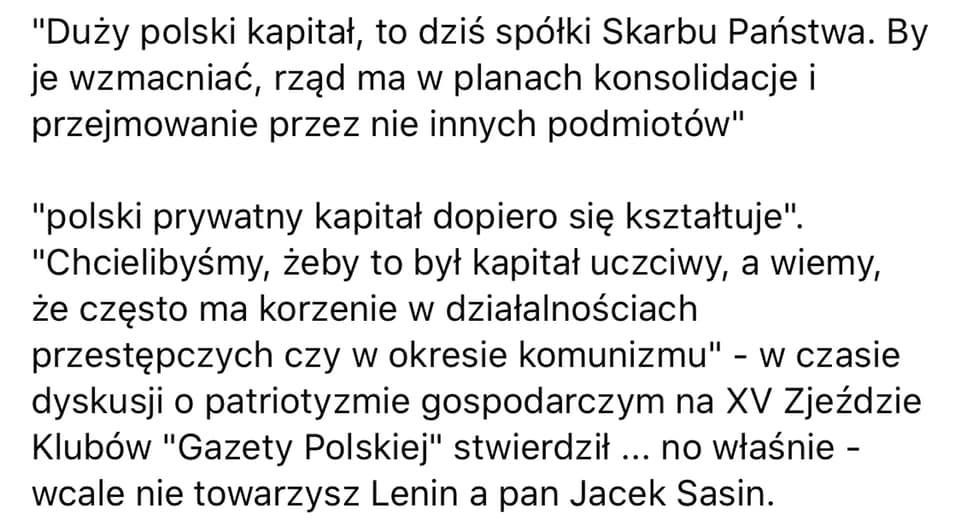  

---

### 2012

W niewyjaśnionych okolicznościach, tragicznie zginął generał Sławomir Petelicki. Pomysłodawca i pierwszy dowódca Jednostki Wojskowej 2305 GROM. Komandosi z GROM-u szkolili się u boku najlepszych na świecie. Jednostka szybko zyskała uznanie i ogromny szacunek w świecie. Sławowmir Petelicki był od 1969 r. do 1990 r. funkcjonariuszem Departamentu I MSW - wywiadu cywilnego [PRL](https://l.facebook.com/l.php...). Był również honorowym członkiem 5th i 10th Special Forces Groups (US Army Special Forces) „zielonych beretów” Armii Stanów Zjednoczonych, wszechstronnie przeszkolonym na żołnierza działań specjalnych, także w tych oddziałach. Posiadał złotą odznakę GROM z wieńcem. Uzyskał m.in. uprawnienia skoczka spadochronowego wojsk powietrznodesantowych, strzelca wyborowego, płetwonurka, 5 dan w karate fudokan i uprawnienia kierowcy pojazdów wojskowych. Zmarł w wyniku rany postrzałowej. Został pochowany 26 czerwca 2012 r. w Alei Zasłużonych na Cmentarzu Wojskowym na Powązkach.

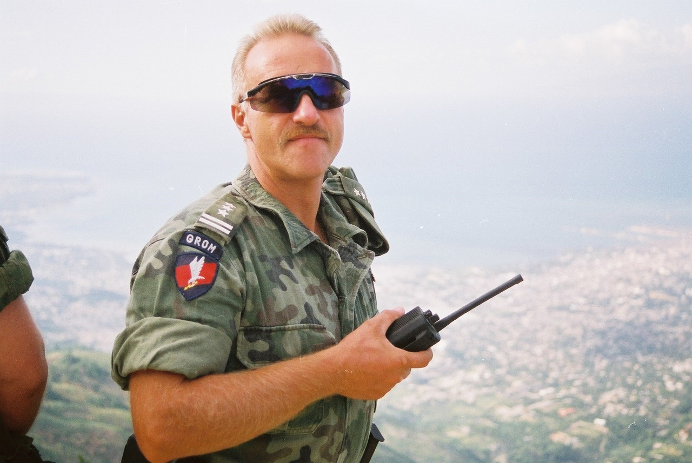  

### 1953

Juniaufstand

Peter Bruhn

Der 16. Juni 1953 bleibt mir unvergeßlich

Im Jahre 1953 war ich 26 Jahre alt. Durch die Zeitläufte, die ich bis dahin durchlebt hatte, war ich damals - wie vermutlich die Mehrheit meiner Altersgenossen - politisch wenn auch beileibe nicht hinreichend gebildet, so doch auf Grund gravierender Erfahrungen für fast alles aufgeschlossen und interessiert, was die mich umgebenden politischen Verhältnisse betraf. In Hitler-Deutschland aufgewachsen und im Geist der NS-Zeit erzogen, hatte es 1945 nach dem Ende des sogenannten Dritten Reiches für mich ein beschämendes Erwachen gegeben. Die allseits zu hörende Parole "Nie wieder Krieg!" reichte da bei weitem nicht aus. Hinzu kam nun der feste Vorsatz, künftig die Dinge stets kritisch genug zu hinterfragen, um sich nicht ein weiteres Mal politisch mißbrauchen zu lassen. -
Meine Heimatstadt, in Sachsen-Anhalt gelegen, war im April 1945 zwar von US-Truppen eingenommen worden, gehörte aber ab 1. Juli 1945 auf Grund alliierter Abkommen zur Sowjetischen Besatzungszone. So wurde ich dann als Bewohner der SBZ und später als Bürger der DDR ständig konfrontiert mit den sich dort vollziehenden gesellschaftlichen Entwicklungen. Das waren meistens keine angenehmen Realitäten. Andererseits mußte ich mich an der Universität als Student u.a. mit dem Studium des Marxismus-Leninismus befassen. Im Laufe der Zeit gewann ich immer mehr die Überzeugung, daß die Lehre mit den Realitäten der Praxis absolut nicht in Einklang zu bringen war. Was mich aber besonders störte, war die vom Regime ständig praktizierte Repression. Die Intoleranz war derartig, daß man sich nicht mehr trauen konnte, etwas zu äußern, was der vorgeschriebenen Denkweise möglicherweise nicht entsprach. Die Folge war, daß in der mich umgebenden DDR-Gesellschaft - von den wenigen überzeugten Kommunisten abgesehen, die es auch gab - sich das Heer der "Ungläubigen" in fast allen Bereichen von morgens bis abends zum Heucheln genötigt sah und der Opportunismus allseits in Blüte stand. Das waren Verhältnisse, die ich mit der Zeit als überaus belastend empfunden habe und das erklärt auch meine Begeisterung über die im Juni 1953 plötzlich ganz offen aufbegehrenden Bauarbeiter, nachdem ich ihre Demonstration am 16. Juni zu meiner nicht geringen Überraschung als echt und nicht fremdgesteuert erkannt hatte. Näheren Aufschluß darüber bietet mein nachstehend abgedruckter Augenzeugenbericht, den ich - noch unter dem frischen Eindruck der Juni-Ereignisse von 1953 stehend - im Frühjahr 1954 abgefaßt habe. Er verdankt sein Entstehen allein dem Umstand, daß ich damals nach einer ausführlichen mündlichen Befragung seitens der Westberliner Behörde, bei der ich um meine Anerkennung als politischer Flüchtling nachgesucht hatte, aufgefordert worden war, meine Erlebnisse niederzuschreiben. Der Bericht muß sich dort noch in der Aktenablage des Amtes bzw. im Archiv befinden. Als ich vor einiger Zeit beim Aufräumen alter Unterlagen die damals glücklicherweise von mir angefertigte Durchschrift wieder in die Hände bekam und las, fiel mir auf, daß die darin namentlich für den Verlauf des 16. Juni geschilderten Einzelheiten anderswo nirgends zu finden sind, jedenfalls nicht im gedruckten Schrifttum. Ich glaube mir insofern ein Urteil darüber erlauben zu können, als ich beruflich als Bibliothekar und Bibliograph tätig gewesen bin und - weil mich das Thema "17. Juni" seit jenen erregenden Ereignissen nicht mehr losgelassen hat - selber alle Daten gesammelt habe, die ich im Verlaufe meines Lebens im Hinblick auf Veröffentlichungen über den 17. Juni ermitteln konnte. Das Material werde ich übrigens in diesen Tagen anläßlich des 50. Jahrestages des 17.Juni in Form einer umfassenden Bibliographie publizieren. Mit dem Entschluß, den nachfolgenden Bericht zur Veröffentlichung freizugeben, möchte ich allen Interessierten, eine bislang unbekannte Quelle zugänglich machen und auch den leider immer wieder anzutreffenden Falschdarstellungen über das Geschehen am 16. Juni entgegentreten. Obwohl ich manches von dem, was ich vor einem halben Jahrhundert als junger Mann aufgeschrieben habe, heute anders bewerte und natürlich auch stilistisch anders ausdrücken würde, habe ich zur Wahrung der historischen Authentizität den ursprünglichen Text nicht abgeändert, nichts hinzugefügt und selbst Schreibfehler nicht verbessert.

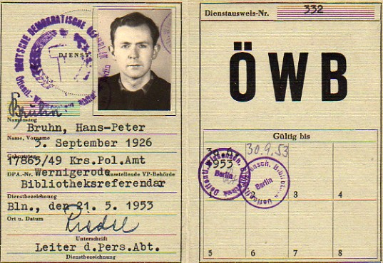  

Ausführliche Darstellung meiner Teilnahme
an den Aktionen des 16. und 17. Juni 1953

Am 16. Juni 1953 befand ich mich wie gewöhnlich im Gebäude der Universitätsbibliothek Berlin, bei der ich als Referendar tätig war. In der Mittagspause, die ich in dem nach der Universitätsstraße hin gelegenen sog. Frühstückszimmer verbrachte, hörte ich plötzlich von den Linden her laute Rufe und Sprechchöre, die sich auffallend von dem unterschieden, was man sonst gemeinhin bei den üblichen befohlenen Demonstrationen und Umzügen zu hören bekam. Ich öffnete daraufhin das Fenster, konnte aber trotzdem nichts sehen, da sich das Fenster hinter einem sehr starken Mauervorsprung befindet, der einen Blick auf die Linden hin verwehrt. Da die politische Situation während der vorangegangenen Tage durch die Verkündung des sogenannten „Neuen Kurses“ der Regierung ohnehin wieder in den Mittelpunkt des allgemeinen Interesses gerückt war und eine gewisse Spannung in der Luft lag, sagte ich der einzigen außer mir gerade im Zimmer befindlichen Kollegin, deren Einstellung mir bekannt war, halb im Scherz, halb im Ernst, daß ich nicht gewillt sei, hinter den Bücherstapeln der Bibliothek sitzend die Revolution zu verpassen und verließ, wobei ich alles stehen und liegen ließ, eiligst das Gebäude. Als ich die Straße Unter den Linden erreichte, erblickte ich dort einen mehrere hundert Meter langen, ungeordneten Zug, der zum allergrößten Teil aus Bauarbeitern bestand, die in ihrer Arbeitskleidung offensichtlich von den Baustellen zu kommen schienen. Die Spitze, die in Richtung auf das Brandenburger Tor marschierte, hatte gerade die Kreuzung an der Friedrichstraße überquert, während sich das Ende noch etwa in der Höhe der Universität und der Staatsoper befand. Da ich nicht recht wußte, was das Ganze bedeuten sollte, sprach ich einige der Arbeiter an und erfuhr einigermaßen überrascht, daß sie zur Regierung wollten, um gegen die Erhöhung der Arbeitsnormen zu protestieren und daß sie  - wie einer von ihnen sich ausdrückte - „überhaupt längst die Nase voll“ hätten. Obwohl ich an der Ehrlichkeit dieser Worte nicht zweifelte, war ich doch nicht ganz davon überzeugt, daß es sich wirklich um eine spontane, von Partei und Staat nicht kontrollierte Aktion handelte. Vorallem machte mich die Tatsache stutzig, daß die Volkspolizei nicht eingriff, sondern im Gegenteil sogar den Verkehr umleitete und damit dem Demonstrationszug den Weg frei machte. Als ich die Spitze des Zuges erreichte, erblickte ich dort ein großes blaues Transparent. Es schien vorher eine andere Inschrift gehabt zu haben. Jetzt trug es eine mit weißer Farbe offensichtlich in Eile improvisierte Aufschrift, deren Inhalt sich gegen die Normenerhöhung wandte. Um Näheres über die Haltung der Volkspolizei und über ihre Anweisungen zu erfahren, lief ich dem Zug voraus bis zur Ecke Unter den Linden/Wilhelmstraße. Dort stand ein kleines Einsatzkommando der Verkehrspolizei. Als ich auf den näherkommenden Demonstrationszug wies und fragte, um was für eine Demonstration es sich wohl handele, zuckten die Volkspolizisten nur mit den Schultern. Sie wußten es selber nicht. Ebensowenig konnten sie mir sagen, welche Richtung der Zug an der Kreuzung einschlagen würde. Überhaupt machten sie einen sehr unsicheren Eindruck. Als sich der Zug auf etwa 100 bis 50 m genähert hatte, bestiegen sie hastig Auto und Motorräder und fuhren davon. Zurück blieb nur ein noch recht junger Volkspolizist, der wohl zu dem unter den Linden stationierten Kontrollposten an der Sektorengrenze gehörte. Als sich ihm einige vorauseilende Bauarbeiter mit Drohungen und spöttischen Bemerkungen näherten, machte er ein sehr verlegenes Gesicht und trollte sich möglichst unauffällig davon. Nachdem ich das alles beobachtet hatte, war ich ziemlich fest davon überzeugt, daß wirklich etwas sehr Außergewöhnliches im Gange war. Immer mehr überkam mich das Gefühl, daß sich hier eine seltene und darum kostbare Chance bot für eine politische Aktion größeren Stils gegen das verhaßte System. Ich beschloß, nach besten Kräften meinen Teil zu dieser Aktion beizutragen. Aus diesem Grunde kehrte ich nicht an meinen Arbeitsplatz zurück, sondern schloß mich den Demonstranten an, mit denen ich dann die Wilhelmstraße hinunter zog zum Hause der Ministerien, dem Sitz der Regierung an der Ecke Wilhelmstraße/Leipziger Straße. Dabei wurden unterwegs immer wieder Sprechchöre gerufen, in denen vorallem die Herabsetzung der Arbeitsnormen, die Senkung der HO-Preise und die Auflösung der sog. Nationalarmee (KVP) gefordert wurden. Die Losungen für die Sprechchöre stammten meistens von einer Gruppe besonders aktiver Bauarbeiter, die an der Spitze des Zuges, unmittelbar vor dem Transparent marschierten, und denen ich mich zugesellte. Auf dem Marsche durch die Wilhelmstraße passierte der Zug unter anderem auch die Gebäude des Ministeriums für Volksbildung und des Staatssekretariats für Hochschulwesen. Im Rahmen unserer Ausbildung waren wir Referendare von Funktionären des Staatssekretariats für Hochschulwesen ein Vierteljahr lang von morgens bis abends im Marxismus-Leninismus unterrichtet worden und hatten darin auch noch ein Examen ablegen müssen, von dessen Zensur die Zulassung zur eigentlichen Fachausbildung wie auch die Höhe des Stipendiums abhängig waren. Nach der starken seelischen Belastung dieser damals erst wenige Monate zurückliegenden Zeit war es mir eine besondere Genugtuung, die Gesichter dieser Funktionäre zu sehen, wenn sie durch unsere Sprechchöre aufmerksam geworden an den Fenstern ihrer Dienststellen erschienen und wir sie mit lauten Pfiffen und Pfui-Rufen begrüßten. Es muß kurz nach Mittag gewesen sein, als wir den Platz vor dem Hause der Ministerien erreichten. Als unser Zug sich dem Gebäude näherte, konnte man sehen, daß das eiserne Gittertor vor der Einfahrt eilig geschlossen wurde. Im Nu war der Platz mit einer Kopf an Kopf stehenden Menge angefüllt, die auch jetzt noch zum größten Teil aus Bauarbeitern bestand. Erneut klangen Sprechchöre auf, und es währte nicht lange, bis so ziemlich sämtliche Fenster des Regierungsgebäudes, die auf den Platz hinausgingen, geöffnet wurden. Die Gestalten von Büroangestellten und Sekretärinnen wurden in ihnen sichtbar, aber auch die einzelner Regierungsfunktionäre. Teils mit erstaunten und fragenden, teils mit erschrockenen und verstörten Gesichtern hörten und blickten sie auf die aufgebrachte Menge. Nachdem die Sprechchöre dann verklungen waren, geschah zunächst eine Weile lang garnichts. Dann tauchte etwa in der Mitte der Säulenreihe der nach Norden gerichteten Fassade des Gebäudes die Gestalt eines Mannes aus der Menge auf. Er ragte etwa bis zum Gürtel über die Köpfe. Ob er auf einem Stuhle stand oder von den Arbeitern gehalten wurde, konnte ich nicht erkennen. Ich hatte nicht den Eindruck, daß es sich bei ihm um einen führenden Regierungsfunktionär handelte. Mit einer überaus schwachen Stimme versuchte er zu uns zu sprechen, aber obwohl er seine Worte mehrmals wiederholte, nahm kaum jemand außer den unmittelbar um ihn Herumstehenden Notiz davon. Erst nachdem zwei Arbeiter mit kräftiger Stimme die Aufmerksamkeit auf ihn gelenkt hatten, gelang es ihm zu einem größeren Kreise zu sprechen. Das, was er mit ausdrucksloser Stimme und mit unbeweglichem Gesicht sagte, bestand aus nicht viel mehr als zwei Sätzen. Da ihn aber unter den Demonstranten niemand kannte, unterbrachen wir ihn durch Zwischenrufe und verlangten seinen Namen zu wissen. Er nannte ihn und zog zum Beweise der Richtigkeit seiner Angaben seinen Dienstausweis aus der Tasche, den er mit ausgestrecktem Arme emporhielt. Aus dem Inhalt seiner Worte ging hervor, daß er vom Ministerrat den Auftrag erhalten hatte, mitzuteilen, daß die Erhöhung der Arbeitsnormen mit sofortiger Wirkung rückgängig gemacht worden sei. Er war dieses Mal von einem größeren Teil der Demonstranten gehört worden, die ihrer Unzufriedenheit durch laute Zurufe Ausdruck gaben. Sie waren mit diesem Zugeständnis der Regierung nicht zufrieden und lehnten es überhaupt ab, weiter mit untergeordneten Funktionären zu verhandeln. Kurz nachdem dieser Regierungssprecher wieder untergetaucht war, wurde ich von hinten durch eine etwa 40 bis 45jährige Frau beiseite geschoben, die sehr bestimmt um Durchlaß bat. Ich hatte den Eindruck, daß sie bei der Regierung eine leitende Stellung innehaben müsse und daß sie es gewohnt war, mit ihrer resoluten Stimme Anordnungen zu erteilen. Sie drängte sich durch die Menge bis zu der Stelle, von der aus der erste Sprecher geredet hatte. Mit fester Stimme und in emphatischen Ton begann sie eine Rede. Anscheinend hielt sie sich für auserkoren, dem Rad der Geschichte in die Speichen zu greifen. Sie kam aber nicht weit, sondern wurde immer wieder ausgepfiffen. Dies geschah unweit der Stelle, an der ich stand. Ich erinnere mich, daß auch an anderen Stellen des Platzes hier und da für kurze Augenblicke Redner aus der Menge auftauchten, vorallem wohl solche aus den Reihen der Demonstranten. Sie konnten aber alle nur einen verhältnismäßig kleinen Teil der Leute ansprechen, ohne ein größeres, allgemeines Echo zu finden. Da auf diese Weise nichts Konkretes zustandekam, wurden wir allmählich unruhig. Stimmen wurden laut, die verlangten, man solle sich mit niemandem mehr in Verhandlungen einlassen außer mit Ulbricht oder Grotewohl. Pieck hielt sich ja zu jener Zeit gerade wieder einmal in der Sowjetunion auf. Eine Gruppe von Bauarbeitern in der Mitte des Platzes begann mit dem Sprechchor: „Ul-bricht o-der Gro-te-wohl!“ und bald hallte der ganze Platz davon wieder. Mit anderen Demonstranten unterhielt ich mich darüber, daß Ulbricht in spätestens zwei Stunden dasein könne, wenn er nur wolle; da ihm ja alle Verkehrsmittel der DDR zur Verfügung stünden. Ich weiß nicht, von wo dann der Vorschlag kam, man solle doch eine Delegation zur Regierung hineinschicken. Ich erinnere mich aber genau, daß wir ihn alle leidenschaftlich ablehnten. Eisern wurde darauf bestanden, auf offener Straße vor aller Augen und Ohren zu verhandeln. Da wir uns also nicht beschwatzen ließen und überhaupt auf nichts eingingen, und da überdies keiner Anstalten machte, den Platz zu räumen, erschienen nach geraumer Zeit in einem der Fenster des ersten Stockes in der Mitte des die Westseite des Platzes begrenzenden Flügels des Regierungsgebäudes der Minister Selbmann und der stellvertretende Ministerpräsident Heinrich Rau. In der Fensterbank stehend, mit den Armen das Fensterkreuz umklammernd, versuchte Selbmann zu uns zu sprechen. Er kam aber nicht weit, sondern wurde durch Zurufe aufgefordert, er solle gefälligst herunterkommen, andernfalls man nicht mit ihm verhandeln wolle. Selbmann verließ daraufhin das Fenster und erschien kurze Zeit danach am Eingang des Gebäudes, um sich tatsächlich unter die Arbeiter zu begeben. Er wurde von Rau und einer Reihe anderer politischer Größen begleitet, unter ihnen die berüchtigten Professoren Havemann und Naumann von der Linden-Universität. Irgendjemand hatte einen Schreibmaschinentisch mit heruntergebracht, von dem herab Selbmann nun zu sprechen begann. Er begann seine Rede mit der Feststellung dessen, worum es seiner Meinung nach ging: Die Bauarbeiter der Stalin-Allee seien wegen unberechtigter Erhöhung ihrer Arbeitsnormen in den Streik getreten. Daraufhin, sagte er, habe der Ministerrat die entsprechende Anordnung zurückgenommen und es läge nun kein Grund mehr zum Streik vor. Jeder solle wieder an seine Arbeit gehen. - Die Arbeiter durchschauten seine Absicht, sich um Zugeständnisse herumzudrücken, und machten ihm sehr schnell und energisch klar, daß es nicht nur um die Bauarbeiter der Stalin-Allee ginge, sondern daß sie für die Arbeiterschaft des ganzen Ostsektors, ja, der ganzen Zone sprächen. In diesem Augenblick war es, glaube ich, auch, daß ein kleiner, hagerer Bauarbeiter neben dem Minister den Tisch erklomm. Er trug einen weißen Maureranzug und eine weiße Mütze und schien schon älter zu sein, vielleicht schon über fünfzig Jahre alt. War die ganze Aktion bisher das Unternehmen einer mehr oder weniger kopflosen Masse gewesen, getragen lediglich vom gemeinsamen Wollen der einzelnen Beteiligten, so erstand ihr jetzt in diesem Manne ein geradezu idealer Anführer, der den weiteren Verlauf der Ereignisse in entscheidender Weise beeinflußte. Neben Selbmann auf dem Tische stehend, begann er zu uns zu sprechen. Zunächst wies er darauf hin, daß er sich zum Sprecher seiner demonstrierenden Arbeitskollegen machen wolle, auch auf die Gefahr hin, erneut ins KZ zu wandern, in welchem er schon unter dem Nationalsozialismus fünf Jahre habe verbringen müssen. Obwohl Selbmann den Arbeiter mehrmals zu unterbrechen versuchte, gelang es ihm doch nicht so recht, wieder zu Wort zu kommen. Um den verlorenen Kontakt wiederzugewinnen, rief er den Arbeitern zu, daß er doch selber ein Arbeiter sei. Das hätte er nun freilich nicht tun sollen. „Das hast du aber vergessen!“ und „Bonze!“ und „Arbeiterverräter!“ hallte ihm ein entschiedener Protest entgegen. Im Verlaufe dessen, was nun folgte, wurde Selbmann immer kleinlauter, ohne sich jedoch zu Zugeständnissen bereit zu erklären, wozu er wohl keine Vollmachten besaß. Wie er so auf dem Tische stand, bot er einen für einen Minister wirklich jämmerlichen Anblick. Seine Hose war etwas heruntergerutscht und ließ einen etwa zehn Zentimeter breiten Streifen seiner Unterhose frei. Er hielt den Blick gesenkt und flog vor Erregung am ganzen Körper. Währenddessen sprach der neben ihm stehende Bauarbeiter unter unserem lauten Jubel davon, daß es sich bei dieser Demonstration nicht nur um einen Streik, sondern, wie er wörtlich sagte, um eine Volkserhebung handele. Sehr schnell hatte er sich das Vertrauen und die Sympathien der Menge erworben, unter deren sich von Mal zu Mal steigernden und begeisterten Beifall er in diesem überaus entscheidenden Augenblick die politischen Forderungen zu proklamieren begann (Einheit Deutschlands, freie Wahlen, Entlassung aller politischen Häftlinge usw.). - Neben ihm trat noch ein anderer Sprecher aus den Reihen der Bauarbeiter auf, ein jüngerer Mann in weißer Maurerhose mit bloßem, braungebrannten Oberkörper. Horst Schlaffke war sein Name, wie ich später beim Komitee 17.Juni erfuhr. -  Als Selbmann  gemerkt hatte, worauf die Sache hinauslief, verschwand er. Nach ihm versuchte Professor Havemann sein Glück. Mit der für ihn anscheinend typischen Unverfrorenheit versuchte er auch in diesem Augenblick noch, auf Bauernfang auszugehen. Er wies darauf hin, daß die Arbeiter ja soeben freie Wahlen und die Einheit Deutschlands gefordert hätten. Das, so sagte er, seien aber doch gerade die immer wieder hervorgebrachten Forderungen der Regierung der DDR, die u.a. auch für den neuen Kurs von großer Bedeutung seien. Schuld an der gegenwärtigen Spaltung Deutschlands seien doch die westlichen....usw. usw. Natürlich fiel niemand auf diesen plumpen Schwindel herein. Havemann mußte abtreten. Sein Kollege, Professor Naumann, der nach ihm den Rednertisch erstieg, wurde ausgepfiffen, ohne ein Wort gesagt zu haben und mußte zusammen mit seinen Genossen von der Bildfläche verschwinden. Wir hatten nun genug und verlangten erneut in Sprechchören nach Ulbricht oder Grotewohl, um nur noch mit diesen beiden zu verhandeln. Ein Teil der Bauarbeiter, die ja schon seit dem frühen Morgen auf den Beinen waren, ließ sich demonstrativ auf das Pflaster des Platzes nieder, um zu warten. Aus einem der vergitterten Fenster des Erdgeschosses wurde den durstigen Arbeitern,  - es war ja ein sonniger und warmer Tag -  , von den bei der Regierung beschäftigten Putzfrauen Trinkwasser herausgereicht. Ferner erinnere ich mich noch an zwei junge Frauen, die als Rednerinnen auftraten. Die eine war mit einer FDJ-Windbluse bekleidet und wurde so lange ausgepfiffen, bis sie diese ausgezogen und einer der Demonstranten erklärt hatte, daß es sich um eine Gleichgesinnte handele. Da ich etwas weit von ihr entfernt stand, konnte ich nicht alles verstehen. Soweit ich ihren Worten folgen konnte, handelte es sich um die Gemeinheit eines ‘Jugendfreundes’ aus ihrem Betriebe, der im Begriff sei, die ihm bekannten Demonstranten zu notieren. Die andere Rednerin, die ein helles Sommerkleid trug, war so weit von mir entfernt, daß ich nichts von ihren sehr erregten Worten verstehen konnte. -  Zu erwähnen wäre noch, daß, als die Teilnehmer an der Demonstration, die an der Peripherie des Platzes standen und darum nicht alles verstehen konnten, nach einem Lautsprecher verlangten, ein Mann aus dem ersten Stock des Regierungsgebäudes ein Kabel herabzulassen begann. Er verschwand jedoch vom Fenster und erschien nicht wieder. Das Kabelende blieb auf halber Höhe hängen. - Nachdem wir dann noch eine ganze Weile auf dem Platze vor dem Hause der Ministerien vergeblich gewartet hatten, wurde auf Initiative des genannten Arbeiters beschlossen, den Demonstrationszug durch die Stadt fortzusetzen und den Generalstreik auszurufen. Die Spitzengruppe mit dem Transparent, der ich mich wieder anschloß, setzte sich langsam in Marsch, der Zug formierte sich. Wir zogen die Leipziger Straße entlang und bogen dann nach links in die Friedrichstraße ein. Immer wieder ertönten unterwegs unsere Sprechchöre, z.T. noch dieselben, wie auf dem Anmarsch, z.T. aber neue, wie „Wir rufen auf zum Generalstreik!“, „Berliner reiht euch ein, wir wollen keine Sklaven sein!“ und ähnliche. Besonders eindringlich wurden die Rufe und Sprechchöre immer dann, wenn wir an Baustellen oder an Betrieben vorbeizogen. Hier wurde die Arbeit daraufhin fast überall sogleich eingestellt. Die Arbeiter schlossen sich unserem Zuge an. Jedes Mal, wenn eine neue Gruppe zu uns stieß, wurde sie jubelnd empfangen. Inzwischen war man auch auf Seiten der Regierung nicht untätig geblieben. Als wir am Bahnhof Friedrichstraße vorüberzogen, ertönte von rechts aus der Georgenstraße von einem etwa 50 bis 100 m entfernten Lautsprecherwagen die Stimme eines Ansagers. Er wies darauf hin, daß kein Grund zum Streik bestünde, da die Regierung die Normenerhöhung zurückgenommen habe. Drohrufe und erhobene Fäuste waren die Antwort. -  Als wir über die etwas höher gelegene Weidendammer Brücke zogen, warf ich einen Blick zurück und sah, daß die Friedrichstraße in ihrer ganzen Breite einschließlich der Fußsteige bis hinter die Bahnüberführung am Bahnhof, die den Blick begrenzte, mit einer dichten Menschenmenge erfüllt war. Es hatten sich zu diesem Zeitpunkt bereits eine Menge Passanten und wohl auch Angestellte der anliegenden Behörden dem Demonstrationszug angeschlossen. Vom Oranienburger Tor ging der Zug dann, wenn ich mich richtig erinnere, die Wilhelm-Pieck-Straße entlang über Hamburger Tor, Rosentaler Tor, Schönhauser Tor bis Prenzlauer Tor, und von dort durch Nebenstraßen zur Neuen Königstraße. Immer wieder erschienen unterwegs in den Seitenstraßen die Lautsprecherwagen der Regierung. Wir empfanden ihre Aufrufe als eine ziemlich freche Provokation, und obwohl einige derjenigen Bauarbeiter, die inzwischen eine Art Streikkomitee begründet hatten, dazu aufforderten, sich durch die Lautsprecheransagen nicht zu Übergriffen hinreißen zu lassen, waren wir so aufgebracht, daß wir  - d.h. etwa ein gutes Dutzend Leute -  einen der Lautsprecherwagen, der sich allzu nah herangewagt hatte, stellten. Obwohl wir den Wagen bereits umzingelt hatten, ließ sich der Ansager bei seiner Tätigkeit nicht stören. Ich glaube mich ziemlich gut daran zu erinnern, daß es Professor Havemann persönlich war. Wo der Fahrer des Wagens geblieben war, weiß ich nicht. Um den Ansager endlich zum Schweigen zu bringen, machten wir uns daran, den Wagen umzukippen. Obwohl er von einer Seite auf die andere schwankte, gelang uns unser Vorhaben nicht, da sich, wie sich nachher herausstellte, auf der anderen Seite einige Demonstranten mit der gleichen Absicht gegen den Wagen gestemmt hatten. Schließlich kletterten zwei Arbeiter auf das Dach des Wagens, um die Lautsprecher einzudrücken. Irgendjemand zertrümmerte mit einem Stein die Windschutzscheibe. Da gab Havemann es auf und verließ den Wagen. Er blieb im übrigen ungeschoren. Ohne mich weiter um den Wagen zu kümmern, eilte ich der Spitze des Zuges nach, die inzwischen ein ganzes Stück weiter gezogen war. Ähnliche Vorfälle müssen sich aber auch an anderen Stellen abgespielt haben, denn schon bald konnten wir einen anderen erbeuteten Lautsprecherwagen in unsere Mitte nehmen. Er war über und über mit Bauarbeitern besetzt. Neben mir stellte jemand fest, daß er ja nun tatsächlich Volkseigentum geworden sei. Seine Scheiben waren ebenfalls entzweigegangen, aber die Lautsprecheranlage ließ sich nach einigen vergeblichen Versuchen wieder in Gang setzen. Nun wurden die Streikparolen nicht mehr allein durch Sprechchöre, sondern mit größter Lautstärke über die Lautsprecher ausgerufen. Dabei wurde die Bevölkerung unter anderem auch dazu aufgefordert, sich am nächsten Morgen um 7 Uhr am Straußberger Platz zu einer großen Protestaktion gegen die Regierung einzufinden. -  Überaus interessant war es, die Mienen und überhaupt die Reaktion der Menschen zu beobachten, die uns begegneten oder an denen wir vorüberzogen. Durch den Lärm der Demonstration angelockt, standen sie an den Straßen, in den Eingängen zu den Geschäften, vor den Haustüren oder blickten aus den Fenstern ihrer Wohnungen und Büros. Da ich mich meistens an der Spitze des Zuges befand, konnte ich sie gut beobachten. So verschieden ihr Verhalten auch war, in einem ähnelten sie sich alle. Fast alle waren im ersten Augenblick maßlos erstaunt und verdutzt, und bei fast allen dauerte es eine gewisse Zeit, bis sie das, was sich vor ihren Augen abspielte, wirklich begriffen. Zulange war jede oppositionelle Meinungsäußerung unterdrückt worden. Um so heftiger war ihre Reaktion, wenn sie die Situation erkannt hatten. Es fällt mir schwer, meine Eindrücke mit Worten wiederzugeben. In der Friedrichstraße sah ich eine alte Frau. Als sie auf ihre zögernde Frage von einem vor mir gehenden Bauarbeiter in ein paar knappen Worten erfuhr, was los sei, traten ihr die Tränen in die Augen. Andere Leute, insbesondere die Ladeninhaber, rieben sich die Hände und strahlten übers ganze Gesicht. Oft wurde aus den Fenstern der oberen Stockwerke gerufen und gewunken. Menschen, die sich einander vollkommen unbekannt waren, sprachen sich an und tauschten lebhaft ihre Meinungen aus. Es war mitunter wie ein Taumel. Kurz vor dem Oranienburger Tor begegneten uns zwei Frauen. Als sie begriffen hatten, fielen sie sich  - lachend und weinend zugleich -  gegenseitig in die Arme. - Auf dem Wege vom Oranienburger Tor zur Neuen Königstraße tauchten auch des öfteren Fotografen auf, zumeist wohl Amateure. Sie machten verschiedene Aufnahmen von unserem Zug. Aber aus Sicherheitsgründen nahmen wir allen ausnahmslos die Filme aus den Kameras, wenn nicht anders möglich auch unter Gewaltanwendung. - Die Volkspolizei sahen wir auf dem ganzen Wege nur von weitem in Gestalt motorisierter Verkehrspolizei. Sie leitete den Verkehr um.  Im übrigen war sie bestrebt, uns nicht zu nahe zu kommen. Trotzdem muß es Volkspolizisten gelungen sein, zwei  - vermutlich etwas zurückgebliebene -  Demonstranten zu verhaften und in das Polizeipräsidium zu bringen. Glücklicherweise war dieser Umstand nicht verborgen geblieben. Irgendjemand hatte unseren Lautsprecherwagen informiert, der es seinerseits genau in dem Augenblick bekannt gab, als wir gerade ziemlich geräuschvoll vor dem Polizeipräsidium in der Neuen Königstraße demonstrierten. Die Verhaftung der beiden löste unseren heftigsten Protest aus. Der Zug kam zum Stehen. Über den Lautsprecherwagen wurde der Volkspolizei ein Ultimatum gestellt, in dem es hieß, daß wir das Präsidium so lange belagern würden, bis die beiden wieder freigelassen würden. Diese Drohung hatte schon nach wenigen Minuten Erfolg. Nach einem entsprechenden Triumpfgeschrei zogen wir weiter um den Alexanderplatz herum zur Stalin-Allee. Am Alexanderplatz standen bereits dichte Menschenmauern auf den Fußwegen und sahen dem Demonstrationszug zu. Es hatte sich anscheinend schon dieses oder jenes von den Vorfällen in der Stadt herumgesprochen. Ich mischte mich einen Augenblick unter die Zuschauer und erinnere mich, daß mir ein älterer Herr auffiel. Er stand mit einer jüngeren Frau, anscheinend seiner Tochter, unter den erregten Leuten. Um seine Lippen spielte bald ein ungläubiges, bald ein überlegenes Lächeln. Er meinte, es müsse doch irgend etwas auf sich haben  mit dieser scheinbar echten Demonstration, die er da so völlig ungehindert an sich vorüberziehen sah. Da könne doch irgend etwas nicht stimmen. Ich hörte, wie er die anderen warnte, nicht darauf hereinzufallen, weil am Ende doch wieder irgend ein Trick dahinter stecke. Es ging ihm wie so vielen Leuten, die unter den in der DDR herrschenden politischen Verhältnissen eine Volkserhebung einfach nicht für möglich hielten. -  Aufgebracht durch die bei dem Vorfall am Präsidium offenbar gewordene feindselige Haltung der VP, wurden die entgegenkommenden, ahnungslosen Volkspolizisten heftig beschimpft, u.a. auch einer, der aus dem Fenster seiner im ersten Stock gelegenen Wohnung schaute und ziemlich herausfordernde Antworten gab. Aber obwohl mitunter wütende Drohungen ausgestoßen wurden, kann ich mich nicht erinnern, bereits an diesem Tage Zeuge von Tätlichkeiten geworden zu sein. - Nachdem wir den Straußberger Platz überquert hatten, wurde nochmals auf die für den nächsten Morgen geplante Aktion hingewiesen. Dann scherte der Lautsprecherwagen nach links aus, wo er in einer Nebenstraße abgestellt und seinem Schicksal überlassen wurde. Der Demonstrationszug löste sich langsam auf. --  Mit der U-Bahn fuhr ich zurück bis Stadtmitte, und ging dann zu Fuß zur Universitätsbibliothek, wo ich meine Sachen holen wollte. An der Ecke Charlottenstraße/Unter den Linden traf mich meine Bekannte Fräulein Hannelore Schultz aus Zehlendorf. Da die Vorfälle inzwischen schon zum Stadtgespräch geworden waren, hatte sie sich denken können, daß ich an ihnen beteiligt war. Ich fuhr mit Fräulein Schultz zusammen nach Zehlendorf, wo ich ihr ausführlich von den Ereignissen berichtete und die Meldungen der westlichen Rundfunkstationen abhörte.

Am nächsten Morgen, dem Morgen des 17. Juni, brach ich bereits vor 6 Uhr auf. Mit der U-Bahn fuhr ich von der Station Onkel-Toms-Hütte zum Alexanderplatz und von dort weiter mit der Linie E. Schon auf dem unteren Bahnsteig des Bahnhofes Alexanderplatz wurde durch Lautsprecheransagen darauf hingewiesen, daß die Züge am Straußberger Platz nicht halten. Ich mußte darum eine Station weiter bis Marchlewskistraße fahren. Als ich die U-Bahn verließ und auf die Stalin-Allee kam, sah ich, wie auf beiden Seiten der Straße die Menschen in Richtung Straußberger Platz strömten. Kurz bevor ich den Platz erreichte, sah ich einen sowjetischen Lkw mit aufgesessener Infanterie, danach einen zweiten. Sie fuhren die Stalin-Allee langsam hinauf und hinunter. Hinter dem Straußberger Platz standen, glaube ich, weitere Fahrzeuge. Ich schätzte, daß es schon 7 Uhr durch war, als ich den Platz erreichte. Von Versammlung konnte keine Rede mehr sein. Ohne Aufenthalt ging es weiter in Richtung Stadt. ‘Zur Regierung’ lautete die allgemeine Parole. An der Westseite des Straußberger Platzes sah ich eine Gruppe älterer FDJler in blauen Uniformhemden. Mit bösen Gesichtern standen sie am Rande der Straße und erhielten gerade von einem Vorgesetzten Verhaltensmaßregeln. Sie traten aber nicht in Aktion, solange bis ich sie aus den Augen verlor. Hinter dem Straußberger Platz stellten sich uns die ersten Absperrketten der Volkspolizei in den Weg. Sie wurden sehr einfach über eine neben der Straße gelegene Baustelle umgangen, und dienten auf diese Weise allenfalls als Verkehrshindernis. Da ich möglichst schnell zum Regierungsviertel kommen wollte, wies ich meinen Dienstausweis vor, brummelte etwas von Staatssekretariat und so weiter, woraufhin ich ohne weiteres durch die Absperrung gelassen wurde und auf diese Weise schnell den Alexanderplatz erreichte. Dort gewann ich den Anschluß an einen riesigen, festformierten Demonstrationszug. Es schien sich um geschlossene Betriebsbelegschaften zu handeln.  Die Leute kannten sich zum Teil untereinander und marschierten untergehakt in Reihen bis zu 15 und 20 Personen. Sie waren in einer begeisterten Stimmung, der auch ein ziemlich heftiger Regenschauer nichts anhaben konnte. Mit spöttischen und scherzhaften Zurufen, die den wenigen galten, die sich des Regens wegen unterzustellen versuchten, zogen die Reihen unentwegt weiter. In der Rathausstraße gab es eine kurze Stauung. Teile der Demonstrationszüge zogen, glaube ich, in Richtung Lustgarten. Ich befand mich in einem Zuge, der in die Klosterstraße einbog. -  In der Klosterstraße suchte ich den gleichnamigen U-Bahnhof auf. Die Züge fuhren zu dieser Zeit noch. Ich erfuhr aber, daß man auch hier in kürzester Zeit mit dem Streik rechnete. Ich fuhr mit der U-Bahn bis Märkisches Museum, es kann auch Spittelmarkt gewesen sein. Von da aus gelangte ich durch eine ziemlich zerstörte und menschenleere Gegend bis zur Leipziger Straße. Schon von weitem sah ich eine dichte Menschenansammlung. Als ich näher kam, bemerkte ich mehrere Lkws der Volkspolizei, die auf der Wilhelmstraße vor dem Hause der Ministerien parkten. Die auf ihnen herangeschafften Vopos sperrten die Leipziger Straße ab, sodaß niemand an den Gebäudekomplex herankam. Obwohl die großen Demonstrationszüge noch garnicht heran waren, hatten sich bereits jetzt, zu dieser frühen Stunde schon, eine ganze Menge Leute vor den Absperrketten angefunden. Diese vermochten schließlich dem Druck nicht mehr standzuhalten und mußten Meter um Meter zurückweichen. Dann kam es zu dem ersten Handgemenge. Ein Vopo hatte mit seinem Knüppel zugeschlagen. Sekunden verflogen, dann flog zur allgemeinen Freude seine Mütze durch die Luft, sein Polizeiknüppel wirbelte hinterher. Die Absperrung wurde weiter zurückgedrängt. Ich verließ dann die Leipziger Straße, um zu sehen ob man nicht an anderen Stellen leichter an das Regierungsgebäude herankommen könne. Aber auch an der Wilhelmstraße stieß ich auf eine doppelte Vopokette, die niemanden durchließ. Hier hatten sich zu diesem Zeitpunkt erst wenige Demonstranten eingefunden. In diesem Augenblick kamen, nicht weit von uns entfernt, die Mauerstraße herunter die ersten drei sowjetischen Panzerspähwagen.  Sie fuhren in Richtung auf das Regierungsgebäude. Die Ausrüstung machte einen durchaus kriegsmäßigen Eindruck.  Die Fahrzeuge waren nach oben hin offen. Dort sah man die mit Stahlhelmen bedeckten Köpfe der Rotarmisten. Von den aufmontierten MGs waren die Bezüge entfernt, seitwärts hingen aus ihnen die Patronengurte heraus. Im Laufe der Zeit sah ich sie noch mehrere Male vorüberfahren. -  Ich versuchte dann, von Süden her an das Regierungsgebäude heranzukommen. Dabei kam ich zu einem aus enttrümmerten Grundstücken gebildeten Platz unweit der Sektorengrenze an der Stelle, wo Friedrichstraße, Mauerstraße und Zimmerstraße zusammentreffen. Auch dort hatten sich bereits mehrere tausend Menschen eingefunden. Einige junge Leute machten sich an einer Baracke zu schaffen, die der Volkspolizei gehört hatte. In ihr waren, wie ich hörte, die aus dem Westsektor heimkehrenden Passanten immer durchsucht und oft genug der mitgeführten Lebensmittel oder sonstiger knapper Waren beraubt worden. Nachdem Fenster und Türen eingeschlagen und die Räume durchsucht waren, wurde Feuer angelegt. Es dauerte nicht lange, und die Baracke stand lichterloh in Flammen. Eine dichte, weithin sichtbare Rauchsäule stieg über den Platz empor. Zur allgemeinen Erheiterung kam nach geraumer Zeit die Feuerwehr angerückt. Da es aber an der Baracke nichts mehr zu löschen gab und andere Gebäude nicht gefährdet waren, bog sie ab ohne anzuhalten. Plötzlich wurden bei einem der Baracke gegenüberliegenden Gebäude die Scheiben eingeworfen. Der Grund dazu war mir nicht klar. Aber als ich mich zu erkundigen versuchte, waren die Akteure verschwunden. Als die Baracke schon ziemlich niedergebrannt war, machte ich mich zusammen mit einigen anderen jungen Leuten daran, die dort an der Sektorengrenze stehenden Schilder ‘Ende des demokratischen Sektors’ zu beseitigen. Unmittelbar an der Stelle, wo die Friedrichstraße die Sektorengrenze erreicht, waren aus den Westsektoren inzwischen mehrere Wagen mit Presseleuten erschienen. Hart an der Grenze standen mitten auf der Straße zwei VW-Busse, von deren Dächern herab die von der vieltausendköpfigen Menge umgebene brennende Baracke, sowie einzelne Personen mit Teilen der zerbrochenen Grenzschilder in den Händen fotografiert und auch gefilmt wurden. Eine in der Baracke aufgefundene rote Fahne wurde auf einen Stock gehißt und vor den Kameraleuten verbrannt. Mit einem ganzen Haufen von Leuten zog ich dann die Sektorengrenze entlang, um überall die von östlicher Seite aufgerichteten Grenzschilder umzulegen und zu zerstören. Dabei kamen wir in der Niederkirchnerstraße an der Rückfront des Regierungsgebäudes vorbei. Ein Versuch, von hier aus in das Gebäude einzudringen, mußte aber unterbleiben, da hinter den Fensterscheiben und im Hof mit Karabinern bewaffnete Angehörige der Kasernierten Volkspolizei auftauchten. Wir zogen weiter bis zur Stresemannstraße und zum Potsdamer Platz, wobei sämtliche am Wege stehenden Grenzschilder und Transparente beseitigt wurden. Als wir den Potsdamer Platz erreichten, sah ich, daß der ganze Platz einschließlich der im Westsektor gelegenen Teile mit einer großen, viele Tausende zählenden Menschenmenge erfüllt war, die sich von hier aus die Leipziger Straße hinunter bis in die Wilhelmstraße am Hause der Ministerien erstreckte.  Dunkel erinnere ich mich auch, daß von westlicher Seite außer den Wagen der Presse und der Polizei auch ein Lautsprecherwagen auf dem Platze erschienen war, von dem aus ein westberliner Politiker, an dessen Namen ich mich allerdings nicht mehr erinnern kann, eine kurze Ansprache hielt. Ich glaube, es war jemand vom DGB.  Auch hier am Potsdamer Platz waren eine Baracke der Volkspolizei, Zeitungskioske mitsamt ihrem Inhalt und größere Propagandawände und -säulen in Brand gesetzt worden. Vom Potsdamer Platz aus fuhr ich mit der S-Bahn bis Unter den Linden, um zu sehen, wie dort die Lage sei. Als ich auf die Straße kam, prasselte gerade ein heftiger Regenschauer hernieder. Die Straße war verhältnismäßig leer. In der Nähe des Brandenburger Tores stand ein sowjetischer Lkw mit aufgesessener Infanterie, daneben standen zwei sowjetische Offiziere. Von den Linden aus begab ich mich wieder zum Hause der Ministerien. Auf den Straßen sah ich des öfteren Abzeichen und Anstecknadeln herumliegen. Als ich am Regierungsgebäude ankam, sah ich, daß die inzwischen von kasernierten Einheiten unterstützten Mannschaften der Volkspolizei von der vieltausendköpfigen Menge bis unmittelbar an den Platz vor dem Gebäude zurückgedrängt worden waren und auch diesen trotz größter Anstrengung kaum freizuhalten vermochten. Mit mehreren dichten Absperrketten versuchten sie sich der aufständischen Bevölkerung zu erwehren. Immer wieder kam es zu Zwischenfällen. Hier und da sah man Notverbände und blutige Wunden. Sämtliche Räume des Erdgeschosses waren, wie man sehen konnte,  mit Angehörigen der KVP besetzt. Hin und wieder kamen die sowjetischen Panzerspähwagen und fuhren durch die Menge, gerade noch in einem solchen Tempo, daß man ihnen mit Mühe und Not ausweichen konnte. Von Seiten der Regierung hatte man inzwischen einen Löschzug der Feuerwehr heranbeordern können, der auf dem noch innerhalb der Absperrung gelegenen Teil des Platzes angewiesen wurde, einen Schlauch anzuschließen,  - es können auch zwei gewesen sein - , und in direktem Strahle in die Menschen hineinzuspritzen. Das geschah unter lauten Pfiffen und Pfui-Rufen. Zur Abwehr begannen wir damit, von den umliegenden Trümmerhalden herab die Feuerwehr und die Volkspolizei mit einem dichten Hagel von Steinen zu überschütten. Die Feuerwehr war vermutlich nicht ohne Absicht neben einen der sowjetischen Panzerspähwagen postiert worden, und so geschah es, daß etliche dieser Wurfgeschosse, die ihr Ziel verfehlten, auf die Besatzung des Panzerspähwagens fielen. Ich glaubte zwar nicht, daß jemand mit Absicht auf sie geworfen hatte, trat aber trotzdem  - so weit ich dringen konnte -  dafür ein, die Russen zufrieden zu lassen, was allgemeine Zustimmung fand. Obwohl die Straßen um das Haus der Ministerien und auch die angrenzenden Trümmergrundstücke und Ruinen  weithin mit Menschen, die Kopf an Kopf standen, überfüllt waren, erhielten wir den Zuzug von immer neuen Menschenmassen. Ich konnte mich davon überzeugen, als ich die Leipziger Straße in östlicher Richtung ein Stückchen entlang ging. Ganze Belegschaften selbst von in den Randgebieten gelegenen Betrieben rückten an. Ich sprach u.a. auch mit zwei jungen Männern aus Hennigsdorf, die mir erzählten, daß die gesamte Belegschaft des Stahl- und Walzwerkes auf dem Marsche in die Berliner Innenstadt sei. Sie selbst seien mit der S-Bahn vorausgefahren. Ähnliche Nachrichten trafen auch von anderen größeren Betrieben ein und sprachen sich wie ein Lauffeuer herum. Sie hoben die allgemeine Stimmung, soweit das überhaupt noch möglich war. Was übrigens die Stimmung betrifft, die uns alle, die wir an den Ereignissen teilnahmen, damals beherrschte, so muß ich mir den Versuch, sie hier wiederzugeben, leider versagen. Man müßte schon eine ausgesprochen literarische Begabung besitzen, um die Atmosphäre jener Stunden auch nur annähernd in Worten einzufangen. -  Um mir einen Überblick zu verschaffen, erklomm ich eine der Trümmerhalden, die dem Regierungsgebäude gegenüberlagen.  Ich hörte wie die Leute, die hier standen, behaupteten, sie hätten eben an den Fenstern eines benachbarten Hauses Ulbricht gesehen. Ich zweifelte zwar daran, aber sie waren davon nicht abzubringen. Immer wieder wiesen sie auf das entsprechende Fenster. Irgend ein findiger Kopf unter ihnen hatte bald darauf den folgenden Reim ersonnen: „Es hat doch keinen Zweck, der Spitzbart, der muß weg!“ Nachdem wir ihn einige Male im Sprechchor gerufen hatten, wurde er sehr schnell populär und schallte bald aus tausenden von Kehlen gegen das Regierungsgebäude. Als ich später wieder auf der Leipziger Straße stand, wurde ich plötzlich mit meinem Namen angesprochen: „Na, Peter, - auch ein bißchen Revolution machen?“ Vor mir stand mit lächelndem Gesicht ein alter Bekannter, den ich noch aus meiner Heimat von der Schulzeit her kannte. Wir waren uns in Berlin einige Monate vorher schon einmal ganz kurz begegnet, auch ganz zufällig. Dabei hatte ich erfahren, daß er als Redakteur bei einem der großen sowjetdeutschen Verlage tätig sei. - Er hatte nicht viel Zeit und wollte zurück zu dem in der Nähe befindlichen Verlagsgebäude, sodaß wir uns bald trennten. -- Es ging bereits langsam auf Mittag zu, als unter lautem Pfui-Geheul der Massen etwa ein halbes Dutzend sowjetische Panzer in kriegsmäßiger Ausrüstung vor dem Hause der Ministerien eintrafen. Es war nun klar, daß die Sowjets sich einschalteten. Sie fuhren ziemlich rücksichtslos durch die Menschenmauern hindurch und es kann wohl nur ein glücklicher Zufall gewesen sein, daß niemand von ihnen überfahren wurde. Auf einem der Panzer sah ich nachher einen hohen sowjetischen Offizier stehen, mit breiten roten Generalsstreifen an den Hosen. Vermutlich war es der Stadtkommandant bzw. Militärkommandant Dibrowa. Er schrie mit einer sehr wütenden und ärgerlichen Stimme auf die Menschen ein, wobei er heftig gestikulierte. Ich glaube kaum, daß jemand aus seinen Worten klug geworden ist bzw. überhaupt etwas von dem verstanden hat, was er da von sich gab. Es war ja überdies ein Höllenlärm in dem ganzen Viertel. In das Brodeln der vielen tausenden von Stimmen, in die Schreie, Pfiffe und die verschiedenen Sprechchöre mischte sich nun noch der Lärm der Motore und das Rasseln der Panzerketten.  Mitunter konnte man sein eigenes Wort nicht verstehen. - An der Seite des an die Leipziger Straße gelegenen Flügels des Regierungsgebäudes sah ich eine größere Gruppe von Menschen, es mögen schätzungsweise an die hundert gewesen sein. Sie schoben sich eng zusammengedrückt an der Wand entlang, wobei sie von den Demonstranten zum Teil recht heftige Prügel bezogen. Es waren, wie ich hörte, Regierungsangestellte. Sie hatten offenbar den strikten Befehl bekommen, das Gebäude zu verlassen. Es war ihnen anzusehen, wie sie angesichts der drohenden Haltung der Bevölkerung nur höchst ungern dieser Weisung Folge leisteten. Immer wenn sie den schützenden Volkspolizeikordon verließen, wurde auf sie eingeschlagen. Sie wagten sich kaum dagegen zu wehren und versuchten lediglich, mit ihren Taschen und Schirmen und mit den erhobenen Armen die Schläge abzufangen und den Kopf und das Gesicht zu schützen. So drängten sie wie eine Herde ängstlicher Tiere an der Häuserwand entlang. -  Ich hielt es nicht für richtig, diese Menschen zu schlagen. Besagt doch die Tatsache, daß jemand bei der Regierung angestellt ist, an sich noch nichts über seine wirkliche politische Einstellung. Auch mußte die Tatsache zu denken geben, daß sie unter den gegebenen Umständen zum Verlassen des Gebäudes gezwungen wurden. - -  Angesichts der für sie kritischen Lage, hatten die Sowjets inzwischen den Befehl gegeben, unter allen Umständen die Straßen um das Regierungsgebäude herum von den Menschenmassen zu räumen. Zunächst ging wieder die Volkspolizei gegen die Menschen vor, auf die sie mit Knüppeln einschlug. Ich sah auch einen Vopokommissar mit der Pistole in der Hand. Es gab wieder eine ziemliche Prügelei, ohne das es gelungen wäre, die Straßen zu räumen. Schließlich wurden die sowjetischen Panzer eingesetzt. Rücksichtslos rollten sie mit ziemlich hoher Geschwindigkeit durch die mit Menschen gefüllte Leipziger Straße bis zur Sektorengrenze am Potsdamer Platz und wieder zurück. Das geschah mehrere Male. Zum Teil fuhren die Panzer stückweise zu zweit nebeneinander um die ganze Straßenbreite zu erfassen.  Wir hatten uns deswegen zum größten Teil von der Straße weg auf die Trümmergrundstücke verzogen. Von dort aus wurde wieder mit Steinen geworfen. Ich konnte es mir nicht verkneifen, etliche Fensterscheiben im Regierungsgebäude und im Ostflügel des angrenzenden Justizministeriums, wo sie gerade erst neu eingesetzt worden waren, zu zertöppern. - -  An dieser Stelle muß ich etwas einfügen, was eigentlich überflüssig ist: nämlich, daß auch ich der Ansicht bin, daß die östlichen Meldungen über angebliche westliche Agenten, die den 17. Juni inszeniert hätten, eine bewußte Lüge ist. Trotzdem muß ich der Wahrheit halber erwähnen, daß gegen Mittag eine Anzahl junger Burschen unter der revoltierenden Bevölkerung auftauchte, die ihrem Äußeren nach tatsächlich aus dem Westsektor zu stammen schienen. Texashemden, Nickis, Farmerhosen und gestutzter Haarschnitt wiesen jedenfalls darauf hin. Sie machten keinen positiven Eindruck auf uns und ich hörte mehrfach Worte des Unwillens über ihr Verhalten, denen ich beipflichten mußte. So hatten einige von ihnen zum Beispiel einen HO-Laden geplündert und betranken sich auf offener Straße an den gestohlenen Spirituosen. Ich sah einen, der offensichtlich im Auftrage einer westberliner politischen Organisation kam. Ich beobachtete, wie er ein kleines unscheinbares Päckchen aus der Tasche zog. Es fiel kaum auf in seiner Hand. Plötzlich machte er eine bestimmte ruckartige Bewegung und eine Wolke kleiner gedruckter Flugzettel etwa in Streichholzschachtelformat ergoß sich über die Straße. Soweit ich mich erinnern kann, bestand der Text aus nur zwei Sätzen, etwa so: ‘Nieder mit Moskau! Nieder mit dem Bolschewismus!’  Ich habe mich über diesen Text geärgert, und ich weiß, daß es vielen anderen auch so ging. Wir empfanden ihn als einen Versuch, unserem Volksaufstand eine Richtung zu geben, die wir nicht gewollt hatten. Der Volksaufstand richtete sich gegen die Regierung Ulbricht und gegen die SED, die wir beide so zu kompromittieren hofften, daß selbst die sowjetische Besatzungsmacht sie fallen lassen würde. Des weiteren hofften wir damit zugleich eine Verbesserung des Lebensstandards und eine Verringerung des politischen Terrors zu erreichen. Nicht zuletzt sollte der sowjetischen Besatzungsmacht klargemacht werden, welch geringen Wert die Zone auf Grund der Haltung ihrer Bevölkerung für sie besaß, wobei wir hofften, daß die Sowjets aus diesem Grunde künftig schon bei bescheidenen westlichen Zugeständnissen bereit sein würden, die Einheit Deutschlands in Freiheit zuzulassen. Daß ein unbewaffneter Aufstand gegen die Besatzungsmacht von vornherein zum Scheitern verurteilt war, darüber gaben wir uns keinen Illusionen hin. -  Besagte Gestalten waren es dann auch, die damit begannen, die sowjetischen Panzer mit Steinen zu bewerfen, wobei sie besonders die offenen Turmluken aufs Korn nahmen. Sie versuchten sogar, aus den Trümmern geborgene Metallteile zwischen die Ketten und Räder zu schieben. Zugegeben, daß sie dabei viel riskierten. Aber zu welchem Zweck? - Schließlich kam, was kommen mußte, - der Schießbefehl. Sicherlich wurde zu dieser Zeit auch der Ausnahmezustand  verhängt, wovon wir aber natürlich nichts wußten. Plötzlich begannen jedenfalls die Maschienengewehre der Panzer loszuhämmern. Langsam rollten sie schießend die Leipziger Straße heran in Richtung Potsdamer Platz. Ich war gleich bei den ersten Schüssen zwischen den Trümmern in Deckung gegangen. Da es zu gefährlich war, die Leipziger Straße zu betreten, arbeitete ich mich eiligst durch die große Ruine des Kaufhauses Wertheim hindurch, die sich bis zum Potsdamer Platz erstreckt. Als ich den Rand des Platzes erreichte, sah ich wie die Menschen in panikartiger Flucht unter Beschuß über den Potsdamer Platz auf den Westsektor zueilten. Immer wieder mußten sie sich zu Boden werfen, um Deckung zu suchen. Einige standen nicht wieder auf und wurden hinübergetragen. Da ich zu hören glaubte, daß die Vopos bereits das Trümmergelände hinter mir durchkämmten, lief ich auch. Es gelang mir, unversehrt den Westsektor an der Potsdamer Straße zu erreichen. Auch dort war man allerdings vor den Feuerstößen der sowjetischen Panzer nicht sicher. Auf Weisung eines Lautsprecherwagen der westberliner Polizei begaben wir uns weiter in das Innere des Westsektors. Ich sah, wie die Verwundeten per Kraftwagen ins Krankenhaus gefahren wurden. Auch ein Motorradfahrer beteiligte sich mit seinem Beiwagen bei diesem Transport. Da ich sehen wollte, wie es an anderen Stellen im Ostsektor aussah, versuchte ich vom Bahnhof Gleisdreieck aus mit der U-Bahn hinüberzugelangen. Es bestand aber keine Zugverbindung mehr. Zusammen mit zwei Frauen, die im Ostsektor wohnhaft waren und sich alleine nicht trauten, betrat ich beim Anhalter Bahnhof erneut den Ostsektor und gelangte dann auf Umwegen zum Platz der Akademie (früher Gendarmenmarkt) und von dort zur Straße Unter den Linden. Unterwegs hörte ich in der Nähe und auch aus der Ferne Schüsse, und sah Militärfahrzeuge, die durch die Straßen patrouillierten. Anschließend begab ich mich in die Universitätsbibliothek, um zu sehen, wie dort die Lage war. Die Belegschaft war mit wenigen Ausnahmen im Hause. Es wurde allerdings kaum gearbeitet. Ich sprach mit diesem und jenem  und erzählte in der Akzession, wo sich mehrere Kollegen versammelt hatten, dies und das von meinen Eindrücken, wobei ich kein Blatt vor den Mund nahm. Anschließend begab ich mich in den Aufenthaltsraum, wo ich das Rundfunkgerät einschaltete und die Sondermeldungen des Rias abhörte. Dies geschah im Beisein mehrerer Personen. Zu erwähnen wäre noch, daß im Lesesaal doch tatsächlich zwei oder drei Studenten saßen und arbeiteten. Ich staunte sie an wie ein Weltwunder. Ich war noch nicht lange in der Bibliothek, als etwa gegen drei Uhr Dienstschluß angeordnet wurde. Wegen des Vorgefallenen und weil sich außerdem herumsprach, daß die Russen die Sektorengrenzen abriegelten, hielt ich es für besser, nicht in meine Unterkunft in der Rigaer Straße zurückzukehren, sondern die weitere politische Entwicklung im Westsektor abzuwarten. Da ich die russische Sprache beherrsche, bot ich den im Westsektor beheimateten Kolleginnen an, sie zu begleiten, um nötigenfalls an der Sektorengrenze mit den Russen zu verhandeln. Es gelang uns aber, ohne angehalten zu werden, zwischen Reichstagsruine und Spreeufer den Westsektor zu erreichen.

Berlin, den 7.5.1954
Peter Bruhn

### 1944

https://pl.wikipedia.org/wiki/George_Junius_Stinney

### 1943

Zdjęcie przedstawia odszyfrowaną tajną depeszę Kuriera z Warszawy Jana Nowaka Jeziorańskiego z dnia 16 czerwca 1943 roku, informującą o groźnej dekonspiracji struktur zaangażowanych w jego misję kurierską w Gdyni.

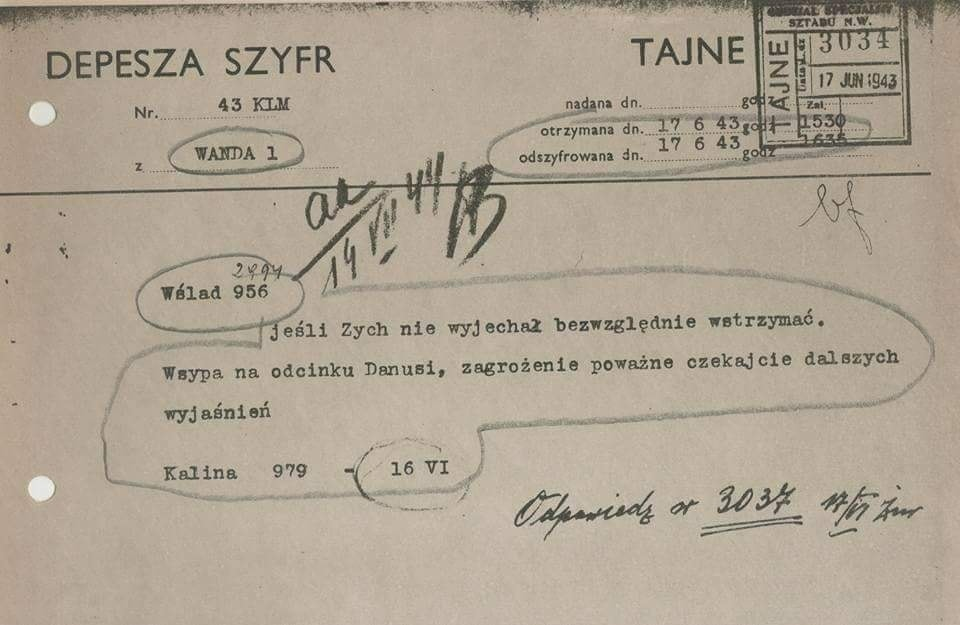  

### 1942

Niszczyciel eskortowy ORP „Kujawiak” zatonął po wejściu na minę u wybrzeży Malty. Zginęło 13 członków załogi, a 12 zostało rannych.

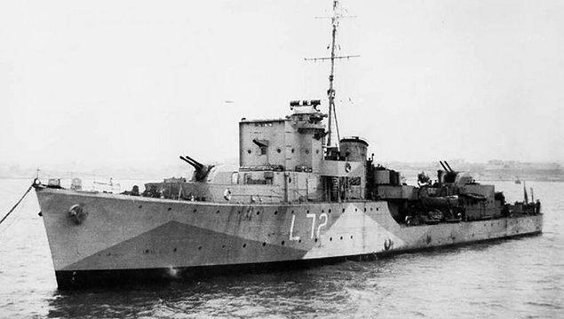  

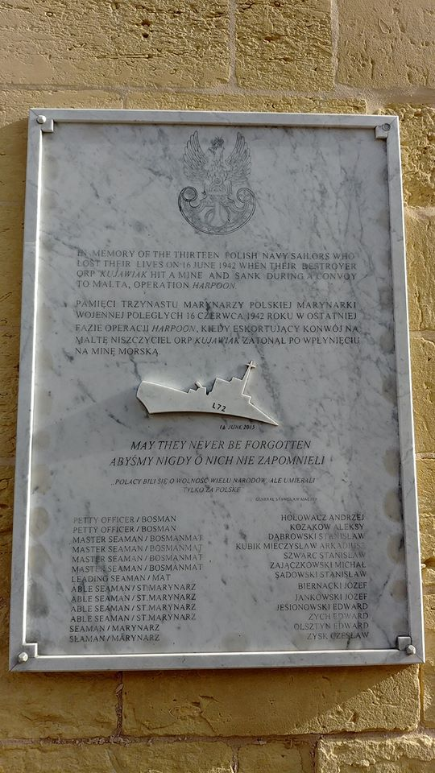  

### 1940

10 Brygada Kawalerii Pancernej pod dowództwem generała Stanisława Maczka stoczyła z Niemcami walkę o francuskie miasto Montbard. Wojska polskie osłaniały w ten sposób odwrót wojsk francuskich w kierunku Kanału Burgundzkiego. Działanie Polaków przyniosło efekt w postaci wyparcia Niemców z Montbard. Straty polskie wyniosły - 17 poległych i 30 rannych żołnierzy oraz trzy czołgi. Po stronie niemieckiej zginęło 60 żołnierzy, kilkunastu wzięto do niewoli.
Mimo to zwycięska bitwa nie umożliwiła
zdobycia przepraw a przerzucony most
został wysadzony w powietrze. Gen.
Maczek zdecydował się zatem opuścić
miasto.

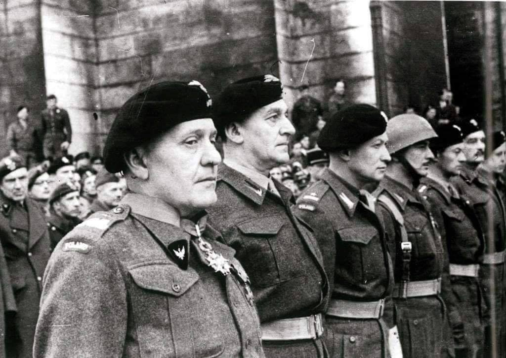  

### 1922

Do Piekar Śląskich wkroczyły oddziały Wojska Polskiego pod dowództwem generała Stanisława Szeptyckiego. Do miasta wjechali zarówno Ułani jak i piechota.
Polacy zostali uroczyście powitani przed Bazyliką Najświętszej Maryi Panny.

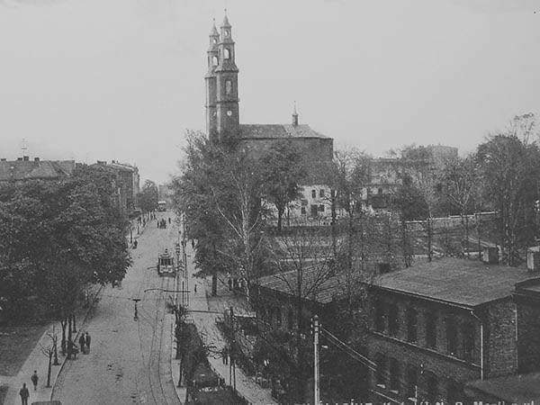  

### 1920

Na uwagę zwraca ostatnia strona, gdzie jest reklama "Pożyczki Odrodzenia". Promowano ją jako "obowiązek obywatelski" i każdy dostawał pamiątkowy medal 🤔 A zgadnijcie kto obsługiwał tą pożyczkę? "Polsko-Amerykańskim Union Liberty Bank".

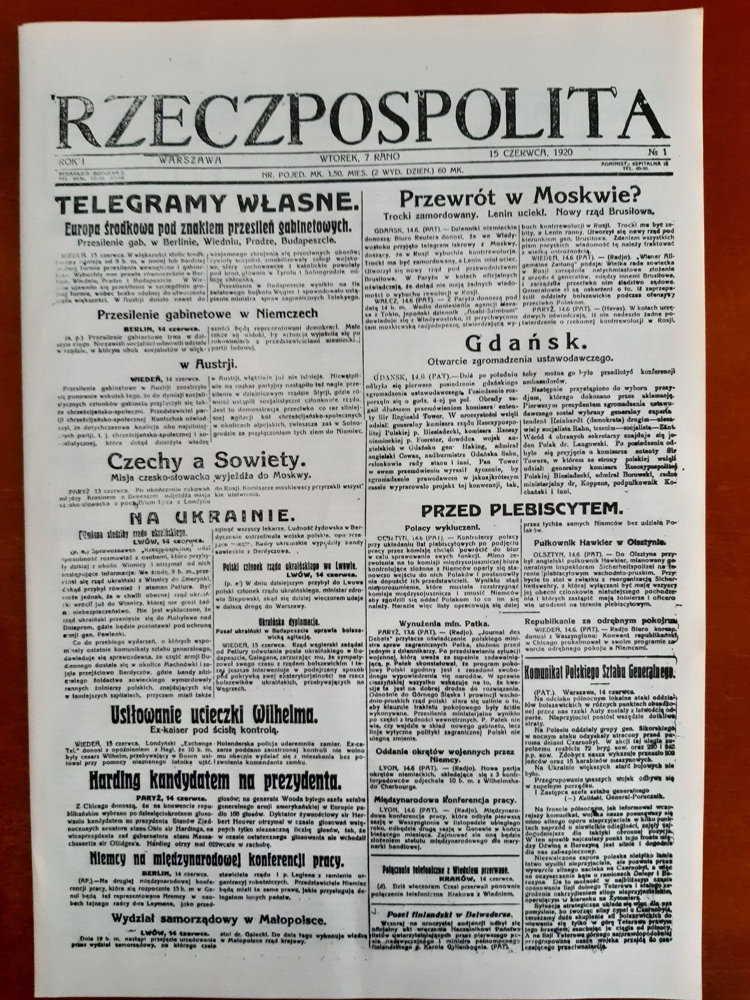  

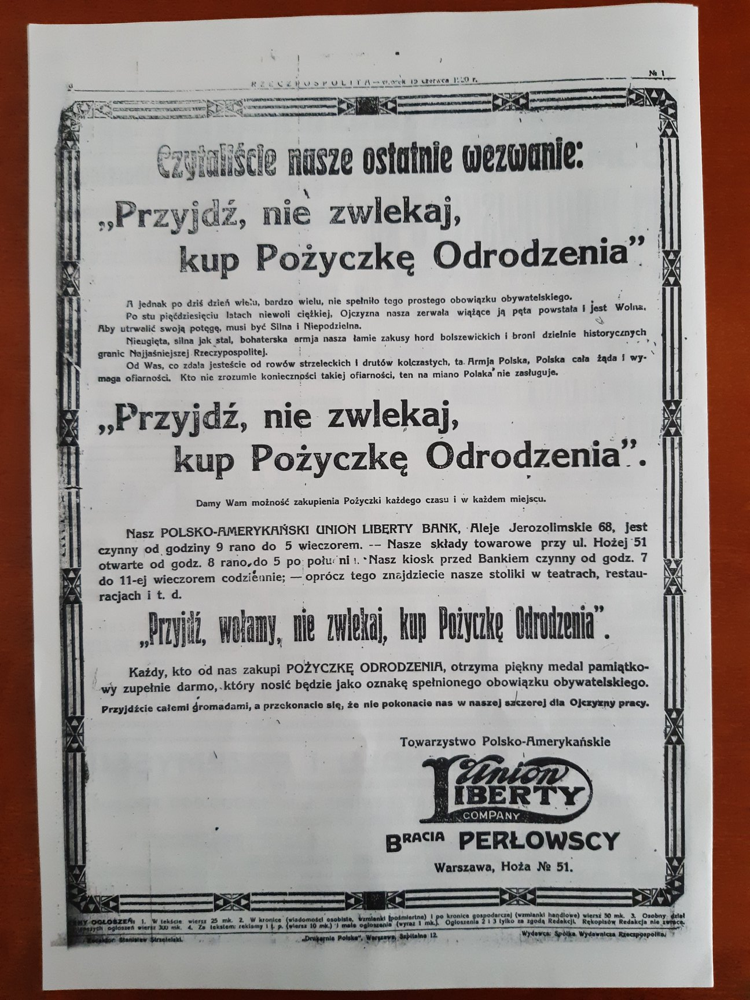  

### 1915

W czasie pierwszej wojny światowej II Brygada Legionów Polskich pod dowództwem generała Józefa Hallera zwana również "żelazną brygadą" stoczyła pod Rarańczą w obwodzie czerniakowskim krwawą bitwę z piechotą rosyjską. Była to pierwsza z dwóch bitew stoczonych w czasie tej wojny w tym miejscu. Druga bitwa pod Rarańczą miała miejsce w 1918 roku.

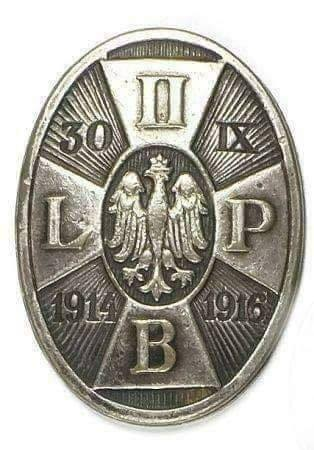  

### 1775

Wojna o niepodległość Stanów Zjednoczonych: zwycięstwo Brytyjczyków w bitwie o Bunker Hill.
Bitwa pod Bunker Hill znana jest również dzisiaj pod nazwą bitwy pod Breeds Hill. Pomimo iż w porównaniu z bataliami toczonymi na kontynencie europejskim można ją zaliczyć do niewielkich potyczek, to jednak miała ona kapitalne znaczenie dla dalszego rozwoju sytuacji w konflikcie Wielkiej Brytanii z kolonistami w Ameryce Północnej. Była bowiem pierwszą bitwą wojny, której efektem było uzyskanie niepodległości przez Stany Zjednoczone - państwo które w ciągu ponad 200 lat rozwoju stało się jedną z największych potęg światowych. Z punktu widzenia historii sztuki wojennej natomiast Bunker Hill zyskało wymiar niemal legendarny, w którym słynna niezwyciężona brytyjska piechota została w zasadzie upokorzona i to nie przez doborowe pułki kawalerii czy piechoty, lecz przez prostych farmerów i myśliwych, których na szańce wzgórza powiodły ideały aktualne również do dzisiaj.
ojna o niepodległość Stanów Zjednoczonych ma dość oryginalny charakter. Była to właściwie wojna w której przeciwko Anglikom uznającym rząd w Londynie, walczyli Anglicy osiedleni przed laty w koloni zamorskiej, którzy zaprzestali uznawać ten rząd. Gdyby konflikt nie zakończył się zwycięstwem Amerykanów, zapewne nazywano by go wojną domową w koloniach lub po prostu rebelią czy buntem kolonistów. W mojej opinii najlepszą nazwą jest jednak Rewolucja Amerykańska. Nie była to bowiem wojna jedynie w celu uzależnienia się od Korony Brytyjskiej. Walce o niepodległość towarzyszyły też ideały liberalizmu zarówno ekonomicznego jak i politycznego, które po odniesieniu zwycięstwa pomogły zbudować największą potęgę militarną i ekonomiczną na świecie.
W 1764 dobiegła końca wojna siedmioletnia z której Wielka Brytania wychodzi zwycięsko zdobywając na Francuzach Kanadę. Wojna była jednak bardzo kosztowna i imperium musiało zaciągną spory dług publiczny. Po zakończeniu działań wojennych Londyn zdecydował się przerzucić ciężar spłacenia długu na obywateli w koloniach zamorskich. Zwiększający się nacisk fiskalny, powodował coraz szersze niezadowolenie . Koloniści zarzucali więc rządowi w Londynie iż łamie prawa, ograniczając wolności ekonomiczne swoich obywateli w Ameryce. Starali się również przekonać rząd do ustępstw stosując inne formy protestu z których najskuteczniejszy był bojkot towarów pochodzących z metropolii. Londyn jednak uzasadniał swoją politykę względami historyczno - ekonomicznymi. Starano się zatem wdrażać w życie doktrynę głoszącą iż obciążenie kolonii jest koniecznością wynikającą z potrzeby zapewnienia im należytej ochrony. Zatem za wojnę z Francuzami i Indianami powinni zapłacić w szczególności koloniści, skoro podczas konfliktu pozostawali w bezpośrednim zagrożeniu wroga a Wielka Brytania prowadząc wojnę zapewniała im przecież ochronę. Koloniści wszakże wojny tej nie rozpoczęli, stąd ta absurdalna teza spotkała się jedynie z krytyką i oburzeniem. Obecnie jak wiemy równie absurdalne teorie uzasadniające niszczący gospodarkę fiskalizm, słyszymy często z ust rodzimych polityków i niestety nie towarzyszy temu aż tak powszechna krytyka społeczna. Być może jednak jest tak, iż osiemnastowieczni koloniści, byli od nas Ź żyjących obecnie znacznie mądrzejsi i potrafili zjednoczyć się i skutecznie przeciwstawić rządowemu bezprawiu.
Do najważniejszych ustaw tego okresu wydanych przez Parlament Brytyjski należał Sugar Act - z 1764r, który wprowadził wysokie stawki ceł na eksportowaną trzcinę cukrową oraz Stamp Act z 1765 r , którym opodatkowano dosłownie wszystko w koloniach co można było wydrukować od gazet po karty do gry oraz wszelkie dokumenty. Oba akty w znacznym stopniu prowadziły do ograniczenia możliwości gospodarczych kolonii i stanowiły ogromne obciążeniu dla tak młodego organizmu, który posiadał stosunkowo niewielkie siły wytwórcze. Spowodowały one znaczne zaostrzenie stosunków pomiędzy kolonistami a reprezentacją rządu w Londynie. W koloniach w ramach oporu Ź starano się na wszelkie sposoby niewelować skutki ustaw podatkowych, organizując przemyt i czarny rynek. Odpowiedzią na to było wprowadzenie do Bostonu silnego garnizonu angielskiego oraz akcje policyjne. Konfiskowano zatem przemycane towary oraz dokonywano częstych rewizji statków. Na tym tle doszło w marcu 1770r. do pierwszych poważnych zamieszek gdzie padły pierwsze ofiary śmiertelne. Oburzeni na zachowanie żołnierzy mieszkańcy Bostonu zaatakowali kamieniami Urząd Celny. Wartownicy oraz pluton żołnierzy którzy nadeszli im z pomocą, otworzyli ogień do protestujących zabijając 3 osoby i raniąc 6. Wydarzenie to nazwano przesadnie "masakrą w Bostonie".
Koloniści uważali zatem iż polityka Londynu jest nie tylko dla nich krzywdząca ale i bezprawna. Zgodnie z hasłem "No taxation without representation!" ( żadnych podatków bez reprezentacji ) domagali się w szeregu petycji, zaprzestania stosowania arbitralnego prawa w stosunku do nich i przyzwolenia na posiadanie reprezentacji w Parlamencie. Londyn nie zamierzał jednak iść na jakiekolwiek ustępstwa nie przejmując się możliwością jakiegoś zorganizowanego sprzeciwu obywateli w koloni. Pomimo dokonanych obciążeń podatkowych na gospodarkę amerykańską, dochody Korony Brytyjskiej były nikłe w porównaniu do tych jakie oczekiwano uzyskać, czy też jakie, ze względu na dziurę budżetową, należało uzyskać.
W związku z tym rząd posunął się jeszcze dalej i w 1773r. przyznał Kompanii Wschodnio Indyjskiej licencję na przywóz do Ameryki pół miliona funtów herbaty, której już nigdzie indziej nie dawało się sprzedać. Kompania Wschodnio Indyjska Ź była rzecz jasna państwowym tworem mającym rzekomo za cel ochronę rynku herbaty przed spekulacjami, podczas gdy w rzeczywistości była swoistym narzędziem fiskalnym. Wraz z licencją Kompania otrzymała również szereg różnych ulg prawnych z których najważniejszym było zwolnienie jej z wszelkich podatków. Dawało to Kompanii znaczną przewagę nad kupcami w koloniach i umożliwiało w przyszłości zmonopolizowanie handlu herbatą w Ameryce. Autor tego pomysłu Lord North uważał podobno iż koloniści zaakceptują go gdyż pozwoli im to na zakup znacznie tańszego produktu, po wyeliminowaniu pośredników. Koloniści jednakże pojęli prawdziwe intencję Tea Act, który był jawnym pogwałceniem zasady równości wobec prawa i prowadzić mógł bezpośrednio do zrujnowania rodzimego handlu. Sprawę herbaty zaliczono zatem na poczet kolejnego bezprawia Londynu, zmierzającego do zarobienia na koloniach sporych sum kosztem ruiny lokalnych kupców. Odpowiedzią był zatem bojkot herbaty w czym czynny udział brały również kobiety Ź jako przecież główny nabywca tego towaru.
W wielu portach natomiast urządzono demonstracje zmuszając kapitanów statków do żaglowania z powrotem do Anglii wraz z �tanią" herbatą. 16. XII 1773r. w Bostonie natomiast koloniści przebrani za Indian z plemienia Mohawk, wdarli się na pokłady statków i wyrzucili całą herbatę prosto do morza. Wydarzenie to, które przeszło do historii pod żartobliwą nazwą " Boston tea party" dało przykład mieszkańcom innych portów, którzy starali się dokonywać podobnego sabotażu. W wyniku tych akcji, cała sprawa interesu herbacianego zakończyła się oczywistą porażką metropolii.
Wyrzucenie herbaty do morza w Bostonie spotkało się jednakże z ogromnym oburzeniem rządu w Londynie, jak również samego króla Jerzego III, który doszedł do wniosku iż taka niesybordynacja godzi w jego autorytet. Wezwał więc rząd do wszczęcia stosownych kroków mających na celu przymuszenie kolonistów do posłuszeństwa. Na apel króla, parlament brytyjski uchwalił cztery ustawy restrykcyjne a do jednej już istniejącej, a dotyczącej zasad kwaterowania wojska, wprowadził poprawki uwzględniając w niej sprawę koloni. Ustawy te parlamentarzyści nazywali prawami przymuszającymi, koloniści zaś nadali in wspólną nazwę Intolerable Acts Ź ustaw nie do przyjęcia. Ustawy te dotyczyły poszczególnych zapalnych kwestii. Pierwsza "Boston Port Bill" zamykał port w Bostonie i nakładał obowiązek zwrócenia wszelkich szkód związanych z "tea party ". Drugi dotyczył zasad wymierzania sprawiedliwości i nakazywał każdego urzędnika brytyjskiego oskarżonego o jakiekolwiek przestępstwo Ź sądzić jedynie na terenie Anglii. Ustawa o rządzie w stanie Massachussets pozbawiła uprawnień tamtejszą radę miejską i oddała całą władzę nad stanem w ręce gubernatora. Czwarty aktem natomiast przekazano część terytoriów północnych stanów Kanadzie, zmniejszająć terytorium kraju.
Akty te a w szczególności nakaz kwaterunku oraz zamknięcie portu w Bostonie wywołały wrzawę w koloniach. Boston był bowiem najważniejszym portem handlowym kolonii zapewniającym jej gospodarczą egzystencję. Sami mieszkańcy Bostonu zwrócili się do sąsiednich stanów z prośbą o pomoc, nawołując do zawieszenia handlu z metropolią. We wrześniu 1774 zorganizowano natomiast kongres przedstawicieli prowincji w Filadelfii, którzy uzgodnili wspólną polityę względem Londynu. Ustalono między innymi, iż porozumienie z metropolią może mieć miejsce jedynie w razie odwołania krzywdzących ustaw w związku z czym, kolonie miały podjąć zorganizowany opór polegający przede wszyskim na bojkocie towarów brytyjskich. W tym cely wydano rezolucję zobowiązującą wszystkich kupców do bojkotu towarów pochodzenia angielskiego. W razie interwencji zbrojnej nakazano zorganizowanie milicji złożonej z obywatelii, która mogłaby w ciągu krótkiego czasu stać się zalążkiem sił zbrojnych. W tym celu nakazano składowanie broni i zorganizowanie magazynów wojskowych. Dyrektywy kongresu weszły w życie i już po kilka tygodniach w wielu stanach istniała zorganizowana milicja oraz magayzny broni.
Brytyjczycy nie zamierzali jednak przyzwolić na tego rodzaju działania. Głównodowodzący siłami angielskimi w kolonii, generał Thomas Gage nakazał zorganizowanie akcji przeciwko magayznom broni. W ten sposób doszło do pierwszych starć zbrojnych z kolonistami jakimi były potyczki pod Lexington i Concord. Otrzymawszy rozkaz zniszczenia magazynu broni w Concord, pułkowinik Smith z oddziałem około 600 ludzi 18 kwietnia 1775r. pomaszerował do miejscowości Lexington, gdzie jednak oczekiwała na niego grupa milicji. Taki stan rzeczy wyniknął z faktu iż planów generała Gage nie udało się zachować w tajemnicy i koloniści dowiedzieli się o nich od mieszkańców Bostonu zatrudnionych przy wojsku. Pod Lexington napotkana milicja oddała w kierunku żołnierzy kilka strzałów, a żołnierze odpowiedzili ogniem zabijając 7 ludzi. Milicja wycofała się a wojsko kontynuowało marsz do Cocord. W Concord nie niepokojony przez nikogo pułkownik Smith znalazł magazyn broni i żołnierze zniszczyli ją wraz z nagromadzonymi zapasami żywności. Kiedy po zakończeniu tych działań, żołnierze rozpoczeli posilać się do osady weszła niespodziewanie grupa milicji w sile około 400 ludzi. Brytyjczycy pierwsi otworzyli ogień zabijając 2 ludzi. Milicjanci również otworzyli ogień zabijając 3 i raniąc 8 żołnierzy, po czym wycofali się w nieładzie. Dowódca angielski ruszył prędko w drogę powrotną. W czasie marszu jednak do odziału otwierano raz co raz ogień z okolicznych osad. Postanowiono bowiem w stan gotowości całą milicję, która obsadziła rejon drogi do Bostonu. Oddział brytyjski ostrzeliwywany z okien domów, lasów i zarośli odpowiadał ogniem, jedakże przeciwnik nie zamierzał wdawać się w bitwę w polu. Nieprzygotowani na taki sposób partyzantckiej lub też indiańskiej walki żołnierze ponosili straty i od zniszczenia uratowało ich wyjście naprzeciw innego oddziału brytyjskiego w sile 1200 ludzi i z dwoma działami, którymi udało się osłonić odwrót pułkownika Smitha do osady Charlestown. Walka dobiegła końca. Brytyjczycy stracili 73 zabitych i 174 rannych. Koloniści mieli 49 zabitych i 41 rannych. Były to pierwsze ofiary tej wojny. Smith zrelacjonował potem jakoby koloniści dopuścili się okrucieństw na zabitych i rannych, skalpując ich. Nie wiadomo czy jest to prawda, historycy amerykańscy jednak przeczą temu.
Skutkiem potyczek pod Lexington i Concord w kolonistach wzrosło poczucie zagrożenia przed możliwymy akcjami wojska,które stacjonowało w Bostonie. Pragnąc nie dopuścić do podobnej ekspedycji żołnierzy Korony, do prowincji zaczęli przybywać uzbrojeni ochotnicy formując się w kolejne oddziały milicji. Wokół Bostonu wkrótce zebrało się kilka tysięcy ludzi. Nie była to jednak jakaś zorganizowana armia, nie posiadała jednego dowództwa ani jakiekogoś konkretnego planu działania. Generalnie zamierzano oblegać Boston ale jak się wydaje pomysł ten pojawił się później, a początkowo raczej kierowano się chęcią zablokowania tylko garnizonu w tym mieście. W tym czasie Brytyjczycy nie podjęli jednak żadnych przeciwakcji oczekując na posiłki.
Dowódca wojsk brytyjskich, znajdujących się w rejonie Bostonu, generał Thomas Gage po potyczkach oddziału pułkownika Smitha zdał sobie sprawę iż jego położenie jest coraz bardziej poważne. Gromadzące się w prowincji oddziały kolonistów rosły z dnia na dzień i praktycznie Boston był oblężony. Miasto zresztą zostało ufortyfikowane i przygotowane do odparcia szturmu. Gage wysłał jednak wcześniej już prośbę o pilne posiłki i otrzymał je jeszcze pod koniec maja, gdy przybyły niewielkie oddziały generałów majorów Johna Burgone, Henry Clintona i Williama Howe. Rząd w Londynie, zlekceważył bowiem jego raporty i uznał iż sytuacja nie może być aż tak dramatyczna. W takiej sytuacji Gage po naradzie z kolegami postanowił podjąć próbę przełamania oblężenia. Nie było jednakże możliwości zachowania czegokolwiek na temat planów militarnych w tajemnicy przed kolonistami, ponieważ w mieście większość obywateli odnosiła się do wojsk Korony nieprzyjaźnie i jawnie wyrażała sympatie dla �rebeliantów". Amerykanie byli zatem informowani niemal o każdym ruchu Brytyjczyków i również przygotowania do wzmocnienia miasta i planowana ofensywa nie uszły ich uwadze. 15 czerwca koloniści dowiedzieli się o planowanym opanowaniu terenu półwyspu na którym znajdowała się osada Charlestown - teren pomiędzy rzeką Mystic a rzekę Charles. Równocześnie Brytyjczycy planowali również zajęcie Dorchester Heigst, tak by zabezpieczyć Boston przed ewentualnym atakiem od południa.
Będąc uprzedzonym o planowanej akcji, koloniści postanowili ufortyfikować wzgórze Bunker Hill, z którego mogliby ostrzeliwać wojska brytyjskie próbujące złamać blokadę lądową półwyspu oraz kontrolować sytuację. Do dzisiaj nie bardzo wiadomo, dlaczego, zamiast na Bunker Hill, rozpoczęli budowę fortyfikacji na Breeds Hill. Bunker Hill było wysokim wzgórzem, jednak nie było położone bezpośrednio przy liniach wroga, natomiast Breeds Hill, chociaż było wzgórzem niższym, położone było tuż przy granicy osady Charlestown. Stąd przypuszcza się że, albo koloniści ze względu na brak dokładnych map, pomylili wzgórza, lub też iż nie dbając o dyscyplinę przy realizacji rozkazu Ź kierujący pracami William Putnam sam zdecydował o budowaniu umocnień na wzgórzu będącym w bezpośrednim sąsiedztwie pozycji wroga. Umieszczając baterię na Breeds Hill można było bowiem bombardować Brytyjczyków w Bostonie. Wiązało się to jednakże z większym ryzykiem wykrycia prac fortyfikacyjnych.
W nocy z 16 na 17 czerwca koloniści starając się zachować jak największą ciszę rozpoczęli budowanie swoich umocnień na Breeds Hill. Ze względu jednak na bezpośrednie sąsiedztwo pozycji z pozycjami brytyjskimi Ź zostali nad ranem 17 czerwca dostrzeżeni przez okręty wojenne wroga. Ostrzelały one kilkoma salwami pracujących na Breeds Hill kolonistów, którzy ponieśli jednak nieznaczne straty i kontynuowali kopanie okopów i wznoszenie szańców.
Zaalarmowany generał Gage, od razu zdał sobie sprawę iż nie można dopuścić do umocnienia się na wzgórzu kolonistów. Zdecydował się przy tym na dość ryzykowną akcję przeciwko pozycjom nieprzyjaciela, jaką miał być szturm wzgórza. Gage miał nadzieję iż frontalny atak na pozycje kolonistów zmieni również ich nastawienie wojenne. Nie spodziewał się bowiem aby wojsko złożone z farmerów i rzemieślników mogło w jakikolwiek sposób mierzyć się z doskonale wyszkolonymi i wyposażonymi żołnierzami Armii Brytyjskiej. Liczył zatem iż odnosząc zwycięstwo w ten sposób uzyska zarówno korzyści militarne jak i polityczne Ź łamiąc ducha bojowego rebelii. Stąd nie zdecydował się na obleganie wzgórza chociaż miał przecież zarówno dość armat jak i ludzi. Dysponował też flotą, która panowała w zatoce i mogła kontrolować co się dzieje na półwyspie. Nie posłuchał również rad generała Clintona, który sugerował odcięcie kolonistów znajdujących się na wzgórzu od pozostałych wojsk zgromadzonych wokół Bostonu poprzez zaatakowanie i zajęcie wąskiego pasa terenu łączącego półwysep z lądem Ź tzw "Charlestown Neck". Gage uparł się jednak na wzięcie wzgórza szturmem przez piechotę.
W południe zatem na barkach Brytyjczycy rozpoczęli przerzucać swoje siły z Bostonu na półwysep Charlestown. Dowództwo nad żołnierzami mającymi zaatakować wzgórze objął generał William Howe. "Zobaczyliśmy około 40 barek wyładowanych Regularnymi ... mogło w nich być około 3000 żołnierzy wroga przeciwko nam, których było 700 i około 500 nadchodzących posiłków. Nieprzyjaciel wylądował na brzegu i ustawił się frontem do nas w podłużnych czworobokach ( ...) wspominał potem Peter Brown Ź jeden z obrońców Breeds Hill. W rzeczywistości Brytyjczycy wylądowali początkowo na Charlestown w sile ok. 1500 żołnierzy wraz z 12 armatami. Planowali zaatakować pozycje kolonistów dwoma kolumnami Ź jedną na centrum pozycji, drugą na lewe skrzydło.
Dowodzący na wzgórzu natomiast pułkownik William Prescott dysponował milicją w sile około 1000 ludzi Ź w większości byli to koloniści z Massachusetts skąd pochodził zresztą również ich dowódca. Siły te zostały wzmocnione kolonistami z New Hampshire którymi dowodził John Stark oraz grupą milicji z Connecticut którą przyprowadził Irael Putnam. Część posiłków nadeszło przed a część już w czasie trwania bitwy. W ten sposób łączna ilość wojsk kolonistów wyniosła około 1500 ludzi i prawdopodobnie 6 armat. Koloniści nie stanowili faktycznie żadnej regularnej armii. Były to bowiem formacje milicji z trzech prowincji - nie mające wielkiego doświadczenia w profesjonalnej walce i uzbrojone często w broń myśliwską. Tylko niewielki procent posiadał bagnety. W skład milicji wchodzili jednak zazwyczaj dobrzy strzelcy zaprawieni w polowaniach i walce z Indianami. Niektórzy natomiast byli weteranami wojny angielsko - francuskiej w Kanadzie. Takim był jeden z bohaterów tej bitwy Ź 70 letni Seth Pamerey Ź który posiadał stopień generała armii brytyjskiej i walczył po stronie kolonistów jako zwykły żołnierz ze starym muszkietem z wojny angielsko francuskiej. Innym był doktor Joseph Warren Ź szanowany powszechnie i znany obywatel Bostonu, który posiadał stopień generała, lecz był bez przydziału Ź zgodził się jednak walczyć pod pułkownikiem Prescottem w którym rozpoznał zdolnego dowódcę. Pomimo ostrzału z okrętów, kolonistom udało się zbudować część prowizorycznych fortyfikacji: niewielką redutę, okopy i kamienno Ź ziemne wały Ź które umożliwiały im osłonę podczas prowadzenia walki ogniowej z nadchodzącą piechotą, która nie mogła liczyć na taki komfort.
Około godziny 15.00 rozpoczął się główny atak. Jak wspominało potem wielu żołnierzy brytyjskich ,nikt się specjalnie nie przejmował kolonistami. Liczona raczej iż wystraszą się oni Brytyjczyków niż podejmą jakąś zorganizowaną obronę. Żołnierze angielscy więc maszerowali powoli pod górę, niczym na paradzie, w zwartych szeregach, mając zatknięte bagnety i często nawet nie załadowane karabiny. Koloniści natomiast widząc zbliżającą się powoli masywną kolumnę, przygotowali się za prowizorycznymi umocnieniami, lecz nie strzelali. Wówczas bowiem padł prawdopodobnie z ust pułkownika Prescotta słynny rozkaz "Don't shoot until you see the whites of their eyes." ( Nie strzelajcie aż nie zobaczycie białek ich oczu ). Rozkaz ten wynikał prawdopodobnie z ograniczonej ilości posiadanej przez kolonistów amunicji oraz z faktu iż większość niezdyscyplinowanych i niedoświadczonych rebeliantów strzelałaby nawet na odległość poza skutecznym zasięgiem ognia. Rozkaz ten udało się wykonać dzięki oczywiście specyficznym formom perswazji : porucznik James Dana, zapowiedział zatem iż osobiście zastrzeli każdego, kto otworzy ogień przed komendą. W ten sposób powoli idąca niczym na paradzie kolumna angielska dotarła na odległość 50 jardów od pozycji amerykańskich. W tym momencie po stronie kolonistów, padła komenda do otwarcia ognia. Morderczy oraz prowadzony z bliskiej przecież odległości precyzyjny ogień jaki spotkał kolumnę angielską był dla niej zupełnym zaskoczeniem. Brytyjczycy padali na ziemię jeden po drugim, nie mając żadnej możliwości na zorganizowanie własnego ognia ani nie mogąc iść naprzód pod takim ostrzałem. Straciwszy wielu zabitych i rannych w ciągu kilku minut, Brytyjczycy rzucili się do odwrotu. Ten sam los spotkał kolumnę próbującą obejść i zaatakować lewe skrzydło pozycji amerykańskich.
Atak piechoty został odrzucony, jednak Brytyjczycy nie zamierzali zrezygnować. Angielscy dowódcy rozumieli bowiem, iż pomimo błędu jaki popełniono, obecnie nie można się już wycofać. Odstąpienie od szturmów i przejście np. do taktyki regularnego oblężenia oznaczało by utratę reputacji angielskiej armii. Nie minęło zatem nawet piętnaście minut, gdy rozbite i rozproszone wojsko angielskie, znowu stało u podnóża wzgórza, z rozkazem ponownego ataku. Ponownie zatem Brytyjczycy ruszyli do natarcia, mijając po drodze ciała swoich poległych lub rannych kolegów. Atakowali na kierunku reduty oraz fleszów. Efekt był dokładnie taki sam jak poprzednio, w morderczym ogniu, ponosząc ogromne straty, po oddaniu kilku salw, słynna czerwona linia, rozpadła się i żołnierze zaczęli w nieładzie zbiegać ze wzgórza. Ponownie wiele ciał poległych i rannych zaległo przedpole.
Brytyjskie dowództwo nadal jednak nie zamierzało zakończyć szturmów. Stawką była bowiem reputacja armii. Obie strony wykazały zatem ogromną desperację. Trzeci atak przeprowadzono dopiero po godzinie, kiedy przybył generał Clinton z posiłkami 900 ludzi. Opierając dwa poprzednie ataki, koloniści wyczerpali niemal zupełnie zapasy amunicji, jednakże zamierzali dalej się bronić. Brytyjczycy nie wiedzieli zresztą iż ich przeciwnik jest w takim krytycznym położeniu, co podkreśla ich wielką determinację. Trzei atak skierowano już tylko na główną redutę milicji na wzgórzu Breeds Hill, pozorując jedynie manewr oskrzydlenia na prawej flance. Zbliżająca się po raz trzeci kolumna angielska, ponownie z bliskiej odległości została powitana salwami muszkietów, jednakże ogień nie był już tak zmasowany jak poprzednio. Przeczuwając iż moment jest odpowiedni, Howe wydał rozkaz do ataku na bagnety i żołnierze rzucili się biegiem na pozycje amerykańskie. Koloniści starali się stawiać pewien opór używając nielicznych muszkietów z bagnetami lub po prostu walcząc kolbami, jednakże nie mogli w takiej sytuacji równać się z umiejętnościami wroga. Wobec tego rozpoczęli odwrót Ź który był mniej lub bardziej zorganizowany. Nie była to jednakże bezwładna ucieczka, ponieważ cześć milicji osłaniała cofających się kolegów, jak np. generał Warren, który dostał postrzał w głowę gdy przeładowywał swój muszkiet, przygotowując się do ostatniej salwy. Brytyjczykom nie udało się dogonić wroga, jednakże oddali parę salw, co przysporzyło pewne straty Amerykanom.
Bitwa zakończyła się około 17.30. Brytyjczycy zajęli wzgórze i zdobyli armaty. Straty ich były jednak ogromne i wyniosły od 700 do 1200 zabitych i około 900 rannych. Wynosiły zatem niemal 45 % żołnierzy których zaangażowano w tej bitwie. Generał Clinton miał potem podsumować to zwycięstwo cytując słynny od starożytności zwrot : " Jeszcze jedno takie i jesteśmy zrujnowani" ( przypisywany rzekomo królowi Pyrrusowi przez historyków rzymskich ) W bitwie zginął dowódca piechoty morskiej major John Pitcairn, zastrzelony wg legendy przez czarnoskórego Petera Salem Ź który był wyzwolonym niewolnikiem i walczył po stronie koloni. Straty kolonistów były natomiast niewielkie i zadano je głównie już w ostatniej fazie bitwy oraz podczas odwrotu. Oblicza się iż Amerykanie utracili około 453 żołnierzy Ź w tym 139 zabitych, 278 rannych i 36 zaginionych. Około jednak 70 % żołnierzy wyszło cało z bitwy i bezpiecznie przedostało się do pozostałych sił.
Jak widać Brytyjscy generałowie popełnili w tej batalii szereg błędów których efektem były bardzo wysokie straty wśród żołnierzy i oficerów. Głównym błędem, było oczywiście zlekceważenie przeciwnika oraz jak się wydaje, stawianie wyżej kwestii prestiżowych od zasad taktyki. Za utrzymanie dobrej reputacji brytyjskiej armii, około 1000 żołnierzy straciło życie. Gdyby amerykanom na Breeds Hill nie skończyła się amunicja zapewne odparto by kolejne ataki. Nie wiadomo czy wówczas generałowie angielscy zmienili by zdanie, czy kontynuowali szturmy aż do wyczerpania sił własnych.
Bitwa pod Bunker Hill, nie będąca przecież wielką batalią, lecz przy warunkach europejskich Ź jedynie potyczką, miała kapitalne znaczenie dla losów dalszej wojny w Ameryce Północnej. Pomimo iż formalnie przyniosła ona klęskę kolonistom, dała ona im jednak znaczniej więcej korzyści niż szkód. Bardzo szybko stała się legendą Ź przypominającą iż koloniści potrafią walczyć i pokonanie Wielkiej Brytanii jest możliwe własnymi siłami. Koloniści bowiem uważali, iż nie pokonała ich w bitwie wcale armia brytyjska lecz brak amunicji. Bitwa przyniosła im również pewne polityczne korzyści. Usłyszały o niej społeczeństwa państw europejskich, w których zaczęto sympatyzować z "rebeliantami", a co dziwne również w Anglii, część społeczeństwa odwróciła się od polityki Korony, która przecież przemocą stara się spacyfikować nie kogo innego, lecz własnych pobratyńców. W sytuacji Bostonu Ź bitwa nie przyniosła Brytyjczykom również oczekiwanych rezultatów. Generał Gage został wkrótce odwołany do metropolii a dowództwo przejął generał Howe. Był on jednakże pod wrażeniem bitwy w której przecież osobiście prowadził żołnierzy do ataku ( nigdy więcej tego nie ważył się już praktykować ) i nie zdecydował pomimo formalnego zwycięstwa na dalsze akcje ofensywne. Nie zajął również Dorchester Heigst. W efekcie w marcu wczesnym rankiem Brytyjczyków w Bostonie obudziły kanonady dział zabranych przez kolonistów z Fortu Ticonderoga i przeniesionych właśnie na Dorchester Heigst. W tej sytuacji będąc pod ostrzałem dowództwo brytyjskie uznało iż sytuacja jest beznadziejna. Wojsko angielskie spakowano i załadowano na okręty, na których odpłynęło z Bostonu do Halifax. Wojna o niepodległość Stanów Zjednoczonych miała się jednakże dopiero rozpocząć.

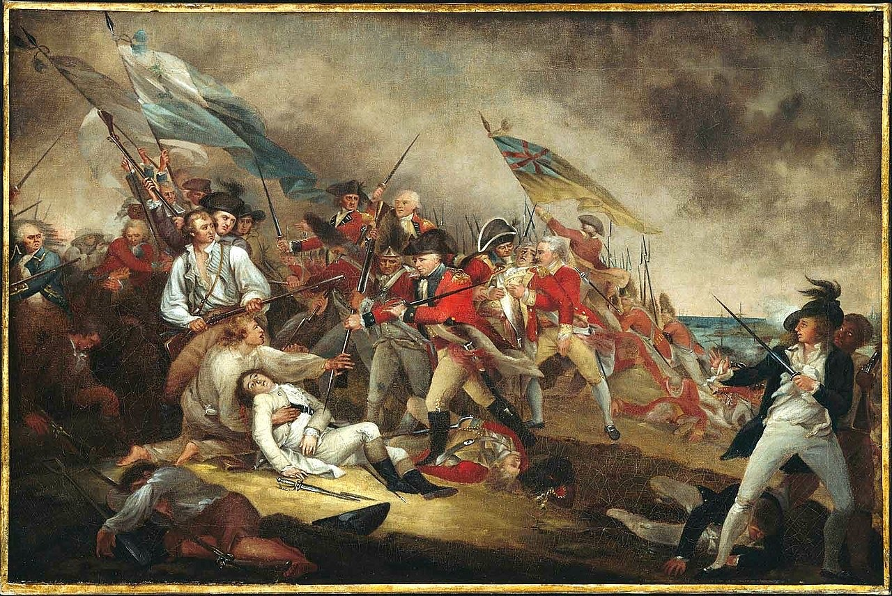  

### 1487

Odbyła się bitwa na Stoke Field - ostatnie duże starcie zbrojne Wojny Dwóch Róż.
Po porażce i śmierci króla Ryszarda III pod Bosworth w 1485 roku, pełnia władzy przeszła w ręce Henryka Tudora, który szybko koronował się jako Henryk VII i dla zakończenia wojny domowej poślubił Elżbietę York, córkę Edwarda IV. Ten pojednawczy krok nie przekonał jednakże wszystkich zwolenników Yorków i ci zaczęli poszukiwania własnego kandydata na tron. Na pierwszy plan wybijała się automatycznie sylwetka 12-letniego Edwarda, Earla Warwick i bratanka Ryszarda III oraz Edwarda IV, ale tkwił on w więzieniu Tower i szanse jego wyzwolenia były znikome. John de la Pole, Earl Lincoln oraz kuzyn Warwicka (był on także mianowany przez Ryszarda III na następcę) postanowił stworzyć w tej sytuacji stworzyć "fałszywego Edwarda".
Stał się nim także 12-letni plebejusz Lambert (lub według innych John) Simnel, uderzająco podobny do Yorka. Już od 1485 został wypatrzony i szkolony przez księdza Richarda Symondsa z zasad dworskiej etykiety i wiedzy ogólnej o królestwie. Na początku 1487 roku został przedstawiony Lincolnowi, a ten natychmiast rozpoznał w nim swego cudownie zbiegłego z Tower kuzyna. Zaraz potem, 19 marca, oboje musieli salwować się wraz z nielicznymi poplecznikami ucieczką na kontynent. Schronienie znaleźli u wdowy po księciu Burgundii Karolu Zuchwałym, siostry Ryszarda III, Małgorzaty. Do portu w Mechelen, gdzie przebywali wygnańcy, dwór burgundzki wysłał w ramach wsparcia 2 000 niemieckich i szwajcarskich najemników pod urodzonym w Augsburgu weteranem Martinem Schwartzem. Wkrótce pojawili się także Sir Richard Harleston Wicehrabia Lovell i przywódca garnizonu w Calais, Thomas David z dalszymi posiłkami. Po zgromadzeniu zapasów i okrętów transportowych, Lincoln podjął decyzję o wypłynięciu do Irlandii, która w większości sprzyjała dalej Yorkom.
Flota buntowników zawinęła spokojnie do Dublina 4 maja, a 20 dni później przy poparciu miejscowych magnatów i duchowieństwa, Lambert Simnel został koronowany w Katedrze Kościoła Chrystusowego na Edwarda VI. Do jego głównych zwolenników należeli bracia FitzGerald (Gerald, 8. Earl Kildare oraz Thomas, Lord Kanclerz Irlandii), którzy umożliwili mu zrekrutowanie 4 500 irlandzkich najemników (głównie lekkozbrojnych "kernów"). Ośmielony wielkością swych sił Simnel podjął decyzję o przeprawieniu się do Brytanii. Dokładnie miesiąc po przybyciu do Dublina Yorkowie dotarli do wybrzeży Lancashire, gdzie przyłączył się do nich Sir Thomas Broughton ze swymi zwolennikami zwiększając liczebność armii do 8 000 ludzi.
Początek kampanii był zachęcający: Lovell rozbił nocnym atakiem wojska wrogiego Lorda Clifforda na bagnach Bramham, a Lord Scrope (inny zwolennik Yorków) przeprowadził dywersyjny atak na północy, odciągając uwagę armii Tudorów od głównych sił Lincolna. Niedługo potem, 12 czerwca natrafiono w lesie Sherwood kawalerię Edwarda Woodville, Lorda Scales, którą po trzech dniach walk zmuszono do odwrotu wgłąb Nottingham. Na tym zwycięski pochód Yorków miał się jednakże zakończyć. Wywołana starciami zwłoka w marszu umożliwiła Henrykowi VII zgromadzenie dalszych posiłków pod Georgem Stanley, Lordem Strange, Johnem de Vere, Earlem Oxford i królewskim wujem, doświadczonym Jasperem Tudorem.
15 czerwca armia królewska wymaszerowała z Newark po otrzymaniu wieści, że wróg przekracza rzekę Trent. Armię podzielono na trzy batalię: przednią pod Oxfordem, główną pod Jasperem Tudorem i tylną pod królem. Połączone siły Henryka liczyły około 12 000 ludzi, zarówno licznych przybocznych lordów jak i milicji chłopskich z Lancashire i wschodniej Anglii. Szczególnie przydatni mieli okazać się liczni łucznicy uzbrojeni w sławne długie łuki. 16 czerwca o godzinie 6.00 awangarda Oxforda napotkała wrogie siły na zboczu Rampire Hill.
Lincoln miał przy sobie teoretycznie 9 000 żołnierzy ustawionych w jednym bloku na wzgórzu osłoniętym z trzech stron przez rzekę Trent z kontynentalnymi najemnikami oraz przybocznymi lordów w centrum i Irlandczykami na flankach. W ten sposób posiadał przewagę zarówno liczebną jak i wysokości nad awangardą Oxforda, ale poza Niemcami jego ludzie byli niezdyscyplinowani i słabo uzbrojeni. Zaraz na początku starcia Oxford wyprowadził wszystkich łuczników na przód swej batalii, a ci rozpoczęli zasypywać wroga strzałami. Ostrzał odniósł przeciętny skutek wobec opancerzonych najemników, ale na skrzydłach powodował spustoszenie wśród Irlandczyków, których część uciekła nawet w tym momencie z pola walki. Najemnicy dysponowali pewną ilością hakownic, ale nie byli w stanie zdecydowanie odpowiedzieć na ostrzał i De la Pole stanął przed poważnym dylematem: stać dalej na dogodnej pozycji pod nękającym gradem pocisków czy też ruszyć w dół zbocza i zaatakować bezpośrednio przeciwnika. Wybrał tą drugą opcję, obawiając się całkowitego upadku morale i przybycia reszty sił Henryka. Na początku nacierający z impetem Yorkowie zepchnęli batalię Oxforda do tyłu (szczególnie w centrum), ale front się szybko ustabilizował i jedynie Niemcy byli w stanie "pchać" dalej.
Na pole przybyły w tym czasie pozostałe batalie Tudorów i Jasper wysłał dużą część swojej na pomoc broniącemu się de Vere'owi. Po prawie trzech godzinach rąbaniny Lancasterowie zdołali odzyskać pełną kontrolę nad polem walki. Resztki Irlandczyków i Anglików rzuciły się do ucieczki (wielu zostało wyciętych w pobliskim wąwozie zwanym od tego "Krwawą Rynną"), a najemnicy wraz ze Schwartzem i Lincolnem znaleźli się w okrążeniu. Nie mając możliwości odwrotu, Niemcy oraz Szwajcarzy zbili się w najeżone ostrzami koło. Wokół niego utworzyła się szybko "strefa śmierci", gdy hakownice i halabardy zbierały żniwo wśród Lancasterów. Wkrótce poległ jednakże Lincoln, zaraz po nim Schwartz, a Levell cudem uciekł przepływając konno Trent i najemnicy, którzy byli w tym momencie "naszpikowani strzałami jak jeże" poddali się krótko po 9.
Na polu bitwy zginęło około 4 000 Yorkistów, głównie Irlandczyków, w tym Earl Lincoln, Martin Schwartz i Thomas FitzGerald. Z przywódców uciekli jedynie Lovell i Broughton, Simnel i reszta dostali się do niewoli. Pojmanych najemników wypuszczono, ale wielu kolejnych szeregowych Anglików i Irlandczyków zginęło w kolejnych dniach jako że byli wieszani bez sądu przez ścigających Lancasterów. Tych ostatnich poległo nieco ponad 2 000 głównie w czasie ataków na "jeża". Henryk VII, zadowalając się śmiercią Lincolna, chciał ostatecznego zakończenia niepokojów i nie życzył sobie tworzenia kolejnej opozycji na trupach obecnej, więc hojnie rozdawał ułaskawienia wśród rebelianckich lordów. Sam Simnel został uznany jedynie za marionetkę i zatrudniony w królewskiej kuchni (później awansował do stanowiska królewskiego sokolnika). Po przegranej na Stoke Field, niedobitki Yorków przyjęły w większości królewską propozycję pojednania i zakończyły Wojnę Dwóch Róż.

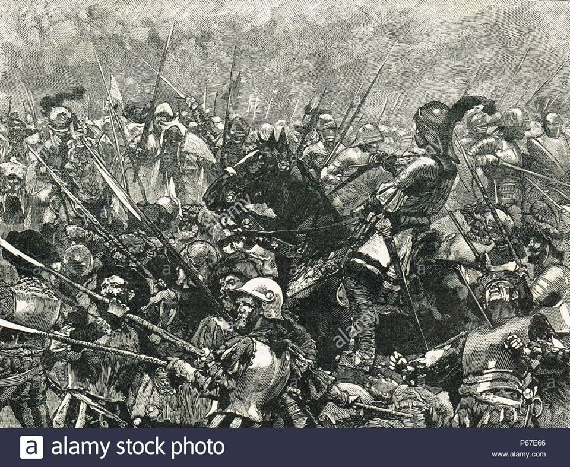  

### 1383

Na zjeździe w Sieradzu arcybiskup gnieźnieński Bodzanta podjął nieudaną próbę przeforsowania kandydatury księcia rawskiego i płockiego Siemowita IV na męża Jadwigi Andegaweńskiej i króla Polski.

"...Patrząc na skład krakowskiej komisji warto zauważyć, że wszyscy jej członkowie należeli do ścisłej elity urzędniczej w okresie panowania Kazimierza Wielkiego, a kilku z nich było na pewno w najbliższym otoczeniu króla: kanclerz krakowski Janusz Suchywilk, podsędek krakowski Andrzej z Wawrowic, Florian z Mokrska kanclerz łęczycki, a potem biskup krakowski i oczywiście wielkorządca generalny Bodzęta z Kosowic. Szczególnie ten ostatni zwraca tutaj uwagę, bo jako zarządca dóbr monarszych w Małopolsce był bardzo mocno zaangażowany w meliorację królewszczyzn, z którą to wiązało się najwięcej rewindykacji dóbr czynionych z polecenia królewskiego..."

"...W tym samym czasie wysłannicy arcybiskupa elekta: Jan z Czarnkowa, sędzia poznański Sędziwój Świdwa i kanonik Piotr ze Żnina [...] udali się do Ludwika na Węgry, aby prosić o zgodę na wybór Dobrogosta. Wiadomo, że Ludwik odrzucił prośby obu elektów, a samego Dobrogosta kazał aresztować w Treviso i tym samym uniemożliwił mu objęcie arcybiskupstwa. Jego miejsce zajął Bodzęta z Kosowic, dotychczasowy wielkorządca generalny Małopolski..."

"...Do obozu pod Brześciem Kujawskim przybył także, wezwany tam przez Zygmunta Luksemburskiego, arcybiskup gnieźnieński Bodzanta. Ten, do tej pory zwolennik Siemowita, w lipcu 1383 roku, zmienił po raz kolejny swoją orientację polityczną. Obawiając się kłopotów ze strony kurii papieskiej, po tym jak królowa Elżbieta Bośniaczka oskarżyła go o popieranie księcia mazowieckiego, który chciał bezprawnie zająć tron polski, arcybiskup porzucił go i związał się z Grzymalitami na czele z Domaratem z Pierzchną, kasztelanem poznańskim (byłym starostą wielkopolskim), licząc na ich poparcie u monarchini. Arcybiskup wytłumaczył się jakoś przed Zygmuntem Luksemburskim ze swojego wcześniejszego postępowania i w efekcie został oczyszczony ze stawianych mu zarzutów..."

"...Wśród przeciwników uchwał radomszczańskich Janek z Czarnkowa imiennie wymienił dwóch dostojników: arcybiskupa gnieźnieńskiego Bodzętę i Domarata z Pierzchną, którzy wymawiali się złożoną wcześniej Zygmuntowi Luksemburskiemu przysięgą wierności. Nietrudno dostrzec intencji, jakimi musieli się obaj kierować. Bodzęcie brakowało doświadczenia politycznego, ani wówczas, ani później nie był zresztą osobą, którą można było posądzić o jakieś nadmierne talenty, które pozwalałyby zabierać się do współdecydowania o losach państwa. Jego związek z późniejszą kandydaturą mazowiecką jest, jak można sądzić, nie jedynym tego dowodem. Poparcie dla margrabiego brandenburskiego tłumaczyło pochodzenie Bodzęty z mało zamożnej szlachty sandomierskiej (ostatnio J. Tęgowski słusznie przypomniał, że jeszcze za czasów Kazimierza Wielkiego w ogóle podawano w wątpliwość jego przynależność do stanu szlacheckiego), a więc tym samym brak jakiegokolwiek zaplecza związanego z koneksjami rodzinnymi, jako homo novus przeforsowany został przez Ludwika Węgierskiego jako następca Janusza Suchegowilka na stolicy gnieźnieńskiej wbrew kandydatowi kapituły Dobrogostowi z Nowego Dworu. Czuł się więc Bodzęta zobowiązany do bezgranicznej wierności dla dynastii, której tak wiele zawdzięczał, co łatwo przecież zrozumieć. Nie było jego winą, że nie umiał dostrzec tego wszystkiego, co dostrzegali bardziej od niego doświadczeni i uzdolnieni polscy politycy. Temu swojemu brakowi politycznego rozeznania i wyobraźni Bodzęta zawdzięczał późniejsze wmanewrowanie się w popieranie Siemowita IV, które nie tylko stały w wyraźnej sprzeczności z dążeniami elit politycznych, ale wymierzone były również w politykę dynastyczną Andegawenów..."

"...Tymczasem arcybiskup gnieźnieński Bodzęta - jak informuje Jan z Czarnkowa - przybył w dniu 7 V, na trzy dni przed Zielonymi Świątkami, do Krakowa w towarzystwie Siemowita i 50 jego zbrojnych ludzi. Mogło się wydawać, iż udaje się do Sącza, ale wraz z Siemowitem i eskortą pozostał w Krakowie. Nie wpuszczono ich do miasta, więc zatrzymali się u św. Floriana. Ponieważ wzbudzili tu wrogie nastroje i zachodziła obawa tumultu, udali się do Korczyna, gdzie przebywali dwa tygodnie. Jan snuje domysł, zapewne niebezzasadny, że Siemowit zamierzał porwać Jadwigę i siłą doprowadzić do małżeństwa z nią, aby tą drogą osiągnąć koronę. Plan ten wszakże został w porę ujawniony i kronikarz dopuszcza możliwość, że właśnie dlatego opóźniono przyjazd Jadwigi do Polski..."

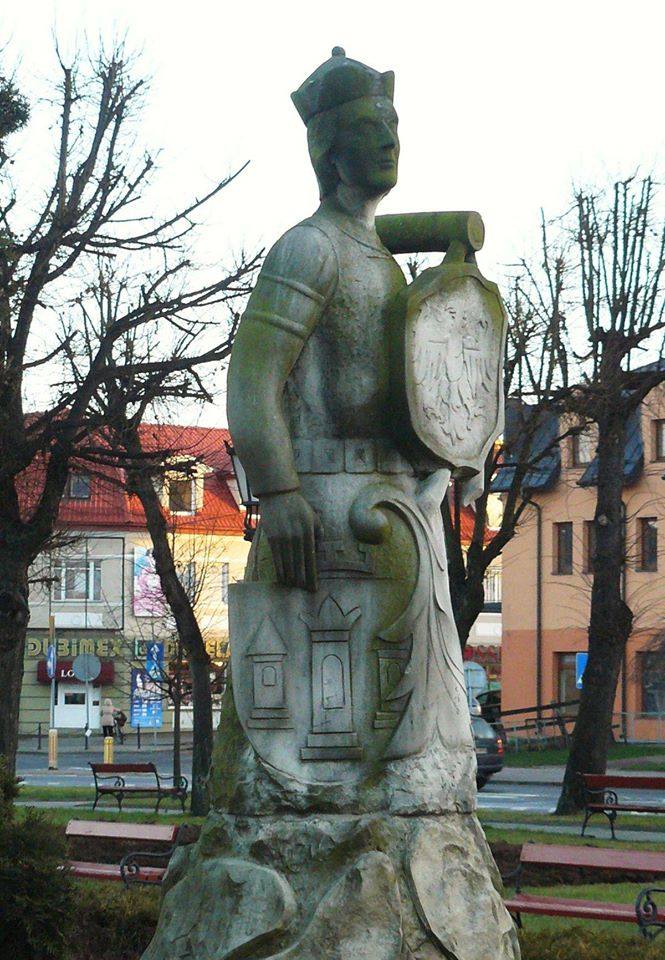  

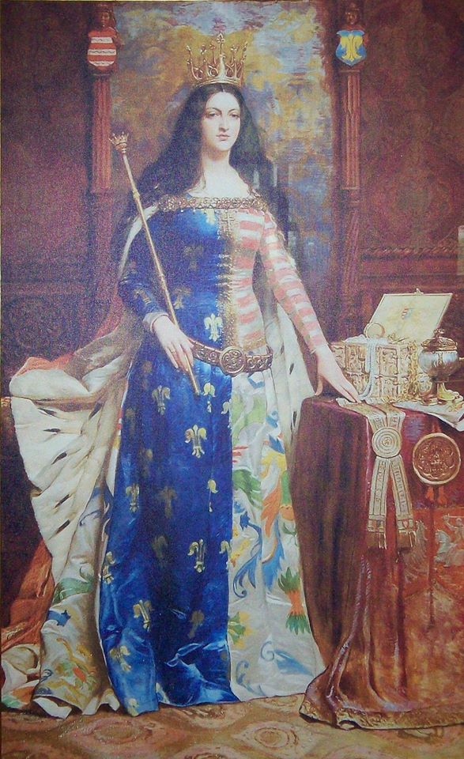  

---

<a href="https://github.com/TomaszWaszczyk/historia.waszczyk.com/edit/master/src/content/june-16.md" target="_blank">Edytuj tę stronę dzieląc się własnymi notatkami!</a>
