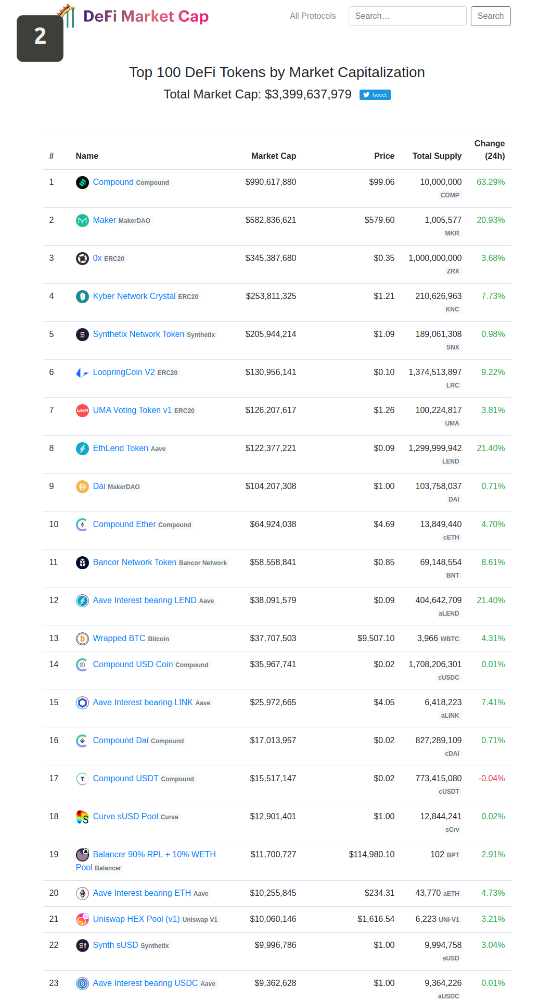

### 2020

Potwierdził się wstępny odczyt GUS, zgodnie z którym ceny w maju wzrosły o 2,9 proc. w porównaniu z majem ubiegłego roku. Jednak to już trzeci miesiąc z rzędu, gdy podwyżki cen wyhamowują. Z kolei porównując ceny miesiąc do miesiąca, w maju pozostały one na praktycznie takim samym poziomie jak w kwietniu - spadek jest minimalny i wynosi 0,2 proc.

Przypomnijmy, że w tym roku inflacja była najwyższa w lutym, gdy wyniosła 4,7 proc. W marcu spadła, ale zaledwie o 0,1 pkt proc. Z kolei przed miesiącem zaliczyła zjazd z 4,6 do 3,4 proc. W maju natomiast spadła o kolejne 0,5 pkt proc. do poziomu 2,9 proc.

Inflacja ciągle przekracza docelową wartość NBP, czyli 2,5 proc., ale mieści się w dopuszczalnym przedziale 1,5-3,5 proc.

  

---

  

---

  

---

  

---

### 1944

https://pl.wikipedia.org/wiki/George_Junius_Stinney

---

<a href="https://github.com/TomaszWaszczyk/historia.waszczyk.com/edit/master/src/content/june-16.md" target="_blank">Edytuj tę stronę dzieląc się własnymi notatkami!</a>
