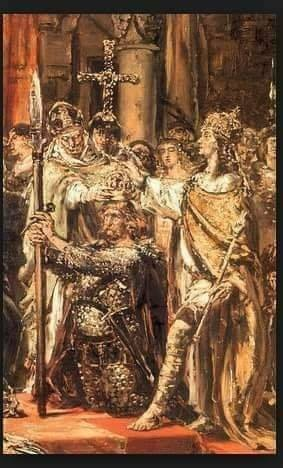

### 2022

<video width="640" height="480" controls>
<source src="./movies/june/putin.mp4" type="video/mp4">
Your browser does not support the video tag.
</video>

### 2020

  

### 1991

Premier Jan Krzysztof Bielecki i kanclerz Helmut Kohl podpisali w Bonn polsko-niemiecki traktat o dobrym sąsiedztwie i przyjaznej współpracy, określający podstawy współpracy we wszystkich istotnych dziedzinach, gwarantujący granice i prawa mniejszości narodowych, przewidujący mechanizm konsultacji na różnych szczeblach, w sumie tworzący solidną podstawę stosunków dwustronnych. Równolegle z tym traktatem podpisano 3 umowy bilateralne: o współpracy młodzieży, o utworzeniu bilateralnej Rady Ochrony Środowiska i o utworzeniu Komisji Międzyrządowej ds. Współpracy Regionalnej i Przygranicznej. W tej ostatniej dziedzinie ważną formą rozwoju więzi transgranicznych stały się euroregiony: pierwszy, o nazwie Nysa, powstał 21 grudnia 1991 roku na obszarach Polski, Niemiec i Czech przylegających do tej granicznej rzeki. W 1993 roku utworzono polsko-niemieckie euroregiony Sprewa-Nysa-Bóbr i Pro Europa Viadrina, a w 1995 roku polsko-niemiecko-szwedzki euroregion Pomerania.

  

### 1983

"Nie daj się zwyciężać złu,a zło dobrem zwyciężaj"- tymi słowami nawiązał do stanu wojennego papież Jan Paweł II podczas rozpoczętej 16 czerwca 1983 roku drugiej pielgrzymki do Polski.
Papież odwiedził: Warszawę, Niepokalanów Częstochowę, Poznań, Katowice, Wrocław, Górę św. Anny i Kraków. 17 czerwca 1983 r. w
trakcie spotkania w Belwederze z
przedstawicielami władz papież stwierdził między innymi: "I chociaż życie w Ojczyźnie od 13 grudnia 1981 r. zostało poddane surowym rygorom stanu wojennego, który został
zawieszony od początku bieżącego roku - to przecieżnie przestaję ufać, że owa zapowiadana wielokrotnie odnowa społeczna, według zasad wypracowywanych w takim trudzie w przełomowych dniach sierpnia 1980
r. i zawarta w porozumieniach, dojdzie
stopniowo do skutku".
Wielkie symboliczne znaczenie miało
spotkanie w Tatrach, w Dolinie Chochołowskiej z Lechem Wałęsą. W trakcie pielgrzymki papież beatyfikował Urszulę Julię Marię Ledóchowską, założycielkę Zgromadzenia
Sióstr Urszulanek Serca Jezusa Konającego, franciszkanina Alberta Adama Chmielowskiego i Rafała od św. Józefa – Józefa Kalinowskiego, karmelitę, powstańca styczniowego, zesłańca syberyjskiego.
Hasłem przewodnim pielgrzymki,która zakończyła się 23 czerwca 1983 roku było:
"Pokój Tobie, Polsko, Ojczyzno moja"

  

### 1934

2 dni po zabójstwie ministra spraw wewnętrznych Bronisława Pierackiego przez członka OUN, prezydent RP Ignacy Mościcki podpisał rozporządzenie w sprawie osób zagrażających bezpieczeństwu, spokojowi i porządkowi publicznemu.
Artykuł pierwszy rozporządzenia głosił, że ''osoby, których działalność lub postępowanie daje podstawę do przypuszczenia , że grozi z ich strony naruszenie bezpieczeństwa, spokoju lub porządku publicznego , mogą ulec przytrzymaniu i przymusowemu umieszczeniu w miejscu odosobnienia, nie przeznaczonych dla osób skazanych lub aresztowanych z powodu przestępstw''.
Rozporządzenie podpisali:
Prezydent Rzeczypospolitej: l. Mościcki
Prezes Rady Ministrów
i Minister 'Spraw Wewnętrznych: L. Kozłowski
Minister Spraw Zagranicznych: Beck
Minister Spraw Wojskowych: J. Piłsudski
Minister Skarbu: Wł. Zawadzki
Minister Sprawiedliwości: Czesław Michałowski
Minister Wyznań Religijnych
i Oświecenia Publicznego: W. Jędrzejewicz
Minister Rolnictwa i Reform Rolnych:
Nakoniecznikow - Klukąwski
Minister Przemysłu i Handlu: H. Floyar Rajchman
Minister Komunikacji: M. Butkiewicz
Minister Opieki Społecznej : Jerzy Paciorkowski
Minister Poczt i Telegrafów: Kaliński
Efektem rozporządzenia było powstanie Miejsca Odosobnienia w Berezie Kartuskiej, które przez niektórych określane jest mianem polskiego obozu koncentracyjnego dla więźniów politycznych. Obóz ten funkcjonował w latach 1934-1939. W praktyce można było do niego trafić już za samą krytykę władz sanacyjnych, przypomnijmy, że miejsce w Berezie szykowano dla poety Juliana Tuwima, który krytykował sanację.
Według niektórych źródeł obóz w Berezie Kartuskiej był wzorowany na niemieckim nazistowskim KL Dachau. Pierwszych więźniów osadzono w obozie w lipcu 1934 roku. Więźniami obozu byli przedstawiciele ugrupowań narodowy-radykalnych, ale również komuniści, nacjonaliści ukraińscy, a niekiedy członkowie Stronnictwa Ludowego i Stronnictwa Narodowego, antyfaszyści, pacyfiści, a także osoby podejrzewane o szpiegostwo. Według różnych szacunków w okresie od lipca 1934 roku do września 1939 w Berezie Kartuskiej zanotowano od 4 do 20 przypadków zgonów. Norman Davies podał w swojej książce dotyczącej historii Polski pt. Boże igrzysko liczbę 17 ofiar śmiertelnych.
Agnieszka Knyt z ogólnej liczby 3 tysięcy więźniów uwięzionych w Berezie do końca sierpnia 1939 podaje 13 zgonów

Portal Macierz.org.pl opisuje jak wyglądała toaleta więźniów Berezy, a także praca i rozkład dnia i nocy w obozie:

''Torturą było nawet wypróżnianie się w tym obozie koncentracyjnym zwanym miejscem odosobnienia. Tę czynność fizjologiczną można było załatwić tylko raz na dobę, rano po obudzeniu. Zatem 20 ludzi stawało w pokoju z betonową podłogą i na komendę każdy z nich miał obowiązek rozpiąć się, załatwić się i zapiąć się w ciągu kilkunastu sekund, co było oczywiście czasem niewystarczającym, wobec czego ludzie stale chodzili z niewypróżnionymi żołądkami, co było dolegliwe szczególnie przy kilkugodzinnej gimnastyce. Konieczność trzymania moczu i kału powodowała awarie za które okrutnie bito, a i taki ubrudzony moczem czy kałem śmierdział wszystkim, nie mógł się wyprać.

Do prac obozu więziennego należało czyszczenie ustępów dokonywane małą szmatką, a więc w praktyce gołymi rękami. Przed posiłkiem nie pozwalano umyć rąk ubrudzonych kałem. Za najbardziej uciążliwą pracę uznawano pompowanie wody, które odbywało się przy użyciu kieratu. Orczyki były tak przymocowane, że więźniowie musieli pracować w głębokim pochyleniu. Kazano wykonywać również prace całkowicie bezsensowne jak kopanie i zasypywanie rowów, przenoszenie ciężkich kamieni z jednego miejsca na drugie miejsce, a po skończeniu w odwrotną stronę. Wieźniów poganiano i batożono, bito pałkami gdy zasłabli i zwolnili pracę.

Pobudka była o 4 rano, pół godziny później śniadanie (niesłodzona kawa zbożowa lub żur i 400 gramów czarnego chleba na cały dzień. O 6.30 rozpoczynała się "praca" lub "gimnastyka", które trwały do godziny 11. Obiad podawano o 12, składał się z gorącego płynu bez tłuszczu i porcji ziemniaków. Po obiedzie kontynuowano zajęcia. Kolację podawano o godzinie 17 i składała się z niesłodzonej kawy zbożowej lub żuru. Przygotowania do snu zarządzano o 18.30. Racje żywnościowe były niewystarczające, więźniowie obozu Berezy pozostawali wiecznie głodni, a nie zezwalano na paczki od rodzin. Nie było widzeń z rodziną.

Osadzeni przebywali w obozie we własnych ubraniach, które bardzo szybko niszczyły się, i z braku możliwości prania i czyszczenia okropnie śmierdziały, powodując dodatkowy dyskomfort w postaci smrodu z przepocenia i niemycia. Rewizje w Polskim Łagrze. W nocy przeprowadzano tak zwane rewizje, w czasie których wszyscy więźniowie musieli się rozebrać do naga i przejść przez korytarz biegiem do jednej z sal. W czasie przechodzenia byli bici pałkami. W tym czasie kipiszowano ich cele czyli dokonywano rewizji pomieszczeń. Rzeczy osobistych oprócz ubrania nie posiadali.

Istniała możliwość szybszego niż po trzech miesiącach opuszczenia obozu pod warunkiem podpisania tzw. deklaracji lojalności czyli "lojalki" wobec sanacji. Wiele osób, które podpisały tą deklarację, po opuszczeniu obozu kontynuowało działalność polityczną, za co z powrotem były umieszczane w obozie''.

  

### 1930

Ustawa Smoota-Hawleya – ustawa w Stanach Zjednoczonych podpisana 17 czerwca 1930 roku, zwiększała do rekordowych poziomów cła na ponad 20 tysięcy towarów importowych.
W opinii wielu współczesnych ekonomistów przyczyniła się do pogłębienia i przedłużenia wielkiego kryzysu. Wiele krajów odpowiedziało tym samym, co poskutkowało zmniejszeniem importu i eksportu o ponad połowę.
Nazwa ustawy pochodzi od nazwisk jej wnioskodawców, senatora Reeda Smoota z Utah i kongresmena Willisa Chatmana Hawleya z Oregonu.

<https://en.wikipedia.org/wiki/New_Deal> : Wprowadzenie przez prezydenta Roosvelta programu “New Deal“. Co prawda Roosvelt objął prezydenturę w 1933 roku, ale tak naprawdę ten program został wprowadzony już przez prezydenta Hoovera (od 1930 roku). Było to centralne planowanie. Państwo kontrolowało prawie wszystko. Ustalano na przykład ceny produktów przez oficjalne cenniki przygotowywane przez urzędników.
Cały program interwencjonizmu i robót publicznych był przeprowadzony przez gigantyczny wzrost wydatków, który nie miał pokrycia w przychodach budżetowych. W efekcie dług do PKB bardzo mocno wzrósł.

### 1888

https://en.wikipedia.org/wiki/Heinz_Guderian

### 1025

Zmarł król Bolesław I Chrobry.
Bolesław był najstarszym synem poczętym ze związku Mieszka I z księżniczką Dobrawą. W przyszłości okazał się dobrym wodzem i administratorem. Był czterokrotnie żonaty- jego najukochańszą żoną była Emnilda, córka księcia Dobromira z Zachodniej Słowiańszczyzny. Był księciem polskim od 992 roku, królem zaś od 1025. Był twórcą potęgi państwa polskiego i organizatorem pierwszej w Europie pokojowej chrystianizacji pogan. W 1000 roku odbył się zjazd gnieźnieński (uroczysta pielgrzymka Ottona III do grobu św. Wojciecha) podczas którego doszło do spotkania Bolesława Chrobrego, z cesarzem Ottonem III. Na spotkaniu książę Bolesław otrzymał od Ottona włócznię świętego Maurycego. Otto otrzymał zaś relikwie św. Wojciecha, trzystuosobowy oddział zbrojny oraz wszystkie nakrycia ze sreber, na których ucztowano. Przepych, z jakim Bolesław przyjął Ottona, zdaniem kronikarzy wywarł na cesarzu ogromne wrażenie. Miało to wielkie znaczenie polityczne. Na zjeździe uroczyście ogłoszono Gniezno arcybiskupstwem. W wyraz uznania Otto nałożył Bolesławowi diadem na głowę. Po tym wydarzeniu Bolesław poczynił starania prosząc w Rzymie o zgodę na koronację. W latach 1002-18 nasz władca toczył walki z cesarzem niemieckim Henrykiem II zdobywając Milsko i Łużyce. Wojna zakończyła się podpisaniem pokoju w 1018 roku w Budziszynie. Pokój był sukcesem piastowskiego władcy, który rozgromił ówczesną militarną potęgę Europy. Bolesław I Chrobry zorganizował wyprawy do Czech i na Ruś (przyłączył Grody Czerwieńskie) Do koronacji Bolesława I Chrobrego doszło po śmierci cesarza Henryka II. 18 kwietnia 1025 roku w Gnieźnie uroczyście ukoronowano Bolesława I Chrobrego na pierwszego króla Polski. Koronacja była zwieńczeniem starań Bolesława nad wzmocnieniem niezależności państwa polskiego. Król zmarł po dwóch miesiącach od koronacji. Następcą Bolesława Chrobrego został Mieszko II.

  

---

<a href="https://github.com/TomaszWaszczyk/historia.waszczyk.com/edit/master/src/content/june-17.md" target="_blank">Edytuj tę stronę dzieląc się własnymi notatkami!</a>
