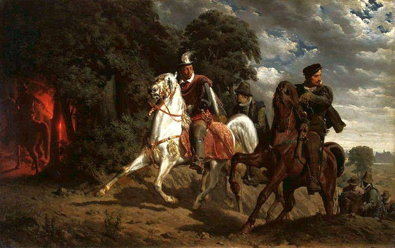

### 2020

Odnawia się wizja: https://pl.wikipedia.org/wiki/Karol_Wielki

---

Media: It's dead

Bitcoin: ❑→❑→

Governments: It's thin air

Bitcoin: ❑→❑→❑→

Banks: It's too volatile

Bitcoin: ❑→❑→❑→❑→

---

Chiny planuja panazjatycką kryptowalutę która miałaby być rywalem #libracoin. Digital yuan, lub w skrócie DCEP miałby być podstawową, międzygraniczną walutą pomiędzy Chinami, Japonią i Koreą Południową. Tak jak Libra, DCEP będzie wsparty zbiorem azjatyckich walut: Chiński Yuan, Japoński Yen, Koreański Yen i Dolar Hongkoński. Stosunek tych walut w "koszyku" będzie zdeterminowany ekonomicznymi warunkami danego kraju. Taka waluta spowoduje, że na wschodnio Azjatyckim rynku może zapanować strefa wolna od Dolara Amerykańskiego.

Już aktualnie Chińczycy korzystają z płatności elektronicznych na wielką skalę używając WeChat Pay czy AliPay, więc przejście na "oficjalną" wirtualną walutę nie będzie problemu.

Zapowiedź Libry w zeszłym roku i tego jakie Facebook miał plany co do swojego dzieła, przyspieszyły pracę Chińskiego rządu nad stworzeniem czegoś swojego i na swój własny rynek. Takie posunięcia jak i nowe informacje co do tego jak Libra Coin będzie wyglądał, powodują, że wkraczamy coraz bardziej w czasy "zimnej wojny kryptowalutowej". Jestem ciekaw jakie nowe waluty wyjdą na przód i jak w tym wszystkim "tradycyjne" kryptowaluty się odnajdą.

### 1992

Rozpoczęła działalność pierwsza polska sieć telefonii komórkowej PTK Centertel.

Ciekawostka: pierwsze telefony pojawiły się w Warszawie już w 1877 roku. Pierwszą oficjalną próbę telefonowania przeprowadzono w Królestwie Polskim 7 i 9 grudnia 1877 roku. Do transmisji posłużył tor telegraficzny o długości 9 mil. O wynikach prób pisano w ówczesnej prasie : (...) głos jest wyraźny tylko przy zupełnej ciszy, jaka panowała w czasie prób czynionych o godzinie drugiej w nocy. W innym czasie dźwięki cichsze przez telefon przesyłane giną zupełnie, a dźwięki mocniejsze zmącone są innymi odgłosami. Ponieważ dla oszczędności nie zakładano dla telefonu oddzielnych drutów, ale korzystano z telegraficznych, więc podczas prób w dzień robionych telefon ustawicznie brzmiał odgłosem pukania telegrafistów na pobliskich stacyach.
Od tego momentu poczęto starania, aby budować słupy oddzielnie dla telegrafów i oddzielne dla telefonów. Pierwsza sieć telefoniczna powstała w Warszawie w 1882 roku: (...) w roku 1882, tj. pierwszym zaprowadzenia telefonów, było abonentów 163, w roku 1883 cyfra ta podniosła się do 302, w roku 1884 do 416, a na koniec w ubiegłym roku liczono 520 abonentów. Ogółem rozmów prowadzono w r.z. 651 497, najwięcej z nich było w czerwcu, a najmniej w marcu...

  

### 1945

W Moskwie rozpoczął się proces przywódców polskiego podziemia.
Oskarżeni za naruszenie postanowień sowieckiego kodeksu karnego za sprawą,którego władze ZSRR na podstawie manifestu PKWN zyskały jurysdykcję nad obywatelami polskimi.
Najbardziej smutny jest w tym przypadku brak jakiegokolwiek zainteresowania ze strony władz państw zachodnich na terenie których w latach okupacji działały emigracyjne władze Polski.
Jednym ze skazanych w tym procesie zwanym też "procesem 16 " był ostatni dowódca Armii Krajowej generał Leopold Okulicki,którego skazano na 10 lat więzienia.

  

### 1574

Król Henryk III Walezy ucieka z Polski do Francji.

Po śmierci ostatniego polskiego władcy z dynastii Jagiellonów – Zygmunta Augusta (1520-1572), królowie polscy, aż do końca istnienia I Rzeczpospolitej, byli wybierani na drodze wolnej elekcji. Oznaczało to wybór monarchy spośród kilku kandytatów, przez zgromadzoną w tym celu szlachtę (głosować mógł każdy szlachcic), bez przestrzegania zasad sukcesji dynastycznej. Warunkiem objęcia władzy przez elekta było zaprzysiężenie  przywilejów generalnych i paktów. System ten na długie lata wpłynął na politykę polską, stając się dominującym elementem ustroju Rzeczpospolitej Szlacheckiej.

Dlaczego Francja interesowała się tronem polskim ?

Francja interesowała się koroną polską dla młodszego brata króla Karola IX  już w 1572. Pierwsze polityczne zabiegi nie przyniosły spodziewanych skutków, dlatego w czasie wolnej elekcji wzmożono dyplomatyczne wysiłki, aby strona polska zainteresowała się kandytaturą księcia Andegawenii. Z punktu widzenia interesów francuskich osadzenie na tronie polskim własnego kandydata dawało różnorodne korzyści: osłabiało rolę Habsburgów w polityce europejskiej, dawało dostęp do handlu bałtyckiego, a samemu Karolowi IX umożliwiało usunięcie z Paryża brata – rywala.

Wybór Henryka Walezego na króla Polski:

Kandydatura francuska budziła wiele kontrowersji, szczególnie niepokojący wydawał się udział Henryka w wydarzeniach Nocy św. Bartłomieja. Obawiano się, że nie będzie przestrzegał praw innowierców, co byłoby niezgodne z panującą w Polsce zasadą tolerancji religijnej. Dyplomacja francuska pracowała jednak ze wszystkich sił. Podkreślano rycerskość, pobożność, łagodność młodego władcy, jego niezwykłą hojność i wiele innych zalet.

Ostatecznie 5 kwietnia 1573 to on okazał się zwycięzcą elekcji. Do Paryża zostało wysłane godne i okazałe poselstwo, po kolejnych pertraktacjach (dotyczących głównie spraw wyznaniowych i możliwości wypowiedzenia posłuszeństwa królowi) 22 sierpnia 1573 roku Henryk uznał dawne i nowe prawa, został  ogłoszony królem Polski. Koronacja odbyła się kilka miesięcy później, 21 lutego 1574 w katedrze na Wawelu w Krakowie.

Przybycie Henryka Walezego do Polski – zetknięcie dwóch kultur:

Do granic Polski królewski orszak, w skład którego wchodziła znaczna grupa dworzan, damy dworu jadące w karocach, wozy z bagażem, wiozące m.in. cenne meble, dotarł w końcu stycznia 1574 roku.  Sam Henryk nosił bardzo wykwintne stroje, biżuterię, słynne perły w uszach, co Polakom wydało się dziwne i niestosowne. Sprzeciw budziły również niezwykle swobodne obyczaje króla. Z czasem polskie otoczenie władcy miało mu również za złe, że otacza się głównie Francuzami. Henryk Walezy nie znał języka polskiego, ani polskich zwyczajów. Nie odpowiadał mu też surowy klimat nowej ojczyzny. Ociągał się również w sprawie zawarcia małżeństwa ze starszą od siebie 28 lat Anną Jagiellonką, co było jednym z warunków osadzenia go na polskim tronie.

Ucieczka do Francji:

Na wieść o śmierci brata, władcy Francji Karola IX, król Polski i wielki książę Litwy Henryk Walezy uciekł z Krakowa. Pod osłoną nocy wraz z czterema towarzyszami potajemnie opuścił Wawel furtką wychodzącą na Kazimierz. Na Zwierzyńcu w opuszczonej kaplicy czekali dworzanie z końmi. Walezy zostawił listy do stanów królestwa i Senatu, które znaleziono po kilku dniach, bo schował je - jak pisał jeden z kronikarzy - "w niegodnym miejscu, zatknięte za czeluścią przy piecu". Zapowiadał w nich powrót, o czym zapewnił też podkomorzego krakowskiego Jana Tęczyńskiego, który dogonił go już na Śląsku. We Francji objął tron po bracie i nigdy do Polski nie wrócił. Po ucieczce Walezego zaczęło się w Polsce bezkrólewie zakończone półtora roku później elekcją Stefana Batorego. Nigdy jednak oficjalnie nie zrzekł się władzy w Rzeczpospolitej i do końca życia uważał się za jej prawowitego władcę.

Historia panowania Walezego w kulturze polskiej:

Historia krótkiego panowania w Polsce, szczególnie zaś dzieje spektakularnej ucieczki króla, były przez stulecia obecne w polskiej kulturze, stały się tematem wielu dzieł literackich, obrazów, rycin i rysunków (np. Jan Kochanowski, Oda I. Do króla Henryka Walezego bawiącego we Francji; Artur Grottger, Ucieczka Henryka Walezego z Polski, 1860, Muzeum Narodowe w Warszawie).

Order Świętego Ducha:

31 grudnia 1578 Henryk III ustanowił Order Świętego Ducha. Wybrał takiego patrona ze względu na trzy znaczące wydarzenia swojego życia : jego narodziny, wstąpienie na tron polski, a następnie na francuski miały miejsce w dniu Zesłania Ducha Świętego.

Order ten, do czasów rewolucji, był najbardziej prestiżowym odznaczeniem monarchii francuskiej. Odznaczeni nim byli (w randze kawalerów) dwaj inni królowie polscy: Jan III Sobieski (1676) i Stanisław Leszczyński (1725).

Pierwsze dzieła dotyczące historii Polski opublikowane we Francji:

Elekcja Henryka Walezego na tron polski stała się ważnym momentem w historii związków między dwoma królestwami. Do tej pory kontakty dyplomatyczne, polityczne i militarne nie były zbyt znaczące. Wraz z wyborem Henryka Walezego pojawiło się we Francji wiele tekstów opisujących Polskę, wzmagając zainteresowaniem krajem, uważanym do tej pory za odległy i egzotyczny.

### 1574

Król Henryk III Walezy ucieka z Polski do Francji.

Po śmierci ostatniego polskiego władcy z dynastii Jagiellonów – Zygmunta Augusta (1520-1572), królowie polscy, aż do końca istnienia I Rzeczpospolitej, byli wybierani na drodze wolnej elekcji. Oznaczało to wybór monarchy spośród kilku kandytatów, przez zgromadzoną w tym celu szlachtę (głosować mógł każdy szlachcic), bez przestrzegania zasad sukcesji dynastycznej. Warunkiem objęcia władzy przez elekta było zaprzysiężenie  przywilejów generalnych i paktów. System ten na długie lata wpłynął na politykę polską, stając się dominującym elementem ustroju Rzeczpospolitej Szlacheckiej.

Dlaczego Francja interesowała się tronem polskim ?

Francja interesowała się koroną polską dla młodszego brata króla Karola IX  już w 1572. Pierwsze polityczne zabiegi nie przyniosły spodziewanych skutków, dlatego w czasie wolnej elekcji wzmożono dyplomatyczne wysiłki, aby strona polska zainteresowała się kandytaturą księcia Andegawenii. Z punktu widzenia interesów francuskich osadzenie na tronie polskim własnego kandydata dawało różnorodne korzyści: osłabiało rolę Habsburgów w polityce europejskiej, dawało dostęp do handlu bałtyckiego, a samemu Karolowi IX umożliwiało usunięcie z Paryża brata – rywala.

Wybór Henryka Walezego na króla Polski:

Kandydatura francuska budziła wiele kontrowersji, szczególnie niepokojący wydawał się udział Henryka w wydarzeniach Nocy św. Bartłomieja. Obawiano się, że nie będzie przestrzegał praw innowierców, co byłoby niezgodne z panującą w Polsce zasadą tolerancji religijnej. Dyplomacja francuska pracowała jednak ze wszystkich sił. Podkreślano rycerskość, pobożność, łagodność młodego władcy, jego niezwykłą hojność i wiele innych zalet.

Ostatecznie 5 kwietnia 1573 to on okazał się zwycięzcą elekcji. Do Paryża zostało wysłane godne i okazałe poselstwo, po kolejnych pertraktacjach (dotyczących głównie spraw wyznaniowych i możliwości wypowiedzenia posłuszeństwa królowi) 22 sierpnia 1573 roku Henryk uznał dawne i nowe prawa, został  ogłoszony królem Polski. Koronacja odbyła się kilka miesięcy później, 21 lutego 1574 w katedrze na Wawelu w Krakowie.

Przybycie Henryka Walezego do Polski – zetknięcie dwóch kultur:

Do granic Polski królewski orszak, w skład którego wchodziła znaczna grupa dworzan, damy dworu jadące w karocach, wozy z bagażem, wiozące m.in. cenne meble, dotarł w końcu stycznia 1574 roku.  Sam Henryk nosił bardzo wykwintne stroje, biżuterię, słynne perły w uszach, co Polakom wydało się dziwne i niestosowne. Sprzeciw budziły również niezwykle swobodne obyczaje króla. Z czasem polskie otoczenie władcy miało mu również za złe, że otacza się głównie Francuzami. Henryk Walezy nie znał języka polskiego, ani polskich zwyczajów. Nie odpowiadał mu też surowy klimat nowej ojczyzny. Ociągał się również w sprawie zawarcia małżeństwa ze starszą od siebie 28 lat Anną Jagiellonką, co było jednym z warunków osadzenia go na polskim tronie.

Ucieczka do Francji:

Na wieść o śmierci brata, władcy Francji Karola IX, król Polski i wielki książę Litwy Henryk Walezy uciekł z Krakowa. Pod osłoną nocy wraz z czterema towarzyszami potajemnie opuścił Wawel furtką wychodzącą na Kazimierz. Na Zwierzyńcu w opuszczonej kaplicy czekali dworzanie z końmi. Walezy zostawił listy do stanów królestwa i Senatu, które znaleziono po kilku dniach, bo schował je - jak pisał jeden z kronikarzy - "w niegodnym miejscu, zatknięte za czeluścią przy piecu". Zapowiadał w nich powrót, o czym zapewnił też podkomorzego krakowskiego Jana Tęczyńskiego, który dogonił go już na Śląsku. We Francji objął tron po bracie i nigdy do Polski nie wrócił. Po ucieczce Walezego zaczęło się w Polsce bezkrólewie zakończone półtora roku później elekcją Stefana Batorego. Nigdy jednak oficjalnie nie zrzekł się władzy w Rzeczpospolitej i do końca życia uważał się za jej prawowitego władcę.

Historia panowania Walezego w kulturze polskiej:

Historia krótkiego panowania w Polsce, szczególnie zaś dzieje spektakularnej ucieczki króla, były przez stulecia obecne w polskiej kulturze, stały się tematem wielu dzieł literackich, obrazów, rycin i rysunków (np. Jan Kochanowski, Oda I. Do króla Henryka Walezego bawiącego we Francji; Artur Grottger, Ucieczka Henryka Walezego z Polski, 1860, Muzeum Narodowe w Warszawie).

Order Świętego Ducha:

31 grudnia 1578 Henryk III ustanowił Order Świętego Ducha. Wybrał takiego patrona ze względu na trzy znaczące wydarzenia swojego życia : jego narodziny, wstąpienie na tron polski, a następnie na francuski miały miejsce w dniu Zesłania Ducha Świętego.

Order ten, do czasów rewolucji, był najbardziej prestiżowym odznaczeniem monarchii francuskiej. Odznaczeni nim byli (w randze kawalerów) dwaj inni królowie polscy: Jan III Sobieski (1676) i Stanisław Leszczyński (1725).

Pierwsze dzieła dotyczące historii Polski opublikowane we Francji:

Elekcja Henryka Walezego na tron polski stała się ważnym momentem w historii związków między dwoma królestwami. Do tej pory kontakty dyplomatyczne, polityczne i militarne nie były zbyt znaczące. Wraz z wyborem Henryka Walezego pojawiło się we Francji wiele tekstów opisujących Polskę, wzmagając zainteresowaniem krajem, uważanym do tej pory za odległy i egzotyczny.

  

---

<a href="https://github.com/TomaszWaszczyk/historia.waszczyk.com/edit/master/src/content/june-18.md" target="_blank">Edytuj tę stronę dzieląc się własnymi notatkami!</a>
