### 2022

> “In the 21st Century, we may see the Emergence..of a new massive class of ‘Useless People’…people that have absolutely no ‘Economic Value" -Yuval Harari

<video width="640" height="480" controls>
<source src="./movies/june/massiveclass.mp4" type="video/mp4">
Your browser does not support the video tag.
</video>

---

Ukraina. Rada Najwyższa Ukrainy przyjęła ustawę № 7398 -  wszystkie budowane na Ukrainie budynki mieszkalne będą musiały posiadać schrony przeciwbombowe.

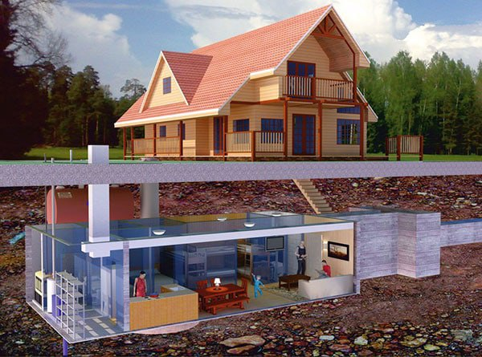  

---

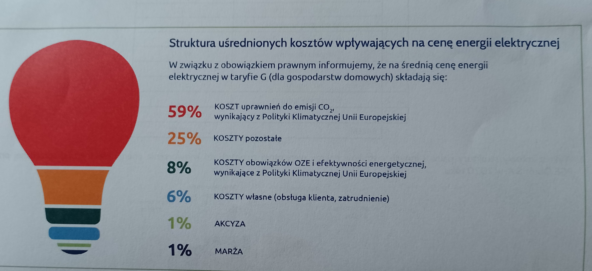  

---

### 2021

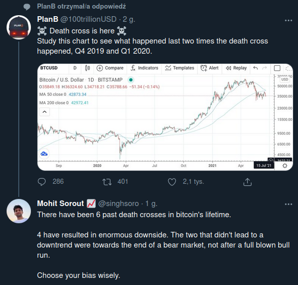  

### 1967

Podczas przemówienia na kongresie związków zawodowych w Warszawie, Władysław Gomułka nazwał Żydów mieszkających w Polsce „piątą kolumną”.

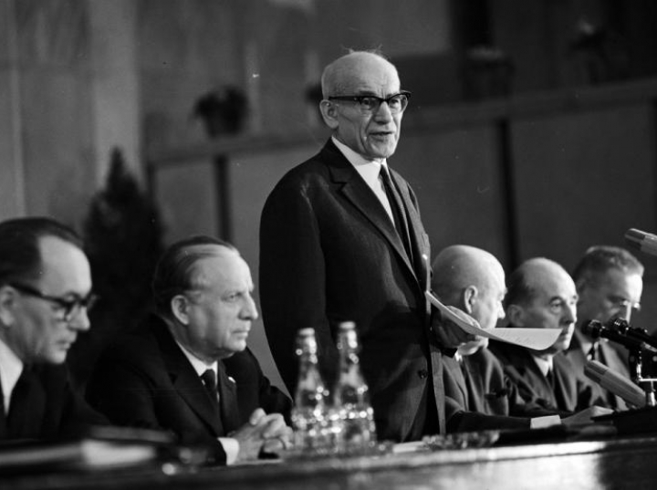  

### 1955

Na Górze Świętej Anny odsłonięto Pomnik Czynu Powstańczego.
Pierwotnie w miejsu tym znajdował się niemiecki kamieniołom o nazwie Kuthal,z którego wydobywano wapienie.
W 1934 r. właścicielka tego terenu, hrabina
von Francken-Sierstorpff z Żyrowej ,
przekazała dawny kamieniołom NSDAP
(według innej wersji, nie będąc
zwolenniczką nazizmu, została do tego
zmuszona) .
Nowe niemieckie władze postanowiły uczcić pamięć Niemców poległych w 1921 roku ,więc rozpoczęły przebudowę kamieniołomu na amfiteatr. Nad amfiteatrem wybudowano mauzoleum ku czci 50 Niemców poległych w bitwie o Górę Świętej Anny. Wkrótce później okazało się, że ciężar mauzoleum wybudowanego na skraju kamieniołomu powoduje osuwanie się skał. Pękające
skały groziły, że pewnego dnia runie w dół, więc już w 1942 r. poproszono geologa Assmanna z Berlina o zaprojektowanie prac ratunkowych.
W dole amfiteatru wybudowano niewielką
estradę oraz postument flagowy, a w celu właściwego odwodnienia w ziemi powstał labirynt tuneli, w których mieszkają dzisiaj nietoperze. Dodatkowo wybudowano również trzy drewniane baraki z toaletami.
Ich resztki przetrwały do czasów
współczesnych. Architekci Franz Böhmer i Georg Petrich zaprojektowali drewniane
dwupiętrowe schronisko młodzieżowe ze
172 miejscami noclegowymi, otwarte 17
października 1937 r. przez przywódcę
Hitlerjugend Baldura von Schiracha . Po
wojnie służyło jako harcówka i dom
wypoczynkowy, uległo spaleniu ok. 2000
roku. Obok schroniska powstały też miejsca na obozowiska dla młodzieży.
Po 1945 roku tym razem już władze polskie postanowiły wybudować w tym miejscu nowy pomnik. Tym razem upamiętniający jednak polskich powstańców. W drodze konkursu wybrano projekt Ksawerego Dunikowskiego.
Po licznych perturbacjach polityczno- ideologiczno-ekonomicznych nowy pomnik został odsłonięty dopiero po dziesięciu latach od rozpoczęcia jego budowy.

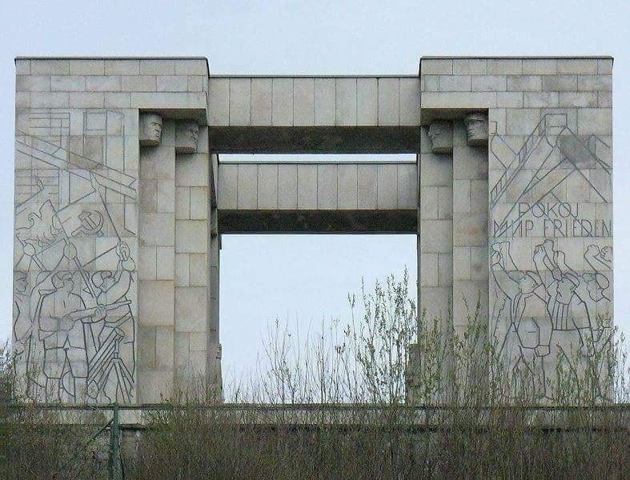  

### 1943

„Rzeczpospolita Polska ani żadne inne państwo polskie już nigdy się nie podniesie." - z zapisków Hansa Franka, dn. 19.06.1943 r.

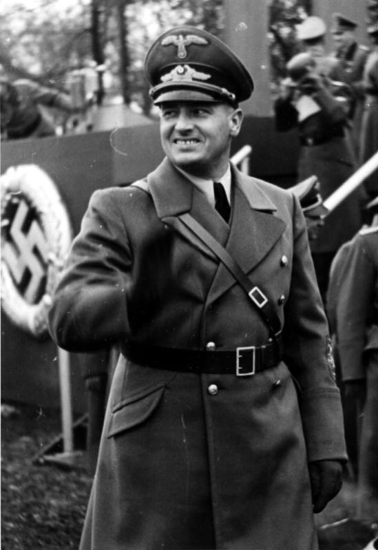  

„Potwierdzamy konieczność niszczenia wszystkiego, co może przypominać o istnieniu kiedyś królestwa polskiego, jako że ten podmiot został anulowany na zawsze” – z umowy z 26.1.1797 pomiędzy Rosją, Prusami i Austrią.

---

Po czteromiesięcznych torturach na Pawiaku i w siedzibie Gestapo na Szucha został zamordowany przez Niemców profesor doktor Jan Piekałkiewicz - ekonomista, członek Międzynarodowego Instytutu Statystycznego, działacz ruchu ludowego (od 1926 w PSL "Piast"); w czasie II wojny światowej w SL ,,Roch'', członek CKRL; od 1941 zastępca, a w sezonie 1942/43 Delegat Rządu na Kraj;odpowiedzialny za zatwierdzenie powołania Rady Pomocy Żydom „Żegota”. Pośmiertnie odznaczony Krzyżem Niepodległości Polski Podziemnej z Mieczami oraz Orderem Orła Białego.

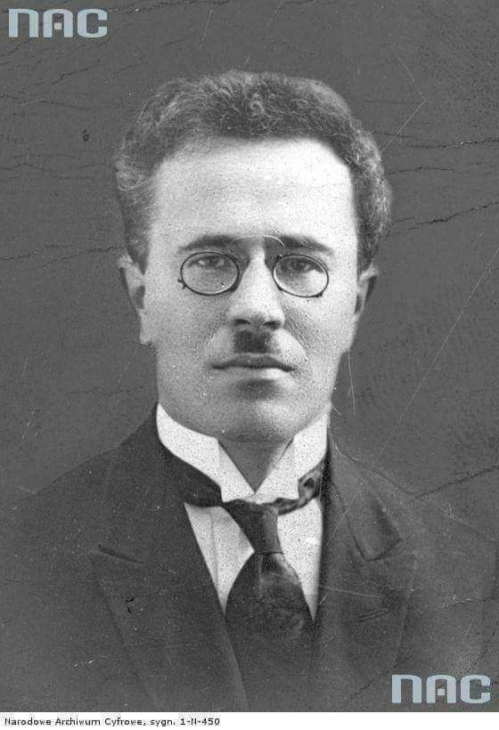  

---

Polski Oddział Partyzancki Armii Krajowej zdobył miasteczko Iwieniec, rozbijając tamtejszy garnizon niemiecki złożony z jednej kompanii żandarmerii (ponad 100 ludzi), – batalionu policji białoruskiej (300 ludzi), – kompanii gospodarczej (ok. 100 ludzi), – dwóch kompanii wojsk lotniczych ( 250 ludzi). Żołnierze zaatakowali jednocześnie niemiecki garnizon z zewnątrz i od środka. Do miasta przedostała się wcześniej 60 osobowa grupa żołnierzy w cywilnych ubraniach, uzbrojonych w broń krótką i granaty, którzy dodatkowo mieli do dyspozycji wsparcie w postaci członków miejscowej konspiracji. Akcją od wewnątrz dowodził podchorąży „Lech” Olgierd Woyno, Żołnierzy podzielono na cztery grupy, nad którymi dowództwo objęli: wachm. Jan Jakubowski ps. „Dąb”, plut. Walerian Żuchowicz ps. „Opończa”, plut. Józef Niedźwiedzki ps. „Szary” i plut. Bolesław Nowakowski. Ich zadaniem było zdobycie posterunków niemieckiej żandarmerii i białoruskiej policji, a także opanowanie poczty i niemieckiego biura gospodarczego. Zdobycie posterunków policji białoruskiej okazało się prostym zadaniem, gdyż większość policjantów na rozkaz starszego sierżanta Stefana Poznańskiego złożyła broń, nie podejmując walki. Niemieccy żandarmi stawiali natomiast zaciekły opór, który załamał się dopiero po oblaniu posterunku benzyną i podpaleniu go.
Dowódca batalionu piechoty ppor. Walenty Parchimowicz ps. „Waldan” przeprowadził atak na koszary nad Wołmą i uniemożliwił kwaterującym tam żołnierzom Luftwaffe przyjście z pomocą garnizonowi miasteczka.
Oddział pod dowództwem por. Kacpra Miłaszewskiego ps. „Lewald”, dysponujący dwoma ckm, zablokował drogę wiodącą z koszar do centrum Iwieńca.
Dowódca szwadronu kawalerii Polskiego Oddziału Partyzanckiego Armii Krajowej chor. Zdzisław Nurkiewicz ps. „Noc”przeprowadził zwiad konny i ubezpieczał drogi wiodące do Stołpc i Rakowa. Po 18 godzinnym zaciętym boju żołnierze AK uwolnili aresztowanych członków miejscowej siatki konspiracyjnej, pozyskali duże zapasy broni, sprzętu wojskowego, amunicji i żywności. Ponadto 80 sztuk bydła, kilkanaście koni wierzchowych, lekarstwa, a także personel medyczny złożony głównie z medyków narodowości żydowskiej, którzy byli przymuszeni do pracy dla Niemców.
W czasie walki poległo 3 żołnierzy Armii Krajowej, a około 11 zostało rannych. Po stronie przeciwnej poległo od 40 do 150 osób. Do opuszczających Iwieniec partyzantów dołączyli policjanci białoruscy ze swoim dowódcą starszym sierżantem Stefanem Poznańskim. Miasteczko Iwaniec pozostawało wolne przez dobę. Na domach zawisły biało-czerwone flagi.
Wydarzenia te przeszły do historii jako powstanie iwienieckie.

Na zdjęciu porucznik Kacper Miłaszewski „Lewald” - dowódca Polskiego Oddziału Partyzanckiego Armii Krajowej Obwodu Stołpce.

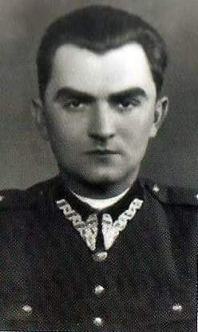  

### 1940

W Londynie miało miejsce spotkanie Naczelnego Wodza generała Władysława Sikorskiego z brytyjskim premierem Winstonem Churchillem. W jego trakcie obaj przywódcy zadeklarowali dalszą chęć wspólnej walki z Niemcami. Strona brytyjska zgodziła się na przyjęcie na swoje terytorium żołnierzy polskich ewakuowanych z Francji. Z kolei generał Sikorski przedstawił Churchillowi niekonsultowane z prezydentem Raczkiewiczem, memorandum, które dotyczyć miało normalizacji stosunków polsko-radzieckich oraz utworzenia na terytorium Związku Radzieckiego 300 tysięcznej armii polskiej.

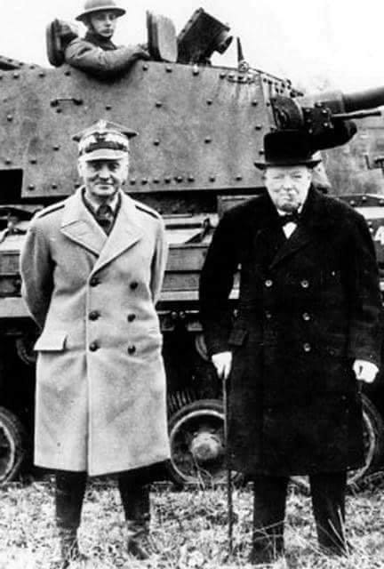  

### 1920

Swoją działalność rozpoczęła Warszawska Spółka Akcyjna Budowy Parowozów.
Założona ona została przez dwa lwowskie banki -Ziemski Bank Kredytowy i Polski Bank Przemysłowy. Powstanie tej spółki zrodziła również potrzeba wypełnienia warunków umowy z polskim rządem według której w ciągu 10 lat miało powstać 350 parowozów,a około 500 miało zostać poddanych remontowi.
Fabryka zajmująca 28 500 metrów kwadratowych powierzchni powstała w Warszawie w kwadracie ulic Karolkowej i Kolejowej.
Z braku własnych konstrukcji, fabryka
współpracowała początkowo z austriacką firmą Wienner Neustadt (dawniej G. Sigl) z Wiednia . Początkowo w fabryce montowano
z austriackich części parowozy serii 270, oznaczonej w Polsce jako Tr12. Pierwszy parowóz wyprodukowany w całości w kraju zjechał z lini montażowej w marcu 1924 roku.
W czasie drugiej wojny światowej zakład ten na potrzeby własnej kolei przejęli Niemcy.Po wojnie budynki Warszawskiej Spółki Akcyjnej Budowy Parowozów zniszczone podczas powstania warszawskiego odbudowano,ale profil produkcyjny fabryki przestawiono na budowę koparek i maszyn budowlanych znanych pod marką "Waryński"

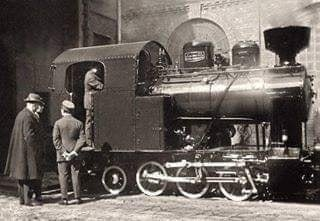  

### 1831

Podczas powstania listopadowego miała miejsce bitwa pod Ponarami na Wileńszczyźnie.
Polski korpus dowodzony przez generała Antoniego Giełguda oraz generała Dezyderego Chłapowskiego (grafika) przypuścił atak na Wilno bronione przez wojska rosyjskie pod dowództwem generała brygady Fabiana von der Osten-Sackena.
Licząca 25 tysięcy żołnierzy armia carska skutecznie stawiła czoło Polakom, którzy stracili 2 tysiące ludzi. Straty rosyjskie wyniosły około 400 osób.
Jedną z głównych przyczyn polskiej porażki była zła koordynacja działań. Doprowadziło to do wewnętrzego konfliktu w szeregach polskich, w wyniku którego, oskarżony o nieudolne dowodzenie generał Giełgud zginął zastrzelony 13 lipca 1831 roku przez oficera 7. Pułku Piechoty kapitana Stefana Skulskiego.

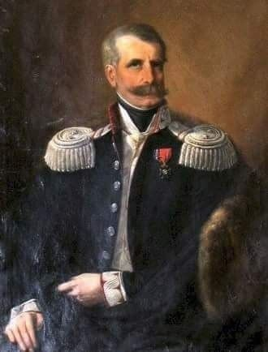  

### 1791

Powołano pierwszego w historii Polski ministra spraw zagranicznych. Został nim Joachim Litawor Chreptowicz ( na zdjęciu). Pełna nazwa sprawowanego przez niego urzędu brzmiała Minister Spraw Zagranicznych Rzeczpospolitej Obojga Narodów.
Chreptowicz był bliskim i zaufanym współpracownikiem króla Staniaława Augusta. W czasie wojny polsko-rosyjskiej w 1792 roku nakłaniał go do przystąpienia Konfederacji Targowickiej.
Ciekawostką jest fakt,że z zamiłowania był pszczelarzem.
Swój urząd sprawował prawie dokładnie przez rok.

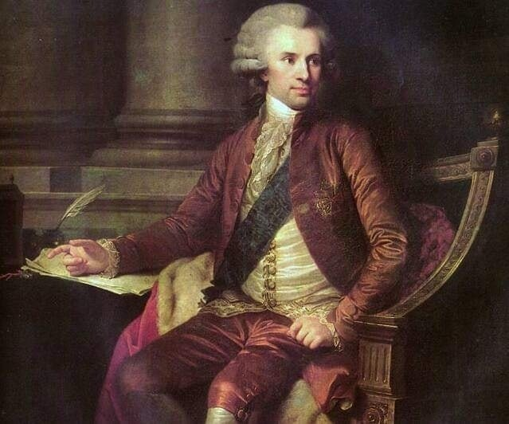  

---

<a href="https://github.com/TomaszWaszczyk/historia.waszczyk.com/edit/master/src/content/june-19.md" target="_blank">Edytuj tę stronę dzieląc się własnymi notatkami!</a>
