### 2022

Tuż przed upływem grace period Rosjanie spłacili co prawda w dolarach, po zaskakującym zwrocie, dwie serie obligacji zapadających 4 kwietnia.
Okazuje się jednak, że przy tej okazji nie doliczyli odsetek za 30-dniowy okres karencji w wysokości 1.9 mln USD.

Po interwencji inwestorów, decyzją Credit Derivatives Determinations Committee, uznane to zostało za wydarzenie typu failure to pay. A to uruchomi płatności dla inwestorów zabezpieczonych CDS.

Problem, czy to już jest, czy jeszcze nie pełny default, roztrzygnie się ostatecznie już niebawem.

26 czerwca kończy się grace period dla 2 serii obligacji z końca maja. Tyle, że Dep. Skarbu nie przedłużył już pozwolenia na otrzymywanie, w drodze wyjątku od sankcji, płatności dolarowych od obligacji rosyjskich przez inwestorów z USA. Wygasło ono 25 maja. W odpowiedzi na to Rosja wróciła do opowieści o tym, że płacić będzie za dług denominowany w dewizach już tylko w rublach.

W tej sytuacji, o ile 26 czerwca default Rosji zostanie potwierdzony, wierzyciele mają prawo zażądać natychmiastowego uregulowania płatności za 38 mld USD rosyjskich obligacji rządowych denominowanych w walutach obcych.

26 czerwca więc - nawet gdyby Putin znów zmienił zdanie i pozwolił zapłacić za dług w dewizach, podczas, gdy Amerykanie swojej decyzji o zamknięciu okienka w sankcjach nie zmienią - Rosja uznana zostanie za kraj niewypłacalny.

To zasadniczo zmieni pozycję Rosji na globalnym rynku finansowym, nawet przy nieprzerwanym strumieniu kolejnych wpływów dewizowych za eksport surowców. Najzabawniejsze jednak przy tym, że wcale nie musi to zmienić pozycji rubla. Kraj niewypłacalny z mocnym pieniądzem. Tego jeszcze nie przerabialiśmy.

### 2021

"Nigdy w historii ludzkości żaden masowy opór ani żadna rewolucja nie była wspierana jednocześnie przez mainstreamowe media, rządy, uczelnie i artystów. Więc jeśli Twoje poglądy są zbieżne z tym co mówią wielkie media, czołowi politycy, wykładowcy i artyści, to można śmiało stwierdzić, że wcale nie jesteś za rewolucją, tylko za utrzymaniem obecnego układu."
Na ilustracji największe korporacje stosujące jeden z wielu tzw. #virtuesignalling (PrideMonth, BLM, etc.) przy jednoczesnych głosach "uciemiężonych mniejszosci" o życiu w rzekomym "opresyjnym sytemie". Niczym wielu zachodnich komunistów żyjących w kapitalizmie i krytykujących system przy jednoczesnym czerpaniu z niego maksimum korzyści.

  

### 2020

W zapisie minutes z kwietniowego posiedzenia Rady Polityki Pienieznej, znalazlo sie oszalamiajace stwierdzenie.

"(...)Obnizka stop przyczyni sie do ograniczenia efektow wtornych epidemii Covid-19 - takich jak wzrost bezrobocia i silny spadek popytu konsumpcyjnego - poprawiajac tym samym sredniookresowe perspektywy krajowej koniunktury i WZMACNIAJAC STABILNOSC SYSTEMU FINANSOWEGO (podkreslenie moje). (...) Efekt ten bedzie wzmacniany przez pozytywnie wplyw obnizki stop procentowych na nastroje podmiotow gospodarczych po ustaniu pandemii".

Trudno to skomentowac. Efektywnosc kanalu stop procentowych w Polsce jest niska. Przy tak wielkich jak teraz zaburzeniach strukturalnych w gospodarce wyizolowanie wplywu stop procentowych na stope bezrobocia, czy popyt krajowy jest praktycznie niewykonalne, bo zmianie (trwalej/nietrwalej?)podlegaja tradycyjne funkcje reakcji podmiotow gospodarczych.

Jedna tylko rzecz nie budzi watpliwosci. Wbrew zapisowi w minutes obnizka stop oslabia stabilnosc systemu finansowego.
Wyniki bankow i ubezpieczycieli leca w dol. W przypadku bankow spoldzielczych spadek marzy odsetkowej wyzeruje tegoroczny kilkusetmilionowy wynik finansowy. A w roku 21odwroci znak przy tym wyniku na minus.
Czy powazny konstytucyjny organ moze dowolnie rzezbic w faktach?

---

Trump mobilizuje US Army do zatrzymania zamieszek. Do tego Godzina Policyjna na terenie całego kraju (od 7 wieczorem).

Czyli w sumie taki "stan wojenny".

Prawdopodobnie w ramach Insurrection Act to zalegalizuje.

https://en.wikipedia.org/wiki/Insurrection_Act

Moim zdaniem błędnie myslal ten, kto bral kredyt i zakładał, że sytuacja makroekonomiczna nie zmieni się przez 30 lat. W historii świata chyba nie było okresu bez kryzysu w takim okresie. To jest gra. Ci mniejsi nie znają jednak znają jej reguł.

---

🇺🇸 Minionej nocy w USA protesty stanowiły poważne zagrożenie dla Białego Domu. Demonstracje są reakcją na uduszenie przez policjanta czarnoskórego George'a Floyda podczas zatrzymania.

❗️ Zdewastowany został pomnik Tadeusza Kościuszki znajdujący się przed siedzibą prezydenta. Kościuszko był zwolennikiem demokracji, walczył o prawa mniejszości rasowych. W swoim testamencie przekazał część swego majątku na wykupienie i uwolnienie czarnoskórych niewolników Thomasa Jeffersona (ojca założyciela USA). Paradoksalnie pomnik został zniszczony przez ludność czarnoskórą domagającą się swoich praw.

🔉 Oburzenie zdewastowaniem pomnika wyraził ambasador RP w USA Piotr Wilczek, na Twitterze napisał: "Jestem zniesmaczony i zbulwersowany wandalizmem wobec pomnika Tadeusza Kościuszki w Waszyngtonie, bohatera, który walczył o niepodległość zarówno USA jak i Polski".

🔹 Podczas demonstracji niektórzy uczestnicy, atakują policję kostką brukową czy koktajlami mołotowa (mołotowa?! mamy ślady ruskich służb!). Sklepy są niszczone i plądrowane.

❗️ Donald Trump został zaprowadzony przez służby bezpieczeństwa do podziemnego schronu. Protesty wywołały podwyższony stan zagrożenia wewnątrz prezydenckiego kompleksu, jeden z najwyższych od czasu ataków terrorystycznych z 11 września 2001 roku Prezydent miał być wstrząśnięty i poważnie obawiał się o swoje bezpieczeństwo – donosi agencja AP.

⁉️ Donald Trump, który sprawia wrażenie niezniszczalnego, który przez swój Twitter ustawia cały świat, każde Rezerwie Federalnej obniżać stopy, rynkom akcji rosnąć, Iranowi zakazuje handlować, UE wprowadzić podatku od gigantów technologicznych, siedzi w schronie i trzęsie galotami przed własnym narodem?

🔹 A czym nasz wspaniały przywódca świata zajmuje się poza bunkrem? Przegrywa handlowe starcie z Chinami, które wstrzymały import produktów rolnych za to, że USA zabrały przywileje Hongkongu.

⚠️ Tak szanowni Państwo, prezydent USA domaga się, żeby Chiny importowały g**niane amerykańskie żarcie. Zmodyfikowaną genetycznie soję i napchaną hormonami i antybiotykami wieprzowinę. Na szczęście tego typu produkty żywnościowo-podobne nie spełniają standardów w UE, dlatego trzeba wcisnąć to Chińczykom.

🔜 Zdajecie sobie sprawę z tego absurdu? Prezydent kraju, który uchodzi za technologiczne imperium, staje na rzęsach, żeby komunistyczne Chiny kupowały od nich żywność… nieprzetworzoną żywność. Tak jak kraje afrykańskie domagają się od UE, żebyśmy kupowali od nich produkty rolnictwa, bo ich gospodarki nie mogą zaproponować nic innego, do takiej pozycji w handlu międzynarodowym spada Ameryka wspaniałego Donalda Trumpa, który ma usta pełne frazesów „substantial progres, extraordinary success, historical deal”. 🔚

Skrajnie lewicowy ruch Antifa, odpowiedzialny za falę protestów w USA po zabiciu George'a Floyd'a, Trump chciałby uznać za organizację terrorystyczną. Podczas protestów niektórzy członkowie organizacji spotykają się z neonazistami i grupami białej supremacji. W ponad 20 stanach na ulice została wysłana Gwardia Narodowa. Na wypadek eskalacji przemocy powołano blisko 62.000 rezerwistów.

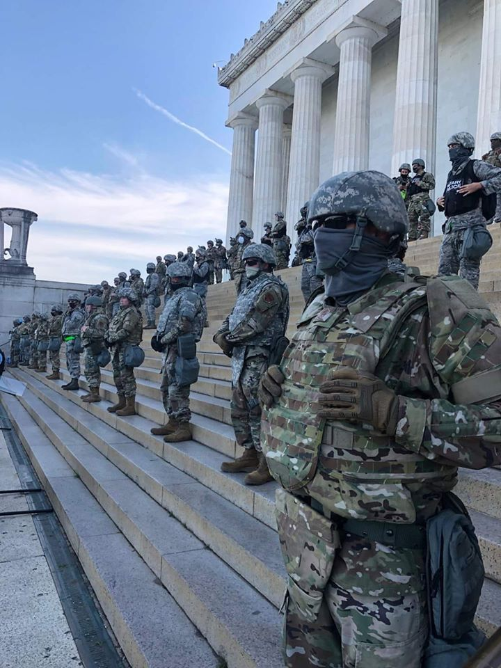  

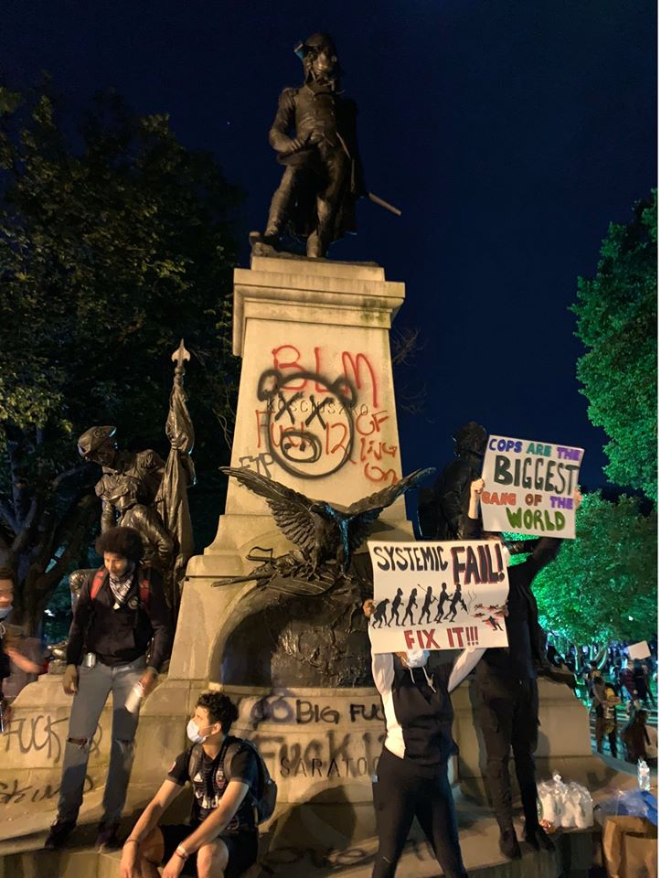  

Those people who devastated the monument of brigadier general Andrzej Tadeusz Bonawentura Kościuszko do not know that Kościuszko’s last will and testament stipulated that the proceeds of his American estate – granted to him by Congress for his 8-year engagement in the Revolutionary War – be spent on freeing and educating African American slaves. This included those of his friend Thomas Jefferson, who was named as the will's executor. Several years after Kościuszko's death, Jefferson, aged 77, pleaded his inability to execute the will due to age and the numerous legal complexities of the bequest.

  

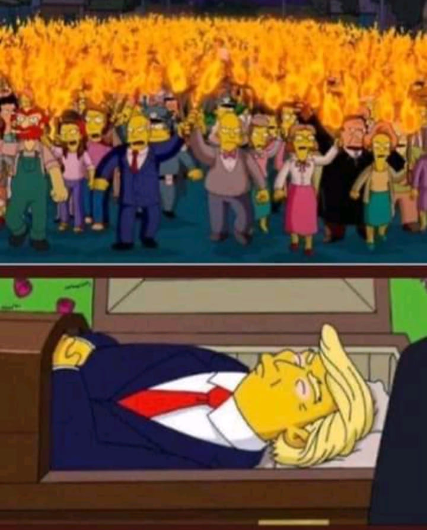  

---

### 1979

Papież Jan Paweł II rozpoczął swoją pierwszą pielgrzymkę do Polski, która trwała do 9 czerwca. W czasie wygłaszania homilii na placu Zwycięstwa w Warszawie papież wypowiada słynne słowa: "Niech zstąpi Duch Twój! Niech zstąpi Duch Twój! I odnowi oblicze ziemi. Tej Ziemi!''

Homilia w czasie Mszy św. odprawionej na placu Zwycięstwa, 2 czerwca 1979 roku.
(Cały tekst)

Niech będzie pochwalony Jezus Chrystus!

Umiłowani Rodacy,
Drodzy Bracia i Siostry,
Uczestnicy eucharystycznej Ofiary, która sprawuje się dziś w Warszawie na placu Zwycięstwa.

1. Razem z wami pragnę wyśpiewać pieśń dziękczynienia dla Opatrzności, która pozwala mi dziś jako pielgrzymowi stanąć na tym miejscu.

Pragnął — wiemy, że bardzo gorąco pragnął — stanąć na ziemi polskiej, przede wszystkim na Jasnej Górze, zmarły niedawno papież Paweł VI. Pierwszy po wielu stuleciach papież-pielgrzym. Do końca życia nosił to pragnienie w swoim sercu i z nim zszedł do grobu. I oto czujemy, że pragnienie to było tak potężne i tak głęboko uzasadnione, że przerosło ramy jednego pontyfikatu i — w sposób po ludzku trudny do przewidzenia — realizuje się dzisiaj. Dziękujemy więc Bożej Opatrzności za to, że dała Pawłowi VI tak potężne pragnienie. Dziękujemy za cały ten styl papieża-pielgrzyma, jaki zapoczątkował wraz z Soborem Watykańskim II. Gdy bowiem Kościół cały uświadomił sobie na nowo, iż jest Ludem Bożym — Ludem, który uczestniczy w posłannictwie Chrystusa, Ludem, który z tym posłannictwem idzie przez dzieje, który „pielgrzymuje”, papież nie mógł dłużej pozostać „więźniem Watykanu”. Musiał stać się na nowo Piotrem pielgrzymującym, tak jak ten pierwszy, który z Jerozolimy przywędrował poprzez Antiochię do Rzymu, aby tam dać świadectwo Chrystusowi i przypieczętować je swoją krwią.

Dzisiaj dane mi jest wypełnić to pragnienie zmarłego papieża Pawła VI wśród was, umiłowani synowie i córki mojej Ojczyzny. Kiedy bowiem — z niezbadanych wyroków Bożej Opatrzności po śmierci Pawła VI i po kilkutygodniowym zaledwie pontyfikacie mojego bezpośredniego poprzednika Jana Pawła I — zostałem głosami kardynałów wezwany ze stolicy św. Stanisława w Krakowie na stolicę św. Piotra w Rzymie, zrozumiałem natychmiast, że moim szczególnym zadaniem jest spełnienie tego pragnienia, którego Paweł VI nie mógł dopełnić na milenium chrztu Polski.

Jako więc wasz rodak, syn polskiej ziemi, a zarazem jako papież-pielgrzym witam was wszystkich! Witam najdostojniejszego Prymasa Polski. Witam wszystkich obecnych tutaj arcybiskupów, biskupów, pasterzy Kościoła w naszej Ojczyźnie. Pozwólcie, że pośród naszych gości powitam w sposób szczególny kardynała-arcybiskupa Santo Domingo. To tam wypadało mi skierować pierwsze kroki papieskiego pielgrzymowania w miesiącu styczniu. Tam po raz pierwszy ucałowałem ziemię, na której stanęła kiedyś stopa Krzysztofa Kolumba, po której przeszły stopy tylu głosicieli Ewangelii, a wśród nich także i naszych rodaków i polskich żołnierzy. Dzisiaj, wspólnie z wami, tego świadka mojej pierwszej papieskiej podróży witam w Warszawie.

Czyż moja pielgrzymka do Ojczyzny w roku, w którym Kościół w Polsce obchodzi 900 rocznicę śmierci św. Stanisława, nie jest zarazem jakimś szczególnym znakiem naszego polskiego pielgrzymowania poprzez dzieje Kościoła — nie tylko po szlakach naszej Ojczyzny, ale zarazem Europy i świata? Odsuwam tutaj na bok moją własną osobę — niemniej muszę wraz z wami wszystkimi stawiać sobie pytanie o motyw, dla którego właśnie w roku 1978 (po tylu stuleciach ustalonej w tej dziedzinie tradycji) został na rzymską stolicę św. Piotra wezwany syn polskiego narodu, polskiej ziemi. Od Piotra, jak i od wszystkich apostołów Chrystus żądał, aby byli Jego „świadkami w Jerozolimie i w całej Judei, i w Samarii, i aż po krańce ziemi” (Dz 1, 8).

Czyż przeto nawiązując do tych Chrystusowych słów, nie wolno nam wnosić zarazem, że Polska stała się w naszych czasach ziemią szczególnie odpowiedzialnego świadectwa? Że właśnie stąd — z Warszawy, a także z Gniezna, z Jasnej Góry, z Krakowa, z całego tego historycznego szlaku, który tyle razy nawiedzałem w swoim życiu i który w tych dniach znów będę miał szczęście nawiedzić, że właśnie stąd ze szczególną pokorą, ale i ze szczególnym przekonaniem trzeba głosić Chrystusa? Że właśnie tu, na tej ziemi, na tym szlaku, trzeba stanąć, aby odczytać świadectwo Jego Krzyża i Jego Zmartwychwstania? Ale, umiłowani rodacy — jeśli przyjąć to wszystko, co w tej chwili ośmieliłem się wypowiedzieć — jakżeż ogromne z tego rodzą się zadania i zobowiązania! Czy do nich naprawdę dorastamy?

2. Dane mi jest dzisiaj, na pierwszym etapie mojej papieskiej pielgrzymki do Polski, sprawować Najświętszą Ofiarę w Warszawie, na placu Zwycięstwa. Liturgia sobotniego wieczoru, w przeddzień Zesłania Ducha Świętego przenosi nas do wieczernika w Jerozolimie, w którym nazajutrz apostołowie — zgromadzeni wokół Maryi, Matki Chrystusa — mają otrzymać Ducha Świętego. Otrzymają Ducha, którego Chrystus im wyjednał przez krzyż, aby w mocy tego Ducha mogli wypełnić Jego polecenie. „Idźcie więc i nauczajcie wszystkie narody, udzielając im chrztu w imię Ojca i Syna, i Ducha Świętego. Uczcie je zachowywać wszystko, co wam przykazałem” (Mt 28,19-20). W takich słowach Chrystus Pan przed swym odejściem ze świata przekazał apostołom swe ostatnie polecenie, swój „mandat misyjny”. I dodał: „A oto Ja jestem z wami przez wszystkie dni aż do skończenia świata” (Mt 28, 20).

Dobrze się stało, że moja pielgrzymka do Polski, związana z 900 rocznicą męczeńskiej śmierci św. Stanisława, wypadła w okresie Zesłania Ducha Świętego oraz uroczystości Trójcy Przenajświętszej. W taki bowiem sposób mogę, dopełniając jakby pośmiertnie pragnienia Pawła VI, przeżyć raz jeszcze tysiąclecie chrztu na ziemi polskiej i wpisać tegoroczny Stanisławowy jubileusz w to tysiąclecie, z którego wzięły początek całe dzieje narodu i Kościoła. Właśnie uroczystość Zesłania Ducha Świętego oraz Trójcy Przenajświętszej szczególnie nas przybliża do tego początku. W apostołach, którzy otrzymują Ducha Świętego w dzień Zielonych Świąt, są już niejako duchowo obecni wszyscy ich następcy, wszyscy biskupi, również ci, którym od tysiąca lat wypadło głosić Ewangelię na ziemi polskiej. Również ten Stanisław ze Szczepanowa, który swoje posłannictwo na stolicy krakowskiej okupił krwią przed dziewięciu wiekami.

I są w tych apostołach i wokół nich — w dniu Zesłania Ducha Świętego — zgromadzeni nie tylko przedstawiciele tych ludów i języków, które wymienia księga Dziejów Apostolskich. Są wokół nich już wówczas zgromadzone różne ludy i narody, które przyjdą do Kościoła poprzez światło Ewangelii i moc Ducha Świętego w różnych epokach, w różnych stuleciach. Dzień Zielonych Świąt jest dniem narodzin wiary i Kościoła również na naszej polskiej ziemi. Jest to początek przepowiadania wielkich spraw Bożych również w naszym polskim języku. Jest to początek chrześcijaństwa również w życiu naszego narodu: w jego dziejach, w jego kulturze, w jego doświadczeniach.

3a. Kościół przyniósł Polsce Chrystusa — to znaczy klucz do rozumienia tej wielkiej i podstawowej rzeczywistości, jaką jest człowiek. Człowieka bowiem nie można do końca zrozumieć bez Chrystusa. A raczej: człowiek nie może siebie sam do końca zrozumieć bez Chrystusa. Nie może zrozumieć, ani kim jest, ani jaka jest jego właściwa godność, ani jakie jest jego powołanie i ostateczne przeznaczenie. Nie może tego wszystkiego zrozumieć bez Chrystusa.

I dlatego Chrystusa nie można wyłączać z dziejów człowieka w jakimkolwiek miejscu ziemi. Nie można też bez Chrystusa zrozumieć dziejów Polski — przede wszystkim jako dziejów ludzi, którzy przeszli i przechodzą przez tę ziemię. Dzieje ludzi! Dzieje narodu są przede wszystkim dziejami ludzi. A dzieje każdego człowieka toczą się w Jezusie Chrystusie. W Nim stają się dziejami zbawienia.

Dzieje narodu zasługują na właściwą ocenę wedle tego, co wniósł on w rozwój człowieka i człowieczeństwa, w jego świadomość, serce, sumienie. To jest najgłębszy nurt kultury. To jej najmocniejszy zrąb. To jej rdzeń i siła. Otóż tego, co naród polski wniósł w rozwój człowieka i człowieczeństwa, co w ten rozwój również dzisiaj wnosi, nie sposób zrozumieć i ocenić bez Chrystusa. „Ten stary dąb tak urósł, a wiatr go żaden nie obalił, bo korzeń jego jest Chrystus” (Piotr Skarga, Kazania sejmowe). Trzeba iść po śladach tego, czym — a raczej kim — na przestrzeni pokoleń był Chrystus dla synów i córek tej ziemi. I to nie tylko dla tych, którzy jawnie weń wierzyli, którzy Go wyznawali wiarą Kościoła. Ale także i dla tych, pozornie stojących opodal, poza Kościołem. Dla tych wątpiących, dla tych sprzeciwiających się.

3b. Jeśli jest rzeczą słuszną, aby dzieje narodu rozumieć poprzez każdego człowieka w tym narodzie — to równocześnie nie sposób zrozumieć człowieka inaczej jak w tej wspólnocie, którą jest jego naród. Wiadomo, że nie jest to wspólnota jedyna. Jest to jednakże wspólnota szczególna, najbliżej chyba związana z rodziną, najważniejsza dla dziejów duchowych człowieka. Otóż nie sposób zrozumieć dziejów narodu polskiego — tej wielkiej tysiącletniej wspólnoty, która tak głęboko stanowi o mnie, o każdym z nas — bez Chrystusa. Jeślibyśmy odrzucili ten klucz dla zrozumienia naszego narodu, narazilibyśmy się na zasadnicze nieporozumienie. Nie rozumielibyśmy samych siebie. Nie sposób zrozumieć tego narodu, który miał przeszłość tak wspaniałą, ale zarazem tak straszliwie trudną — bez Chrystusa. Nie sposób zrozumieć tego miasta, Warszawy, stolicy Polski, która w roku 1944 zdecydowała się na nierówną walkę z najeźdźcą, na walkę, w której została opuszczona przez sprzymierzone potęgi, na walkę, w której legła pod własnymi gruzami, jeśli się nie pamięta, że pod tymi samymi gruzami legł również Chrystus-Zbawiciel ze swoim krzyżem sprzed kościoła na Krakowskim Przedmieściu. Nie sposób zrozumieć dziejów Polski od Stanisława na Skałce do Maksymiliana Kolbe w Oświęcimiu, jeśli się nie przyłoży do nich tego jeszcze jednego i tego podstawowego kryterium, któremu na imię Jezus Chrystus.

Tysiąclecie chrztu Polski, którego szczególnie dojrzałym owocem jest św. Stanisław — tysiąclecie Chrystusa w naszym wczoraj i dzisiaj — jest głównym motywem mojej pielgrzymki, mojej dziękczynnej modlitwy wspólnie z wami wszystkimi, drodzy rodacy, których Jezus Chrystus nie przestaje uczyć wielkiej sprawy człowieka. Z wami, dla których Chrystus nie przestaje być wciąż otwartą księgą nauki o człowieku, o jego godności i jego prawach. A zarazem nauki o godności i prawach narodu.

Księże Prymasie! Pragnę tę Najświętszą Ofiarę wspólnie z braćmi biskupami i kapłanami złożyć we wszystkich intencjach, które Wasza Eminencja wymienił na początku.

W dniu dzisiejszym na tym placu Zwycięstwa w stolicy Polski proszę wielką modlitwą Eucharystii wspólnie z wami, aby Chrystus nie przestał być dla nas otwartą księgą życia na przyszłość. Na nasze polskie jutro.

4. Stoimy tutaj w pobliżu Grobu Nieznanego Żołnierza. W dziejach Polski — dawnych i współczesnych — grób ten znajduje szczególne pokrycie. Szczególne uzasadnienie. Na ilu to miejscach ziemi ojczystej padał ten żołnierz. Na ilu to miejscach Europy i świata przemawiał swoją śmiercią, że nie może być Europy sprawiedliwej bez Polski niepodległej na jej mapie? Na ilu to polach walk świadczył o prawach człowieka wpisanych głęboko w nienaruszalne prawa narodu, ginąc „za wolność naszą i waszą”? „Gdzie są ich groby, Polsko! gdzie ich nie ma! Ty wiesz najlepiej — i Bóg wie na niebie!” (Artur Oppman, Pacierz za zmarłych).

Dzieje Ojczyzny napisane przez Grób jednego Nieznanego Żołnierza.

Przyklęknąłem przy tym grobie, wspólnie z Księdzem Prymasem, aby oddać cześć każdemu ziarnu, które — padając w ziemię i obumierając w niej, przynosi owoc. Czy to będzie ziarno krwi żołnierskiej przelanej na polu bitwy, czy ofiara męczeńska w obozach i więzieniach. Czy to będzie ziarno ciężkiej, codziennej pracy w pocie czoła na roli, przy warsztacie, w kopalni, w hutach i fabrykach. Czy to będzie ziarno miłości rodzicielskiej, która nie cofa się przed daniem życia nowemu człowiekowi i podejmuje cały trud wychowawczy. Czy to będzie ziarno pracy twórczej w uczelniach, instytutach, bibliotekach, na warsztatach narodowej kultury. Czy to będzie ziarno modlitwy i posługi przy chorych, cierpiących, opuszczonych. Czy to będzie ziarno samego cierpienia na łożach szpitalnych, w klinikach, sanatoriach, po domach: „wszystko, co Polskę stanowi”.

Skąd przychodzą te słowa? Księże Prymasie, tak głosi Akt milenijny, złożony przez ciebie i Episkopat Polski na Jasnej Górze: „wszystko, co Polskę stanowi”.

To wszystko w rękach Bogarodzicy — pod krzyżem na Kalwarii i w wieczerniku Zielonych Świąt.

To wszystko: dzieje Ojczyzny, tworzone przez każdego jej syna i każdą córkę od tysiąca lat — i w tym pokoleniu, i w przyszłych — choćby to był człowiek bezimienny i nieznany, tak jak ten żołnierz, przy którego grobie stoimy...

To wszystko: i dzieje ludów, które żyły wraz z nami i wśród nas, jak choćby ci, których setki tysięcy zginęły w murach warszawskiego getta.

To wszystko w tej Eucharystii ogarniam myślą i sercem i włączam w tę jedną jedyną Najświętszą Ofiarę Chrystusa na placu Zwycięstwa.

I wołam, ja, syn polskiej ziemi, a zarazem ja: Jan Paweł II papież, wołam z całej głębi tego tysiąclecia, wołam w przeddzień święta Zesłania, wołam wraz z wami wszystkimi:

Niech zstąpi Duch Twój!

Niech zstąpi Duch Twój!

I odnowi oblicze ziemi.

Tej Ziemi!

Amen.

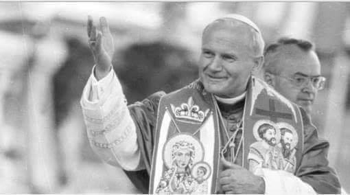  

---

### 1948

W więzieniu Landsberg stracony został profesor Karl Franz Gebhardt - osobisty lekarz SS-Reichsfuhrera Heinricha Himmlera, odpowiedzialny za przeprowadzanie wiwisekcji na ludziach. Był przewodniczącym niemieckiego Czerwonego Krzyża. Latem 1947 roku na procesie norymberskim ( procesy norymberskie II stopnia, sprawa I „medycyny”) profesor Gebhardt został skazany na karę śmierci przez powieszenie. W czasie swojej działalności na terenie KL Ravensbrück wspólnie z doktor Hertą Oberheuser oraz doktorem Fritzem Fischerem nadzorowali bądź osobiście prowadzili pseudomedyczne eksperymenty na więźniarkach, również na Polkach. W czasie procesu norymberskiego profesor Gebhardt tłumaczył, że Polki, jako członkinie ruchu oporu zostały mu powierzane do wykonania na nich przewidzianej prawnie kary śmierci. Materiał dowodowy wykazał, że nie nakazano doktorowi doświadczeń, ale sam szukał sposobności ku temu. Przeważnie zadawał więźniarkom rany i zakażał je, aby wypróbować różne metody leczenia ( np. leczenie sulfonamidami.) Przeszczepiano fragmenty kości, wcześniej miażdżąc kończyny za pomocą młota. Często po przeprowadzonym eksperymencie ofiary zabijano zastrzykiem z benzyny.

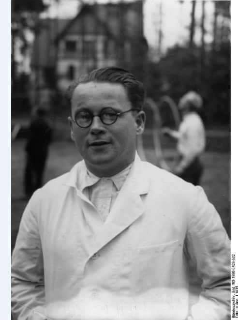  

### 1944

W Chęcinach ( woj. świętokrzyskie) Niemcy dokonali eksterminacji mieszkańców tej miejscowości. Ludność zgromadzono na rynku głównym, wybrano 42 mężczyzn, którzy zostali rozstrzelani.
Akcja ta była odwetem za zamach na na konwój wiozący niemieckich oficerów, którego 31 maja 1944 roku dokonał w Czerwonej Górze partyzancki oddział AK pod dowództwem Zbigniewa Kruszelnickiego "Wilka".

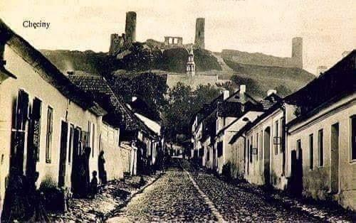  

### 1943

Oddział żandarmerii niemieckiej pod dowództwem komendanta posterunku żandarmerii niemieckiej w Wieliczce Johana Krewera dokonał pacyfikacji wsi Ispina w województwie małopolskim.
Do wsi Niemcy dotarli z samego rana. Wchodzili do domów i wyprowadzali z nich zastanych tam mężczyzn, których według własnego uznania określali bandytami. Jeden ze świadków wspominał:
"Niemcy otoczywszy wieś wstępowali do domów wyprowadzając mężczyzn, twierdząc, że są oni bandytami: tyś bandyta, bo nieogolony, tyś bandyta bo masz 5-ro dzieci, żonę a mało pola. Jeden z żandarmów wywlókł mężczyznę z łóżka, zaprowadził przed dowódcę i powiedział: tego bandytę chwyciłem z bronią w ręku".
13 wywleczonych z domów mężczyzn zgromadzono na terenie gospodarstwa Adama Nosalskiego, z którego następnie wywieziono ich na tereny leśnictwa Chobot-Grobla zwanego „Mokre”. Tam wszystkich rozstrzelano. Przed śmiercią wszystkim dano do rąk naboje i karabiny i ustawiono do zdjęcia, które miało być dowodem na ich bandycką działalność, a następnie wręczono szpadle, którymi skazańcy wykopali doły, do których wrzucono ich ciała.
Wśród policjantów i żandarmów niemieckich, którzy dokonali pacyfikacji było kilku Volkdeutschów na czele z cieszącym się złą sławą Robertem Boguschem z Bochni. Za "zasługi ludobójcze" dowodzący akcją Johan Krewer został odznaczony we wrześniu 1943 r. Krzyżem Zasługi II klasy bez mieczy.

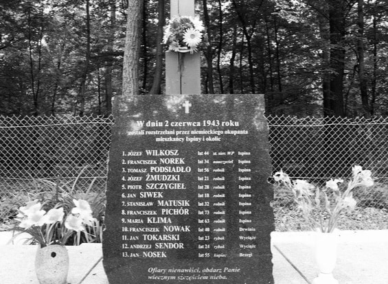  

### 1940

Okupacyjne władze wprowadziły na terenie całej Warszawy niemieckie nazwy ulic pisane gotykiem. Tylko w przypadku części z nich zachowano ich pierwotne znaczenie.
I tak na przykład Plac Wilsona przemianowano na Danziger platz, Puławską na Feldherrnhalee, Aleje Jerozolimskie na Reichstrasse, Aleje Ujazdowskie na Lindeenalee, Aleje Niepodległości na Nordsudslee, Belwederską na Sonnenstrasse.

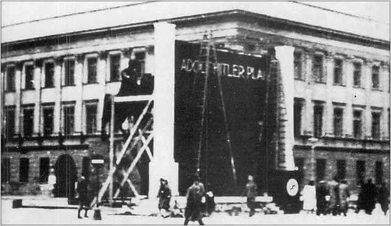  

### 1881

W Grodnie urodził się Juliusz Rómmel- polski generał.
W 1900 roku ukończył szkolenie w Korpusie Kadetów w Pskowie,a trzy lata później Konstantynowską Szkołę Wojskową w Petersburgu. W tym samym czasie został w wieku 22 lat awansowany do stopnia podporucznika,a dwa lata później został porucznikiem.
Podczas I wojny światowej służąc w I brygady artylerii gwardii pełnił m.in. funkcje starszego oficera baterii, dowódcy parku artylerii i
dowódcy baterii. W czasie walk był dwukrotnie ranny.
W 1915 roku został kapitanem,a następnie pułkownikiem.
Po wybuchu rewolucji lutowej w Rosji, od sierpnia 1917 roku uczestniczył w tworzeniu
oddziałów polskich na Ukrainie . Dowodził kolejno: oddziałem polskim w Kijowie (I 1918),
samodzielnym dywizjonem artylerii konnej (II- V1918) oraz samodzielną lekką brygadą III
Korpusu Polskiego, na czele której stał do rozwiązania korpusu w czerwcu 1918 roku. Potem został internowany przez Austriaków.
W listopadzie 1918 roku jako dowódca obozu i pułku artylerii w Rembertowie rozpoczął służbę w Wojsku Polskim.
W czasie wojny polsko-sowieckiej dowodził początkowo I brygadą artylerii Legionów, a później l Dywizją Piechoty Legionów.
Od lipca 1920 roku stał na czele l dywizji kawalerii, z którą brał udział w walkach odwrotowych na Wołyniu, w Małopolsce Wschodniej, w obronie Lwowa oraz w rejonie Zamościa.
W 1919 roku został generałem brygady, a dwa lata później inspektorem kawalerii w Wilnie. Od kwietnia 1924 roku do 1926 roku był dowódcą pierwszej Dywizji Kawalerii,a w 1929 roku pełnił funkcję generała w Generalnym Inspektoracie Sił Zbrojnych.
23 marca 1939 r. został dowódcą Armii „Łódź". Dowodził nią w czasie kampanii polskiej 1939 roku podczas bitwy granicznej i w
walkach nad Wartą i Widawką.
8 września dotarł do stolicy obejmując dowództwo Grupy Armii „Warszawa", a 10 września Armii „Warszawa" z zadaniem
obrony Warszawy i Modlina.
28 września 1939 roku trafił do niemieckiej niewoli do obozu jenieckiego w Murnau, gdzie przebywał do kwietnia 1945 roku.
Po wyzwoleniu obozu przez armię
amerykańską wyjechał do Francji.
Jednak w lipcu 1945 r. powrócił do kraju i zgłosił się do służby w ludowym Wojsku Polskim, gdzie pełnił funkcję doradcy Naczelnego Dowódcy WP do spraw szkolenia.
W czerwcu 1947 roku przeszedł w stan spoczynku.
Był autorem wielu artykułów i książek, m.in.: "Moje walki z Budionnym”(1932), „Kawaleria
polska w pościgu za Budionnym”(1933), „Za Honor i Ojczyznę”(1958).
Był odznaczony m.in.: Orderem Virtuti Militari kl. II, IV i V, Krzyżem Niepodległości, Orderem Polonia Restituta kl. IV, czterokrotnie Krzyżem Walecznych oraz Złotym Krzyżem Zasługi.
Zmarł 3 września 1967 r. w Warszawie. Pochowany został w Alei Zasłużonych na Cmentarzu Powązkowskim w Warszawie.

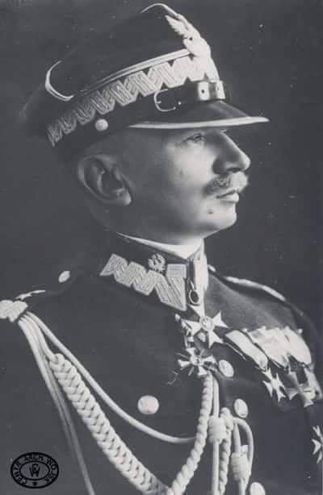  

### 1861

Rosyjski generał Nikołaj Suchozanet (na zdjęciu) został namiestnikiem Królestwa Polskiego. Zastąpił na tym stanowisku Michaiła Gorczakowa.
Rządy Suchozaneta to czas terroru i represji. Wprowadził on w Królestwie Polskim system terroru wobec społeczeństwa polskiego i kościoła katolickiego, w okresie niepokojów porzedzających wybuch powstania styczniowego. W okresie kierowania Armią było prowadzone szereg reform w wojsku, mających na celu ograniczenie rozchodów (likwidacja nadawania ziem, skrócenie służby wojskowej żołnierzy do 15 lat).
Suchozanet nie posiadał dostatecznego przygotowania administracyjnego i był nieświadomy prowadzonych reform, w związku z czym został zdjęty ze stanowiska ministra. Został wyznaczony namiestnikiem
Królestwa Polskiego.

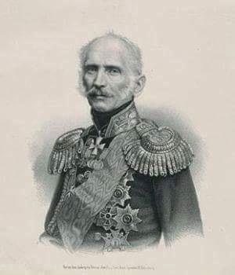  

### 1611

W Wilnie, podczas uroczystości Bożego Ciała został zlinczowany przez tłum włoski kalwinista Franco de Franco. Przed tym incydentem brał udział w odbywającym się w zborze wileńskim nabożeństwie w czasie którego pastor Andrzej Chrząstowski ostro skrytykował katolickie obrzędy Bożego Ciała nazywając je bałwochwalstwem. Wywarło to na niego tak ogromny wpływ, że po wyjściu ze zboru udał się w miejsce, gdzie odbywała się procesja i obok jednego z ołtarzy wykrzyczał w stronę zgromadzonych przed nim wiernych:
"Wy niebożęta zaślepieni, wielkie bałwochwalstwo czynicie, gdy opłatkowi cześć oddawacie i śpiewacie o nim. Bogu chwałę oddawajcie, który jest w niebiosach, a bałwochwalstwa zaniechajcie, ani boskiej chwały rzeczom ziemskim nie dawajcie!”
Tłum rzucił się na niego, a on sam wkrótce trafił do więzienia, gdzie został poddany całonocnym torturom. Sprawa odbiła się głośnym echem i szybko dotarła do samego papieża. Głównym oskarżycielem Franco był kaznodzieja królewski Piotr Skarga, który osobiście zabiegał o jak najsurowsze ukaranie bluźniercy. W efekcie złożono mu propozycję darowania życia w zamian za przejście na katolicyzm, z  której nie skorzystał.
Został stracony w lochach wileńskiego ratusza 30 czerwca 1611 roku w wieku około 25 lub 26 lat. Kat wyrwał Franco język (była to zwyczajowa kara za bluźnierstwo), następnie jego ciało zostało porąbane na części, które zawieszono na pręgierzu. Potem ciało spalono, a popioły wrzucono do rzeki.

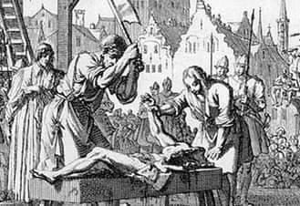  

### 1537

Papież Paweł III w bulli Sublimis Deus uznał Indian za byty racjonalne, wolne i jako takie zdolne do przyjęcia chrześcijaństwa.

„Stwierdzamy i oświadczamy […], że Indianie i wszyscy inni ludzie, jacy mogą być odkryci w przyszłości przez chrześcijan, nie mogą być pozbawiani wolności i własności, nawet jeśli pozostają poza wiarą w Chrystusa, że mogą i powinni swobodnie i zgodnie z prawem cieszyć się wolnością i własnością ich mienia i nie mogą być brani w niewolę. Wszystko, co jest z tym prawem sprzeczne, będzie nieważne”.

Znaczenie tej bulli jest wręcz epokowe. Był to pierwszy dokument, który uznawał godność każdego człowieka oraz jego prawo do wolności i własności niezależnie od jakichkolwiek kryteriów, np. rasy, narodowości czy wyznania. W ten sposób Kościół stanął na przeszkodzie w realizacji ekonomicznych interesów europejskich elit przez nieskrępowany rabunek bogactw naturalnych i eksploatację ludzkiej pracy. Waga dokumentu jest tym większa, że został on wydany w okresie, gdy Kościół był rozdzierany przez konflikty wewnętrzne, w tym Reformację i schizmę anglikańską. Bulla wywołała ostry konflikt z właścicielami tzw. „encomiendas” w Nowym Świecie, czyli wielkoobszarowych gospodarstw prowadzonych przez kolonizatorów, gdzie eksploatowano tubylców.

Należy jednak pamiętać, że bulla była dokumentem kościelnym i nie powodowała skutków w sferze prawa świeckiego. Niemniej na wszystkich ignorujących jej zalecenia nakładano automatyczną ekskomunikę. Przez następnych trzysta lat Kościół był jedyną instytucją broniącą uniwersalnych praw człowieka.

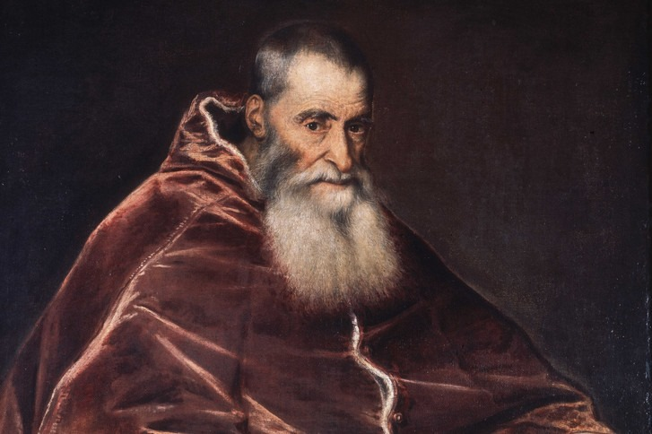  

---

<a href="https://github.com/TomaszWaszczyk/historia.waszczyk.com/edit/master/src/content/june-2.md" target="_blank">Edytuj tę stronę dzieląc się własnymi notatkami!</a>
