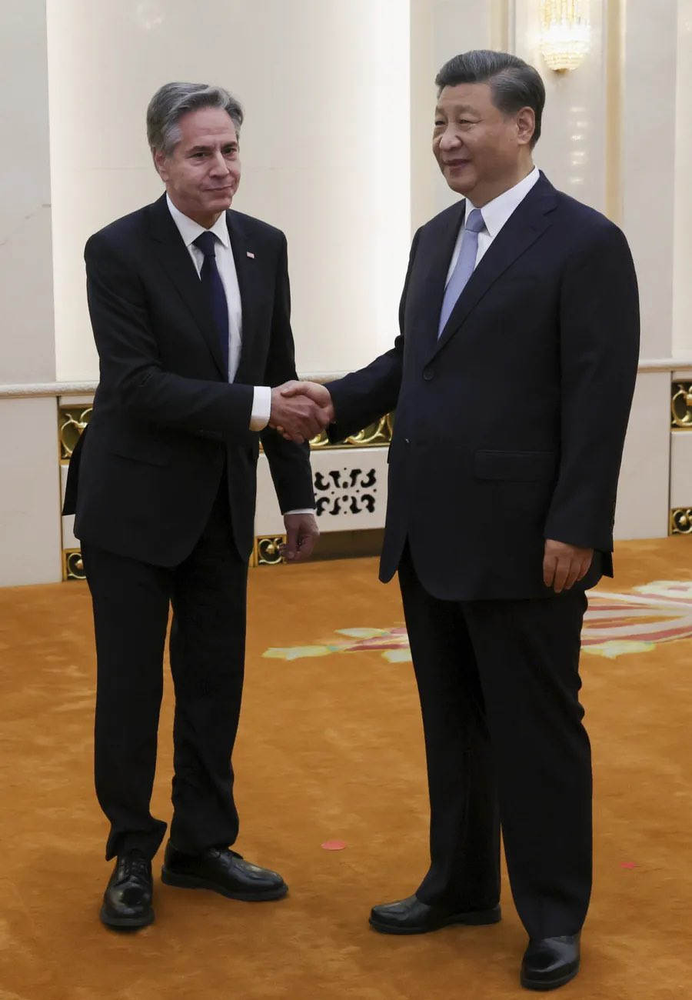
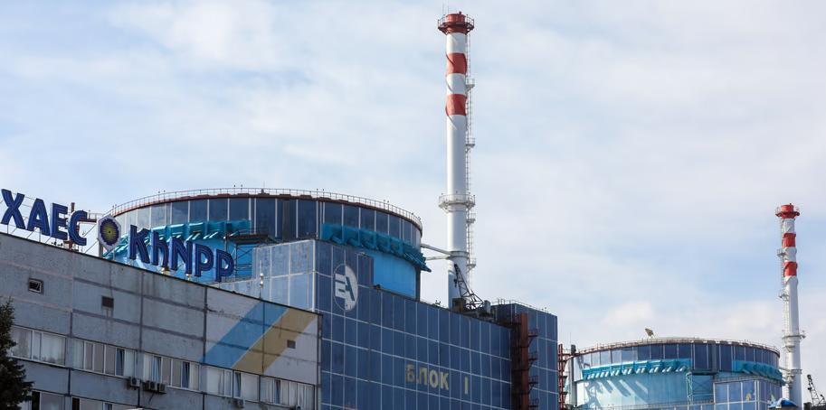
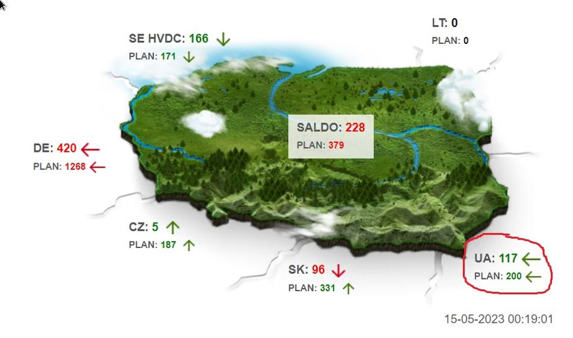
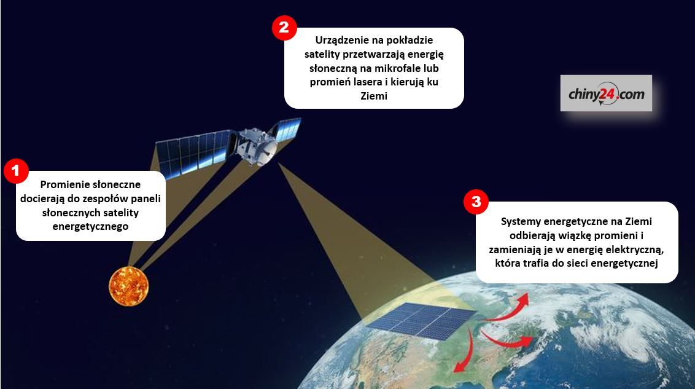
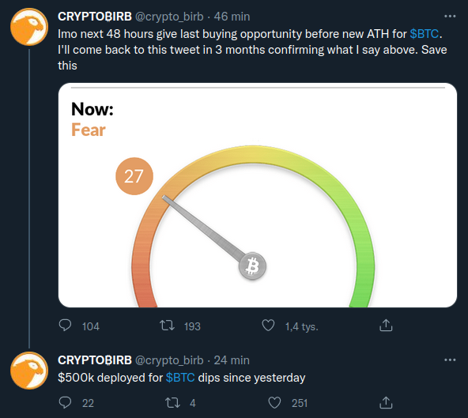
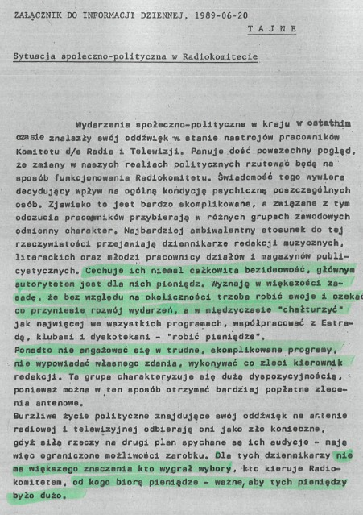
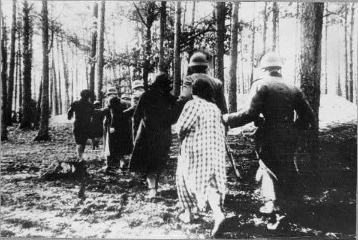

### 2023

Intel zainwestuje około 30 mld euro w budowę dwóch fabryk czipów w Magdeburgu w Saksonii-Anhalt. Od Niemiec otrzyma prawie 10 mld euro.

---

> BLINKEN SAYS U.S. DOES NOT SUPPORT TAIWAN INDEPENDENCE

  

---

<video width="640" height="480" controls>
<source src="./movies/june/climatechange.mp4" type="video/mp4">
Your browser does not support the video tag.
</video>

---

Natomiast w Polsce:

<video width="640" height="480" controls>
<source src="./movies/june/stan-umyslu-kobiet.mp4" type="video/mp4">
Your browser does not support the video tag.
</video>

---

Po 22 latach Chiny zniosły embargo na polską wołowinę.

---

Prąd z Ukrainy płynie do Polski(od około 15. maja)!!! Nowe połączenie ruszyło po cichu - politycy ani media jakoś przypadkiem o tym nie mówią.

PS. Na Ukrainie są warunki wojenne. W Polsce nie..

> Bez konferencji, przemówień polityków i przecinania wstęgi — w poniedziałek 15 maja ruszył komercyjny przesył energii elektrycznej nową linią Rzeszów-Chmielnicka. Aktualnie do Polski płynie prąd z Chmielnickiej Elektrowni Jądrowej.

  

Zdjęcie: Chmielnicka Elektrownia Jądrowa w Niecieszynie (obwód chmielnicki) na Ukrainie.

Plan wymiany międzysystemowej na obecną dobę przewiduje import ukraińskiej energii do naszego kraju w godzinach nocnych oraz w godz. 9-15. Zdolności przesyłowe w tym przypadku sięgają 200 MW. Możliwy jest także eksport polskiego prądu do Ukrainy, ale nie jest zaplanowany na najbliższe godziny.

  

<!-- ---

<video width="640" height="480" controls>
<source src="./movies/june/rapper.mp4" type="video/mp4">
Your browser does not support the video tag.
</video> -->

---

### 2022

Założyłeś PPK, IKE, IKZE nie dostaniesz emerytury z US 🤔 Suweren sprytny, ale władza ludu sprytniejsza 😁 ZUS, dzięki aktywnemu udziałowi PiS, m.in. obniżeniu wieku emerytalnego jest bankrutem o czym wiedzą już prawie wszyscy. Zabrakło chętnych, żeby dać się wydoić na "system zastępczy" czyli #PPK. Ale to nie koniec drogi ku "szczęśliwości emeryta".

---

#CHINY pracują nad budową orbitalnej elektrowni słonecznej
-☀- w 2028 roku na niskiej orbicie pojawi się satelita energetyczny;
-☀-będzie pobierał energię słońca i zamieniał a wiązkę mikrofal, lub laserową;
-☀-wiązka będzie przekazywana przez satelitę do stacji bazowych, które z kolei zamienia ją na energię elektryczną i wprowadzą do sieci energetycznej;
-☀-w pierwszej fazie elektrownia ma osiągnąć moc 10 kW;
-☀-celem projektu jest budowa stacji energetycznej o mocy 2 GW (2050);
-☀-chiński projekt przyspiesza, bo z podobnymi projektami zamierzają ruszyć m.in. Brytyjczycy i Amerykanie (przy czym borykają się z dylematem "chcieć, a móc");
-☀-tymczasem my uzyskaliśmy możliwość swobodnego zbierania chrustu;

  

<!-- Koncert mocarstw cz. 3: Obszar transakcyjny. Podstawowa znajomość historii pozwala coraz lepiej dobrze zrozumieć Macronete i postawę Scholza https://lnkd.in/dS2hFTXF Europejskim hegemonom silna Rosja jest potrzebna, żeby równoważyć wpływy Anglosasów i rozdawać karty co najmniej w Europie i której część środkowo-wschodnia winna pozostawać jedynie podporządkowaną politycznie sferą wpływów euroazjatyckich mocarstw. W dobie przywracania w UE popularnej praworządności brzmi to trochę jakby science-fiction, ale 📌 DE i FR właśnie przestały nawet udawać, że demokratyczne samostanowienie, prawa człowieka, integralność terytorialna to ważne europejskie wartości.

Zachód obawia się zwycięstwa UA, ponieważ oznaczałoby to osłabienie Putina, czyli największego sojusznika FR i DE. Gwałcenie matek na oczach dzieci i rozstrzeliwanie ich po wszystkim, wyrywanie zębów dzieciom - żeby zrobić dzieciom to samo, masowe egzekucje związanych cywili, ludobójstwo z użyciem zakazanej broni, celowy atak rakietowy na schron i zamordowanie 600 matek z dziećmi? Czymże są maluchy na tle takiego kornika drukarza, albo DE&I, ESG... Zachód obawia się wolnej UA, bo to oznaczałoby utratę wpływów w środku Europy, który nie ma już wątpliwości, że jego jedyną nadzieją i sojusznikiem są odległe USA. Przypomnijmy: jeszcze roku temu Putin żądał wycofania NATO za Odrę i taki deal w zamian za NS2 był już na stole. A jak ktoś ma dobra pamięć, to w 2009 r. po wycofaniu się przez Obamę z budowy tarczy antyrakietowej w PL/CZ, Sarkozy entuzjastycznie podsumowywał, że 📌 "To doskonała decyzja z każdego punktu widzenia. To wyjątkowo pozytywne i mądre. Mam nadzieję, że nasi rosyjscy przyjaciele przywiążą do niej dużą wagę".

Polecam jak zawsze redaktora Krajewskiego, byłego pracownika IPN. https://lnkd.in/e9hgyADp DE i FR chcą płacić Rosji terytorium i niepodległością UA: podobnie rzecz się miała z Europą Środkową po 1918 r 📌 W zamian za rezygnację z agresywnej polityki Francja i Wielka Brytania zapłaciły Hitlerowi w Monachium częścią terytorium Czechosłowacji (ale przywódca III Rzeszy choć zapłatę wziął, zobowiązań nie dotrzymał). Potem Hitler zapłacił Stalinowi za sojusz i dostawy surowców połową Polski, Litwą, Łotwą, Estonią oraz rumuńską Besarabią.

Dziś rola „obszaru transakcyjnego” przypadła Ukrainie. Następna w kolejce jest Polska 📌 Ale prace nad nią już trwają od dawna: 104 rezolucje, posiedzenia, uchwały przeciwko Warszawie i jedno wyłączenie prądu. Ciężko mi coraz bardziej wierzyć, że jakaś strefa € wzmocni nasze bezpieczeństwo, a nawet mam już wątpliwości, że tzw. twarde jądro UE będzie nas w ogóle przed Rosją bronić. Obywatelstwo europejskie, parady, chorągiewki, federalizm brzmiałyby tak fajnie, gdyby nie brutalna rzeczywistość... -->

<!-- Polacy, których historia i dorobek zostały "rozkradzione" przez zaborców oraz potem przez "wielkiego brata" nie zdają sobie sprawy jak ich tradycja i kreatywność były ważnym czynnikiem budującym cywilizację zachodnią.
Nie pamiętamy, że pierwszy na świecie wizerunek koła i wozu jest z terenów polskich. A sneki polskich Chąśników były niedoścignionym wzorem statków dla Wikingów.

Ale ja przypomnę przewoźny młyn zbożowy Solskiego opracowany dla wojska i opublikowany przez autora wraz z innymi jego wynalazkami w 1690 r.. Młyn taki rozwiązywał logistyczny problem niewygody, gdy obóz lokować trzeba było z dala od młynów. Urządzenia ze zbożem "na jednym wozie osadzone, mąkę mlec mogły na dwa kamienie tak sposobnie jako wodne".

S.Solski tak opisuje ten swój rysunek: Sporządzenie tedy wozowego młyna będzie takowe, jakie pokazują 2 figury: jedna reprezentująca stojące wały, wysokość cewów [to tzw szesciornia czyli koło kątowej przekładni zębowej zbudowane z dwóch pierścieni z otworami -ryfek- w których były umieszczone palce czyli cewki - przyp. TP] i kamieni grubość, druga dyjametry [średnice] albo rozłożystość wałów, kół, cewów i kamieni..."
Dzięki temu rozwiązaniu podobno Napoleon się podjął ataku na Rosję i bezprzecznie, mimo taktyki spalonej ziemi do Moskwy dotarł.

Często śmiejemy się z przodków i wydaje nam się, że wiemy od nich więcej (korzystając przy tym z ich dorobku), no to Inżynierowie od Innowacji, wszystko już wiecie, projekt znacie, zbudujcie🙂 -->

---

  

---

### 2020

W 1947 roku decyzję o likwidacji Prus wydała Sojusznicza Rada Kontroli Niemiec, gdyż „były nośnikiem militaryzmu i reakcji w Niemczech".

Tymczasem spadkobiercy Hohenzollernów nie kryją, że zamierzają nieco podretuszować obraz rodziny w niemieckiej świadomości historycznej. Dotyczy to przede wszystkim zaangażowania Hohenzollernów w ruch nazistowski. – Mój dziadek książę Luis Ferdynand był członkiem ruchu oporu przeciwko nazistom, ryzykując tym samym życie – podkreśla obecnie głowa rodu książę Jerzy Fryderyk. Przekonuje też, że to „naziści sprostytuowali Prusy".

Nie wiadomo, czy miał na myśli księcia Augusta Wilhelma, syna cesarza, który już w 1930 roku został członkiem SA. Znany jako Prinz Auwi występował na wiecach, spotkaniach i w knajpach nazistowskich, wygłaszając przemówienia, których wartość propagandowa była trudna do przecenienia. Nie był zresztą jedynym Hohenzollernem po stronie Hitlera.

---

Filmy, które będą wkrótce zakazane? Lista jest długa
20 czerwca 2020, Najwyższy Czas
„Przeminęło z wiatrem”, kultowy film został tymczasowo usunięty z katalogu HBO Max i oskarżony o „rasistowskie uprzedzenia”. „Variety” sporządził dodatkowo listę „dziesięciu problematycznych filmów”. Są na niej m.in. „Forrest Gump”, „Indiana Jones”, czy „Milczenie owiec”.
„Archiwa Hollywoodu są pełne filmów, w których można znaleźć przestarzałe przedstawienia rasy, seksualności i niepełnosprawności”. Autor: „nie chodzi o zakazanie ich dystrybucji”, ale o krytyczną ocenę.
Autor propozycji, Tim Gray uważa np. „Forresta Gumpa” za film „wrogo nastawiony do weteranów Wietnamu, pacjentów chorych na AIDS, osób niepełnosprawnych i działaczy politycznych”. „Indiana Jones i zagubiona świątynia” drwi z Hindusów. Westerny obrażają tubylczych Indian, itd., itp.
Dostaje się nawet „Pewnego razi w Hollywood” Tarantino, za „idealizację epoki”, która odrzucała „emancypację kobiet, mniejszości i hipisów”. Poprawność polityczna staje się cenzurą …
Swoją drogą tylko czekać aż jakiś idiota sporządzi podobną listę polskich filmów. Z pewnością będzie „Seksmisja”, „W pustyni i w puszczy”, czy „Vabank”, za słynne „Czy zastałem tego pana Murzyna z psem”

### 2009

Wyemitowano srebrną monetę kolekcjonerską Czesław Niemen o nominale 10 zł. Była pierwszą monetą z serii Historia polskiej muzyki rozrywkowej, poświęconą postaci Czesława Niemena. Moneta jest klipą o kształcie kwadratowym.
Podczas międzynarodowej wystawy Coin Constellation 2010 w Petersburgu, polska moneta była nominowana w dwóch kategoriach: najlepsza koncepcja artystyczna oraz Srebrna moneta roku. Statuetkę przyznano w kategorii Srebrna moneta roku. Statuetki otrzymali zarówno emitent - Narodowy Bank Polski jak i producent Mennica Polska.

  

Foto: Awers monety.

### 1989

  

### 1983

Ukazał się debiutancki album grupy Lady Pank pod tym samym tytułem.
Grupa w składzie: Janusz Panasewicz, Jan Borysewicz, Edmund Stasiak, Jarosław Szlagowski i Paweł Mścisławski nagrała na nim takie utwory jak: "Mniej niż zero", "Kryzysowa narzeczona", "Fabryka małp", "Zamki na piasku", czy "Vademecum skauta".

  

### 1982

W Londynie zmarł Zygmunt Szyszko-Bohusz, generał; od 1918 roku w Wojsku Polskim; w polskiej wojnie obronnej 1939 dowodził 16. dywizją piechoty; w 1940 organizował i dowodził Samodzielną Brygadą Strzelców Podhalańskich (Brygada Podhalańska walnie przyczyniła się do zwycięstwa jakie osiągnięto pod Narwikiem. – podkreślał gen. Bohusz-Szyszko. – Osiągnięte ono zostało w dużym stopniu dlatego, że Podhalanie wyszli na tyły i zmiękczyli w ten sposób obronę, bo walka o sam Narwik była bardzo ostra i bardzo ciężka.); w latach 1941/43 obejmował funkcję szefa sztabu Armii Polskiej w ZSRR, dowodził 5. Kresową Dywizją Piechoty, następnie był zastępcą dowódcy: Armii Polskiej na Wschodzie, 2 Korpusu Polskiego; po wojnie osiadł na emigracji, gdzie brał aktywny udział w życiu polskiej emigracji. Swoje doświadczenie wykorzystywał publikując artykuły i książki historyczne oraz angażując się w działalność kombatancką.

Foto: Gen. Zygmunt Bohusz-Szyszko z saperami 2 Korpusu. Za nim stoi samochód Willys MB.
Data wydarzenia: 1944-05-13
Miejsce: Monte Cassino

  

### 1950

Władze komunistyczne przeprowadziły na terenie całej Polski, zakrojoną na szeroką skalę akcję aresztowania Świadków Jehowy. Przyczyną tego była odmowienie przez ŚJ podpisania Apelu Sztokholmskiego -orędzia przedstawionego w Sztokholmie 25 marca 1950 roku, wzywającego do zaprzestania produkcji broni atomowej. Brak poparcia dla tej inicjatywy, odebrany przez komunistów jako poparcie polityki USA stał się doskonałym pretekstem do szykan wobec tej mniejszości wyznaniowej oraz stosowania represji. Aresztowanych zostało 5 tysięcy osób.

  

### 1947

https://pl.wikipedia.org/wiki/Wojciech_Roszkowski - ciekawe wykłady o upadku cywilizacji

### 1944

Na ulicy Krochmalnej 74 w Warszawie oddział pod dowództwem porucznika Stefana Rysia wykonał wyrok śmierci na Eugeniuszu Świerczewskim (zdjęcie) polskim zdrajcy, agencie niemieckim o kryptonimie "100", który przyczynił się bezpośrednio do rozpracowania Oddziału II Komendy Głównej Armii Krajowej i zadenuncjowania generała Stefana Roweckiego "Grota".
Do współpracy z Niemcami, po aresztowaniu żony zwerbował go jego szwagier- inny znany polski zdrajca, agent Gestapo w Armii Krajowej Ludwik Kalkstein.

  

### 1943

W więzieniu na ulicy Szucha w Warszawie samobójstwo popełniła Aleksandra Sokalówna (zdjęcie), łączniczka Oddziału Operacyjno - Wojskowego Komendy Głównej Służby Zwycięstwu Polski-Związku Walki Zbrojnej, a także kierowniczka łączności dywersyjnego oddziału dyspozycyjnego Komendy Głównej AK ,,Osa" - ,,Kosa 30" oraz nauczycielka wychowania fizycznego w gimnazjum imienia Aleksandry Piłsudskiej w Warszawie.
Sokalówna aresztowana została 5 czerwca 1943 roku w kościele świętego Aleksandra na placu Trzech Krzyży podczas ślubu porucznika Mieczysława Uniejewskiego z Teofilą Suchanek (opisywaliśmy to wydarzenie).
Brutalne śledztwo i tortury nie były w stanie jej złamać. Nie wydała nikogo.
Miała 30 lat.

  

### 1940

Niemcy rozstrzelali w największej egzekucji w Palmirach 378 osób. Zamordowano m.in. marszałka Sejmu RP - Macieja Rataja, lekkoatletę, złotego medalistę olimpiady w Los Angeles - Janusza Kusocińskiego, posła PPS - Mieczysława Niedziałkowskiego, panią poseł i senator - Halinę Jaroszewicz, wiceprezydenta Warszawy - Jana Pohoskiego. Rozstrzelano także Agnieszkę Dowbor-Muśnicką, siostrę Janiny Lewandowskiej, jedynej kobiety zamordowanej w Katyniu. W Palmirach rozstrzelano wielu wybitnych działaczy społecznych i politycznych, nauczycieli, dziennikarzy, lekarzy, adwokatów, księży, w 21 przeprowadzonych egzekucjach od grudnia 1939 do lipca 1941 roku zginęło ponad 1700 osób. Palmiry obok Katynia stanowią najbardziej znany symbol martyrologii inteligencji polskiej w okresie II wojny światowej.

  

### 1937

https://pl.wikipedia.org/wiki/Zillmannowie

### 1920

„Pękajcie okowy niewoli! Górny Śląsk jest
wolny! Armjo polska, wkraczaj nań i połącz go
z Polską!”
Pod takim hasłem 20 czerwca 1920 roku wkraczały do Górnego Śląska wojska polskie dowodzone przez Stanisława Szeptyckiego.
Po III powstaniu śląskim Polsce przyznano część terytorium Górnego Ślaska.
Akcję wkraczania polskich sił zbrojnych do
miast na Górnym Śląsku przygotowywał i
koordynował Komitet Przyjęcia Wojska
Polskiego. Jego prezesem honorowym został
działacz narodowy i dyktator III Powstania
Śląskiego Wojciech Korfanty, a rzeczywistym
organizatorem był wybitny działacz narodowy
Jan J. Kowalczyk, który stał na czele 11-
osobowego wydziału wykonawczego.
Oto fragment opisu tej uroczystości:
" 0 godz. 8 rano przekroczyła granicę przednia
straż armji, wkraczającej na Śląsk, złożona z
mniejszych oddziałów, aut pancernych i
kawalerji. 0 godz. 8’15 przybył na granicy
general Szeptycki w otoczeniu oficerów swego
sztabu. Byli między nimi: generał
Horoszkiewicz, dowódca 23 dywizji, która prze­
znaczona została dla Górnego Sląska, dalej
szef sztabu grupy gen. Szeptyckiego pułkownik
Prohaska, szef sztabu 23 dywizji pułkownik
Wzacny i inni.
Następnie gen. Szeptycki wraz z wojskiem, za
nim postępującem, ruszył na ziemię śląską i
drogą przez Roździeń, Szopienice, Bórowiec i
Zawodzie udał się do Katowic. Przed armją
polską postępowały Bandery włościańskie,
Towarzystwa zawodowe i kulturalne, Związek
byłych Hallerczyków, Związek byłych
marynarzy polskich, Sokoli, Harcerze,
Powstańcy. Bezpośrednio przed gen.
Szeptyckim postępowała kompanja honorowa
byłych Powstańców górnośląskich,
prowadzona przez byłego zastępcę naczelnego wodza powstańczego, majora Ludygę- Laskowskiego. Kompanja ta szła z
karabinami, które potem w Katowicach oddała
wojsku polskiemu."

  

### 1895

W Szczucinie w województwie małopolskim urodził się Bronisław Rakowski - Legionista, uczestnik czterech wojen: I wojny światowej, wojny polsko-ukraińskiej, wojny polsko-bolszewickiej, II wojny światowej, generał brygady Wojska Polskiego; podczas polskiej wojny obronnej 1939 szef Sztabu Frontu Południowego oraz Obrony Lwowa; schwytany przez NKWD i więziony na Łubiance w Moskwie do sierpnia 1941; po uwolnieniu na mocy układu Sikorski-Majski został dowódcą Ośrodka Organizacyjnego, a następnie dowódcą 8 i 5 Dywizji Piechoty; 11 grudnia 1941 awansowany do stopnia generała brygady; w sezonie 1942/43 szef sztabu Armii Polskiej na Wschodzie, a później dowódca 2 Brygady Pancernej, z którą odbył całą kampanię włoską 2 Korpusu Polskiego; w latach 1945/47 dowódca 2 Warszawskiej Dywizji Pancernej; zdemobilizowany, resztę życia spędził na emigracji, gdzie zmarł 28 grudnia 1950 roku w Buenos Aires (Argentyna).

Odznaczenia:

- Krzyż Złoty Orderu Wojennego Virtuti Militari
- Krzyż Srebrny Orderu Wojennego Virtuti Militari
- Krzyż Oficerski Orderu Odrodzenia Polski
- Krzyż Niepodległości
- Krzyż Walecznych – czterokrotnie
- Złoty Krzyż Zasługi z Mieczami
- Krzyż Oficerski Legii Honorowej
- Distinguished Service Order (bryt. "Order za Wybitną Służbę")
- Ordine Dei SS. Maurizio e Lazzaro Commeda (Włochy)

Foto: 2 Warszawska Dywizja Pancerna- defilada pod Loreto. Generał Bronisław Rakowski w wieży czołu M4 Sherman.
Data wydarzenia: 1945-08-15

  

### 1863

W czasie powstania styczniowego dowodzone przez generała Zygmunta Jordana ( zdjęcie) wojska powstańcze zostały rozbite pod Gacami Słupeckimi i Komarowem przez 2 roty rosyjskie.W potyczce tej wziął również 300 osobowy oddział majora Edwarda Zamoyskiego. Rosjanie zapędzili Polaków w stronę Wisły,w której utonęła znaczna część żolnierzy. Tych,którzy ocaleli,aresztowano.

  

### 1815

Proklamowano w Warszawie powstanie Królestwa Polskiego nazywanego również Kongresowym.
Już 2 lata wcześniej car Aleksander I powołał Radę Najwyższą Tymczasową Księstwa Warszawskiego. Był to tak zwany okres przejściowy.
Gwałtowny opór ze strony Prus i Austrii
wywołało dążenie Rosji do utrzymania
całego terytorium Księstwa Warszawskiego. Kompromisowym rozwiązaniem okazały się traktaty przyjaźni austriacko- rosyjski i prusko-
rosyjski z 3 maja 1815 roku. Na ich mocy
podzielono Księstwo Warszawskie. Z
większości utworzono Królestwo Polskie. Zajmowało ono powierzchnię 128,5 tysiąca kilometrów kwadratowych, którą zamieszkiwało 3,2 miliona osób.Resztę terenów zajęły Prusy i Austria, a Kraków zyskał status wolnego miasta.
Królestwo Kongresowe składało się z 8 województw. Były to: województwo krakowskie z wyłączeniem wolnego miasta Krakowa, sandomierskie, mazowieckie, płockie, augustowskie, podlaskie, lubelskie i kaliskie.

  

### 1793

W Surochowie koło Jarosławia urodził się hrabia Aleksander Fredro- pisarz,autor wielu komedii i sztuk teatralnych. Był samoukiem,nigdy nie chodzil do szkoły publicznej,a nauki pobierał w domu.Jako szesnastoletni chłopak wstąpił do armii Napoleona Bonaparte i służył w niej przez 6 lat.
Podczas odwrotu spod Moskwy chorował na tyfus, uciekł z niewoli rosyjskiej. Pełnił funkcję oficera ordynansowego sztabu
generalnego. Za zasługi wojenne został odznaczony złotym krzyżem Virtuti Militari i Krzyżem Legii Honorowej. Armię opuścił w 1815 i osiadł w Bieńkowej Wiszni, majątku ojca niedaleko Lwowa.W 1822 roku otrzymał tytuł hrabiego,a w 1828 roku ożenił się z hrabiną Zofią Skarbkową.
Jako pisarz debiutował w 1817 roku. Uprawiał głównie satyrę i komedię,ale także inne formu literackie,stroniąc jednak wyraźnie od romantyzmu. Jest autorem znakomitego pamiętnika "Trzy po trzy" - pisał go w latach 1844-46, później poprawiał i uzupełniał. Snuje w nim wspomnienia głównie ze swojej wojskowej młodości, ale teżwraca pamięcią do dzieciństwa, czyni liczne dygresje, przytacza anegdoty. Posługuje się językiem swobodnej gawędy.
Pamiętnik jest nieocenionym źródłem
wiedzy o epoce i samym autorze. A
zaczyna się pięknie:
"Óśmnastego lutego roku 1814
jechał na białym koniu człowiek
średniego wzrostu, nieco otyły, w
sieroczkowym surducie pod szyją
zapiętym, w kapeluszu stósowanym
bez żadnego znaku prócz małej
trójkolorowej kokardy. Za nim, w
niejakiej odległości drugi, znacznie
młodszy. [...] Pierwszym z tych
jeźdźców był Napoleon, drugim
byłem ja."
Jego najbardziej znane utwory to "Zemsta","Śluby panieńskie czyli magnetyzm serca",oraz "Paweł i Gaweł".
Pod koniec życia napisał "Zapiski starucha.
Też trzy po trzy" - zbiór przysłów,
sentencji i przypowieści, w których z
perspektywy przeżytych lat gorzko ocenia naturę ludzką i społeczeństwo. Pisał te opowiadania, wiersze i poematy.
Szczególne miejsce zajmują jego bajki,
które weszły do obiegu kulturalnego często dziś w oderwaniu od nazwiska autora ("Osiołkowi w żłoby dano", "Małpa w kąpieli", "Paweł i Gaweł"). W ogóle jego
pisarstwo weszło do języka potocznego:
czasem nie zdajemy sobie sprawy, że
"mówimy Fredrą" ("wolnoć Tomku w
swoim domku", "jak ty komu, tak on
tobie", "szanuj zdrowie należycie, bo jak
umrzesz, stracisz życie", "jeśli nie chcesz
mojej zguby, krokodyla daj mi luby").
Zmarł 15 lipca 1876 roku we Lwowie

  

### 1633

W czasie wojny polsko -rosyjskiej w latach 1632 -1634 zakończyło się oblężenie Putywla (obecnie Ukraina).
Wojska księcia Jeremiego Wiśniowieckiego, wspomagane przez kasztelana kamienieckiego Aleksandra Piaseczyńskiego oraz oddział kozaków zaporoskich pod dowództwem Michała Doroszenki idące z odsieczą broniącym Smoleńska postanowiły okrazyć Putywl. Był to pomysł kozaków Doroszenki, którzy stwierdzili, że w trzy dni zdobędą tamtejszą twierdzę. Wiśniowiecki nie mógł nie przyjąć tego pomysłu, ponieważ podwładni Doroszenki postawili ultimatum w postaci odejścia narażając całą wyprawę na niepowodzenie, Wiśniowiecki zmuszony był zgodzić się na ich żądania. Z tego powodu armia Wiśniowieckiego, zamiast iść na odsiecz Smoleńskowi, w dniu 24 maja przystąpiła do oblężenia Putywla. Jednak wbrew deklaracjom kozacy nie wykazywali jednak większej ochoty do walki, w obliczu czego Wiśniowiecki został zmuszony do spędzenia okolicznego chłopstwa, które zasypało fosy. Przystąpiono jednak do próby dokonania wyłomu w murach za pomocą ostrzału artyleryjskiego, który jednak nie przyniósł spodziewanych efektów. Wiśniowiecki postanowił porzucić oblężenie i ruszyć na Smoleńsk. Kozacy natomiast obalili Michała Doroszenkę i powołali na wodza Jacka Ostrzanina, po czym oświadczyli, że nie pójdą pod Smoleńsk przez terytorium Rosji, lecz tylko przez terytorium Rzeczypospolitej. Na ten plan nie wyrazili jednak zgody tak Wiśniowiecki jak i Piaseczyński, co spowodowało dezercję kozaków i zmusiło Wiśniowieckiego do odstąpienia od planów odsieczy dla Smoleńska.
Zdjęcie monastyr mołczański w Putywlu.

  

---

<a href="https://github.com/TomaszWaszczyk/historia.waszczyk.com/edit/master/src/content/june-20.md" target="_blank">Edytuj tę stronę dzieląc się własnymi notatkami!</a>
