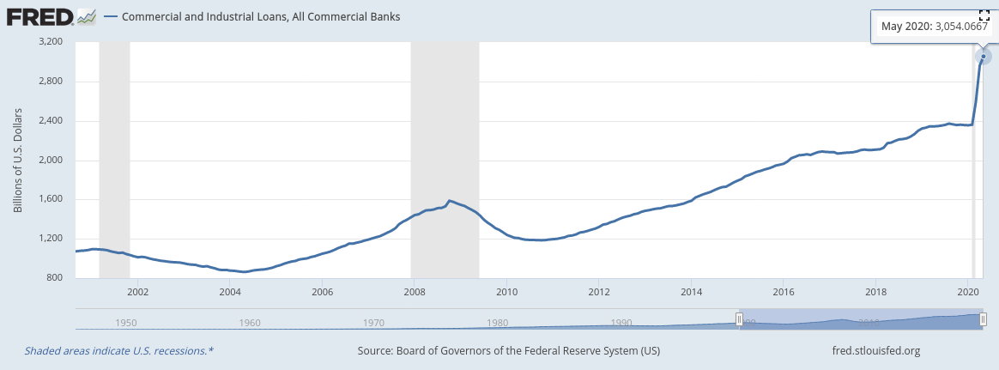

### 2020

  

---

Oprocentowanie rachunków bankowych w bankach na poziomie 0,05%, przy inflacji powyżej 2,50%.

  

### ~1990

Żarnowiec, widok z dźwigu na bardzo zaawansowaną budowę pierwszej polskiej elektrowni jądrowej. Na transport czekają już zakupione od ZSRR cztery reaktory, uniemożliwiają to jednak przykuci do torów anarchiści z ruchu Wolność i Pokój. Świeżo powołany rząd Tadeusza Mazowieckiego nie potrafi zdecydować o użyciu milicji przeciwko protestującym – uchwała w sprawie budowy elektrowni została podjęta na początku stanu wojennego, Polacy wciąż doskonale pamiętają katastrofę w Czarnobylu i sceptycznie odnoszą się do energii jądrowej. Rząd najpierw zawiesza budowę na rok, a potem decyduje o jej likwidacji. Niezabezpieczona inwestycja zostanie sukcesywnie zdemolowana i rozkradziona (tymczasem Słowacy ukończą po latach przerwaną w tym samym czasie budowę elektrowni Mochovce - zaspokoi ona 20% krajowego zapotrzebowania na energię elektryczną). Gdy ćwierć wieku później rząd Donalda Tuska wróci do planów budowy elektrowni jądrowej, eksperci wytypują ponownie Żarnowiec jako jedną z najlepszych lokalizacji.

  

### 1942

Miała miejsce jedna z najbardziej spektakularnych ucieczek z KL Auschwitz. Por. AK Stanisław Gustaw Jaster obozowy numer 6438, Kazimierz Piechowski obozowy numer 918, Eugeniusz Bendera obozowy numer 8502 - Ukrainiec i Józef Lampert ksiądz z Wadowic obozowy numer 3419, w godzinach popołudniowych dostali się w pobliże magazynów HWL (główny magazyn wyposażenia załogi SS). Podrabianym kluczem Bendera otworzył garaż. Reszta uciekinierów dostała się do podziemi HWL, przez obluzowany wcześniej właz do bunkra koksowego. Posługując się podrobionymi kluczami otworzyli kotłownie i kancelarię, drzwi do magazynu z mundurami i bronią wyłamali znalezionym w piwnicy łomem. Tam przebrali się w esesmańskie mundury, zabrali ze sobą karabiny, pistolety, amunicję, granaty i żywność. Z garażu wyjechali odkrytym autem marki Steyr, szefa HWL SS-Hauptsturmfuhrera Kreutzmanna. Uzbrojeni bez dokumentów, wyjechali autem poza punkt kontrolny - dużego łańcucha straży wokół terenu obozowego. Ucieczkę ułatwiło opanowanie Piechowskiego i jego bardzo dobra znajomość języka niemieckiego, który w niewybrednych słowach rozkazał wartownikowi podniesienie szlabanu. Poprzez Jastera rtm. Pilecki przekazał swój raport władzom Polskiego Państwa Podziemnego.

  

---

<a href="https://github.com/TomaszWaszczyk/historia.waszczyk.com/edit/master/src/content/june-21.md" target="_blank">Edytuj tę stronę dzieląc się własnymi notatkami!</a>
