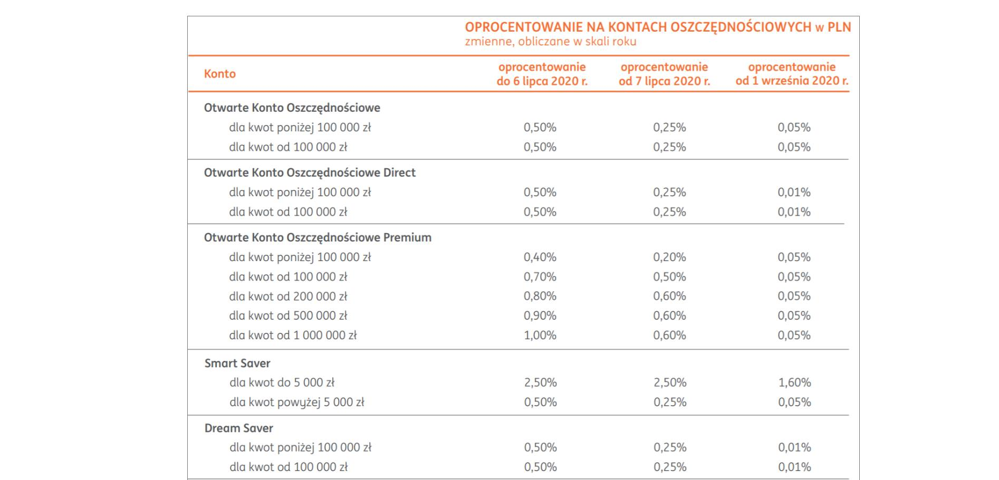

### 2021

Rodzina „2 plus 1” zarabiająca 13 tys. zł miesięcznie może zaciągnąć kredyt hipoteczny na kwotę przekraczającą 1,5 mln zł, wynika z analizy Bankier.pl.

> Mieszkaniowy amok. Do czego to prowadzi?

Ceny szybują, a klienci kupują wszystko. Eksperci boją się przegrzania rynku - pisze w poniedziałek "Rzeczpospolita".

Jak pisze gazeta, jest coraz drożej. Dodaje, że RynekPierwotny.pl podaje, że w ciągu roku ofertowe ceny nowych mieszkań wzrosły od 2 proc. w Poznaniu do aż 14 proc. w Łodzi. Deweloperzy nie nadążają z budową. "Bywa, że deweloperowi budującemu duże wieloetapowe osiedla zostało w ofercie kilka lokali" – mówi w "Rz" Marcin Krasoń z Obido.pl.

Zdaniem Tomasza Błeszyńskiego, doradcy na rynku nieruchomości, cytowanego przez "Rz" mieszkania drożeją nieracjonalnie. "Klienci kupują praktycznie wszystko, nawet mieszkania w kiepskich lokalizacjach i w złym stanie – mówi. – Rynek jest ciągle podsycany różnymi czynnikami – a to mizernymi odsetkami na lokatach, a to tanim kredytem, a to obawami, że deweloperzy jeszcze podniosą ceny albo inflacja wzrośnie i wszystko podrożeje" – tłumaczy.

### 2020

  

---

"Jesteśmy ostatnim pokoleniem, które miało lepiej. Teraz wszystkie następne będą miały gorzej” – mówi profesor Szymon Malinowski (na oko – 60 latek), w filmie dokumentalnym „Można panikować” (link w pierwszym komentarzu – bardzo polecam).
O czym mówi? Nie o tym, że młodzi będą w przyszłości mogli kupić mniej dóbr. Że będziemy biedniejsi i dlatego będzie nam gorzej niż starszym pokoleniom.
Profesor Malinowski mówi o ZMIANACH KLIMATU.
Przyznaję się, byłem kiedyś sceptykiem klimatycznym. Jakbyście zapytali mnie 10 lat temu, co myślę o zmianach klimatu, to rzuciłbym kilka popularnych frazesów:
➡️ że przecież klimat zawsze się zmieniał (przecież kiedyś w Polsce były winnice) i człowiek nie ma z tym nic wspólnego
➡️ że wybuchy wulkanów emitują więcej CO2 niż człowiek
➡️ że ta cała walka ze zmianami klimatu to ideologia zbudowana przez ludzi, którzy chcą na tym zarobić
I tak dalej. Dlaczego tak mówiłem? Bo byłem IGNORANTEM. Bo zamiast poszukać w rzetelnych źródłach, zobaczyć co na ten temat mówi nauka, wolałem słuchać najprostszych wytłumaczeń i teorii spiskowych.
Dziś trochę mi z tego powodu wstyd. Ale być może część z Was jest dziś w takim punkcie, w jakim ja byłem kiedyś. Dlatego robię przed wami coming out.
Moje poglądy zaczęły się zmieniać, gdy zacząłem pracować z ludźmi, którzy naukowo zajmują się zmianami klimatu. Oni stopniowo przekonywali mnie, z jak poważnym problemem mamy do czynienia.
Co więc o zmianach klimatu mówi nauka?
❗️ Klimat się ociepla – dziś średnia temperatura na ziemi jest o ponad 1 stopień wyższa niż 150 lat temu, gdy zaczęła się era przemysłowa. To jest bezdyskusyjne. Wiem, 1 stopień to nie wydaje się dużo, ale dla globalnego klimatu to kolosalna zmiana.
❗️ Historycznie patrząc, obecna zmiana klimatu jest bardzo szybka. Być może najszybsza w historii. Ziemia rzeczywiście ma wieloletnie fazy ociepleń i ochłodzeń, ale jeśli kierować się tymi cyklami, to powinniśmy być w tej chwili w fazie ochłodzenia, a nie ocieplenia. Idziemy więc w odwrotnym kierunku niż naturalny cykl ziemi.
❗️ Ocieplenie klimatu jest wywołane emisją dwutlenku węgla przez człowieka. 97 procent badań naukowych potwierdza ten wniosek (spośród tych, które odnoszą się do tej kwestii).
❗️ Jeśli nic nie zrobimy – to znaczy emisja CO2 na świecie się nie zatrzyma i nie zacznie spadać – to będziemy mieli coraz więcej fal upałów i skrajnych zjawisk pogodowych. Lodowce będą topniały, poziom wód się będzie podnosił. Za kilkadziesiąt lat na dużych obszarach ziemi nie będzie dało się żyć.
Pamiętacie jak kiedyś było głośno o dziurze ozonowej? Jeśli macie mniej niż 30 lat to możecie nawet nie pamiętać. Bo dzisiaj dziura ozonowa się zmniejsza. Dlaczego? Bo zaufaliśmy nauce i zrezygnowaliśmy ze stosowania niektórych substancji chemicznych (np. freonu). Teraz powinniśmy zrobić to samo – zaufać nauce.
„Coraz bardziej upalne lata, coraz mniej śniegu zimą, płoną lasy, coraz bardziej sucho, brakuje wody, znikają lodowce w górach, znika lód morski w Arktyce, rozmarza zmarzlina, metan uwalnia się do atmosfery, topnieją lądolody, podnosi się poziom morza, zakwasza się ocean, zanika bioróżnorodność, coraz silniejsze burze i cyklony tropikalne” – to wszystko nasz świat, mówi profesor Malinowski. 
Jeśli się nic z tym nie zrobimy, będzie tylko gorzej.

---

Oprocentowanie rachunków bankowych w bankach na poziomie 0,05%, przy inflacji powyżej 2,50%.

  

### ~1990

Żarnowiec, widok z dźwigu na bardzo zaawansowaną budowę pierwszej polskiej elektrowni jądrowej. Na transport czekają już zakupione od ZSRR cztery reaktory, uniemożliwiają to jednak przykuci do torów anarchiści z ruchu Wolność i Pokój. Świeżo powołany rząd Tadeusza Mazowieckiego nie potrafi zdecydować o użyciu milicji przeciwko protestującym – uchwała w sprawie budowy elektrowni została podjęta na początku stanu wojennego, Polacy wciąż doskonale pamiętają katastrofę w Czarnobylu i sceptycznie odnoszą się do energii jądrowej. Rząd najpierw zawiesza budowę na rok, a potem decyduje o jej likwidacji. Niezabezpieczona inwestycja zostanie sukcesywnie zdemolowana i rozkradziona (tymczasem Słowacy ukończą po latach przerwaną w tym samym czasie budowę elektrowni Mochovce - zaspokoi ona 20% krajowego zapotrzebowania na energię elektryczną). Gdy ćwierć wieku później rząd Donalda Tuska wróci do planów budowy elektrowni jądrowej, eksperci wytypują ponownie Żarnowiec jako jedną z najlepszych lokalizacji.

  

### 1949

W Warszawie odbyła się Konferencja Architektów Partyjnych, na której zdecydowano o wprowadzeniu socrealizmu do polskiej architektury oraz o wykorzystaniu go jako narzędzie propagandowe władz komunistycznych.
W spotkaniu tym uczestniczył sam Bolesław Bierut, który w rozmowie ze znanym przedwojennym architektem Edmundem Goldtzmanem stwierdził, że "Architektura jest szczególnie doniosłą formą ideologii, a ideologia nie może być partii obojętna. Ideologia to postulowanie pożądanych na przyszłość wartości, rysowanie obrazu przyszłości. A architektura z samej swej istoty kształtuje zabudowę przeznaczoną na długie trwanie. Ideologia znajduje w architekturze wspaniałą formę swego ucieleśnienia. Jakże lepiej możemy przedstawić nasze cele jak nie za pomocą panoram i modeli nowych miast. A obraz przyszłości jest orężem"
Przykładami zastosowania tej tezy w rzeczywistości są Pałac Kultury i Nauki w Warszawie oraz Nowa Huta (zdjęcie).

  

### 1945

O godzinie 4.30, zapadł w Moskwie wyrok w procesie pokazowym 16 Polaków, przywódców Polskiego Państwa Podziemnego.

Pokazowy proces toczył się przez cztery dni przed Kolegium Wojskowym Sądu Najwyższego w Moskwie.
Akt oskarżenia objął: Delegata Rządu na Kraj Jana Stanisława Jankowskiego, Komendanta Sił Zbrojnych na Kraj generała Leopolda Okulickiego, ministrów Krajowej Rady Ministrów: Adama Bienia, Antoniego Pajdaka i Stanisława Jasiukowicza, przewodniczącego Rady Jedności Narodowej Kazimierza Pużaka, a także przywódców stronnictw politycznych: Stronnictwa Ludowego - Kazimierza Bagińskiego i Stanisława Mierzwę, Stronnictwa Narodowego - Zbigniewa Stypułkowskiego i Kazimierza Kobylańskiego, Stronnictwa Pracy - Józefa Chacińskiego i Franciszka Urbańskiego, Stronnictwa Demokratycznego - Eugeniusza Czarnowskiego i Stanisława Michałowskiego oraz tłumacza Józefa Stempler Dąbskiego i Aleksandra Zwierzyńskiego.
13 oskarżonych skazano na kary więzienia, trwające od 10 lat do 4 miesięcy, trzech uniewinniono. Brytyjski ambasador w Moskwie, pozytywnie ocenił proces, ponieważ nikogo nie skazano na śmierć. Generał Leopold Okulicki, Jan Stanisław Jankowski oraz Stanisław Jasiukowicz umarli w radzieckich więzieniach. Ci, którzy przeżyli, wrócili do Polski Ludowej, lecz wielu z nich zostało ponownie uwięzionych i terroryzowanych przez polskich komunistów.

  

### 1943

Odszyfrowana tajna depesza z 21 czerwca 1943 roku. Na dole odręczne wyjaśnienie Nowaka-Jeziorańskiego:
„spalone miody: skrzynka lub melina
wykryta przez gestapo”. Sara –
placówka łączności w Kairze, Szejk –
kryptonim nie odszyfrowany, malaria -
wsypa, groteska nie zezuje – znaczenie
nieznane, kmieć - kurier (w tym
przypadku Zdzisław Jeziorański – Jan
Nowak), Kalina - gen. Stefan Grot-
Rowecki, Danusia - Gdynia , Janka –
placówka łączności we Francji, pobory
uratowane – znaczenie nieznane.

  

### 1942

Miała miejsce jedna z najbardziej spektakularnych ucieczek z KL Auschwitz. Por. AK Stanisław Gustaw Jaster obozowy numer 6438, Kazimierz Piechowski obozowy numer 918, Eugeniusz Bendera obozowy numer 8502 - Ukrainiec i Józef Lampert ksiądz z Wadowic obozowy numer 3419, w godzinach popołudniowych dostali się w pobliże magazynów HWL (główny magazyn wyposażenia załogi SS). Podrabianym kluczem Bendera otworzył garaż. Reszta uciekinierów dostała się do podziemi HWL, przez obluzowany wcześniej właz do bunkra koksowego. Posługując się podrobionymi kluczami otworzyli kotłownie i kancelarię, drzwi do magazynu z mundurami i bronią wyłamali znalezionym w piwnicy łomem. Tam przebrali się w esesmańskie mundury, zabrali ze sobą karabiny, pistolety, amunicję, granaty i żywność. Z garażu wyjechali odkrytym autem marki Steyr, szefa HWL SS-Hauptsturmfuhrera Kreutzmanna. Uzbrojeni bez dokumentów, wyjechali autem poza punkt kontrolny - dużego łańcucha straży wokół terenu obozowego. Ucieczkę ułatwiło opanowanie Piechowskiego i jego bardzo dobra znajomość języka niemieckiego, który w niewybrednych słowach rozkazał wartownikowi podniesienie szlabanu. Poprzez Jastera rtm. Pilecki przekazał swój raport władzom Polskiego Państwa Podziemnego.

  

### 1912

W Warszawie urodził się Kazimierz Leski ps. ,,Bradl'' - inżynier, konstruktor (współkonstruktor łodzi podwodnych ORP "Orzeł" i ORP "Sęp"), pułkownik pilot, oficer wywiadu i kontrwywiadu Armii Krajowej, powstaniec warszawski; od 1942 organizator przerzutu kurierów z okupowanej Polski na Zachód; odbywał kilkunastokrotne ryzykowne wyprawy do Francji w mundurze generała Wehrmachtu jako Julius von Hallmannn (wykradł plany Wału Atlantyckiego); od października 1944 pełnił funkcję szefa sztabu Obszaru Zachód AK, a następnie Delegatury Sił Zbrojnych na Kraj: w latach 1945/55 więziony i torturowany przez władze PRL; autor wspomnienia ,,Życie niewłaściwie urozmaicone''; 22 marca 1996 roku uhonorowany medalem "Sprawiedliwy wśród narodów świata",przez Instytut Yad Vashem za pomaganie Żydom w czasie II wojny światowej; zmarł 28 maja 2000 roku w Warszawie.

Niektóre odznaczenia: Order Wojenny Srebrnego Krzyża Virtuti Militari, Krzyż Walecznych (trzykrotnie), Złoty Krzyż Zasługi, Srebrny Krzyż Zasługi z Mieczami

  

### 1768

Miała miejsce tzw. rzeź humańska czyli zbrojne powstanie kozacko-chłopskie na Ukrainie o charakterze antypolskim, antyżydowskim i antykatolickim.
Rzeź pod przywództwem Maksyma Żeleźniaka i Iwana Gonty zaczęła się od mszy z udziałem Kozaków w Klasztorze Motroninskim, w dzisiejszej wsi Mielniki , w rejonie czehryńskim.
Jeden z mnichów poświęcił noże, które
zbrodniarze rozdzielili między siebie, aby"rżnąć wrogów Ukrainy”. Iwan Gonta był wcześniej setnikiem kozackim w służbie Franciszka Salezego Potockiego, który został wysłany, by bronić Humania przed nadciągającym chłopstwem, jednak zdradził i przyłączył się do morderców.
Po kilkunastogodzinnym szturmie miasto padło. Ludność schroniła się w kościołach, synagodze i ratuszu. Księża katoliccy rozdawali komunię. Rozpoczęła się rzeź. W samej tylko synagodze zamordowano około trzech tysięcy Żydów, obcinano im ręce i uszy. Kolejnymi ofiarami byli księża katoliccy, zakonnicy uniccy i zwykli mieszkańcy. Żeleźniak kazał powiesić na kościelnej wieży "Lacha, Żyda i psa – bo ich wiara jednakowa”.
Gonta ogłosił się „księciem humańskim”.
Tylko tego dnia zamordowano 20 tysięcy Polaków i Żydów. Bunt ten został stłumiony dopiero po kilku miesiacach. Szacunkowa liczba wszystkich jego ofiar wynosi około 200 tysięcy.

  

---

<a href="https://github.com/TomaszWaszczyk/historia.waszczyk.com/edit/master/src/content/june-21.md" target="_blank">Edytuj tę stronę dzieląc się własnymi notatkami!</a>
