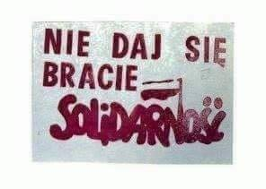
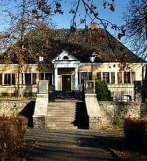

### 2020

Liczba osób ubiegających się po raz pierwszy o zasiłek dla bezrobotnych w ubiegłym tygodniu w USA wzrosła o 1,508 mln do 45,67 mln - poinformował Departament Pracy USA. Ekonomiści z Wall Street spodziewali się, że liczba nowych bezrobotnych wyniesie 1,29 mln, czyli wyniki nie są pozytywne.

Jednak sytuacja na rynku pracy nie musi być tak zła, jak sugerują dane - komentuje dane Konrad Białas, główny ekonomista TMS Brokers.

Jego zdaniem badania CBO wskazują, że wiele osób dobrowolnie pozostaje na bezrobociu, gdyż zasiłek razem z rządową kryzysową dopłatą oferuje im wyższe przychody niż regularne wynagrodzenie.

### 2004

W Warszawie zmarła Anna Zawadzka - harcmistrzyni, uczestniczka powstania warszawskiego, siostra Tadeusza Zawadzkiego "Zośki", anglistka, autorka opracowań historycznych o harcerstwie, w latach 80. aktywnie pracowała nad zmianami w ZHP, przyczyniła się do przywrócenia tradycyjnego Prawa i Przyrzeczenia Harcerskiego.

Foto: Grób Anny Zawadzkiej na Starych Powązkach.

  

### 1982

Funkcjonariusze katowickiej Służby Bezpieczeństwa zlikwidowali w Chorzowie 5 -osobową grupę uczniów Policealnego Studium Zawodowego Górnictwa Węglowego, która zajmowała się kolportażem solidarnościowych ulotek.
Na zdjęciu jedna z ulotek z okresu stanu wojennego.

  

### 1944

Armia Czerwona rozpoczęła operację "Bagration", która doprowadziła do całkowitej klęski niemieckiej Grupy Armii „Środek” oraz osiągnięcia przez sowietów linii Wisły.
Stalin świadomie wybrał tę datę.

  

### 1943

Zdjęcie przedstawia znaczek pocztowy wydany przez pocztę amerykańską 22 czerwca 1943 roku w serii "Flagi narodów sojuszniczych". Warto dodać, bo to ciekawe, że flaga polska była pierwszą umieszczoną na znaczkach tej serii.

  

### 1941

Według propagandy rosyjskiej to pierwszy dzień wojny.

III Rzesza zaatakowała ZSRR wydawało się, że będzie to bardzo szybka kampania, która zakończy się spektakularnym zwycięstwem Niemców. Oprócz zaskoczenia, jakie wywarły na najeźdźcy nowe sowieckie czołgi T-34/76 oraz KW-1 i KW-2, wszystko wydawało się iść zgodnie z planem. Mimo że faktycznie niemieckie czołgi i artyleria miały problemy z niszczeniem tych maszyn, to często dochodziło do bardzo spektakularnych pogromów, których dobrym przykładem jest rozegrana od 23 do 25 czerwca 1941 r. bitwa pancerna pod Rosieniami. To tam miało dojść do niesamowitego wydarzenia, w którym jeden sowiecki KW-2 przez dwa dni ponoć zatrzymał całą niemiecką dywizję pancerną, co jak się okazuje - ma niewiele wspólnego z prawdą.

  

---

List generała broni Kazimierza Sosnkowskiego (zdjęcie) do Naczelnego Wodza generała Władysława Sikorskiego z 22 czerwca 1941 roku.

"Nie wiedząc, czy stan zdrowia mi pozwoli przyjechać w dniach najbliższych do Londynu, pozwalam sobie przesłać Panu Generałowi w kilku zwięzłych zdaniach swój pogląd na sytuację, wytworzoną przez wybuch wojny niemiecko-sowieckiej.

1) Wojna niem.-sow. jest zdarzeniem wysoce korzystnem dla Polski i jej sprawy, pod warunkiem jednak, że Rosja zostanie szybko i całkowicie pobita przez armje niemieckie. Szybkie i całkowite zwycięstwo niemieckie poza czysto wojskowemi skutkami dla frontu zachodniego, może mieć skutki polityczne w postaci odtworzenia proniemieckiej Litwy z oddaniem jej północnych ziem Polski, stworzeniem niepodległej Ukrainy z oddaniem jej Lwowa, Małopolski Wschodniej i Wołynia oraz terytoriów wcielonych do Rzeszy.
2) Przyjmując hipotezę, która może być najbardziej prawdopodobna, że Rosja Sowiecka, grając liczbą, obfitym stosunkowo sprzętem, wreszcie przestrzenią, nie da się szybko rozbić i że wojna niem.-sow. przeciągnie się i utrwali w czasie, liczyć się należy z potrzebą zasadniczych decyzyj przez
nas tem bardziej, że w tym kierunku niechybnie wywierać będzie nacisk rząd brytyjski.
3) Mojem zdaniem, czynne współdziałanie z Sowietami w wojnie przeciw Niemcom jest możliwe, a nawet może być wskazane, jednak z zastrzeżeniem dopełnienia następujących warunków: a) rząd sowiecki winien w drodze formalnej umowy zobowiązać się do przywrócenia i uznania granic Polski
z r. 1939, przyczem celem utrwalenia ich po wsze czasy, układ polityczny powinien przewidzieć wymianę ludności między Polską a Rosją celem stworzenia możliwie największej jednolitości etnograficznej, b) układ powyższy powinien być zagwarantowany przez W. Brytanię i Stany Zjednoczone A. P. (po przystąpieniu ich do wojny, na co prawdopodobnie długo czekać nie będziemy), c) rząd sow. zawrze niezwłoczny układ,
regulujący w sposób całkowity sytuację ludności polskiej, deportowanej z ziem okupowanych w głąb Rosji.
4) Współdziałanie Polski z Sowietami w wojnie przeciw Niemcom powinno się wyrazić przede wszystkiem w stworzeniu z jeńców polskich
oraz z ludności powołanej pod broń – oddziałów wojskowych, jako samodzielnej armii polskiej, sprzymierzonej i suwerennej, podległej Rządowi Polskiemu i Naczelnemu Wodzowi.
5) Współdziałanie wojenne z Rosją sow. może mieć kierunek ze wschodu na zachód nigdy zaś odwrotnie, przynajmniej, jeśli chodzi o terytorium kraju. Działanie na tyłach armij niemieckich z terytorium kraju należy
bezwzględnie wykluczyć, gdyż przy niewielkich korzyściach mogłoby dać ono w wyniku całkowite zniszczenie żywych sił kraju i narodu tak potrzebnych w końcowej fazie dziejowej rozprawy z Niemcami.
/–/ Sosnkowski gen. broni.

  

---

W pierwszym dniu niemieckiej agresji na Związek Radziecki lotnictwo hitlerowskie zbombardowało Nowogródek. Jednym z trafionych bombą obiektów był zabytkowy dworek Mickiewiczów, w którym znajdowało się Muzeum Adama Mickiewicza. W wyniku powstałego pożaru spłonęło wiele unikalnych pamiątek oraz rękopisów i dokumentów dotyczących tego wielkiego poety.
Po 14 latach od tego wydarzenia władze radzieckie zdecydowały o odbudowie zabytku i ponownym uruchomieniu w nim muzeum.
Kolejną jego rekonstrukcją zajęła się w 1989 roku już polska firma Budimex.
Obecnie w Muzeum Adama Mickiewicza znajdują się 152 uratowane lub odrestaurowane po pożarze eksponaty, które co rok podziwia około 20 tysięcy turystów.

  

### 1921

Rada Ligi Narodów przyznała polskim okrętom wojennym prawo pobytu w porcie gdańskim oraz zezwoliła Polsce na założenie na Westerplatte wojskowej składnicy tranzytowej.

Do gdańskiego portu przybijały wtedy okręty z materiałami wojennymi dla polskiej armii. Dostawy miały zostać objęte całkowitą tajemnicą, ujawnienie wartości ich składów mogło bowiem skompromitować stronę polską na arenie międzynarodowej. Dokonać tego mogły osoby, „które zaczęły wścibiać swój nos tam, gdzie nie potrzeba, a przy powszechnym plotkarstwie polskim mogły poważnie zaszkodzić utajnionym dostawom alianckim”. Ponadto ogłoszenie przez Niemców stanowiska o neutralności ich kraju w wojnie polsko-bolszewickiej wykluczało jakąkolwiek inną niż morska drogę transportu pomocy militarnej z Francji. Przy okazji dawało to przyzwolenie pracownikom portu, Niemcom z pochodzenia, na odmawianie pracy przy rozładunku jednostek z dostawami. To z kolei groziło przestojem w dopływie uzbrojenia dla polskiej armii. Długo nie udało się utrzymać tajemnicy, czego skutkiem był sprzeciw dokerów, którzy zorganizowali strajki w porcie. Jeden z nich przypadł na okres od 15 lipca do 24 sierpnia 1920 roku, kiedy to nierozładowany okręt odpłynął z Gdańska. W innych przypadkach, kiedy dokerzy odmówili pracy, rozładunkiem zajmowali się żołnierze alianccy stacjonujący w Gdańsku i strzegący tam porządku. Dopiero we wrześniu 1920 roku, a więc po udanej obronie Warszawy i polskiej kontrofensywie, praca rozładunkowa w porcie gdańskim wróciła do normy.

Niekorzystną sytuację „portową” dla Polski wykorzystał jej rząd, który uzyskał od Reginalda Towera14(Wysokiego Komisarza Ligi Narodów) i generała Richarda Hackinga (dowódcy wojsk sprzymierzonych przebywających w Gdańsku) zgodę na skierowanie do miasta własnego oddziału w celu ochrony transportów broni przeznaczonych dla polskiej armii.

Sześćdziesięcioosobowy oddział przybyły we wrześniu 1920 roku zajął poniemieckie koszary w Nowym Porcie. Sprzeciwił się temu Senat, który złożył protest na ręce Wysokiego Komisarza Ligi Narodów, ale ten po rozpatrzeniu sporu zadecydował o pozostawaniu polskiego oddziału w Gdańsku, z zastrzeżeniem, iż żołnierze mieli pełnić wartę bez broni. Na to, w sposób naturalny, nie zgodziła się strona polska, argumentując, że z opuszczeniem miasta przez okupacyjne wojska brytyjskie i francuskie istniała potrzeba realnej ochrony polskich składów. W wyniku braku kompromisu sprawę skierowano do Rady Ligi Narodów, która powołała specjalną komisję. W międzyczasie Szymon Askenazy – polski przedstawiciel przy Lidze Narodów – zaproponował, aby wydzielono Polsce na terenie Gdańska specjalne miejsce służące do rozładunku towarów wojskowych. Przychylne Warszawie postanowienia komisji ogłoszono 22 czerwca 1921 roku. Stanowiły one, że Rzeczypospolitej należy się wydzielony teren na obszarze Gdańska, w którym składować można byłoby materiały wojenne, a ochroną trudnić się miał niewielki oddział wartowniczy. Nie sprecyzowano jednak, gdzie to miejsce powinno się znajdować, ani nie ustalono liczby polskich żołnierzy mogących przebywać w Gdańsku. Wobec braku konkretów transporty nadal rozładowywano i przechowywano w porcie.

  

### 1899

https://pl.wikipedia.org/wiki/Micha%C5%82_Kalecki

Urodziny Michała Kaleckiego, prawdziwego geniusza i najwybitniejszego polskiego ekonomisty. Osobiście uważam, że jego dzieło Kapitalizm 1 i 2 to najlepsze książki opisujące gospodarkę i funkcjonowanie rynku, które dziś są aktualne jak nigdy dotąd.

### 1864

https://pl.wikipedia.org/wiki/Hermann_Minkowski

---

<a href="https://github.com/TomaszWaszczyk/historia.waszczyk.com/edit/master/src/content/june-22.md" target="_blank">Edytuj tę stronę dzieląc się własnymi notatkami!</a>
