### 2023

Nassim Nicholas Taleb, @nntaleb, says that Bitcoin is bad and central banking is good because:
• The Federal Reserve is transparent
• The USD system can be influenced
• “We know what’s going on.”

  

---

  

W szczycie pandemii rządy i eksperci na całym świecie nakłaniały, czy wręcz zmuszały obywateli do szczepień przeciwko COVID-19, argumentując, że to jedyna interwencja, która może zmniejszyć śmiertelności. Jednak do tej pory żadne poważne randomizowane i kontrolowane badanie nie wykazało zmniejszenia liczby zgonów dzięki szczepionkom przeciwko COVID-19. Wręcz przeciwnie, system raportowania danych na całym świecie zgłaszają zwiększoną śmiertelność, która jest zbieżna z terminem wprowadzeniem szczepionek.

### 2022

Bitcoin powstał jako instrument płatniczy, który jest niezależny od systemu bankowego i między innymi jest antyinflacyjny. Dzisiaj rzeczywistość pokazała, że tak nie jest  - komentował #Bitcoincrash w programie "Tak jest" TVN Grupa Discovery dr Maciej Kawecki 🎯 prorektor Wyższa Szkoła Bankowa w Warszawie #EksperciWSB

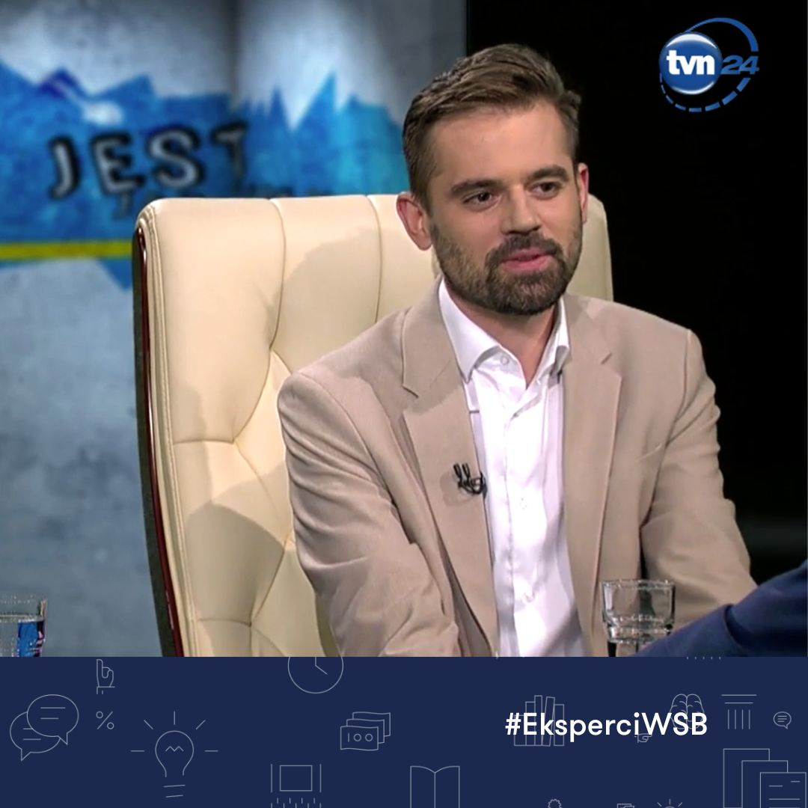  

---

Putin just gave a speech with massive implications for Bitcoin and global macro.

Regarding freezing of FX reserves and assets:

"The very principles of the global economic system have taken a blow."

"Fundamental business notions as business reputation, the inviolability of property and trust in global currencies have been seriously damaged."

"When I spoke at the Davos Forum a year and a half ago, I also stressed that the era of a unipolar world order has come to an end.

I want to start with this, as there is no way around it.

This era has ended despite all the attempts to maintain and preserve it at all costs."

On the use of sanctions:

"Sanctions as a weapon have proved in recent years to be a double-edged sword damaging their advocates and architects just as much, if not more."

"We see social and economic problems worsening in Europe, and in the US as well, food, electricity and fuel prices rising, with quality of life in Europe falling and companies losing their market edge."

"The European Union has lost its political sovereignty, and its bureaucratic elites are dancing to someone else’s tune, doing everything they are told from on high and hurting their own people, economies, and businesses."

"Surging inflation in product and commodity markets had become a fact of life long before this year.

The world has been driven into this by years of irresponsible macroeconomic policies pursued by G7 countries, including uncontrolled emission and accumulation of unsecured debt."

"Because they could not or would not devise any other recipes, the governments of the leading Western economies simply accelerated their money-printing machines.

Such a simple way to make up for unprecedented budget deficits."

"I have already cited this figure: over the past two years, the money supply in the United States has grown by more than 38 percent."

"The EU’s money supply has also increased dramatically over this period. It grew by about 20 percent, or 2.5 trillion euros."

"We all hear about the so-called ‘Putin inflation’ in the West.

When I see this, I wonder who they expect would buy this nonsense – people who cannot read or write, maybe.

Anyone literate enough to read would understand what is actually happening."

"So, they printed more money, and then what? Where did all that money go?

It was obviously used to pay for goods and services outside Western countries – this is where the newly-printed money flowed.

They literally began to clean out, to wipe out global markets."

"While at the end of 2019, imports of goods to the United States amounted to about 250 billion dollars a month, by now, it has grown to 350 billion.

It is noteworthy that the growth was 40 percent – exactly in proportion to the unsecured money supply printed in recent years."

"America’s role has changed drastically.

It has turned from a net exporter of food into a net importer.

Loosely speaking, it is printing money and pulling commodity flows its way, buying food products all over the world."

"The European Union is building up imports even faster.

Obviously, such a sharp increase in demand that is not covered by the supply of goods has triggered a wave of shortages and global inflation."

HERE IT IS:

"Under the cloud of inflation, many developing nations are asking a good question:

🔥Why exchange goods for dollars and euros that are losing value right before our eyes?🔥"

"Global currency reserves are at $7.1 trillion and 2.5 trillion euros now.

These reserves are devalued at an annual rate of about 8 percent.

Moreover, they can be confiscated or stolen any time if the United States dislikes something in the policy of the states involved."

"I think this has become a very real threat for many countries that keep their gold and foreign exchange reserves in these currencies."

"A conversion of global reserves will begin ... They will be converted from weakening currencies into real resources like food, energy commodities and other raw materials.

Obviously, this process will further fuel global dollar inflation."

It was a long speech.

But the main takeaway is that Putin expects the world to move away from sovereign debt as a primary store of value.

There are $13T in global FX reserves. That wealth needs to be moved into something that can't be debased or seized.

<!-- President of Russia Vladimir Putin: 

“I welcome all participants and guests of the 25th St Petersburg International Economic Forum.

It is taking place at a difficult time for the international community when the economy, markets and the very principles of the global economic system have taken a blow. Many trade, industrial and logistics chains, which were dislocated by the pandemic, have been subjected to new tests. Moreover, such fundamental business notions as business reputation, the inviolability of property and trust in global currencies have been seriously damaged. Regrettably, they have been undermined by our Western partners, who have done this deliberately, for the sake of their ambitions and in order to preserve obsolete geopolitical illusions.

Today, our – when I say “our,” I mean the Russian leadership – our own view of the global economic situation. I would like to speak in greater depth about the actions Russia is taking in these conditions and how it plans to develop in these dynamically changing circumstances.

When I spoke at the Davos Forum a year and a half ago, I also stressed that the era of a unipolar world order has come to an end. I want to start with this, as there is no way around it. This era has ended despite all the attempts to maintain and preserve it at all costs. Change is a natural process of history, as it is difficult to reconcile the diversity of civilisations and the richness of cultures on the planet with political, economic or other stereotypes – these do not work here, they are imposed by one centre in a rough and no-compromise manner.

The flaw is in the concept itself, as the concept says there is one, albeit strong, power with a limited circle of close allies, or, as they say, countries with granted access, and all business practices and international relations, when it is convenient, are interpreted solely in the interests of this power. They essentially work in one direction in a zero-sum game. A world built on a doctrine of this kind is definitely unstable.

After declaring victory in the Cold War, the United States proclaimed itself to be God’s messenger on Earth, without any obligations and only interests which were declared sacred. They seem to ignore the fact that in the past decades, new powerful and increasingly assertive centres have been formed. Each of them develops its own political system and public institutions according to its own model of economic growth and, naturally, has the right to protect them and to secure national sovereignty.

These are objective processes and genuinely revolutionary tectonic shifts in geopolitics, the global economy and technology, in the entire system of international relations, where the role of dynamic and potentially strong countries and regions is substantially growing. It is no longer possible to ignore their interests.

To reiterate, these changes are fundamental, groundbreaking and rigorous. It would be a mistake to assume that at a time of turbulent change, one can simply sit it out or wait it out until everything gets back on track and becomes what it was before. It will not.

However, the ruling elite of some Western states seem to be harbouring this kind of illusions. They refuse to notice obvious things, stubbornly clinging to the shadows of the past. For example, they seem to believe that the dominance of the West in global politics and the economy is an unchanging, eternal value. Nothing lasts forever.

Our colleagues are not just denying reality. More than that; they are trying to reverse the course of history. They seem to think in terms of the past century. They are still influenced by their own misconceptions about countries outside the so-called “golden billion”: they consider everything a backwater, or their backyard. They still treat them like colonies, and the people living there, like second-class people, because they consider themselves exceptional. If they are exceptional, that means everyone else is second rate.

Thereby, the irrepressible urge to punish, to economically crush anyone who does not fit with the mainstream, does not want to blindly obey. Moreover, they crudely and shamelessly impose their ethics, their views on culture and ideas about history, sometimes questioning the sovereignty and integrity of states, and threatening their very existence. Suffice it to recall what happened in Yugoslavia, Syria, Libya and Iraq.

If some “rebel” state cannot be suppressed or pacified, they try to isolate that state, or “cancel” it, to use their modern term. Everything goes, even sports, the Olympics, bans on culture and art masterpieces just because their creators come from the “wrong” country.

This is the nature of the current round of Russophobia in the West, and the insane sanctions against Russia. They are crazy and, I would say, thoughtless. They are unprecedented in the number of them or the pace the West churns them out at.

The idea was clear as day – they expected to suddenly and violently crush the Russian economy, to hit Russia’s industry, finance, and people’s living standards by destroying business chains, forcibly recalling Western companies from the Russian market, and freezing Russian assets.

This did not work. Obviously, it did not work out; it did not happen. Russian entrepreneurs and authorities have acted in a collected and professional manner, and Russians have shown solidarity and responsibility.

Step by step, we will normalise the economic situation. We have stabilised the financial markets, the banking system and the trade network. Now we are busy saturating the economy with liquidity and working capital to maintain the stable operation of enterprises and companies, employment and jobs.

The dire forecasts for the prospects of the Russian economy, which were made in early spring, have not materialised. It is clear why this propaganda campaign was fuelled and all the predictions of the dollar at 200 rubles and the collapse of our economy were made. This was and remains an instrument in an information struggle and a factor of psychological influence on Russian society and domestic business circles.

Incidentally, some of our analysts gave in to this external pressure and based their forecasts on the inevitable collapse of the Russian economy and a critical weakening of the national currency – the ruble.

Real life has belied these predictions. However, I would like to emphasise that to continue being successful, we must be explicitly honest and realistic in assessing the situation, be independent in reaching conclusions, and of course, have a can-do spirit, which is very important. We are strong people and can deal with any challenge. Like our predecessors, we can resolve any task. The entire thousand-year history of our country bears this out.

Within just three months of the massive package of sanctions, we have suppressed inflation rate spikes. As you know, after peaking at 17.8 percent, inflation now stands at 16.7 percent and continues dropping. This economic dynamic is being stabilised, and state finances are now sustainable. I will compare this to other regions further on. Yes, even this figure is too much for us – 16.7 percent is high inflation. We must and will work on this and, I am sure, we will achieve a positive result.

After the first five months of this year, the federal budget has a surplus of 1.5 trillion rubles and the consolidated budget – a surplus of 3.3 trillion rubles. In May alone, the federal budget surplus reached almost half a trillion rubles, surpassing the figure for May 2021 more than four times over.

Today, our job us to create conditions for building up production and increasing supply in the domestic market, as well as restoring demand and bank financing in the economy commensurately with the growth in supply.

I mentioned that we have taken measures to reestablish the floating assets of companies. In most sectors, businesses have received the right to suspend insurance premiums for the second quarter of the year. Industrial companies have even more opportunities – they will be able to delay them through the third quarter as well. In effect, this is like getting an interest-free loan from the state.

In the future, companies will not have to pay delayed insurance premiums in a single payment. They will be able to pay them in equal installments over 12 months, starting in June next year.

Next. As of May the subsidised mortgage rate has been reduced. It is now 9 percent, while the programme has been extended till the end of the year. As I have mentioned, the programme is aimed at helping Russians improve their housing situation, while supporting the home building industry and related industries that employ millions of people.

Following a spike this spring, interest rates have been gradually coming down, as the Central Bank lowers the key rate. I believe that that this allows the subsidised mortgage rate to be further cut to 7 percent.

What is important here? The programme will last until the end of the year without change. It means that our fellow Russians seeking to improve their living conditions should take advantage of the subsidy before the end of the year.

The lending cap will not change either, at 12 million roubles for Moscow and St Petersburg and 6 million for the rest of Russia.

I should add that we must make long-term loans for businesses more accessible. The focus must shift from budget subsidies for businesses to bank lending as a means to spur business activity.

We need to support this. We will allocate 120 billion rubles from the National Wealth Fund to build up the capacity of the VEB Project Financing Factory. This will provide for additional lending to much-needed initiatives and projects worth around half a trillion roubles.

Colleagues,

Once again, the economic blitzkrieg against Russia was doomed to fail from the beginning. Sanctions as a weapon have proved in recent years to be a double-edged sword damaging their advocates and architects just as much, if not more.

I am not talking about the repercussions we see clearly today. We know that European leaders informally, so to say, furtively, discuss the very concerning possibility of sanctions being levelled not at Russia, but at any undesirable nation, and ultimately anyone including the EU and European companies.

So far this is not the case, but European politicians have already dealt their economies a serious blow all by themselves. We see social and economic problems worsening in Europe, and in the US as well, food, electricity and fuel prices rising, with quality of life in Europe falling and companies losing their market edge.

According to experts, the EU’s direct, calculable losses from the sanctions fever could exceed $400 billion this year. This is the price of the decisions that are far removed from reality and contradict common sense.

These outlays fall directly on the shoulders of people and companies in the EU. The inflation rate in some Eurozone countries has exceeded 20 percent. I mentioned inflation in Russia, but the Eurozone countries are not conducting special military operations, yet the inflation rate in some of them has reached 20 percent. Inflation in the United States is also unacceptable, the highest in the past 40 years.

Of course, inflation in Russia is also in the double digits so far. However, we have adjusted social benefits and pensions to inflation, and increased the minimum and subsistence wages, thereby protecting the most vulnerable groups of the population. At the same time, high interest rates have helped people keep their savings in the Russian banking system.

Businesspeople know, of course, that a high key rate clearly slows economic development. But it is a boon for the people in most cases. They have reinvested a substantial amount of money in banks due to higher interest rates.

This is our main difference from the EU countries, where rising inflation is directly reducing the real incomes of the people and eating up their savings, and the current manifestations of the crisis are affecting, above all, low-income groups.

The growing outlays of European companies and the loss of the Russian market will have lasting negative effects. The obvious result of this will be the loss of global competitiveness and a system-wide decline in the European economies’ pace of growth for years to come.

Taken together, this will aggravate the deep-seated problems of European societies. Yes, we have many problems as well, yet I have to speak about Europe now because they are pointing the finger at us although they have enough of their own problems. I mentioned this at Davos. A direct result of the European politicians’ actions and events this year will be the further growth of inequality in these countries, which will, in turn, split their societies still more, and the point at issue is not only the well-being but also the value orientation of various groups in these societies.

Indeed, these differences are being suppressed and swept under the rug. Frankly, the democratic procedures and elections in Europe and the forces that come to power look like a front, because almost identical political parties come and go, while deep down things remain the same. The real interests of people and national businesses are being pushed further and further to the periphery.

Such a disconnect from reality and the demands of society will inevitably lead to a surge in populism and extremist and radical movements, major socioeconomic changes, degradation and a change of elites in the short term. As you can see, traditional parties lose all the time. New entities are coming to the surface, but they have little chance for survival if they are not much different from the existing ones.

The attempts to keep up appearances and the talk about allegedly acceptable costs in the name of pseudo-unity cannot hide the main thing: the European Union has lost its political sovereignty, and its bureaucratic elites are dancing to someone else’s tune, doing everything they are told from on high and hurting their own people, economies, and businesses.

There are other critically important matters here. The worsening of the global economic situation is not a recent development. I will now go over things that I believe are extremely important. What is happening now does not stem from what happened during recent months, of course not. Moreover, it is not the result of the special military operation carried out by Russia in Donbass. Saying so is an unconcealed, deliberate distortion of the facts.

Surging inflation in product and commodity markets had become a fact of life long before the events of this year. The world has been driven into this situation, little by little, by many years of irresponsible macroeconomic policies pursued by the G7 countries, including uncontrolled emission and accumulation of unsecured debt. These processes intensified with the onset of the coronavirus pandemic in 2020, when supply and demand for goods and services drastically fell on a global scale.

This begs the question: what does our military operation in Donbass have to do with this? Nothing whatsoever.

Because they could not or would not devise any other recipes, the governments of the leading Western economies simply accelerated their money-printing machines. Such a simple way to make up for unprecedented budget deficits.

I have already cited this figure: over the past two years, the money supply in the United States has grown by more than 38 percent. Previously, a similar rise took decades, but now it grew by 38 percent or 5.9 trillion dollars in two years. By comparison, only a few countries have a bigger gross domestic product.

The EU’s money supply has also increased dramatically over this period. It grew by about 20 percent, or 2.5 trillion euros.

Lately, I have been hearing more and more about the so-called – please excuse me, I really would not like to do this here, even mention my own name in this regard, but I cannot help it – we all hear about the so-called ‘Putin inflation’ in the West. When I see this, I wonder who they expect would buy this nonsense – people who cannot read or write, maybe. Anyone literate enough to read would understand what is actually happening.

Russia, our actions to liberate Donbass have absolutely nothing to do with this. The rising prices, accelerating inflation, shortages of food and fuel, petrol, and problems in the energy sector are the result of system-wide errors the current US administration and European bureaucracy have made in their economic policies. That is where the reasons are, and only there.

I will mention our operation, too: yes, it could have contributed to the trend, but the root cause is precisely this – their erroneous economic policies. In fact, the operation we launched in Donbass is a lifeline they are grabbing at to be able to blame their own miscalculations on others, in this case, on Russia. But everyone who has at least completed primary school would understand the true reasons for today’s situation.

So, they printed more money, and then what? Where did all that money go? It was obviously used to pay for goods and services outside Western countries – this is where the newly-printed money flowed. They literally began to clean out, to wipe out global markets. Naturally, no one thought about the interests of other states, including the poorest ones. They were left with scraps, as they say, and even that at exorbitant prices.

While at the end of 2019, imports of goods to the United States amounted to about 250 billion dollars a month, by now, it has grown to 350 billion. It is noteworthy that the growth was 40 percent – exactly in proportion to the unsecured money supply printed in recent years. They printed and distributed money, and used it to wipe out goods from third countries’ markets.

This is what I would like to add. For a long time, the United States was a big food supplier in the world market. It was proud, and with good reason, of its achievements, its agriculture and farming traditions. By the way, this is an example for many of us, too. But today, America’s role has changed drastically. It has turned from a net exporter of food into a net importer. Loosely speaking, it is printing money and pulling commodity flows its way, buying food products all over the world.

The European Union is building up imports even faster. Obviously, such a sharp increase in demand that is not covered by the supply of goods has triggered a wave of shortages and global inflation. This is where this global inflation originates. In the past couple of years, practically everything – raw materials, consumer goods and particularly food products – has become more expensive all over the world.

Yes, of course, these countries, including the United States continue importing goods, but the balance between exports and imports has been reversed. I believe imports exceed exports by some 17 billion. This is the whole problem.

According to the UN, in February 2022, the food price index was 50 percent higher than in May 2020, while the composite raw materials index has doubled over this period.

Under the cloud of inflation, many developing nations are asking a good question: why exchange goods for dollars and euros that are losing value right before our eyes? The conclusion suggests itself: the economy of mythical entities is inevitably being replaced by the economy of real values and assets.

According to the IMF, global currency reserves are at $7.1 trillion and 2.5 trillion euros now. These reserves are devalued at an annual rate of about 8 percent. Moreover, they can be confiscated or stolen any time if the United States dislikes something in the policy of the states involved. I think this has become a very real threat for many countries that keep their gold and foreign exchange reserves in these currencies.

According to analyst estimates, and this is an objective analysis, a conversion of global reserves will begin just because there is no room for them with such shortages. They will be converted from weakening currencies into real resources like food, energy commodities and other raw materials. Other countries will be doing this, of course. Obviously, this process will further fuel global dollar inflation.

As for Europe, their failed energy policy, blindly staking everything on renewables and spot supplies of natural gas, which have caused energy price increases since the third quarter of last year – again, long before the operation in Donbass – have also exacerbated price hikes. We have absolutely nothing to do with this. It was due to their own actions that prices have gone through the roof, and now they are once again looking for somebody to blame.

Not only did the West’s miscalculations affect the net cost of goods and services but they also resulted in decreased fertiliser production, mainly nitrogen fertilisers made from natural gas. Overall, global fertiliser prices have jumped by over 70 percent from mid-2021 through February 2022.

Unfortunately, there are currently no conditions that can overcome these pricing trends. On the contrary, aggravated by obstacles to the operation of Russian and Belarusian fertiliser producers and disrupted supply logistics, this situation is approaching a deadlock.

It is not difficult to foresee coming developments. A shortage of fertiliser means a lower harvest and a higher risk of an undersupplied global food market. Prices will go even higher, which could lead to hunger in the poorest countries. And it will be fully on the conscience of the US administration and the European bureaucracy.

I want to emphasise once again: this problem did not arise today or in the past three or four months. And certainly, it is not Russia’s fault as some demagogues try to declare, shifting the responsibility for the current state of affairs in the world economy to our country.

Maybe it would even be nice to hear that we are so powerful and omnipotent that we can blow up inflation in the West, in the United States and Europe, or that we can do things to throw everything into disorder. Maybe it would be nice to feel this power, if only there were truth in it. This situation has been brewing for years, spurred by the short-sighted actions of those who are used to solving their problems at somebody else’s expense and who have relied and still rely on the mechanism of financial emission to outbid and draw trade flows, thus escalating deficits and provoking humanitarian disasters in certain regions of the world. I will add that this is essentially the same predatory colonial policy as in the past, but of course in a new iteration, a more subtle and sophisticated edition. You might not even recognise it at first.

The current priority of the international community is to increase food deliveries to the global market, notably, to satisfy the requirements of the countries that need food most of all.

While ensuring its domestic food security and supplying the domestic market, Russia is also able to scale up its food and fertiliser exports. For example, our grain exports in the next season can be increased to 50 million tonnes.

As a priority, we will supply the countries that need food most of all, where the number of starving people could increase, first of all, African countries and the Middle East.

At the same time, there will be problems there, and not through our fault either. Yes, on paper Russian grain, food and fertilisers… Incidentally, the Americans have adopted sanctions on our fertilisers, and the Europeans followed suit. Later, the Americans lifted them because they saw what this could lead to. But the Europeans have not backed off. Their bureaucracy is as slow as a flour mill in the 18th century. In other words, everyone knows that they have done a stupid thing, but they find it difficult to retrace their steps for bureaucratic reasons.

As I have said, Russia is ready to contribute to balancing global markets of agricultural products, and we see that our UN colleagues, who are aware of the scale of the global food problem, are ready for dialogue. We could talk about creating normal logistical, financial and transport conditions for increasing Russian food and fertiliser exports.

As for Ukrainian food supplies to global markets – I have to mention this because of numerous speculations – we are not hindering them. They can do it. We did not mine the Black Sea ports of Ukraine. They can clear the mines and resume food exports. We will ensure the safe navigation of civilian vessels. No problem.

But what are we talking about? According to the US Department of Agriculture, the matter concerns 6 million tonnes of wheat (we estimate it at 5 million tonnes) and 7 million tonnes of maize. This is it, altogether. Since global production of wheat stands at 800 million tonnes, 5 million tonnes make little difference for the global market, as you can see.

Anyway, Ukrainian grain can be exported, and not only via Black Sea ports. Another route is via Belarus, which is, incidentally, the cheapest way. Or via Poland or Romania, whichever you prefer. In fact, there are five or six export routes.

The problem is not with us, the problem is with the adequacy of the people in control in Kiev. They can decide what to do, and, at least in this particular case, they should not take their lead from their foreign bosses, their masters across the ocean.

But there is also the risk that grain will be used as payment for arms deliveries. This would be regrettable.

Friends,

Once again, the world is going through an era of drastic change. International institutions are breaking down and faltering. Security guarantees are being devalued. The West has made a point of refusing to honour its earlier commitments. It has simply been impossible to reach any new agreements with them.

Given these circumstances and against the backdrop of mounting risks and threats, Russia was forced to go ahead with the special military operation. It was a difficult but necessary decision, and we were forced to make it.

This was the decision of a sovereign country, which has an unconditional right to uphold its security, which is based on the UN Charter. This decision was aimed at protecting our people and the residents of the people’s republics of Donbass who for eight long years were subjected to genocide by the Kiev regime and the neo-Nazis who enjoyed the full protection of the West.

The West not only sought to implement an “anti-Russia” scenario, but also engaged in the active military development of Ukrainian territory, flooding Ukraine with weapons and military advisers. And it continues to do so now. Frankly, no one is paying any attention to the economy or well-being of the people living there, they just do not care about it at all, but they have never spared money to create a NATO foothold in the east that is directed against Russia and to cultivate aggression, hatred and Russophobia.

Today, our soldiers and officers, as well as the Donbass militia, are fighting to protect their people. They are fighting for Russia’s future as a large, free and secure multiethnic country that makes its own decisions, determines its own future, relies on its history, culture and traditions, and rejects any and all outside attempts to impose pseudo-values steeped in dehumanisation and moral degradation.

No doubt, our special military operation goals will be fulfilled. The key to this is the courage and heroism of our soldiers, consolidated Russian society, whose support gives strength and confidence to the Russian Army and Navy and a deep understanding of the truth and historical justice of our cause which is to build and strengthen Russia as a strong sovereign power.

My point is that sovereignty cannot be segmented or fragmented in the 21st century. The components of sovereignty are equally important, and they reinvigorate and complement each other.

So, what matters to us is not only the defence of our political sovereignty and national identity, but also strengthening everything that determines our country’s economic, financial, professional and technological independence.

The very structure of Western sanctions rested on the false premise that economically Russia is not sovereign and is critically vulnerable. They got so carried away spreading the myth of Russia’s backwardness and its weak positions in the global economy and trade that apparently, they started believing it themselves.

While planning their economic blitzkrieg, they did not notice, simply ignored the real facts of how much our country had changed in the past few years.

These changes are the result of our planned efforts to create a sustainable macroeconomic structure, ensure food security, implement import substitution programmes and create our own payment system, to name a few.

Of course, sanction restrictions created many challenges for the country. Some companies continue having problems with spare parts. Our companies have lost access to many technological solutions. Logistics are in disarray.

But, on the other hand, all this opens up new opportunities for us – we often talk about this but it really is so. All this is an impetus to build an economy with full rather than partial technological, production, human and scientific potential and sovereignty.

Naturally, it is impossible to resolve such a comprehensive challenge instantly. It is necessary to continue working systematically with an eye to the future. This is exactly what Russia is doing by implementing its long-term plans for the development of branches of the economy and strengthening the social sphere. The current trials are merely resulting in adjustments and modifications of the plans without changing their strategic orientation.

Today, I would like to talk about the key principles on which our country, our economy will develop.

The first principle is openness. Genuinely sovereign states are always interested in equal partnership and in contributing to global development. On the contrary, weak and dependent countries are usually looking for enemies, fuelling xenophobia or losing the last remnants of their identity and independence, blindly following in the wake of their suzerain.

Russia will never follow the road of self-isolation and autarky although our so-called Western friends are literally dreaming about this. Moreover, we are expanding cooperation with all those who are interested in it, who want to work with us, and will continue to do so. There are many of them. I will not list them at this point. They make up the overwhelming majority of people on Earth. I will not list all these countries now. It is common knowledge.

I will say nothing new when I remind you that everyone who wants to continue working or is working with Russia is subjected to blatant pressure from the United States and Europe; it goes as far as direct threats. However, this kind of blackmail means little when it comes to countries headed by true leaders who know the difference between their own national interests, the interests of their people – and someone else’s.

Russia will build up economic cooperation with these states and promote joint projects. At the same time, we will certainly continue to cooperate with Western companies that have remained in the Russian market despite the unprecedented arm-twisting – such companies exist, too.

We believe the development of a convenient and independent payment infrastructure in national currencies is a solid and predictable basis for deepening international cooperation. To help companies from other countries develop logistical and cooperation ties, we are working to improve transport corridors, increase the capacity of railways, transshipment capacity at ports in the Arctic, and in the eastern, southern and other parts of the country, including in the Azov-Black Sea and Caspian basins – they will become the most important section of the North-South Corridor, which will provide stable connectivity with the Middle East and Southern Asia. We expect freight traffic along this route to begin growing steadily in the near future.

But foreign trade is not our only priority. Russia intends to increase scientific, technological, cultural, humanitarian and sports cooperation based on equality and mutual respect between partners. At the same time, our country will strive for responsible leadership in all these areas.

The second principle of our long-term development is a reliance on entrepreneurial freedom. Every private initiative aimed at benefiting Russia should receive maximum support and space for implementation.

The pandemic and the more recent events have confirmed how important flexibility and freedom are in the economy. Russian private businesses – in tough conditions, amid attempts to restrain our development by any means – have proved they can compete in global markets. Private businesses should also be credited for Russia’s adaptation to rapidly changing external conditions. Russia needs to ensure the dynamic development of the economy – naturally, relying on private business.

We will continue to reduce administrative hurdles. For example, in 2016–2018, we imposed a moratorium on routine audits of small businesses. Subsequently, it was extended through 2022. In 2020, this moratorium was extended to cover mid-sized companies. Also, the number of unscheduled audits decreased approximately fourfold.

We did not stop at that, and last March, we cancelled routine audits for all entrepreneurs, regardless of the size of their businesses, provided their activities do not put people or the environment at high risk. As a result, the number of routine audits has declined sixfold compared to last year.

Why am I giving so many details? The point is that after the moratorium on audits was imposed, the number of violations by entrepreneurs – this was the result – has not increased, but rather it has gone down. This testifies to the maturity and responsibility of Russian businesses. Of course, they should be offered motivation rather than being forced to observe regulations and requirements.

So, there is every reason to take another radical step forward, that is, to abandon, for good and on a permanent basis, the majority of audits for all Russian businesses, except on risky or potentially dangerous activities. Everyone has long since understood that there was no need to check on everyone without exception. A risk-oriented approach should be at work. I ask the Government to develop the specific parameters of such a reform in the next few months.

There is another very sensitive topic for business, which has also become important today for our national security and economic resilience. To reduce and bring to a minimum all sorts of abuse and loopholes to exert pressure on entrepreneurs, we are consistently removing loose regulations from criminal law that are applied to economic crimes.

Last March, a law was signed, under which tax-related criminal cases against entrepreneurs shall only be brought before a court by the tax service – there is no other way. Soon a draft law will be passed on reducing the statute of limitations for tax-related crimes and on rejecting lawsuits to initiate criminal proceedings after tax arrears have been paid off.

Working comprehensively, although prudently, we need to decriminalise a wide range of economic offenses, for instance, those that punish businesses without a licence or accreditation. This is a controversial practice today because our Western partners illegitimately refuse to provide such licenses.

Our own agencies must not single-handedly make our businesses criminally liable for actually doing nothing wrong. The problem is this, and small businesses understand it very well – if a licence has expired, and Western partners refuse to extend it, what are businesses to do, wrap up operations? By no means, let them work. State oversight should continue, but there should be no undue interference in business.

It also makes sense to think about raising the threshold of criminal liability for unpaid customs duties and other such taxes. Additionally, we have not for a long time reconsidered the parameters of the terms ‘large’ and ‘very large’ economic loss for the purposes of economic offences despite inflation accruing 50 percent since 2016. The law now fails to reflect the current realities and needs to be corrected.

We need to reconsider the conditions for detaining entrepreneurs and for extending preliminary investigations. It is no secret that these practices have long been used inappropriately.

Businesses have been forced to cease operations or go bankrupt even before the investigation is over. The reputation of the owners and of the brand name suffers as a result, not to mention the direct financial loss, loss of market share and jobs.

I want to ask law enforcement to put an end to these practices. I also ask the Government and the Supreme Court to draft appropriate legislation before October 1 of this year.

In addition, at the Security Council, a special instruction was given to look into criminal cases being opened without later proceeding to court. The number of such cases has grown in recent years. We know the reasons. A case is often opened without sufficient grounds or to put pressure on individuals. We will discuss this in autumn to take legislative action and change the way our law enforcement agencies work.

It goes without saying that regional governments play a major role in creating a modern business environment. As is customary during the St Petersburg Forum, I highlight the regions that have made significant progress in the National Investment Climate Rankings compiled by the Agency for Strategic Initiatives.

There have been changes in the top three. Moscow and Tatarstan have remained at the top and were joined by the Moscow Region which, in a span of one year, went from eighth place to the top three. The leaders of the rankings also include the Tula, Nizhny Novgorod, Tyumen, Novgorod, and Sakhalin regions, St Petersburg and Bashkortostan.

Separately, I would like to highlight the regions that have made the greatest strides such as the Kurgan Region, which moved up 36 spots; the Perm Territory and the Altai Territory, up 26 spots; Ingushetia, up 24 spots; and the Ivanovo Region which moved up 17 spots.

I want to thank and congratulate our colleagues in the regions for their good work.

The federal government and regional and municipal governments should focus on supporting individual business initiatives in small towns and remote rural communities. We are aware of such stories of success. That includes developing popular software and marketing locally produced organic food and environmentally friendly products nationwide using domestic websites.

It is important to create new opportunities, to introduce modern retail formats, including e-commerce platforms, as I mentioned above, and to cut the logistics, transportation and other costs, including by using upgraded Russian Post offices.

It is also important to help small business employees, self-employed individuals and start-up entrepreneurs acquire additional skills and competencies. Please include corresponding measures tailored specifically to small towns and rural and remote areas as a separate line in the national project for promoting small and medium-sized businesses.

Today I would like to address our officials, owners of large companies, our business leaders and executives.

Colleagues, friends,

Real, stable success and a sense of dignity and self-respect only come when you link your future and the future of your children with your Fatherland. We have maintained ties with many people for a long time, and I am aware of the sentiments of many of the heads and owners of our companies. You have told me many times that business is much more than just making a profit, and I fully agree. It is about changing life around you, contributing to the development of your home cities, regions and the country as a whole, which is extremely important for self-fulfilment. There is nothing like serving the people and society. This is the meaning of your life and work.

Recent events have reaffirmed what I have always said: it is much better at home. Those who refused to hear that clear message have lost hundreds of millions, if not billions of dollars in the West, in what looked like a safe haven for their assets.

I would like to once again say the following to our colleagues, those who are both in this audience and those who are not here: please, do not fall into the same trap again. Our country has huge potential, and there are more than enough tasks that need your contribution. Invest here, in the creation of new enterprises and jobs, in the development of the tourism infrastructure, support schools, universities, healthcare and the social sphere, culture and sport. I know that many of you are doing this. I know this, but I wanted to say it again.

This is how the Bakhrushin, Morozov, Shchukin, Ryabushinsky, Akchurin, Galeyev, Apanayev, Matsiyev, Mamontov, Tretyakov, Arsanov, Dadashev and Gadzhiyev families understood their noble mission. Many Russian, Tatar, Buryat, Chechen, Daghestani, Yakutian, Ossetian, Jewish, Armenian and other merchant and entrepreneurial families did not deprive their heirs of their due share, and at the same time they etched their names in the history of our country.

Incidentally, I would like to note once again that it remains to be seen what is more important for potential heirs: money and property or their forefathers’ good name and service to the country. The latter is something that cannot be squandered or, pardon my language, wasted on drink.

A good name is something that will always belong to your descendants, to future generations. It will always be part of their lives, going from one generation to another, helping them and making them stronger than the money or property they might inherit can make them.

Colleagues,

A responsible and well-balanced macroeconomic policy is the third guiding principle of our long-term development. In fact, this policy has largely enabled us to withstand the unprecedented pressure brought on by sanctions. Let me reiterate that this is an essential policy in the long term, not just for responding to the current challenges. We will not follow in the footsteps of our Western colleagues by replicating their bitter experience setting off an inflation spiral and disrupting their finances.

Our goal is to ensure robust economic growth for years to come, reducing the inflation burden on our people and businesses and achieving the mid- and long-term target inflation rate of four percent. Inflation was one of the first things I mentioned during my remarks, so let me tell you this: we remain committed to this target of a four-percent inflation rate.

I have already instructed the Government to draft proposals regarding the new budget guidelines. They must ensure that our budget policy is predictable and enables us to make the best use of the external economic conditions. Why do we need all this? To put economic growth on a more stable footing, while also delivering on our infrastructure and technological objectives, which provide a foundation for improving the wellbeing of our people.

True, some international reserve currencies have set themselves on a suicidal path lately, which is an obvious fact. In any case, they clearly have suicidal intentions. Of course, using them to ‘sterilise’ our money supply does not make any sense. Still, the principle of planning one’s spending based on how much you earn remains relevant. This is how it works, and we understand this.

Social justice is the fourth principle underpinning our development. There must be a powerful social dimension when it comes to promoting economic growth and business initiatives. This development model must reduce inequality instead of deepening it, unlike what is happening in other countries. To be honest, we have not been at the forefront when it comes to delivering on these objectives. We have yet to resolve many issues and problems in this regard.

Reducing poverty and inequality is all about creating demand for Russian-made products across the country, bridging the gap between regions in terms of their capabilities, and creating new jobs where they are needed the most. These are the core economic development drivers.

Let me emphasise that generating positive momentum in terms of household income growth and poverty reduction are the main performance indicators for government agencies and the state in general. We need to achieve tangible results in this sphere already this year, despite all the objective challenges we face. I have already assigned this task to the Government.

Again, we provide targeted support to the most vulnerable groups – pensioners, families with children, and people in difficult life situations.

Pensions are indexed annually at a rate higher than inflation. This year, they have been raised twice, including by another 10 percent on June 1.

The minimum wage was also increased by 10 percent at the same time, and so was the subsistence minimum – a reference figure used to calculate many social benefits and payments – accordingly, these benefits should also grow, increasing the incomes of about 15 million people.

In recent years, we have built a holistic system to support low-income families with children. Women are entitled to state support from the early stages of pregnancy and until the child reaches the age of 17.

People’s living standards and prosperity are the most important demographic factors; the current situation is quite challenging due to several negative demographic waves that have recently overlapped. In April, less than a hundred thousand children were born in Russia, almost 13 percent less than in April 2020.

I ask the Government to continue to keep the development of additional support measures for families with children under review. They must be far-reaching and commensurate with the magnitude of the extraordinary demographic challenge we are facing.

Russia’s future is ensured by families with two, three and more children. Therefore, we need to do more than provide direct financial support – we need to target and direct the healthcare system, education, and all areas that determine the quality of people’s lives towards the needs of families with children.

This problem is addressed, among other approaches, by the national social initiatives, which regional teams and the Agency for Strategic Initiatives are implementing together. This autumn, we will assess the results of their work, review and rank the Russian regions by quality of life in order to apply the best experiences and practices as widely as possible throughout the country.

Prioritising the development of infrastructure is the fifth principle underlying Russia’s economic policy.

We have scaled up direct budget spending on expanding transport corridors. An ambitious plan for building and repairing the federal and regional motorway core network will be launched next year. At least 85 percent of the roads are to be brought up to code within the next five years.

Infrastructure budget lending is a new tool that is being widely used. The loans are issued for 15 years at a 3 percent APR. As I mentioned before, they are much more popular than we originally thought. The regions have multiple well-thought-out and promising projects that should be launched at the earliest convenience. We will look into how we can use this support measure. We debated this issue last night. What I am saying is that it is a reliable tool.

Upgrading housing and utilities services is a separate matter with a backlog of issues. The industry is chronically underinvested to the tune of 4.5 trillion rubles. Over 40 percent of networks need to be replaced, which accounts for their low efficiency and big losses. About 3 percent of the networks become unusable every year, but no more than 2 percent get replaced, which makes the problem even worse every single year.

I propose consolidating resources and launching a comprehensive programme for upgrading housing and utilities, and synchronizing it with other infrastructure development and housing overhaul plans. The goal is to turn the situation around and to gradually reduce the number of dated networks, just like we are doing by relocating people from structurally unsafe buildings or fixing roads. We will discuss in detail housing and utilities and the construction complex with the governors at a State Council Presidium meeting next week.

On a separate note, I propose increasing resources to fund projects to create a comfortable urban environment in small towns and historical settlements. This programme is working well for us. I propose allocating another 10 billion rubles annually for these purposes in 2023–2024.

We will allocate additional funds for renovating urban areas in the Far Eastern Federal District. I want the Government to allocate dedicated funds to this end as part of the programmes for infrastructure budget lending and housing and utilities upgrading, as well as other development programmes.

Promoting comprehensive improvements and development for rural areas is a top priority for us. People who live there are feeding the country. We now see that they are also feeding a major part of the world, so they must live in comfort and dignity. In this connection, I am asking the Government to allocate additional funding for the corresponding programme. Export duties on agricultural produce can serve as a source of funding here. This is a permanent source of revenue. Of course, there can be fluctuations, but at least this ensures a constant flow of revenue.

On a separate note, I suggest that we expand the programmes for upgrading and modernising rural cultural centres, as well as regional theatres and museums by allocating six billion rubles for each of these projects in 2023 and 2024.

What I have just said about cultural institutions is something that people are really looking forward to, something they really care about. Let me give you a recent example: during the presentation of the Hero of Labour medals, one of the winners, Vladimir Mikhailov from Yakutia, asked me directly for help with building a cultural centre in his native village. This was during the part of the ceremony where we meet behind closed doors. We will definitely do this. The fact that people are raising this issue at all levels shows that they are really eager to see these projects implemented.

At this point, I would like to make a sidenote on a topic that is especially relevant now, since we are in early summer, when Russians usually take their summer vacations.

Every year, more and more tourists want to visit the most beautiful corners of our country: national parks, wildlife sanctuaries and nature reserves. According to available estimates, this year this tourist flow is expected to exceed 12 million people. It is essential that all government bodies, businesses and tourists are well aware of what they can and cannot do in these territories, where they can build tourism infrastructure, and where such activity is strictly prohibited because it endangers unique and fragile ecosystems.

The draft law governing tourism in special protected territories and regulating this activity in a civilised manner is already in the State Duma.

In this context, I would like to draw your attention to the fact that we must figure out in advance all the relevant estimates and ensure that the decisions are well-balanced. We need to be serious about this.

I would like to place special emphasis on the need to preserve Lake Baikal. In particular, there is a comprehensive development project for the city of Baikalsk, which must become a model of sustainable, eco-sensitive municipal governance.

This is not just about getting rid of the accumulated negative environmental impacts from the Baikalsk Pulp and Paper Mill, but about setting a higher standard of living for the city and transforming it into a signature destination for environmental tourism in Russia. We need to rely on the most cutting-edge technologies and clean energy when carrying out this project.

Overall, we will be developing clean technology to achieve the goals we set in the environmental modernisation of production facilities, and to reduce hazardous emissions, especially in large industrial centres. We will also continue working on closed-loop economy projects, green projects and climate preservation. I spoke about these issues in detail at this forum last year.

Consequently, the sixth cross-cutting development principle that consolidates our work is, in my opinion, achieving genuine technological sovereignty, creating an integral system of economic development that does not depend on foreign institutions when it comes to critically important components. We need to develop all areas of life on a qualitatively new technological level without being simply users of other countries’ solutions. We must have technological keys to developing next-generation goods and services.

In the past years, we have focused a lot of attention on import substitution, succeeding in a range of industries, including agriculture, pharmaceuticals, medical equipment, defence production and several others.

But I should stress that there is a lot of discussion in our society about import substitution. And it is not a cure-all nor a comprehensive solution. If we only imitate others when trying to replace foreign goods with copies, even if very high-quality ones, we may end up constantly playing catch-up while we should be one step ahead and create our own competitive technologies, goods and services that can become new global standards.

If you remember, Sergei Korolyov did not just copy or locally upgrade captured rocket technology. He focused on the future and proposed a unique plan to develop the R-7 rocket. He paved the path to space for humankind and in fact set a standard for the entire world, for decades ahead.

Proactively – this is how founders of many Soviet research programmes worked at the time. And today, building on that groundwork, our designers continue to make progress and show their worth. It is thanks to them that Russia has supersonic weapons that do not exist in any other country. Rosatom remains the leader in nuclear technology, developing our fleet of nuclear-powered icebreakers. Many Russian AI and Big Data solutions are the best in the world.

To reiterate, technological development is a cross-cutting area that will define the current decade and the entire 21st century. We will review in depth our approaches to building a groundbreaking technology-based economy – a techno economy – at the upcoming Strategic Development Council meeting. There is so much we can discuss. Most importantly, many managerial decisions must be made in the sphere of engineering education and transferring research to the real economy, and the provision of financial resources for fast-growing high-tech companies. We will also discuss the development of cross-cutting technologies and progress of digital transformation projects in individual industries.

To be clear, of course it is impossible to make every product out there, and there is no need for that. However, we need to possess critical technologies in order to be able to move swiftly should we need to start our own production of any product. This is what we did when we quickly started making coronavirus vaccines, and most recently launched the production of many other products and services.

For example, after dishonest KamAZ partners left the Russian market, their place was taken by domestic companies, which are supplying parts for traditional models and even advanced mainline, transport and heavy-duty vehicles.

The Mir card payment system has successfully replaced Visa and MasterCard on the domestic market. It is expanding its geography and gradually gaining international recognition.

The St Petersburg Tractor Plant is another case in point. Its former foreign partner stopped selling engines and providing warranty maintenance. Engine builders from Yaroslavl and Tutayev came to the rescue and started supplying their engines. As a result, the output of agricultural equipment at the St Petersburg Tractor Plant hit a record high in March-April. It did not decrease, but hit an all-time high.

I am sure there will be more positive practices and success stories.

To reiterate, Russia possesses the professional, scientific and technological potential to develop products that enjoy high demand, including household appliances and construction equipment, as well as industrial and service equipment.

Today’s task is to scale up the capacities and promptly get the necessary lines up and running. One of the key issues is comfortable work conditions for the businesses as well as the availability of prepared production sites.

I ask the Government to submit key parameters of the new operating guidelines for industrial clusters by the autumn. What is critical here?

First – financing. The projects launched in these clusters must have a long-term credit resource for up to ten years at an annual interest rate below seven percent in rubles. We have discussed all these issues with our economic agencies as well. Everyone agreed, so we will proceed.

Second – taxation. The clusters must have a low level of relatively permanent taxes including insurance contributions.

Third – supporting production at the early, kick-off stage, forming a package of orders including subsidising the purchases of ready products by such enterprises. This is not an easy issue but I think subsidies may be required. They are needed to ensure the market. We just have to work it out.

Fourth – simplified administration including minimal or no inspections as well as convenient customs monitoring that is not burdensome.

Fifth, and probably the most important – we need to set up mechanisms of guaranteed long-term demand for the new innovative products that are about to enter the market. I remind the Government that such preferential terms and respective industrial clusters must be launched as early as January 1, 2023.

On a related note, I want to say that both new and already operating points of industrial growth must attract small businesses and engage them in their orbit. It is crucial for entrepreneurs, for small entities to see the horizon and grasp their prospects.

Therefore, I ask the Government together with the SME Corporation [Federal Corporation for the Development of Small and Medium Enterprises] and our biggest companies to launch an instrument for long-term contracts between companies with state participation and SMEs. This will ensure demand for the products of such enterprises for years ahead whereas suppliers can confidently undertake commitments to launch a new manufacturing facility or expand an existing one to meet that order.

Let me add that we have substantially shortened the timeframe for building industrial sites and eliminated all the unnecessary burdensome procedures. Still, there is much more we can do here. We have things to work on, and places to go from here. For example, building an industrial facility from the ground up takes anywhere from eighteen months to three years, while the persistently high interest rates make it harder to buy suitable land plots.

Given this, I suggest launching industrial mortgages as a new tool for empowering Russian businesses to quickly start making all the products we need. What I mean are preferential long-term loans at a five-percent interest rate. Companies planning to buy new manufacturing space will be entitled to these loans. I am asking the Government to work out all the details with the Russian banking sector so that the industrial mortgage programme becomes fully operational soon.

Friends,

Changes in the global economy, finances and international relations are unfolding at an ever-growing pace and scale. There is an increasingly pronounced trend in favour of a multipolar growth model in lieu of globalisation. Of course, building and shaping a new world order is no easy task. We will have to confront many challenges, risks, and factors that we can hardly predict or anticipate today.

Still, it is obvious that it is up to the strong sovereign states, those that do not follow a trajectory imposed by others, to set the rules governing the new world order. Only powerful and sovereign states can have their say in this emerging world order. Otherwise, they are doomed to become or remain colonies devoid of any rights.

We need to move forward and change in keeping with the times, while demonstrating our national will and resolve. Russia enters this nascent era as a powerful sovereign nation. We will definitely use the new immense opportunities that are opening up for us in this day and age in order to become even stronger.

Thank you for your attention.” -->

### 2021

The top Chinese party leadership, led by Chairman Xi Jinping, attended the exhibition of the history of the Chinese Communist Party and once again pronounced the text of the oath upon joining the party.

“I want to join the Chinese Communist Party, uphold the party program, abide by the party charter, fulfill party responsibilities, abide by party decisions, strictly observe party discipline, guard party secrets, be loyal to the party, work hard, fight for communism all my life, be I am ready at all times to sacrifice everything for the sake of the party and the people, and never betray the party. "

Amen, communism is inevitable.

<video width="640" height="480" controls>
  <source src="./movies/june/inevitable.mp4" type="video/mp4">
Your browser does not support the video tag.
</video>

---

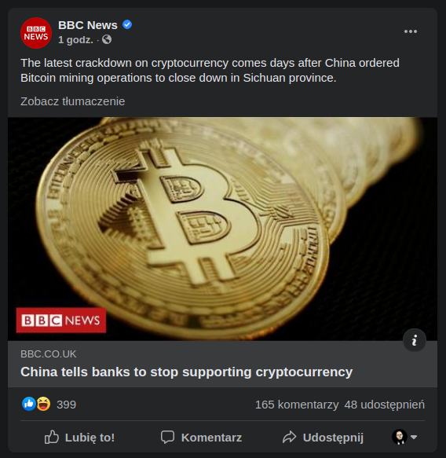  

---

### 2020

TVP robi wszystko, by przekonać Polaków, że likwidacja tej stacji to bardzo dobry pomysł.

Wczoraj "Wiadomości" pochwaliły Agatę Dudę. Wiecie - wybory.

Podkreślono aktywność i szyk Agaty Dudy. Prezencję chwalił Christian Paul, amerykański projektant mody.

Tyle, że Christian Paul nie istnieje.

Pod tą nazwą można znaleźć tylko markę producenta zegarów z australijskiego Sydney.
Sama autorka materiału – Kinga Kwiecień – za złośliwe uwagi na Twitterze zaczęła... banować internautów.

Kim jest więc mężczyzna z TVP?

To Krystian Farbaniec, analityk.

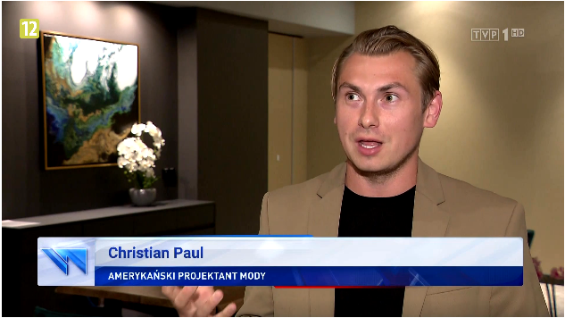  

---

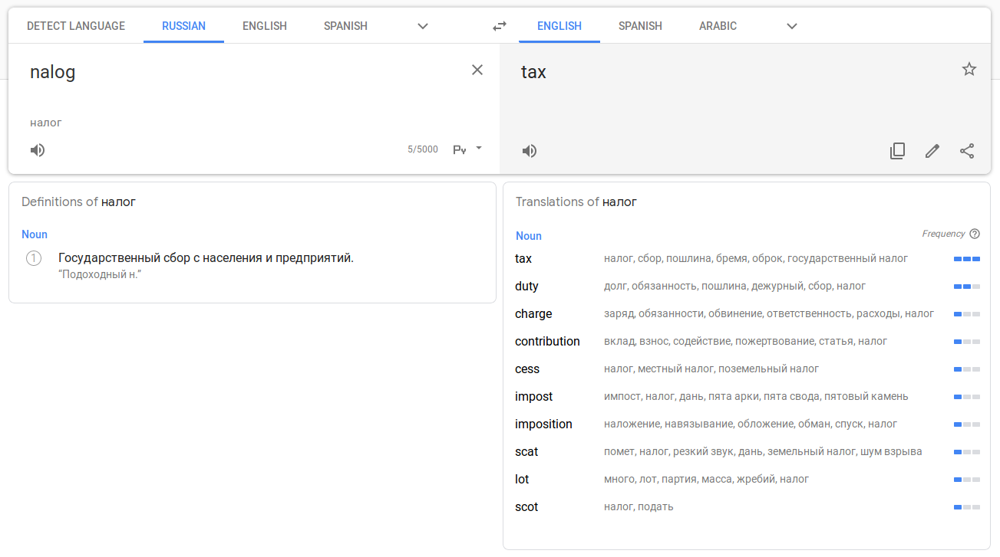  

---

### 2013

W wieku 65 lat zmarł Krzysztof Habich, przedsiębiorca z powołania znany z toczonej przez lata wojny z fiskusem. Mimo licznych wytaczanych mu procesów, a także spędzenia wielu miesięcy w areszcie pod zarzutem oszust podatkowych nigdy nie ustąpił w swoim sporze z socjalistycznym państwem. Autor książki „Ostatnich gryzą psy” w której napisał: „Uczciwi obywatele godzą się na istnienie państwa, bo wiedzą, że ono obroni ich choćby przed złodziejami. Jakże gorzko się rozczarowują, kiedy państwo okazuje się złodziejem największym, z jedną tylko różnicą: rabusie przyznają, że zabierają dla siebie. A państwo mówi, że zabiera dla innych, poszkodowanych przez los. (…) Związek z państwem polega bowiem na tym, że pewne jest tylko to, iż trzeba dać. Natomiast czy cokolwiek się otrzyma w zamian jest absolutnie niezwiązane z tym, ile się dało i czy w ogóle dało się cokolwiek.

> Niektórzy nie robią nic, ale inni robią nic.

### 1976

Premier rządu PRL Piotr Jaroszewicz (zdjęcie) ogłosił w transmitowanym przez radio i telewizję przemówieniu podwyżkę cen detalicznych, która miała wejść w życie cztery dni później. Mięso i jego przetwory miały zdrożeć o 69 proc., drób o 30 proc., masło i nabiał o 50 proc., a cukier nawet o 100 proc. Rząd, chcąc nieco załagodzić trudną sytuację socjalną pracowników planował zremompensować skutki podwyżki przez wypłatę rekompensat, ale na zasadach raczej daleko odbiegających od sprawiedliwości. Ludzie zarabiający najmniej (poniżej 1300 ówczesnych zł miesięcznie) mieli otrzymywać miesięcznie tytułem rekompensaty po 240 zł, zaś zarabiający najlepiej (powyżej 8000 zł) - nawet 600 zł.
Ogłoszenie podwyżki cen wywołało już następnego dnia falę ogólnopolskich protestów i strajków w zakładach pracy znaną jako Czerwiec 76.

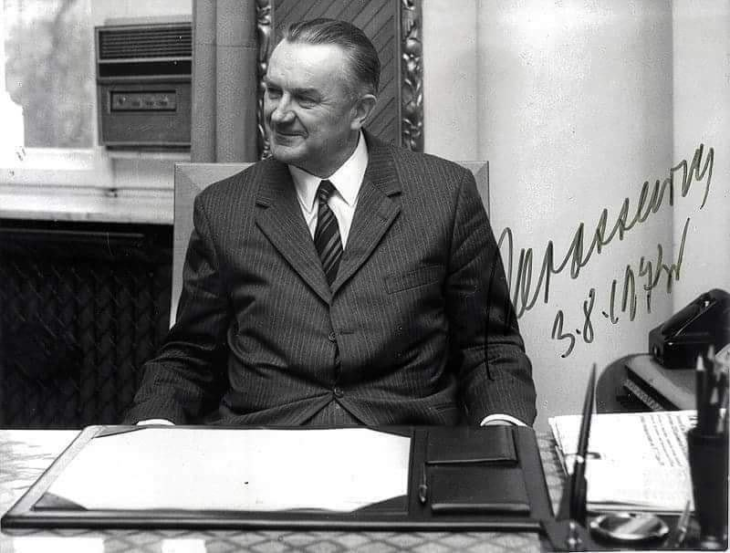  

### 1946

Polscy komuniści zamordowali Mariana Bernaciaka, ps. Orlik - majora, dowódcę oddziału partyzanckiego 15 pp. ,,Wilków'' AK.

Komendant ,,Orlik'' wraz z piątką towarzyszy zostali zaskoczeni, gdy wracali z odprawy inspektoratu dowództwa WiN Puławy. Zostali zaatakowani przez przeważające siły złożone z KBW i UB. Nieprzyjaciele wiedzieli o pobycie ,,Orlika'' w wiosce, ponieważ sołtys gromady Więcków gm. Trojanów powiadomił o tym fakcie najbliższą placówkę MO.

Relacja Kazimierza Piskały ps. ,,Kotek'', żołnierza z oddziału komendanta ,,Orlika'' i naocznego świadka tamtego tragicznego zdarzenia :

,,W czasie jazdy koniowi odpadła podkowa. Komendant postanowił zajechać do kowala. Kuźnia znajdowała się w pobliżu skrzyżowania Trojanów-Więcków-Życzyn przy wiosce Piotrówek. Do kuźni z koniem udali się Grom i Mundek. Kret oddalił się, chyba wszedł na drzewo wiśni. Pozostali zostali na kwaterze. Od lasu Życzyn zauważyliśmy nadchodzące wojsko. Korpus Bezpieczeństwa Wewnętrznego, UB? Oddałem w ich kierunku kilka strzałów. Strzelali również Grom i Mundek. Komendant Orlik; i Ogarek wycofywali się w stronę Trojanowa. W tym momencie Ogarek został zabity. Orlik biegł nadal w stronę lasu Trojanów.''
Kilka metrów dalej ranny został komendant ,,Orlik''. Był ostrzeliwany z dwóch stron przez żołnierzy saperskich z 1 Dywizji Piechoty, a także przez Milicję Obywatelską. Podobno przed śmiercią komendant zdążył jeszcze zniszczyć dokumenty, które miał przy sobie, i dobił się strzałem z pistoletu. Pozostali dwaj żołnierze ,,Orlika'' zostali pojmani przez wroga, a dwóm udało się zbiec.
Za tę akcję osiemnastu polskich komunistów zostało uhonorowanych prestiżowymi odznaczeniami: sześciu Polaków otrzymało Krzyże Grunwaldu III klasy, pięciu - Krzyże Virtuti Militari V klasy, a siedmiu pozostałych - Krzyże Walecznych.

W związku z tym tragicznym wydarzeniem major „Zagon” wydał rozkaz do swoich żołnierzy:

,, Dnia 24 czerwca 1946 r. w Życzynie powiatu Garwolińskiego zginął na posterunku w służbie Tej „co nie zginęła”, śp. Komendant Orlik. ŻOŁNIERZE, Odszedł od nas Żołnierz, który całe swe życie, całą swą wolność poświęcił Tej, którą ukochał nad wszystko. Polska Wolna i Silna była Mu ideą, była Mu celem. Prowadził tę walkę od roku 1939 z okupantem niemieckim, a kiedy Niemcy zostały pokonane i Polska przy pomocy nowej Targowicy uległa nowej przemocy, nowej okupacji sowieckiej, znalazł się w pierwszych szeregach żołnierzy AK, którzy podjęli na nowo walkę z okupantem sowieckim. W tej walce nie ustawał i trudu własnego i krwi własnej nie szczędził ofiary obfitej, bo „walczyć dla Ojczyzny i umierać miło” aż stanął nad ciemną, nad zimną mogiłą bohaterski OBROŃCA OJCZYZNY. Pamięć Jego nie sczeźnie w zapomnienia pyle, lecz wryje się w serca nasze i zrodzi w nich potężniejsze uczucie wolności, a krwi naszej życie weźmie „Ta – co jeszcze nie zginęła”.
W związku ze śmiercią śp. Komendanta Orlika zarządzam na terenie całego ZZK i we wszystkich oddziałach 4-tygodniową żałobę. Zakazuję wzięcia udziału poszczególnym członkom w jakichkolwiek zabawach.”

W 2009 roku Prezydent RP Lech Kaczyński nadał ,,Orlikowi'': za wybitne zasługi dla niepodległości Rzeczypospolitej Polskiej Krzyż Wielki Orderu Odrodzenia Polski. (pośmiertnie)

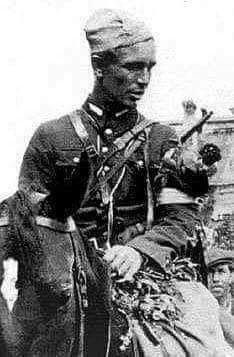  

### 1944

Podczas lotu nad Normandią zaginął 30 letni polski pilot Aleksander Chudek ( zdjęcie). Służył w legendarnym Dywizjonie 303.Tego dnia wykonywał on rutynowy lot ,z którego nie powrócił do bazy. Przypuszczano,że został zestrzelony i trafił do niemieckiej niewoli. Kiedy jednak po wojnie nie wrócił do Anglii uznano go za poległego. Sprawa jednak wyjaśniła się po jakimś czasie,gdy okazało się,że na jednej z farm rozbił się płonący samolot z pilotem,którego nazwiska nikt nie znał. Na podstawie numeru ewidencyjnego
wraku stwierdzono, że był to Spitfire
Aleksandra Chudka. Ciało pilota złożono zawinięte w spadochron na miejscowym cmentarzu.
23 czerwca 2009 r. w Roucamps
odsłonięto pamiątkową tablicę ku jego czci.
Symboliczny grób lotnika znajduje się na cmentarzu parafialnym w Czemiernikach.
Chudek miał na swoim koncie 10 zestrzeleń niemieckich samolotów.

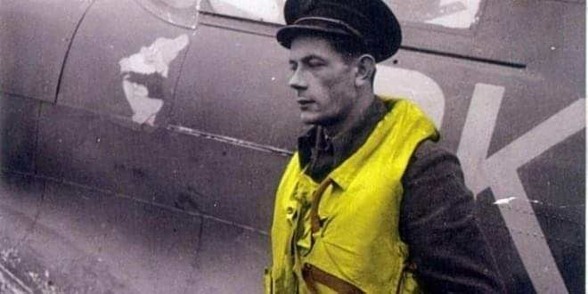  

---

5. Wileńska Brygada Armii Krajowej pod dowództwem majora ,,Łupaszki'' [Foto], w odwecie za zabicie przez litewską policję 20 czerwca 39 Polaków w Glinciszkach, dokonała masakry 27 cywilnych osób (w tym 12 dzieci) w zamieszkanej głównie przez Litwinów wiosce Dubinki. Na cel wybrano Dubinki, ponieważ w wiosce zamieszkiwały rodziny policjantów litewskich odpowiedzialnych za mord Polaków w Glinciszkach. Wśród ofiar zamordowanych przez 5. Wileńską Brygadę AK była także Polka, Anna Górska wraz z małoletnim synem oraz Józef Leśnikowski.
Tak w jednej z ulotek pisał sam major Szendzielarz:
"Nie jesteśmy żadną bandą, tak jak nas nazywają zdrajcy i wyrodni synowie naszej ojczyzny (...) Wypowiedzieliśmy walkę na śmierć lub życie tym, którzy za pieniądze, ordery lub stanowiska z rąk sowieckich, mordują najlepszych Polaków domagających się wolności i sprawiedliwości".

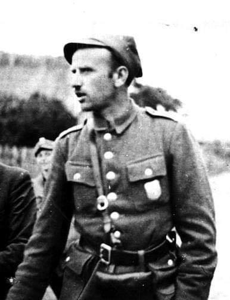  

---

Premier RP na Uchodźstwie Stanisław Mikołajczyk ostatecznie odrzucił ultimatum Józefa Stalina dotyczące „reorganizacji” władz polskich w Londynie, jako naruszające suwerenność państwa polskiego. Ultimatum przewidywało ustąpienie prezydenta RP Władysława Raczkiewicza, Naczelnego Wodza gen. Kazimierza Sosnkowskiego, ministra obrony gen. Mariana Kukiela i ministra informacji Stanisława Kota i publiczne zdystansowanie się rządu RP od obarczenia ZSRR zarzutem dokonania zbrodni katyńskiej.

2 lutego ambasador Harriman spotkał się ze Stalinem, potwierdzając aktualność zobowiązań teherańskich. Prezydent Roosevelt wprawdzie niepokoił się o los zbliżających wyborów, ale został uspokojony przez Stalina. Polityk amerykański pisał zresztą do Stalina 7 lutego, poruszając drażliwą kwestię reorganizacji polskiego rządu zaproponowaną przez Mołotowa w styczniu. Roosevelt wyraził przypuszczenie, iż załatwi to Churchill, który w tym samym czasie starał się wpłynąć na Mikołajczyka i kontaktował się ze Stalinem. Ostatecznie wyraził nadzieję, iż uda się znaleźć rozwiązanie "sprawy Rządu Polskiego, które pozwoliłoby samemu Premierowi polskiemu dokonać w składzie jego Rządu takich zmian, jakie mogą być niezbędne, bez jakichkolwiek oznak nacisku lub dyktatu ze strony obcego kraju". 28 stycznia list do Stalina zaadresował Churchill. Przedstawił w nim odbywane przez siebie spotkania z Polakami. Stalin replikował 4 lutego, całkowicie odrzucając jakiekolwiek podejrzenia o chęć ingerencji w sprawy Rządu Emigracyjnego. Ponownie przedstawił warunki, jakie wcześniej postawił Mołotow, będące dla Sowietów podstawą do nawiązania ponownych kontaktów z Rządem Emigracyjnym. Chodziło przede wszystkim o częściową reorganizację gabinetu Mikołajczyka oraz o oficjalną akceptację linii Curzona przez Rząd Emigracyjny. Szczególnie zawzięli się Sowieci na ministrów Kota i Kukiela oraz Sosnkowskiego, czego wyraz dali w rozmowach z Amerykanami i Brytyjczykami. Roosevelt informował o tym ambasadora Gromykę 21 lutego. Podobną presję wywierał ambasador O'Malley w rozmowie z Mikołajczykiem w dniu 12 lutego. Trzy dni później Rada Ministrów zatwierdziła teksty rezolucji, w których odrzucono projekty graniczne oraz próby zreorganizowania Rządu Emigracyjnego. Nie przypadło to do gustu politykom zachodnim, a Churchill zdecydował się na drastyczne posunięcie. 22 lutego przemawiał przed Izbą Gmin: "Chciałbym przypomnieć Izbie, że my sami nigdy nie udzielaliśmy Polsce w imieniu Rządu Jego Królewskiej Mości gwarancji w odniesieniu do jakiejkolwiek linii granicznej [...] Stanowisko brytyjskie w 1919 r. znalazło wyraz w tak zwanej linii Curzona, która usiłowała rozwiązać ten problem przynajmniej częściowo [...] Wyzwolić Polskę mogą obecnie armie rosyjskie, które utraciły miliony ludzi, niszcząc niemiecką machinę wojenną. Nie wydaje mi się, aby rosyjski postulat zabezpieczenia zachodnich granic Rosji wykraczał poza to, co jest rozsądne lub słuszne". Przemowę Churchilla doskonale odebrano w Moskwie. Zupełnie inne nastroje zapanowały w emigracyjnych kręgach polonijnych, które zbulwersowała wypowiedź premiera brytyjskiego. Pod jego adresem kierowano bardzo ostre słowa. 24 lutego Romer spotkał się z Edenem, który ostatecznie rozwiał złudzenia Polaków, jeśli je jeszcze mieli: "Polacy muszą opanować swą emocjonalność i nauczyć się podporządkowywać zasadniczym, wspólnym celom swoje interesy. Bez tego nawet te ostatnie nie dadzą się zabezpieczyć". 7 marca Churchill pisał do Stalina kolejny list, w którym zawarł przypuszczenie, iż dyktator radziecki "nie zamknął ostatecznie drzwi do zawarcia porozumienia w trybie roboczym z Polakami". 19 marca ambasador Clark-Kerr przekazywał Mołotowowi niepokojące wieści z Londynu, gdzie zamierzano zaszantażować nieco Stalina kwestiami militarnymi. Clark-Kerr spotkał się 19 marca ze Stalinem, mówiąc mu chociażby: "Odmowa rządu radzieckiego [...] przyjęcia propozycji Churchilla [to jest odłożenia sporów do konferencji powojennej] mogłaby spowodować trudności w stosunkach anglo-radzieckich, rzucić cień na realizację operacji wojennych uzgodnionych w Teheranie i w ogóle skomplikować sprawę prowadzenia wojny przez Narody Zjednoczone". 

Marna to była pogróżka względem Stalina, który w zastraszaniu był mistrzem. Doskonale zdawał sobie sprawę, iż nikt w Wielkiej Brytanii nie będzie się narażał dla sprawy Polski i zignorował jakiekolwiek ostrzeżenia. 23 marca ponownie pisał do Churchilla i jasno określił, że stanowisko mocarstw zostało uzgodnione w Teheranie. Przypomniał Churchillowi, iż wyraził on zgodę na linię Curzona. Dyktator podkreślił także: "Związek Radziecki nie wojuje i nie zamierza wojować z Polską. Związek Radziecki nie ma żadnego konfliktu z narodem polskim i uważa się za sojusznika Polski narodu polskiego [...] Istnieje natomiast konflikt między Rządem Radzieckim a polskim rządem emigracyjnym, który nie odzwierciedla interesów narodu polskiego i nie wyraża jego pragnień". Możemy się domyślić, że znacznie lepiej pragnienia te wyrażać miała Krajowa Rada Narodowa. 27 marca spotkał się brytyjski gabinet wojenny. Churchill nie chciał ryzykować kłótni ze Stalinem i postanowił podporządkować dalszą politykę końcowemu zwycięstwu militarnemu. W marcu skończyła się pierwsza faza zamieszania wokół sprawy Polski. Konflikty na chwilę wygasły, ponieważ wszystkie strony chciały osiągnąć coś innego i nie było żadnego pomysłu na kompromis zadowalający każdego. Kreml kombinował w szczególny dla siebie sposób, starając się pozyskać do współpracy przywódców polonii amerykańskiej. Mikołajczyk także wiązał swe plany ze Stanami Zjednoczonymi. Chciał uzyskać możliwość wyprawy do USA i dyskutowania zagadnień sprawy polskiej z prezydentem Rooseveltem. Nie otrzymał jednak oficjalnego zaproszenia. Churchill doskonale orientował się w zamierzeniach polskiego premiera i popierał jego starania. 9 kwietnia spotkał się z szefem Rządu Emigracyjnego. Rozmowa przebiegała w dobrej atmosferze, aczkolwiek premier brytyjski sugerował Polakowi usunięcie Sosnkowskiego. Mikołajczyk nie miał na to wpływu, ponieważ Naczelnego Wodza odwoływał i powoływał prezydent sprzyjający generałowi. 3 kwietnia Mikołajczyk otrzymał list od Roosevelta, który twierdził, iż będzie mógł przyjąć polskiego premiera dopiero w maju. Ale później minął kwiecień, a zaproszenia wciąż nie wystosowano. Wreszcie w maju przyszła oficjalna wiadomość. Wcześniej jednak doszło do równie ważnych wydarzeń, tyle że w Europie. 25 kwietnia Churchill przewodził brytyjskiej delegacji z Cadoganem, O'Malleyem i szefem SOE Selborne'em w składzie, która spotkała się z Mikołajczykiem, Raczyńskim i przybyszami z okupowanego kraju - Zygmuntem Berezowskim, Stanisławem Ołtarzewskim i gen. Stanisławem Tatarem. Rozmowa przebiegała w napiętej atmosferze. Berezowski zarzucił Brytyjczykom sprzeniewierzenie się zasadom: "[Polacy zaufali] Wielkiej Brytanii, jej premierowi i że w związku z tym liczą na zdecydowaną pomoc Churchilla w zabezpieczeniu prawdziwej niepodległości Polski i nienaruszalności jej granic". Premier brytyjski replikował: "Stanąłem na stanowisku linii Curzona, linii wyłączającej Wilno i Lwów, a w zamian przyznania Polsce szerokiego dostępu do morza i cennych terytoriów kosztem Niemiec. Ewentualnie, w zależności od waszego życzenia, po linię Odry [...] Takie rozstrzygnięcie winno wam dać pokaźne i zwarte terytorium jako odpowiednią siedzibę dla waszego narodu". Oprócz wzajemnego żalu rozmowy nie przyniosły nic. Gdy pod koniec maja przyszło z dawna wyczekiwane zaproszenie do Waszyngtonu adresowane do Mikołajczyka, było jasnym, iż Roosevelt szuka poparcia w jesiennych wyborach. Głosy polonii amerykańskiej mogły zadecydować w jego batalii z Thomasem Deweyem. Zanim jednak Mikołajczyk wybrał się do Stanów Zjednoczonych, 31 maja spotkał się z Churchillem, który dawał mu rady na przyszłość. W dniach 5-14 czerwca polski premier bawił w Stanach Zjednoczonych. Zbiegło się to w czasie z ofensywą aliantów Normandii, co oczywiście na dalszy plan zepchnęło kwestię polską. Co więcej, sekretarz stanu Stettinius zapewniał stronę radziecką, iż rozmowy nie przyniosą "żadnych nowych propozycji", co od razu przesądzało wynik wizyty Mikołajczyka. Prezydent amerykański w żywe oczy okłamywał Polaka, mówiąc, iż nie miał nic wspólnego z teherańskimi propozycjami linii Curzona. Podczas spotkań poruszono przede wszystkimi kwestie graniczne oraz stosunków z Sowietami. W sprawie granic Mikołajczyk opowiadał się za nieznacznym rozszerzeniem Polski na zachód, ale zastrzegał: "Doświadczenie nauczyło Polskę, że narody angielski i amerykański szybko znowu zapomną, co Niemcy właściwie reprezentują, i że po klęsce Niemiec będą zbyt szybko gotowe do współpracy z nimi". Roosevelt grał rolę dobrodusznego krewniaka, który wstawi się za Polakami. Zalecał też rozsądek w kwestii sowieckiej: "Musicie pamiętać, że jest pięć czy sześć razy więcej Rosjan od Polaków, że nie możecie z nimi walczyć. Należy się więc z nimi ułożyć". Dokładnie to robiła w tym czasie delegacja Krajowej Rady Narodowej w Moskwie, która dogadywała się ze Stalinem w kwestii powołania nowego rządu. Mikołajczyk wracał do Londynu uspokojony zapewnieniami Roosevelta. Informował kraj o swoich przypuszczeniach: "Roosevelt uważa, że ma duży wpływ na Stalina i może uzyskać od niego więcej niż Churchill, że pewne tendencje Rosji do ułożenia stosunków z Polską, wywołane niepowodzeniem prób zjednania Polaków, zostaną umocnione moralnym poparciem udzielonym Polsce i jej rządowi przez Amerykę, z którą Rosja coraz bardziej się liczy". 22 czerwca spotkał się z Churchillem i powiadomił go o wynikach waszyngtońskich rozmów. Premier brytyjski skrytykował Mikołajczyka za jego naiwność, gdyż ten wierzył w Roosevelta i jego możliwość przywrócenia Polsce nie tylko Lwowa, ale i Wilna. Z kolei Mikołajczyka postrzegano w Ameryce na ogół pozytywnie, a Hull podsumował jego wizytę 17 czerwca w depeszy do Harrimana: "Jest bardzo rozsądny, rozumiejący sytuację i obiektywny w traktowaniu wielu problemów, wobec których stoi jego kraj". 19 czerwca Roosevelt kontaktował się ze Stalinem, zalecając mu spotkanie z Mikołajczykiem. 24 czerwca Stalin odpowiedział, ale jak zwykle stwierdził, iż wszystko zależne jest od uznania linii Curzona i reorganizacji rządu. Innego rozwoju wydarzeń nie przewidywał. Co ciekawe, w chwili gdy Mikołajczyk planował wizytę w USA, z Sowietami spotykał się Stanisław Grabski, przygotowując grunt pod rozmowy dyplomatów radzieckich z szefem Rządu Emigracyjnego. Rozmawiali jeszcze 31 maja i 10 czerwca. Wreszcie 20 czerwca Mikołajczyk spotkał się z ambasadorem radzieckim Lebiediewem. Umówili się oni w mieszkaniu Grabskiego, gdzie mieli zapewnioną dyskrecję. Konferowali jeszcze 22 i 23 czerwca. Lebiediew jasno wyraził stanowisko rządu radzieckiego - uznanie linii Curzona, reorganizacja rządu i odwołanie Raczkiewicza, Sosnkowskiego, Kukiela i Kota, którzy w opinii Kremla byli głównym źródłem konfliktów. Dodatkowo, już 23 czerwca Lebiediew żądał wycofania Polaków ze sprawy Katynia i przeproszenia strony sowieckiej za bezpodstawne oskarżenia. Mikołajczyk nie miał wątpliwości, iż Sowieci przesadzają w swoich żądaniach i stanowczo odmówił Lebiediewowi, co zakończyło ostatecznie kilkudniowe rozmowy. Stalin mógł teraz swobodnie odpowiedzieć na list Roosevelta z 19 czerwca i obserwować rozwój wydarzeń na froncie, gdzie jego wojska przystąpiły do finałowej ofensywy. Pisał do Waszyngtonu: "Rząd Radziecki upatruje najważniejszą przesłankę tego w reorganizacji rządu polskiego, która zapewniłaby udział w nim zarówno działaczy polskich w Anglii, jak działaczy polskich w Stanach Zjednoczonych i ZSRR, a zwłaszcza polskich działaczy demokratycznych znajdujących się w samej Polsce, oraz w uznaniu przez rząd polski linii Curzona jako nowej linii granicznej między ZSRR a Polską". Na ziemiach polskich trwała operacja "Burza", Sowieci zbliżali się do Wisły, a sytuacja Mikołajczyka przedstawiała się coraz gorzej. I to wszystko spadło na premiera Rządu Emigracyjnego wraz z utworzeniem Polskiego Komitetu Wyzwolenia Narodowego oraz wybuchem Powstania Warszawskiego.

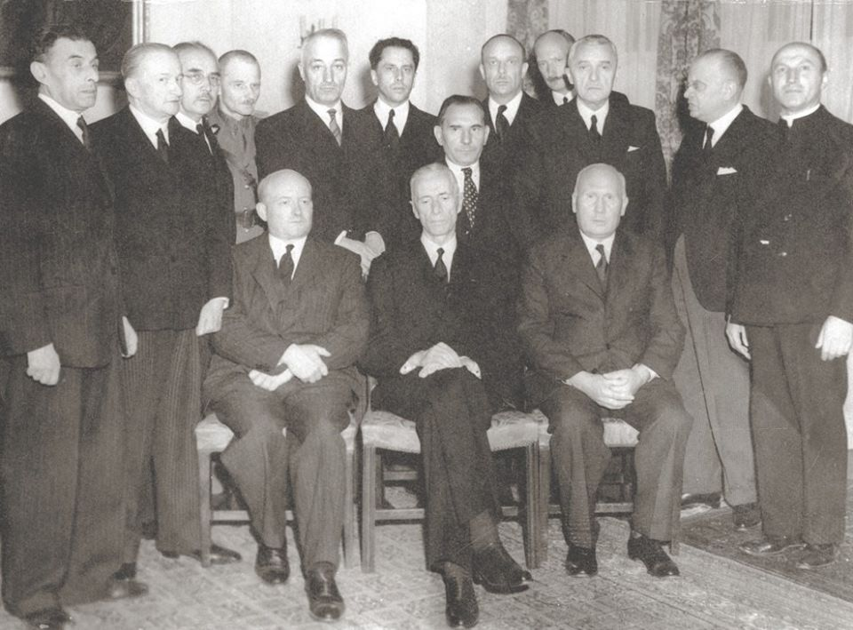  

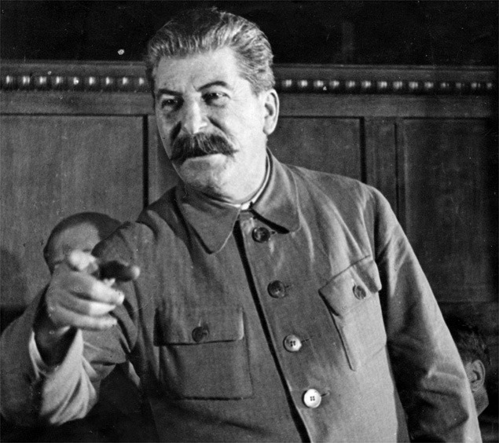  

---

### 1943

,,W okresie od zimy 1941/42 do czerwca 1943 r. we wsi Kolonia Wojewódki Dolne przechowywaliśmy w swoich zabudowaniach następujących Żydów: Berko Szafirsztejna (lat ok. 40-50), Hanię Szafirsztejn (lat 21), Bolka Szafirsztejna (lat 11), Alę Szafirsztejn (lat 9), Cywię Lewin (lat 20) oraz jedną Żydówkę z Łukowa zbiegłą z transportu do Treblinki. Mieszkaliśmy przy torach kolejowych, więc widzieliśmy transporty jeżdżące do Treblinki. Jedna z Żydówek uciekła z transportu jadącego z łukowa, ale jej nazwiska już nie pamiętam. Wyskoczyła z pociągu i złamała nogę, a mama ją przygarnęła. Żydzi ci mieli w stodole przygotowane ukrycie, ale szczerze mówiąc, to tak się bardzo nie ukrywali, tylko normalnie chodzili. Tu była kolonia, naokoło był las, dom na uboczu. W tym miejscu były tylko dwa domy - nasz i w sąsiedztwie mamy siostry. Sąsiedzi nie wiedzieli, że byli u nas Żydzi, ponieważ nikt się tym nigdzie nie chwalił. Cała tragedia rozegrała się 23 czerwca 1943 roku. Było raniutko. Spaliśmy jeszcze, jak wtargnęła żandarmeria niemiecka z posterunku w Sokołowie Podlaskim, których zwierzchnikiem był Gramss. Obudzili nas. Ja byłam dzieckiem mającym 9 lat. Ten zgiełk i wrzask Niemców to jeszcze do dziś jest w moich uszach i jak gdzieś usłyszę język niemiecki, to wszystko powraca. Zrobili po prostu pokaz publiczny, aby przestraszyć wszystkich tym, jaka kara groziła za ukrywanie Żydów. Spędzili ludzi z sąsiednich wsi z Wojewódek Dolnych i z Przywózk, bo my byliśmy na granicy między Wojewódkami a Przywózkami. W Przywózkach była już zamężna moja siostra, to nawet i ją chcieli rozstrzelać, ale komendant straży pożarnej z Przywózk, obecnie dawno nie żyjący pan Czarnocki Józef, zaręczył, że siostra nie miała z matką żadnych kontaktów i że nic nie wiedziała o przechowywanych Żydach. Moja mama, Bronisława Wojewódzka kiedyś pracowała w Niemczech i trochę znała język niemiecki, więc trochę się z nimi dogadywała, ale oni byli bezlitośni. Najpierw Niemcy rozstrzelali wszystkich Żydów, a później, ponieważ tam było dwoje zamordowanych dzieci, jeden z Niemców powiedział do mamy: ,,Skoro tak kochałaś tych Żydów, to weź zanieś tę i połóż do grobu''. To była mała dziewczynka. Miała może 7-8 lat, bawiłyśmy się razem. Więc mama wzięła tę dziewczynkę, żeby położyć ją tam razem do grobu, gdzie leżały już pozostałe ciała. Nachyliła się, aby położyć ją i w tym czasie Niemiec strzeli jej w głowę, tak że mama razem wpadła do tego dołu. My już tego nie widzieliśmy. Nas, najmłodszą trójkę, tzn. mnie Elżbietę (lat 9), Michała (lat 12) i Annę (lat 16) po prostu sołtys odwiózł do Przywózek do siostry Bronisławy, która była już zamężna. Nie wiem czym się zasugerowali. Gdy mamę rozstrzelali, to do nas dotarł odgłos strzału (...) Cały dobytek został zrabowany, a zabudowania na naszej posesji żandarmi spalili. Ja miałam trzech braci. Michała (lat 12), Józefa (lat 19), Mariana (lat 21). Dwóch ostatnich zabrali do więzienia na Pawiaku, a następnie do obozu koncentracyjnego w Mauthausen, gdzie obaj zginęli. (...) Marian pracował na kolei, a młodszy Józef uczył się na mechanika rowerowego. Michał mieszkał na Śląsku i pracował jako górnik. Zmarł w wieku 60 lat na pylicę. Prawdopodobnie do żandarmerii został wysłany list przez człowieka z baraku kolejowego. Być może doniósł M., który sam zginął potem w Treblince. My się uratowaliśmy może dzięki temu, że mama z nimi po niemiecku o nas rozmawiała. W koszulach wygnano nas ze snu i przywieziono furmanką do Przywózk. Również moja siostra Ania zginęła, mając 16 lat, kiedy przechodziła z grupą młodzieży przez tory kolejowe. Wracali z zabawy z Bartosza. Szła wtedy warta, która chodziła przy torach kolejowych. Prawdopodobnie byli to Ukraińcy w armii niemieckiej, później chyba partyzanci ich zamordowali gdzieś pod Podnieśnem. (...) Puścili serię strzałów z karabinu maszynowego, a że siostra była w jasnej sukience i najbardziej rzucała się w oczy - zginęła na miejscu. (...) Nasza rodzina opiekowała się Żydami tak za życia, jak i po śmierci, troszcząc się o wspólną mogiłę. Są na niej wszystkie nazwiska osób, które zginęły i tam spoczywają. Co roku miejsce to jest odwiedzane przez młodzież z Przywózk. (...)''

Źródło cytatu: MWiM w Treblince, Akta osobowe, Bronisława Wojewódzka, Józef Wojewódzki, Marian Wojewódzki; MWiM w Treblince, Relacja Elżbiety Kozak
(z d. Wojewódzkiej).

  

### 1941

Samoloty sowieckie 212 Pułku Lotnictwa Bombowego zrzuciły na Warszawę swoje pierwsze bomby. Celem tego dosyć nieudolnego bombardowania miały być mosty na Wiśle oraz znajdująca się w Rembertowie niemiecka fabryka amunicji "Pocisk". Bomby zrzucone z wysokości 8 kilometrów nie uszkodziły żadnej z warszawskich przepraw. Część z pocisków spadła nawet prosto do Wisły. Nie oznacza to jednak, że nie obyło się bez strat. Nieudolność Sowietów spowodowała, że zniszczeniu uległa spora część miasta.
Istnieją bardzo rozbieżne dane, co do strat poniesionych przez Niemców. Według danych sowieckich wyniosły one 55 osób, według innych analiz jedynie 6. Straty w ludności cywilnej to 42 osoby, z czego aż 34 to ofiary zbombardowania kościoła świętego Floriana na Pradze, obok którego przejeżdżał akurat tramwaj wypełniony pasażerami.
Na zdjęciu sowiecki bombowiec Ił-4 (wcześniejsze oznaczenie DB-3F) wykorzystywany w nalotach na
Warszawę.

  

### 1793

https://pl.wikipedia.org/wiki/Sejm_grodzie%C5%84ski_(1793)

### 1764

Zakończyły się obrady Sejmu konwokacyjnego, zwołanego w celu przygotowania elekcji Stanisława Augusta Poniatowskiego.

Ostatnia elekcję w dziejach Rzeczypospolitej Obojga Narodów trudno nazwać wolną. Starania Familii, aby wprowadzić na tron własnego kandydata, zaowocowały planami wspieranego przez wojska rosyjskie zamachu stanu jeszcze za życia Augusta III. Przygotowania do wyboru wygodnego dla Rosji monarchy zaowocowały porozumieniem rosyjsko-pruskim z kwietnia 1764 r., w którym jako kandydata wskazano stolnika litewskiego, Stanisława Augusta Poniatowskiego. Z Rosją łączyło go nie tylko doświadczenie polityczne, ale także życie prywatne — przebywając jako poseł w Petersburgu był kochankiem carycy Katarzyny. 7 maja rozpoczął obrady sejm konwokacyjny (zwoływany w celu wybrania króla), który mimo niewielkiej liczby posłów (wspieranych jednak przez wojska carskie) przeprowadził reformy w dużym stopniu ograniczające demokrację szlachecką.

Zakończone 23 czerwca obrady zaowocowały zniesieniem liberum veto w sprawach dotyczących skarbu i wojska, ograniczeniem kompetencji hetmanów oraz reformą podatkową. Istotnym punktem było uznanie tytułów cesarzowej Rosji i króla Prus, co pozwoliło władcom tych państw na roszczenia wobec ziem Rzeczypospolitej. Zawiązana konfederacja generalna pozwoliła posłom i senatorom na przeprowadzenie sejmu elekcyjnego. 7 września nielicznie zebrana szlachta dokonała przy obecności wojsk rosyjskich elekcji wskazanego kandydata. Stanisław August Poniatowski został koronowany na króla Polski 25 listopada 1764 r.

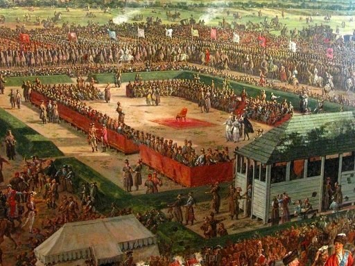  

### 1602

Miała miejsce bitwa pod Kokenhausen (obecnie w granicach Łotwy).Wspominam ją, ponieważ w znaczący sposób wpisuje się ona w naszą historię.
Po detronizacji Zygmunta III Wazy z tronu szwedzkiego, realizując obietnice z czasów elekcji, król wydał akt inkorporacji Estonii do Rzeczypospolitej. Wydarzenie to stało się przyczyną wybuchu wojen polsko-szwedzkich. Działania zbrojne toczyły się początkowo na obszarze Inflant (Estonia i część Łotwy).
Oblegające Kokenhausen oddziały polsko- litewskie zostały zaatakowane przez idącą na odiecz załodze armię szwedzką. Armią Rzeczypospolitej dowodził hetman wielki litewski Krzysztof "Piorun" Radziwiłł (grafika). Do swojej dyspozycji miał ponad 3 tys. żołnierzy (2900 jazdy, 300 piechurów oraz 17 dział). Nieprzyjacielskie oddziały Carla Carlssona Gyllenhielma były liczniejsze - 4 tys. jazdy i 900 piechurów, wspieranych przez ok. 20 dział.
Bitwę rozpoczął atak Szwedów na lewym skrzydle. Szarżę powstrzymywały wojska polskie , po czym nastąpił kontratak husarii.
Uderzenie ciężkiej jazdy przełamało linie szwedzkie, zmuszając jazdę nieprzyjaciela do ucieczki. Losy zmagań na prawym skrzydle przesądziła artyleria, która celnym ogniem wsparła atak polskiej kawalerii.
Bitwa zakończyła się zwycięstwem wojsk Rzeczypospolitej. W batalii udział odznaczyli się Jan Karol Chodkiewicz oraz Janusz Radziwiłł.

  

---

<a href="https://github.com/TomaszWaszczyk/historia.waszczyk.com/edit/master/src/content/june-23.md" target="_blank">Edytuj tę stronę dzieląc się własnymi notatkami!</a>
