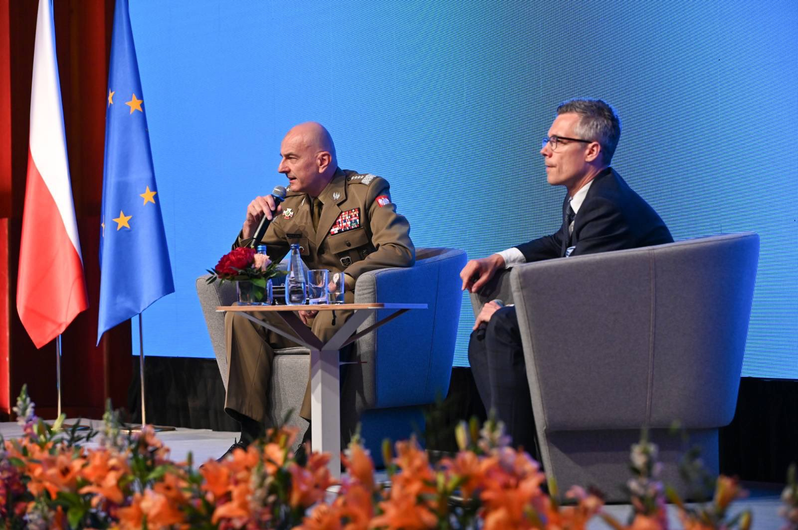
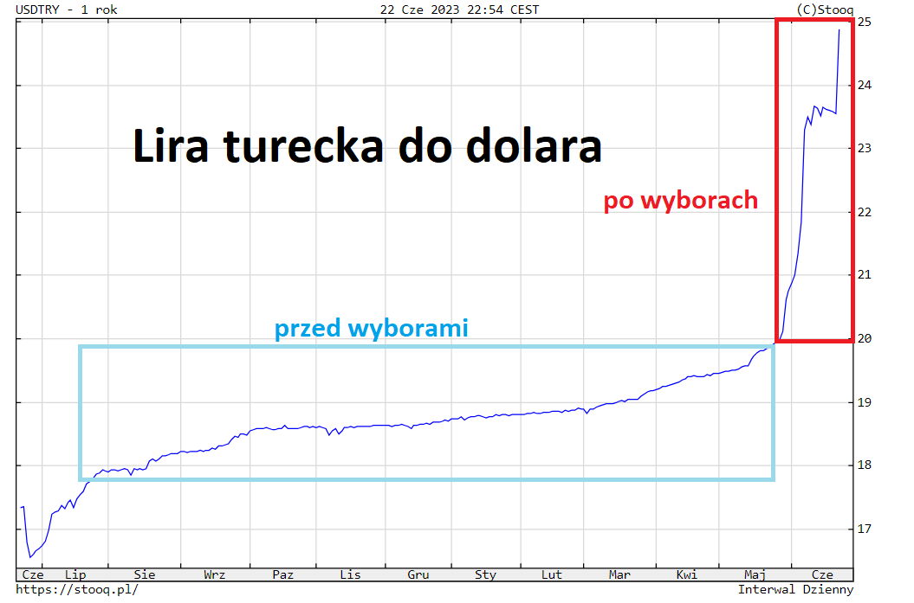
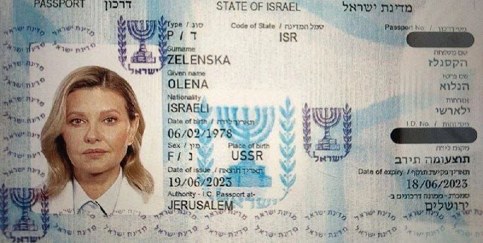
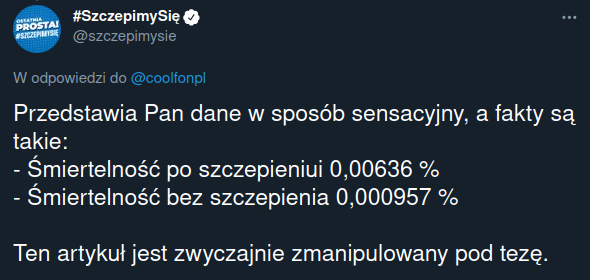
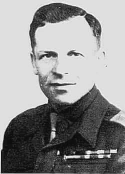

### 2023

> Micheil Saakaszwili: Putin użyje "czerwonego guzika". Celami będą Kijów i Rzeszów
> "Władimir Putin użyje broni nuklearnej przeciwko Ukrainie. Stanie się to w momencie wkroczenia sił zbrojnych na Krym" - twierdzi Micheil Saakaszwili. Według niego decyzja o użyciu broni jądrowej zostanie poprzedzona prowokacją na Białorusi.

---

> Gen. Andrzejczak: „Po zakończeniu działań wojennych za naszą wschodnią granicą, POL i UKR będą największą siłą militarną w Europie, dlatego już teraz należy myśleć jak tym potencjałem dobrze zarządzić”.

  

---

<video width="640" height="480" controls>
<source src="./movies/june/wehavesystem.mp4" type="video/mp4">
Your browser does not support the video tag.
</video>

  

  

<!--    -->

### 2021

Szef banku centralnego Danii ostrzega przed załamaniem rynku nieruchomości

Lars Rohde uważa, że w Danii może dojść do załamania na rynku nieruchomości podobnego do tego, które nastąpiło po kryzysie finansowym 2008 roku.
Dania jest rekordzistą pod względem okresu utrzymywania ujemnej stopy procentowej. Trwa to już prawie dekadę. Tani kredyt spowodował wzrost cen na rynku nieruchomości, który według szefa banku centralnego osiągnął już moment krytyczny. Rohde uważa, że nadszedł czas, aby rząd Danii rozpoczął działania zaostrzające warunki uzyskiwania kredytów hipotecznych. Ujawnił, że minister odpowiedzialny za prawodawstwo finansowe nie kwapi się jednak do tego.

---

  

---

### 2011

Trupie Pole na ukrainie - ekshumacja z 2011 r. pomordowanych Polaków ze wsi Ostrówki. Znaleziono ok 261 ofiar rzezi, w tym 150 dzieci. W sumie ukraińcy zamordowali w Ostrówkach prawie pół tysiąca Polaków (145 mężczyzn, 125 kobiet i 204 dzieci).

<video width="640" height="480" controls>
<source src="./movies/june/trupiepole.mp4" type="video/mp4">
Your browser does not support the video tag.
</video>

### 1990

Ówczesny przewodniczący NSZZ Solidarność Lech Wałęsa ogłosił tak zwaną "wojnę na górze. Była to nazwa konfliktu, który wywiązał się właśnie między Lechem Wałęsą, rządem Tadeusza Mazowieckiego.
Jedną z przyczyn tego stanu rzeczy był również rosnący w szeregach Solidarności rozłam między reprezentującym lewicowy odłam związku Adamem Michnikiem, a konserwatystą Jarosławem Kaczyńskim. Pomiędzy zwaśnionymy stronami stanął właśnie Wałęsa, któremu rząd Mazowieckiego próbował znacznie ograniczyć wpływy, jako przewodniczącemu Solidarności, który w bezpośredni i wyraźny sposób krytykował poczynania władzy.
Wałęsa zarzucał rządowi między innymi powolne wprowadzanie programu politycznego Solidarności, a także nielojalność wobec związku i niekompetencję.
Głownymi dwoma bezpośrednimi skutkami tego konfliktu były; rozbicie jedności ugrupowań wywodzących się z NSZZ „Solidarność” i podział tego środowiska na zwolenników Lecha Wałęsy (Porozumienie Centrum , z którego wywodzi się obecne Prawo i Sprawiedliwość) i rządu Mazowieckiego (Ruch Obywatelski Akcja Demokratyczna , z którego narodziła się późniejsza Partia Demokratyczna ) wystawienie w wyborach prezydenckich z 25 listopada 1990 r. dwóch kandydatów z obozu solidarnościowego: Lecha Wałęsy i Tadeusza Mazowieckiego.

  

### 1976

Sejm akceptuje podwyżki cen detalicznych na artykuły spożywcze
Już w trakcie posiedzenia Sejmu na wniosek premiera Piotra Jaroszewicza uzupełniono porządek obrad o „propozycje niektórych zmian w strukturze cen detalicznych oraz zasad rekompensaty społeczeństwu skutków zmian”. Autorem projektu był członek Rady Państwa, poseł PZPR, Edward Babiuch.

Proponowany średni wzrost cen wynosił od 30 do 100 proc., z czego mięsa o 69 proc., drobiu o 30 proc., masła i serów o 50 proc., cukru o 100 proc. a ryżu o 150 proc. Podwyżki miały wejść w życie trzy dni później. Przewidywano wprowadzenie rekompensat, które miały wynosić od 240 do ok. 1 tys. zł. Wysokość rekompensaty była proporcjonalna do wysokości zarobków (średnie wynagrodzenie wynosiło wówczas 4281 zł).

Przyjęta uchwała brzmiała: "Sejm po wysłuchaniu referatu prezesa Rady Ministrów udziela poparcia propozycjom rządu i zaleca poddać je pod konsultacje z przedstawicielami załóg". Miały się odbyć do 25 czerwca. Jeszcze tego samego dnia wieczorem o podwyżkach podczas wystąpienia w telewizji poinformował premier Piotr Jaroszewicz.

### 1941

Wizna ( dawne województwo łomżyńskie) stała się miejscem pogromu ludności żydowskiej tej miejscowosci.
Wizna jest jedną z tych miejscowości w
regionie łomżyńskim, w których w pierwszych
dniach po agresji hitlerowskich Niemiec na
Związek Radziecki dokonano całkowitej
likwidacji miejscowej społeczności żydowskiej,
przy współudziale części ludności polskiej.
Oto fragment wspomnień ocalałego z tej zagłady Awigdora Nieławickiego:
"24 czerwca 1941 r. Niemcy wkroczyli do Wizny (....). Wkrótce
miejscowi Polacy zaczęli prześladować
ukrywających się Żydów. Były 3 przypadki, że
Polacy zabili na miejscu napotkanych Żydów.
W ten sposób zginął Paweł Lejman, którego
około 20 chuliganów tak pobiło na drodze
między Wizną i Łomżą, że zmarł następnego
dnia. Został pochowany na cmentarzu w
Wiźnie. Także kobieta z Łomży, która
przypadkowo była w gościach w Wiźnie,
została zabita przez Polaka z Wizny. (....) Ten
sam zabił także kowala Izraela Meira
Dymnickiego, który ukrył się we wsi
Kramkowo. Na ogół okoliczni Polacy starali
się spędzić Żydów z powrotem do miasteczka
i przekazać ich Niemcom. (.....) Równocześnie
rabowali wszystkich Żydów. Po pięciu dniach
od wejścia Niemców, Żydzi zaczęli powracać
do miasteczka. Ze względu na to, że Polacy
nie wpuszczali Żydów do swoich domów,
wszyscy skupili się w pięciu, sześciu
pozostałych domach. Kierowanie
prześladowaniami Żydów przejęli tzw. polscy
partyzanci, którzy w czasie władzy sowieckiej
ukrywali się lub przebywali w więzieniu. To
ono organizowali spędzanie Żydów ze wsi do
miasteczka, bili Żydów na drogach, zabronili
też Żydom mieszkania u Polaków (.....).

  

Źródło: Virtual Shtetl.

---

Ludowy komisarz spraw wewnętrznych Ławrientij Beria (zdjęcie) wydał rozkaz rozstrzelania wszystkich więźniów politycznych przetrzymywanych w zachodnich obwodach ZSRR, których ewakuacja w głąb kraju była niemożliwa. W ślad za tym rozkazem przystąpiono do masowej likwidacji osadzonych. Odbywała się ona w więzieniach, aresztach i obozach, a także na szlakach ewakuacyjnych. Masakry, których apogeum przypadło na miesiące letnie 1941 roku, przyniosły prawdopodobnie kilkadziesiąt tysięcy ofiar, z czego około 20–30 tysięcy zamordowano na Kresach Wschodnich II Rzeczypospolitej.

  

---

"Wieczorem 24 czerwca usłyszeliśmy odgłosy mordowania aresztowanych. Słyszało się kolejne otwieranie cel, jęki, szamotania i od czasu do czasu strzał. Później dowiedzieliśmy się, że przemocą wlewano w usta więźniom truciznę. Ile osób wykończono w ten sposób - trudno jest mi określić. (...) W tych ostatnich chwilach odbył się jeden z najsilniejszych nalotów na Mińsk. Wtedy przerwano mordowanie więźniów i po nalocie otworzono drzwi wszystkich cel, i kazano wychodzić. Wypędzono nas na podwórko więzienne. (...) Otoczono nas silną strażą i pędzono biegiem przez płonący Mińsk. Grupa nasza liczyła około 200 ludzi. Po wyjściu z Mińska zatrzymano nas w lesie odległym od miasta o 5 km na odpoczynek, gdzie zgromadzono wszystkich aresztowanych z więzień mińskich. Liczba ogólna dochodziła do 20 tys.
Ja z kilkoma swoimi najbliższymi znalazłem się w grupie lewej. Grupa liczyła około 700 więźniów. Wyprowadzono nas z więzienia pod silną eskortą (nocą) i pędzono w kierunku wschodnim. Po przejściu 3-4 km piaszczystym gościńcem weszliśmy do lasu. Usłyszeliśmy strzały z tyłu, okazało się, że kolejno zaczęto strzelać do ostatnich szeregów kolumny, biorąc każdego za kołnierz i odrzucając zastrzelonego na bok. Przyspieszyliśmy kroku, wtedy NKWD znajdujące się po obydwu stronach drogi otworzyło ogień do nas. Upadliśmy. (...) Po chwili eskorta wydała rozkaz: „Uciekać do lasu, będziemy strzelać”. Leżałem na gościńcu przy Witoldzie Daszkiewiczu z Lidy, trzymaliśmy się za ręce. Gdy chciał się poderwać po wydanym rozkazie, przytrzymałem go. Większość poderwała się, wtedy opiekunowie nasi otworzyli z broni maszynowej huraganowy ogień, prócz tego rzucali granaty. Huk strzałów zagłuszał krzyki i jęki.
Grupa prawa z Czerwieni została wyprowadzona z więzienia do lasu na polanę, otoczona bronią maszynową i wystrzelana. Dla sprawdzenia, czy są żywi, jeździły po nich samochody. Z tej grupy jeden człowiek ciężko ranny ocalał".
Powyższy tekst to fragment wspomnień pułkownika Janusza Szlaskiego-Prawdzica (zdjęcie), późniejszego dowódcy Komendy Okręgu Nowogródzkiego Armii Krajowej, który uczestniczył w marszu śmierci więźniów więzienia w Mińsku, którego ewakuację do Czerwieni rozpoczęło NKWD 24 czerwca 1941 roku.
Wyobrażenie tego dramatu daje fakt, że z ogólnej liczby kilkunastu tysięcy prowadzonych w tym marszu ludzi, do celu dotarło zaledwie 2 tysiące. Część więźniów zamordowano jeszcze przed ewaukacją więzienia. Samemu Szlaskiemu udało się uciec z marszu 27 czerwca 1941 roku.

  

---

<a href="https://github.com/TomaszWaszczyk/historia.waszczyk.com/edit/master/src/content/june-24.md" target="_blank">Edytuj tę stronę dzieląc się własnymi notatkami!</a>
