### 2023

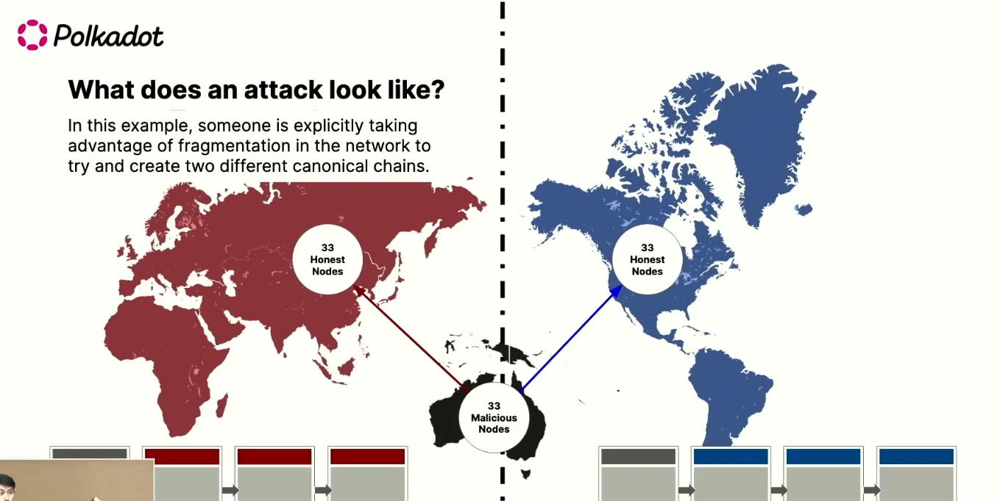  
<!--    -->

Światowe Forum Ekonomiczne (WEF) apeluje do światowych rządów o przyjęcie nowych celów związanych z zieloną agendą, które znacząco zmniejszą liczbę prywatnych samochodów. WEF naciska na szokujący cel redukcji prywatnej własności samochodów, w tym pojazdów elektrycznych, o aż 75% do roku 2050.
Redukcja aut o 75%.

Organizacja Światowego Forum Ekonomicznego (WEF) twierdzi, że do 2050 roku większość światowej populacji będzie mieszkać w miastach, co skutkować będzie ograniczeniem potrzeby posiadania prywatnych samochodów i korzystania z komercyjnych podróży lotniczych. Według raportu opublikowanego przez Wall Street Journal, WEF przedstawiło te nowe postulaty w dokumencie informacyjnym zatytułowanym "Narzędzie karty wyników mobilności miejskiej: analiza porównawcza przejścia do zrównoważonej mobilności miejskiej"

---

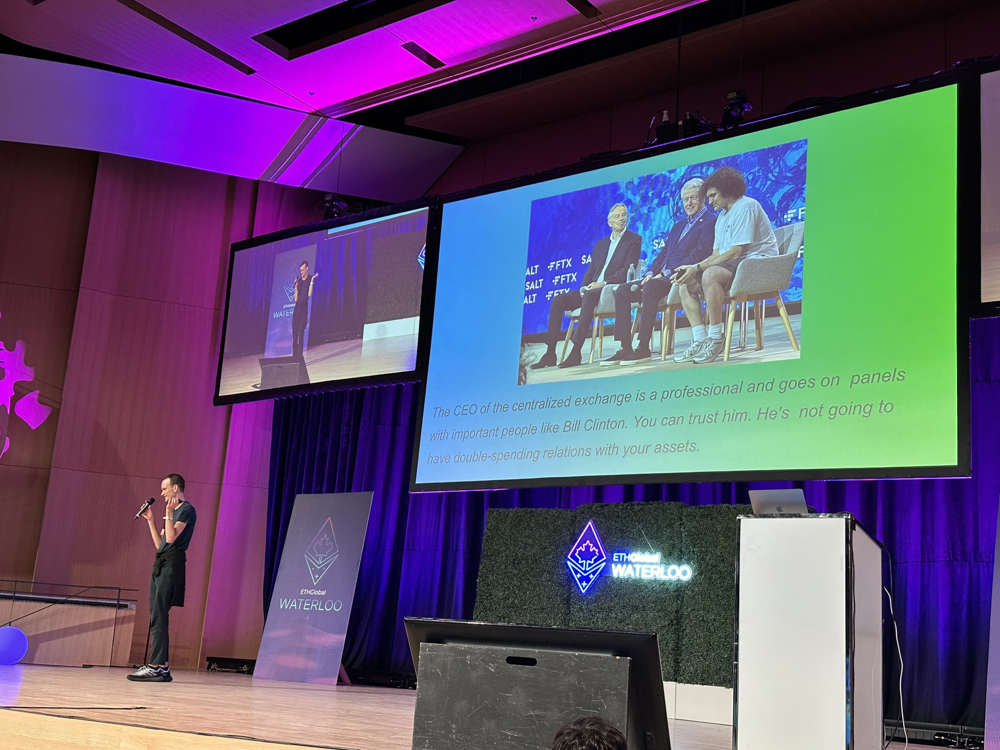  

> The CEO of the centralized exchange is a professional and goes on panels with important people like Bill Clinton. You can trust him. He's not going to have double-spending relations with your assets.

---

### 2021

Dziwne chmury

  

---

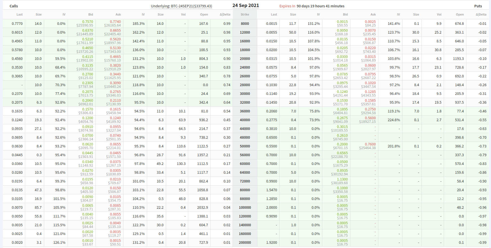  

---

### 2020

Austria, kraj 65-letni, sprzedala w 2016 obligacje rzadowe o zapadalnosci 70 lat. A teraz, po raz 2 w ciagu 3 lat, uplasowala na rynku papiery 100-letnie za 2 mld EUR z kuponem 0.88%, przy popycie rzedu 17.7 mld EUR. W 2017 za analogiczna serie musiala zaoferowac inwestorom az 2.0%. Ale po wzroscie cen rentownosc spadla i tu do 0.85%.

Problemem w przypadku emisji tak dlugich papierow jest oczywiscie ryzyko wysokiej zmiennosci cen. Ale w obecnych warunkach rynkowych, przy benchmarkowych Bunds dajacych -0.43%, wielu inwestorow instytucjonalnych gotowych jest brac i takie ryzyko.

Warunkiem uplasowania na rynku 100-letnich papierow rzadowych po dobrej cenie jest, oczywiscie, duza wiarygodnosc emitenta. Skala wzrostu potrzeb pozyczkowych, na co wskazuje przyklad Austrii, ktora wlasnie je teraz podwaja, nie ma znaczenia.

Z pewna ostroznoscia szacujac wiek naszego kraju, mozna zaryzykowac twierdzenie, ze jestesmy od wspolczesnej Austrii rocznikowo starsi, choc ustrojowo mlodsi. Tak, czy siak, gorzej z nasza wiarygodnoscia. Tutaj wciaz raczkujemy. No, i jestesmy dumni ze swojego zlotego, co niesie ze soba niestety pewnie niedogodnosci w postaci ryzyka kursowego. A to rzecz dosc wazna przy emisji dlugu.
Dlatego na stulatki innych mozemy sobie tylko popatrzec.

---

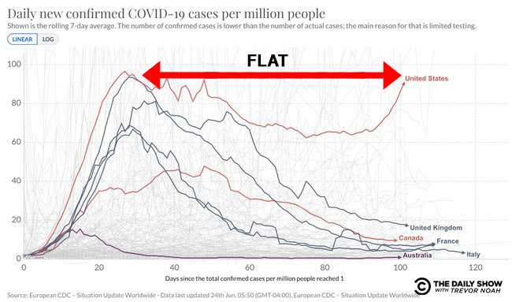  

---

### 1998

Przy ulicy Rzymowskiego w Warszawie zastrzelony został komendant główny policji Marek Papała.
Wydarzenie to miało miejsce w czasie jego powrotu do domu z przyjęcia u emerytowanego generała Ministerstwa Spraw Wewnętrznych Józefa Sasina, na którym był również znany i wpływowy polonijny biznesmen Edward Mazur, którego postać ma w tej sprawie kluczowe znaczenie. To on miał początkowo proponować Papale podwiezienie do domu, co spotało się z odmową popartą tłumaczeniem wyjazdu po matkę na Dworzec Centralny. Na skutek opóźnienia pociągu Papała zdecydował się na powrót do domu, w okolicach którego sprawca oddał strzał w tył jego głowy.
W wyniku śledztwa ustalono w pierwotnej wersji, iż podejrzanym o zlecenie morderstwa jest wspomniany Edward Mazur, a wykonawcą Ryszard Bogucki skazany wcześniej za zabójstwo gangstera Andrzeja Kolikowskiego ps "Pershing". W lutym 2010 roku w Sądzie Okręgowym w Warszawie odbyła się kolejna rozprawa w sprawie zabójstwa generała, na ławie oskarżonych zasiedli Andrzej Zieliński ps. Słowik i Ryszard Bogucki. Dwa lata później łódzka Prokuratura Okręgowa ustaliła, iż generał Papała padł ofiarą złodziei samochodów, a mordercą był 24 letni wówczas pruszkowski gangster Igor Ł.
W kwietniu 2013 roku po wniosku prokuratury apelacyjnej w Łodzi prokurator generalny przedłużył do końca października 2013 roku śledztwo w sprawie zabójstwa generała Marka Papały. Równolegle w tym czasie przed Sądem Okręgowym w Warszawie trwał proces sądowy, w którym Ryszard Bogucki i Andrzej Zieliński, ps. „Słowik”, zostali oskarżeni o nakłanianie do zabójstwa gen. Marka Papały. 31 lipca 2013 roku zapadł nieprawomocny wyrok uniewinniający obu oskarżonych.

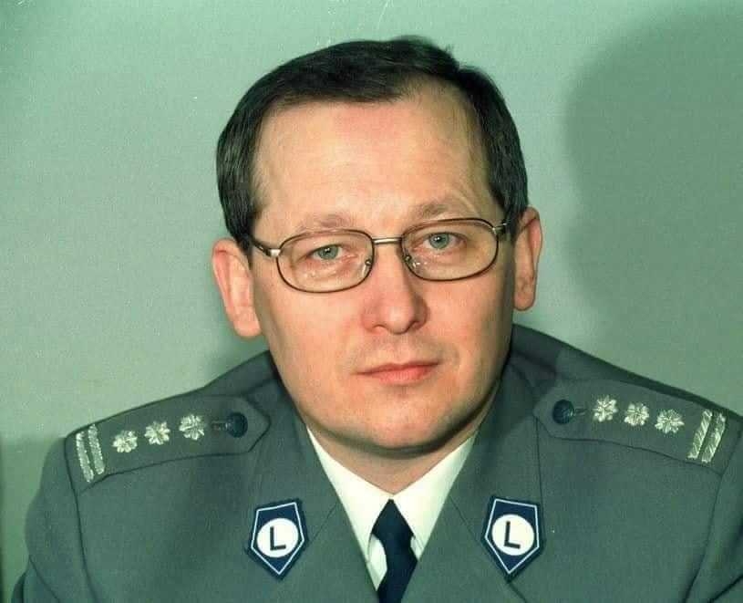  

Requiescat in pace!

Bossowie Polskich mafii zapytani o zabójstwo generała, Czy to ktoś z waszego środowiska: Pruszków, Wołomin? odpowiadają: '' My byliśmy mafią trzepakową, byliśmy za ciency aby zabić Generała, to ktoś zewnątrz. Papała coś wiedział na temat USA, kula przyszła stamtąd.

### 1976

W Radomiu wybuchły protesty,w których udział wzięło około 20 tysięcy osób. Przyczyną tych rozruchów była zapowiedziana dzień wcześniej przez premiera Piotra Jaroszewicza podwyżka cen żywności,mięsa i wędlin opiewająca od 70 do 150 procent.
Władze, planując tę podwyżkę uwzględniły możliwość protestów i przygotowały się do nich,ale pod uwagę brano Kraków, Warszawę lub Gdańsk. Protestów w Radomiu nie przewidziano.
Punktem zapalnym okazały się być Zakłady Metalowe "Łucznik", których pracownicy tego dnia przystąpili do strajku. Rozruchy nabrały takiego tempa, że już w południe protestujacy dotarli pod siedzibę KW PZPR.
Protestujący, do których później dołączyli również studenci i zwolnieni do domu pracownicy, którzy stawili się do pracy na drugą zmianę rozpoczęli starcia uliczne z jednostkami milicji i ZOMO, które rozpoczęły pacyfikację demonstracji. Próbowali również podpalić budynek Urzędu Wojewódzkiego oraz Biura Paszportów KW MO. Walki trwały do godz. 21:00. O godz. 20:00 rząd wycofał projekt podwyżek.

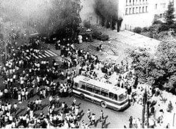  

### 1942

Ppłk Stanisław Skarżyński (grafika) wystartował na bombowcu Wickers Wellington MK II nr 8528 w swój ostatni lot bojowy. Celem wyprawy 1 000 samolotów alianckich była Brema. Niemiecka obrona przeciwlotnicza na trasie i nad miastem była bardzo silna. Przed dotarciem do celu wyprawy maszyna została kilkakrotnie trafiona, a odłamki pocisków raniły Skarżyńskiego w obie nogi. Samolot dotarł jednak do celu, po zrzuceniu bomb zawrócił, biorąc kurs do bazy. W drodze powrotnej pilotowany przez Skarżyńskiego samolot ulega awarii i przymusowo woduje w odległości 25 km od Great Yarmouth w Norfolk. SKARŻYŃSKI posadził samolot na falach i dał rozkaz do opuszczenia maszyny przez załogę. Czterej jej członkowie uratowali się korzystając z gumowej łodzi ratunkowej.
Skarżyński znalazł się, niestety, po przeciwnej niż łódź ratunkowa stronie kadłuba samolotu. To uniemożliwiło wszelki ratunek pilota - inwalidy. Ciało bohatera zostało wyrzucone przez morze na holenderską wyspę Terschelling. Zwłoki znaleźli Niemcy i
przekazali mieszkańcom jedynego na tej
wyspie miasta West, a ci pochowali je z
honorami na miejscowym cmentarzu w mogile
nr 62.

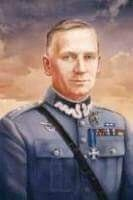  

---

Utworzono
karną kompanię (Strafkompanie) kobiet w miejscowości Budy oddalonej od Auschwitz,
obozu macierzystego ok. 7 km. Pierwszą kierowniczką obozu karnego w
Budach została SS-Aufseherin Elfrieda Runge. Obóz był pilnowany przez 25
esesmanów ze specjalnie wytresowanymi psami.
Na początku do Bud skierowano 200 Polek przybyłych z Krakowa
transportami dnia 27 kwietnia i 28 maja 1942 roku. Mieszkały one w
budynku szkolnym ogrodzonym płotem z drutu kolczastego.Spały w
piwnicach, dodatkowym bunkrze i na strychu. Spały na słomie i trocinach.
W późniejszym czasie do Bud dołączyły inne więźniarki: Niemki, Żydówki
ze Słowacji, a później Żydówki ze Francji. Łącznie 400 więźniarek. Były
one zatrudnione przy oczyszczaniu i pogłębianiu stawów oraz przy
robotach ziemnych nad Wisłą. Dnia 16 sierpnia 1942 przeniesiono do nowo
utworzonego obozu żeńskiego w Brzezince 137 więźniarek z Bud i
umieszczono je w bloku nr 2. W Budach rządy terroru sprawowały elementy
kryminalne. Latem 1942 r. (według innych źródeł w pierwszych dniach
października 1942 r.) wybuchł tam bunt maltretowanych więźniarek, krwawo
stłumiony przez kapo- zawodowe przestępczynie. W toku przesłuchań w
1946 roku Rudolf Höss wyjaśnił, że w czasie buntu więźniarki za pomocą
kamieni i drągów zaatakowały kapo i wyłamać się z obozu. Akcją kierowały
Żydówki francuskie, które w tym czasie stanowiły większość załogi
obozu. W czasie bójki, która się wywiązała między więźniarkami
funkcyjnymi a więźniarkami francuskimi, zginęło 90 więźniarek
francuskich. Akcja miała miejsce późną nocą. Francuzki zostały
zakatowane na śmierć drągami, siekierami, niektóre miały zupełnie
oderżnięte głowy. Z walki wyszły zwycięsko funkcyjne. Były to same
Niemki - tak zwane ,,zielone więźniarki'' na ogół prostytutki
wielokrotnie notowane, często kobiety budzące wstręt. W toku dochodzeń
ustalono, że strażnicy przerzucali przez ogrodzenie funkcyjnym
przestępczyniom zawodowym swoje pałki.
24 października 1942 roku sanitariusz SS Josef Klehr zabił dosercowymi
zastrzykami z fenolu 6 więźniarek, które brały udział w buncie. Zapisał
to w swoim pamiętniku obozowym doktor SS-Johann Kremer. ,,Zielone''
więźniarki, czyli element kryminalny były szczególnego rodzaju. W
Ravensbrück na polecenie Himmlera wyszukano dla Oświęcimia najgorszy
element tych więźniarek. Jednak nawet wśród ,,zielonych'' znalazły się
kobiety, które okazywały litość więźniarkom, za co prześladowały je ich
towarzyszki.

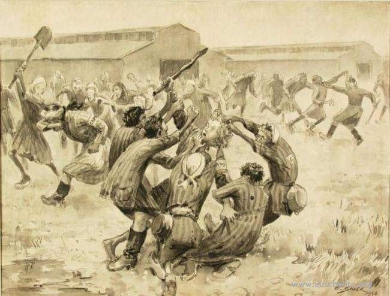  

Obraz: Bunt w Budach 1942 r.
Autor: Władysław Siwek
Zbiory Państwowego Muzeum Auschwitz-Birkenau.

---

### 1941

Stworzymy milicję, która pomoże w usunięciu Żydów"
Tak o planach powołania w Małopolce i Galicji specjalnej formacji ukraińskiej pisał 25 czerwca 1941 roku w liście do Stepana Bandery, premier rządu powołanej do życia kilka dni później Republiki Ukraińskiej Jarosław Stećko (zdjęcie).
Niejako kontynuacją tego listu były słowa Reinharda Heidricha wypowiedziane 29 czerwca 1941 roku czyli na dzień przed wkroczeniem do Lwowa Wermachtu. Powiedział on wówczas:
"Nawiązując do moich wypowiedzi z 17 czerwca w Berlinie przypominam: dążeniom kręgów antykomunistycznych i antyżydowskich do dokonania przez nich czystek na przewidzianych do okupacji terenach nie należy stawiać przeszkód. Wręcz przeciwnie, należy je, oczywiście bez pozostawiania śladów, wywoływać, intensyfikować, a także, o ile to konieczne, nadawać im właściwy kierunek, by uniemożliwić owym miejscowym >grupom Selbstschutzu< późniejsze powoływanie się na czyjeś zarządzenia lub czynione obietnice polityczne".

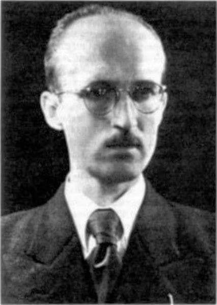  

### 1921

W Bierach w powiecie bielskim urodził się Józef Kołodziej " Wichura" (zdjęcie) podporucznik, grupowy, szef grup leśnych, członek sztabu ds. propagandy Zgrupowania Partyzanckiego „Bartka” VII Górnośląskiego Okręgu NSZ, autor wierszy.
Pochodził z rodziny o bardzo bogatych tradycjach patriotycznych. Wybuch drugiej wojny światowej skomplikował jednak bardzo jego losy. Brat Antoni- nauczyciel, za odmowę podpisania volkslisty trafił do obozu Sachsenhausen, matka- obawiając się podobnego losu zdecydowała się na podpisanie DVL, zaś on sam wstąpił do 213. Batalionu Wehrmachtu.
Nie znamy dokładnie jego losów, ale wiemy, że po zakończeniu działań wojennych uniknął niewoli i zamieszkał u ciotki w Bielsku.
W roku 1945 wstąpił do Narodowych Sił Zbrojnych, awansował do stopnia plutonowego, został dowódcą grupy działającej w okolicach Błatniej. Dał się poznać jako bardzo zdolny dowódca i specjalista od "misji niemożliwych".
Został aresztowany przez Urząd Bezpieczeństwa Publicznego 27 października 1946 roku w Chorzowie. 14 grudnia 1946 roku obradujący podczas sesji wyjazdowej w Będzinie Wojskowy Sąd Rejonowy w Katowicach skazał go na karę śmierci. Wyrok wykonano 31 grudnia 1946 roku.

"Przesłuchanie"
Ojcze, coś umarł kiedy byłem dzieckiem
Matko, coś kryła mnie przed wojny biczem
A wojna Ci mnie wzięła w okopy niemieckie
I jak ma teraz stanąć przed braci oblicze

Porwałem znów za broń, dla mnie nie za wcześnie
I zbieram dziś burzę, gdy wichurę siałem
Żegnajcie mi najbliżsi, wy bracia leśni
Których, przeczuwam, w świat lepszy wysłałem

Za pociski w czerwonych-pocisk mnie nie minie
Za ślub pod świerkiem z "Milką" -udręka w Jej głosie
Za defiladę w Wiśle-konwejer w Będzinie
Za gwiazdkę oficerską-ślad po papierosie

Józef Kołodziej "Wichura"

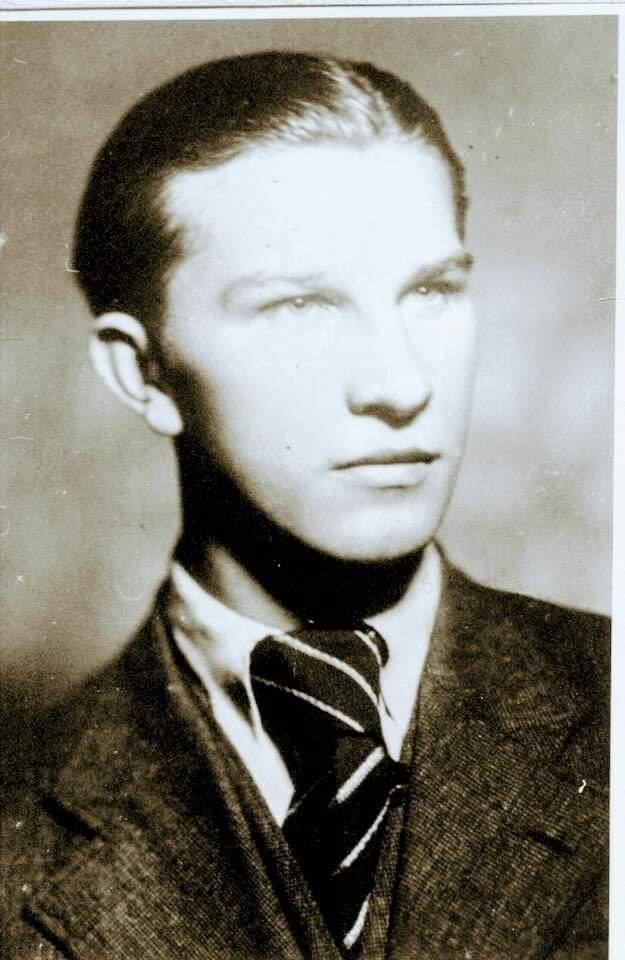  

### 1903

W wyborach do Reichstagu posłem z okręgu Katowice-Zabrze został Wojciech Korfanty, pierwszy polski poseł z Górnego Śląska.

Wojciech Korfanty, (1873-1939), działacz polityczny i społeczny na Śląsku, publicysta; w latach 1903-1912 i w 1918 poseł w Reichstagu oraz pruskim Landtagu (1903-1918); od 1919 komisarz Naczelnej Rady Ludowej w Poznaniu; w 1920 mianowany komisarzem plebiscytowym na Górnym Śląsku; jeden z przywódców powstań śląskich; od 1922 członek Chrześcijańskiej Demokracji i poseł na sejm (od 1931 obejmował funkcję prezesa Rady Naczelnej); 1923 wicepremier w rządzie Wincentego Witosa i jego doradca.; przeciwnik polityki Józefa Piłsudskiego; w 1930 uwięziony w Brześciu nad Bugiem wraz z posłami Centrolewu; od 1934 przebywał na emigracji; w 1936 roku współtworzył Front Morges; od 1937 był prezesem Stronnictwa Prawicy; w 1939 powrócił do Polski, gdzie został aresztowany na podstawie sankcji prokuratorskiej, lecz areszt opuścił trzy miesiące później z powodu złego stanu zdrowia; zmarł 17 sierpnia 1939 roku; pochowany na cmentarzu w Katowicach przy ulicy Francuskiej, zwanym "Śląskimi Powązkami".

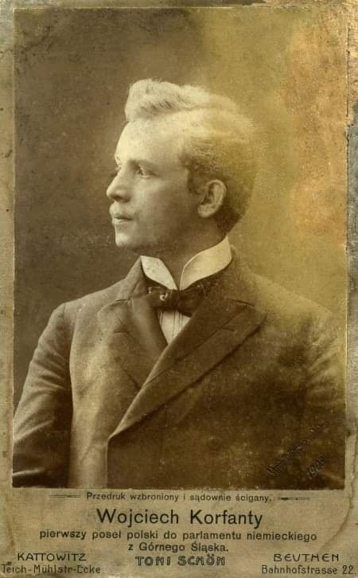  

### 1863

W czasie powstania styczniowego pod Bereżnikami liczący około 600 ludzi oddział słynnego "Wawra" - Konstantego Romotowskiego -
usiłował wymknąć się z obławy
zorganizowanej przez rosyjskiego
naczelnika wojskowego guberni suwalskiej, księcia Emila de Sayn ( zdjęcie) Wittgensteina.
Wittgenstein zgromadził ogromne, liczące kilka tysięcy żołnierzy siły, którymi otoczył Puszczę Augustowską, będącą głównym rejonem działania "Wawra", zamykając powstańcom drogę ucieczki. W starciu pod Berżnikami poniosła porażkę przednia straż"Wawra", złożona z oddziałów Hłaski, Czempińskiego i Kołyszki. Powstańcy cofnęli się w głąb puszczy. 28 czerwca "Wawer" pobił duże siły Rosjan pod Gruszkami, następnego dnia jednak jego oddział został otoczony i rozbity w swoim obozie w uroczysku Kozi Rynek.

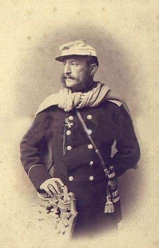  

### 1736

Rozpoczęły się obrady tak zawanego Sejmu Pacyfikacyjnego, które były zwięczeniem trwającej na terenie Rzeczpospolitej trzy lata wojny domowej, która na skutek kryzysu w sprawie wyboru nowego władcy wybuchła po śmierci króla Augusta II Mocnego.
Podział szlachty na zwolenników Augusta III Sasa (grafika) oraz wojewody poznańskiego Stanisława Leszczyńskiego doprowadził do kuriozalnej sytuacji jednoczesnego wyboru obu na władcę Polski, co w efekcie doprowadziło do wojny. Ogłoszony 5 października 1733 roku na skutek rosyjskiej interwencji nowym królem Polski August III Sas, a koronowany na Wawelu trzy miesiące później, zwłołał wspomniany już Sejm Pacyfikacyjny, według postanowień którego zobowiązał się do przestrzegania praw i wolności szlacheckich, oraz potwierdził utrzymywanie ustroju Rzeczypospolitej w dotychczasowej postaci. Król przyrzekł także powszechną amnestię i podjęcie działań w celu wycofania wojsk rosyjskich z Rzeczypospolitej. Powołano także komisję, która miała przygotować projekty reform wojskowo-skarbowych, na kolejny sejm zwyczajny.

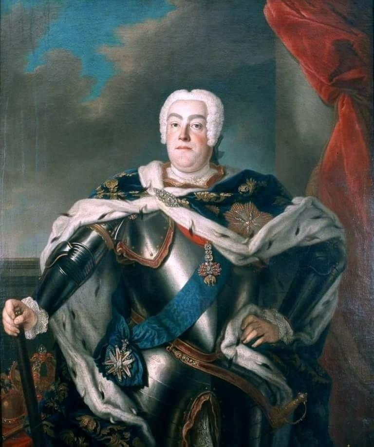  

---

<a href="https://github.com/TomaszWaszczyk/historia.waszczyk.com/edit/master/src/content/june-25.md" target="_blank">Edytuj tę stronę dzieląc się własnymi notatkami!</a>
