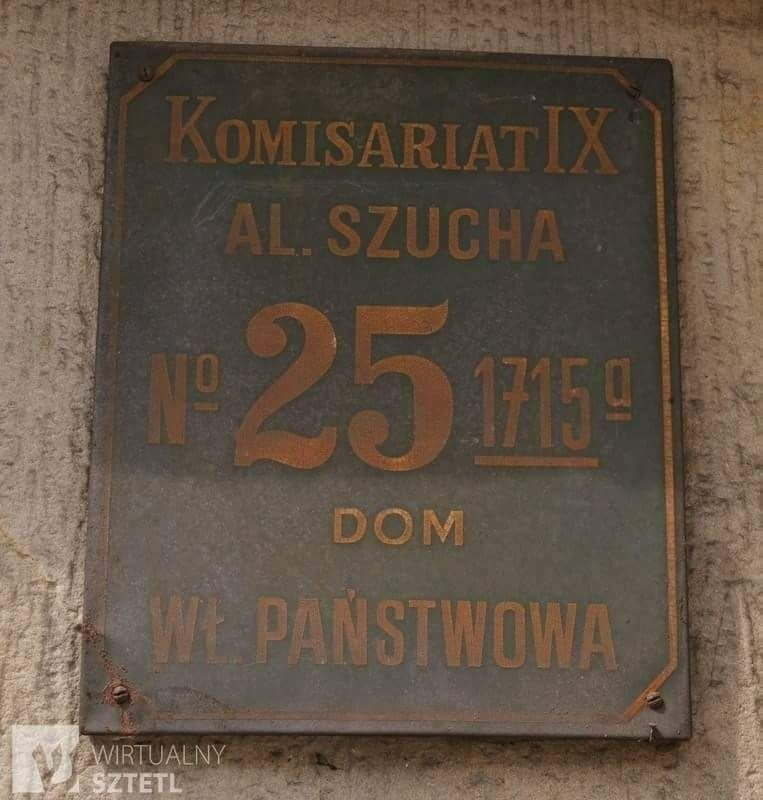

### 2020 - 白左

  

### 1953

https://en.wikipedia.org/wiki/Lavrentiy_Beria

---

W historii naszego kraju jest wiele postaci, które nie będąc Polakami odcisnęły piętno na losach naszego narodu.
26 czerwca 1953 roku został aresztowany szef OGPU,Ludowy Komisarz Spraw Wewnętrznych i bliski współpracownik zmarłego 3 miesiące wcześniej Stalina Ławrentij Beria. Padł on ofiarą spisku inspirowanego przez Nikitę Chruszczowa,Wiaczesława Mołotowa i Gieorgija Malenkowa.Berię uznano za agenta służb zachodnich,a pretekstem do tego miała być jego wizyta w NRD w trakcie rozgrywających się tam rozruchów.
Aresztowanie Berii wykonane na wniosek Chruszczowa miało miejsce podczas posiedzenia biura politycznego KC KPZR.
Jedna z takich hipotez głosi, że Beria był
inicjatorem i przywódcą udanego spisku na
życie Stalina. W skład spiskowców
wchodzić mieli jeszcze: Nikita Chruszczow ,
Malenkow i Bułganin. Stalina miano
zamordować za pomocą trucizny podanej w
zastrzyku przez jedną z lekarek. Choć
oficjalną przyczyną śmierci zbrodniczego
dyktatora Rosji Sowieckiej miał być wylew
krwi do mózgu, wiadomo, że przed śmiercią
wymiotował on krwią, co potwierdza
hipotezę mówiącą o celowym uśmierceniu
za pomocą trucizny.
Ławrentij Beria został stracony 23 grudnia 1953 roku.
Prowadzony na śmierć Ławrientij Beria
miał podobno błagać o litość i krzyczeć:
- Babę, babę mi dajcie! Ostatni raz!
Przypomnijmy- Beria jako jeden z najbliższych współpracowników Stalina był odpowiedzialny za śmierć setek tysięcy nie tylko polskich wrogów ZSRR.

  

---

### 1943

26 lub 29 czerwca UPA dokonała pogromu wsi Kolonia Górna w gminie Ludwipol w w województwie wołyńskim.
Wspomina 14 letnia wówczas Regina Falkowska:
" Kiedy usłyszałam strzały i przerażające krzyki ludzi, nie wiedziałam, gdzie mam iść i co robić, przez chwilę stanęłam i patrzyłam, co się działo. Wszystkie podwórka były gęsto zapełnione banderowcami :bili, rąbali siekierami, nożami, mordowali w okrutny sposób. Szli gęstym pasem, żywej duszy po sobie nic zostawiali, wszystko palili. Naraz usłyszałam głos mego stryjka, który wołał swego syna, żeby uciekał za nim, ale ten syn już nie zdążył uciec. Wtedy ja szybko podbiegłam do stryjka [Jana Wojdata], a było to w polu i wtedy ze stryjkiem uciekaliśmy przez pola, żeby gdzieś się można było skryć. Ale już nie było takiego miejsca, gdzie można się było skryć. Oni byli wszędzie. Poszliśmy do rzeki, była to rzeka Słucz, dość głęboka. Chcieliśmy przejść na drugą stronę rzeki, kiedy wyszliśmy na pół rzeki, a woda się-gała mi do brody, wtedy padł strzał z drugiej strony rzeki , widziałam jak zza krzaka [banderowiec] kierował do nas karabin. Naraz strzelił, ale strzał nie był trafny, kula chlupnę ta obok nas. Wyszliśmy z tej rzeki, udaliśmy się w kierunku skał i głębokich jarów, uważaliśmy, że ich tam nie ma. Kiedy wchodziliśmy do takiego jaru, naraz widzimy, może około 15 metrów przed nami, staje banderowiec, lufa karabinu skierowana do nas. I to już był dla nas koniec, nie było czasu do namysłu. Ja w tym momencie skręciłam w bok, zrobiłam takie jakby półkole, weszłam między kamienie, skuliłam się, oczy zamknęłam, żeby nie widzieć tego, co będzie w pierwszej chwili robić ze mną, żeby nie widzieć noża albo siekiery. W tym momencie strzelił do stryjka, naraz stryjek upadł, jeszcze chwilę jęczał i po chwili skonał, było to tuż koło mnie. Wszystko słyszałam, ale oczy nadal miałam zamknięte, naraz słyszę, że chodzi wkoło mnie, a byt to już zmrok, a z tamtej strony rzeki banderowiec widział, gdzie ja weszłam i woła na tego, który mnie szuka, i kieruje go gdzie ma iść, i [ten] tak nadal chodzi wkoło mnie. Słyszę wyraźnie jego chodzenie. I do dziś wierzę tylko w to, że to było przeznaczenie, że to była mocna ręka, że mu oczy zasłoniła, bo przecież chodził wkoło mnie i szukał. Ja w tej skale przesiedziałam całą noc, bo oni tam byli całą noc, i następny dzień, i ja nie mogłam wyjść z tej kryjówki. A następnego dnia, gdzieś koło południa, wyskoczyłam z tej skaty i przybiegłam do swego domu, i co zobaczyłam: dom spalony i wszystkie budynki. I nie spotkałam ani jednej żywej osoby, tylko pomordowani leżeli jak snopy po polu. I stanęłam przerażona pod gołym niebem bez rodziny, bez dachu nad głową. Wtedy ogarnął mnie jeszcze bardziej przeraźliwy strach. Nie wiedziałam, co mam z sobą zrobić, i pobiegłam w pole między zboża, i w tym polu siedziałam do wieczora. Szukałam swojej rodziny i nigdzie nie znalazłam. Tylko spotkałam sąsiada i sąsiadkę, i przyłączyłam się do nich. W nocy wyszliśmy, [aby] iść w kierunku Starej Huty [gm. Ludwipol]. Szliśmy przez las całą noc, następnego dnia, a właściwie to już trzeciego dnia [od napadu], byliśmy w Starej Hucie. W tym czasie w Starej Hucie stacjonował oddział samoobrony. Kiedy doszliśmy, partyzanci mieli już przygotowane wozy, kazali siadać i jechać z nimi na Górną kolonię i odnaleźć [kogoś], może jeszcze ktoś żyje i pochować pomordowanych. Niełatwe to było zadanie, bo było zaledwie kilkunastu żołnierzy, a w każdej chwili można się było spodziewać lawiny banderowców. Nic udało nam się pochować wszystkich w jednej mogile, tylko część została złożona do jednego dołka, a reszta [tam], gdzie kto leżał zabity, tam go przygrzebali piaskiem i tak to pozostało do dziś, i do dziś te kości leżą porozrzucane po polu. Okropny szok przeżyłam, kiedy odnalazłam swoją rodzinę pomordowaną. Przerażający to był widok dla mnie, kiedy zobaczyłam, jak moi Rodzice, Siostra i Brat leżą pomordowani, a Siostra żywcem spalona w stodole. Nie mogłam się z tym pogodzić, za co ich zamordowano. To się nie da opisać, jak ja przeżywałam. To było straszne. Rodzice w tym czasie, kiedy nastąpiło morderstwo, schowali się do piwnicy, ale kiedy zaczęło się palić mieszkanie, oni wyszli z piwnicy i uciekali do lasu, ale nie zdążyli się skryć, zostali pomordowani. Opowiadał mi o Rodzicach naoczny świadek Wilczyński Jan, który byt razem z moimi Rodzicami i on ocalał. A ja zostałam sierotą (w wieku lat 14), bez Rodziców i Rodzeństwa, bez dachu nad głową, i bez jakichkolwiek środków do życia. I nadal tak pozostałam w Starej Hucie. Chodziłam jak obłąkana, chociaż ludzie dali mi co mieli do zjedzenia, ale ubrać się nie miałam w co, bo wszystko zostało spalone. Po kilku dniach mego pobytu w Starej Hucie zjawił się oddział partyzancki, którym dowodził Władysław Kochański, ps. Bomba który stacjonował w Starej Hucie. Spotykałam kilka razy wielu znajomych, którzy byli w tej partyzantce i proponowali mi, żebym wstąpiła do tej partyzantki. Co miałam robić i gdzie iść, zgodziłam na to. Przyjęto mnie do plutonu gospodarczego, w którym dowódcą był Pawełczak Franciszek. Ja w tym plutonie naprawiałam odzież i pomagałam w kuchni. W czasie większych walk opiekowałam się rannymi. Ja w tym oddziale "Bomba" byłam od lipca 1943 r. do grudnia 1943 r. W grudniu 1943 r. podczas przenoszenia mojego plutonu w inną miejscowość, musiałam pozostać w Starej Hucie, ponieważ zachorowałam na tyfus. Długo i ciężko chorowałam, bo nie było lekarstw, nie było lekarzy, ani jeść nie było co, nie było żadnych środków do prania, panował świerzb i wszawica. Niełatwe to było życie do końca wojny. Walki trwały nadal. Byliśmy bardzo często atakowani przez Niemców, a najczęściej przez bandy UPA, bez żywności i leków zmożeni ciężkimi chorobami. W tym też czasie odnalazł mnie mój Wujek, z którym przyjechałam na Ziemie Odzyskane."
Poniżej wspomnienia innego świadka:
" Między Polakami i Ukraińcami w kolonii Górnej ( gmina Ludwipol, powiat Kostopol ) nie było nieporozumień, tym bardziej zatargów [...]. Ukraińcy jako prawosławni chodzili do cerkwi w pobliskim Hubkowie, natomiast Polacy do kościoła w Ludwipolu, oddalonego o około siedem kilometrów. Idąc do Ludwipola, przechodziliśmy przez czysto ukraiński Hubkow, ale nigdy nie spotkaliśmy się tam z oznakami wrogości czy zaczepkami. [...] Było już słychać o mordowaniu polskich wiosek na północny zachód od Ludwipola. Obawialiśmy się ataku i na noc kryliśmy się po polach."

  

### 1942

Gdyni został nadany herb. Była to druga próba nadania symbolu miastu, którego niemiecka nazwa brzmiała Gotenhafen. Symbolem miasta została praca autorstwa Otto von Schicka przedstawiająca biały statek Gotów na błękitnym tle z zawieszonymi na burcie tarczami ze swastykami.
Jeden z projektów przedstawiający czarnego orła stojącego na kotwicy oraz swastykę w srebrnym kole został odrzucony przez samego Adolfa Hitlera.

  

### 1941

TEKST ŹRÓDŁOWY
Donos napisany przez Polaka do gestapo w Warszawie (zachowano interpunkcję, ortografię i stylistykę oryginału)
Do Zarządu policji Niemieckiej Gestapo Warszawa ul. Al. Szucha 25 Święta prawda Boję się podpisywać bo policja polska jak się dowiedziała to mnie zamordowałab sama
Wielce Szanowni Panowie, W dniu 26 czerwca 1941 roku będąc na ulicy Ceglanej stając w domu przy tejże samej ulicy pod N 6 i 4 zauważyłem jak polscy policjanci pilnują żydowskiego Gietta które znajduje się na tej że ulicy. Nie dość że całe grupy ludzi podają Żydom rozmaite paczki tubołki mleko w butelkach, bochenki chleba, a anwet dostarczają większy szmugiel workami. Podjechał wózek rowerowy na którym było 6 worków kaszy czy mąki, przy tym wózku było 4 mężczyzn podjechali do parkanu od strony gdzie znajduje się dom firmy Ulrycha, Żydzi zaraz podstawili stół a ci panowie którzy przywieźli te 6 worków podali Żydom przez parkan i spokojnie sobie z powrotem pojechali do ul. Żelaznej Za kilka minut przyjechał drugi wuzek na którym było 5 worków towaru i tą samą drogą poszedł do Żydów przez parkan, nie dość idzie wielki szmugiel, który jest dostarczany przez polaków, to co chwila przechodzą przez parkan rozmaite podejrzane osobistości. A ci panowie którzy wózkami dostarczają Żydom rozmaitej żywności, stale sobie siedzą w podejrzanej kawiarence na ul. Żelaznej N 55 piją sobie wódkę z polskiemi policjantami. Zwróciłem się do jednego z policjantów i powiedziałem, że 3ch policjantów pilnuje, żeby nie szedł szmugiel a wy zamiast łapać szmuklerów to jeszcze ułatwiacie im. Zapamiętał numer tego policjanta 322. Proszę o sprawdzenie z jakiego komisarjatu byli dyżurni dnia 26/41 pomiędzy godziną 8/9 rano. Polska policja nigdzie nie robi nic tylko darmo pobiera pieniądze. Tych panów warto było dawno wysłać do Westfalii kopać węgiel to nie anonim a święta prawda jest.

  

### 1940

W Londynie odbyło się pierwsze posiedzenie rządu polskiego na emigracji.
Uczestniczyli w nim: Sikorski, Sosnkowski,
Zaleski, Strasburger, Stroński, Stańczyk i w
zastępstwie Hallera podsekretarz Karol
Popiel. Sikorski zaczął od zreferowania
swoich rozmów z Churchillem, a następnie
zapowiedział redukcję aparatu rządowego.
Według wstępnego projektu miałyby
pozostać jedynie: Prezydium Rady
Ministrów, MSZ, Ministerstwo Skarbu oraz
Informacji i Dokumentacji. Przeciwko
projektowi wystąpił Jan Stańczyk szef
przewidywanego do likwidacji Ministerstwa
Opieki Społecznej.
Obrady zaczęły się od przemówienia premiera Sikorskiego, który powiedział:
"Nie rozwałkowywać zbytnio spraw
związanych z ostatnią przeszłością, których
ocenę zostawić należy lepszej chwili. Sam
gotów jest wiele puścić w niepamięć, pod
warunkiem jednak, że wszyscy sami z sobą
zrobią właściwy rachunek sumienia".
Dwa dni później Rada Ministrów powróciła
do sprawy reorganizacji rządu. Tym razem
rozwinięty projekt przedstawił Sosnkowski,
zapowiadając zniesienie Ministerstwa Spraw
Wojskowych (jego agendy miał przejąć sztab
naczelnego wodza), Ministerstwa
Sprawiedliwości i Ministerstwa Opieki
Społecznej, których zakres działania miały
przejąć stosowne referaty w Prezydium
Rady Ministrów.

  

### 1579

Król Polski Stefan Batory wypowiedział wojnę Moskwie.
Przyczyną tej decyzji były imperialne plany tego kraju, który chciał zagarnąć Inflanty.
Wypowiedzenie to było w zasadzie tylko formalnością, ponieważ wojska rosyjskie cara Iwana IV Groźnego już od blisko czterech lat wcześniej okupowały wspomniane tereny, dopuszczając się tam licznych zbrodni i gwałtów.
Na ten stan rzeczy nie mógł spokojnie patrzeć polski władca, który, by rozbudować i unowocześnić armię zdecydował się na podniesienie podatków, co w krótkim czasie poskutkowało stworzeniem blisko 60 tysięcznego wojska, które miało stawić czoła Rosjanom.
Wojna o Inflanty rozpoczęła się oblężeniem przez armię Batorego, Połocka 11 sierpnia 1579 roku, który padł po 18 dniach.
Rok 1580 był dla Polaków pasmem kolejnych militarnych sukcesów, ponieważ to wtedy udało im się pokonać kilka razy wojska rosyjskie. Jednym ze spektakularnych polskich zwycięstw było to odniesione pod Toropcem, kiedy to wojsko polskie pod dowództwem księcia Janusza Zbaraskiego rozbiło dwukrotnie silniejszą kawalerię rosyjską.
Trzecia faza tej wojny czyli lata 1581-82 to działania w rejonie Pskowa, gdzie w dorzeczu górnej Wołgi walczyły wojska hetmana Krzysztofa Radziwiłła, którym omal nie udało się schwytać samego cara. Oblężenie miasta trwało 5 miesięcy i niestety nie zakończyło się polskim sukcesem. Nie było to jednak przeszkodą w odniesieniu przez Polaków błykotliwego zwycięstwa w tej wojnie, która zakończyła się odzyskaniem przez Polskę Inflant i podpisaniem 10 letniego rozejmu.

  

---

<a href="https://github.com/TomaszWaszczyk/historia.waszczyk.com/edit/master/src/content/june-26.md" target="_blank">Edytuj tę stronę dzieląc się własnymi notatkami!</a>
